<div align="center">


## **Universidad Peruana de Ciencias Aplicadas**
### Carrera de Ingeniería de Software
<br>

**1ASI0729**

**Curso: Desarrollo de Aplicaciones Web**

**NRC: 8137**

**Docente: Mori Paiva, Hugo Allan**
<br>

### **Informe del Trabajo Final**

**Nombre de la Startup:** AgriDron Solutions

**Nombre del producto:** AgriDron
<br>

### **Integrantes**

| **Código** |       **Apellidos y Nombres**        |
|:-----------:|:------------------------------------:|
| U202512856 |      Jara Espinoza Miguel Angel      |
| U202512856 |     Nicho Huillcañahui Edwin Noe     |
| U202420249 | Choquehuanca Vasquez Alejandro Samir |
| U202421392 |  Damacen Galindo, Italo Gianfranco   |
| U202222473 |   Vasquez Roncal, Alexander Felipe   |


<div align="center">
<b><i>Septiembre, 2026</i></b>
</div>
</div>


# Registro de Versiones del Informe

| Versión | Fecha      | Autor                                 | Descripción de modificación                                         |
|---------|------------|---------------------------------------|---------------------------------------------------------------------|
| 0.1     | 03/09/2026 | Jara Espinoza, Miguel Angel           | Initial commit                                                      |
| 0.2     | 03/09/2026 | Nicho Huillcañahui, Edwin Noe         | Added markdown files                                                |
| 0.3     | 03/09/2026 | Choquehuanca Vasquez, Alejandro Samir | Added anexos.md file                                                |
| 0.4     | 03/09/2026 | Jara Espinoza, Miguel Angel           | Initial project documentation and versioning records                |
| 0.5     | 03/09/2026 | Jara Espinoza, Miguel Angel           | Startup Profile                                                     |
| 0.6     | 03/09/2026 | Vasquez Roncal, Alexander Felipe      | Actualización de carátula                                           |
| 0.7     | 03/09/2026 | Damacen Galindo, Italo Gianfranco     | Solution Profile y análisis de problemática                         |
| 0.8     | 03/09/2026 | Jara Espinoza, Miguel Angel           | Lean UX Process                                                     |
| 0.9     | 03/09/2026 | Vasquez Roncal, Alexander Felipe      | Actualización preliminar de entrevistas                             |
| 1.0     | 03/09/2026 | Jara Espinoza, Miguel Angel           | Lean UX Canvas                                                      |
| 1.1     | 03/09/2026 | Vasquez Roncal, Alexander Felipe      | Registro de integrante                                              |
| 1.2     | 03/09/2026 | Nicho Huillcañahui, Edwin Noe         | Perfil de integrante                                                |
| 1.3     | 04/09/2026 | Jara Espinoza, Miguel Angel           | Actualización del Capítulo I                                        |
| 2.1     | 04/09/2026 | Jara Espinoza, Miguel Angel           | Lean UX Assumptions y resultados                                    |
| 2.2     | 05/09/2026 | Choquehuanca Vasquez, Alejandro Samir | Correcciones de Lean UX Canvas                                      |
| 2.3     | 05/09/2026 | Choquehuanca Vasquez, Alejandro Samir | Estructura inicial del Capítulo II                                  |
| 2.5     | 06/09/2026 | Jara Espinoza, Miguel Angel           | User Personas y actualización del registro                          |
| 2.6     | 06/09/2026 | Nicho Huillcañahui, Edwin Noe         | Infografías de User Personas                                        |
| 2.7     | 06/09/2026 | Jara Espinoza, Miguel Angel           | User Journey Mapping                                                |
| 2.8     | 06/09/2026 | Vasquez Roncal, Alexander Felipe      | Big Picture Event Storming                                          |
| 2.9     | 06/09/2026 | Choquehuanca Vasquez, Alejandro Samir | User Task Matrix                                                    |
| 3.0     | 06/09/2026 | Jara Espinoza, Miguel Angel           | Finalización del contenido del Capítulo I                           |
| 3.1     | 06/09/2026 | Vasquez Roncal, Alexander Felipe      | Análisis competitivo y estrategias frente a competidores            |
| 3.2     | 06/09/2026 | Jara Espinoza, Miguel Angel           | Mejora del diseño del Lean UX Canvas                                |
| 3.3     | 07/09/2026 | Nicho Huillcañahui, Edwin Noe         | Estructura inicial de Requirements Specification                    |
| 3.4     | 07/09/2026 | Vasquez Roncal, Alexander Felipe      | Actualización del Capítulo II                                       |
| 3.8     | 08/09/2026 | Jara Espinoza, Miguel Angel           | User Stories y Product Backlog                                      |
| 3.9     | 08/09/2026 | Vasquez Roncal, Alexander Felipe      | Actualización de User Stories y Product Backlog                     |
| 4.0     | 08/09/2026 | Vasquez Roncal, Alexander Felipe      | Actualización del Capítulo II                                       |
| 4.1     | 08/09/2026 | Choquehuanca Vasquez, Alejandro Samir | Actualización de Ubiquitous Language                                |
| 4.2     | 08/09/2026 | Damacen Galindo, Italo Gianfranco     | Actualización de entrevistas                                        |
| 4.3     | 08/09/2026 | Nicho Huillcañahui, Edwin Noe         | Actualización de recursos gráficos de entrevistas                   |
| 4.4     | 08/09/2026 | Jara Espinoza, Miguel Angel           | Carga de archivos de apoyo                                          |
| 5.2     | 08/09/2026 | Vasquez Roncal, Alexander Felipe      | Actualización del registro de versiones                             |
| 6.3     | 09/09/2026 | Nicho Huillcañahui, Edwin Noe         | Actualización del Capítulo II                                       |
| 6.4     | 09/09/2026 | Jara Espinoza, Miguel Angel           | Carga de archivos de apoyo                                          |
| 6.6     | 09/09/2026 | Choquehuanca Vasquez, Alejandro Samir | Actualización del registro de versiones                             |
| 6.7     | 09/09/2026 | Nicho Huillcañahui, Edwin Noe         | Estructura inicial de Product Design                                |
| 6.8     | 09/09/2026 | Vasquez Roncal, Alexander Felipe      | Style Guidelines e Information Architecture                         |
| 6.9     | 09/09/2026 | Jara Espinoza, Miguel Angel           | Actualización del Capítulo III                                      |
| 7.0     | 10/09/2026 | Vasquez Roncal, Alexander Felipe      | Actualización del formato Markdown del Capítulo III                 |
| 7.1     | 10/09/2026 | Jara Espinoza, Miguel Angel           | Impact Mapping                                                      |
| 7.2     | 11/09/2026 | Vasquez Roncal, Alexander Felipe      | Design-Level Event Storming y Bounded Contexts                      |
| 7.3     | 11/09/2026 | Nicho Huillcañahui, Edwin Noe         | Diagramas de arquitectura Context, Container y Components           |
| 7.4     | 12/09/2026 | Jara Espinoza, Miguel Angel           | Actualización de apartados 4.3 a 4.4.1                              |
| 7.5     | 12/09/2026 | Vasquez Roncal, Alexander Felipe      | Reestructuración del Lean UX Canvas                                 |
| 7.6     | 12/09/2026 | Vasquez Roncal, Alexander Felipe      | Corrección de Lean UX Problem Statements                            |
| 7.7     | 12/09/2026 | Nicho Huillcañahui, Edwin Noe         | Actualización de Lean UX Hypothesis Statements                      |
| 7.8     | 12/09/2026 | Jara Espinoza, Miguel Angel           | Carga de archivos de apoyo                                          |
| 7.9     | 12/09/2026 | Jara Espinoza, Miguel Angel           | Actualización del Capítulo II                                       |
| 8.0     | 12/09/2026 | Vasquez Roncal, Alexander Felipe      | Actualización de recursos gráficos de Empathy Mapping               |
| 8.1     | 12/09/2026 | Jara Espinoza, Miguel Angel           | Mejora del Lean UX Canvas                                           |
| 8.2     | 12/09/2026 | Vasquez Roncal, Alexander Felipe      | Actualización del Capítulo IV                                       |
| 8.3     | 12/09/2026 | Jara Espinoza, Miguel Angel           | Database Diagrams                                                   |
| 8.4     | 12/09/2026 | Vasquez Roncal, Alexander Felipe      | Corrección de Database Diagram                                      |
| 8.5     | 12/09/2026 | Nicho Huillcañahui, Edwin Noe         | Correcciones de documentación                                       |
| 8.6     | 13/09/2026 | Choquehuanca Vasquez, Alejandro Samir | Carga de archivos de apoyo                                          |
| 8.7     | 13/09/2026 | Vasquez Roncal, Alexander Felipe      | Actualización del Capítulo II                                       |
| 8.9     | 13/09/2026 | Choquehuanca Vasquez, Alejandro Samir | Actualización del Capítulo I                                        |
| 9.0     | 14/09/2026 | Jara Espinoza, Miguel Angel           | UML Class Diagrams                                                  |
| 9.1     | 14/09/2026 | Choquehuanca Vasquez, Alejandro Samir | Carga de archivos de apoyo                                          |
| 9.2     | 14/09/2026 | Vasquez Roncal, Alexander Felipe      | Actualización de recursos de Wireflows                              |
| 9.6     | 14/09/2026 | Choquehuanca Vasquez, Alejandro Samir | Actualización del Capítulo IV                                       |
| 10.1    | 14/09/2026 | Jara Espinoza, Miguel Angel           | Web Applications Prototyping                                        |
| 10.2    | 17/09/2026 | Jara Espinoza, Miguel Angel           | Actualización del Capítulo V                                        |
| 10.7    | 18/09/2026 | Nicho Huillcañahui, Edwin Noe         | Actualización de Style Guidelines                                   |
| 10.8    | 18/09/2026 | Nicho Huillcañahui, Edwin Noe         | Corrección de Style Guidelines                                      |
| 10.9    | 18/09/2026 | Nicho Huillcañahui, Edwin Noe         | Referencias del Product Backlog                                     |
| 11.0    | 18/09/2026 | Jara Espinoza, Miguel Angel           | Eliminación de contenido desactualizado del Capítulo I              |
| 11.1    | 18/09/2026 | Vasquez Roncal, Alexander Felipe      | Reorganización del Capítulo I                                       |
| 11.2    | 18/09/2026 | Jara Espinoza, Miguel Angel           | Ubiquitous Language de VoltLab                                      |
| 11.3    | 18/09/2026 | Vasquez Roncal, Alexander Felipe      | Reestructuración del análisis competitivo                           |
| 11.4    | 18/09/2026 | Choquehuanca Vasquez, Alejandro Samir | Reorganización de contenido de los capítulos I y II                 |
| 11.5    | 18/09/2026 | Jara Espinoza, Miguel Angel           | Eliminación de contenido desactualizado de Requirements Elicitation |
| 11.6    | 18/09/2026 | Choquehuanca Vasquez, Alejandro Samir | Tabla de contenidos del Project Report                              |
| 11.7    | 18/09/2026 | Jara Espinoza, Miguel Angel           | Sprint Planning 1, Aspect Leaders y Execution Evidence              |
| 11.8    | 18/09/2026 | Vasquez Roncal, Alexander Felipe      | Actualización de Execution Evidence for Sprint Review               |
| 11.9    | 18/09/2026 | Jara Espinoza, Miguel Angel           | Resolución de conflictos del Capítulo V                             |
| 12.0    | 18/09/2026 | Jara Espinoza, Miguel Angel           | Software Deployment Evidence for Sprint Review                      |
| 12.1    | 19/09/2026 | Vasquez Roncal, Alexander Felipe      | Eliminación de contenido desactualizado de capítulos I y II         |
| 12.2    | 19/09/2026 | Choquehuanca Vasquez, Alejandro Samir | Software Configuration Management                                   |
| 12.3    | 19/09/2026 | Nicho Huillcañahui, Edwin Noe         | Source Code Management                                              |
| 12.4    | 19/09/2026 | Jara Espinoza, Miguel Angel           | Source Code Style Guide & Conventions                               |
| 12.5    | 19/09/2026 | Nicho Huillcañahui, Edwin Noe         | Software Deployment Configuration                                   |
| 12.6    | 19/09/2026 | Choquehuanca Vasquez, Alejandro Samir | Sprint 1 Overview                                                   |
| 12.7    | 19/09/2026 | Choquehuanca Vasquez, Alejandro Samir | Team Collaboration Insights during Sprint                           |
| 12.8    | 19/09/2026 | Jara Espinoza, Miguel Angel           | Actualización del Capítulo V                                        |
| 12.9    | 08/10/2026 | Choquehuanca Vasquez, Alejandro Samir | Update to Chapter V                                                 |
| 13.0    | 09/10/2026 | Jara Espinoza, Miguel Angel           | Sprint Planning 2: Definición de Sprint Goal, User Stories y desglose de Engineering Tasks en Jira |
| 13.1    | 09/10/2026 | Nicho Huillcañahui, Edwin Noe         | Implementación de Bounded Context Field Management: Vistas y formularios reactivos de Fincas, Parcelas y Cultivos |
| 13.2    | 09/10/2026 | Vasquez Roncal, Alexander Felipe      | Implementación de Bounded Context Flight Operations: Catálogo de Drones y Wizard de Planificación de Misiones |
| 13.3    | 09/10/2026 | Choquehuanca Vasquez, Alejandro Samir | Implementación de Bounded Context Reporting y configuración de Fake API (json-server) para pruebas mock |
| 13.4    | 09/10/2026 | Damacen Galindo, Italo Gianfranco     | Integración de servicios compartidos, arquitectura DDD en frontend y estandarización responsiva para móvil/desktop |
| 13.5    | 09/10/2026 | Jara Espinoza, Miguel Angel           | Consolidación del Sprint 2, revisión de artefactos UX/UI y actualización de conclusiones del informe |


# Project Report Collaboration Insights

Todas las actividades asignadas para la AV1 se encuentran documentadas en los repositorios de GitHub pertenecientes a la organización de AgriDron, accesible en el siguiente enlace:

Organización Agridron: https://github.com/AgriDon

En cuanto al informe del proyecto, cada integrante del equipo participó en la elaboración de los diferentes capítulos y apartados asignados, desarrollando contenido en formato Markdown, tablas, diagramas, evidencias y demás artefactos correspondientes al proyecto Agridron.

El progreso de cada integrante fue registrado mediante commits realizados en las diferentes ramas de trabajo del repositorio, permitiendo mantener un historial de los cambios y evidenciar la participación colaborativa del equipo durante el desarrollo de la AV1.

El repositorio principal del Project Report se encuentra disponible en:

Repositorio Agridron: https://github.com/AgriDon/AgriDron-report.git

## Insights AV1

En esta sección se presentan las métricas de colaboración obtenidas mediante GitHub Insights. Estas evidencias permiten visualizar los commits realizados por los integrantes del equipo durante la AV1 y reflejan la participación de Agridron en la elaboración y evolución del Project Report.

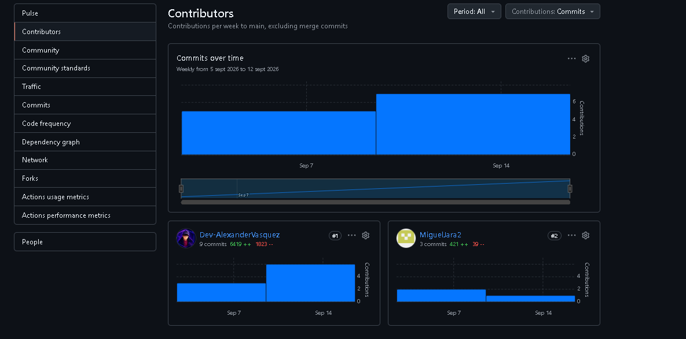

**Figura:** Métricas generales de contribución de los integrantes de Agridron durante la AV1.

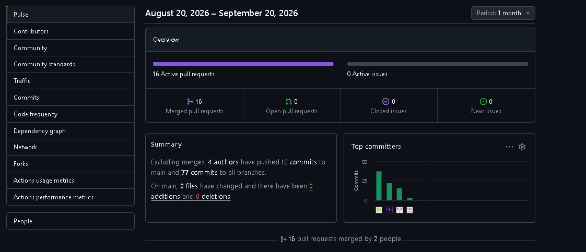

**Figura:** Detalle de los commits y participación de los colaboradores del repositorio Agridron durante la AV1.

## Insights TB1

En esta sección se presentan las métricas de colaboración obtenidas mediante GitHub Insights. Estas evidencias permiten visualizar los commits realizados por los integrantes del equipo durante la TB1 y reflejan la participación de Agridron en la elaboración y evolución del Project Report.

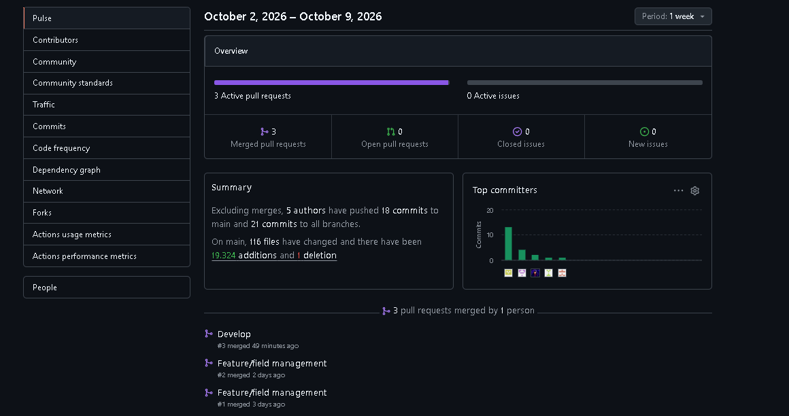

**Figura:** Métricas generales de contribución de los integrantes de Agridron durante la TB1.

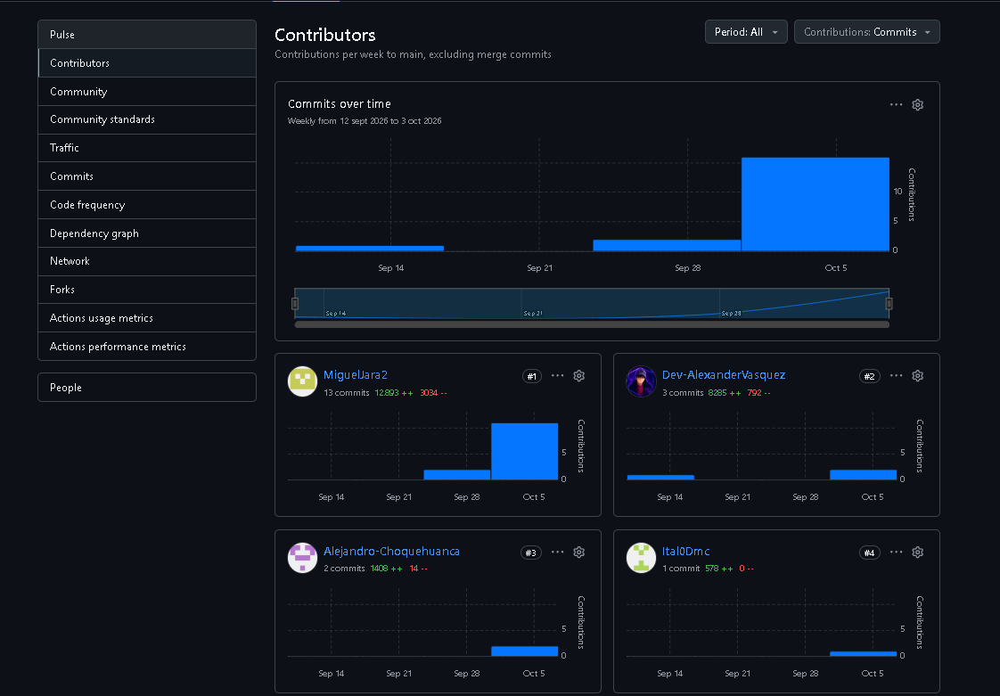

**Figura:** Detalle de los commits y participación de los colaboradores del repositorio Agridron durante la TB1.

# Contenido

## Tabla de Contenido

- [Contenido](#contenido)
  - [Tabla de Contenido](#tabla-de-contenido)
  - [Student Outcome](#student-outcome)
  - [Capítulo I: Introducción](#capítulo-i-introducción)
    - [1.1. Startup Profile](#11-startup-profile)
      - [1.1.1. Descripción de la Startup](#111-descripción-de-la-startup)
      - [1.1.2. Perfiles de integrantes del equipo](#112-perfiles-de-integrantes-del-equipo)
    - [1.2. Solution Profile](#12-solution-profile)
      - [1.2.1. Antecedentes y problemática](#121-antecedentes-y-problemática)
      - [1.2.2. Lean UX Process](#122-lean-ux-process)
        - [1.2.2.1. Lean UX Problem Statements](#1221-lean-ux-problem-statements)
        - [1.2.2.2. Lean UX Assumptions](#1222-lean-ux-assumptions)
        - [1.2.2.3. Lean UX Hypothesis Statements](#1223-lean-ux-hypothesis-statements)
        - [1.2.2.4. Lean UX Canvas](#1224-lean-ux-canvas)
    - [1.3. Segmentos objetivo](#13-segmentos-objetivo)
  - [Capítulo II: Requirements Elicitation & Analysis](#capítulo-ii-requirements-elicitation--analysis)
    - [2.1. Competidores](#21-competidores)
      - [2.1.1. Análisis competitivo](#211-análisis-competitivo)
      - [2.1.2. Estrategias y tácticas frente a competidores](#212-estrategias-y-tácticas-frente-a-competidores)
    - [2.2. Entrevistas](#22-entrevistas)
      - [2.2.1. Diseño de entrevistas](#221-diseño-de-entrevistas)
      - [2.2.2. Registro de entrevistas](#222-registro-de-entrevistas)
      - [2.2.3. Análisis de entrevistas](#223-análisis-de-entrevistas)
    - [2.3. Needfinding](#23-needfinding)
      - [2.3.1. User Personas](#231-user-personas)
      - [2.3.2. User Task Matrix](#232-user-task-matrix)
      - [2.3.3. User Journey Mapping](#233-user-journey-mapping)
      - [2.3.4. Empathy Mapping](#234-empathy-mapping)
    - [2.4. Big Picture EventStorming](#24-big-picture-eventstorming)
    - [2.5. Ubiquitous Language](#25-ubiquitous-language)
  - [Capítulo III: Requirements Specification](#capítulo-iii-requirements-specification)
    - [3.1. User Stories](#31-user-stories)
    - [3.2. Impact Mapping](#32-impact-mapping)
    - [3.3. Product Backlog](#33-product-backlog)
  - [Capítulo IV: Product Design](#capítulo-iv-product-design)
    - [4.1. Style Guidelines](#41-style-guidelines)
      - [4.1.1. General Style Guidelines](#411-general-style-guidelines)
      - [4.1.2. Web Style Guidelines](#412-web-style-guidelines)
    - [4.2. Information Architecture](#42-information-architecture)
      - [4.2.1. Organization Systems](#421-organization-systems)
      - [4.2.2. Labeling Systems](#422-labeling-systems)
      - [4.2.3. SEO Tags and Meta Tags](#423-seo-tags-and-meta-tags)
      - [4.2.4. Searching Systems](#424-searching-systems)
      - [4.2.5. Navigation Systems](#425-navigation-systems)
    - [4.3. Landing Page UI Design](#43-landing-page-ui-design)
      - [4.3.1. Landing Page Wireframe](#431-landing-page-wireframe)
      - [4.3.2. Landing Page Mock-up](#432-landing-page-mock-up)
    - [4.4. Web Applications UX/UI Design](#44-web-applications-uxui-design)
      - [4.4.1. Web Applications Wireframes](#441-web-applications-wireframes)
      - [4.4.2. Web Applications Wireflow Diagrams](#442-web-applications-wireflow-diagrams)
      - [4.4.3. Web Applications Mock-ups](#443-web-applications-mock-ups)
      - [4.4.4. Web Applications User Flow Diagrams](#444-web-applications-user-flow-diagrams)
    - [4.5. Web Applications Prototyping](#45-web-applications-prototyping)
    - [4.6. Domain-Driven Software Architecture](#46-domain-driven-software-architecture)
      - [4.6.1. Design-Level Event Storming](#461-design-level-event-storming)
      - [4.6.2. Software Architecture Context Diagram](#462-software-architecture-context-diagram)
      - [4.6.3. Software Architecture Container Diagrams](#463-software-architecture-container-diagrams)
      - [4.6.4. Software Architecture Components Diagrams](#464-software-architecture-components-diagrams)
    - [4.7. Software Object-Oriented Design](#47-software-object-oriented-design)
      - [4.7.1. Class Diagrams](#471-class-diagrams)
    - [4.8. Database Design](#48-database-design)
      - [4.8.1. Database Diagrams](#481-database-diagrams)
  - [Capítulo V: Product Implementation, Validation & Deployment](#capítulo-v-product-implementation-validation--deployment)
    - [5.1. Software Configuration Management](#51-software-configuration-management)
      - [5.1.1. Software Development Environment Configuration](#511-software-development-environment-configuration)
      - [5.1.2. Source Code Management](#512-source-code-management)
      - [5.1.3. Source Code Style Guide & Conventions](#513-source-code-style-guide--conventions)
      - [5.1.4. Software Deployment Configuration](#514-software-deployment-configuration)
    - [5.2. Landing Page, Services & Applications Implementation](#52-landing-page-services--applications-implementation)
      - [5.2.1. Sprint 1](#521-sprint-1)
        - [5.2.1.1. Sprint Planning 1](#5211-sprint-planning-1)
        - [5.2.1.2. Aspect Leaders and Collaborators](#5212-aspect-leaders-and-collaborators)
        - [5.2.1.3. Sprint Backlog 1](#5213-sprint-backlog-1)
        - [5.2.1.4. Development Evidence for Sprint Review](#5214-development-evidence-for-sprint-review)
        - [5.2.1.5. Execution Evidence for Sprint Review](#5215-execution-evidence-for-sprint-review)
        - [5.2.1.6. Services Documentation Evidence for Sprint Review](#5216-services-documentation-evidence-for-sprint-review)
        - [5.2.1.7. Software Deployment Evidence for Sprint Review](#5217-software-deployment-evidence-for-sprint-review)
        - [5.2.1.8. Team Collaboration Insights during Sprint](#5218-team-collaboration-insights-during-sprint)
      - [5.2.2.2 Sprint 2](#521-sprint-1)
        - [5.2.2.1. Sprint Planning 1](#5211-sprint-planning-1)
        - [5.2.2.2. Aspect Leaders and Collaborators](#5212-aspect-leaders-and-collaborators)
        - [5.2.2.3. Sprint Backlog 1](#5213-sprint-backlog-1)
        - [5.2.3.4. Development Evidence for Sprint Review](#5214-development-evidence-for-sprint-review)
        - [5.2.4.5. Execution Evidence for Sprint Review](#5215-execution-evidence-for-sprint-review)
        - [5.2.5.6. Services Documentation Evidence for Sprint Review](#5216-services-documentation-evidence-for-sprint-review)
        - [5.2.6.7. Software Deployment Evidence for Sprint Review](#5217-software-deployment-evidence-for-sprint-review)
        - [5.2.7.8. Team Collaboration Insights during Sprint](#5218-team-collaboration-insights-during-sprint)
    - [5.3. Validation Interviews](#53-validation-interviews)
      - [5.3.1. Interview Design](#531-interview-design)
      - [5.3.2. Interview Registry](#532-interview-registry)
      - [5.3.3. Heuristic Evaluations](#533-heuristic-evaluations)
    - [5.4. Video About-the-Product](#54-video-about-the-product)
  - [Conclusiones](#conclusiones)
  - [Bibliografía](#bibliografía)
  - [Anexos](#anexos)

---

| Criterio específico | Acciones realizadas | Conclusiones |
|---|---|---|
| **Trabaja en equipo para proporcionar liderazgo en forma conjunta** | **Jara Espinoza, Miguel Angel**<br>***AV1***<br>Lideré la coordinación general del equipo y la elaboración del Lean UX Canvas en el Capítulo I y II. Organicé las sesiones grupales de ideación y estructuración de hipótesis, y participé en la exposición oral explicando los supuestos clave de negocio.<br>***TB1 (Sprint 2)***<br>Lideré las reuniones de planificación y seguimiento ágil (Sprint Planning 2 y Daily Standups), guiando la adopción de Vue 3, PrimeVue y la arquitectura Domain-Driven Design (DDD). Asigné responsabilidades equitativas y aseguré la integración continua del equipo para cumplir con el Sprint Goal.<br><br>**Nicho Huillcañahui Edwin Noe**<br>***AV1***<br>Participé en el video de exposición explicando ante cámara los hallazgos del Capítulo II. Prioricé un lenguaje sencillo al presentar los perfiles de usuario (User Personas) y sus necesidades a una audiencia no técnica, apoyándome en las capturas de UXPressia para ilustrar el discurso en lugar de leer texto. Durante las entrevistas de Needfinding, apliqué escucha activa, dejando hablar al entrevistado antes de repreguntar, y en la sustentación grupal recibí y respondí preguntas del docente sobre el criterio usado para identificar patrones entre segmentos.<br>***TB1 (Sprint 2)***<br>Lideré el diseño e implementación del Bounded Context Field Management (gestión de fincas, parcelas y cultivos en Vue 3). Establecí la arquitectura de componentes y coordiné con mis compañeros para estandarizar los formularios reactivos y la manipulación de datos geoespaciales.<br><br>**Choquehuanca Vasquez, Alejandro Samir**<br>***AV1***<br>Participé en el análisis de competidores y en la definición de la User Task Matrix y Ubiquitous Language, exponiendo en el video la matriz de tareas para ambos segmentos de usuario.<br>***TB1 (Sprint 2)***<br>Lideré la configuración de la infraestructura de persistencia mock utilizando json-server (Fake API) y desarrollé el Bounded Context de Reporting, permitiendo al equipo consumir endpoints RESTful de manera independiente y facilitando el liderazgo técnico compartido.<br><br>**Vasquez Roncal, Alexander Felipe**<br>***AV1***<br>Implementación del capítulo 3 y 4, además de creación de mockups de landing page y Web Application.<br>***TB1 (Sprint 2)***<br>Lideré el desarrollo del Bounded Context Flight Operations (catálogo de drones y wizard de programación de misiones). Apoyé activamente a mis compañeros en la resolución de incidencias de maquetación y aseguré la fidelidad visual frente a los prototipos de Figma.<br><br>**Damacen Galindo, Italo Gianfranco**<br>***AV1***<br>Participé en la elaboración y presentación del Capítulo I de AgriDron Solutions, comunicando de manera clara y ordenada el perfil de la startup, la descripción de la solución, los antecedentes y la problemática identificada. Durante la presentación, expliqué el proceso Lean UX y las decisiones tomadas para orientar la propuesta de solución, utilizando diapositivas y recursos visuales para facilitar la comprensión de los contenidos según el objetivo de cada sección.<br>***TB1 (Sprint 2)***<br>Coordiné la revisión cruzada de código y Pull Requests en GitHub, velando por las buenas prácticas en la capa de infraestructura y colaborando en el diseño responsivo integral de la plataforma web. | Como equipo, durante el AV1 desarrollamos nuestra capacidad de comunicación oral mediante la presentación de los diferentes componentes de AgriDron Solutions. Cada integrante comunicó los resultados y decisiones correspondientes a su parte del proyecto, empleando recursos audiovisuales como diapositivas, diagramas, mockups y demostraciones para facilitar la comprensión de la información. Esto permitió presentar de manera organizada la propuesta, el diseño y la arquitectura de la solución, adaptando la explicación al objetivo de cada sección.<br><br>***TB1 (Sprint 2)***<br>Durante el Sprint 2, el equipo consolidó su liderazgo colectivo y trabajo conjunto mediante ceremonias ágiles periódicas. La distribución clara de roles sobre los Bounded Contexts y la comunicación continua permitieron resolver dependencias técnicas de forma oportuna, entregando una aplicación web modular, responsiva y funcional alineada con los requerimientos. |
| **Crea un entorno colaborativo e inclusivo, establece metas, planifica tareas y cumple objetivos.** | **Jara Espinoza, Miguel Angel**<br>***AV1***<br>Gestioné el repositorio principal en GitHub y la estructura base de los capítulos en Markdown, asegurando un entorno colaborativo ordenado y el cumplimiento de las fechas de entrega.<br>***TB1 (Sprint 2)***<br>Configuré el tablero Jira del Sprint 2, establecí el Sprint Backlog y descompuse las Historias de Usuario en Engineering Tasks con estimaciones de 4 a 8 horas. Supervisé el flujo de trabajo en GitFlow y verifiqué el cumplimiento de los criterios de aceptación.<br><br>**Nicho Huillcañahui Edwin Noe**<br>***AV1***<br>Redacté en el Informe de Proyecto (Markdown) las secciones de Análisis Competitivo, Diseño y Registro de Entrevistas, y Needfinding, transcribiendo de forma descriptiva las respuestas de los entrevistados y sustentando con porcentajes las características comunes de cada segmento. Cuidé la ortografía y gramática, seguí la estructura de tablas exigida (Competitive Analysis Landscape, User Task Matrix) y usé el idioma inglés para el Ubiquitous Language según lo indicado en el enunciado.<br>***TB1 (Sprint 2)***<br>Planifiqué y ejecuté las tareas técnicas de las vistas de fincas, parcelas y cultivos dentro de los plazos establecidos. Aporté componentes modulares de PrimeVue y documenté la capa de aplicación y modelos de dominio en la arquitectura DDD.<br><br>**Choquehuanca Vasquez, Alejandro Samir**<br>***AV1***<br>Redacté las secciones de arquitectura de información y estructuré el glosario de términos del dominio en inglés, cumpliendo los objetivos fijados para la primera entrega.<br>***TB1 (Sprint 2)***<br>Diseñé los esquemas de datos mock (db.json) y configuré el Fake API para simular las respuestas RESTful de misiones, telemetría y reportes fitosanitarios. Cumplí con los plazos previstos facilitando un entorno inclusivo donde todos pudieron probar sus vistas de forma independiente.<br><br>**Vasquez Roncal, Alexander Felipe**<br>***AV1***<br>Me encargué de crear la organización en GitHub para poder trabajar de manera colaborativa.<br>***TB1 (Sprint 2)***<br>Desarrollé los componentes del wizard de planificación de misiones y la gestión de drones respetando la estimación temporal asignada. Cumplí con las metas de diseño responsivo (mobile y desktop) y colaboré estrechamente con el equipo para garantizar un despliegue exitoso en GitHub Pages/Firebase.<br><br>**Damacen Galindo, Italo Gianfranco**<br>***AV1***<br>Elaboré y estructuré el Capítulo I del informe de AgriDron Solutions, desarrollando el Startup Profile (1.1), el Solution Profile (1.2), los antecedentes, la problemática identificada y los componentes del proceso Lean UX. Organicé la información de manera clara y sintetizada, empleando un lenguaje técnico acorde con el contexto del proyecto para comunicar de forma ordenada el propósito, contexto, problemática y propuesta de valor de la solución.<br>***TB1 (Sprint 2)***<br>Participé en la estimación de horas en Jira y se responsabilizó de la integración de estilos globales, utilitarios responsivos y diálogos de confirmación, cumpliendo con los criterios de aceptación y facilitando un espacio de soporte mutuo para la entrega del informe y código. | Como equipo, durante el AV1 elaboramos y consolidamos la documentación de AgriDron Solutions, distribuyendo la redacción de los diferentes capítulos y componentes del proyecto. Se empleó un lenguaje técnico y estructurado para documentar tanto la propuesta de solución como aspectos de diseño, arquitectura, implementación y gestión del desarrollo. La integración de los aportes de los integrantes permitió mantener una estructura coherente en el informe y comunicar de forma clara las decisiones y resultados obtenidos durante este avance.<br><br>***TB1 (Sprint 2)***<br>Durante el Sprint 2, el equipo estableció metas claras en el Sprint Backlog mediante Jira, descomponiendo historias de usuario en tareas de ingeniería estimadas entre 4 y 8 horas. Se mantuvo un entorno de trabajo colaborativo e inclusivo con ramas de Git organizadas, logrando cumplir satisfactoriamente el 100% de los objetivos planteados para el frontend del proyecto. |


# Capítulo I: Introducción
## 1.1. Startup Profile
**AgriDron Solutions** es una startup tecnológica orientada a mejorar la gestión de cultivos mediante el uso de drones para fumigación y monitoreo. La plataforma busca facilitar estas tareas y hacer que las operaciones sean más rápidas y fáciles de controlar.

AgriDron Solutions ofrece una plataforma que permite planificar misiones de fumigación, monitorear el trabajo en tiempo real y consultar reportes de las operaciones realizadas. El objetivo es que agricultores y personal técnico puedan controlar estas tareas desde una sola aplicación.

**Misión:** Mejorar la gestión de cultivos mediante drones y una plataforma accesible que permita reducir costos y tiempo en las operaciones de fumigación.

**Visión:** Convertirnos en una solución tecnológica de confianza para el sector agrícola, ayudando a modernizar la forma en que se gestionan y supervisan las operaciones de fumigación.

**Valores:**

* **Innovación:** buscamos utilizar nuevas tecnologías para mejorar las operaciones agrícolas.
* **Eficiencia:** buscamos reducir el tiempo, los costos y el uso de recursos.
* **Confiabilidad:** buscamos que las operaciones y los datos mostrados en la plataforma sean claros y precisos.
* **Compromiso:** buscamos ofrecer una solución útil y accesible para agricultores y personal técnico.


### 1.1.1. Descripción de la Startup
**AgriDron Solutions** es una startup que busca mejorar la protección de cultivos mediante drones y una plataforma de monitoreo. El sistema permitirá gestionar las operaciones de fumigación desde una sola plataforma.

La plataforma permitirá registrar fincas y parcelas, seleccionar áreas de fumigación mediante un mapa, crear misiones, consultar el clima, monitorear los drones y revisar el historial de las operaciones.

**Pilares de valor:**

* **Innovación tecnológica:** uso de drones aplicados a la agricultura.
* **Eficiencia operativa:** reducción de costos y tiempos frente a métodos tradicionales de fumigación.
* **Confiabilidad de datos:** información clara y disponible durante y después de las operaciones.
* **Compromiso social y ambiental:** reducción de riesgos para los trabajadores y del impacto de la fumigación.

### 1.1.2. Perfiles de integrantes del equipo

|                                             Foto                                              | Detalles del Integrante                                                                                                                                                                                                                                                                                                                                                                                                                                                                                                                                                                                                                                                                                                                                                                                                                                                                                                                                                                                                                                     |
|:---------------------------------------------------------------------------------------------:|:------------------------------------------------------------------------------------------------------------------------------------------------------------------------------------------------------------------------------------------------------------------------------------------------------------------------------------------------------------------------------------------------------------------------------------------------------------------------------------------------------------------------------------------------------------------------------------------------------------------------------------------------------------------------------------------------------------------------------------------------------------------------------------------------------------------------------------------------------------------------------------------------------------------------------------------------------------------------------------------------------------------------------------------------------------|
|               | **Nombre:** Damacen Galindo, Italo Gianfranco <br> **Código:** U202421392 \| **Carrera:** [CARRERA] <br><br> **Descripción:**<br> [DESCRIPCIÓN DEL PERFIL, CONOCIMIENTOS Y HABILIDADES.] <br><br> **Aporte y función dentro del equipo:**<br> [APORTE Y FUNCIÓN DENTRO DEL EQUIPO.]                                                                                                                                                                                                                                                                                                                                                                                                                                                                                                                                                                                                                                                                                                                                                                         |
|                  | **Nombre:** Nicho Huillcañahui, Edwin Noe <br> **Código:** U20241G306 <br> **Carrera:** Ingeniería de Software <br><br> **Descripción:**<br> Mi nombre es Edwin Noe Nicho Huillcañahui, soy estudiante de Ingeniería de Software en la Universidad Peruana de Ciencias Aplicadas (UPC). Me considero una persona responsable, curiosa y comprometida con el aprendizaje continuo. Me interesa el desarrollo de aplicaciones web y móviles, así como comprender el funcionamiento de las tecnologías y herramientas utilizadas en la construcción de soluciones de software. <br><br> **Aporte y función dentro del equipo:**<br> Me gusta participar en el diseño de interfaces y prototipos interactivos utilizando Figma. Asimismo,explorar el código, comprender cómo se relacionan los diferentes componentes de una aplicación y aprender sobre patrones de arquitectura de software.                                                                                                                                                                  |
|                | **Nombre:** Samir Choquehuanca <br> **Código:** U202416053 \| **Carrera:** Ingenieria de Software <br><br> **Descripción:**<br> Estudiante de Ingeniería de Software con conocimientos en programación en C++, JavaScript y Python, y en desarrollo web con HTML y CSS. Soy una persona responsable, con capacidad para aprender nuevas herramientas y aplicar mis conocimientos en proyectos académicos <br><br> **Aporte y función dentro del equipo:**<br> Aporto en el desarrollo y la programación de las funcionalidades del proyecto, y colaboro en el diseño de la interfaz con HTML y CSS. Cumplo con mis tareas en los plazos acordados y apoyo al grupo resolviendo dudas y reforzando las partes que lo necesiten.                                                                                                                                                                                                                                                                                                                              |
|                | **Nombre:** Jara Espinoza, Miguel Angel <br> **Código:** U202512856 \| **Carrera:** Ingenieria de Software <br><br> **Descripción:**<br> Mi nombre es Miguel Angel Jara Espinoza, soy estudiante de la carrera de Ingeniería de Software, actualmente cursando el quinto ciclo. Me considero una persona atenta y paciente. Cuento con conocimientos básicos en JavaScript, Python y C++, los cuales me permiten contribuir en el desarrollo y resolución de problemas dentro del proyecto. <br><br> **Aporte y función dentro del equipo:**<br> Aporto con mis conocimientos en lean ux y en gitlow                                                                                                                                                                                                                                                                                                                                                                                                                                                        |
|  | **Nombre:** Vasquez Roncal, Alexander Felipe <br> **Código:** U202222473 \| **Carrera:** Ingenieria de Software <br><br> **Descripción:**<br> Mi nombre es Alexander Vasquez, tengo 27 años y actualmente estoy cursando el cuarto ciclo de la carrera de Ingeniería de Software. Soy una persona disciplinada, con capacidad para trabajar en equipo. Mis habilidades técnicas incluyen lenguajes de programación como Python y C + +. Me esfuerzo por contribuir activamente al desarrollo del proyecto  <br><br> **Aporte y función dentro del equipo:**<br> Mi participacion incluyo ayudar en la documentacion del capitulo 3, 4 y 5, ademas de diseñar el mockup de la app web and landing page. Por otro lado, tambien implemente el style guie de ambos para que todo siguiera un orden especifico.                                                                                                                                                                                                                                                 |
## 1.2. Solution Profile

### 1.2.1. Antecedentes y problemática

#### 1.2.1.1. Antecedentes y contexto del mercado
En el sector agrícola peruano y regional, la sanidad vegetal constituye uno de los factores determinantes para la rentabilidad de los cultivos de alto valor comercial (frutales, hortalizas, maíz, leguminosas y tubérculos). Históricamente, las labores de aspersión y control fitosanitario se ejecutan mediante métodos convencionales: mochilas pulverizadoras de accionamiento manual o motopulverizadoras de espalda, y tractores con barras de aguilones terrestres.

Estos métodos tradicionales presentan severas deficiencias operativas y sanitarias:
1. **Pérdida por deriva y evaporación:** Hasta un 25% a 35% del producto químico se dispersa fuera del blanco biológico debido a la falta de calibración con las corrientes de viento y la humedad atmosférica.
2. **Compactación del suelo y daño mecánico:** El paso de maquinaria pesada deteriora la estructura del suelo y arruina entre un 2% y 5% de las plantas en fases vegetativas avanzadas.
3. **Tiempos de respuesta lentos:** La cobertura manual en predios de 10 a 30 hectáreas toma de 3 a 5 días de trabajo intensivo, periodo en el cual una plaga agresiva (como cogollero, roya o mosca blanca) puede propagarse por todo el valle.
4. **Riesgo crítico de salud ocupacional:** Los jornaleros y aplicadores sufren exposición directa crónica y aguda por inhalación y contacto dérmico con sustancias agroquímicas de alta toxicidad.

En contraste, la tecnología de vehículos aéreos no tripulados (drones agrícolas o UAVs) permite pulverizar una hectárea en menos de 15 minutos, reduciendo el consumo de agua e insumos hasta en un 50% gracias a la aspersión centrífuga ultra-bajo volumen (ULV). Sin embargo, la penetración de esta tecnología entre los pequeños y medianos agricultores (PyMAs) es baja debido a la falta de software especializado y accesible. Las plataformas internacionales consolidadas (como DroneDeploy, Agrivi o Bayer Climate FieldView) están diseñadas para grandes corporaciones agroexportadoras, exigen costos de suscripción prohibitivos (miles de dólares anuales), imponen una alta complejidad técnica y carecen de un flujo unificado y flexible adaptado a la realidad operativa de los valles agrícolas locales.

#### 1.2.1.2. The 5 ‘W’s y 2 ‘H’s

* **Who (Quiénes):**
  * *Usuarios directos primarios:* Pequeños y medianos agricultores (PyMAs) con unidades productivas de 5 a 50 hectáreas, agremiados o independientes.
  * *Usuarios operativos y técnicos:* Ingenieros agrónomos, operadores comerciales de drones agrícolas y técnicos de campo responsables del monitoreo fitosanitario y la ejecución de vuelos.
  * *Stakeholders secundarios:* Cooperativas agrarias locales que buscan optimizar insumos entre sus socios y proveedores de servicios agroquímicos.

* **What (Qué):**
  * La presencia recurrente de plagas y enfermedades que diezman el rendimiento de las cosechas.
  * La gestión fragmentada e informal de las misiones de fumigación aérea (coordinaciones mediante llamadas y chats no estructurados, falta de registro geoespacial de lotes y desconocimiento de historiales de dosis aplicadas).
  * La carencia de validación meteorológica preventiva antes del despegue, lo que provoca abortos de misión o aplicaciones con deriva riesgosa.

* **Where (Dónde):**
  * En terrenos agrícolas de valles costeros e interandinos (por ejemplo, los valles de Ica, Cañete, Piura, Chao y Virú), donde coexisten parcelas fragmentadas, topografía variable y conectividad rural intermitente.

* **When (Cuándo):**
  * Durante todo el ciclo fenológico del cultivo (desde preparación de suelo y siembra hasta pre-cosecha), con ventanas críticas de alta urgencia fitosanitaria (24 a 48 horas) ante alertas de brotes de plagas o cambios estacionales.

* **Why (Por qué):**
  * Por la ausencia de una solución digital centralizada, intuitiva y económicamente viable que articule la delimitación cartográfica de parcelas, la validación agroclimática en tiempo real, el control operativo de misiones y la trazabilidad histórica de insumos.

* **How (Cómo):**
  * Mediante el desarrollo de **AgriDron Solutions**, una plataforma web distribuida y adaptativa que integra:
    1. Catastro y delimitación poligonal de parcelas sobre mapas interactivos.
    2. Consulta meteorológica hiperlocal en tiempo real mediante APIs externas especializadas.
    3. Programación, calendarización y asignación de misiones de pulverización aérea con control de flota y agroquímicos.
    4. Simulación interactiva de telemetría y monitoreo de vuelo para seguimiento del servicio.
    5. Dashboards analíticos e historiales descargables de eficiencia agronómica y volúmenes aplicados.

* **How Much (Cuánto):**
  * De acuerdo con la Organización de las Naciones Unidas para la Alimentación y la Agricultura (FAO, 2023), entre un 20% y un 40% de la producción agrícola mundial se pierde anualmente por plagas y enfermedades.
  * A nivel nacional, las aplicaciones fitosanitarias deficientes y desfasadas generan sobrecostos de entre $180 y $300 USD por hectárea por campaña en desperdicio de insumos químicos y jornales de re-aplicación. La ineficiencia logística por abortos de vuelo no planificados por factores de viento representa pérdidas de más de 12 horas productivas semanales para las cuadrillas de operadores de drones.

#### 1.2.1.3. Enunciado del problema
Los pequeños y medianos agricultores (PyMAs) y los operadores técnicos independientes de drones en valles agrícolas carecen de una herramienta digital unificada y económica para delimitar lotes, verificar condiciones microclimáticas y registrar las misiones de fumigación aérea. Esta dispersión operativa origina sobrecostos por desperdicio de agroquímicos, retrasos críticos ante plagas, cancelaciones imprevistas de vuelos por clima adverso y una ausencia total de trazabilidad histórica sobre las áreas atendidas y dosis aplicadas.

#### 1.2.1.4. Puntos más importantes que debe resolver la solución propuesta
1. **Precisión en la delimitación espacial:** Permitir a los agricultores definir los límites exactos de sus parcelas en un mapa interactivo para calcular superficies automáticamente y evitar la aplicación fuera de límites.
2. **Seguridad y viabilidad agroclimática:** Validar de forma automatizada variables de viento, temperatura y precipitación previo a cada vuelo para impedir derivas tóxicas y cancelaciones en campo.
3. **Coordinación y gestión de misiones:** Proveer un flujo estructurado de órdenes de trabajo que vincule parcelas, fecha, tipo de plaga, producto químico, dron asignado y piloto responsable.
4. **Supervisión operativa y certeza del servicio:** Proveer monitoreo de telemetría de vuelo (simulado en tiempo real) que demuestre el avance de cobertura del área tratada.
5. **Trazabilidad y respaldo documental:** Centralizar reportes automáticos que certifiquen el consumo de insumos, horas de vuelo y superficie cubierta para auditorías y toma de decisiones agronómicas.

#### 1.2.1.5. Objetivos y restricciones que delimiten el alcance del proyecto

**Objetivo General:**
Desarrollar y desplegar una plataforma web distribuida y escalable que brinde soporte integral a la planificación cartográfica, validación meteorológica, simulación de telemetría de vuelo y analítica histórica de operaciones de fumigación agrícola con drones para pequeños y medianos agricultores y personal técnico especializado.

**Objetivos Específicos:**
* Diseñar e implementar un portal público informativo (Landing Page) orientado al descubrimiento del servicio, exhibición de beneficios, planes de suscripción transparentes y conversión de prospectos.
* Desarrollar un módulo GIS de catastro rural que permita el registro de fincas y el trazado vectorial de parcelas con cálculo geométrico de hectáreas en tiempo real.
* Integrar un servicio de pronóstico meteorológico externo vía RESTful API para la verificación automática de umbrales seguros de aspersión (velocidad del viento < 15 km/h, ausencia de lluvia).
* Implementar un sistema de gestión de flota de drones, inventario de insumos fitosanitarios y programación de misiones en calendario interactivo.
* Proveer un simulador interactivo de telemetría de vuelo en tiempo real para la verificación del avance de pulverización sobre el mapa.
* Generar reportes analíticos e históricos de eficiencia de vuelo y consumo de insumos por parcela y por periodo.

**Restricciones:**
* **Arquitectura de Software y Tecnologías:** El sistema backend debe implementarse como un servicio RESTful en ASP.NET Core Framework con Entity Framework Core en C#, persistencia de datos en motor relacional MySQL y documentación Swagger/OpenAPI. La aplicación frontend debe desarrollarse bajo el framework Vue.js con PrimeVue y diseño basado en Material Design.
* **Modelo Operativo de Drones:** El seguimiento de vuelo y telemetría de drones se aborda en esta fase como una simulación de telemetría basada en software con estados operativos y coordenadas geoespaciales, sin integración directa a firmware propietario de fabricantes comerciales (DJI, XAG).
* **Entorno y Conectividad Rural:** La interfaz web debe ser responsiva y ligera (Desktop y Mobile Web Browser), optimizada para tiempos de carga eficientes bajo conexiones móviles 3G/4G comunes en entornos agrícolas periféricos.
* **Normativa y Ética:** La plataforma se acoge a las pautas éticas de ingeniería de ACM/IEEE y el CIP, asegurando la privacidad de la información catastral de los agricultores y el cumplimiento de buenas prácticas fitosanitarias de pulverización aérea.
* **Idioma:** Interfaz de usuario, mensajes del sistema y documentación técnica elaborados en idioma inglés por estándar, contemplando soporte para internacionalización (i18n) a español latinoamericano.

---

### 1.2.2. Lean UX Process

#### 1.2.2.1. Lean UX Problem Statements


The current state of **agricultural precision spraying and drone mission management** has focused mainly on **large enterprise agribusinesses utilizing high-cost, proprietary flight controllers and fragmented ERPs, while small-to-medium farmers (PyMAs) and independent drone operators still rely on manual coordination, uncalibrated field sprayers, fragmented messaging apps, and disconnected weather forecasts without centralized operational records**.

What existing products/services fail to address is **an accessible, unified web platform that integrates pre-flight polygon parcel mapping, real-time agro-climatic feasibility checks, mission assignment, simulated flight progress tracking, and automated post-mission chemical usage records without requiring expensive proprietary hardware**.

Our product/service will address this gap by **delivering AgriDron Solutions, an interoperable, cloud-based web application featuring interactive polygon field delineation, external weather API integration, mission status workflows, simulated real-time drone telemetry monitoring, and comprehensive analytical reporting dashboards**.

Our initial focus will be **small and medium-sized farmers (cultivating 5 to 50 hectares) and licensed independent drone operators providing commercial spraying services in Peruvian agricultural valleys**.

We’ll know we are successful when we see:
1. **At least 75% of newly registered farmers** successfully delineate their parcels and schedule their first spraying mission through the interactive map within their first week of onboarding.
2. **A 90% reduction in weather-induced flight cancellations or drift incidents**, confirmed through the platform's automated pre-flight meteorological validation.
3. **An 80% recurring weekly active usage (WAU)** of the operational dashboard by drone technicians to monitor mission telemetry and log chemical consumption.
4. **At least a 35% conversion rate** from the introductory free tier to active subscription plans after completing two successful crop spraying cycles.

---

#### 1.2.2.2. Lean UX Assumptions

##### 1.2.2.2.1. Business Assumptions
* Creemos que existe una demanda insatisfecha y creciente de herramientas de software agrícola accesibles para pequeños y medianos productores agrícolas que no pueden afrontar los costos de plataformas como DroneDeploy o Agrivi.
* Creemos que la plataforma se posicionará como una herramienta indispensable en el agro al centralizar la información dispersa de fincas, parcelas, clima, misiones y consumos de agroquímicos.
* Creemos que un modelo de monetización freemium (registro de parcelas gratuito y cobro por hectárea gestionada o suscripción mensual para misiones avanzadas y reportes) garantizará la viabilidad y sostenibilidad financiera de la startup.
* Creemos que establecer alianzas estratégicas con cooperativas agrarias locales reducirá significativamente los costos de adquisición de clientes (CAC) y acelerará la adopción comunitaria.
* Creemos que el uso de tecnologías abiertas y modulares (ASP.NET Core y Vue.js) proporciona al equipo la capacidad organizativa para desplegar mejoras continuas con bajos costos de infraestructura.
* Creemos que los operadores de drones verán en AgriDron un aliado de gestión comercial y técnica para fidelizar a los clientes de sus servicios de vuelo.

##### 1.2.2.2.2. Business Outcome Assumptions
* Creemos que alcanzaremos una tasa de retención de clientes del 70% luego de la finalización del primer ciclo agrícola completo.
* Creemos que reduciremos en un 40% el costo de coordinación y planificación operativa de misiones en comparación con la gestión manual convencional.
* Creemos que lograremos una tasa de conversión del 35% de usuarios del plan gratuito hacia planes de suscripción de pago tras dos campañas de uso.
* Creemos que incrementaremos en un 50% el volumen total de hectáreas administradas en la plataforma durante los primeros seis meses de operaciones.
* Creemos que alcanzaremos una satisfacción neta (NPS) superior a 60 puntos entre técnicos agrícolas y agricultores asociados.

##### 1.2.2.2.3. User Assumptions
* Creemos que nuestros usuarios objetivo se dividen claramente en dos grupos: Pequeños y Medianos Agricultores (PyMAs) y Personal Técnico (Ingenieros Agrónomos y Operadores de Drones).
* Creemos que los agricultores priorizan herramientas que les ahorren costos y tiempo de mano de obra, y están dispuestos a usar tecnología si la interfaz es simple y requiere mínima capacitación.
* Creemos que la principal frustración de los agricultores es el daño recurrente por plagas debido a aplicaciones lentas y la falta de certeza sobre qué insumos y dosis se aplicaron en cada lote.
* Creemos que los agricultores utilizan computadoras personales o laptops para revisar fincas y reportes de cierre, pero emplean principalmente smartphones para coordinar labores en campo.
* Creemos que los operadores técnicos y agrónomos necesitan validar rápidamente las condiciones climáticas y la delimitación de parcelas antes de movilizar sus equipos de vuelo.
* Creemos que los técnicos agrícolas valoran la automatización del registro de bitácoras de vuelo y la configuración de parámetros como altura, velocidad y tipo de boquilla.

##### 1.2.2.2.4. User Outcome and Benefit Assumptions
* Creemos que los agricultores reducirán el desperdicio de agroquímicos costosos en hasta un 25% gracias a la delimitación precisa de lotes y dosis calculadas.
* Creemos que los operadores de drones evitarán retrasos y vuelos fallidos al contar con alertas climáticas en tiempo real antes de despegar.
* Creemos que los trabajadores de campo y aplicadores erradicarán el riesgo de intoxicación al sustituir la fumigación manual por vuelos aéreos supervisados digitalmente.
* Creemos que los productores agrícolas ganarán control y tranquilidad al disponer de un historial auditable con el registro exacto de cada tratamiento fitosanitario.
* Creemos que los supervisores agronómicos optimizarán su jornada laboral al poder supervisar múltiples unidades territoriales de forma remota y simultánea.

##### 1.2.2.2.5. Feature Assumptions
1. *Delimitación cartográfica de parcelas:* Creemos que un mapa interactivo con dibujo de polígonos vectoriales y cálculo automático de superficie resolverá la imprecisión y disputas sobre las hectáreas a fumigar.
2. *Integración de API meteorológica externa:* Creemos que validar en tiempo real el viento, lluvia y humedad antes de programar una misión evitará cancelaciones y derivas químicas peligrosas.
3. *Programación y gestión de órdenes de vuelo:* Creemos que un flujo centralizado de misiones con estados operativos permitirá coordinar eficientemente agricultor, lote, químico y dron.
4. *Catálogo de flota y agroquímicos:* Creemos que registrar especificaciones técnicas de drones, boquillas y productos químicos garantizará una dosificación estandarizada y segura.
5. *Simulación de telemetría en tiempo real:* Creemos que una vista interactiva de seguimiento del dron en vuelo sobre la parcela aportará transparencia y confianza sobre el servicio prestado.
6. *Módulo de historial y reportes analíticos:* Creemos que generar reportes automáticos exportables de superficie atendida, tiempo de vuelo e insumos utilizados facilitará la certificación agrícola y el balance financiero.
7. *Control de acceso por roles (RBAC):* Creemos que adaptar la interfaz y permisos según el perfil (dueño de finca vs operador técnico) reducirá la fricción de navegación y evitará errores de configuración.
8. *Landing Page comercial y catálogo de planes:* Creemos que un portal público claro con presentación de la solución, tarifas por hectárea y solicitud de demostración impulsará la captación de nuevos clientes.

---

#### 1.2.2.3. Lean UX Hypothesis Statements

**Hypothesis Statement 1 (Feature: Interactive Polygon Parcel Mapping)**
We believe we will achieve a 40% reduction in mission planning time
If small and medium farmers
Attain precise boundary definition and automated acreage calculation of their crops
With an interactive GIS mapping tool for farm and parcel delineation.

**Hypothesis Statement 2 (Feature: External Agro-Weather API Integration)**
We believe we will achieve a 90% reduction in pesticide drift incidents and weather-related flight aborts
If drone operators and field agronomists
Attain instant awareness of localized wind speed, humidity, and precipitation thresholds before takeoff
With a real-time meteorological validation and warning service.

**Hypothesis Statement 3 (Feature: Mission Scheduling & Workflow Management)**
We believe we will achieve a 50% increase in operational coordination efficiency between landholders and sprayers
If farmers and technical supervisors
Attain automated assignment of flight dates, target parcels, and chemical dosages
With a centralized mission scheduling and status workflow system.

**Hypothesis Statement 4 (Feature: Drone Fleet and Chemical Inventory Management)**
We believe we will achieve a 30% reduction in equipment downtime and incorrect dosage applications
If drone operators and technical personnel
Attain structured tracking of drone battery cycles, nozzle configurations, and certified chemical inventories
With a comprehensive fleet and input management module.

**Hypothesis Statement 5 (Feature: Simulated Real-Time Telemetry Tracking)**
We believe we will achieve an 80% weekly active user retention during spraying campaigns
If farmers and landowners
Attain real-time operational visibility and peace of mind regarding parcel flight coverage
With a live telemetry map simulator tracking drone flight paths and spraying status.

**Hypothesis Statement 6 (Feature: Automated Historical & Productivity Reporting)**
We believe we will achieve a 35% conversion rate to paid subscription tiers
If farmers and cooperative managers
Attain auditable post-flight reports detailing treated acreage, chemical volumes used, and flight duration
With an automated analytical reporting and export engine.

**Hypothesis Statement 7 (Feature: Role-Based Access Control and Profiles)**
We believe we will achieve a 45% decrease in user onboarding friction and operational mistakes
If both farmers and field technicians
Attain role-tailored dashboards that only display features relevant to their specific operational responsibilities
With a secure, role-based authentication and profile management module.

**Hypothesis Statement 8 (Feature: Value Discovery Landing Page & Subscription Catalog)**
We believe we will achieve a 25% monthly increase in qualified inbound pilot requests
If visiting agricultural producers
Attain clear understanding of cost-per-hectare savings and service tiers
With a responsive commercial landing page featuring pricing plans, FAQs, and a demo request form.

---

#### 1.2.2.4. Lean UX Canvas

| 1. Business Problem | 5. Solutions (Features) | 2. Business Outcomes |
| :--- | :--- | :--- |
| Los pequeños y medianos agricultores (PyMAs) y operadores independientes de drones en valles agrícolas carecen de una herramienta unificada y económica para delimitar lotes, verificar el clima hiperlocal y supervisar la aspersión aérea. Las plataformas actuales son de costo prohibitivo o de alta complejidad corporativa, ocasionando sobrecostos por desperdicio de insumos, cancelaciones imprevistas de vuelos y falta de trazabilidad histórica. | 1. Delimitación cartográfica interactiva de parcelas mediante polígonos.<br>2. Consulta meteorológica automatizada previa al vuelo vía API externa.<br>3. Módulo de programación, asignación y seguimiento de misiones.<br>4. Registro y gestión de flota de drones, boquillas y agroquímicos.<br>5. Simulación de telemetría de vuelo y aspersión en tiempo real.<br>6. Generación de historiales y reportes analíticos descargables.<br>7. Control de acceso adaptativo basado en roles (Agricultor / Técnico).<br>8. Landing Page corporativa con presentación de valor y planes. | - Reducción del 40% en costos y tiempos de coordinación operativa.<br>- Disminución del 90% en cancelaciones y derivas por clima adverso.<br>- Retención del 70% de clientes tras el primer ciclo de cultivo.<br>- Tasa de conversión del 35% de usuarios gratuitos a planes de suscripción.<br>- Crecimiento del 50% en hectáreas gestionadas durante los primeros 6 meses. |
| **3. Users / Personas** | **7. What’s the most important thing we need to learn first?** | **4. User Outcomes & Benefits** |
| - **Pequeños y Medianos Agricultores (PyMAs):** Propietarios o administradores de predios de 5 a 50 hectáreas que buscan proteger sus cultivos, reducir el gasto en mano de obra/químicos y evitar pérdidas por plagas.<br>- **Personal Técnico (Agrónomos y Operadores de Drones):** Profesionales que prestan o supervisan servicios de fumigación aérea y requieren certificar límites, clima seguro y dosis aplicadas. | ¿Están los pequeños agricultores y técnicos de campo dispuestos a reemplazar las coordinaciones informales (llamadas telefónicas y WhatsApp) por una plataforma web visual para delimitar sus parcelas y verificar el clima antes de cada vuelo? | - Ahorro de hasta 25% en consumo de agroquímicos costosos.<br>- Eliminación total de la exposición de jornaleros a químicos peligrosos.<br>- Certeza sobre condiciones microclimáticas seguras antes de volar.<br>- Registro histórico detallado para auditorías y certificaciones agrícolas.<br>- Optimización del tiempo de supervisión en múltiples parcelas. |
| **6. Hypotheses** | | **8. What’s the least amount of work to learn next?** |
| - Si permitimos delimitar parcelas sobre un mapa interactivo, los agricultores reducirán drásticamente el tiempo de coordinación de misiones.<br>- Si alertamos sobre vientos adversos mediante una API climática, los operadores evitarán vuelos fallidos y pérdidas químicas.<br>- Si ofrecemos un simulador de telemetría en vivo, los agricultores validarán la cobertura del trabajo con total confianza.<br>- Si proveemos reportes descargables de insumos y hectáreas, las cooperativas y agricultores pagarán por planes de suscripción. | | Diseñar prototipos navegables de media y alta fidelidad en Figma que cubran el flujo crítico esencial: registro de finca, trazado de parcela en mapa, consulta climática y simulación de vuelo. Realizar pruebas de usabilidad y entrevistas cualitativas con 5 agricultores y 3 operadores técnicos para validar interés, claridad y valor percibido. |

---

## 1.3. Segmentos Objetivo

### 1.3.1. Pequeños y Medianos Agricultores (PyMAs)

Este segmento constituye el núcleo de clientes y beneficiarios directos de AgriDron Solutions. En el Perú, de acuerdo con los resultados del **IV Censo Nacional Agropecuario (CENAGRO - INEI)**, más del 80% de las unidades agropecuarias corresponden a pequeños y medianos productores con superficies que van de 5 a 50 hectáreas. Este segmento dinamiza los valles agrícolas costeros e interandinos (como Ica, Cañete, Chancay-Huaral y Piura) produciendo tanto para mercados mayoristas nacionales como para cadenas agroexportadoras indirectas.

* **Características demográficas y cuantitativas:**
  * **Edad:** Rango comprendido entre los 30 y 62 años.
  * **Ubicación geográfica:** Zonas rurales y periurbanas de los valles costeros e interandinos.
  * **Extensión territorial:** Predios agrícolas propios o arrendados entre 5 y 50 hectáreas.
  * **Nivel de instrucción:** Primaria completa a secundaria técnica o superior técnica no concluida.
  * **Dispositivos y tecnología:** Uso masivo de smartphones con sistema operativo Android (más del 88% de penetración según datos de OSIPTEL e INEI en zonas periurbanas), con acceso a Internet móvil vía 4G, complementado por computadoras de escritorio o laptops de uso familiar en el hogar.
  * **Navegadores habituales:** Google Chrome y navegadores nativos móviles.

* **Características cualitativas y de comportamiento:**
  * **Motivaciones principales:** Maximizar el rendimiento de la cosecha, reducir los costos crecientes de mano de obra para fumigación manual y evitar la pérdida de cultivos por detección tardía de plagas.
  * **Pains y frustraciones:** Escasez y encarecimiento de jornaleros de campo, riesgo de intoxicación de trabajadores con mochilas manuales, falta de precisión al calcular la cantidad de plaguicida requerido y cobro de tarifas poco transparentes por servicios informales de fumigación.
  * **Afinidad digital:** Media-baja. Están habituados al uso cotidiano de WhatsApp para comercio y coordinación comunitaria, YouTube para videos informativos y banca móvil básica; sin embargo, sienten recelo ante sistemas corporativos complejos con exceso de formularios.

* **Relación con la solución AgriDron:**
  Utilizan la plataforma para dar de alta sus fincas y parcelas dibujándolas en el mapa interactivo, solicitar y calendarizar servicios de fumigación indicando fecha y cultivo, revisar las alertas meteorológicas para planificar su riego y fumigación, y acceder a reportes históricos que les permitan certificar qué agroquímicos se aplicaron en cada lote.

---

### 1.3.2. Personal Técnico (Ingenieros Agrónomos y Técnicos de Campo / Operadores de Drones)

Este segmento comprende a los operadores profesionales encargados de la ejecución técnica de las misiones de fumigación aérea y a los ingenieros agrónomos que asesoran fincas y cooperativas agrarias. Con el auge de los drones de aplicación agrícola (modelos de 10 a 40 litros de capacidad de tolva), ha surgido un grupo especializado de proveedores de servicios tecnológicos de aspersión.

* **Características demográficas y cuantitativas:**
  * **Edad:** Rango etario joven-adulto de 22 a 45 años.
  * **Formación académica:** Egresados o titulados de carreras de Ingeniería Agrónoma, Ingeniería Agrícola, Mecatrónica o carreras técnicas en Agropecuaria y Pilotaje de UAVs (con credenciales DGAC/MTC cuando aplica).
  * **Experiencia laboral:** Entre 2 y 12 años brindando asesoría de sanidad vegetal, calibración de boquillas o pilotaje de drones en el sector agropecuario.
  * **Dispositivos y tecnología:** Alta intensidad de uso de laptops (Windows/macOS) y smartphones/tablets de gama media a alta para uso continuo en campo. Manejo fluido de herramientas SIG (QGIS, Google Earth), hojas de cálculo avanzadas y aplicaciones meteorológicas.

* **Características cualitativas y de comportamiento:**
  * **Motivaciones principales:** Optimizar el tiempo de calibración y planificación de vuelos, garantizar la seguridad de su equipo evitando condiciones meteorológicas riesgosas (fuertes vientos o lluvia), y ofrecer a sus clientes (los agricultores) un reporte técnico profesional y fidedigno del trabajo ejecutado.
  * **Pains y frustraciones:** Falta de información cartográfica precisa provista por el agricultor (linderos confusos que causan disputas por límites), viajes infructuosos a campo debido a vientos excesivos no previstos, y pérdida de tiempo elaborando bitácoras y liquidaciones de servicio de forma manual.
  * **Afinidad digital:** Alta. Adoptan con facilidad plataformas web y aplicaciones especializadas, demandando interfaces eficientes, rápidas y orientadas a datos.

* **Relación con la solución AgriDron:**
  Utilizan la plataforma para gestionar su inventario de drones y boquillas de aspersión, verificar las órdenes de trabajo programadas, consultar las condiciones meteorológicas antes de salir a campo, simular y supervisar la telemetría de las misiones asignadas, y registrar el cierre técnico de la labor con las cantidades exactas de agroquímico y tiempo invertido.

# Capítulo II: Requirements Elicitation & Analysis.

Para validar la propuesta de valor de AgriDron Solutions y asegurar un posicionamiento estratégico diferenciado en el sector agro-tecnológico, se ha realizado una investigación exhaustiva de las soluciones digitales existentes en el mercado. A continuación, se detallan los tres principales competidores identificados, analizando su modelo operativo, funcionalidades clave y alcance en el soporte a las labores agrícolas:

- DroneDeploy: Plataforma en la nube especializada en la captura, procesamiento y análisis de datos geoespaciales mediante drones. En el sector agrícola, opera permitiendo la planificación automatizada de vuelos sobre campos de cultivo y el procesamiento de mapas ortomosaicos e índices de vegetación (NDVI) para la detección de anomalías en los lotes. Su funcionamiento se basa en la sincronización de hardware comercial con su software web para generar reportes analíticos de salud vegetal y coordinar cuadrillas de trabajo.

- Climate FieldView: Plataforma digital integral de gestión agronómica desarrollada por The Climate Corporation (división digital de Bayer). Funciona mediante la recopilación e integración de datos generados por sensores climáticos, satélites y maquinaria terrestre conectada al puerto de diagnóstico (FieldView Drive). Su software permite a los productores monitorear el desarrollo de sus campos, generar prescripciones variables de siembra y fertilizantes, y consultar datos meteorológicos hiperlocales para la toma de decisiones preventivas en campo.

- Agrivi: Software integral de gestión de explotaciones agrícolas (Farm Management Software - FMS) basado en el modelo SaaS en la nube. Su funcionamiento abarca la planificación completa de labores agrícolas, administración de inventarios de insumos químicos, trazabilidad de cosechas y registro de costos de producción. Además, integra alertas meteorológicas basadas en modelos predictivos para advertir sobre el riesgo de plagas y enfermedades, permitiendo llevar una bitácora detallada de las actividades de campo.


### 2.1.1. Análisis Competitivo

#### Competitive Analysis Landscape

*¿Por qué llevar a cabo este análisis?* El objetivo de este análisis es evaluar las soluciones digitales agropecuarias actuales para identificar brechas de mercado, validar nuestra ventaja competitiva en la planificación y monitoreo de fumigación con drones, y estructurar una oferta accesible para pequeños y medianos agricultores.

| Categoría | Subcategoría | AgriDron Solutions | DroneDeploy | Climate FieldView | Agrivi |
|---|---|---|---|---|---|
| **Perfil** | Logo / Identificador |  |  | 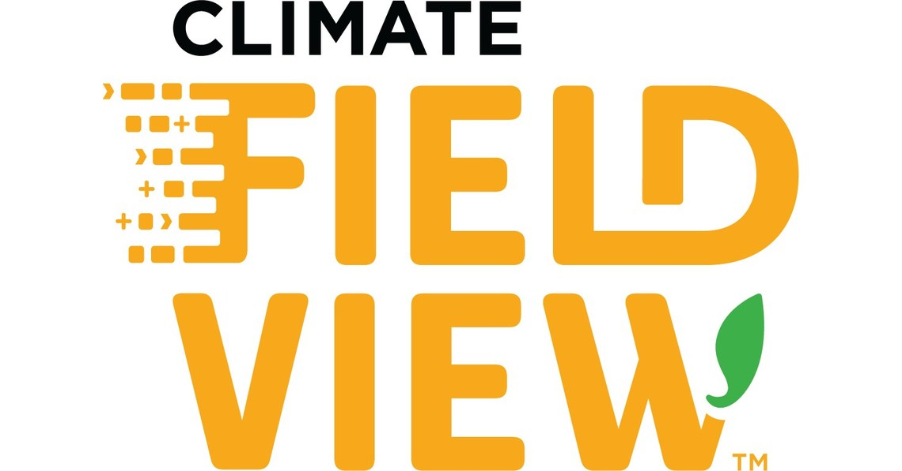 |  |
| **Perfil** | Overview | Plataforma web distribuida e interoperable diseñada para la planificación sobre mapas interactivos, validación climática vía API externa y simulación de telemetría para operaciones de fumigación con drones. | Plataforma empresarial de software para mapeo aéreo, fotogrametría 3D y análisis multiespectral con drones. | Plataforma digital corporativa enfocada en la recolección masiva de datos agronómicos terrestres y satelitales. | Sistema integral de planificación de recursos agrícolas (Farm ERP) en la nube enfocado en gestión y cumplimiento normativo. |
| **Perfil** | Ventaja competitiva / ¿Qué valor ofrece? | Plataforma web abierta e intuitiva que integra delimitación de polígonos, consulta meteorológica en tiempo real y seguimiento de drones sin ataduras a hardware propietario. Automatiza el flujo de fumigación, reduce el desperdicio de insumos químicos, previene pérdidas por clima adverso y ofrece visibilidad operativa en tiempo real. | Algoritmos líderes de procesamiento rápido de ortomosaicos y amplia compatibilidad con marcas de drones comerciales. Ofrece información visual de alta resolución del estado del campo y herramientas de medición de áreas y elevación. | Respaldo y validación agronómica global de Bayer, con integración directa a maquinaria pesada y satélites. Optimiza el rendimiento de la cosecha mediante decisiones basadas en datos climáticos e históricos del suelo. | Módulo exhaustivo de trazabilidad agrícola, cumplimiento de certificaciones internacionales y gestión financiera del cultivo. Centraliza la administración de la finca, control de inventarios y reducción de costos operativos. |
| **Perfil de Marketing** | Mercado objetivo | Pequeños y medianos agricultores (PyMAs), cooperativas agrarias y operadores técnicos de drones de fumigación. | Grandes corporaciones agrícolas, empresas de ingeniería, construcción e inspección aérea. | Medianos y grandes productores agrícolas con maquinaria mecanizada y tecnificada. | Medianas y grandes empresas agroexportadoras, consultores agrícolas y cadenas agroalimentarias. |
| **Perfil de Marketing** | Estrategias de marketing | Marketing digital educativo, demostraciones en cooperativas locales, esquema freemium para visualización de parcelas y alianzas con técnicos de campo. | Venta directa enterprise, marketing de contenidos B2B global, eventos del sector aeroespacial y certificaciones técnicas. | Distribución a través de redes de concesionarios de insumos Bayer, patrocinios agrícolas y pruebas de campo a gran escala. | Marketing inbound, presencia en conferencias globales AgTech, certificaciones digitales y canal de consultoría especializada. |
| **Perfil de Producto** | Productos & Servicios | Aplicación web (Vue), servicio RESTful (ASP.NET Core), landing page informativa, módulo de clima por API y simulador de telemetría de vuelo. | Software en la nube, aplicación móvil de control de vuelo, módulo de análisis NDVI y visor de ortofotos 2D/3D. | Aplicación web y móvil, dispositivo FieldView Drive para tractores, mapas satelitales y prescripciones de siembra. | Plataforma web/móvil FMS, módulo de control de plagas, gestión de bodegas, reportes de auditoría y app de tareas de campo. |
| **Perfil de Producto** | Precios & costos | Esquema de suscripción modular mensual/anual económico, adaptado por cantidad de hectáreas gestionadas. | Modelo de suscripción SaaS anual de costo elevado (desde cientos hasta miles de USD anuales por usuario). | Suscripción anual base más costos adicionales por dispositivos de conexión física y hectáreas monitoreadas. | Suscripción SaaS por niveles basada en el número de hectáreas y módulos empresariales contratados (alto costo). |
| **Perfil de Producto** | Canales de distribución | Aplicación web responsive (Desktop y Mobile) accesible desde cualquier navegador estándar y Landing Page oficial. | Plataforma web SaaS, aplicación móvil (iOS/Android) y portal en la nube. | Plataforma web, aplicaciones móviles (iOS/Android) y canal de distribución físico de hardware. | Plataforma web SaaS y aplicación móvil operativa para smartphones y tablets. |
| **Análisis SWOT** | Fortalezas | Plataforma web moderna sobre arquitectura distribuida escalable (ASP.NET Core y Vue). Enfoque especializado en planificación, validación climática y monitoreo de fumigación aérea sin hardware cautivo. Curva de aprendizaje mínima. Integración directa con pronóstico meteorológico. | Algoritmos de procesamiento rápido de ortomosaicos y modelado 3D reconocidos como líderes del mercado. Amplia base de usuarios consolidada a nivel global y alta compatibilidad con marcas de drones comerciales. | Respaldo corporativo de Bayer (Climate Corporation), con más de 36M de hectáreas pagadas gestionadas globalmente. Integración nativa con maquinaria John Deere vía FieldView Drive. | Cobertura integral del ciclo agrícola, desde planificación hasta reportes financieros. Soporte al cliente calificado consistentemente como receptivo y de calidad por los usuarios. |
| **Análisis SWOT** | Debilidades | Startup en etapa inicial con menor músculo financiero y base de clientes reducida. Dependencia inicial de simulación de telemetría antes de la integración masiva con hardware físico. Marca nueva sin reconocimiento previo en ferias agrarias. | Precios elevados y esquema de suscripción percibido como confuso por los usuarios (planes desde $1,908 hasta más de $4,000 USD anuales). Procesamiento lento y problemas de carga reportados con frecuencia, además de funciones básicas de medición no disponibles en planes gratuitos. | Fallas de conectividad, errores de la aplicación y una interfaz calificada como confusa por algunos usuarios. Funcionalidades de monitoreo y pronóstico menos sofisticadas fuera de EE.UU., con reportes de auditoría e inventario más limitados que herramientas especializadas. | Integraciones con servicios externos de clima e IoT resultan costosas para usuarios pequeños. Módulo financiero carece de funciones contables completas, y la transparencia de precios es limitada en materiales públicos. |
| **Análisis SWOT** | Oportunidades | Creciente interés de pequeños y medianos agricultores por modernizar la fumigación. Brecha de mercado desatendida por competidores de alto costo (DroneDeploy, Agrivi). Necesidad de cooperativas locales de centralizar la supervisión de múltiples lotes. | Expansión hacia nuevos sectores más allá de la agricultura, como construcción, minería e inspección de infraestructura. Creciente demanda de automatización con IA en la captura y análisis de datos aéreos. | Expansión internacional hacia más países y tipos de cultivo, aprovechando su reciente entrada a mercados como el Reino Unido y Europa. Creciente demanda de decisiones agronómicas basadas en datos climáticos e históricos. | Crecimiento del mercado de software agrícola entre cooperativas y medianas empresas agroexportadoras. Mayor exigencia regulatoria de trazabilidad y cumplimiento de certificaciones internacionales. |
| **Análisis SWOT** | Amenazas | Resistencia cultural al cambio tecnológico. Expansión o reducción de precios de plataformas consolidadas (Bayer Climate FieldView) hacia segmentos pequeños. Deficiencias de conectividad rural. | Surgimiento de competidores especializados y más económicos en nichos específicos (como AgriDron en fumigación de PyMAs), que ofrecen soluciones más simples y accesibles. | Dependencia de la infraestructura y las políticas de uso de datos de una gran corporación (Bayer), lo que genera cuestionamientos sobre privacidad. Resistencia de agricultores a compartir información sensible con terceros. | Competencia de plataformas más simples y económicas orientadas a operaciones pequeñas. Complejidad percibida del sistema, que puede alejar a productores con menor alfabetización digital. |
### 2.1.2. Estrategias y tácticas frente a competidores

| Estrategia / Táctica | Descripción |
|---|---|
| **Alerta Climática Preventiva** | Implementar bloqueo automático de vuelos de fumigación cuando la API meteorológica detecte viento, lluvia o humedad fuera de rango seguro, evitando deriva química y desperdicio de insumos. |
| **Onboarding sin Fricción** | Diseñar un flujo de registro e interfaz con curva de aprendizaje mínima, pensado para agricultores con alfabetización digital intermedia o baja, sin necesidad de capacitación técnica extensa como la que exigen Agrivi o DroneDeploy. |
| **Alianzas con Cooperativas Agrarias** | Establecer demostraciones y pilotos gratuitos en cooperativas locales, generando adopción boca a boca y validando el producto en predios de 5 a 50 hectáreas, el segmento desatendido por los competidores. |
| **Suscripción Escalable por Hectárea** | Modelo de precios modular mensual/anual ajustado a la cantidad de hectáreas gestionadas, permitiendo que pequeños productores paguen montos accesibles frente a los esquemas fijos de alto costo de DroneDeploy, Climate FieldView y Agrivi. |
| **Panel Colaborativo Multi-Lote** | Centralizar en un solo tablero la supervisión de múltiples parcelas y operadores de drones, facilitando la coordinación de cooperativas que gestionan varios lotes dispersos simultáneamente. |

*Tabla. Estrategias y tácticas frente a competidores*


## 2.2. Entrevistas

### 2.2.1. Diseño de entrevistas

**Objetivo de la entrevista:** El objetivo de las entrevistas es recopilar evidencia sobre los flujos operativos, limitaciones tecnológicas y necesidades críticas de pequeños agricultores y técnicos de campo que utilizan drones como técnica principal de fumigación, con el fin de modelar perfiles de usuario precisos y fundamentar el diseño funcional de la plataforma web AgriDron.

**Segmento 1: Pequeños y Medianos Agricultores / Propietarios de Fincas**

**Preguntas:**

- ¿Cuál es su nombre, edad y en qué distrito o valle agrícola se encuentra ubicado su predio?
- ¿Qué tipos de cultivo maneja principalmente y cuántas hectáreas tiene bajo su administración?
- ¿Qué dispositivos utiliza con mayor frecuencia para coordinar sus labores (computadora, laptop, smartphone Android/iOS) y qué navegador web suele utilizar (Chrome, Edge, Safari)?
- ¿Qué aplicaciones o herramientas digitales utiliza con regularidad para comunicarse o gestionar compras/ventas (WhatsApp, banca móvil, hojas de Excel, redes sociales)?
- ¿Qué método utiliza actualmente para la fumigación y control de plagas en sus parcelas?
- ¿Cómo detecta, delimita y registra la presencia de una plaga o enfermedad en un lote específico?
- ¿Por qué considera que los métodos de fumigación que utiliza hoy en día le generan sobrecostos, demoras o riesgos en su cosecha?
- ¿Quiénes toman la decisión de programar una fumigación y cómo supervisa o verifica usted el trabajo realizado por los aplicadores en campo?
- ¿Con qué frecuencia y en qué momentos de la temporada agrícola requiere aplicar tratamientos a sus cultivos?
- ¿Cuándo y por qué medio consulta el pronóstico del clima antes de fumigar, y cómo le afecta un cambio repentino de viento o lluvia durante la labor?
- ¿Dónde lleva el registro de los límites de sus parcelas, fechas de fumigación y tipos de insumos químicos aplicados?
- Si una plataforma web le permitiera dibujar sus parcelas sobre un mapa satelital para ordenar un servicio de dron, ¿cómo le resultaría más fácil hacerlo y qué apoyo requeriría para utilizarla?
- ¿Cuánto consideraría razonable pagar mensualmente por un software web que le ayude a planificar y certificar los servicios de fumigación?
- ¿Qué tan útil le resultaría recibir una alerta meteorológica automática que le indique si es viable o no fumigar antes de contratar al operador?
- En caso de que una fumigación se interrumpa por mal clima o imprevistos de campo, ¿cómo le gustaría recibir el reporte de avance y reprogramar las hectáreas pendientes desde la web?

**Segmento 2: Operadores Técnicos y Proveedores de Servicios de Fumigación con Drones**

**Preguntas:**

- ¿Cuál es su nombre, edad y en qué valles o zonas agrícolas presta principalmente sus servicios de fumigación o consultoria agricola?
- ¿Qué formación técnica o experiencia previa tiene en el manejo y operación de drones agrícolas o agronomía?
- ¿Qué dispositivos utiliza habitualmente durante su jornada de trabajo (smartphone Android/iOS, tablet de campo, laptop) y qué navegadores web utiliza con frecuencia?
- ¿Qué herramientas digitales utiliza actualmente para coordinar su agenda de clientes, facturación o rutas de trabajo (WhatsApp, Google Calendar, hojas de cálculo, correo electrónico)?
- ¿Qué información técnica del predio necesita conocer antes de trasladar su equipo al campo (cultivo, tipo de producto, ubicación exacta de linderos, obstáculos visuales)?
- ¿Qué modelo o capacidad de dron utiliza y qué tipo de servicios de fumigación ofrece habitualmente (preventivos, curativos)?
- ¿Por qué se presentan malentendidos o disputas con los agricultores respecto al área total realmente cubierta o la calidad de la aplicación?
- ¿Por qué le resulta ineficiente o desgastante la forma en que coordina sus horarios y atiende las llamadas o mensajes de cotización hoy en día?
- ¿Con quién coordina los detalles de la aplicación en el predio (dueño de finca, otro asesor técnico) y quién valida la conformidad del servicio al terminar la labor?
- ¿En qué momento y a través de qué fuentes evalúa las condiciones climáticas (velocidad de viento, humedad, temperatura) antes de autorizar el despegue?
- ¿Dónde y cómo registra la bitácora de servicios realizados (hectáreas tratadas, químicos descargados, incidencias o fallas en campo)?
- ¿Cómo define o verifica actualmente el perímetro exacto que debe fumigar si el agricultor solo le da referencias verbales o ubicaciones aproximadas por WhatsApp?
- Si surge un imprevisto en campo (cambio brusco de viento, lluvia repentina, avería de equipo o falta de producto), ¿cómo gestiona y documenta la suspensión para justificar el avance parcial ante el cliente?
- ¿Cuánto cobra habitualmente por hectárea fumigada?
- Si contara con una plataforma web donde pudiera ver las órdenes de servicio en un calendario con la parcela ya dibujada en un mapa satelital interactivo, ¿en qué medida agilizaría su trabajo previo al vuelo?
- ¿Qué tan útil le resultaría contar con una bitácora web donde al finalizar la labor pueda registrar en un formulario rápido el total de hectáreas tratadas, el volumen aplicado y subir observaciones para que el agricultor las revise de inmediato?
- Si la plataforma web le ofreciera alertas climáticas automáticas basadas en APIs meteorológicas para justificar técnicamente ante el agricultor por qué una labor debe pausarse o reprogramarse, ¿cómo impactaría en su relación con el cliente?
- ¿Qué tan útil sería ver en tiempo real el estado del dron (batería, posición, avance) mientras se ejecuta la fumigación?


### 2.2.2. Registro de entrevistas

Para la recolección de requerimientos y el análisis de necesidades, se llevaron a cabo entrevistas a profundidad con representantes de los dos segmentos objetivo del proyecto: **Segmento 1 (Agricultores y dueños de Fincas)** y **Segmento 2 (Operadores Técnicos de Fumigación con Drones)**.

#### Segmento 1: Agricultores y Administradores de Fincas

##### Entrevista #1


<div class="center">

*Figura: Evidencia de Entrevista #1 – Camila Ramos Paucar*

*Captura de pantalla de videollamada realizada a través de Google Meet entre el entrevistador Alexander Vasquez y la entrevistada Camila Ramos Paucar (estudiante de Agronomía y administradora de fundo agrícola).
En la imagen se observan ambas ventanas activas con cámara encendida durante la sesión de recolección de requerimientos.*
</div>


*Ver entrevista 1: https://drive.google.com/file/d/1bX9HVre3tKKn_i6xJ4ZcYVOJnFxwul1M/view?usp=sharing*

**Resumen de entrevista:**

Camila Ramos Paucar, estudiante de 10mo ciclo de Agronomía y administradora del fundo familiar de 18 hectáreas (12 ha de uva de mesa y 6 ha de espárrago) en Subtanjalla, Ica, opera en campo con un smartphone Android y consolida información por las noches en su laptop con Google Chrome, usando WhatsApp para coordinar con cuadrillas y proveedores, banca móvil para transacciones y Excel para contabilidad. Controla plagas combinando un tractor de brazos rociadores en zonas planas con cuadrillas de mochilas manuales a motor en zonas densas, y le frustra el excesivo consumo de agua y agroquímicos del tractor, el daño mecánico a ramas bajas y el riesgo fitosanitario de las mochilas. Registra parcelas e incidencias a mano en cuadernos y planos en papel, pasándolos luego a Excel, y sufre pérdidas económicas cuando el viento de la tarde en Ica provoca deriva del producto o evaporación. Es metódica, analítica y orientada a la tecnificación sustentable. Considera intuitivo delimitar sus lotes en un mapa satelital interactivo con una breve inducción, valora críticamente las alertas meteorológicas automáticas para evitar gastos en vano y exige que, ante suspensiones climáticas, la plataforma le indique visualmente qué franja fue tratada y cuál quedó pendiente. Está dispuesta a pagar una suscripción mensual de entre 80 y 120 soles.

| Detalle | Información |
|:---|:---|
| **Entrevistador** | Alexander Vasquez |
| **Entrevistado** | Camila Ramos Paucar |
| **Edad** | 25 años |
| **Ubicación** | Distrito de Subtanjalla, Valle de Ica |
| **Duración / Empieza en** | 4:42 / 0:00 |
| **Enlace** | https://drive.google.com/file/d/1bX9HVre3tKKn_i6xJ4ZcYVOJnFxwul1M/view?usp=sharing |

##### Entrevista #2


<div class="center">

*Figura: Evidencia de Entrevista #2 – Diana*

*Captura de pantalla de videollamada realizada por el entrevistador Samir Choquehuanca con Diana, quien se encuentra en
representación del agricultor Rómulo Huamán Ccora. Se muestra la transmisión en vivo de la reunión donde se discutieron los
métodos de fumigación y coordinación en el valle de Barranca*

</div>

*Ver entrevista 2: https://drive.google.com/file/d/1bX9HVre3tKKn_i6xJ4ZcYVOJnFxwul1M/view?usp=sharing*

**Resumen de entrevista:**

Diana, en representación de su padre Rómulo Huamán Ccora (52 años), administra un predio de 12 hectáreas en el valle de Barranca, distrito de Supe, dedicado principalmente a maíz amarillo duro y algo de espárrago, repartido en tres lotes. La coordinación del predio se maneja casi por completo desde un smartphone Android, usando Chrome para navegar cuando es necesario; no cuentan con laptop en la chacra y solo ocasionalmente acceden a una computadora en la cabina de Internet del pueblo. WhatsApp es el canal principal para coordinar con proveedores de insumos y con el operador del dron, Yape se usa para los pagos, y Facebook se revisa poco, más que nada para publicaciones de la cooperativa. Antes fumigaban con mochila a motor, pero desde hace dos años contratan a un operador de dron particular por ser más rápido para las 12 hectáreas. Detectan las plagas caminando el lote y observando las hojas dañadas, sin un registro formal más allá de alguna foto suelta en el celular. Manifiestan frustración porque el operador aplica de más o de menos en ciertas zonas, ya que los límites del terreno y los obstáculos (huecos, postes) se le explican solo de palabra, lo que les ha generado pérdida de producto y dinero. La decisión de fumigar la toma Rómulo según el estado del cultivo, y la supervisión se limita a observar el vuelo desde la chacra, sin poder saber con certeza cuánta área quedó cubierta hasta caminarla después. Aplican entre 3 y 4 veces por campaña de maíz, sobre todo en la etapa de crecimiento vegetativo y ante la aparición de cogollero. Consultan el clima en una app del celular un día antes, aunque no siempre es precisa para su zona, y cuando el viento cambia de golpe durante la fumigación el operador a veces detiene la labor sin dejarles un sustento claro del motivo ni del avance real. No llevan registro digital: algunas fechas se anotan en un cuaderno de la chacra, mientras que los límites del terreno se conservan de memoria. Consideran positiva la idea de una plataforma donde dibujar sus parcelas sobre un mapa satelital, siempre que incluya una inducción inicial o el apoyo de un técnico para marcar bien los lotes la primera vez. Estarían dispuestos a pagar entre 30 y 40 soles mensuales, siempre que la herramienta ayude a evitar las pérdidas actuales por mala cobertura, valoran mucho una alerta meteorológica automática antes de contratar al operador para no perder el adelanto pagado, y preferirían recibir en el celular un aviso claro de cuánto se fumigó y qué parte quedó pendiente, para reprogramar esa área sin tener que renegociar todo de nuevo.

| Detalle | Información |
|:---|:---|
| **Entrevistador** | Alejandro Choquehuanca |
| **Entrevistado** | Diana (en representación de su padre, Rómulo Huamán Ccora) |
| **Edad** | 25 (Rómulo Huamán Ccora: 52 años) |
| **Ubicación** | Distrito de Supe, Valle de Barranca, Lima |
| **Duración / Empieza | 7:08 / 4:43 | 
| **Enlace** | https://drive.google.com/file/d/1bX9HVre3tKKn_i6xJ4ZcYVOJnFxwul1M/view?usp=sharing |

##### Entrevista #3


<div class="center">

*Figura: Evidencia de Entrevista #3 – Jesus Arroyo*

*Captura de pantalla de la entrevista remota sostenida entre Samir Choquehuanca y el piloto técnico de drones Jesus Arroyo.
La imagen presenta a ambos participantes en videollamada durante la indagación de flujos operativos y delimitación de linderos en campo.*

</div>

*Ver entrevista 3: https://drive.google.com/file/d/1bX9HVre3tKKn_i6xJ4ZcYVOJnFxwul1M/view?usp=sharing*

**Resumen de entrevista:**

Jesus, de 34 años, es técnico en mecatrónica y piloto certificado de drones desde hace tres años, y presta servicios de fumigación principalmente en los valles de Huaral y Barranca. Utiliza un smartphone Android para sus actividades diarias, una tablet para operar el software del dron y una laptop principalmente por las noches para revisar correos, usando Google Chrome como navegador. Coordina sus servicios y cotizaciones mediante WhatsApp, organiza sus citas en Google Calendar y lleva la facturación en Excel, aunque suele tener cruces de horarios debido a que registra las citas mientras responde mensajes. Opera un dron agrícola de 20 litros y ofrece aplicaciones preventivas y curativas. Antes de trasladarse al predio necesita conocer el cultivo, el producto y especialmente los linderos exactos, pero los agricultores suelen enviarle ubicaciones aproximadas por WhatsApp, por lo que debe llegar con anticipación y caminar los límites junto al propietario para identificar también obstáculos como postes o árboles. Esta situación le genera pérdida de tiempo y dificultades para organizar sus servicios, además de recibir solicitudes y cotizaciones incluso mientras se encuentra realizando un vuelo. También enfrenta malentendidos con los agricultores porque no cuenta con una forma visual y precisa de demostrar cuánta superficie fue realmente cubierta, mientras que los clientes suelen estimar las hectáreas "al ojo". La bitácora de los servicios la registra en una libreta física y, cuando dispone de tiempo, la transcribe a Excel, por lo que las incidencias no siempre quedan documentadas de manera detallada. Ante cambios bruscos de viento, lluvias, averías o falta de producto, explica verbalmente al agricultor el motivo de la suspensión, pero no dispone de un reporte técnico que respalde la decisión ni el avance parcial realizado. Evalúa las condiciones climáticas la noche anterior y la misma mañana mediante una aplicación genérica del celular, aunque esta no siempre proporciona información específica sobre el viento en la ubicación exacta. Cobra aproximadamente entre 35 y 45 soles por hectárea. Considera que una plataforma con órdenes de servicio, calendario y parcelas previamente delimitadas en un mapa satelital le permitiría ahorrar tiempo al evitar desplazarse antes al predio para verificar los linderos. También considera muy útil una bitácora web para registrar rápidamente las hectáreas tratadas, el volumen aplicado y las observaciones, ya que permitiría al agricultor consultar la información inmediatamente y reducir reclamos. Valora especialmente las alertas climáticas automáticas respaldadas por datos meteorológicos, porque le permitirían justificar técnicamente las suspensiones o reprogramaciones ante el cliente. Finalmente, considera clave contar con una vista en tiempo real del dron que integre batería, posición y avance en una sola pantalla para reaccionar con mayor rapidez ante cualquier inconveniente durante la fumigación.

| Detalle | Información |
|:---|:---|
| **Entrevistador** | Alejandro Choquehuanca |
| **Entrevistado** | Jesus |
| **Edad** | 34 años |
| **Ubicación** | Valle de Huaral y Barranca, Lima |
| **Duración / Empieza** | 8:13 / 11:51 |
| **Enlace** | https://drive.google.com/file/d/1bX9HVre3tKKn_i6xJ4ZcYVOJnFxwul1M/view?usp=sharing |

#### Segmento 2: Operadores Técnicos y Proveedores de Fumigación con Drones

##### Entrevista #4

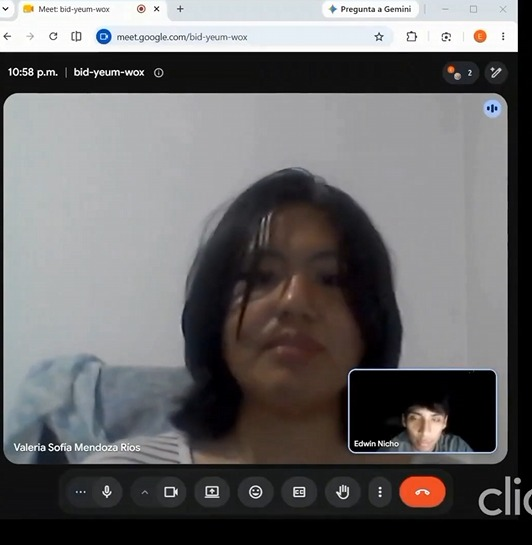

<div class="center">

*Figura: Evidencia de Entrevista #4 – Valeria Sofía Mendoza Ríos*

*Captura de pantalla del servicio Google Meet que registra la entrevista realizada por Edwin Nicho a Valeria Sofía
Mendoza Ríos (operadora de drones de fumigación). Muestra la interfaz de llamada a
las 10:58 p.m. con el nombre del código de reunión*

</div>

*Ver entrevista 4: https://drive.google.com/file/d/1bX9HVre3tKKn_i6xJ4ZcYVOJnFxwul1M/view?usp=sharing*

**Resumen de entrevista:**

Valeria Sofía Mendoza Ríos, estudiante de 8vo ciclo de Ingeniería Agrícola y operadora de drones agrícolas en el valle de Cañete (con salidas a Mala y Chincha), utiliza la tablet integrada al control del dron y su teléfono en campo, y al finalizar la jornada su laptop con Google Chrome para planificar vuelos, cartografía y reportes; coordina citas por WhatsApp, organiza compromisos en Google Calendar y gestiona costos y mantenimiento en Google Sheets. Opera drones de 30 litros con boquillas pulverizadoras finas en palto, cítricos y maíz, cobrando entre 70 y 90 soles por hectárea, y su dificultad crítica es la carencia de planos precisos: debe caminar linderos o volar a baja altura para marcar puntos manualmente, perdiendo entre 40 y 60 minutos antes de despegar. Afronta reclamos por diferencias entre el área declarada y la superficie neta tratada por el GPS del dron, registra bitácoras en hojas de cálculo con omisiones por fatiga, y ante vientos superiores a 12-15 km/h o temperaturas mayores a 28°C las suspensiones generan fricciones con los agricultores por falta de reportes técnicos inmediatos. Es analítica, técnica, proactiva y orientada a la seguridad de vuelo. Considera muy beneficioso visualizar pedidos programados con parcelas georreferenciadas en un mapa interactivo, valora una bitácora web rápida que emita actas instantáneas, respalda las alertas climáticas basadas en datos meteorológicos y califica de muy práctica la supervisión en tiempo real del dron (batería, avance y ubicación).

| Detalle | Información |
|:---|:---|
| **Entrevistador** | Edwin Nicho |
| **Entrevistado** | Valeria Sofía Mendoza Ríos |
| **Edad** | 25 años |
| **Ubicación** | Valle de Cañete (Lima Provincias) |
| **Duración / Empieza en** | 8:50 / 20:05 |
| **Enlace** | https://drive.google.com/file/d/1bX9HVre3tKKn_i6xJ4ZcYVOJnFxwul1M/view?usp=sharing |

##### Entrevista #5


<div class="center">

*Figura: Evidencia de Entrevista #5 – Daniel Arias Dextre*

*Captura de pantalla de videollamada en la plataforma Zoom llevada a cabo por el entrevistador Italo Damacen
con Daniel Arias Dextre (co-gestor de servicios de fumigación aeroagrícola). La imagen documenta la entrevista
técnica sobre logística y uso de equipos DJI Agras T10*

</div>

*Ver entrevista 5: https://drive.google.com/file/d/1bX9HVre3tKKn_i6xJ4ZcYVOJnFxwul1M/view?usp=sharing*

**Resumen de entrevista:**

Daniel Arias Dextre, de 24 años, es asistente técnico operativo y co-gestor del negocio familiar de fumigación agroaérea en representación de su padre Roberto Arias, con operaciones en el Valle de Ica y Arequipa. En campo usa un smartphone Android con Google Chrome y una tablet de apoyo para revisión fotográfica; para el cierre administrativo usa una laptop con Excel, y sus herramientas de coordinación (WhatsApp y Google Calendar) le generan desorden y pérdida recurrente de información por la dispersión de mensajes. Prestan servicios en fundos de algodón, espárrago y vid con un dron DJI T10 de 10 litros más una unidad de respaldo, cubriendo de 15 a 25 ha/día a 35-55 soles/ha; la coordinación previa es caótica porque los clientes envían referencias imprecisas, obligándolos a recorrer el perímetro a pie junto al capataz y perdiendo más de 30 minutos antes de operar. Enfrentan desconfianza y quejas por diferencias entre hectáreas estimadas y reales, no cuentan con bitácora digital (anotan en libretas de papel que luego transcriben a Excel) y monitorean el clima con Google Weather y un anemómetro manual (límite de 15 km/h), sin actas formales para justificar suspensiones. Es joven, colaborador, pragmático y con visión modernizadora sobre el negocio de su padre. Considera muy provechoso visualizar las parcelas prediseñadas en un mapa satelital, estimando un ahorro de 20 a 30 minutos por servicio, valora la bitácora web rápida para eliminar el papeleo y respalda la planificación anticipada de rutas de vuelo sobre el mapa.

| Detalle | Información |
|:---|:---|
| **Entrevistador** | Italo Damacen |
| **Entrevistado** | Daniel Arias Dextre (en representación de Roberto Arias) |
| **Edad** | 24 años |
| **Ubicación** | Reside en Lima (operaciones en Valle de Ica y Arequipa) |
| **Duración / Empieza en** | 6:36 / 28:56 |
| **Enlace** | https://drive.google.com/file/d/1bX9HVre3tKKn_i6xJ4ZcYVOJnFxwul1M/view?usp=sharing |

##### Entrevista #6


<div class="center">

*Figura: Evidencia de Entrevista #6 – Eduardo Osorio*

*Captura de pantalla de videollamada entre Alejandro Samir Choquehuanca y el piloto agropecuario Eduardo Osorio. Muestra las imágenes
en directo de ambos participantes dialogando sobre la problemática de delimitación de áreas y disputas de cobro en Cañete y Chincha.*

</div>

*Ver entrevista 6: https://drive.google.com/file/d/1bX9HVre3tKKn_i6xJ4ZcYVOJnFxwul1M/view?usp=sharing*

**Resumen de entrevista:**

Eduardo Osorio, de 34 años, es técnico agropecuario y piloto certificado de drones agrícolas (DGAC), con formación adicional del fabricante DJI Agras, y presta servicios de fumigación principalmente en el valle de Cañete y Chincha, con trabajos ocasionales en Ica. En campo usa un smartphone Android con Google Chrome y una tablet de campo integrada al control del dron; no cuenta con laptop propia y depende de la de un familiar para reportes administrativos. Coordina toda su operación por WhatsApp, lleva su agenda en un cuaderno físico y delega la facturación a su esposa en una hoja de Excel simple, sin usar Google Calendar ni otras herramientas digitales. Opera con un DJI Agras T30 de 30 litros, ofreciendo servicios preventivos y curativos en cultivos de algodón, maíz, palto y espárrago, a un precio de 35 a 45 soles por hectárea. Enfrenta disputas frecuentes con agricultores por diferencias entre el área estimada y la realmente cubierta, ya que estos miden "a ojo" sin referencia técnica clara. La coordinación de citas es desgastante por la falta de un calendario visual, generando cruces de trabajos y pérdida de tiempo en traslados. Cuando el predio no tiene coordenadas exactas, debe caminar el perímetro en modo manual antes del vuelo automático, perdiendo entre 20 y 40 minutos por servicio. No lleva bitácora digital (registra todo en un cuaderno de campo que transcribe tardíamente a Excel) y evalúa el clima con la app Windy la noche previa y un anemómetro manual en campo, sin evidencia formal para justificar suspensiones por viento o lluvia ante el cliente. Se muestra receptivo y pragmático frente a la digitalización de su negocio: considera muy útil visualizar las parcelas ya dibujadas en un mapa satelital antes del vuelo, valora una bitácora web rápida para dar transparencia inmediata al agricultor, y ve en las alertas climáticas automáticas una forma de respaldar técnicamente sus decisiones de pausar labores.

| Detalle | Información |
|:---|:---|
| **Entrevistador** | Alejandro Samir |
| **Entrevistado** | Eduardo Osorio |
| **Edad** | 34 años |
| **Ubicación** | Opera en el valle de Cañete y Chincha (ocasionalmente Ica) |
| **Duración / Empieza en** | 5:12 / 35:34 |
| **Enlace** | https://drive.google.com/file/d/1bX9HVre3tKKn_i6xJ4ZcYVOJnFxwul1M/view?usp=sharing |


### 2.2.3. Análisis de entrevistas

El análisis de las entrevistas realizadas permite identificar patrones claros en los dos segmentos objetivo de AgriDron Solutions: agricultores y administradores de fincas, y operadores técnicos y proveedores de fumigación con drones. A partir de las entrevistas, se evidencian problemas recurrentes relacionados con la delimitación de parcelas, la coordinación de servicios, el registro de las aplicaciones, las condiciones climáticas y la falta de información precisa sobre el área realmente fumigada.

#### Segmento 1: Agricultores y Administradores de Fincas

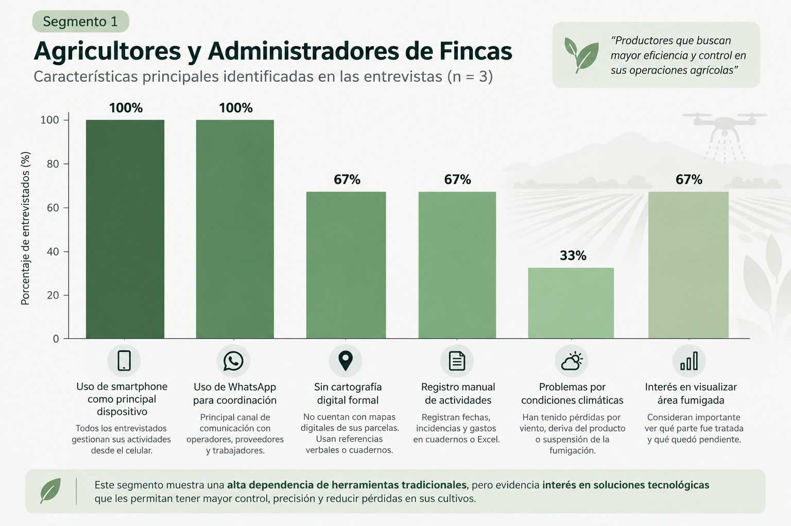

*Figura: Análisis de Entrevistas – Segmento 1 (Agricultores y Administradores de Fincas)*

*Infografía estadística con gráfico de barras verticales que sintetiza los hallazgos del Segmento 1
($n = 3$). Destaca que el 100% de los entrevistados utiliza smartphone y WhatsApp como herramientas principales,
el 100% realiza registros manuales o carece de cartografía digital formal, el 33% ha sufrido pérdidas por
factores climáticos y el 67% muestra un interés directo en visualizar las áreas fumigadas frente a las pendientes.*

Este segmento agrupa a agricultores y administradores de fincas que gestionan sus actividades principalmente mediante métodos tradicionales y herramientas digitales básicas. Los tres entrevistados utilizan smartphones como principal dispositivo de trabajo y dependen de WhatsApp para coordinar servicios, proveedores y operadores de fumigación.

### Gestión de las parcelas y registros

El 100% de los entrevistados no cuenta con una cartografía digital formal de sus parcelas. Los límites de los terrenos se conservan principalmente de memoria, mediante referencias verbales o utilizando cuadernos y planos físicos. Esto genera dificultades al momento de coordinar la fumigación, especialmente cuando existen varios lotes, obstáculos o zonas que requieren un tratamiento diferenciado.

Asimismo, el 100% lleva los registros de las actividades agrícolas de manera manual o informal. Las fechas, incidencias y gastos se registran en cuadernos, fotografías sueltas o posteriormente en Excel, sin contar con un sistema centralizado que permita consultar el historial de las aplicaciones realizadas.

### Problemas con la fumigación

El 100% de los entrevistados manifestó problemas relacionados con la cobertura o precisión de las aplicaciones. Los agricultores no siempre pueden conocer con certeza qué parte de su parcela fue fumigada, debido a que los límites y obstáculos se comunican al operador principalmente de manera verbal.

Esta situación puede ocasionar aplicaciones de más o de menos, pérdida de producto, gastos innecesarios y dudas sobre la cantidad real de terreno tratado. En algunos casos, los agricultores deben recorrer posteriormente la parcela para verificar el área cubierta.

### Condiciones climáticas

El 100% consulta las condiciones climáticas antes de realizar una aplicación, principalmente mediante aplicaciones del celular. Sin embargo, existe una percepción de que la información disponible no siempre es suficientemente precisa para la ubicación específica de sus parcelas.

Los cambios repentinos de viento representan un problema recurrente, debido a que pueden provocar deriva del producto, evaporación o suspensión de la fumigación. Cuando esto ocurre, los agricultores no siempre reciben información clara sobre el motivo de la suspensión ni sobre cuánto terreno llegó a ser tratado.

### Canales de comunicación

El 100% utiliza WhatsApp como principal canal de comunicación para coordinar con operadores de drones, proveedores y trabajadores. Aunque es una herramienta habitual y accesible, la información importante queda dispersa entre conversaciones y mensajes.

Los entrevistados muestran preferencia por recibir información directamente en su celular, especialmente avisos sobre el clima, estado de la fumigación, área tratada y zonas pendientes.

### Adopción tecnológica

Los tres entrevistados muestran apertura hacia una solución tecnológica siempre que sea sencilla y no requiera conocimientos técnicos avanzados.

El 100% considera positiva la posibilidad de visualizar y delimitar sus parcelas mediante un mapa satelital interactivo. Sin embargo, uno de los entrevistados señaló que realizar esta delimitación desde una pantalla pequeña podría ser complicado y propuso contar con asistencia mediante GPS o apoyo inicial de un técnico.

Esto evidencia que la adopción tecnológica depende principalmente de que la herramienta sea intuitiva, rápida y acompañada de una orientación inicial cuando sea necesario.

### Funcionalidades de interés

- El 100% valora la delimitación de parcelas mediante mapas satelitales.
- El 100% considera importante recibir alertas meteorológicas antes de realizar una fumigación.
- El 100% considera necesario conocer visualmente el área tratada y el área pendiente.
- El 100% muestra interés en contar con registros digitales de las aplicaciones realizadas.
- El 100% valora la posibilidad de reprogramar las zonas que quedaron pendientes después de una suspensión.
- El 100% prefiere recibir información clara directamente en el celular.

#### Segmento 2: Operadores Técnicos y Proveedores de Fumigación con Drones

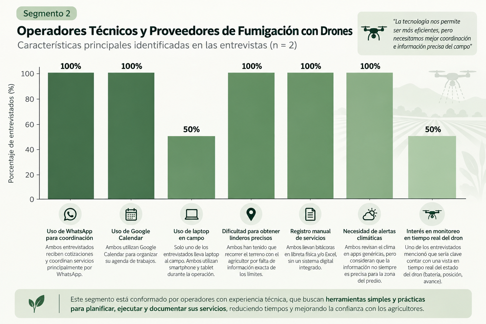

*Figura: Análisis de Entrevistas – Segmento 2 (Operadores Técnicos de Drones)*

*Infografía cuantitativa con gráfico de barras para el Segmento 2 ($n = 2$).
Registra un 100% de adopción en WhatsApp y Google Calendar para coordinación y
agendas, un 100% de dificultad crítica para obtener linderos precisos, un 100% de registros
de servicio en libretas/Excel y necesidad de alertas climáticas, un 50% de uso de laptops en
campo y un 50% de requerimiento explicito de monitoreo del dron en tiempo real.*

Este segmento está conformado por operadores técnicos que prestan servicios de fumigación agrícola con drones en diferentes valles de la costa peruana. Ambos entrevistados utilizan smartphones Android y tablets durante sus operaciones, mientras que las laptops son utilizadas principalmente para actividades administrativas y de planificación.

### Gestión de pedidos y coordinación

El 100% utiliza WhatsApp como principal canal para recibir solicitudes, realizar cotizaciones y coordinar los detalles de los servicios. Google Calendar también es utilizado por el 100% de los entrevistados para organizar sus citas y compromisos.

Sin embargo, la coordinación mediante mensajes y llamadas genera desorden cuando reciben varias solicitudes simultáneamente. Uno de los principales problemas identificados es la recepción de cotizaciones mientras el operador se encuentra realizando un vuelo, obligándolo a interrumpir su actividad para responder.

### Problemas principales

El 100% identifica como problema la falta de información precisa sobre la ubicación y los límites de los terrenos antes de trasladarse al campo.

Los agricultores suelen enviar ubicaciones aproximadas o referencias verbales, por lo que los operadores deben llegar antes de iniciar el servicio y recorrer los linderos junto con el propietario o capataz. Esta actividad genera pérdida de tiempo y retrasa el inicio de las operaciones.

Además, el 100% ha experimentado dificultades para demostrar al cliente la superficie realmente fumigada. Las diferencias entre las hectáreas estimadas por los agricultores y el área registrada por el dron pueden generar dudas y reclamos sobre el servicio.

### Registro de servicios

El 100% de los operadores utiliza actualmente registros físicos o herramientas no integradas para documentar sus servicios.

Las bitácoras se realizan en libretas, hojas sueltas o archivos de Excel que posteriormente deben ser transcritos. Esta metodología puede provocar omisiones, pérdida de información y registros incompletos de las incidencias ocurridas durante la fumigación.

### Gestión de suspensiones

El 100% enfrenta situaciones en las que debe suspender o reprogramar una aplicación debido a condiciones climáticas u otros imprevistos.

Actualmente, las suspensiones se comunican principalmente de manera verbal al agricultor y no siempre existe un reporte técnico que permita demostrar el motivo de la interrupción, el avance realizado o el área que quedó pendiente.

Esta situación puede generar dudas y discusiones entre el operador y el cliente.

### Necesidades tecnológicas

El 100% muestra interés en una plataforma que permita visualizar las órdenes de servicio junto con las parcelas previamente delimitadas en un mapa satelital.

Las principales funcionalidades identificadas son:

- Visualización de órdenes de servicio en un calendario.
- Parcelas georreferenciadas y previamente delimitadas.
- Registro digital de bitácoras.
- Visualización de hectáreas tratadas.
- Registro del volumen aplicado.
- Registro de incidencias.
- Alertas meteorológicas automáticas.
- Reportes técnicos para justificar suspensiones.
- Información centralizada del cliente, terreno y servicio.
- Visualización del estado del dron durante la operación.

### Supervisión del dron

El 50% de los entrevistados señaló de manera explícita que contar con una vista centralizada del estado del dron sería clave para la operación, permitiendo visualizar batería, posición y avance en una sola pantalla.

El otro 50% no manifestó una necesidad explícita de esta funcionalidad durante la entrevista, aunque sí mostró interés en herramientas relacionadas con la planificación, registro y seguimiento de los servicios.

### Conclusiones para el diseño de arquetipos

### Automatización simple y práctica

Los resultados muestran que ambos segmentos actualmente dependen de herramientas dispersas como WhatsApp, cuadernos, Excel y aplicaciones meteorológicas. Por ello, la plataforma debe centralizar la información sin aumentar la complejidad del trabajo.

La solución debe permitir realizar las tareas principales de manera rápida, especialmente desde dispositivos móviles, debido a que el smartphone es utilizado por el 100% de los entrevistados de ambos segmentos.

### Diferenciación de valor por segmento

- **Agricultores:** valoran principalmente conocer con precisión qué área fue fumigada, evitar pérdidas por mala cobertura, recibir alertas climáticas y poder reprogramar las zonas pendientes.
- **Operadores:** necesitan principalmente reducir el tiempo de coordinación, disponer de parcelas georreferenciadas, registrar digitalmente las aplicaciones y contar con evidencia técnica ante suspensiones o reclamos.

### Reducción de fricción

El sistema debe reducir la dependencia de WhatsApp, llamadas telefónicas, referencias verbales, cuadernos y hojas de cálculo.

Para los agricultores, la principal fricción se encuentra en la falta de visibilidad sobre el área realmente fumigada y en la incertidumbre provocada por las condiciones climáticas.

Para los operadores, la principal fricción se encuentra en la coordinación previa, la falta de límites precisos de las parcelas y el registro manual de los servicios.

Por ello, la plataforma debe ofrecer una solución rápida y estructurada que permita conectar al agricultor con el operador, compartir la ubicación exacta de la parcela y mantener un historial digital de cada servicio.

### Oportunidad clave

Existe una oportunidad de centralizar en una sola plataforma los procesos que actualmente se realizan mediante diferentes herramientas.

La solución puede integrar la delimitación de parcelas en mapas satelitales, la programación de servicios, las alertas meteorológicas, el registro de bitácoras y la visualización del avance de la fumigación.

De esta manera, se busca reducir el tiempo previo a cada servicio, disminuir los errores relacionados con la superficie tratada y proporcionar evidencia clara tanto al agricultor como al operador sobre el desarrollo y resultado de cada aplicación.


## 2.3. Needfinding.

### 2.3.1. User Personas.
#### Persona 1: Laura Ramos Paucar

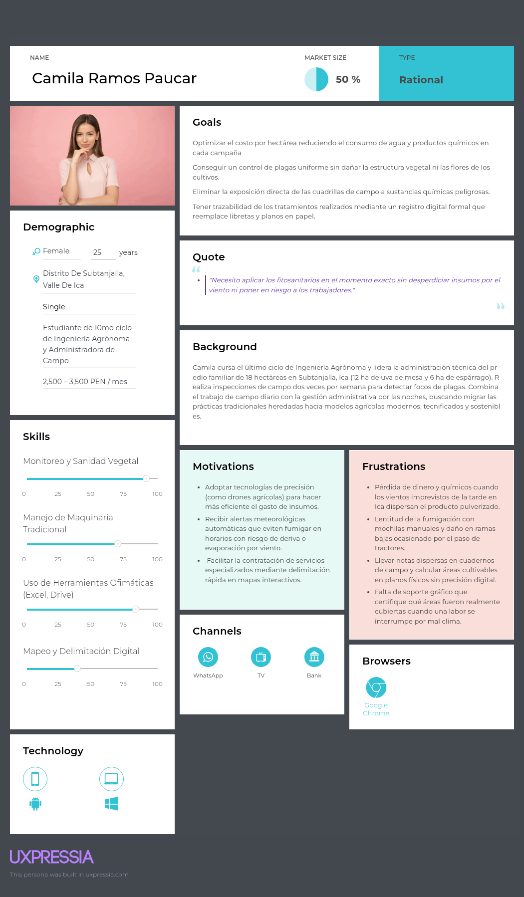

*Figura: User Persona 1 – Laura Ramos Paucar (Segmento 1)*
*Artefacto de diseño de experiencia de usuario desarrollado en UXPressia
que presenta la ficha del arquetipo del agricultor racional. Incluye la
fotografía de una joven en un cultivo sosteniendo una tablet, datos demográficos
(25 años, Subtanjalla, Ica), citas textuales sobre el uso eficiente de fitosanitarios,
sus objetivos de optimización de costos, frustraciones por pérdidas debidas al viento,
y barras de nivel para sus habilidades tecnológicas y canales de comunicación habituales
(WhatsApp, Banca Móvil BCP, Google Chrome).*


#### Persona 2: Diego mendoza Rios

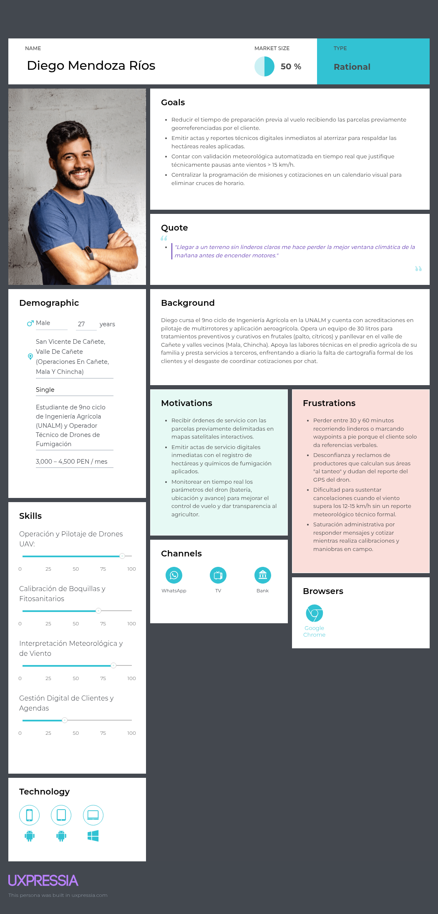

*Figura: User Persona 2 – Diego Mendoza Ríos (Segmento 2)*
*Ficha de User Persona en UXPressia que describe al arquetipo del operador técnico de drones.
Contiene la imagen representativa de un operador revisando una tablet en campo, sus datos
clave (27 años, Cañete), motivaciones enfocadas en la recepción de parcelas georreferenciadas
y emisión de actas digitales, frustraciones vinculadas a la pérdida de tiempo midiendo predios
a pie y disputas por mediciones "al ojo", junto con sus herramientas de trabajo (Android, Windows,
Google Calendar, llamadas directas).*

### 2.3.2. User Task Matrix

A continuación se presenta el User Task Matrix que consolida y compara las principales tareas que realizan los dos arquetipos de usuario del proyecto: **Camila Ramos Paucar** (Segmento 1: Agricultores y Administradores de Fincas) y **Diego Mendoza Ríos** (Segmento 2: Operadores Técnicos y Proveedores de Fumigación con Drones). Estas tareas corresponden a actividades del mundo real que se ejecutan independientemente de la existencia de la solución de software.

| ID | Tarea del Dominio Agrícola (Task) | Camila Ramos Paucar (Agricultora) | | Diego Mendoza Ríos (Operador Técnico) | |
|:---:|:---|:---:|:---:|:---:|:---:|
| | | **Frecuencia** | **Importancia** | **Frecuencia** | **Importancia** |
| **TK01** | Inspección fitosanitaria y detección de daños en cultivo | Alta | Crítica | Baja | Media |
| **TK02** | Coordinación, consulta de tarifas y acuerdo de fechas | Media | Media | Alta | Media |
| **TK03** | Monitoreo y comprobación de condiciones climáticas locales | Alta | Crítica | Alta | Crítica |
| **TK04** | Delimitación física y entrega de linderos del predio | Baja | Media | Alta | Crítica |
| **TK05** | Calibración de boquillas y dosificación de insumos químicos | Baja | Crítica | Alta | Crítica |
| **TK06** | Supervisión de vuelo y constatación de cobertura del lote | Media | Crítica | Alta | Crítica |
| **TK07** | Sustentación técnica y gestión de pausas por clima adverso | Baja | Crítica | Media | Crítica |
| **TK08** | Registro de bitácoras de campo y control de costos | Media | Media | Alta | Media |
| **TK09** | Cierre de servicio, liquidación y pago de hectáreas tratadas | Media | Media | Alta | Media |


<div align="center">

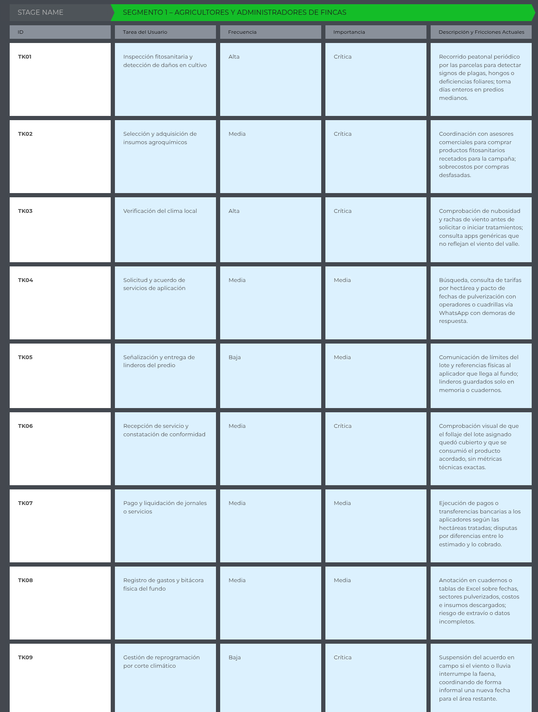

*Figura 2.1: User Task Matrix desarrollado en UXPressia para el Segmento 1.*

</div>

<div align="center">

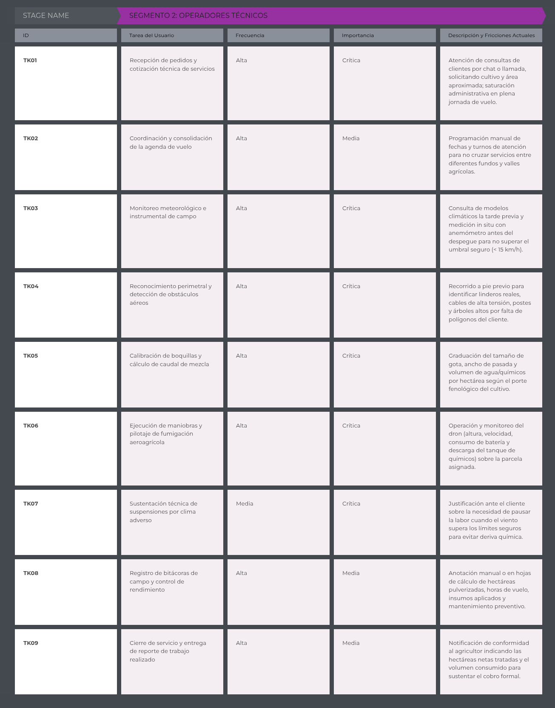

*Figura 2.2: User Task Matrix desarrollado en UXPressia para el Segmento 2.*

</div>

#### Análisis de tareas, coincidencias y diferencias

* **Tareas con mayor frecuencia e importancia:**
  * **Verificación de condiciones climáticas (TK03):** Representa una coincidencia unánime con frecuencia **Alta** e importancia **Crítica** para ambos actores. Un pronóstico inadecuado o ráfagas imprevistas de viento (> 15 km/h) generan la deriva del pesticida (pérdida económica y daño ambiental para el agricultor) o el aborto de la misión en campo (pérdida logística y de combustible para el operador).
  * **Constatación de cobertura y supervisión de vuelo (TK06):** Ambos perfiles coinciden en una importancia **Crítica**. Camila necesita la certeza de que el follaje del lote fue pulverizado de manera uniforme para salvar su cosecha, mientras que Diego asume la responsabilidad operativa del vuelo, el control de batería y la descarga del tanque del dron.

* **Principales diferencias operativas:**
  * **Inspección agronómica (TK01):** Es de frecuencia **Alta** para Camila (recorre sus parcelas semanalmente para monitorear plagas), mientras que para Diego es de frecuencia **Baja** o secundaria, ya que él interviene cuando el problema fitosanitario ya fue diagnosticado y se requiere la aplicación aérea.
  * **Delimitación de linderos y reconocimiento perimetral (TK04):** Para el agricultor tiene frecuencia **Baja** (solo cuando contrata un nuevo servicio o rota de lote), pero para el operador técnico es de frecuencia **Alta** e importancia **Crítica** (debe recorrer y verificar los límites de cada nuevo cliente antes de volar para prevenir colisiones con árboles, cables de alta tensión o acequias).
  * **Calibración técnica y registro de bitácoras (TK05 y TK08):** Constituyen tareas de frecuencia **Alta** para el operador en cada jornada de vuelo para mantener la aeronavegabilidad y el balance de insumos, mientras que para el agricultor son tareas periódicas de supervisión y archivo contable.


### 2.3.3. User Journey Mapping

En esta sección se presentan los User Journey Maps en su versión As-Is para cada segmento objetivo. Estos mapas resumen el recorrido actual de los usuarios en la gestión de sus tareas más relevantes, desde la identificación de una necesidad hasta la resolución manual de sus actividades, permitiendo visualizar pasos, fricciones, puntos de dolor y oportunidades de mejora antes de la intervención de AgriDron.
- **Segmento objetivo 1: **
  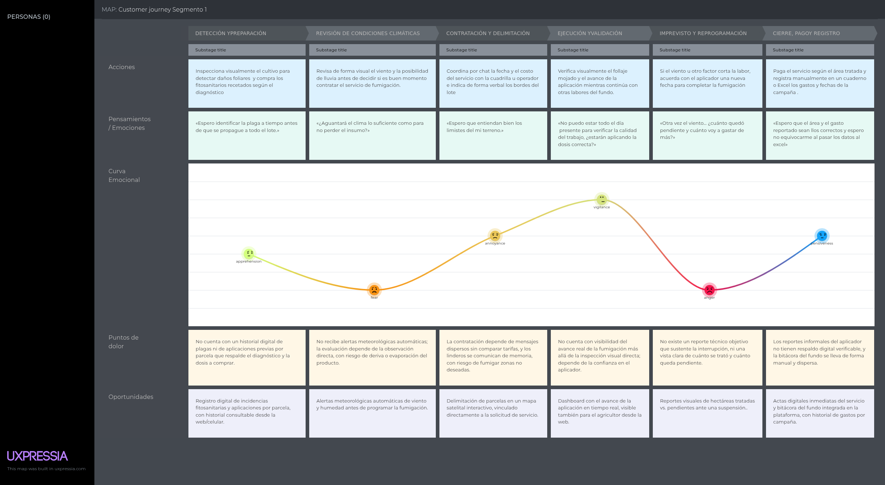

- **Segmento objetivo 2: **
  


### 2.3.4. Empathy Mapping

Los siguientes Empathy Maps fueron elaborados a partir de las observaciones extraídas de las entrevistas y organizan, para cada User Persona, lo que el usuario dice, piensa, hace y siente en su contexto actual. Este artefacto permite profundizar en sus pains, gains, preocupaciones y motivaciones, facilitando una comprensión más humana del problema y orientando mejor las decisiones posteriores de diseño.

- **Segmento objetivo 1: Pequeños y Medianos Agricultores / Propietarios de Fincas**
  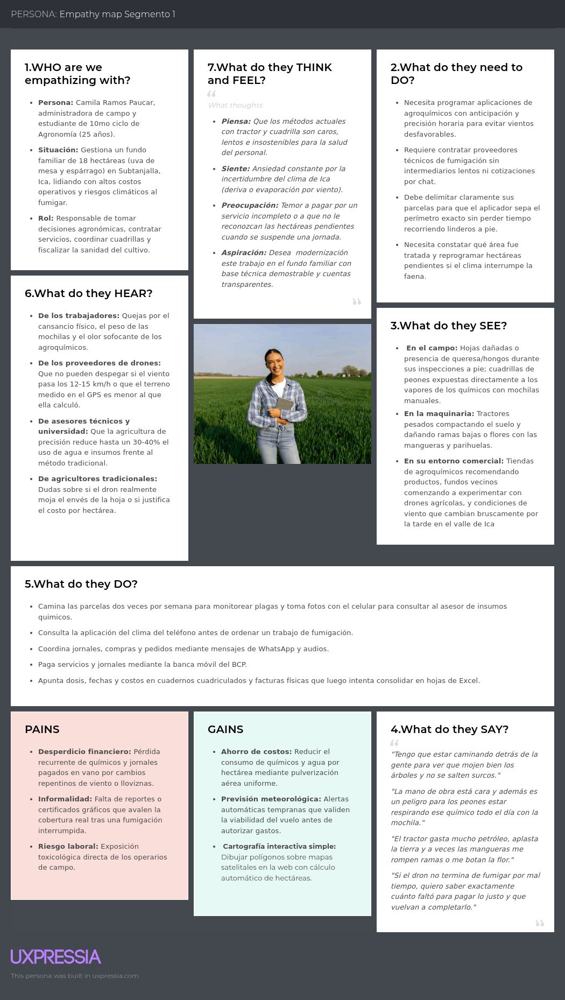
  *Figura: Empathy Map – Segmento 1: Agricultores y Administradores*
  *Diagrama de empatía estructurado en siete bloques en UXPressia para el arquetipo de
  Camila Ramos. Detalla lo que el usuario ve en el campo (hojas dañadas, tractores compactando el suelo),
  lo que oye (quejas por peso de mochilas, recomendaciones de insumos), lo que piensa y siente
  (ansiedad por el clima, temor a pagar por servicios incompletos), lo que dice y hace
  (recorrer parcelas, usar WhatsApp y banca móvil), así como sus dolores (desperdicio financiero e informalidad)
  y ganancias (ahorro de insumos y cartografía satelital interactiva).*

<br>

- **Segmento objetivo 2: Operadores Técnicos y Proveedores de Servicios de Fumigación con Drones**
  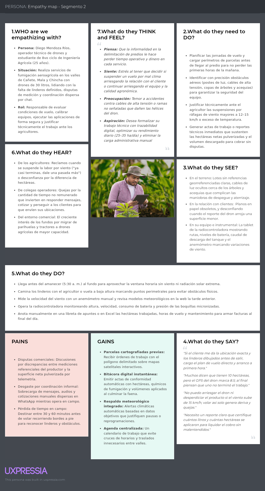

*Figura: Empathy Map – Segmento 2: Operadores Técnicos y Proveedores de Servicios de Fumigación con Drones*

*Diagrama de empatía en UXPressia enfocado en el operador Diego Mendoza. Organiza la experiencia del piloto
dividida en: qué ve en el terreno (cables ocultos, planos en papel obsoletos), qué escucha (reclamos de
agricultores por suspensiones de vuelo), qué piensa y siente (estrés por decidir si volar con viento o arriesgar el equipo),
sus acciones cotidianas (despegar al amanecer, medir viento con anemómetro), sus dolores (disputas por hectáreas, sobrecarga
de mensajes por WhatsApp) y ganancias esperadas (parcelas delimitadas previamente, actas de servicio instantáneas y
respaldo meteorológico).*

## 2.4. Big Picture EventStorming

**OPEN**

La fase "Open" (Exploración Abierta) constituye el primer paso del taller de Event Storming, diseñado para fomentar una lluvia de ideas sin restricciones tecnológicas ni arquitectónicas. En esta etapa inicial, el objetivo principal es capturar todos los Eventos de Dominio relevantes de la operativa actual (redactados siempre en tiempo pasado) para mapear el proceso físico real de la fumigación agrícola de extremo a extremo, evidenciando cómo fluye el negocio desde la solicitud inicial del cliente hasta el cierre del servicio, antes de la introducción de AgriDron Solutions.

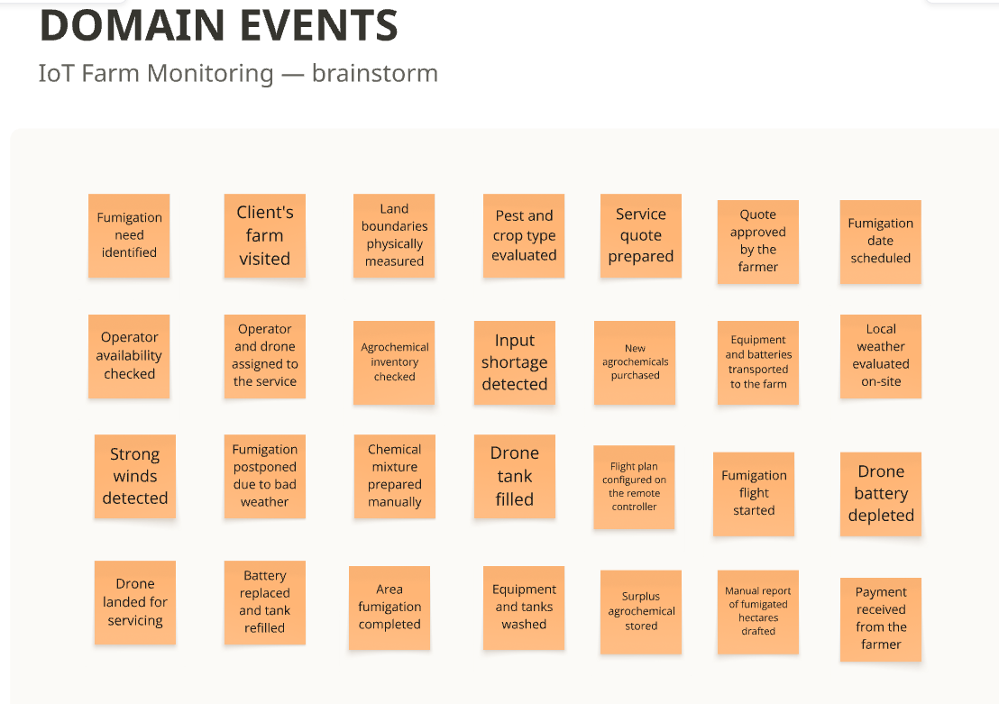

**EXPLORE**

Durante la fase "Explore" (Exploración Secuencial), el modelo caótico inicial se consolida estructurando los eventos descubiertos en una estricta línea de tiempo cronológica de izquierda a derecha. En este punto, el ecosistema se enriquece introduciendo visualmente a los actores humanos involucrados en cada paso, las herramientas empíricas o sistemas que utilizan actualmente y, de manera crítica, los puntos de dolor (Pain Points) logísticos y operativos que justifican la necesidad y el valor de negocio de implementar la plataforma de software.

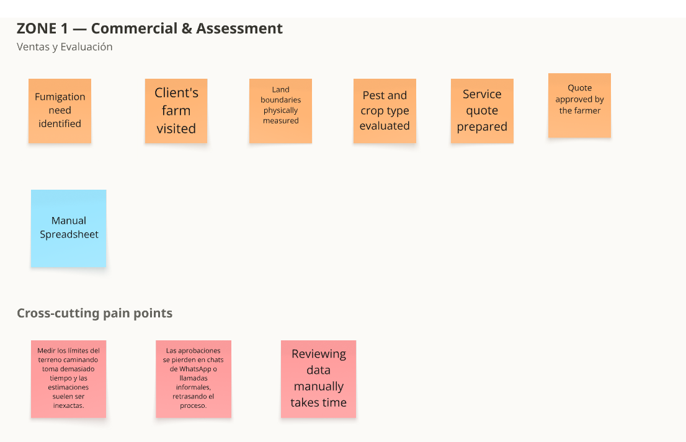

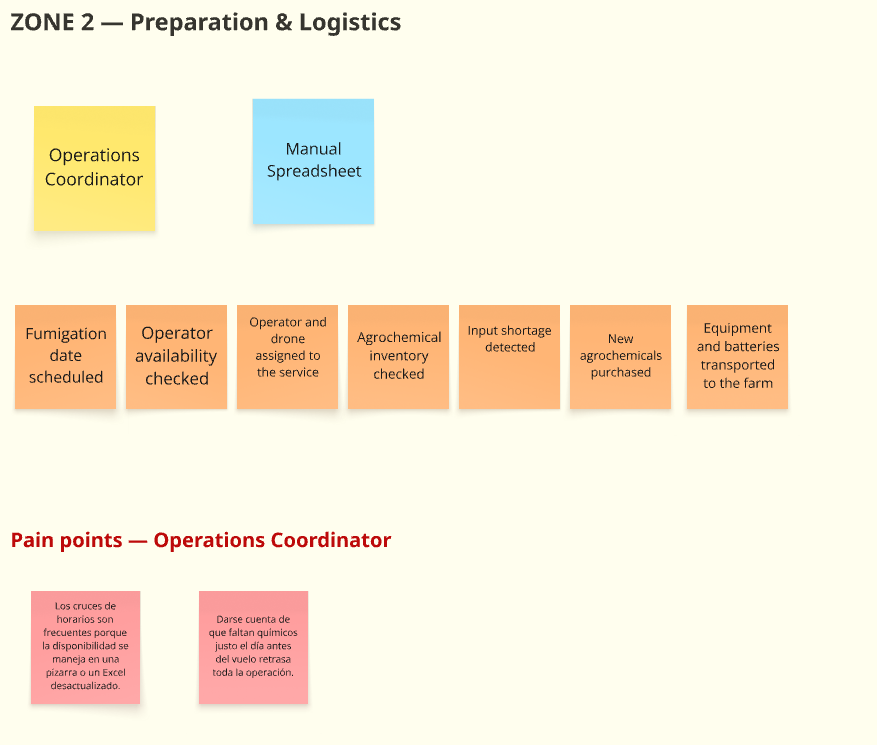

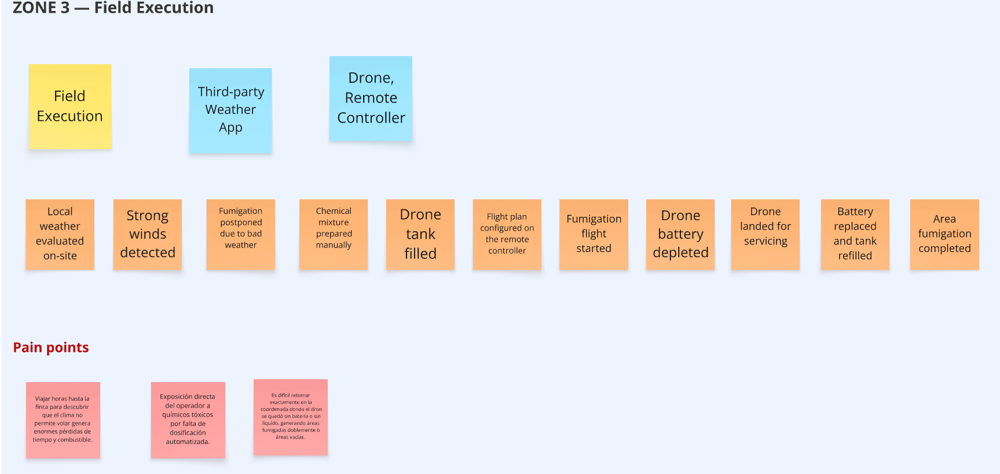

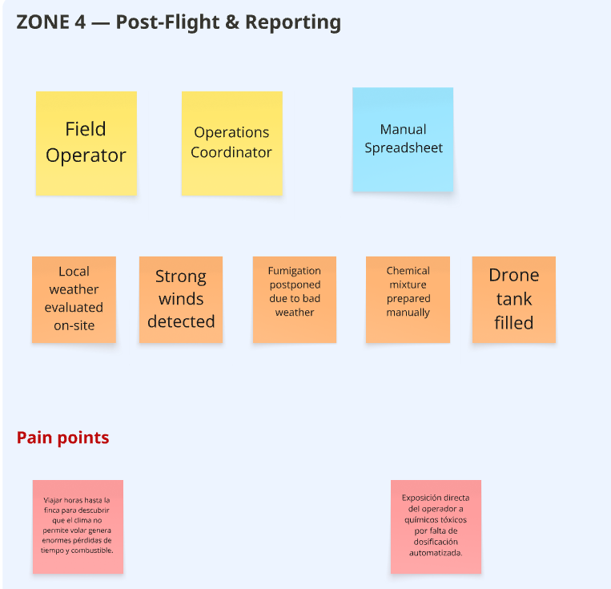

**CLOSE**

La fase "Close" (Cierre y Definición de Alcance) actúa como la culminación del taller, orientada a tomar decisiones tangibles de diseño y establecer los límites técnicos del proyecto. La información y fricciones descubiertas se clasifican en tres tableros estratégicos: los problemas operativos críticos que la arquitectura debe resolver obligatoriamente, las interrogantes técnicas que exigen mayor investigación por parte del equipo, y los procesos funcionales que quedan explícitamente fuera del alcance (Out of Scope) para la versión actual, previniendo así el desborde de requerimientos.

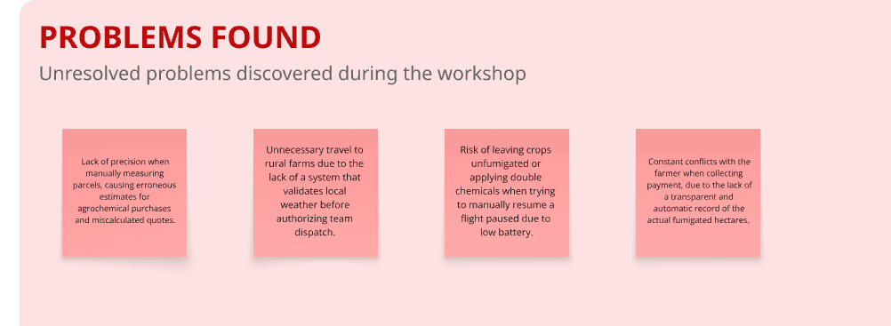

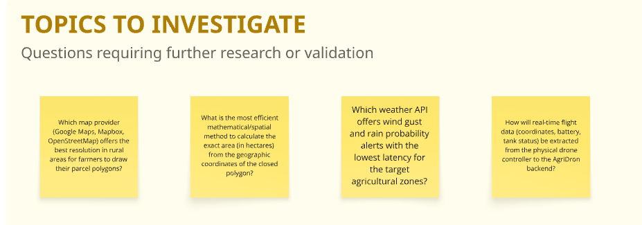

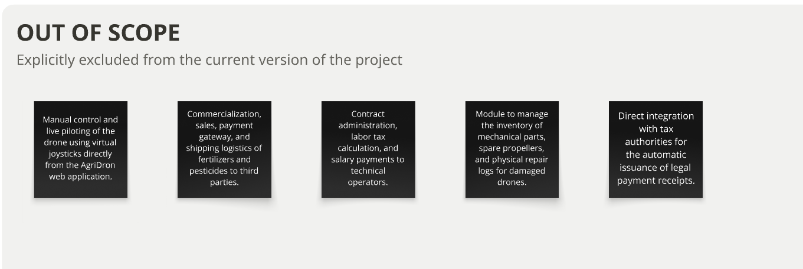

**URL completo del tablero de trabajo en Miro:**
https://miro.com/welcomeonboard/TTZqTjVVY2FwVHRweVBhSnhsdFk2ajFjWUFVM2hTaWVrYk1sLzN5NVAzcHhzSHhTRmFuaW5WV0ZiK2tDcXRvdXBJY1BOcit0OGljUlptWGxHbDVaUWFKa0EydzdPN20yN3dxUXNXSzdXb1FBTHVPcUFNQ0tVZ2Q4bUdMZTk4THN3VHhHVHd5UWtSM1BidUtUYmxycDRnPT0hdjE=?share_link_id=100284565376

---


## 2.5. Ubiquitous Language

El Ubiquitous Language es el lenguaje compartido entre el equipo, los stakeholders y los usuarios del negocio. En AgriDron se utilizarán términos del dominio expresados en inglés, con definiciones en español, para asegurar que los conceptos clave de fumigación, monitoreo y coordinación entre agricultores y operadores mantengan un significado único y consistente en toda la solución.

#### Cross-Domain Terms

| Term | Definición | Context |
|:---|:---|:---|
| **Farmer** | Usuario propietario o administrador de una o más fincas, responsable de registrar parcelas, crear misiones de fumigación y consultar el historial y los reportes de productividad de sus operaciones. | Business actor |
| **Operator** | Piloto certificado que ejecuta las misiones de fumigación en campo, monitorea los parámetros del dron durante el vuelo y reporta incidencias o avances de la operación. | Business actor |
| **Supervisor** | Usuario responsable de asignar misiones a operadores disponibles, monitorear en tiempo real el estado de los drones activos, gestionar el inventario de insumos y consultar reportes de eficiencia operativa. | Access and responsibilities |

#### Farm and Mission Terms

| Term | Definición | Context |
|:---|:---|:---|
| **Farm** | Predio agrícola registrado por un Agricultor en la plataforma, identificado por nombre, ubicación geográfica y tamaño en hectáreas. Puede contener una o más parcelas. | Farm management |
| **Plot / Spraying Area** | Polígono delimitado sobre un mapa satelital dentro de los límites de una finca, sobre el cual se planifica y ejecuta una misión de fumigación. Su superficie se calcula automáticamente en hectáreas al momento de dibujarla. | Farm management |
| **Spraying Mission** | Solicitud de servicio creada por un Agricultor sobre un área y un cultivo específicos. Atraviesa los estados *Pendiente*, *Asignada*, *En Progreso*, *Pausada* y *Completada* a lo largo de su ciclo de vida. | Mission lifecycle |
| **Incident** | Evento imprevisto registrado por un Operador durante una misión en progreso (por ejemplo, clima adverso o falla técnica del equipo), que puede derivar en la pausa automática de la misión y una alerta al Supervisor. | Mission lifecycle |
| **Service Record** | Registro digital inmediato emitido al completar una misión, que detalla las hectáreas efectivamente fumigadas y los químicos aplicados, sirviendo como evidencia verificable frente al cliente. | Mission lifecycle |

#### Field Operations Terms

| Term | Definición | Context |
|:---|:---|:---|
| **Geofence** | Perímetro virtual asociado a una finca registrada, utilizado para validar automáticamente si un Operador se encuentra físicamente dentro del predio antes de iniciar el registro de su jornada de trabajo. | Field operations |
| **Work Shift** | Periodo de tiempo trabajado por un Operador en campo, cuyo registro se inicia automáticamente al confirmarse su ubicación dentro de la geocerca de la finca, o de forma manual con verificación del Supervisor si esto no es posible. | Field operations |
| **Real-time Monitoring Dashboard** | Panel que muestra la posición GPS, el nivel de batería, el estado de vuelo y el avance porcentual de los drones activos, actualizado continuamente durante la ejecución de una misión. | Real-time monitoring |

#### Reporting and Supply Terms

| Term | Definición | Context |
|:---|:---|:---|
| **Productivity Report** | Documento generado por el Agricultor que resume, por finca y rango de fechas, el área total fumigada, los insumos utilizados, las horas de operación, el costo por hectárea y el rendimiento estimado. | Reporting |
| **Operational Efficiency Report** | Documento generado por el Supervisor con métricas de desempeño como tiempo promedio por hectárea, costo por hectárea, eficiencia en el uso de insumos y horas-hombre invertidas, incluyendo comparativas entre operadores. | Reporting |
| **Supply Inventory** | Registro del stock disponible de pesticidas y fertilizantes gestionado por el Supervisor, con umbrales mínimos que generan alertas de reabastecimiento cuando el stock es crítico. | Supply management |
| **Weather Conditions** | Información meteorológica obtenida de un servicio externo (Weather API) y consultada antes o durante una misión, utilizada para planificar operaciones y sustentar pausas por viento u otros factores adversos. | Weather monitoring |

# Capítulo III: Requirements Specification

## 3.1. User Stories

En esta sección se definen y consolidan los requisitos del proyecto AgriDron Solutions a través de un conjunto unificado de Historias de Usuario (User Stories) e Historias Técnicas (Technical Stories). Estos requisitos han sido derivados de las Épicas (Epics) del proyecto, las cuales se encuentran estrictamente alineadas con los Bounded Contexts identificados en el diseño de dominio (DDD) para asegurar la trazabilidad arquitectónica.

Para garantizar que los requisitos sean verificables y objetivos, cada historia cuenta con criterios de aceptación redactados en tiempo presente y tercera persona utilizando la estructura lógica de Gherkin (Dado-Cuando-Entonces), evitando hacer referencia a detalles específicos de la interfaz de usuario.

Asimismo, para facilitar la identificación, el alcance y el contexto de cada requisito dentro de la plataforma, se ha establecido una nomenclatura específica para los identificadores (ID):

- **LP (Landing Page):** Identifica a las historias relacionadas con el sitio web público e informativo. Asumen el rol base de Visitante y están enfocadas en la presentación comercial, descubrimiento de funcionalidades, tarifas y conversión.
- **AU, FM, DR, MI, TR, CL, RP (Web Application):** Identifican a las historias operativas y transaccionales de la plataforma web privada, organizadas por Bounded Context (*AU: Autenticación y Usuarios, FM: Fincas y Parcelas, DR: Flota de Drones y Químicos, MI: Misiones de Fumigación, TR: Telemetría y Monitoreo, CL: Clima, RP: Reportes y Analítica*).
- **TU (Technical User Story):** Identifica a los requisitos técnicos de arquitectura, infraestructura, base de datos y servicios backend (RESTful API en C# ASP.NET Core). Asumen el rol de Developer.

| Epic / Story ID | Título                                                              | Descripción                                                                                                                                                                                      | Criterios de Aceptación                                                                                                                                                                                                                                                 | Relacionado con (Epic ID) |
|-----------------|---------------------------------------------------------------------|--------------------------------------------------------------------------------------------------------------------------------------------------------------------------------------------------|-------------------------------------------------------------------------------------------------------------------------------------------------------------------------------------------------------------------------------------------------------------------------|---------------------------|
| **EP01**        | **Descubrimiento e Información Comercial (Landing Page)**           | Definición general de la propuesta de valor y servicios públicos de la plataforma.                                                                                                               | --                                                                                                                                                                                                                                                                      | --                        |
| LP-001          | Visualización de propuesta de valor                                 | Como visitante, quiero visualizar la propuesta de valor de AgriDron Solutions en el portal principal, para entender los beneficios de la gestión de fumigación con drones.                       | Dado que el visitante ingresa al sitio web principal, cuando finaliza la carga del portal, entonces el sistema presenta la propuesta de valor centrada en la optimización agrícola.                                                                                     | EP01                      |
| LP-002          | Consulta de servicios de fumigación                                 | Como visitante, quiero conocer los servicios de precisión ofrecidos, para evaluar si responden a las necesidades de mi producción agrícola.                                                      | Dado que el visitante consulta la sección de servicios, cuando solicita información detallada, entonces el sistema muestra el catálogo de capacidades de fumigación y monitoreo.                                                                                        | EP01                      |
| LP-003          | Consulta de planes de suscripción                                   | Como visitante, quiero revisar las tarifas y planes disponibles, para seleccionar el esquema comercial adecuado.                                                                                 | Dado que el visitante navega hacia la oferta comercial, cuando consulta las tarifas, entonces el sistema muestra los planes diferenciados según extensión territorial y frecuencia de uso.                                                                              | EP01                      |
| LP-004          | Consulta sobre el equipo multidisciplinario                         | Como visitante, quiero conocer el perfil de los creadores de AgriDron Solutions, para verificar la trayectoria profesional del equipo.                                                           | Dado que el visitante accede a la sección corporativa, cuando revisa la trayectoria del equipo, entonces el sistema despliega las competencias técnicas y de ingeniería de los miembros.                                                                                | EP01                      |
| LP-005          | Solicitud de demostración comercial                                 | Como visitante del segmento agricultor, quiero enviar un formulario de contacto, para solicitar una demostración personalizada del servicio.                                                     | Dado que el visitante completa los campos obligatorios del formulario de contacto, cuando confirma el envío, entonces el sistema registra la solicitud y emite una confirmación de recepción.                                                                           | EP01                      |
| LP-006          | Consulta de preguntas frecuentes                                    | Como visitante, quiero revisar la sección de preguntas frecuentes, para resolver dudas sobre la tecnología de drones y normativas.                                                               | Dado que el visitante accede a la sección de ayuda pública, cuando selecciona una categoría de consulta, entonces el sistema despliega las respuestas sobre seguridad fitosanitaria y operatividad.                                                                     | EP01                      |
| LP-007          | Acceso a términos legales y políticas de privacidad                 | Como visitante, quiero revisar los términos de servicio y privacidad, para conocer el tratamiento de datos y condiciones legales.                                                                | Dado que el visitante selecciona el enlace de políticas, cuando la página se despliega, entonces el sistema presenta el documento legal estructurado y actualizado.                                                                                                     | EP01                      |
| **EP02**        | **Autenticación y Gestión de Usuarios**                             | Mecanismos de registro, acceso seguro y administración de roles dentro de la plataforma.                                                                                                         | --                                                                                                                                                                                                                                                                      | --                        |
| AU-001          | Registro de usuario agricultor                                      | Como agricultor, quiero registrar una cuenta en la plataforma, para gestionar mis terrenos y solicitar misiones de fumigación.                                                                   | Dado que el usuario no posee cuenta en el sistema, cuando ingresa sus datos personales y confirma el registro, entonces el sistema valida los datos y genera el perfil con rol de agricultor.                                                                           | EP02                      |
| AU-002          | Registro de operador técnico                                        | Como operador técnico, quiero registrarme en el sistema, para recibir asignaciones de misiones de vuelo.                                                                                         | Dado que un nuevo operador proporciona su identificación y credenciales técnicas, cuando completa el formulario de registro, entonces el sistema genera una cuenta con permisos operativos pendientes de activación.                                                    | EP02                      |
| AU-003          | Inicio de sesión seguro                                             | Como usuario registrado, quiero autenticarme mediante credenciales de acceso, para ingresar a mis funcionalidades personalizadas.                                                                | Dado que el usuario ingresa su correo electrónico y contraseña válidos, cuando solicita la autenticación, entonces el sistema valida la identidad y permite el acceso al panel correspondiente a su rol.                                                                | EP02                      |
| AU-004          | Recuperación de contraseña                                          | Como usuario registrado, quiero restablecer mi contraseña mediante correo electrónico, para recuperar el acceso ante un olvido.                                                                  | Dado que el usuario solicita el restablecimiento de clave indicando su correo, cuando el sistema confirma la existencia de la cuenta, entonces el sistema envía un enlace seguro de recuperación con tiempo de expiración.                                              | EP02                      |
| AU-005          | Edición de perfil de usuario                                        | Como usuario registrado, quiero actualizar mis datos de contacto y organización, para mantener la información al día.                                                                            | Dado que el usuario autenticado modifica sus datos de contacto, cuando confirma la actualización, entonces el sistema guarda los cambios y emite una notificación de éxito.                                                                                             | EP02                      |
| AU-006          | Asignación y gestión de roles                                       | Como administrador del sistema, quiero modificar los roles de un usuario, para otorgar o revocar permisos específicos.                                                                           | Dado que el administrador selecciona un usuario activo, cuando asigna un nuevo rol administrativo u operativo, entonces el sistema actualiza los privilegios de acceso en la plataforma.                                                                                | EP02                      |
| AU-007          | Cierre de sesión seguro                                             | Como usuario autenticado, quiero finalizar la sesión de trabajo, para proteger la confidencialidad de mis datos.                                                                                 | Dado que el usuario solicita el cierre de sesión, cuando confirma la acción, entonces el sistema invalida el token de acceso activo y redirige al portal público.                                                                                                       | EP02                      |
| **EP03**        | **Gestión Territorial de Fincas y Parcelas**                        | Catastro, delimitación geográfica y gestión de cultivos sobre mapas interactivos.                                                                                                                | --                                                                                                                                                                                                                                                                      | --                        |
| FM-001          | Registro de finca agrícola                                          | Como agricultor, quiero registrar las fincas de mi propiedad, para organizar geográficamente mis parcelas.                                                                                       | Dado que el agricultor proporciona el nombre, ubicación y departamento de su finca, cuando confirma el registro, entonces el sistema guarda la finca en la base de datos y la asocia a su perfil.                                                                       | EP03                      |
| FM-002          | Delimitación geográfica de parcela                                  | Como agricultor, quiero trazar los límites poligonales de una parcela sobre el mapa, para definir el área exacta de cultivo.                                                                     | Dado que el agricultor delimita los vértices de un terreno en la herramienta cartográfica, cuando confirma la geometría, entonces el sistema calcula el área en hectáreas y registra el polígono.                                                                       | EP03                      |
| FM-003          | Edición de contorno e información de parcela                        | Como agricultor, quiero modificar los límites y nombre de una parcela registrada, para actualizar cambios en la infraestructura del campo.                                                       | Dado que el agricultor selecciona una parcela existente, cuando ajusta sus vértices o cambia sus datos descriptivos y guarda, entonces el sistema actualiza la geometría y recalcula la superficie total.                                                               | EP03                      |
| FM-004          | Asignación de tipo de cultivo y fenología                           | Como agricultor, quiero especificar el cultivo y la etapa fenológica de la parcela, para parametrizar las misiones de pulverización.                                                             | Dado que el agricultor selecciona una parcela registrada, cuando especifica el tipo de cultivo y su estado de desarrollo, entonces el sistema almacena las características agrícolas de la parcela.                                                                     | EP03                      |
| FM-005          | Consulta y filtrado de parcelas                                     | Como agricultor, quiero filtrar mis parcelas por estado o tipo de cultivo, para ubicar rápidamente terrenos específicos.                                                                         | Dado que el agricultor consulta el inventario de terrenos, cuando aplica un filtro por cultivo o superficie, entonces el sistema presenta únicamente las parcelas que cumplen con el criterio seleccionado.                                                             | EP03                      |
| FM-006          | Deshabilitación de parcela agrícola                                 | Como agricultor, quiero inactivar una parcela fuera de producción, para retirarla de la lista de terrenos operativos.                                                                            | Dado que el agricultor selecciona una parcela sin misiones activas, cuando solicita su desactivación, entonces el sistema cambia el estado del terreno a inactivo sin eliminar el historial de misiones pasadas.                                                        | EP03                      |
| FM-007          | Cambio de capas en mapa cartográfico                                | Como agricultor, quiero alternar entre vistas satelital, topográfica e híbrida, para analizar las características del terreno.                                                                   | Dado que el usuario visualiza el mapa de parcelas, cuando selecciona un tipo de capa cartográfica, entonces el sistema actualiza la representación gráfica del mapa según la capa elegida.                                                                              | EP03                      |
| FM-008          | Asignación de supervisores de campo                                 | Como agricultor, quiero asociar supervisores de campo a fincas específicas, para delegar la gestión de misiones en dichos terrenos.                                                              | Dado que el agricultor posee personal a su cargo, cuando asigna un usuario supervisor a una finca registrada, entonces el sistema concede permisos de lectura y programación a dicho supervisor sobre las parcelas vinculadas.                                          | EP03                      |
| **EP04**        | **Gestión de Flota y Equipos de Fumigación**                        | Control de inventario de drones, insumos agrícolas, boquillas y mantenimiento.                                                                                                                   | --                                                                                                                                                                                                                                                                      | --                        |
| DR-001          | Registro de nuevo dron en inventario                                | Como operador técnico, quiero dar de alta un dron con sus especificaciones físicas, para integrarlo a la flota utilizable.                                                                       | Dado que el operador ingresa el modelo, número de serie y capacidad del tanque del equipo, cuando confirma el registro, entonces el sistema guarda el dron en el catálogo con estado disponible.                                                                        | EP04                      |
| DR-002          | Consulta del estado operativo de flota                              | Como supervisor agrícola, quiero visualizar el estado y disponibilidad de los drones, para planificar las asignaciones de trabajo.                                                               | Dado que el supervisor accede al inventario de equipos, cuando consulta el catálogo, entonces el sistema lista todos los drones indicando si están disponibles, en mantenimiento o en misión.                                                                           | EP04                      |
| DR-003          | Registro de agroquímicos e insumos                                  | Como supervisor agrícola, quiero registrar los productos agroquímicos autorizados, para controlar las dosis aplicadas en las misiones.                                                           | Dado que el supervisor ingresa la denominación comercial, ingrediente activo y dosis recomendada de un producto, cuando guarda la información, entonces el sistema habilita el insumo en la lista de opciones para misiones.                                            | EP04                      |
| DR-004          | Registro de tipos de boquillas de asperjar                          | Como operador técnico, quiero asociar tipos de boquillas a cada dron, para garantizar el tamaño de gota adecuado según el cultivo.                                                               | Dado que el operador selecciona un dron registrado, cuando especifica el modelo y caudal de las boquillas instaladas, entonces el sistema actualiza la configuración técnica del equipo.                                                                                | EP04                      |
| DR-005          | Programación de mantenimiento preventivo                            | Como operador técnico, quiero registrar las horas de vuelo y fechas de mantenimiento de un dron, para prevenir fallas operativas.                                                                | Dado que un dron acumula horas de operación, cuando el operador registra un servicio de mantenimiento preventivo, entonces el sistema actualiza el historial técnico y restablece el contador de horas de servicio.                                                     | EP04                      |
| DR-006          | Registro de fallas e incidentes de equipo                           | Como operador técnico, quiero reportar una falla mecánica en un dron, para restringir su uso en misiones hasta su reparación.                                                                    | Dado que un dron presenta un mal funcionamiento, cuando el operador registra la incidencia técnica, entonces el sistema cambia el estado del equipo a inoperativo y alerta al supervisor.                                                                               | EP04                      |
| DR-007          | Deshabilitación de dron de la flota                                 | Como supervisor agrícola, quiero dar de baja un dron retirado del servicio, para mantener el inventario actualizado.                                                                             | Dado que un equipo queda fuera de servicio permanente, cuando el supervisor solicita la baja del dron, entonces el sistema inactiva el registro impidiendo asignaciones futuras.                                                                                        | EP04                      |
| **EP05**        | **Planificación y Programación de Misiones**                        | Flujo de solicitud, asignación de recursos y definición de parámetros de vuelo.                                                                                                                  | --                                                                                                                                                                                                                                                                      | --                        |
| MI-001          | Solicitud de misión de fumigación                                   | Como agricultor, quiero solicitar una misión de fumigación indicando parcela y fecha estimada, para programar la atención de mi cultivo.                                                         | Dado que el agricultor selecciona una parcela activa, cuando ingresa la fecha requerida y el producto a aplicar, entonces el sistema crea la solicitud en estado pendiente de aprobación.                                                                               | EP05                      |
| MI-002          | Asignación de dron e insumos a la misión                            | Como supervisor agrícola, quiero asignar un dron y la cantidad de producto requerida a una misión, para preparar la logística operativa.                                                         | Dado que existe una misión pendiente de aprobación, cuando el supervisor selecciona un dron disponible y especifica el insumo, entonces el sistema reserva los recursos y vincula la orden de trabajo.                                                                  | EP05                      |
| MI-003          | Asignación de operador técnico a la misión                          | Como supervisor agrícola, quiero designar al operador técnico responsable de la misión, para coordinar la ejecución en campo.                                                                    | Dado que una misión cuenta con recursos asignados, cuando el supervisor selecciona un operador técnico con disponibilidad, entonces el sistema notifica al operador sobre el servicio asignado.                                                                         | EP05                      |
| MI-004          | Configuración de parámetros de vuelo                                | Como operador técnico, quiero definir la altura de vuelo, velocidad y tasa de pulverización, para asegurar una cobertura homogénea.                                                              | Dado que el operador accede al plan de vuelo de la misión, cuando especifica la velocidad, altura de pulverización y traslape, entonces el sistema guarda la configuración operativa para la ejecución.                                                                 | EP05                      |
| MI-005          | Consulta de calendario de misiones                                  | Como supervisor agrícola, quiero visualizar un calendario con las misiones programadas, para evitar conflictos de agenda y sobreposición de labores.                                             | Dado que el supervisor accede al módulo de programación, cuando selecciona la vista por semana o mes, entonces el sistema despliega el calendario interactivo con todas las misiones y sus estados.                                                                     | EP05                      |
| MI-006          | Reprogramación o cancelación de misión                              | Como agricultor, quiero solicitar el cambio de fecha o cancelación de una misión pendiente, para ajustarme a eventualidades del fundo.                                                           | Dado que una misión se encuentra en estado programada, cuando el usuario solicita una nueva fecha o la cancelación, entonces el sistema actualiza el estado y libera los recursos asignados.                                                                            | EP05                      |
| MI-007          | Aprobación formal de misión                                         | Como supervisor agrícola, quiero aprobar definitivamente una misión programada, para autorizar al operador a iniciar el despliegue en campo.                                                     | Dado que los parámetros y recursos están validados, cuando el supervisor confirma la aprobación, entonces el sistema cambia el estado de la misión a autorizada para despegar.                                                                                          | EP05                      |
| MI-008          | Exportación de plan de vuelo                                        | Como operador técnico, quiero descargar la ruta parametrizada de vuelo, para cargarla en la estación de control del dron.                                                                        | Dado que la misión está aprobada y parametrizada, cuando el operador solicita la exportación, entonces el sistema genera un archivo estandarizado con la secuencia de waypoints.                                                                                        | EP05                      |
| **EP06**        | **Ejecución y Telemetría de Vuelo en Tiempo Real**                  | Monitoreo interactivo, alertas operativas y registro de bitácora técnica de vuelo.                                                                                                               | --                                                                                                                                                                                                                                                                      | --                        |
| TR-001          | Visualización de posición de dron en tiempo real                    | Como agricultor, quiero observar la trayectoria del dron sobre el mapa durante la fumigación, para verificar la cobertura del terreno.                                                           | Dado que una misión se encuentra en estado de ejecución, cuando el sistema recibe coordenadas del dron, entonces el sistema actualiza la posición del vehículo y la línea de trayectoria en el mapa.                                                                    | EP06                      |
| TR-002          | Monitoreo de indicadores de vuelo                                   | Como operador técnico, quiero supervisar el nivel de batería y volumen de tanque en tiempo real, para tomar decisiones operativas durante el vuelo.                                              | Dado que el dron transmite telemetría activa, cuando el sistema procesa la señal, entonces el sistema presenta los porcentajes actualizados de energía y carga fitosanitaria restante.                                                                                  | EP06                      |
| TR-003          | Recepción de alertas operativas en vuelo                            | Como operador técnico, quiero recibir notificaciones inmediatas ante anomalías de altitud o batería baja, para prevenir accidentes en campo.                                                     | Dado que la telemetría del dron registra un valor fuera de los umbrales seguros, cuando el sistema detecta la discrepancia, entonces el sistema genera una alerta sonora y visual en el panel del usuario.                                                              | EP06                      |
| TR-004          | Pausa y reanudación de misión de emergencia                         | Como operador técnico, quiero registrar la interrupción temporal de un vuelo por imprevisto, para reanudar el trabajo desde el último punto tratado.                                             | Dado que el operador suspende el vuelo en campo, cuando registra la pausa en el sistema, entonces el sistema guarda el punto geográfico exacto de parada para la posterior reanudación.                                                                                 | EP06                      |
| TR-005          | Registro de finalización de misión                                  | Como operador técnico, quiero marcar una misión como completada al finalizar la aplicación, para cerrar la orden de trabajo en campo.                                                            | Dado que el dron concluye el recorrido total del polígono, cuando el operador confirma la finalización, entonces el sistema cambia el estado de la misión a realizada y calcula el tiempo total de aplicación.                                                          | EP06                      |
| TR-006          | Bitácora técnica de observaciones en campo                          | Como operador técnico, quiero adjuntar notas operativas al finalizar el vuelo, para documentar incidencias de viento o vegetación.                                                               | Dado que la misión ha finalizado, cuando el operador escribe las observaciones del servicio, entonces el sistema guarda los comentarios vinculados al registro histórico del vuelo.                                                                                     | EP06                      |
| **EP07**        | **Integración Meteorológica y Alertas**                             | Evaluación de condiciones ambientales para asegurar la viabilidad de la pulverización.                                                                                                           | --                                                                                                                                                                                                                                                                      | --                        |
| CL-001          | Consulta de condiciones climáticas actuales                         | Como agricultor, quiero ver la temperatura, humedad y velocidad de viento en mi finca, para evaluar las condiciones antes de la fumigación.                                                      | Dado que el usuario selecciona una parcela, cuando solicita la información meteorológica, entonces el sistema consulta el servicio de clima y muestra las variables ambientales del momento.                                                                            | EP07                      |
| CL-002          | Alerta por exceso de velocidad de viento                            | Como operador técnico, quiero ser alertado si el viento supera el límite seguro de aplicación, para evitar la deriva de los productos agroquímicos.                                              | Dado que la velocidad del viento calculada supera los 15 km/h en la zona, cuando el sistema evalúa las condiciones de la misión, entonces el sistema emite una advertencia de riesgo alto de deriva.                                                                    | EP07                      |
| CL-003          | Identificación de ventana óptima de pulverización                   | Como supervisor agrícola, quiero visualizar una recomendación del mejor horario para fumigar, para optimizar la eficacia de la aplicación fitosanitaria.                                         | Dado que el sistema analiza el pronóstico meteorológico para las siguientes 24 horas, cuando identifica rangos de viento suave y humedad adecuada, entonces el sistema resalta los rangos horarios óptimos.                                                             | EP07                      |
| CL-004          | Registro de medición climática manual                               | Como operador técnico, quiero ingresar mediciones de un anemómetro de campo, para validar la viabilidad cuando la API no tenga cobertura local.                                                  | Dado que el operador realiza una medición con instrumental de campo, cuando ingresa los datos de velocidad de viento y temperatura en la plataforma, entonces el sistema registra la medición local y valida la misión.                                                 | EP07                      |
| CL-005          | Configuración de umbrales meteorológicos por cultivo                | Como supervisor agrícola, quiero ajustar los límites de viento y temperatura aceptables por tipo de cultivo, para adaptar las reglas de validación.                                              | Dado que un cultivo requiere condiciones atmosféricas específicas, cuando el supervisor modifica los parámetros meteorológicos aceptables, entonces el sistema actualiza las reglas de evaluación para ese tipo de cultivo.                                             | EP07                      |
| **EP08**        | **Analítica, Informes y Métricas Operativas**                       | Tableros de control, reportes de desempeño fitosanitario y balances de insumos.                                                                                                                  | --                                                                                                                                                                                                                                                                      | --                        |
| RP-001          | Generación de informe de servicio fitosanitario                     | Como agricultor, quiero obtener un reporte consolidado tras la misión, para verificar las hectáreas tratadas y el volumen aplicado.                                                              | Dado que una misión ha sido completada, cuando el agricultor solicita el reporte de servicio, entonces el sistema genera un resumen estructurado con fecha, mapa de cobertura, dosis e insumos utilizados.                                                              | EP08                      |
| RP-002          | Exportación de informes en formato PDF                              | Como agricultor, quiero descargar el informe de fumigación en archivo PDF, para archivarlo en mis registros de certificación agrícola.                                                           | Dado que el resumen de la misión se encuentra generado, cuando el usuario solicita la descarga en formato PDF, entonces el sistema compila la información y entrega el archivo listo para impresión.                                                                    | EP08                      |
| RP-003          | Visualización de panel con métricas generales                       | Como supervisor agrícola, quiero ver un tablero de control con el total de hectáreas tratadas y horas de vuelo, para evaluar el rendimiento global.                                              | Dado que existen misiones registradas en el sistema, cuando el supervisor accede al panel principal, entonces el sistema presenta gráficos con métricas consolidadas por periodo de tiempo.                                                                             | EP08                      |
| RP-004          | Historial de misiones con filtros avanzados                         | Como agricultor, quiero realizar búsquedas en el historial por rango de fechas o parcela, para comparar intervenciones pasadas.                                                                  | Dado que el usuario ingresa al historial de operaciones, cuando define un rango de fechas y selecciona un predio, entonces el sistema muestra la lista detallada de servicios ejecutados en ese lapso.                                                                  | EP08                      |
| RP-005          | Balance de consumo de productos agroquímicos                        | Como supervisor agrícola, quiero consultar un reporte de insumos utilizados por finca, para controlar el gasto y stock de agroquímicos.                                                          | Dado que el supervisor selecciona una finca específica, cuando solicita el informe de insumos, entonces el sistema calcula y presenta el volumen acumulado de cada producto pulverizado.                                                                                | EP08                      |
| RP-006          | Comparativa de eficiencia operativa entre parcelas                  | Como supervisor agrícola, quiero comparar el tiempo promedio de fumigación por hectárea entre distintas parcelas, para identificar oportunidades de mejora.                                      | Dado que el supervisor selecciona dos o más parcelas, cuando genera el análisis comparativo, entonces el sistema grafica las tasas de avance e indicadores de rendimiento de cada terreno.                                                                              | EP08                      |
| **EP09**        | **Arquitectura, Seguridad y Servicios Backend (Technical Stories)** | Tareas técnicas de desarrollo, infraestructura, API RESTful y persistencia.                                                                                                                      | --                                                                                                                                                                                                                                                                      | --                        |
| TU-001          | Configuración de arquitectura limpia base en .NET                   | Como Developer, quiero estructurar la solución backend en ASP.NET Core siguiendo principios de arquitectura limpia, para garantizar la mantenibilidad y modularidad del software.               | Dado que se inicia el desarrollo del backend, cuando el Developer configura la estructura de proyectos por capas (Domain, Application, Infrastructure, Presentation/API), entonces la solución compila correctamente permitiendo la adición de servicios independientes. | EP09                      |
| TU-002          | Implementación de seguridad y autenticación JWT                     | Como Developer, quiero implementar la autenticación basada en JSON Web Tokens (JWT) en ASP.NET Core, para asegurar que los endpoints de la API RESTful requieran un token válido según rol.       | Dado que un cliente realiza una solicitud HTTP a un endpoint privado de la API, cuando el middleware de autenticación intercepta la petición, entonces el sistema valida la firma del token JWT y autoriza el procesamiento si el token es válido.                | EP09                      |
| TU-003          | Persistencia espacial y soporte GIS en base de datos                | Como Developer, quiero configurar extensiones espaciales en MySQL mediante Entity Framework Core, para almacenar y consultar polígonos de parcelas eficientemente.                                 | Dado que la base de datos relacional está inicializada, cuando el Developer ejecuta la migración con tipos de datos geométricos (Polygon, Point), entonces el motor habilita funciones de cálculo espacial de áreas e intersecciones.                                   | EP09                      |
| TU-004          | Comunicación mediante protocolo WebSocket / SignalR                 | Como Developer, quiero configurar un canal de comunicación bidireccional mediante SignalR / WebSockets en ASP.NET Core, para transmitir la telemetría en tiempo real desde el servidor hacia los clientes conectados. | Dado que el servidor backend recibe coordenadas de posición del dron, cuando la conexión con el Hub de SignalR está activa con un cliente, entonces el servidor retransmite el paquete de datos al grupo de la misión sin latencia de almacenamiento.                 | EP09                      |
| TU-005          | Integración de cliente de servicio meteorológico                    | Como Developer, quiero construir un cliente HTTP para consumir una API externa de clima, para abstraer las consultas meteorológicas del dominio principal.                                       | Dado que el servicio de aplicaciones requiere datos del clima para una coordenada geofísica, cuando el cliente HTTP consulta la API externa, entonces el sistema parsea la respuesta JSON a objetos de dominio normalizados.                                            | EP09                      |
| TU-006          | Manejo global de excepciones e intercepción de errores              | Como Developer, quiero implementar un middleware global de excepciones en ASP.NET Core, para retornar respuestas de error estandarizadas bajo el formato RFC 7807 Problem Details.                | Dado que ocurre una excepción no controlada o error de validación en la API RESTful, cuando la petición es interceptada por el middleware global, entonces el servidor responde con el código de estado HTTP adecuado y una estructura uniforme de error.                | EP09                      |
| TU-007          | Pipeline de integración continua con GitHub Actions                 | Como Developer, quiero configurar un flujo de integración continua en GitHub Actions, para automatizar la compilación y ejecución de pruebas unitarias en cada push.                             | Dado que un Developer sube cambios al repositorio en GitHub, cuando se activa el disparador del flujo, entonces el servidor de integración ejecuta las tareas de análisis estático, compilación y pruebas reportando el resultado.                                      | EP09                      |
| TU-008          | Documentación interactiva de API con OpenAPI/Swagger                | Como Developer, quiero integrar la biblioteca Swashbuckle OpenAPI en ASP.NET Core, para generar automáticamente la documentación interactiva de los endpoints RESTful.                             | Dado que la aplicación backend está en ejecución, cuando un Developer o cliente consulta la ruta /swagger, entonces el sistema despliega la especificación detallada de los contratos, parámetros y respuestas de la API.                                              | EP09                      |
| TU-009          | Gestión de versiones de base de datos con EF Core Migrations        | Como Developer, quiero incorporar Entity Framework Core Migrations para el control de versiones del esquema de base de datos, para automatizar las migraciones en los entornos de desarrollo y producción. | Dado que se agregan nuevas migraciones de EF Core al proyecto, cuando la aplicación inicia o se ejecuta el comando de actualización, entonces el motor aplica en orden secuencial las migraciones pendientes asegurando la consistencia del esquema.               | EP09                      |
| TU-010          | Configuración de CORS y limitador de tasa de peticiones             | Como Developer, quiero implementar políticas CORS restringidas y Rate Limiting en ASP.NET Core, para proteger los servicios RESTful contra peticiones no autorizadas o denegación de servicio.   | Dado que una aplicación web externa realiza peticiones HTTP a la API RESTful, cuando el sistema evalúa el origen y la frecuencia de peticiones, entonces el servidor procesa únicamente solicitudes provenientes de orígenes permitidos que no superen la cuota fijada. | EP09                      |

## 3.2. Impact Mapping

El Impact Mapping de AgriDron Solutions refleja la relación estratégica entre los objetivos de negocio (Business Goals), los actores clave de la plataforma, los cambios de comportamiento esperados (Impacts) y las funcionalidades del sistema (Deliverables) que se traducen en historias de usuario (User Stories).

A través de este artefacto se asegura la trazabilidad directa entre la propuesta de valor del sistema de fumigación con drones y las necesidades operativas de los agricultores y técnicos de campo.

**Objetivos de Negocio por Segmento**

Objetivo de Negocio #1 [Segmento 1: Pequeños y Medianos Agricultores - PyMAs]:
- BG01 - Adopción Inicial: Alcanzar 100 agricultores registrados y activos gestionando sus predios durante los primeros 6 meses tras el lanzamiento.
- BG02 - Digitalización de Solicitudes: Lograr que al menos el 60% de las fumigaciones contratadas se planifiquen y soliciten a través de la plataforma web en los primeros 6 meses.
- BG03 - Trazabilidad y Fidelización: Conseguir que el 75% de los agricultores activos consulten y exporten sus actas de servicio y reportes fitosanitarios al cierre del primer ciclo agrícola.

Objetivo de Negocio #2 [Segmento 2: Personal Técnico / Operadores de Drones]:
- BG01 - Adopción Inicial: Afiliar a 50 operadores técnicos de drones de fumigación en las zonas de Cañete, Ica y Huaral durante los primeros 6 meses de operación.
- BG02 - Eficiencia en Campo: Reducir en un 70% el tiempo de reconocimiento previo en campo y preparación de vuelo durante los primeros 6 meses.
- BG03 - Reducción de Disputas: Alcanzar un 90% de misiones cerradas con Acta de Servicio digital inmediata y cero disputas por hectáreas tratadas en el primer semestre.

**Impact Mapping Segmento 1:**


<sub>Ilustración. Impact Mapping de Pequeños y Medianos Agricultores</sub>

**Impact Mapping Segmento 2:**


<sub>Ilustración. Impact Mapping de Personal Técnico / Operadores de Drones</sub>

## 3.3. Product Backlog

A continuación se presenta el Product Backlog consolidado de AgriDron Solutions. El orden de priorización está estrictamente fundamentado en el valor para el negocio y en el ciclo de vida evolutivo de la solución a lo largo de los cuatro Sprints del proyecto:
- **Sprint 1 (Landing Page):** Presencia comercial pública inicial e información de valor (Historias 1 a 7).
- **Sprint 2 (Frontend Web Application con Fake API):** Experiencia de usuario en Vue 3 y maquetado funcional consumiendo Fake API (json-server), enfocado en la interacción visual de parcelas satelitales, catálogo de drones y solicitud de misiones (Historias 8 a 23).
- **Sprint 3 (Backend RESTful API en C# .NET y MySQL):** Construcción de la arquitectura limpia de la API, persistencia relacional/espacial en MySQL con EF Core, seguridad JWT y sustitución de la Fake API (Historias 24 a 37).
- **Sprint 4 (Integraciones Externas, Telemetría, Reportes PDF y Release Final):** Conexión con Weather API externa de terceros, transmisión en tiempo real con SignalR, exportación de reportes PDF, analítica y cierre de ciclo (Historias 38 a 64).

Todas las estimaciones se encuentran expresadas en la escala Fibonacci de Story Points (1, 2, 3, 5, 8).

| # Orden | User Story Id | Título | Descripción | Story Points |
|:---:|:---:|---|---|:---:|
| 1 | LP-001 | Visualización de propuesta de valor | Como visitante, quiero visualizar la propuesta de valor de AgriDron Solutions en el portal principal, para entender los beneficios de la gestión de fumigación con drones. | 2 |
| 2 | LP-002 | Consulta de servicios de fumigación | Como visitante, quiero conocer los servicios de precisión ofrecidos, para evaluar si responden a las necesidades de mi producción agrícola. | 2 |
| 3 | LP-003 | Consulta de planes de suscripción | Como visitante, quiero revisar las tarifas y planes disponibles, para seleccionar el esquema comercial adecuado. | 3 |
| 4 | LP-004 | Consulta sobre el equipo multidisciplinario | Como visitante, quiero conocer el perfil de los creadores de AgriDron Solutions, para verificar la trayectoria profesional del equipo. | 2 |
| 5 | LP-005 | Solicitud de demostración comercial | Como visitante del segmento agricultor, quiero enviar un formulario de contacto, para solicitar una demostración personalizada del servicio. | 3 |
| 6 | LP-006 | Consulta de preguntas frecuentes | Como visitante, quiero revisar la sección de preguntas frecuentes, para resolver dudas sobre la tecnología de drones y normativas. | 2 |
| 7 | LP-007 | Acceso a términos legales y políticas de privacidad | Como visitante, quiero revisar los términos de servicio y privacidad, para conocer el tratamiento de datos y condiciones legales. | 1 |
| 8 | AU-001 | Registro de usuario agricultor | Como agricultor, quiero registrar una cuenta en la plataforma, para gestionar mis terrenos y solicitar misiones de fumigación. | 5 |
| 9 | AU-002 | Registro de operador técnico | Como operador técnico, quiero registrarme en el sistema, para recibir asignaciones de misiones de vuelo. | 5 |
| 10 | AU-003 | Inicio de sesión seguro | Como usuario registrado, quiero autenticarme mediante credenciales de acceso, para ingresar a mis funcionalidades personalizadas. | 3 |
| 11 | FM-001 | Registro de finca agrícola | Como agricultor, quiero registrar las fincas de mi propiedad, para organizar geográficamente mis parcelas. | 5 |
| 12 | FM-002 | Delimitación geográfica de parcela | Como agricultor, quiero trazar los límites poligonales de una parcela sobre el mapa, para definir el área exacta de cultivo. | 8 |
| 13 | FM-003 | Edición de contorno e información de parcela | Como agricultor, quiero modificar los límites y nombre de una parcela registrada, para actualizar cambios en la infraestructura del campo. | 5 |
| 14 | FM-004 | Asignación de tipo de cultivo y fenología | Como agricultor, quiero especificar el cultivo y la etapa fenológica de la parcela, para parametrizar las misiones de pulverización. | 3 |
| 15 | FM-005 | Consulta y filtrado de parcelas | Como agricultor, quiero filtrar mis parcelas por estado o tipo de cultivo, para ubicar rápidamente terrenos específicos. | 3 |
| 16 | FM-007 | Cambio de capas en mapa cartográfico | Como agricultor, quiero alternar entre vistas satelital, topográfica e híbrida, para analizar las características del terreno. | 3 |
| 17 | DR-001 | Registro de nuevo dron en inventario | Como operador técnico, quiero dar de alta un dron con sus especificaciones físicas, para integrarlo a la flota utilizable. | 5 |
| 18 | DR-002 | Consulta del estado operativo de flota | Como supervisor agrícola, quiero visualizar el estado y disponibilidad de los drones, para planificar las asignaciones de trabajo. | 3 |
| 19 | DR-003 | Registro de agroquímicos e insumos | Como supervisor agrícola, quiero registrar los productos agroquímicos autorizados, para controlar las dosis aplicadas en las misiones. | 3 |
| 20 | DR-004 | Registro de tipos de boquillas de asperjar | Como operador técnico, quiero asociar tipos de boquillas a cada dron, para garantizar el tamaño de gota adecuado según el cultivo. | 3 |
| 21 | MI-001 | Solicitud de misión de fumigación | Como agricultor, quiero solicitar una misión de fumigación indicando parcela y fecha estimada, para programar la atención de mi cultivo. | 5 |
| 22 | MI-005 | Consulta de calendario de misiones | Como supervisor agrícola, quiero visualizar un calendario con las misiones programadas, para evitar conflictos de agenda y sobreposición de labores. | 5 |
| 23 | CL-001 | Consulta de condiciones climáticas actuales | Como agricultor, quiero ver la temperatura, humedad y velocidad de viento en mi finca, para evaluar las condiciones antes de la fumigación. | 3 |
| 24 | TU-001 | Configuración de arquitectura limpia base en .NET | Como Developer, quiero estructurar la solución backend en ASP.NET Core siguiendo principios de arquitectura limpia, para garantizar la mantenibilidad y modularidad del software. | 5 |
| 25 | TU-008 | Documentación interactiva de API con OpenAPI/Swagger | Como Developer, quiero integrar la biblioteca Swashbuckle OpenAPI en ASP.NET Core, para generar automáticamente la documentación interactiva de los endpoints RESTful. | 2 |
| 26 | TU-003 | Persistencia espacial y soporte GIS en base de datos | Como Developer, quiero configurar extensiones espaciales en MySQL mediante Entity Framework Core, para almacenar y consultar polígonos de parcelas eficientemente. | 5 |
| 27 | TU-002 | Implementación de seguridad y autenticación JWT | Como Developer, quiero implementar la autenticación mediante JSON Web Tokens (JWT) en ASP.NET Core, para asegurar que los endpoints de la API RESTful requieran un token válido según rol. | 5 |
| 28 | MI-002 | Asignación de dron e insumos a la misión | Como supervisor agrícola, quiero asignar un dron y la cantidad de producto requerida a una misión, para preparar la logística operativa. | 5 |
| 29 | MI-003 | Asignación de operador técnico a la misión | Como supervisor agrícola, quiero designar al operador técnico responsable de la misión, para coordinar la ejecución en campo. | 3 |
| 30 | MI-004 | Configuración de parámetros de vuelo | Como operador técnico, quiero definir la altura de vuelo, velocidad y tasa de pulverización, para asegurar una cobertura homogénea. | 5 |
| 31 | MI-007 | Aprobación formal de misión | Como supervisor agrícola, quiero aprobar definitivamente una misión programada, para autorizar al operador a iniciar el despliegue en campo. | 3 |
| 32 | TR-001 | Visualización de posición de dron en tiempo real | Como agricultor, quiero observar la trayectoria del dron sobre el mapa durante la fumigación, para verificar la cobertura del terreno. | 8 |
| 33 | TR-002 | Monitoreo de indicadores de vuelo | Como operador técnico, quiero supervisar el nivel de batería y volumen de tanque en tiempo real, para tomar decisiones operativas durante el vuelo. | 5 |
| 34 | TR-003 | Recepción de alertas operativas en vuelo | Como operador técnico, quiero recibir notificaciones inmediatas ante anomalías de altitud o batería baja, para prevenir accidentes en campo. | 5 |
| 35 | TR-005 | Registro de finalización de misión | Como operador técnico, quiero marcar una misión como completada al finalizar la aplicación, para cerrar la orden de trabajo en campo. | 3 |
| 36 | AU-004 | Recuperación de contraseña | Como usuario registrado, quiero restablecer mi contraseña mediante correo electrónico, para recuperar el acceso ante un olvido. | 3 |
| 37 | AU-005 | Edición de perfil de usuario | Como usuario registrado, quiero actualizar mis datos de contacto y organización, para mantener la información al día. | 2 |
| 38 | TU-005 | Integración de cliente de servicio meteorológico | Como Developer, quiero construir un cliente HTTP para consumir una API externa de clima, para abstraer las consultas meteorológicas del dominio principal. | 3 |
| 39 | CL-002 | Alerta por exceso de velocidad de viento | Como operador técnico, quiero ser alertado si el viento supera el límite seguro de aplicación, para evitar la deriva de los productos agroquímicos. | 3 |
| 40 | CL-003 | Identificación de ventana óptima de pulverización | Como supervisor agrícola, quiero visualizar una recomendación del mejor horario para fumigar, para optimizar la eficacia de la aplicación fitosanitaria. | 5 |
| 41 | CL-004 | Registro de medición climática manual | Como operador técnico, quiero ingresar mediciones de un anemómetro de campo, para validar la viabilidad cuando la API no tenga cobertura local. | 3 |
| 42 | CL-005 | Configuración de umbrales meteorológicos por cultivo | Como supervisor agrícola, quiero ajustar los límites de viento y temperatura aceptables por tipo de cultivo, para adaptar las reglas de validación. | 3 |
| 43 | TU-004 | Comunicación mediante protocolo WebSocket / SignalR | Como Developer, quiero configurar un canal de comunicación bidireccional mediante SignalR / WebSockets en ASP.NET Core, para transmitir la telemetría en tiempo real desde el servidor hacia los clientes conectados. | 8 |
| 44 | TR-004 | Pausa y reanudación de misión de emergencia | Como operador técnico, quiero registrar la interrupción temporal de un vuelo por imprevisto, para reanudar el trabajo desde el último punto tratado. | 5 |
| 45 | TR-006 | Bitácora técnica de observaciones en campo | Como operador técnico, quiero adjuntar notas operativas al finalizar el vuelo, para documentar incidencias de viento o vegetación. | 3 |
| 46 | DR-005 | Programación de mantenimiento preventivo | Como operador técnico, quiero registrar las horas de vuelo y fechas de mantenimiento de un dron, para prevenir fallas operativas. | 5 |
| 47 | DR-006 | Registro de fallas e incidentes de equipo | Como operador técnico, quiero reportar una falla mecánica en un dron, para restringir su uso en misiones hasta su reparación. | 3 |
| 48 | DR-007 | Deshabilitación de dron de la flota | Como supervisor agrícola, quiero dar de baja un dron retirado del servicio, para mantener el inventario actualizado. | 2 |
| 49 | FM-006 | Deshabilitación de parcela agrícola | Como agricultor, quiero inactivar una parcela fuera de producción, para retirarla de la lista de terrenos operativos. | 2 |
| 50 | FM-008 | Asignación de supervisores de campo | Como agricultor, quiero asociar supervisores de campo a fincas específicas, para delegar la gestión de misiones en dichos terrenos. | 3 |
| 51 | MI-006 | Reprogramación o cancelación de misión | Como agricultor, quiero solicitar el cambio de fecha o cancelación de una misión pendiente, para ajustarme a eventualidades del fundo. | 3 |
| 52 | MI-008 | Exportación de plan de vuelo | Como operador técnico, quiero descargar la ruta parametrizada de vuelo, para cargarla en la estación de control del dron. | 5 |
| 53 | RP-001 | Generación de informe de servicio fitosanitario | Como agricultor, quiero obtener un reporte consolidado tras la misión, para verificar las hectáreas tratadas y el volumen aplicado. | 5 |
| 54 | RP-002 | Exportación de informes en formato PDF | Como agricultor, quiero descargar el informe de fumigación en archivo PDF, para archivarlo en mis registros de certificación agrícola. | 5 |
| 55 | RP-003 | Visualización de panel con métricas generales | Como supervisor agrícola, quiero ver un tablero de control con el total de hectáreas tratadas y horas de vuelo, para evaluar el rendimiento global. | 5 |
| 56 | RP-004 | Historial de misiones con filtros avanzados | Como agricultor, quiero realizar búsquedas en el historial por rango de fechas o parcela, para comparar intervenciones pasadas. | 5 |
| 57 | RP-005 | Balance de consumo de productos agroquímicos | Como supervisor agrícola, quiero consultar un reporte de insumos utilizados por finca, para controlar el gasto y stock de agroquímicos. | 5 |
| 58 | RP-006 | Comparativa de eficiencia operativa entre parcelas | Como supervisor agrícola, quiero comparar el tiempo promedio de fumigación por hectárea entre distintas parcelas, para identificar oportunidades de mejora. | 5 |
| 59 | AU-006 | Asignación y gestión de roles | Como administrador del sistema, quiero modificar los roles de un usuario, para otorgar o revocar permisos específicos. | 3 |
| 60 | AU-007 | Cierre de sesión seguro | Como usuario autenticado, quiero finalizar la sesión de trabajo, para proteger la confidencialidad de mis datos. | 1 |
| 61 | TU-006 | Manejo global de excepciones e intercepción de errores | Como Developer, quiero implementar un middleware global de excepciones en ASP.NET Core, para retornar respuestas de error estandarizadas bajo el formato RFC 7807 Problem Details. | 3 |
| 62 | TU-007 | Pipeline de integración continua con GitHub Actions | Como Developer, quiero configurar un flujo de integración continua en GitHub Actions, para automatizar la compilación y ejecución de pruebas unitarias en cada push. | 5 |
| 63 | TU-009 | Gestión de versiones de base de datos con EF Core Migrations | Como Developer, quiero incorporar Entity Framework Core Migrations para el control de versiones del esquema de base de datos, para automatizar las migraciones en los entornos de desarrollo y producción. | 3 |
| 64 | TU-010 | Configuración de CORS y limitador de tasa de peticiones | Como Developer, quiero implementar políticas CORS restringidas y Rate Limiting en ASP.NET Core, para proteger los servicios RESTful contra peticiones no autorizadas o denegación de servicio. | 3 |

Se adjuntan capturas con evidencia del backlog en la herramienta Jira Software, mostrando la priorización y estimación de puntos de historia para cada requisito del proyecto.

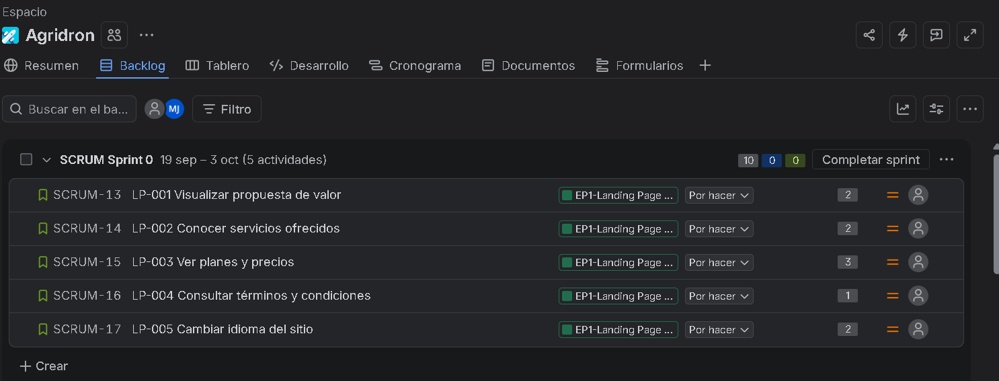

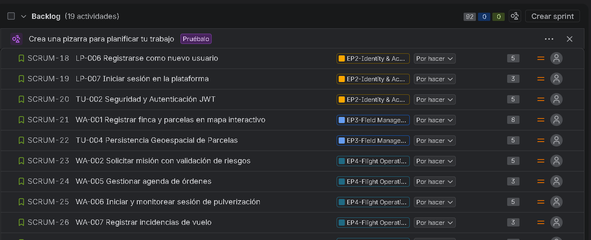

Adicionalmente se adjunta el link de acceso al tablero de Jira para la gestión del Product Backlog: https://agridron.atlassian.net/jira/software/projects/SCRUM/boards/1/backlog?atlOrigin=eyJpIjoiY2IwZjM2ZjdhNzhiNDA3ZmIwODg0NWEwMGM2NGFhZDgiLCJwIjoiaiJ9

# Capítulo IV: Product Design

## 4.1. Style Guidelines

### 4.1.1. General Style Guidelines

<p align="justify">
AgriDron Solutions adopta un sistema de diseño coherente, funcional y optimizado para la gestión de operaciones de fumigación agrícola con drones
y monitoreo de cultivos. En esta sección se establecen los lineamientos de estilo que garantizan la consistencia visual y de interacción en todo el
ecosistema digital, incluyendo la landing page y la aplicación web. Se detallan las decisiones de branding,
paleta de colores, tipografía, espaciado, tono y lenguaje de la plataforma.
</p>

<p align="justify">
Estos criterios se fundamentan en principios de diseño como jerarquía visual, legibilidad, contraste y feedback inmediato. Asimismo, responden a un
enfoque accesible e intuitivo para que los agricultores, operadores de drones y supervisores del campo puedan interactuar con la plataforma en entornos
de alta exigencia operativa sin sobrecarga cognitiva.
</p>

**1. Logo:**
<p align="justify">
El isotipo y logotipo de AgriDron Solutions representan la convergencia entre la tecnología de precisión y la naturaleza agrícola.
El símbolo gráfico combina hojas estilizadas que aluden al campo y a los cultivos con una disposición simétrica que simula la estructura
y rotación de los hélices de un dron agrícola. Acompañado de la tipografía de marca, transmite innovación, orden y profesionalismo
tecnológico aplicado al sector agropecuario.
</p>


**2. Branding:**

AgriDron Solutions busca proyectar una identidad visual profesional, confiable, innovadora, cercana y sostenible. La marca combina
la eficiencia tecnológica de los drones con la calidez y el valor humano del trabajo en el campo.

El branding de AgriDron se fundamenta en los siguientes conceptos clave:
- **Arquetipo de Marca:** El Experto / El Creador, posicionando a AgriDron como un socio tecnológico confiable que empodera a los productores agrícolas mediante herramientas de precisión.
- **Precisión:** Reflejada en interfaces ordenadas, grids estructurados, bordes definidos y líneas limpias para la visualización de mapas y datos telemétricos.
- **Confianza:** Proyectada mediante colores sobrios, tipografías claras y la presentación segura de métricas de salud de cultivos, consumo de insumos y reportes.
- **Innovación:** Transmitida a través de componentes dinámicos e indicadores visuales destacados para estados en tiempo real y alertas de misiones.
- **Sostenibilidad y Cercanía:** Inspiradas en una paleta orgánica y el uso de imágenes reales de campo, conectando la tecnología directamente con la realidad del agricultor.

**3. Typography:**
El sistema tipográfico de AgriDron emplea tres familias de fuentes seleccionadas para equilibrar fuerza de marca,
alta legibilidad en pantallas y precisión técnica en datos:

- **Brand / Títulos principales (Segoe UI):** Se utiliza en fuentes sans-serif para títulos (Display, Headline), encabezados
  de la landing page y secciones principales de la aplicación. Aporta modernidad y estructura visual limpia.


- **Plain / Cuerpo de texto (Montserrat):** Se emplea para el cuerpo de texto, párrafos, formularios, tablas, etiquetas y botones
  generales. Su alto rendimiento de lectura garantiza claridad en la consulta de datos operativos.

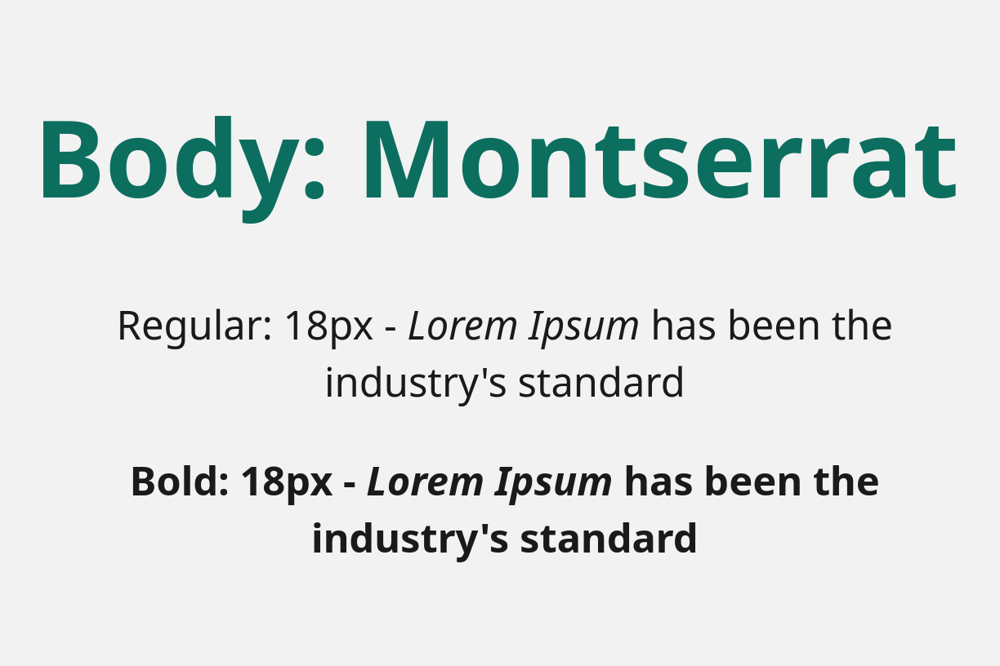

**4. Colors:**

La paleta de colores de AgriDron está inspirada en la naturaleza y el sector agrícola, complementada con tonos tecnológicos y de alto
contraste para maximizar la legibilidad en campo y gabinetes operativos:

- **Verde Bosque / Primario (#1B463C):** Transmite sostenibilidad, naturaleza y confianza agrícola. Se utiliza en headers, navegación.
- **Verde Teal / Secundario (#20AC87):** Aporta dinamismo y frescura. Se usa en botones interactivos (CTAs), estados activos de misiones y gráficos de progreso.
- **Azul Tecnológico (#1E3A8A):** Representa precisión, telemetría y fiabilidad técnica en la plataforma. Utilizado en datos de vuelo y componentes de monitoreo.
- **Amarillo / Alerta (#F59E0B):** Destinado a estados programados, advertencias meteorológicas y notificaciones de atención.
- **Neutros (Blanco #FFFFFF y Gris Claro #F8FAFC):** Garantizan orden, espacio respirable y balance visual en la interfaz.

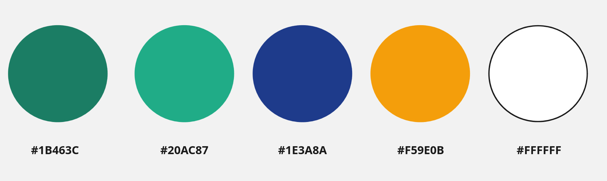

**5. Spacing:**

El sistema de espaciado adopta una escala base basada en múltiplos de 8 px (8px, 16px, 24px, 32px). Este patrón asegura un diseño estructurado y modular que
facilita la lectura fluida de mapas, parcelas y paneles de control, permitiendo además una fácil adaptación responsive a tablets y dispositivos móviles.

**6. Tone:**

El tono de comunicación de AgriDron es profesional, confiable, claro, transparente y accesible. Debido a que los usuarios interactúan con datos de salud
de cultivos, mapas de parcelas y programación de fumigación, el tono debe brindar seguridad y control técnico sin resultar excesivamente complejo o burocrático.   
AgriDron busca transmitir:

- **Seguridad y Control:** al presentar métricas de avance de misión, niveles de batería e insumos.
- **Claridad y Eficiencia:** al guiar al agricultor paso a paso en la planificación de una fumigación.
- **Cercanía:** al usar terminología conocida por el productor agrícola (finca, parcela, cultivo, insumo).

**7. Language:**

El lenguaje del sistema será directo, breve y orientado a la acción. El idioma principal de la interfaz será
el Español (es_419), adaptado al entorno agrícola latinoamericano, contando con soporte para Inglés (en_US).

Se priorizarán frases cortas e imperativas que reduzcan la carga cognitiva:

- Nueva misión en lugar de Registrar solicitud de servicio de fumigación.
- Seleccionar parcela en lugar de Elegir área geográfica de terreno agrícola.
- Monitorear vuelo en lugar de Visualizar estado de la telemetría del dron en ejecución.
- Descargar reporte en lugar de Generar informe detallado de rendimiento de insumos.

### 4.1.2. Web Style Guidelines

Las Web Style Guidelines de AgriDron Solutions establecen los criterios visuales y de interacción que
guían el diseño de la landing page y la web application. Estas pautas aseguran consistencia entre dispositivos,
favorecen la legibilidad y permiten que tanto agricultores, operadores técnicos y supervisores naveguen de forma intuitiva por la plataforma.

**Estructura general**

AgriDron Solutions adopta un enfoque responsive web design, de modo que la interfaz se adapte correctamente a desktop,
laptop, tablet y mobile web sin perder claridad ni coherencia visual.

- **Desktop:** La navegación principal se presenta mediante sidebar lateral y header superior. Los módulos con mayor densidad informativa, como la gestión de parcelas en mapa satelital, monitoreo de misiones, inventario y reportes de productividad, aprovechan mejor el ancho disponible mediante tablas, mapas interactivos, tarjetas de métricas y filtros visibles.

- **Tablet:** La estructura se reorganiza a 6 u 8 columnas, reduciendo el número de elementos visibles por fila. Los paneles laterales pueden colapsarse y ciertas tablas o paneles de telemetría pasan a formatos más compactos para facilitar la interacción táctil en campo.

- **Mobile Web:** La estructura se simplifica a una sola columna. Los elementos se apilan verticalmente, se priorizan botones de acción principal (como iniciar misión o registrar incidencia) y la navegación se compacta mediante menú hamburguesa o navegación inferior, según el flujo de trabajo.

**Breakpoints**

Se proponen los siguientes breakpoints para asegurar una adaptación consistente en todos los entornos de uso:

- Mobile: hasta 767 px.
- Tablet: desde 768 px hasta 1023 px.
- Desktop: 1024 px en adelante.

**Componentes básicos de UI**

- Botones primarios: fondo verde bosque #1E4D2B o verde acento #10B981, texto blanco, bordes redondeados de 8 px a 12 px. Se utilizan para acciones clave como + Nueva finca, + Nueva parcela, Crear misión, Confirmar e Iniciar sesión.
- Botones secundarios: fondo blanco o gris claro #F8FAFC, borde en verde bosque #1E4D2B o gris #CBD5E1, con texto oscuro. Se emplean para acciones complementarias como Cancelar, Ver detalle, Filtrar o Volver.
- Inputs y formularios: bordes suaves (#CBD5E1), fondo claro e interno con suficiente padding para facilitar la lectura e interacción. El estado enfocado resalta mediante un borde verde acento #10B981. El estado de error utiliza un borde rojo #EF4444 con un mensaje de validación visible debajo del campo.
- Cards: contenedores rectangulares con esquinas redondeadas, padding interno de 16 px a 24 px y jerarquía clara entre título, contenido y acciones. Se usan en el dashboard principal, resumen meteorológico, métricas de cultivo, tarjetas de fincas y vistas de misiones.
- Tablas: encabezados destacados sobre fondo tenue, filas con separación visual suficiente mediante bordes sutiles y acciones agrupadas al extremo derecho. En resoluciones pequeñas, las tablas se transforman en tarjetas apiladas para mejorar la lectura rápida en dispositivos móviles de campo.
- Sidebar: navegación vertical persistente en desktop, con acceso a Dashboard (Inicio), Fincas, Parcelas, Misiones, Drones / Monitoreo, Reportes, Inventario y Configuración. En tablet y mobile web la barra lateral se colapsa automáticamente.
- Header: barra superior que alberga el nombre del usuario autenticado, su rol (Agricultor, Operador, Supervisor), buscador global, widget de notificaciones / alertas meteorológicas y acceso rápido a configuración o cierre de sesión.

**Tipografía en web**

La propuesta tipográfica de AgriDron Solutions mantiene como base las familias tipográficas Inter y Roboto, según la identidad visual previamente definida:

- Títulos principales (H1): Segoe UI, 24 px a 28 px.
- Subtítulos (H2): Segoe UI SemiBold, 20 px a 22 px.
- Encabezados de sección (H3): Segoe UI Medium, 18 px.
- Texto de párrafo y descripciones: Montserrat Regular, 14 px a 16 px.
- Texto en botones: Montserrat SemiBold, 14 px a 16 px.
- Etiquetas de formularios y tablas: Montserrat Medium, 13 px a 14 px.
- Datos técnicos y telemetría: Montserrat, 12 px a 14 px (utilizado para coordenadas GPS, logs del dron y métricas de vuelo).

**Interacción**

- Hover: Los botones incrementan ligeramente el contraste o brillo del color base (verde o gris). Los enlaces se subrayan o cambian a un tono más intenso del verde corporativo.
- Focus: Todo componente interactivo muestra un estado visible de foco (anillo de resalte en verde acento #10B981), especialmente en inputs, botones y controles de mapa, para favorecer la accesibilidad y navegación por teclado.
- Active / Click: Los botones aplican una ligera reducción de escala o sombra interna para confirmar la pulsar o interacción del usuario.
- Feedback visual: Estados como éxito (Completada), error / advertencia (Pausada, Ráfaga de viento alto), pendiente (Programada) o información en progreso (En curso) se distinguen mediante color (verde, rojo, amarillo/ámbar, azul), iconografía representativa y texto breve de confirmación.
- Scroll y navegación persistente: En desktop, el header superior y los controles interactivos del mapa satelital permanecen fijos (sticky) para facilitar la navegación y el monitoreo continuo durante desplazamientos verticales largos.
- Responsive behavior: El contenido prioritario (estado de misión, mapa interactivo y botones de acción rápida) conserva visibilidad inmediata antes que elementos decorativos o información secundaria en pantallas reducidas.

### 4.1.3. Mobile Style Guidelines

Las Mobile Style Guidelines de AgriDron Solutions tienen como objetivo adaptar la experiencia de uso a pantallas reducidas sin perder funcionalidad, claridad visual ni consistencia con la propuesta general del producto. Estas pautas priorizan rapidez de interacción en campo, facilidad de lectura bajo luz solar directa y acceso inmediato a acciones frecuentes de fumigación y monitoreo.

**Estructura general**

La experiencia móvil de AgriDron Solutions está diseñada para que agricultores, operadores técnicos y supervisores puedan consultar información crítica de parcelas y ejecutar acciones esenciales de campo desde cualquier lugar.

- Pantallas en una sola columna, con contenido apilado verticalmente.
- Header compacto, con el logo de AgriDron, nombre de la vista actual y acceso a notificaciones, alertas meteorológicas o menú desplegable.
- Navegación simplificada, priorizando las secciones más importantes según el rol del usuario (Inicio, Fincas, Parcelas, Misiones y Monitoreo).
- Botones de acción visibles, especialmente en flujos clave como + Nueva finca, + Nueva parcela, Crear misión o Pausar vuelo.
- Tarjetas resumidas e interactivas, en lugar de tablas complejas, para mostrar parcelas, misiones recientes, condiciones climáticas y telemetría de drones de forma clara y directa.

**Componentes básicos en mobile**

- Botones primarios: verde bosque #1E4D2B o verde acento #10B981, texto blanco, esquinas redondeadas de 12 px y un área táctil mínima de 44 x 44 px para facilitar la interacción en terreno.
- Botones secundarios: fondo blanco o gris claro #F8FAFC con borde visible en verde o gris y alto contraste.
- Inputs: ancho completo (100%), padding amplio y separación mínima de 16 px entre campos para evitar pulsaciones accidentales.
- Cards de resumen: usadas para misiones, parcelas, clima y telemetría (batería, altitud, flujo de insumo), con distribución vertical y jerarquía visual clara.
- Listas: los registros de fincas y misiones se organizan en bloques táctiles con título, estado, fecha, extensión en hectáreas (ha) y acción principal (Ver, Monitorear).
- Indicadores de estado: cada misión o alerta utiliza color y texto explícito para distinguir rápidamente condiciones como En curso (verde), Completada (azul), Programada (amarillo/ámbar) o Pausada / Alerta (rojo).

**Tipografía en mobile**

La adaptación móvil de AgriDron Solutions mantiene la coherencia con las familias tipográficas Inter (títulos) y Roboto (cuerpo e interfaz):

- Título principal (H1): Segoe UI Bold, 20 px a 22 px.
- Subtítulos (H2): Segoe UI SemiBold, 16 px a 18 px.
- Texto general y párrafos: Montserrat Regular, 14 px.
- Botones: Montserrat SemiBold, 14 px.
- Etiquetas pequeñas o estados: Montserrat Medium, 12 px a 13 px.
- Datos de telemetría y coordenadas: Montserrat, 12 px a 13 px (utilizado para niveles de batería, velocidad m/s, flujo de líquido L/min y coordenadas GPS).

**Interacción en mobile**

- Acciones rápidas y flujos cortos: Se priorizan flujos simplificados (como el dibujo de parcelas o la planificación de misiones en 3 o 4 pasos) para optimizar el trabajo en el campo.
- Dimensiones táctiles: Todos los botones y componentes interactivos respetan el tamaño mínimo de área táctil (44 x 44 px).
- Formularios en bloques: Los formularios de registro de parcelas, cultivos e insumos se dividen en secciones o pasos breves para evitar la fatiga visual.
- Alcance del pulgar: Las acciones críticas (como confirmar una misión o pausar una operación de emergencia) se colocan estratégicamente en la zona inferior de la pantalla al alcance natural del pulgar.
- Feedback inmediato: Los cambios de estado de vuelo, alertas meteorológicas o el guardado de datos se muestran instantáneamente mediante mensajes visibles (toast notifications), banners contextuales e indicadores de color explícitos.

---

## 4.2. Information Architecture

La arquitectura de información de AgriDron Solutions ha sido diseñada para que los tres segmentos principales de usuarios —agricultores, operadores técnicos y supervisores de operaciones— puedan localizar información, ejecutar tareas y comprender el estado de sus operaciones de fumigación con drones de forma rápida y consistente. Esta propuesta abarca tanto la Landing Page como la Web Application, de modo que exista continuidad entre la experiencia de descubrimiento del producto y la experiencia de uso dentro de la plataforma operativa.

En el caso de la Landing Page, la arquitectura de información busca guiar al visitante desde una comprensión inicial de los retos en la fumigación tradicional hacia una acción concreta, ya sea registrarse, solicitar una demostración o explorar las funcionalidades clave según su rol en el campo. Para ello, el contenido se organiza en bloques progresivos: propuesta de valor (Hero section), funcionalidades principales (planificación, monitoreo en tiempo real, IA predictiva), proceso de funcionamiento en 4 pasos, actores principales (agricultores, operadores, supervisores), planes de precios/suscripción, nuestro equipo y llamadas a la acción (CTAs). Esta secuencia permite que el usuario comprenda qué resuelve AgriDron Solutions, a quién está dirigido y cómo puede empezar a digitalizar sus cultivos.

En la Web Application, la arquitectura de información responde a una lógica netamente operativa e interactiva. En lugar de priorizar la persuasión o el descubrimiento, la aplicación prioriza la velocidad de acceso, la visibilidad en tiempo real del estado de los vuelos y la ejecución eficiente de tareas en campo. Por ello, el contenido se distribuye en módulos funcionales diferenciados por rol, donde cada usuario accede únicamente a las secciones necesarias para gestionar fincas y parcelas sobre mapas satelitales, programar y asignar misiones de pulverización, monitorear la telemetría de los drones (batería, volumen de insumo, altitud), consultar validaciones climáticas y generar reportes de productividad.

De esta manera, la arquitectura de información de AgriDron Solutions se apoya en cuatro sistemas complementarios: Organization Systems (sistemas de organización), Labeling Systems (sistemas de etiquetado), Searching Systems (sistemas de búsqueda) y Navigation Systems (sistemas de navegación). En conjunto, estos sistemas permiten estructurar la información de forma entendible, reducir la sobrecarga cognitiva en entornos de campo y mantener una experiencia coherente entre la web pública y la plataforma transaccional.

### 4.2.1. Organization Systems

La organización del contenido en AgriDron Solutions responde a la naturaleza de cada producto digital y al tipo de tarea que el usuario necesita realizar. La Landing Page organiza información para presentar, explicar y convencer sobre los beneficios de la agricultura de precisión con drones; mientras que la Web Application organiza información para operar, monitorear el vuelo y la dispersión de insumos en tiempo real, y tomar decisiones sobre el manejo de cultivos. Por ello, se aplican distintos esquemas de organización visual y categorización según el contexto.

**Organization Systems in the Landing Page**

En la Landing Page, la información se organiza principalmente de forma jerárquica y secuencial. La jerarquía visual permite destacar de inmediato la propuesta de valor, las funcionalidades clave y los llamados a la acción (CTAs) más importantes. La secuencia guía al visitante por un recorrido progresivo: primero entiende la problemática del campo, luego conoce la solución tecnológica de AgriDron, después explora sus capacidades paso a paso y finalmente recibe estímulos para registrarse, iniciar sesión o solicitar una demostración.

La estructura general de la Landing Page sigue el siguiente flujo:

- Hero section: Presenta la propuesta de valor principal ("Revoluciona la salud de tus cultivos con precisión automatizada") y los botones de acción clave (Empieza tu prueba gratuita, Ver cómo funciona, Solicitar Demo).
- Sección de funcionalidades: Muestra los pilares tecnológicos del sistema: Planificación de misiones, Monitoreo en tiempo real e IA predictiva.
- Sección de "Cómo funciona": Muestra la secuencia operativa en 4 pasos (1. Planifica, 2. Consulta el clima, 3. Ejecuta, 4. Analiza)
- Sección de "Para quién" (audiencia): Categoriza la solución según los actores clave del sector agrícola (Agricultores, Operadores, Supervisores).
- Sección de "Nuestro equipo": Presenta a los profesionales responsables del desarrollo de la plataforma para generar confianza.
- Footer: Reúne la navegación secundaria, datos de contacto, ubicación, políticas legales y enlaces a redes sociales.

Esta estructura no es aleatoria: busca reducir fricción en el recorrido del visitante y facilitar que identifique en pocos segundos cómo la plataforma optimiza el rendimiento de sus terrenos agrícolas.

**Organization Systems in the Web Application**

En la Web Application, la organización del contenido es principalmente por tópicos, por audiencia y cronológica, según el tipo de información mostrada.

- Por tópicos: Se emplea en el menú principal (sidebar), donde las funcionalidades se agrupan en módulos como Fincas, Parcelas, Misiones, Monitoreo, Reportes, Inventario y Configuración.
- Por audiencia (roles): Se aplica al adaptar la experiencia según el tipo de usuario: Agricultor, Operador y Supervisor. Cada rol visualiza los módulos y datos relevantes para su nivel de responsabilidad en la operación.
- Cronológica: Se utiliza en los historiales de vuelo, registros de telemetría, diario de incidencias climáticas y reportes de insumos aplicados en el tiempo.
- Matricial: Se emplea en vistas donde el usuario necesita comparar múltiples variables simultáneamente, como tablas de misiones, reportes de eficiencia por hectárea o el inventario de agroquímicos.

**Organización visual del contenido**

| Tipo de organización | Aplicación en AgriDron Solutions                                                                                                                   | Justificación                                                                                                               |
|:---------------------|:---------------------------------------------------------------------------------------------------------------------------------------------------|:----------------------------------------------------------------------------------------------------------------------------|
| **Jerárquica**       | Hero section, Dashboard principal, tarjetas de métricas (KPIs) y panel de telemetría del dron.                                                     | Permite destacar estados de vuelo activos, condiciones del clima y métricas de superficie (ha) antes que datos secundarios. |
| **Secuencial**       | Registro de usuario, flujo de "Cómo funciona" y planificación de misiones en 4 pasos (*1. Parcela → 2. Tratamiento → 3. Fecha/Hora → 4. Resumen*). | Guía al agricultor o supervisor paso a paso en la definición de la fumigación, evitando errores operacionales.              |
| **Matricial**        | Historial de misiones, consumo de insumos, tablas de personal y reportes de rendimiento por hectárea.                                              | Facilita comparar atributos como hectáreas cubiertas, fecha, tipo de cultivo, estado de misión y operador asignado.         |

**Esquemas de categorización**

| Tipo de esquema   | Aplicación en AgriDron Solutions                                                        | Justificación                                                                                                    |
|:------------------|:----------------------------------------------------------------------------------------|:-----------------------------------------------------------------------------------------------------------------|
| **Por tópicos**   | Fincas, Parcelas, Misiones, Monitoreo, Reportes, Inventario, Personal y Configuración.  | Agrupa el contenido según la tarea operativa que el usuario busca realizar sobre sus terrenos o flota de drones. |
| **Cronológico**   | Historial de misiones ejecutadas, registros melemétricos de vuelo y log de incidencias. | Facilita el seguimiento temporal de las aplicaciones de fertilizantes/pesticidas y auditorías agrícolas.         |
| **Por audiencia** | Vista Agricultor, Vista Operador y Vista Supervisor.                                    | Reduce la sobrecarga cognitiva y adapta las opciones según el rol de campo o gabinete.                           |

**Esquemas no priorizados**

AgriDron Solutions no prioriza un esquema alfabético como estructura principal, ya que la gestión agrícola no depende de una búsqueda lexical, sino de interacciones geoespaciales sobre mapas satelitales, estados de misión y prioridades operativas en campo. Aunque los listados de parcelas o insumos puedan ordenarse alfabéticamente como filtro secundario, la plataforma prioriza la ubicación, la urgencia de fumigación y el estado del vuelo.

Tampoco se utiliza una organización puramente temática en la Landing Page sin jerarquía de conversión, porque la interfaz pública busca impulsar al usuario a iniciar una prueba o solicitar una demostración en el menor número de pasos posible.

**Secciones principales de AgriDron Solutions**

La aplicación se estructura en tres entornos diferenciados según el rol del usuario:

**Vista Agricultor**

| Sección                      | Descripción                                                                                                             |
|:-----------------------------|:------------------------------------------------------------------------------------------------------------------------|
| **Dashboard (Inicio)**       | Resumen del estado general: fincas registradas, parcelas, misiones activas, hectáreas totales y widget de clima actual. |
| **Fincas**                   | Registro, edición y administración de los predios agrícolas con su ubicación y extensión.                               |
| **Parcelas**                 | Delimitación y visualización de lotes sobre mapa satelital interactivo con información de cultivo y área.               |
| **Misiones (Planificación)** | Creación y solicitud de misiones de fumigación seleccionando parcela, tipo de tratamiento e insumo.                     |
| **Monitoreo de Misiones**    | Seguimiento en tiempo real del progreso del vuelo, ruta sobre la parcela y telemetría básica.                           |
| **Reportes e Historial**     | Consulta de misiones pasadas, volumen de insumos utilizados y reportes de productividad por hectárea.                   |
| **Configuración**            | Perfil del usuario, gestión de notificaciones e integración con alertas meteorológicas.                                 |

**Vista Operador**

| Sección                      | Descripción                                                                                                            |
|:-----------------------------|:-----------------------------------------------------------------------------------------------------------------------|
| **Dashboard / Mis Misiones** | Lista de misiones de fumigación asignadas para la jornada con detalles de ubicación y cultivo.                         |
| **Ejecución y Monitoreo**    | Control en tiempo real del vuelo, telemetría del dron (batería, altitud, velocidad, flujo) y actualización de estados. |
| **Registro de Incidencias**  | Documentación de interrupciones operativas en campo (vientos fuertes, fallas técnicas, lluvia).                        |
| **Horas Trabajadas**         | Registro de jornada laboral con verificación de ubicación GPS para garantizar precisión operativa.                     |


### 4.2.2. Labeling Systems

El sistema de etiquetado de AgriDron Solutions ha sido diseñado para que cada elemento de la interfaz comunique su propósito de forma inmediata. Las etiquetas se redactan con términos breves, directos y familiares para el contexto agronómico y de operaciones con drones, evitando tecnicismos innecesarios. Esto permite que el usuario comprenda con rapidez qué sección está visitando, qué acción puede ejecutar y qué resultado debe esperar.

A diferencia de un simple glosario, el sistema de etiquetado de AgriDron Solutions se aplica de manera concreta en zonas específicas de la interfaz, como la navbar de la Landing Page, el sidebar de la aplicación, los botones principales, los formularios, los breadcrumbs y los mensajes de estado.

**Labeling in the Landing Page**

En la Landing Page, las etiquetas priorizan claridad comercial y orientación a la conversión. Se emplean principalmente en:

- Navbar superior: Inicio (Home), Funcionalidades (Features), Cómo funciona (How it works), Precios (Pricing), Preguntas Frecuentes (FAQ), Iniciar sesión (Sign in).
- Botones principales del hero: Solicitar Demo, Crear cuenta, Probar gratis, Soy Agricultor, Soy Operador.
- Secciones informativas: Beneficios, Casos de uso, Nuestro equipo, Preguntas frecuentes.
- Footer: Contacto, Políticas de privacidad, Términos y condiciones, Soporte técnico.

Estas etiquetas permiten que el visitante identifique rápidamente la estructura del contenido y pueda desplazarse hacia las secciones que más le interesan antes de tomar una decisión.

**Labeling in the Web Application**

En la Web Application, las etiquetas se enfocan en apoyar la operación diaria del usuario en campo y gabinete. Se distribuyen en los siguientes puntos:

- Sidebar o menú lateral: Dashboard, Fincas, Parcelas, Misiones, Monitoreo, Inventario, Reportes, Configuración.
- Header: Notificaciones, Mi perfil, Cambiar rol, Cerrar sesión
- Botones de acción: + Nueva finca, + Nueva parcela, Crear misión, Iniciar vuelo, Pausar misión, Ver detalles, Guardar cambios, Cancelar.
- Breadcrumbs: Misiones > Detalle de Misión, Parcelas > Crear Parcela, Fincas > Lote 1, Reportes > Rendimiento por Hectárea.
- Formularios: Nombre de parcela, Extensión (ha), Tipo de cultivo, Producto / Insumo, Dosis por hectárea, Fecha de fumigación, Operador asignado.
- Mensajes de estado: En curso / En ejecución, Completada, Programada, Pausada, Alerta de clima, Stock bajo.

**Criterios del sistema de etiquetado**

El sistema de etiquetado de AgriDron Solutions sigue los siguientes criterios:

- Brevedad: Las etiquetas deben usar el menor número de palabras posible sin perder claridad.
- Consistencia: Un mismo concepto (Parcela, Misión, Insumo) debe nombrarse siempre de la misma manera en toda la plataforma.
- Familiaridad: Se priorizan términos cercanos al usuario real del dominio agrícola y técnico.
- Orientación a la acción: Los botones y acciones usan verbos claros que indican lo que ocurrirá (Crear misión, Iniciar vuelo, Descargar reporte).
- Escaneabilidad: Las etiquetas deben poder comprenderse rápidamente incluso en interfaces densas como mapas satelitales, tablas telemétricas y dashboards.

**Etiquetas principales del sistema**

| Etiqueta              | Lugar de uso                          | Descripción                                                                                       |
|:----------------------|:--------------------------------------|:--------------------------------------------------------------------------------------------------|
| **Iniciar sesión**    | Navbar, formularios de acceso         | Permite ingresar con una cuenta existente a la plataforma.                                        |
| **Crear cuenta**      | Hero section, formularios de registro | Permite registrarse como nuevo usuario agricultor, operador o supervisor.                         |
| **Dashboard**         | Sidebar, header, breadcrumbs          | Pantalla inicial con el resumen principal de métricas, fincas, parcelas y clima.                  |
| **Fincas / Parcelas** | Sidebar, títulos de vista, mapas      | Módulo para la delimitación geoespacial y administración de terrenos agrícolas.                   |
| **Crear misión**      | Botón principal, módulo de misiones   | Acción para programar y definir una nueva orden de fumigación con dron.                           |
| **Estado de misión**  | Tablas, cards, vista de monitoreo     | Indicador del avance operativo de la pulverización (*Programada, En curso, Completada, Pausada*). |
| **Telemetría**        | Panel de control del dron, mapas      | Vista en tiempo real de nivel de batería, altitud, velocidad y flujo de pulverización (L/min).    |
| **Alerta climática**  | Dashboard, header, tarjetas           | Notificación operativa sobre condiciones de viento, lluvia o humedad fuera de rango.              |
| **Inventario**        | Sidebar, títulos de vista             | Módulo de gestión y control de insumos agrícolas (agroquímicos, pesticidas, fertilizantes).       |
| **Reportes**          | Sidebar, tablas, exportables          | Módulo de análisis, visualización de métricas e historial de rendimiento por hectárea.            |
| **Configuración**     | Sidebar, header                       | Área de gestión del perfil, flota de drones, personal asignado y parámetros del sistema.          |
| **Cerrar sesión**     | Header, menú de usuario               | Acción para salir de la cuenta activa de forma segura.                                            |

### 4.2.3. SEO Tags and Meta Tags

Las etiquetas SEO y Meta Tags de AgriDron Solutions se definen para mejorar la visibilidad del producto en buscadores, reforzar la claridad del contenido presentado y optimizar la manera en que las páginas se muestran en navegadores y redes sociales. Debido a que la solución cuenta con una Landing Page pública y una Web Application privada, las decisiones de etiquetado SEO se concentran principalmente en las páginas públicas y en las pantallas principales que funcionan como punto de acceso o referencia operativa del producto.

A continuación, se detallan los principales títulos y metadatos propuestos para las páginas más relevantes de la experiencia digital:

**Home / Landing Page**

- Title: AgriDron Solutions | Smart drone spraying and crop management
- Meta Description: Optimize agricultural crop spraying, plot management, and real-time drone telemetry from one platform designed for farmers, operators, and supervisors.
- Meta Keywords: agricultural drone spraying, precision agriculture, plot management, crop health monitoring, drone telemetry, agritech software
- Meta Author: AgriDron Solutions

**Funcionalidades / Features**

- Title: AgriDron Features | Mission planning, real-time telemetry, and weather alerts
- Meta Description: Discover how AgriDron Solutions helps plan precision spraying missions, monitor drone telemetry in real time, analyze weather risks, and maximize crop yields.
- Meta Keywords: drone mission planning, flight telemetry, agricultural weather alerts, crop monitoring software, agritech features
- Meta Author: AgriDron Solutions

**Planes / Pricing**

- Title: AgriDron Pricing | Plans for farmers, operators, and enterprises
- Meta Description: Explore AgriDron Solutions plans and choose the right option to digitize plot management, spraying operations, and drone fleet tracking.
- Meta Keywords: agritech software pricing, drone spraying plans, agricultural platform subscription, farm management software
- Meta Author: AgriDron Solutions

**Login / Iniciar sesión**

- Title: Sign in | AgriDron Solutions
- Meta Description: Access your AgriDron Solutions account to manage plots, spraying missions, drone telemetry, and operational reports from one centralized platform.
- Meta Keywords: agridron login, agritech platform access, farmer dashboard, drone operator login
- Meta Author: AgriDron Solutions

**Register / Crear cuenta**

- Title: Create account | AgriDron Solutions
- Meta Description: Register in AgriDron Solutions as a farmer, operator, or supervisor and start organizing your precision spraying operations efficiently.
- Meta Keywords: agridron register, farmer account, drone operator registration, agritech software account
- Meta Author: AgriDron Solutions

**Dashboard**

- Title: Dashboard | AgriDron Solutions
- Meta Description: Review your current farm status, active spraying missions, weather forecasts, and key agricultural metrics from the main AgriDron dashboard.
- Meta Keywords: farm operations dashboard, spraying status, weather widget, active drone missions, agritech panel
- Meta Author: AgriDron Solutions

**Fincas y Parcelas / Farms & Plots**

- Title: Farms & Plots | AgriDron Solutions
- Meta Description: Delimit, organize, and inspect your agricultural plots on interactive satellite maps for precision crop spraying and health analysis.
- Meta Keywords: plot mapping, satellite farm view, crop boundary management, agricultural land mapping, farm plots
- Meta Author: AgriDron Solutions

**Misiones y Monitoreo / Spraying Missions**

- Title: Spraying Missions | AgriDron Solutions
- Meta Description: Create, schedule, and track drone spraying missions with real-time flight telemetry, dosage control, and environmental validation.
- Meta Keywords: drone spraying missions, flight tracking, chemical dosage control, telemetry monitoring, crop spraying software
- Meta Author: AgriDron Solutions

Estas etiquetas permiten diferenciar el propósito de cada página dentro del ecosistema digital, mantener coherencia entre la propuesta comercial y la experiencia operativa, y reforzar el posicionamiento del producto en búsquedas relacionadas con agricultura de precisión, fumigación automatizada con drones y gestión de cultivos.

### 4.2.4. Searching Systems

AgriDron Solutions incorpora sistemas de búsqueda y filtrado para reducir el tiempo que el usuario dedica a localizar información dentro de la plataforma. Dado que gran parte de la experiencia está orientada a tareas operativas sobre terreno y mapas satelitales, las búsquedas no solo deben encontrar datos telemétricos o registros, sino también presentarlos en un formato comprensible, geoespacial y directamente accionable.

**Searching in the Web Application**

Los mecanismos de búsqueda se aplican en módulos donde el volumen de información puede crecer rápidamente, como fincas, parcelas, misiones de fumigación, inventario de insumos, flota de drones, alertas y reportes. Cada búsqueda se acompaña de filtros específicos según el contexto del módulo.

| Sistema de búsqueda                | Ubicación                      | Descripción                                                                                                                 |
|:-----------------------------------|:-------------------------------|:----------------------------------------------------------------------------------------------------------------------------|
| **Búsqueda de parcelas y fincas**  | Fincas / Parcelas              | Permite localizar terrenos por nombre, ubicación geográfica, tipo de cultivo (uva, palta, maíz) o extensión en hectáreas.   |
| **Búsqueda de misiones**           | Misiones                       | Permite filtrar misiones por ID de orden, estado (*Programada, En curso, Completada*), operador asignado o rango de fechas. |
| **Búsqueda de insumos**            | Inventario                     | Permite encontrar agroquímicos, fertilizantes o pesticidas por nombre comercial, principio activo o categoría.              |
| **Búsqueda de drones y flota**     | Monitoreo / Drones             | Permite filtrar unidades por código de serie, modelo, disponibilidad o estado de mantenimiento.                             |
| **Filtro por tipo de cultivo**     | Parcelas y Reportes            | Reduce los listados y mapas a un tipo específico de siembra o variedad agrícola.                                            |
| **Filtro por fecha y periodo**     | Historial, reportes y misiones | Permite analizar periodos específicos de pulverización e historial telemétrico.                                             |
| **Filtro por estado y criticidad** | Dashboard, Misiones y Alertas  | Muestra únicamente registros en vuelo activo, misiones pausadas o alertas de clima desfavorable.                            |

**Visualización de resultados**

Los resultados de búsqueda en AgriDron Solutions se presentan de forma distinta según la naturaleza del contenido:

- Parcelas y Fincas: Los resultados se destacan dinámicamente sobre el mapa satelital interactivo o en una lista con datos como nombre del lote, superficie (ha), tipo de cultivo y finca asociada.
- Misiones: Los resultados se presentan en tabla o tarjetas con ID de misión, parcela destino, fecha, estado de ejecución, operador a cargo y acceso directo al panel de telemetría en tiempo real.
- Inventario de insumos: Los resultados se muestran en tablas con nombre del producto, categoría (herbicida, fungicida, nutriente), dosis recomendada por hectárea y volumen disponible en stock.
- Alertas climáticas y de vuelo: Los resultados se muestran como una lista priorizada según el nivel de criticidad (vientos fuertes, batería baja, lluvia), fecha/hora e impacto en la operación.
- Reportes e historiales: Los resultados se representan mediante tablas filtradas y gráficos dinámicos ajustados al terreno, operador o rango de tiempo seleccionado.

**Comportamiento esperado de los resultados**

Los resultados de búsqueda deben seguir estos criterios:

- Responder en tiempo razonable y con feedback visual claro mediante indicadores de carga sobre tablas y mapas.
- Mostrar solo la información necesaria para que el agricultor, operador o supervisor tome decisiones operativas inmediatas.
- Permitir ordenar o refinar el resultado (por hectáreas, fecha de fumigación o criticidad) sin reiniciar completamente la búsqueda.
- Indicar cuando no existen coincidencias mediante mensajes explícitos como "No se encontraron parcelas o misiones con los criterios seleccionados".
- Mantener visibles los filtros aplicados (chips/etiquetas activas) para que el usuario identifique claramente qué subconjunto de datos está observando.

**Searching in the Landing Page**

La Landing Page no depende de un buscador interno complejo, sino que incorpora mecanismos de exploración rápida mediante navegación por secciones y enlaces de anclaje (anchors). En este caso, la búsqueda se resuelve a través de una estructura visible y predecible que permite al visitante llegar rápidamente a información clave como funcionalidades de fumigación, planes de suscripción, casos de éxito, preguntas frecuentes o acceso directo al registro y prueba gratuita.

### 4.2.5. Navigation Systems

El sistema de navegación de AgriDron Solutions ha sido diseñado para que el usuario pueda recorrer la experiencia con claridad tanto en la Landing Page como en la Web Application. En ambos casos, la navegación busca reducir fricción, mantener consistencia y facilitar el acceso rápido a acciones clave como la delimitación de parcelas, la programación de fumigaciones y el monitoreo de vuelo en tiempo real.

**Navigation in the Landing Page**

En la Landing Page, la navegación se estructura como un recorrido progresivo orientado a la conversión. El usuario puede desplazarse por la página de forma lineal o saltar directamente a secciones específicas mediante enlaces visibles en la barra superior.

Los principales mecanismos de navegación en la Landing Page son:

- Navbar superior fija: Incluye accesos a Inicio, Funcionalidades, Cómo funciona, Para quién, Precios, FAQ e Iniciar sesión.
- Navegación por anchors (anclas): Cada opción del menú dirige suavemente a una sección concreta de la misma página.
- Hero section con CTAs principales: Botones como Solicitar Demo, Comenzar gratis, Soy Agricultor o Soy Operador redirigen al usuario al flujo correspondiente.
- CTAs secundarios distribuidos: Se repiten en secciones estratégicas para evitar que el usuario tenga que volver al inicio para actuar.
- Footer con enlaces complementarios: Contacto, políticas de privacidad, términos y accesos secundarios.

Este sistema permite que un visitante nuevo entienda rápidamente la propuesta de valor del sistema de fumigación con drones, navegue según su interés y llegue a la acción principal en pocos pasos.

**Navigation in the Web Application**

En la aplicación web, la navegación se orienta a la productividad y la ejecución de tareas operativas en campo y gabinete. Cada rol (Agricultor, Operador, Supervisor) accede a una estructura estable que prioriza las funcionalidades más utilizadas.

| Elemento de navegación              | Descripción                                                                                                                                             |
|:------------------------------------|:--------------------------------------------------------------------------------------------------------------------------------------------------------|
| **Sidebar**                         | Menú lateral persistente con acceso directo a las secciones principales del rol activo (*Fincas, Parcelas, Misiones, Monitoreo, Inventario, Reportes*). |
| **Header**                          | Barra superior con nombre de la finca activa, selector de rol, centro de notificaciones climáticas/de vuelo y menú de perfil.                           |
| **Dashboard como punto de entrada** | Pantalla inicial tras autenticación, desde donde el usuario visualiza su estado operativo general y métricas clave.                                     |
| **Breadcrumbs**                     | Indicadores de ruta para secciones de detalle (*Misiones > MS-1042*), permitiendo comprender la ubicación y retroceder fácilmente.                      |
| **Botones contextuales**            | Acciones principales visibles dentro de cada módulo, como `+ Nueva parcela` o `+ Crear misión`.                                                         |
| **Notificaciones**                  | Panel accesible desde el header para revisar alertas telemétricas o meteorológicas recientes y redirigirse a la sección relacionada.                    |
| **Cambio de vista por rol**         | En caso de usuarios con más de un rol (ej. Agricultor/Supervisor), permite alternar entre contextos sin cerrar sesión.                                  |

**Recorridos principales de navegación**

La navegación de AgriDron Solutions considera recorridos típicos como los siguientes:

- Visitante de Landing Page -> CTA principal (Comenzar gratis) -> Registro o login -> Dashboard del rol correspondiente.
- Agricultor -> Dashboard -> Parcelas -> Delimitar parcela en mapa satelital -> Guardar lote.
- Agricultor / Supervisor -> Dashboard -> Misiones -> Crear misión -> Seleccionar parcela e insumo -> Programar fecha y hora.
- Operador -> Dashboard -> Mis Misiones -> Iniciar vuelo -> Monitorear telemetría en tiempo real -> Registrar finalización o incidencia.
- Supervisor -> Dashboard -> Monitoreo de Drones -> Visualizar flota activa en mapa -> Reasignar operador o revisar inventario de agroquímicos.

**Criterios de navegación**

La navegación en AgriDron Solutions sigue los siguientes criterios:

- Consistencia: Los elementos principales conservan posición y lógica entre pantallas.
- Claridad: Cada enlace y botón comunica claramente su destino o acción.
- Economía de pasos: Las tareas frecuentes (como iniciar un monitoreo o consultar el clima) deben completarse con el menor número posible de interacciones.
- Visibilidad del estado actual: El usuario debe saber siempre en qué módulo está, qué dron o parcela está seleccionada y qué acciones puede ejecutar.
- Adaptabilidad responsive: La navegación debe mantenerse usable en desktop, tablet y mobile web para su uso en campo.

**Navegación — Landing Page**

| Elemento                       | Descripción                                                                                                                                                                                                         |
|:-------------------------------|:--------------------------------------------------------------------------------------------------------------------------------------------------------------------------------------------------------------------|
| **Navbar fija**                | Barra superior visible en todo momento durante el scroll. Contiene logo, enlaces a secciones (anclas) y botones de Iniciar sesión / Registrarse. En mobile se colapsa en menú hamburguesa.                          |
| **Anclas de sección**          | Los enlaces del navbar desplazan suavemente (*smooth scroll*) a cada sección de la página: `#hero`, `#funcionalidades`, `#como-funciona`, `#para-quien`, `#precios`, `#faq`.                                        |
| **CTA primario en Hero**       | Botón `Comenzar gratis` redirige a `/register`. Es el punto de conversión principal de la landing.                                                                                                                  |
| **CTA secundario en Hero**     | Botón `Ver cómo funciona` hace scroll a la sección `#como-funciona`, manteniendo al usuario en la landing para informarse antes de registrarse.                                                                     |
| **CTAs por segmento**          | En la sección *"¿Para quién es AgriDron?"*, cada card (*Agricultor, Operador, Supervisor*) tiene un botón que redirige a `/register` con el parámetro de rol preseleccionado (`?rol=agricultor` o `?rol=operador`). |
| **CTA en sección Precios**     | Cada plan tiene un botón que redirige a `/register` con el plan preseleccionado, reduciendo pasos en el onboarding.                                                                                                 |
| **CTA final (bottom of page)** | Sección de cierre con un último llamado a la acción antes del footer, dirigido a usuarios que llegaron al final sin convertir.                                                                                      |
| **Footer**                     | Contiene enlaces a páginas legales (política de privacidad, términos), redes sociales y el enlace de inicio de sesión para usuarios ya registrados.                                                                 |

**Navegación — Web Application**

| Elemento                         | Descripción                                                                                                                                                                                                                                                                        |
|:---------------------------------|:-----------------------------------------------------------------------------------------------------------------------------------------------------------------------------------------------------------------------------------------------------------------------------------|
| **Sidebar**                      | Menú principal fijo a la izquierda, visible en todo momento. Contiene accesos directos a todas las secciones del rol activo con ícono y etiqueta. En mobile se colapsa en hamburguesa.                                                                                             |
| **Header**                       | Barra superior con nombre de la finca seleccionada, badge del plan activo, ícono de notificaciones con contador y avatar del usuario con menú desplegable (*Perfil / Configuración / Cerrar sesión*).                                                                              |
| **Dashboard como home**          | Tras iniciar sesión, el usuario es redirigido automáticamente al Dashboard de su rol. El Dashboard funciona como hub de acceso rápido: las tarjetas de métricas (*misiones activas, alerta climática, stock bajo de insumos*) son clicables y llevan a la sección correspondiente. |
| **Breadcrumbs**                  | Visibles en vistas de detalle para indicar la ruta actual y permitir la navegación hacia atrás. Ejemplo: *Misiones > #MS-1042*.                                                                                                                                                    |
| **Botones de acción contextual** | Cada sección tiene un botón primario (`+ Nueva parcela`, `+ Crear misión`) ubicado en la esquina superior derecha del contenido, accesible sin scroll.                                                                                                                             |
| **Panel de notificaciones**      | Al hacer clic en el ícono de campana del header, se despliega un panel lateral con las alertas recientes (viento fuerte, batería baja, misión completada) ordenadas cronológicamente. Cada alerta tiene un acceso directo a la sección correspondiente.                            |
| **Modo restringido / Campo**     | El usuario u operador puede activar un modo de vista simplificada de campo desde Configuración. En este modo solo son visibles la telemetría del dron en vivo y la ruta de pulverización en el mapa, reduciendo elementos distractores.                                            |
| **Cambio de rol**                | Si un usuario tiene más de un rol (Agricultor y Supervisor), puede cambiar de vista desde un selector en el header sin cerrar sesión.                                                                                                                                              |

## 4.3. Landing Page UI Design

La propuesta de UI de la Landing Page de AgriDron Solutions traduce las decisiones previas de identidad visual, estilo y arquitectura de información en una experiencia clara, persuasiva y orientada a la conversión. Su objetivo principal es presentar la propuesta de valor del producto, explicar de manera rápida cómo ayuda a agricultores, operadores de drones y supervisores del campo, y conducir al visitante hacia una acción concreta, como registrarse, iniciar sesión, solicitar una demostración o explorar el funcionamiento de la plataforma de fumigación de precisión.

El diseño de la Landing Page se estructura en bloques progresivos que responden a una lógica de descubrimiento: primero captar la atención con una promesa clara de optimización agrícola, luego explicar la problemática de la fumigación tradicional y la gestión de cultivos, mostrar los beneficios y funcionalidades clave (planificación de misiones, telemetría en tiempo real, alertas climáticas e IA predictiva), reforzar la confianza mediante componentes visuales del sistema y un equipo transparente, y finalmente cerrar con llamadas a la acción claras. Esta organización permite que el usuario entienda qué resuelve AgriDron Solutions, cómo funciona y por qué debería utilizarlo, sin tener que navegar por una interfaz compleja ni enfrentarse a una sobrecarga de información.

A nivel visual, la interfaz aprovecha la paleta cromática definida para la marca, con predominio del verde bosque (#1E4D2B), verde acento (#10B981), azul tecnológico (#1E3A8A) y tonos neutros, para transmitir sostenibilidad agrícola, precisión tecnológica, innovación y confianza profesional. La jerarquía visual se apoya en titulares fuertes en tipografía Inter, botones de acción (CTAs) altamente visibles, tarjetas informativas modulares con bordes suavizados y bloques claramente diferenciados por un sistema de espaciado basado en 8 px, logrando que el recorrido visual sea intuitivo, accesible y consistente tanto en pantallas de escritorio como en dispositivos móviles de campo.

### 4.3.1. Landing Page Wireframe

Los wireframes de la Landing Page de AgriDron Solutions representan la fase inicial de estructuración de la experiencia pública de la plataforma web. En ellos se define la jerarquía visual, la distribución de los bloques informativos y el orden en que el visitante descubre la propuesta de valor de la fumigación automatizada con drones antes de aplicar el estilo visual definitivo. Esta etapa permitió validar que el mensaje principal sobre agricultura de precisión estuviera visible en los primeros segundos y que la secuencia del contenido guiara al usuario de forma progresiva hacia la conversión.

**Desktop**

En la versión desktop, el wireframe organiza la información en un recorrido secuencial de pantalla completa:

- Hero Section: Cabecera con el titular principal ("Revoluciona la salud de tus cultivos con precisión automatizada"), subtítulo explicativo, botones de acción primarios (Empieza tu prueba gratuita, Ver cómo funciona, Solicitar Demo) y un elemento gráfico de soporte con la previsualización del dron y la app.
- Nuestras funcionalidades: Tarjetas horizontales dedicadas a los pilares tecnológicos del producto (Planificación de misiones, Monitoreo en tiempo real e IA predictiva).
- Cómo funciona: Diagrama de proceso en 4 pasos (1. Planifica, 2. Consulta el clima, 3. Ejecuta, 4. Analiza) que explica el flujo de trabajo en campo.
- Para quién: Bloque de segmentación por roles (Agricultores, Operadores y Supervisores), especificando el valor que aporta la plataforma a cada usuario.
- Nuestro equipo: Sección de respaldo con los perfiles del equipo multidisciplinario detrás de la solución.
- Footer: Pie de página con enlaces de navegación interna, datos de contacto, ubicación y canales de redes sociales.

<div align="center">
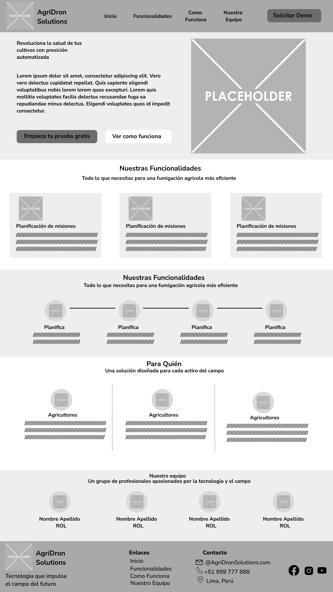
</div>

**Mobile**
- En la versión mobile, la interfaz de la Landing Page adapta su arquitectura a una sola columna vertical con el objetivo de optimizar la lectura y facilitar la interacción táctil en entornos de campo. La hero section compacta la cabecera mediante un menú de navegación desplegable tipo hamburguesa y conserva el mensaje principal sobre la optimización de cultivos, complementado por los tres pilares de valor clave y los botones de acción apilados a ancho completo (Comienza tu prueba gratis y Ver cómo funciona) para asegurar un alcance cómodo con el pulgar.

<div align="center">
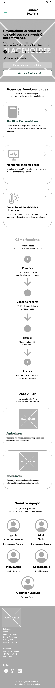
</div>

### 4.3.2. Landing Page Mock-up

Los mock-ups finales de la Landing Page de AgriDron Solutions representan la consolidación visual de la arquitectura y estructura planteadas en los wireframes. En esta etapa de alta fidelidad se integran la paleta cromática institucional (con predominio del verde bosque #1E4D2B y el verde acento #10B981), las familias tipográficas Inter y Roboto, la escala de espaciado modular basada en 8 px, la iconografía agrícola/tecnológica y los estándares de accesibilidad visual (WCAG 2.1 AA). El resultado es una interfaz pública coherente, moderna y persuasiva, alineada con la propuesta de valor de la agricultura de precisión y la fumigación con drones.

**Desktop**

En el mock-up desktop se evidencia una jerarquía visual clara, reforzada mediante el uso del verde bosque corporativo en componentes estructurales y el verde acento en los botones de llamada a la acción (CTAs) y puntos de énfasis. La hero section captura de inmediato la atención del visitante con el mensaje principal de la plataforma, botones destacados de conversión (Empieza tu prueba gratuita, Solicitar Demo) y un contenedor visual que muestra la interfaz telemétrica del dron sobre un mapa satelital. Las secciones posteriores organizan las funcionalidades clave, la segmentación por roles (agricultores, operadores, supervisores), la secuencia operativa de uso y el equipo multidisciplinario sobre fondos neutros claros (#FFFFFF y #F8FAFC), facilitando una lectura escaneable y fluida.

<div align="center">
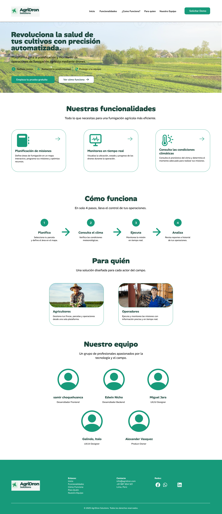
</div>

**Mobile**

<div align="center">
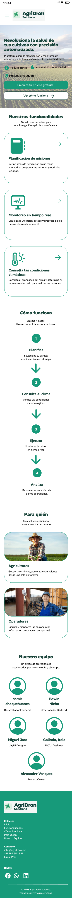
</div>

## 4.4. Web Applications UX/UI Design

Para los agricultores, la interfaz prioriza una experiencia clara y accesible que permite catastrar fincas y parcelas dibujando polígonos sobre mapas satelitales interactivos, programar misiones fitosanitarias con validación climática preventiva y auditar el historial de tratamientos mediante reportes consolidados. Para los operadores técnicos, la plataforma agiliza la recepción de órdenes de trabajo con áreas predelimitadas, proporciona un panel de monitoreo con telemetría simulada (posición GPS, nivel de batería y avance de pulverización) y facilita la emisión instantánea de actas de servicio digitales que certifican las hectáreas netas tratadas y respaldan suspensiones operativas ante vientos adversos.
A partir de estas necesidades, el diseño de la aplicación web reduce la sobrecarga cognitiva en campo y gabinete mediante una arquitectura modular: garantiza acceso inmediato a mapas interactivos, visualización de estados en tiempo real (programada, en progreso, pausada o completada), consulta automatizada de datos meteorológicos y flujos guiados en pocos pasos para optimizar cada jornada agrícola.

### 4.4.1. Web Applications Wireframes

Los wireframes de las Web Applications definen la estructura base de las vistas más relevantes del sistema antes de aplicar el diseño visual definitivo. En ellos se observa la distribución de dashboards interactivos, mapas satelitales, formularios de programación de misiones en pasos, tablas telemétricas, tarjetas de métricas (KPIs), paneles laterales de control de vuelo y zonas de acción principal. Esta etapa permitió validar la relación entre la jerarquía visual, la arquitectura de información y los flujos operativos por rol (agricultor, operador y supervisor).

En escritorio, los wireframes muestran una estructura con sidebar lateral persistente, header superior con notificaciones/alertas y un área central de trabajo amplia, adecuada para la interacción con mapas cartográficos, monitoreo telemétrico y reportes gráficos de rendimiento. En mobile web, la información se reorganiza en tarjetas apiladas, paneles deslizantes y listas táctiles de fácil lectura bajo luz solar directa, reduciendo la complejidad visual sin perder funcionalidad ni velocidad de respuesta en campo.

<div align="center">

</div>

<div align="center">

</div>

<div align="center">

</div>

<div align="center">

</div>

<div align="center">

</div>


### 4.4.2. Web Applications Wireflow Diagrams

Los wireflows de AgriDron Solutions muestran cómo cambian las pantallas wireframe a medida que el usuario avanza en un flujo concreto. Cada wireflow se construye a partir de un user goal y representa la secuencia de pasos necesarios para alcanzarlo, incluyendo decisiones intermedias y estados relevantes de la interfaz.
User Goal Principal: Planificar, ejecutar y monitorear una misión de fumigación de precisión

**User Goal 1: Descubrir la propuesta de valor y solicitar una demostración comercial.**
Este wireflow representa el recorrido del visitante del sitio web desde la landing page principal hasta el formulario de contacto de AgriDron Solutions. El flujo muestra la navegación a través de las secciones de servicios, tarifas y equipo multidisciplinario, permitiendo explorar los beneficios de la pulverización con drones y la normativa fitosanitaria antes de enviar la solicitud de demostración comercial.


<div align="center">
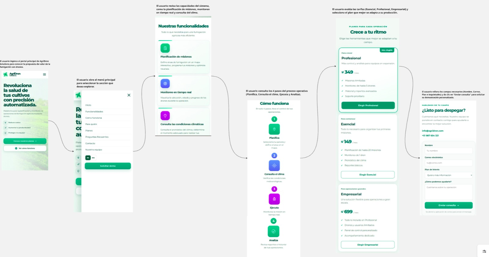
</div>

**User Goal 2: Completar el registro de usuario y autenticarse en la plataforma.**
Este wireflow muestra la secuencia de acceso e ingreso al sistema según el rol del usuario (agricultor u operador técnico). Incluye la navegación por las pantallas de registro de datos, el formulario de inicio de sesión seguro y el flujo alternativo para el restablecimiento de contraseña mediante correo electrónico, mostrando los estados de validación de campos obligatorios e inicio de sesión fallido. 

<div align="center">
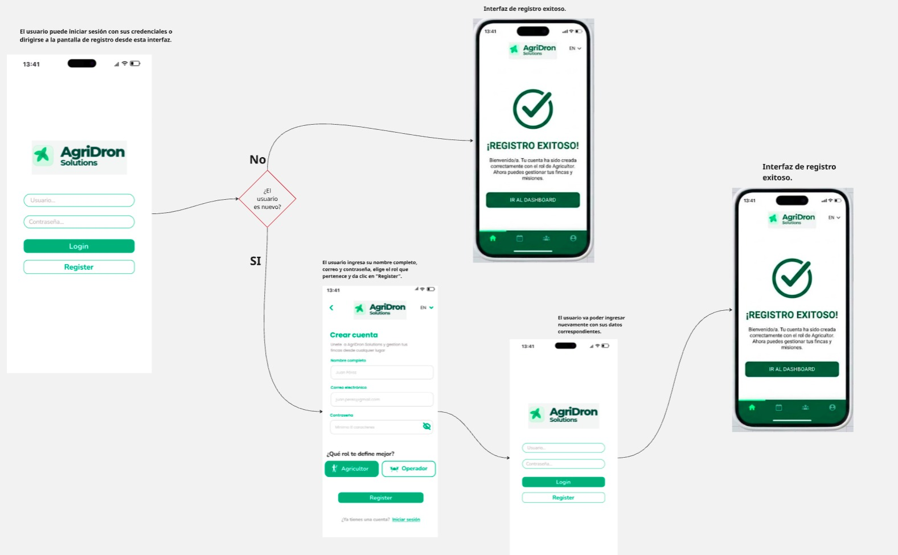
</div>

**User Goal 3: Delimitar parcelas agrícolas y gestionar la información
del terreno.**
Este wireflow representa el recorrido del agricultor dentro del módulo de gestión territorial sobre el mapa interactivo. Muestra la interacción para registrar fincas, trazar vértices poligonales de parcelas, asignar tipos de cultivo y etapas fenológicas, así como la alternancia entre capas cartográficas (satelital/topográfica) y los controles para editar o inhabilitar parcelas.

<div align="center">
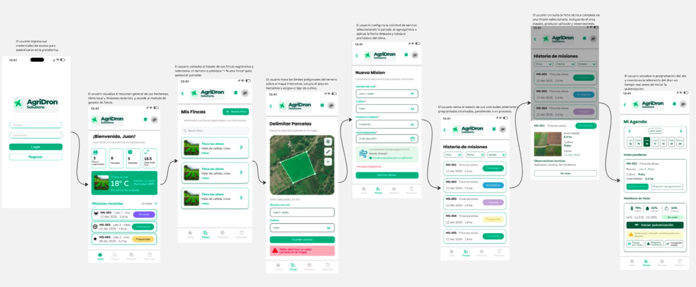
</div>

**User Goal 4: Administrar el inventario de la flota de drones e insumos agrícolas.**
Este wireflow detalla la pantalla de catálogo y gestión de flota para operadores y supervisores. Visualiza el recorrido para dar de alta nuevos drones, configurar modelos de boquillas, registrar productos agroquímicos autorizados, monitorear el estado operativo de los equipos y documentar reportes de mantenimiento preventivo o fallas técnicas.

<div align="center">

</div>

**Link del Miro:** https://miro.com/welcomeonboard/OU1LdXRSanlNQXZ5bUErM2JqS0xsNTdsZGg4TTdjUHBreWpNSjBBNEU4K3MwT29LcU5NRE80Ym9semMrb2dBckxXMGlEWktwMkt1QTdBWW9UTVJML1o2OExBWDBmUTdoZW1GcmFzci9hZUhsRGRRRUZ1ZC9nRUVDS01ZQkNUbUZQdGo1ZEV3bUdPQWRZUHQzSGl6V2NBPT0hdjE=?share_link_id=698081833794

### 4.4.3. Web Applications Mock-ups

Los mock-ups de alta fidelidad de AgriDron Solutions representan la consolidación visual y funcional de la aplicación web, construidos sobre el sistema de diseño, la paleta cromática, la jerarquía tipográfica (Inter y Roboto) y la escala de espaciado modular definidos en la solución. En estas interfaces se evidencia cómo la arquitectura de información y el diseño inclusivo con alto contraste se traducen en pantallas operativas, legibles en entornos de campo y optimizadas para el trabajo en escritorio, tablet y smartphone.

En escritorio, la aplicación estructura su área de trabajo mediante un sidebar lateral persistente con menú navegable (Inicio, Fincas, Parcelas, Misiones, Drones, Reportes, Configuración), una barra superior (header) con buscador global y selector de usuario (Juan Pérez - Agricultor), y un lienzo central con tarjetas, mapas satelitales interactivos, paneles telemétricos y tablas operativas. En dispositivos móviles y tablets, la interfaz reorganiza la información en listas táctiles apiladas y tarjetas adaptativas, preservando el acceso completo a las funciones sin saturar la pantalla.

A continuación, se detallan los 8 escenarios visuales clave presentados en la propuesta de alta fidelidad:

**Desktop**

**1. Inicio / Dashboard**

- Propósito: Vista principal y centro de control operativo tras autenticarse en la plataforma.

  **Componentes clave:**
- Tarjetas de métricas generales (KPIs): Resumen numérico con total de Fincas registradas (3), Parcelas (8), Misiones (5) y Área total (18.5 ha).
- Misiones recientes: Tabla resumida con ID de misión (MS-001, MS-002, MS-003), parcela de destino, fecha y badges de estado con código de color (En curso, Completada, Programada).
- Widget meteorológico: Panel en tiempo real que exhibe temperatura (18 °C), condición del cielo (Parcialmente nublado), velocidad del viento (12 km/h) y humedad relativa (68%)

<div align="center">

</div>

**2. Gestión de Fincas**

- **Propósito:** Administrar los predios agrícolas registrados por el usuario, permitiendo consultar su ubicación geográfica, superficie total y acceder a sus opciones de gestión.

**Componentes clave:**

- Botón contextual destacado **+ Nueva Finca** para registrar nuevos predios agrícolas.
- Tarjetas de finca que incluyen una imagen representativa del terreno, nombre del predio, ubicación geográfica y extensión en hectáreas.
- Botón **Ver** para acceder directamente a la información detallada de cada finca.
- Menú de acciones contextual para acceder a opciones adicionales de gestión de los predios.
- Barra lateral de navegación que facilita el acceso a los módulos de Inicio, Fincas, Parcelas, Misiones, Drones, Reportes y Configuración.

<div align="center">
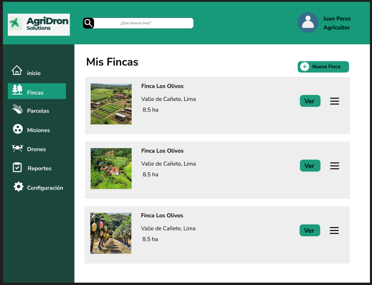
</div>

**3. Gestión de Parcelas**

- **Propósito:** Visualizar y administrar las parcelas agrícolas pertenecientes a una finca, facilitando la identificación de sus límites geográficos, distribución y extensión territorial.

**Componentes clave:**

- Selector de finca que permite identificar el predio agrícola cuyas parcelas se desean consultar (Finca Los Olivos).
- Vista cartográfica satelital que presenta la delimitación poligonal del terreno, incluyendo medidas aproximadas de sus lados y superficie total (24,519 m²).
- Herramientas de navegación cartográfica con controles de acercamiento, alejamiento y ubicación geográfica.
- Panel lateral con listado de parcelas registradas (Lote 1 - Uva 2.5 ha, Lote 2 - Uva 3.2 ha, Lote 3 - Uva 2.8 ha, Lote 4 - Uva 1.9 ha y Lote 5 - Uva 8.4 ha), acompañado de imágenes representativas y menús de acciones contextuales.
- Botón destacado **+ Nueva Parcela** para iniciar el registro de nuevos lotes agrícolas dentro de la finca seleccionada.


<div align="center">
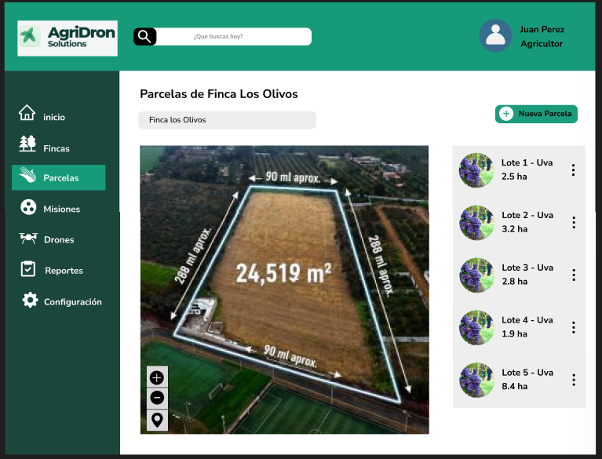
</div>

**4. Monitoreo de Misiones**

- **Propósito:** Supervisar el estado y progreso de las misiones agrícolas en ejecución, permitiendo consultar la información operativa, el área de intervención y los parámetros de funcionamiento del dron en tiempo real.

**Componentes clave:**

- Tarjeta informativa de la misión (MS-001) que presenta su estado actual (En curso), parcela asignada (Lote 3 - Iva), fecha y hora de inicio (12 Abr 2025 - 08:30), operador responsable (Carlos Mendoza) y barra de progreso (60%).
- Previsualización geoespacial del terreno agrícola con delimitación poligonal del área intervenida durante la misión.
- Panel de telemetría del dron que muestra indicadores operativos como batería (80%), altitud (25 m), velocidad (5.2 m/s), calidad de señal GPS (Excelente) y nivel de líquido disponible (1.5 Lt).
- Línea de tiempo que representa las etapas del ciclo de vida de la misión: Preparación, En ejecución, En pausa y Finalizada, con indicadores visuales de seguimiento.
- Botón **Ver detalle** para acceder a información adicional de la misión y enlace **Volver a misiones** para regresar al listado general.

<div align="center">
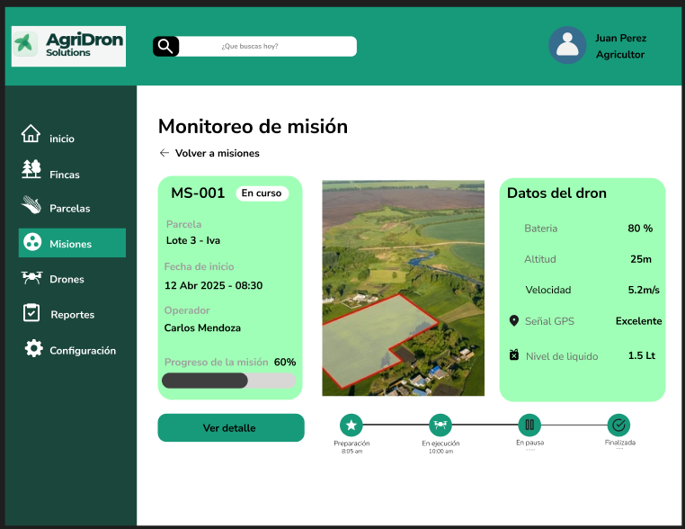
</div>


**5. Planificación de Misiones**

- **Propósito:** Facilitar la programación de misiones de fumigación agrícola mediante un flujo asistido de cuatro etapas, permitiendo seleccionar la parcela, definir la fecha y hora de ejecución, configurar los insumos y revisar los parámetros de la operación antes de su programación.

**Componentes clave:**

- Indicador de progreso secuencial (wizard) organizado en cuatro etapas: **1. Parcela → 2. Fecha y Hora → 3. Insumos → 4. Resumen**, que orienta al usuario durante la planificación de la misión.
- Selectores desplegables para identificar la finca (Finca Los Olivos) y la parcela agrícola (Lote 1 - Uva) donde se realizará la fumigación.
- Previsualización geoespacial del terreno mediante una imagen satelital con delimitación poligonal del área de intervención y herramientas de navegación cartográfica (zoom y ubicación).
- Panel informativo que muestra la superficie seleccionada (2.5 ha), el tipo de cultivo (Uva) y un selector para definir el tratamiento agrícola (Fungicida).
- Botón principal **Siguiente →** para continuar con la configuración de la fecha y hora de ejecución de la misión.

<div align="center">
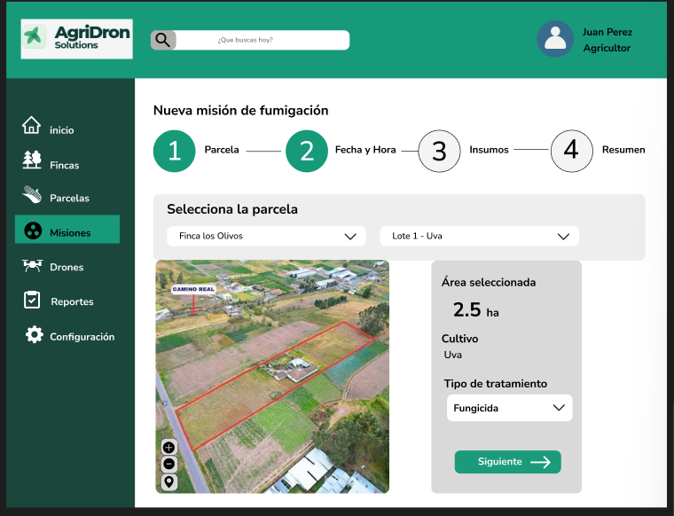
</div>


**6. Reportes e Historial**

- **Propósito:** Facilitar la consulta, seguimiento y análisis del historial de misiones agrícolas, permitiendo revisar las operaciones registradas, evaluar el consumo de insumos y consultar los ahorros generados durante las actividades de fumigación.

**Componentes clave:**

- Navegación mediante pestañas organizadas en tres categorías: **Misiones, Uso de insumos y Ahorros**, que permiten acceder a diferentes tipos de reportes operativos.
- Selector de rango de fechas (01/04/2025 - 30/04/2025) acompañado del botón **Filtrar**, para consultar los registros correspondientes a un periodo determinado.
- Tabla de historial de misiones que presenta información organizada por identificador (ID), parcela intervenida, fecha de ejecución, estado de la operación (En curso, Completado o Programado) y superficie agrícola en hectáreas.
- Botones de descarga individuales asociados a cada misión para obtener los reportes correspondientes a las operaciones registradas.
- Controles de paginación que permiten navegar entre las diferentes páginas del historial de misiones mediante botones numéricos y la opción **Next >**.

<div align="center">
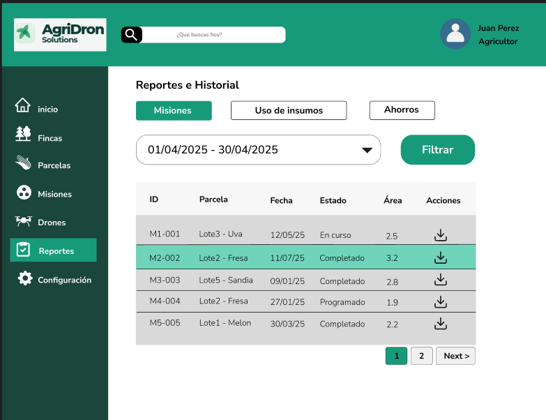
</div>


**7. Perfil y Configuración**

- **Propósito:** Permitir al usuario administrar su información personal, configurar las preferencias de notificación y acceder a las opciones de seguridad e integración de su cuenta dentro de la plataforma.

**Componentes clave:**

- Menú de navegación interna organizado en cuatro secciones: **Perfil, Notificaciones, Seguridad e Integraciones**, que facilita el acceso a las distintas opciones de configuración.
- Panel de información del usuario que presenta fotografía de perfil, nombre (Juan Pérez), correo electrónico (juan.perez@gmail.com) y rol asignado (Agricultor).
- Botón **Editar Perfil** que permite acceder a las opciones de modificación de los datos personales del usuario.
- Sección de preferencias con controles deslizantes (toggle switches) para activar o desactivar las **Notificaciones por correo**, **Notificaciones en la app** y **Alertas meteorológicas**, permitiendo personalizar la recepción de avisos según las necesidades del agricultor.

<div align="center">
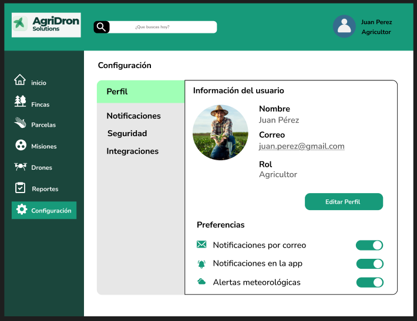
</div>


**8. Gestión de Drones**

- **Propósito:** Administrar los drones agrícolas registrados en la plataforma, permitiendo consultar sus características técnicas, verificar su estado operativo y realizar acciones de registro, edición o eliminación de equipos.

**Componentes clave:**

- Botón destacado **+ Registrar nuevo dron** que permite iniciar el proceso de incorporación de nuevos equipos agrícolas a la plataforma.
- Cuadrícula de tarjetas informativas organizada en dos columnas, donde se visualizan los drones registrados mediante una imagen representativa y su modelo (Dron 4455).
- Indicador visual de estado operativo mediante una etiqueta de color que permite identificar la condición actual de cada dron.
- Información técnica de cada equipo que incluye número de serie (SN), superficie de referencia (8.5 ha) y capacidad del tanque de pulverización (40 L).
- Botón **Editar** para acceder a la modificación de los datos y características de un dron registrado.
- Botón **Eliminar** para gestionar la eliminación de equipos del inventario de drones.
- Barra lateral de navegación que facilita el acceso a los módulos de Inicio, Fincas, Parcelas, Misiones, Drones, Reportes y Configuración.

<div align="center">
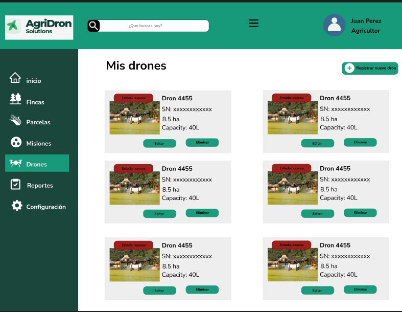
</div>

**link del figma:** https://www.figma.com/design/gIhPSpNHHNel3RMWLQSl8a/Sin-t%C3%ADtulo?node-id=0-1&t=LmubQnBsex2NasC8-1

### 4.4.4. Web Applications User Flow Diagrams

Los user flows de AgriDron Solutions representan la secuencia detallada de pasos, decisiones lógicas del sistema y estados de éxito que sigue cada perfil de usuario para alcanzar sus objetivos funcionales dentro de la aplicación web.

**User Goal 1: Solicitar y coordinar una demostración comercial del servicio.**
Este user flow define el camino lógico que realiza un visitante desde el ingreso al portal público hasta la confirmación del envío del formulario de contacto. El flujo detalla las validaciones del sistema sobre los campos requeridos, el registro de la solicitud comercial en la base de datos y la emisión del mensaje de confirmación de recepción.

<div align="center">
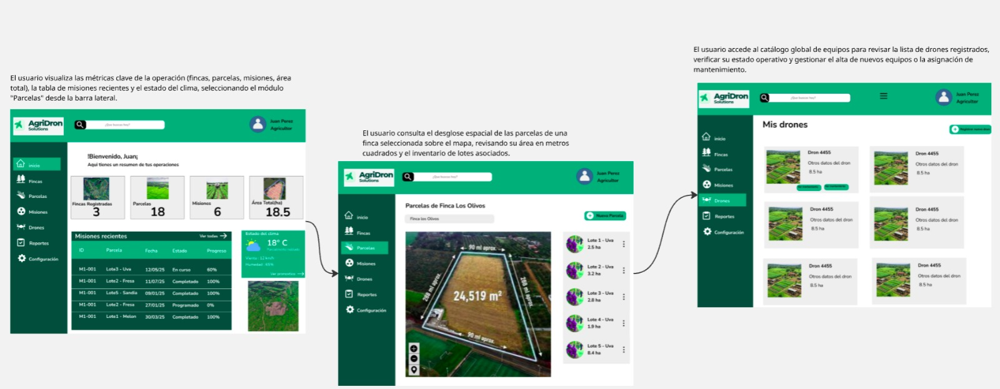
</div>

**User Goal 2: Registrar fincas y parametrizar polígonos de parcelas en el mapa.**
Este user flow abarca la lógica secuencial para la creación y actualización de terrenos agrícolas. Detalla desde la inserción de datos de la finca hasta el trazado de coordenadas en el mapa, el cálculo automático de hectáreas por parte del sistema, la asociación de datos agronómicos y el filtrado por tipo de cultivo.

<div align="center">
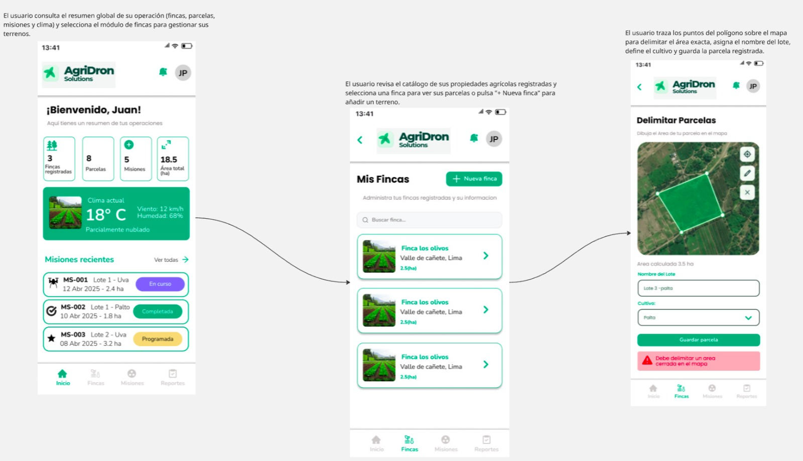
</div>

**User Goal 3: Programar misiones de pulverización y consultar el historial de servicios.**
Este user flow describe la secuencia lógica que sigue el agricultor para solicitar una orden de fumigación y hacer seguimiento a sus ejecuciones. Incluye la selección de la parcela, cultivo y agroquímico con la validación de condiciones climáticas aptas, el registro de la solicitud en la lista de misiones y la consulta detallada del reporte o acta técnica de un servicio completado.

<div align="center">
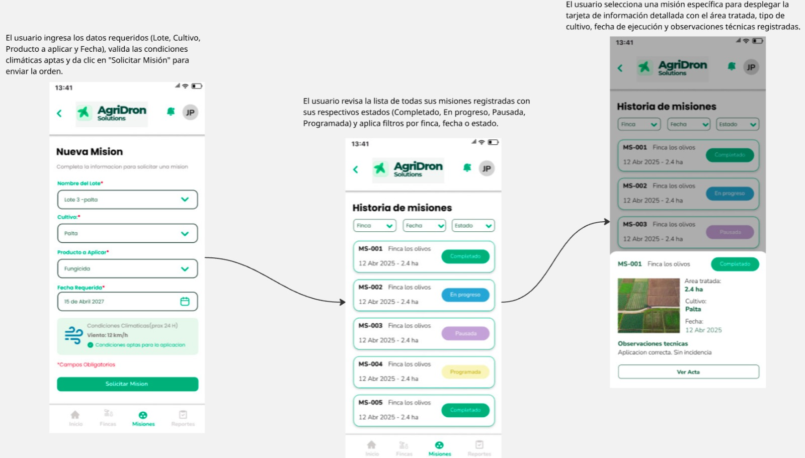
</div>


**Link del Miro:** [https://miro.com/app/board/uXjVHnbT8O4=/?share_link_id=310365063702](https://miro.com/welcomeonboard/OU1LdXRSanlNQXZ5bUErM2JqS0xsNTdsZGg4TTdjUHBreWpNSjBBNEU4K3MwT29LcU5NRE80Ym9semMrb2dBckxXMGlEWktwMkt1QTdBWW9UTVJML1o2OExBWDBmUTdoZW1GcmFzci9hZUhsRGRRRUZ1ZC9nRUVDS01ZQkNUbUZQdGo1ZEV3bUdPQWRZUHQzSGl6V2NBPT0hdjE=?share_link_id=698081833794)

---

## 4.5. Web Applications Prototyping

<div align="center">

</div>

<div align="center">

</div>

---

## 4.6. Domain-Driven Software Architecture

### 4.6.1. Design-Level Event Storming
El Design-Level Event Storming constituye el puente definitivo entre los requerimientos de negocio, identificados durante el proceso de Lean UX, y la arquitectura técnica de software. En esta etapa de diseño detallado bajo el enfoque de Domain-Driven Design (DDD), se descompone la complejidad del sistema AgriDron Solutions en partes modulares e independientes conocidas como Bounded Contexts.

Para cada contexto, se ha analizado minuciosamente la cadena de causa y efecto que rige el comportamiento del software, identificando los actores que interactúan con el sistema, los comandos , los agregadosde , los eventos de dominio , las políticas  y los modelos de lectura . Esta estructuración garantiza que la plataforma SaaS sea escalable, altamente cohesiva y esté estrictamente alineada con la propuesta de valor del proyecto.

### Flujo principal del dominio

A continuación, se describe y justifica cada uno de los Bounded Contexts identificados para la plataforma:

**Bounded context 1 : Identity & Access Management Context**

Este contexto gestiona el registro de usuarios, la validación de credenciales, el control de acceso y la segregación de los roles operativos dentro de la plataforma (Agricultores, Operadores y Supervisores).

Como plataforma SaaS multiusuario, AgriDron requiere un control estricto sobre quién accede a la información y qué acciones puede realizar. Se clasifica como un Generic Subdomain, ya que, si bien no es el núcleo diferenciador del negocio agrícola, es una pieza de infraestructura crítica y obligatoria para aislar la información confidencial de los clientes, asignar responsabilidades operativas y habilitar los modelos de suscripción.

<div align="center">
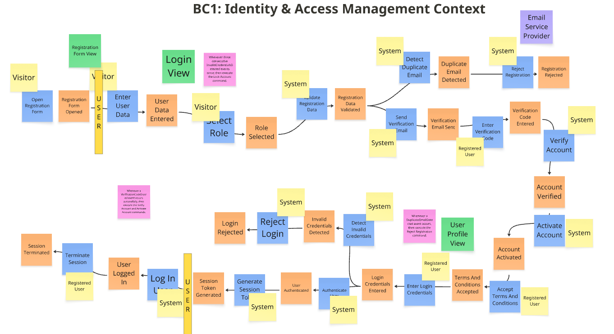
</div>

**Bounded context 2 : Field Management Context**

Encargado de la gestión espacial y geográfica del dominio. Administra el registro de fincas, la definición visual de parcelas mediante mapas interactivos y la asignación de tipos de cultivo a los polígonos trazados.

Responde directamente a la problemática de negocio sobre la gestión manual y desordenada de las áreas de cultivo. Al digitalizar y centralizar los límites exactos de cada parcela, se garantiza precisión en los cálculos de área y se evita el desperdicio de insumos. Actúa como un Supporting Subdomain fundamental, ya que provee los datos espaciales necesarios para que las misiones de vuelo puedan existir.

<div align="center">
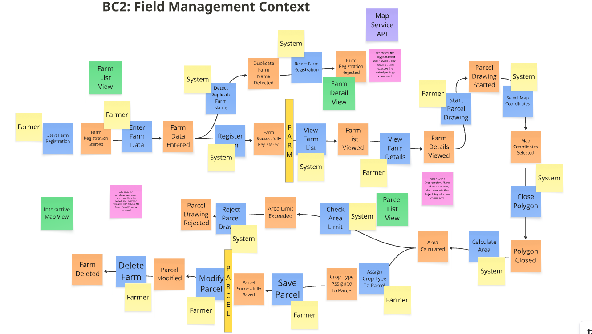
</div>

**Bounded context 3 : Flight Operations Context**

Es el motor operativo de AgriDron. Abarca todo el ciclo de vida de la fumigación: la creación de la misión, la asignación de operadores, el inicio de la jornada laboral, la actualización de la telemetría del dron en tiempo real y el reporte de incidencias en campo hasta la finalización del vuelo.

Representa el Core Domain (dominio central) del proyecto. Contiene la principal ventaja competitiva y propuesta de valor de la startup: la orquestación en tiempo real de operaciones de fumigación con drones. Es el contexto que más impacto tiene en la reducción de tiempos, costos operativos y exposición a riesgos químicos, cumpliendo con las hipótesis planteadas en el Lean UX.

<div align="center">
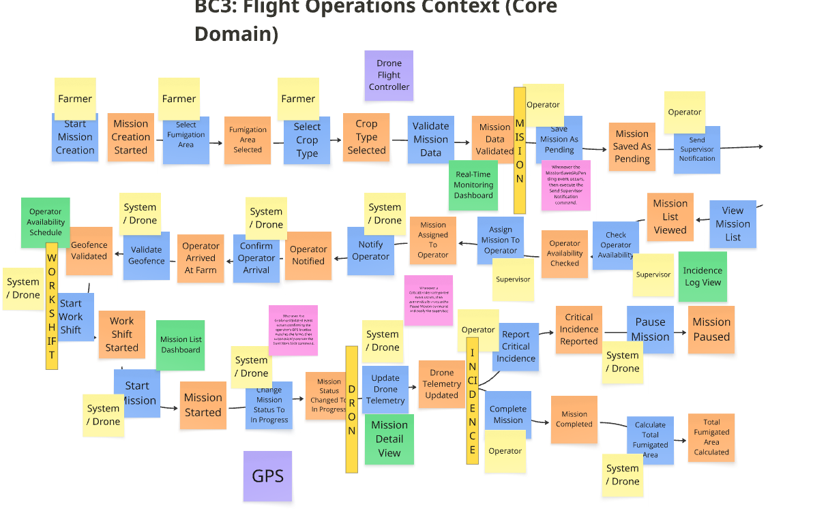
</div>

**Bounded context 4 : Weather Integration Context**

Actúa como una capa especializada (Anti-Corruption Layer) que se comunica de forma continua con APIs meteorológicas externas para obtener pronósticos de viento, lluvia y temperatura.

Las condiciones climáticas son un factor de riesgo crítico en la fumigación con drones. Este Supporting Subdomain justifica su existencia al transformar datos meteorológicos externos en reglas de negocio internas (alertas y bloqueos de vuelo). Además, cumple directamente con el requerimiento arquitectónico del proyecto de integrar y consumir servicios de terceros de manera aislada y resiliente.

<div align="center">
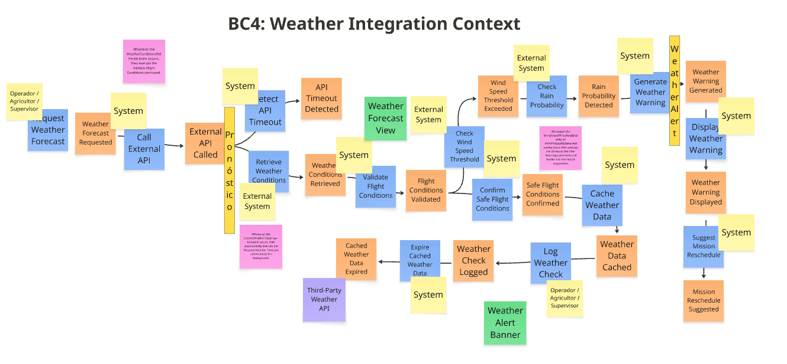
</div>

**Bounded context 5 : Analytics & Reporting Context**

Se encarga de procesar los datos históricos de las misiones completadas para calcular métricas de eficiencia, costos por hectárea, rendimiento de operadores y generar reportes exportables (PDF).

Está alineado con el objetivo de negocio de fomentar la retención de clientes y la adopción de planes premium. Los agricultores y supervisores necesitan justificar sus inversiones tecnológicas; este contexto transforma los datos operativos brutos en inteligencia de negocio, permitiendo la toma de decisiones estratégicas basadas en el rendimiento real.

<div align="center">
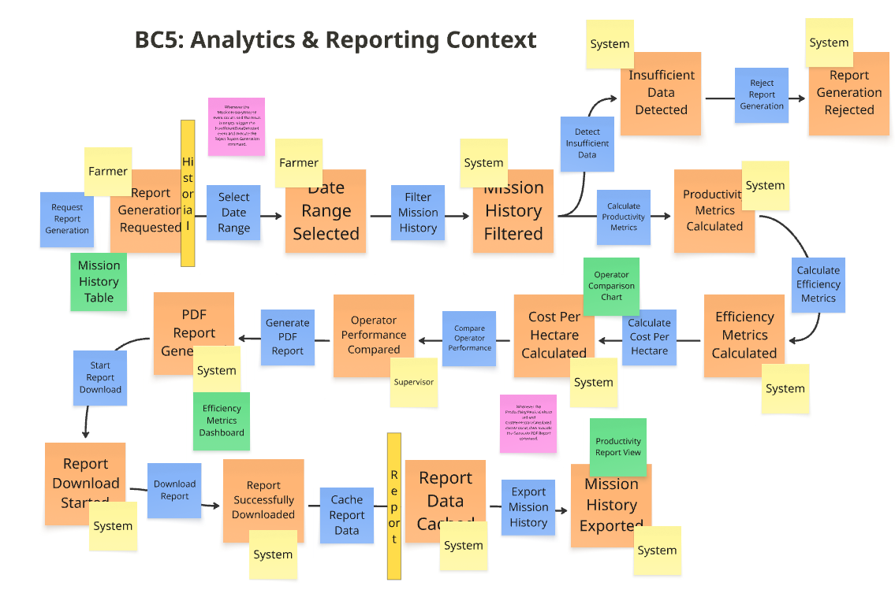
</div>

**Bounded context 6 : Inventory & Resource Management Context**

Gestiona el catálogo de insumos químicos (pesticidas, herbicidas y fertilizantes), controlando los niveles de stock, registrando los descuentos por cada misión y emitiendo alertas cuando se alcanzan umbrales críticos.

Evita los cuellos de botella operativos. Una misión no puede ejecutarse si no hay insumos físicos suficientes. Este contexto de soporte garantiza la continuidad de las operaciones en campo, mitigando el riesgo de desabastecimiento y permitiendo a las cooperativas agrícolas planificar sus compras con antelación, lo que impacta positivamente en la reducción de costos generales.

<div align="center">
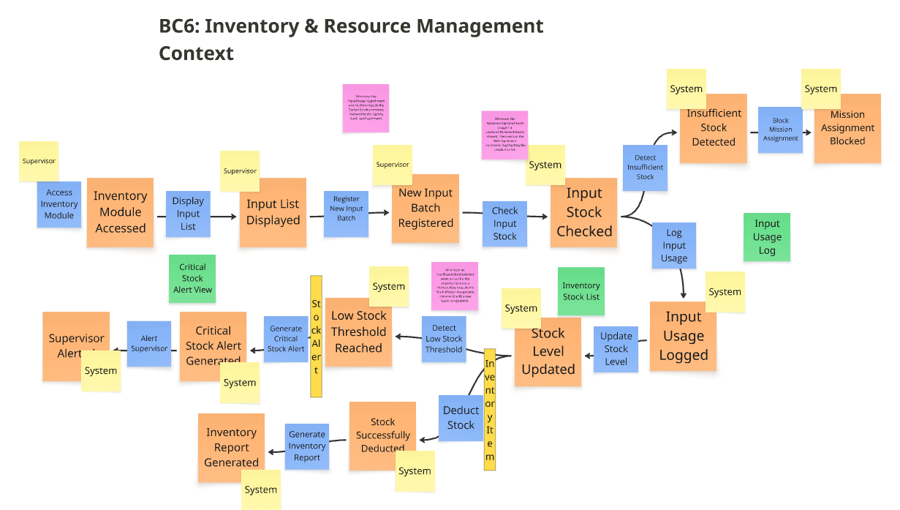
</div>

**link de mmiro:** https://miro.com/app/board/uXjVHl_E4nc=/?share_link_id=823387251080

### 4.6.2. Software Architecture Context Diagram
El diagrama de contexto ilustra el panorama general de AgriDron Solutions como el orquestador principal que unifica la planificación
agronómica con la ejecución técnica en campo. En este ecosistema, se visualiza la interacción asíncrona del agricultor para registrar
fincas y solicitar servicios, la vigilancia continua del supervisor para gestionar recursos operativos, y la intervención del operador
técnico para validar coordenadas e iniciar misiones. Asimismo, el diagrama evidencia las dependencias críticas con sistemas externos,
delegando la validación de riesgos climáticos a una API Meteorológica y el envío de notificaciones transaccionales a un Servicio de Correo,
lo que garantiza una operación segura y enfocada netamente en el valor del negocio.

<div align="center">
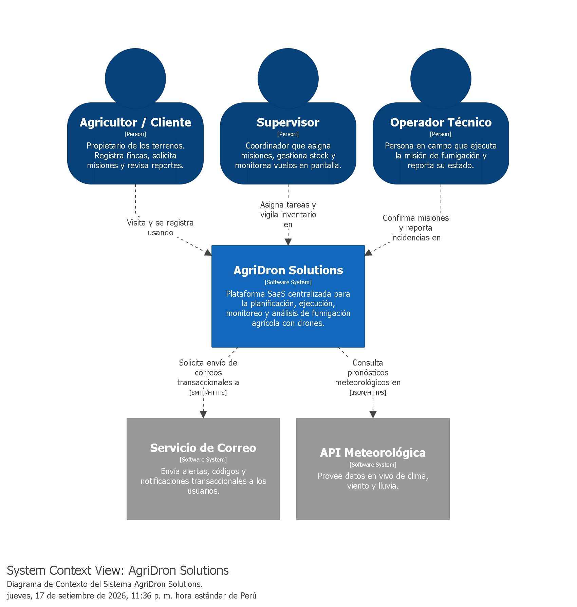
</div>

### 4.6.3. Software Architecture Container Diagrams

Este nivel detalla las unidades de despliegue y la distribución de responsabilidades técnicas dentro del sistema central.
La capa de presentación se divide estratégicamente en una Landing Page enfocada en la adquisición pública de clientes y
una Web Application (SPA) privada encargada de renderizar los mapas interactivos y la telemetría en tiempo real. Toda la lógica de negocio,
flujos de dominio y validaciones de seguridad se centralizan exclusivamente en la RESTful API, la cual actúa como el único puente de comunicación
autorizado hacia la base de datos relacional (PostgreSQL). Esta estructura asegura que ninguna interfaz cliente pueda manipular el estado del sistema
sin cumplir con las reglas del dominio, protegiendo así la integridad de la información espacial e histórica.

<div align="center">
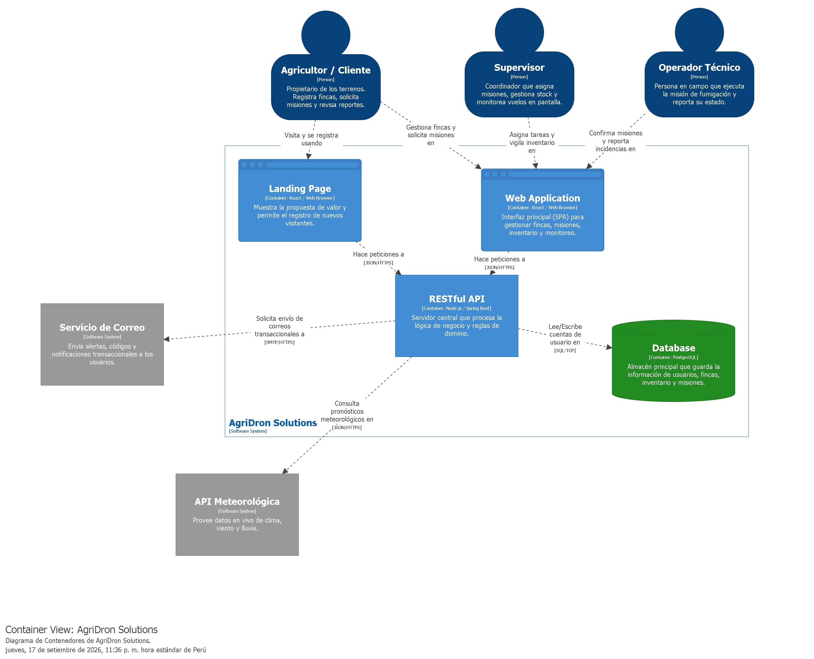
</div>

### 4.6.4. Software Architecture Components Diagrams

El diagrama de componentes desglosa internamente la RESTful API para demostrar la correspondencia directa entre la
arquitectura técnica y los Bounded Contexts definidos previamente en el Event Storming. La API se estructura en módulos
altamente cohesivos donde el Flight Operations Component actúa como el núcleo orquestador, el cual interactúa estrictamente
con el Weather Component y el Inventory Component para validar que las condiciones climáticas y de stock sean seguras antes de autorizar
un vuelo. Además, este diseño aplica el patrón de capa anticorrupción para aislar el núcleo del negocio de posibles alteraciones en los
proveedores externos de clima y correo, resultando en una plataforma escalable, resiliente y alineada a las exigencias operativas.

<div align="center">
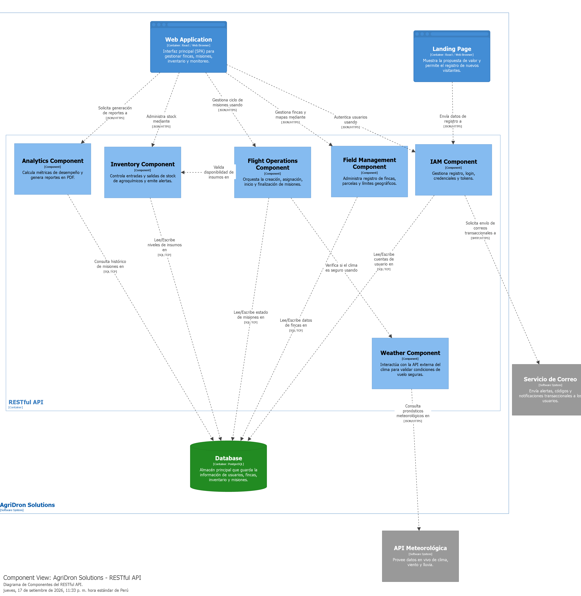
</div>

## 4.7. Software Object-Oriented Design
El diseño orientado a objetos representa los principales elementos del dominio y sus relaciones. El Project Statement solicita que los Class Diagrams incluyan clases, interfaces, enumeraciones, atributos, métodos, visibilidad, relaciones y multiplicidades cuando correspondan.

### 4.7.1. Class Diagrams

### 4.7.1.1. Field Management

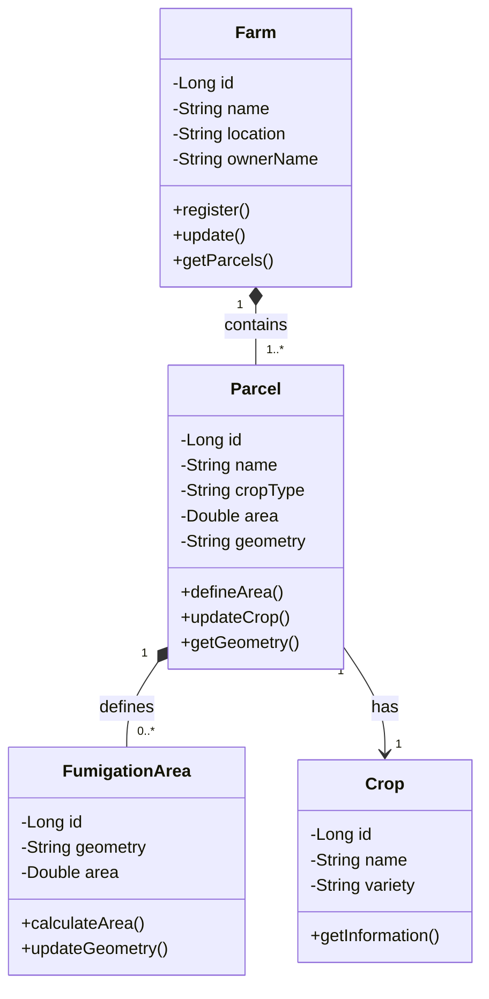
```mermaid
classDiagram
  class Farm {
    -Long id
    -String name
    -String location
    -String ownerName
    +register()
    +update()
    +getParcels()
  }
  class Parcel {
    -Long id
    -String name
    -String cropType
    -Double area
    -String geometry
    +defineArea()
    +updateCrop()
    +getGeometry()
  }
  class FumigationArea {
    -Long id
    -String geometry
    -Double area
    +calculateArea()
    +updateGeometry()
  }
  class Crop {
    -Long id
    -String name
    -String variety
    +getInformation()
  }
  Farm "1" *-- "1..*" Parcel : contains
  Parcel "1" *-- "0..*" FumigationArea : defines
  Parcel "1" --> "1" Crop : has
```

### 4.7.1.2. Flight Operations

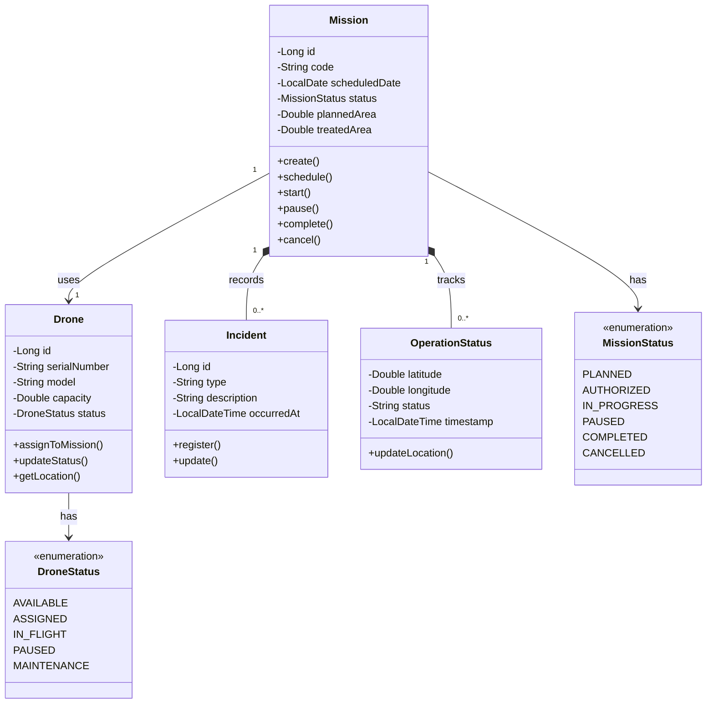
```mermaid
classDiagram
  class Mission {
    -Long id
    -String code
    -LocalDate scheduledDate
    -MissionStatus status
    -Double plannedArea
    -Double treatedArea
    +create()
    +schedule()
    +start()
    +pause()
    +complete()
    +cancel()
  }
  class Drone {
    -Long id
    -String serialNumber
    -String model
    -Double capacity
    -DroneStatus status
    +assignToMission()
    +updateStatus()
    +getLocation()
  }
  class Incident {
    -Long id
    -String type
    -String description
    -LocalDateTime occurredAt
    +register()
    +update()
  }
  class OperationStatus {
    -Double latitude
    -Double longitude
    -String status
    -LocalDateTime timestamp
    +updateLocation()
  }
  class MissionStatus {
    <<enumeration>>
    PLANNED
    AUTHORIZED
    IN_PROGRESS
    PAUSED
    COMPLETED
    CANCELLED
  }
  class DroneStatus {
    <<enumeration>>
    AVAILABLE
    ASSIGNED
    IN_FLIGHT
    PAUSED
    MAINTENANCE
  }
  Mission "1" --> "1" Drone : uses
  Mission "1" *-- "0..*" Incident : records
  Mission "1" *-- "0..*" OperationStatus : tracks
  Mission --> MissionStatus : has
  Drone --> DroneStatus : has
```

### 4.7.1.3. Weather Integration

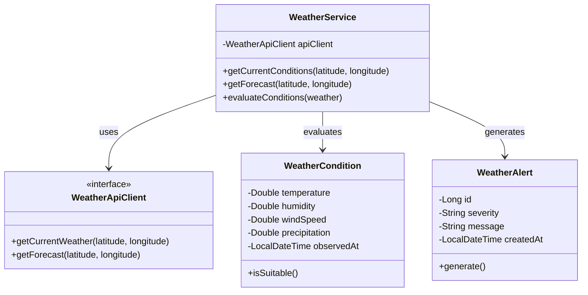
```mermaid
classDiagram
  class WeatherService {
    -WeatherApiClient apiClient
    +getCurrentConditions(latitude, longitude)
    +getForecast(latitude, longitude)
    +evaluateConditions(weather)
  }
  class WeatherApiClient {
    <<interface>>
    +getCurrentWeather(latitude, longitude)
    +getForecast(latitude, longitude)
  }
  class WeatherCondition {
    -Double temperature
    -Double humidity
    -Double windSpeed
    -Double precipitation
    -LocalDateTime observedAt
    +isSuitable()
  }
  class WeatherAlert {
    -Long id
    -String severity
    -String message
    -LocalDateTime createdAt
    +generate()
  }
  WeatherService --> WeatherApiClient : uses
  WeatherService --> WeatherCondition : evaluates
  WeatherService --> WeatherAlert : generates
```

### 4.7.1.4. Analytics & Reporting

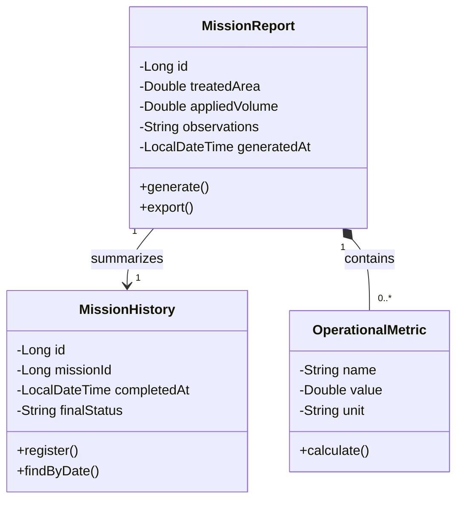
```mermaid
classDiagram
  class MissionReport {
    -Long id
    -Double treatedArea
    -Double appliedVolume
    -String observations
    -LocalDateTime generatedAt
    +generate()
    +export()
  }
  class MissionHistory {
    -Long id
    -Long missionId
    -LocalDateTime completedAt
    -String finalStatus
    +register()
    +findByDate()
  }
  class OperationalMetric {
    -String name
    -Double value
    -String unit
    +calculate()
  }
  MissionReport "1" --> "1" MissionHistory : summarizes
  MissionReport "1" *-- "0..*" OperationalMetric : contains
```

### 4.7.1.5. Shared / Identity

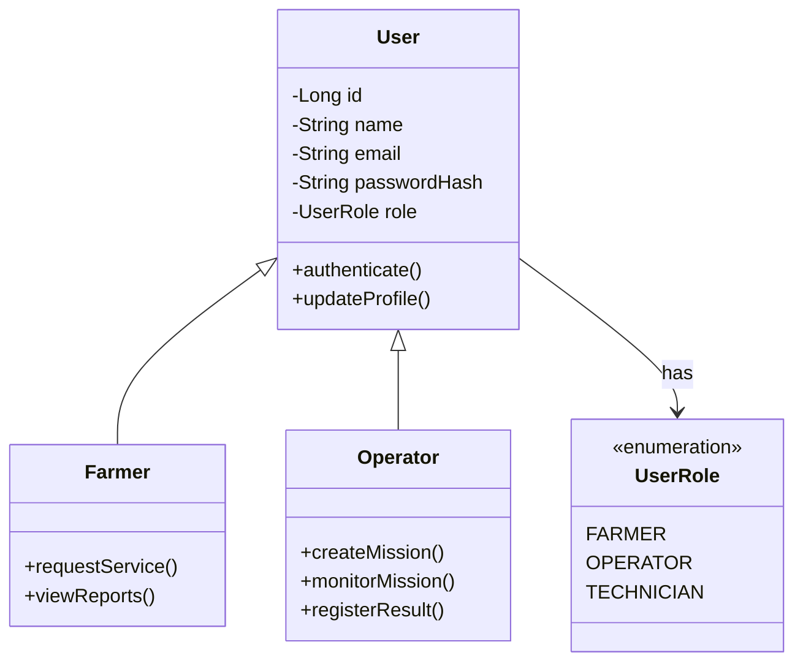
```mermaid
classDiagram
  class User {
    -Long id
    -String name
    -String email
    -String passwordHash
    -UserRole role
    +authenticate()
    +updateProfile()
  }
  class UserRole {
    <<enumeration>>
    FARMER
    OPERATOR
    TECHNICIAN
  }
  class Farmer {
    +requestService()
    +viewReports()
  }
  class Operator {
    +createMission()
    +monitorMission()
    +registerResult()
  }
  User <|-- Farmer
  User <|-- Operator
  User --> UserRole : has
```
**Link LuciChart:** https://lucid.app/lucidchart/a19c55c2-6693-47c1-a66c-347112de89c0/edit?viewport_loc=-1180%2C-484%2C5244%2C2796%2C0_0&invitationId=inv_bd423e8a-a95b-4985-ac69-5194098d2c5f

## 4.8. Database Design
El diseño de base de datos define la persistencia necesaria para los objetos de cada Bounded Context. Para almacenamiento relacional se especifican tablas, columnas, claves primarias, claves foráneas y relaciones entre tablas. Esto corresponde a lo solicitado por el Project Statement.

### 4.8.1. Database Diagrams

### 4.8.1.1. Field Management

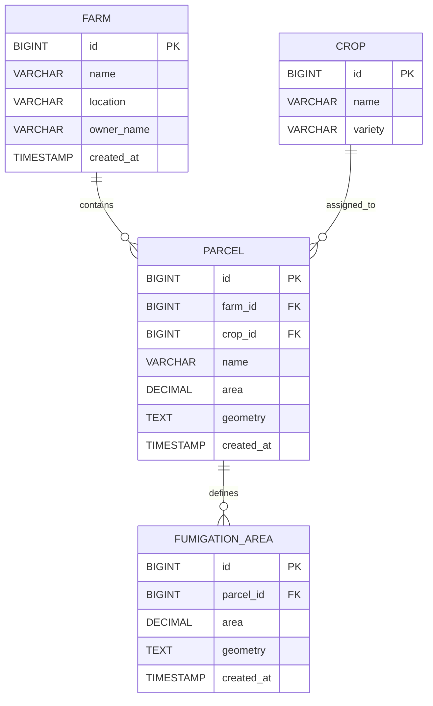
```mermaid
erDiagram
    FARM ||--o{ PARCEL : contains
    PARCEL ||--o{ FUMIGATION_AREA : defines
    CROP ||--o{ PARCEL : assigned_to
    FARM {
        BIGINT id PK
        VARCHAR name
        VARCHAR location
        VARCHAR owner_name
        TIMESTAMP created_at
    }
    PARCEL {
        BIGINT id PK
        BIGINT farm_id FK
        BIGINT crop_id FK
        VARCHAR name
        DECIMAL area
        TEXT geometry
        TIMESTAMP created_at
    }
    FUMIGATION_AREA {
        BIGINT id PK
        BIGINT parcel_id FK
        DECIMAL area
        TEXT geometry
        TIMESTAMP created_at
    }
    CROP {
        BIGINT id PK
        VARCHAR name
        VARCHAR variety
    }
```

**Restricciones principales:** `FARM.id`, `PARCEL.id`, `FUMIGATION_AREA.id` y `CROP.id` son PK; las FK mantienen las relaciones indicadas; `area` debe ser mayor que cero.

### 4.8.1.2. Flight Operations

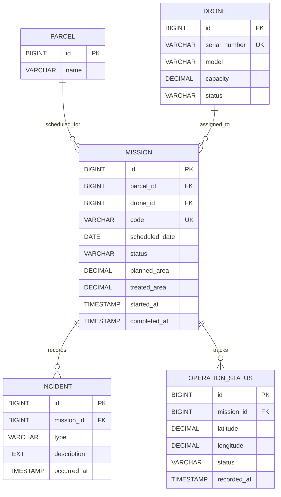
```mermaid
erDiagram
    PARCEL ||--o{ MISSION : scheduled_for
    DRONE ||--o{ MISSION : assigned_to
    MISSION ||--o{ INCIDENT : records
    MISSION ||--o{ OPERATION_STATUS : tracks
    PARCEL {
        BIGINT id PK
        VARCHAR name
    }
    DRONE {
        BIGINT id PK
        VARCHAR serial_number UK
        VARCHAR model
        DECIMAL capacity
        VARCHAR status
    }
    MISSION {
        BIGINT id PK
        BIGINT parcel_id FK
        BIGINT drone_id FK
        VARCHAR code UK
        DATE scheduled_date
        VARCHAR status
        DECIMAL planned_area
        DECIMAL treated_area
        TIMESTAMP started_at
        TIMESTAMP completed_at
    }
    INCIDENT {
        BIGINT id PK
        BIGINT mission_id FK
        VARCHAR type
        TEXT description
        TIMESTAMP occurred_at
    }
    OPERATION_STATUS {
        BIGINT id PK
        BIGINT mission_id FK
        DECIMAL latitude
        DECIMAL longitude
        VARCHAR status
        TIMESTAMP recorded_at
    }
```

**Restricciones principales:** `MISSION.parcel_id` y `MISSION.drone_id` son FK; `MISSION.code` y `DRONE.serial_number` son únicos; las FK de `INCIDENT` y `OPERATION_STATUS` referencian `MISSION.id`; las áreas no pueden ser negativas.

### 4.8.1.3. Weather Integration

Para el MVP, la información meteorológica puede almacenarse únicamente cuando sea necesaria para mantener trazabilidad de la evaluación asociada a una misión.

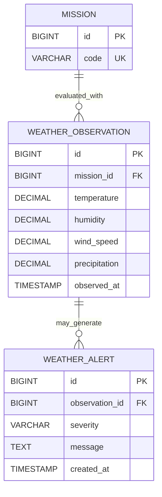
```mermaid
erDiagram
    MISSION ||--o{ WEATHER_OBSERVATION : evaluated_with
    WEATHER_OBSERVATION ||--o{ WEATHER_ALERT : may_generate
    MISSION {
        BIGINT id PK
        VARCHAR code UK
    }
    WEATHER_OBSERVATION {
        BIGINT id PK
        BIGINT mission_id FK
        DECIMAL temperature
        DECIMAL humidity
        DECIMAL wind_speed
        DECIMAL precipitation
        TIMESTAMP observed_at
    }
    WEATHER_ALERT {
        BIGINT id PK
        BIGINT observation_id FK
        VARCHAR severity
        TEXT message
        TIMESTAMP created_at
    }
```

**Restricciones principales:** `WEATHER_OBSERVATION.mission_id` y `WEATHER_ALERT.observation_id` son FK; los valores meteorológicos deben validarse según la fuente; cada observación conserva su fecha y hora.

### 4.8.1.4. Analytics & Reporting

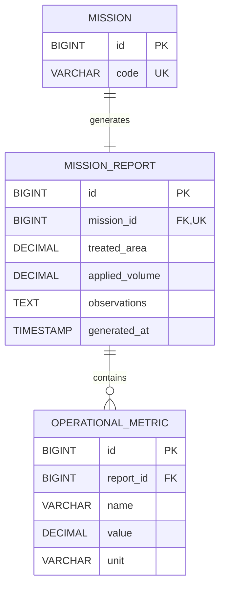
```mermaid
erDiagram
    MISSION ||--|| MISSION_REPORT : generates
    MISSION_REPORT ||--o{ OPERATIONAL_METRIC : contains
    MISSION {
        BIGINT id PK
        VARCHAR code UK
    }
    MISSION_REPORT {
        BIGINT id PK
        BIGINT mission_id FK,UK
        DECIMAL treated_area
        DECIMAL applied_volume
        TEXT observations
        TIMESTAMP generated_at
    }
    OPERATIONAL_METRIC {
        BIGINT id PK
        BIGINT report_id FK
        VARCHAR name
        DECIMAL value
        VARCHAR unit
    }
```

**Restricciones principales:** `MISSION_REPORT.mission_id` es FK y UNIQUE para mantener una relación uno a uno con la misión; `OPERATIONAL_METRIC.report_id` referencia `MISSION_REPORT.id`; `treated_area` y `applied_volume` no pueden ser negativos.

## 4.8.1.5. Vista integrada de persistencia

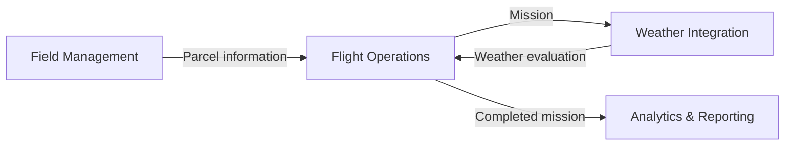
```mermaid
flowchart LR
    FM["Field Management"]
    FO["Flight Operations"]
    WI["Weather Integration"]
    AR["Analytics & Reporting"]
    FM -->|"Parcel information"| FO
    FO -->|"Mission"| WI
    WI -->|"Weather evaluation"| FO
    FO -->|"Completed mission"| AR
```

La separación por Bounded Context conserva responsabilidades claras, mientras que las relaciones entre contextos permiten soportar el flujo principal del negocio.

# Capítulo V: Product Implementation, Validation & Deployment

## 5.1. Software Configuration Management

Para tener consistencia y seguimiento del desarrollo de la plataforma, se definió un conjunto de herramientas y estrategias de trabajo. Esta sección cubre la configuración del entorno de desarrollo, la gestión del código fuente y el despliegue, alineados con las buenas prácticas de ingeniería de software y con los marcos de trabajo ágiles.

### 5.1.1. Software Development Environment Configuration

Con el fin de facilitar la colaboración del equipo en las distintas etapas del ciclo de vida de AgriDron Solutions, se configuró un entorno de desarrollo unificado. Este entorno incluye herramientas estandarizadas para gestión de proyectos, diseño UX/UI, modelado de dominio, codificación, documentación y simulación de APIs, despliegue y control de versiones. La selección responde a criterios de integración con tecnologías open-source (Vue 3 y C# con .NET), soporte para datos geoespaciales y climáticos, y cumplimiento de estándares de la industria.

| Categoría | Herramienta | Propósito | Tipo de acceso / Enlace |
|:--|:--|:--|:--|
| **Project Management** | Jira / Trello | Gestión del backlog, trazabilidad de historias de usuario, y tablero de tareas de cada Sprint bajo Scrum. | [Jira](https://agridron.atlassian.net/jira/software/projects/SCRUM/boards/1/backlog) / [Trello](https://trello.com/invite/b/6aac1a270d8f45bc33ecd592/ATTIbc784176eb8dc497a26da32a3c554ea69211FF0D/agridron) |
| **Requirements Management** | UXPressia | Elaboración de User Personas, Journey Maps, Empathy Maps e Impact Mapping. | [UXPressia](https://uxpressia.com) |
| **Product UX/UI Design** | Figma | Wireframes, wireflows, mock-ups de alta fidelidad y prototipos interactivos. | [Figma](https://www.figma.com) |
| **Modelado de Software** | Structurizr / Miro | Diagramas de arquitectura (C4 Model) y sesiones de EventStorming. | [Structurizr](https://structurizr.com) / [Miro](https://miro.com) |
| **Frontend Development** | WebStorm | Desarrollo de la Web Application en Vue 3 (HTML5, CSS3 y JavaScript). | [WebStorm](https://www.jetbrains.com/webstorm/) |
| **Backend Development** | JetBrains Rider | Desarrollo del RESTful API en C# (.NET) siguiendo Domain-Driven Design. | [JetBrains Rider](https://www.jetbrains.com/rider/) |
| **API Mocking & Documentation** | Apidog | Simulación de endpoints (mock API) y documentación con OpenAPI. | [Apidog](https://apidog.com) |
| **Deployment** | GitHub Pages / Firebase Hosting | Publicación de la Landing Page y de la Web Application. | [GitHub Pages](https://pages.github.com) / [Firebase](https://firebase.google.com/products/hosting) |
| **Version Control** | GitHub | Alojamiento de repositorios y control de versiones mediante GitFlow y Conventional Commits. | [GitHub](https://github.com) |
| **Software Documentation** | Markdown | Redacción del informe del proyecto en formato Docs-as-Code. | Compatible con GitHub |

### 5.1.2. Source Code Management

#### 5.1.2.1. Plataforma y repositorios

El control de versiones del proyecto se realiza en GitHub, dentro de la organización pública AgriDon. Los repositorios son los siguientes:

<div align="center">

| Producto digital | URL del repositorio |
|:--|:--|
| Project Report | https://github.com/AgriDon/AgriDron-report |
| Landing Page | https://github.com/AgriDon/Agridron-LandingPage |
| Frontend Web Application | https://github.com/AgriDon/Agridron-Fronted |
| API simulado (mock) | https://github.com/AgriDon/agridron-mock-api |
| Web Services (Backend API) | https://github.com/AgriDon/Agridron-backend |

</div>

**Modelo de ramificación (GitFlow Workflow)**

Se adopta GitFlow para mantener una separación clara entre el código en desarrollo, las entregas parciales y las versiones estables:

- `main`: contiene el código estable, que es el que se publica.
- `develop`: rama de integración del trabajo en progreso.
- `feature/*`: ramas para cada funcionalidad o bounded context.
  - Convención: `feature/<nombre-descriptivo>`
  - Ejemplos: `feature/fieldManagement`, `feature/reportingContext`, `feature/dashboard-and-settings`
- `release/*`: estabilización y preparación de versiones.
  - Convención: `release/X.Y.Z`
  - Ejemplo: `release/1.0.0`
- `hotfix/*`: correcciones urgentes aplicadas sobre `main`.
  - Convención: `hotfix/X.Y.Z`
  - Ejemplo: `hotfix/1.0.1`

**Versionado semántico**

Las versiones siguen la nomenclatura MAJOR.MINOR.PATCH (Semantic Versioning 2.0.0):

- **MAJOR:** cambios incompatibles en el API o reestructuraciones profundas.
- **MINOR:** nuevas funcionalidades retrocompatibles.
- **PATCH:** correcciones de errores retrocompatibles.
- **Ejemplos:** v1.0.0 (primera versión de la Landing Page), v1.1.0 (primera versión de la Web Application), v1.1.1 (corrección en el visor de mapa).

**Convenciones para commits**

Los mensajes de commit siguen la estructura de Conventional Commits `<type>[optional scope]: <description>`:

- **feat:** nueva funcionalidad.
- **fix:** corrección de un error.
- **docs:** cambios solo en la documentación.
- **style:** formato de código sin cambios de lógica.
- **refactor:** cambios de código que no corrigen errores ni agregan funcionalidades.
- **test:** incorporación o ajuste de pruebas.
- **chore:** tareas de compilación, configuración o dependencias.

Ejemplos de commits del proyecto:

```
feat(reporting): implement analytics and reporting bounded context
fix(flightOperations): resolve i18n translation keys and status badge styles in missions
docs(api): add OpenAPI specification for mock endpoints
```

### 5.1.3. Source Code Style Guide & Conventions

Para velar por la legibilidad, mantenibilidad y calidad del código, el equipo adopta guías de estilo oficiales. Todos los identificadores, variables, nombres de métodos y comentarios del código se redactan en inglés.

**Backend: C# con .NET**

Para el RESTful API se toma como base la guía C# Coding Conventions y las Microsoft ASP.NET Core Coding Guidelines, con una estructura de capas basada en Domain-Driven Design:

- **Estructura de capas:**
  - **Domain:** entidades, agregados, value objects y contratos de repositorios.
  - **Application:** casos de uso, servicios de aplicación, handlers de comandos y consultas, y DTOs.
  - **Infrastructure:** implementación de repositorios (Entity Framework Core), persistencia y clientes HTTP para servicios externos (clima).
  - **API:** controladores RESTful (`[ApiController]`), middlewares de manejo de excepciones y documentación OpenAPI con Swagger.
- **Nomenclatura:**
  - Clases, interfaces, enumeraciones y métodos en PascalCase: `FarmService`, `IParcelRepository`, `MissionStatus`, `CalculateTreatedArea()`.
  - Parámetros y variables locales en camelCase: `plotCoordinates`, `droneId`.
  - Interfaces con prefijo `I`. Constantes en PascalCase.
- **Documentación y anotaciones:**
  - Comentarios XML (`/// <summary>`) en métodos y endpoints públicos.
  - Controladores con atributos de enrutamiento y validaciones (`[HttpGet]`, `[HttpPost]`, `[FromBody]`, `[Required]`).

**Frontend: Vue 3 (JavaScript, HTML5 y CSS3)**

La Web Application y la Landing Page siguen la Vue Style Guide, la Google JavaScript Style Guide, las MDN JavaScript guidelines y la Google HTML/CSS Style Guide:

- **Estructura modular:**
  - Código organizado por bounded contexts (`fieldManagement`, `flightOperations`, `weatherIntegration`, `reporting`) y una capa `shared` para componentes y vistas comunes.
  - Single File Components (`.vue`) que agrupan `<template>`, `<script>` y `<style scoped>`.
- **Nomenclatura:**
  - Archivos de componentes y vistas en kebab-case: `farm-management-view.vue`, `map-polygon-editor.vue`.
  - Nombres de componentes en PascalCase: `FarmManagementView`, `MapPolygonEditor`.
  - Variables, funciones y props en camelCase: `selectedParcelId`, `fetchWeatherForecast()`.
- **HTML y accesibilidad:**
  - Elementos semánticos de HTML5 (`<main>`, `<header>`, `<section>`, `<article>`, `<nav>`).
  - Atributos `alt` en imágenes y atributos `aria-*` para accesibilidad.
- **CSS con nomenclatura BEM (Block Element Modifier):**
  - Clases en kebab-case para evitar colisiones de estilos:
    - Bloque: `.mission-card`
    - Elemento: `.mission-card__status-badge`
    - Modificador: `.mission-card__status-badge--in-progress`
  - Estilos encapsulados con `<style scoped>` en cada componente Vue.

### 5.1.4. Software Deployment Configuration

La configuración de despliegue de AgriDron Solutions establece los procesos, herramientas y entornos para publicar los productos digitales: Landing Page, Web Application y Web Services.

**Despliegue de la Landing Page**

- Tecnología: HTML5, CSS3 y JavaScript, con diseño responsive.
- Repositorio: https://github.com/AgriDon/Agridron-LandingPage
- Plataforma: GitHub Pages.
- Procedimiento:
  - La rama `main` es la fuente de publicación, tomando el directorio raíz (`/`).
  - Los cambios aprobados en `develop` se integran a `main` mediante Pull Requests revisados por el equipo.
  - GitHub Pages actualiza el sitio tras cada integración en `main`.
- URL: https://agridon.github.io/Agridron-LandingPage/

**Despliegue de la Web Application**

- Tecnología: Vue 3 con Vite (JavaScript, HTML5 y CSS3).
- Repositorio: https://github.com/AgriDon/Agridron-Fronted
- Plataforma: Firebase Hosting.
- Procedimiento:
  - Se genera el build de producción con `npm run build`, que produce los archivos estáticos en la carpeta `dist`.
  - Se publica con Firebase CLI mediante `firebase deploy --only hosting`.
  - Firebase Hosting se configura como single-page app, de modo que todas las rutas se redirijan a `index.html`.
  - Las variables de entorno del cliente (como la URL base del API) se definen en archivos `.env`.
  - La automatización del despliegue con GitHub Actions está planificada para los siguientes Sprints.
- URL: https://agridronapp.web.app

**API simulado (mock)**

- Herramienta: Apidog (servicio de mock).
- Repositorio: https://github.com/AgriDon/agridron-mock-api
- La especificación OpenAPI se versiona en el repositorio y la Web Application consume la URL del mock mientras el RESTful API se implementa.

**Despliegue del Backend (Web Services)** *(planificado)*

- Tecnología: C# con .NET (RESTful API).
- Repositorio: https://github.com/AgriDon/Agridron-backend
- Plataforma prevista: Render.
- Las variables sensibles (cadenas de conexión, claves JWT y credenciales del servicio de clima) se gestionarán en la configuración de la plataforma, y el servicio expondrá una URL con HTTPS y CORS restringido a la Web Application.

**Consideraciones generales**

- **Separación de entornos:** los entornos de desarrollo y producción se mantienen aislados mediante archivos de configuración (`appsettings.Development.json` y `appsettings.Production.json` en el backend, y archivos `.env` en el frontend).
- **Pruebas de humo:** después de cada despliegue se verifica manualmente la carga de la aplicación, la navegación entre vistas y el consumo de los endpoints.

## 5.2. Landing Page, Services & Applications Implementation


*Figura: Team Members de la Landing Page con información sobre el equipo de trabajo.*


*Figura: Footer de la Landing Page con información de contacto y redes sociales.*

**Aquí está el enlace a la página desplegada:** https://agridon.github.io/Agridron-LandingPage/

**Enlace del video de ejecucion en youtube:**  https://youtu.be/R6O4g6COh6o

#### 5.2.1.6. Services Documentation Evidence for Sprint Review

Como la Landing Page es una página estática, no fue necesario durante el Sprint el uso de
servicios externos ni conexiones a API's, por lo cual no hay generación ni evidencia de documentación técnica relacionada.

#### 5.2.1.7. Software Deployment Evidence for Sprint Review

La evidencia del despliegue de la Landing Page durante el Sprint se mostrará a continuación, el despliegue se realizará en GitHub Pages.

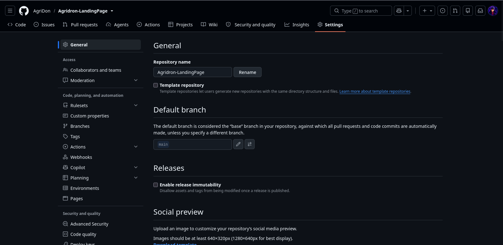

*Nos dirigimos a la seccion de deploy, y selecionamos la rama main:*
*Luego de unos minutos, el deploy se realizara correctamente:*

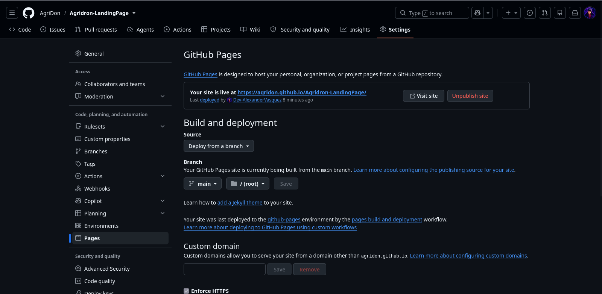

#### 5.2.1.8. Team Collaboration Insights during Sprint

Se anexa evidencia de la participación activa del equipo en el desarrollo de la Landing Page.
Durante el Sprint 1, el equipo utilizó una metodología colaborativa mediante Pull Requests y
revisiones de código, asegurando que cada sección cumpliera con los estándares de calidad definidos.
El gráfico de contribuciones muestra una distribución equitativa de tareas entre maquetación, estilos, lógica de i18n y despliegue.

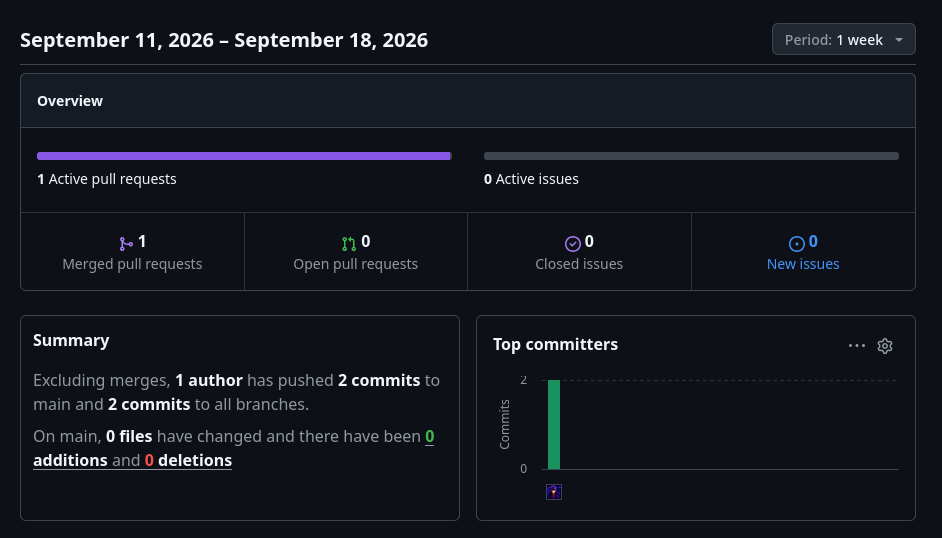

*Reporte de contribuciones y commits del equipo Agridron en el repositorio de la Landing Page*

### 5.2.2. Sprint 2

#### 5.2.2.1. Sprint Planning 2

En el Sprint 2, el equipo se enfocó en el diseño, desarrollo y despliegue de la primera versión de la Web Application de AgriDron Solutions, desarrollada con Vue y PrimeVue bajo el lenguaje de diseño Material Design, y en la actualización de la Landing Page para que sus llamadas a la acción (CTA) redirijan a la vista correspondiente de la Web Application según el segmento.

| Campo | Detalle |
|:--|:--|
| **Sprint #** | Sprint 2 |
| **Fecha** | 26/09/2026 – 09/10/2026 |
| **Hora** | 16:00 hrs |
| **Lugar** | Virtual (Discord / Microsoft Teams) |
| **Preparado por** | Damacen Galindo, Italo Gianfranco; Vasquez Roncal, Alexander Felipe |
| **Asistentes** | Damacen Galindo, Italo Gianfranco; Nicho Huillcañahui, Edwin Noe; Vasquez Roncal, Alexander Felipe; Choquehuanca Vasquez, Alejandro Samir; Jara Espinoza, Miguel Angel |
| **Sprint 1 Review Summary** | La Landing Page quedó desplegada en GitHub Pages con las secciones planificadas (hero, características, planes y precios, preguntas frecuentes, navegación, equipo, galería, métricas de impacto y footer), diseño responsive, soporte multiidioma (ES/EN) y configuración de SEO y accesibilidad. [COMPLETAR: feedback del docente recibido en AV1] |
| **Sprint 1 Retrospective Summary** | Aciertos: uso de ramas feature y Pull Requests hacia `develop` y `main`, y reparto de aspectos entre líderes y colaboradores. Oportunidades de mejora: aplicar Conventional Commits de forma consistente en todos los mensajes y mejorar la estimación de tareas. |
| **Sprint 2 Goal** | Nuestro enfoque está en que agricultores y operadores técnicos puedan acceder a la Web Application desde la Landing Page, gestionar sus fincas y parcelas, y dar seguimiento a las misiones de fumigación, la flota de drones y los reportes. Creemos que esto genera confianza y reduce la coordinación informal por WhatsApp o llamadas. Se confirmará cuando un usuario de prueba pueda recorrer, sin ayuda del equipo, la Landing Page y la Web Application desplegada. |
| **Sprint 2 Velocity** | Límite de 35 SP \| Sumatoria de Story Points: 30 SP |

---

#### 5.2.2.2. Aspect Leaders and Collaborators

Para el Sprint 2 se definieron aspectos asociados a la Web Application y a la actualización de la Landing Page. Cada aspecto tiene un líder (L) responsable de su calidad y colaboradores (C) que apoyan su ejecución. Esta distribución se relaciona con la asignación de tareas del Sprint Backlog 2.

| Team Member | GitHub Username | Authentication & Routing | Field Management (Map) | Mission Request & Weather | Landing Page Update & CTAs | i18n & Accessibility | Deployment |
|:--|:--|:-:|:-:|:-:|:-:|:-:|:-:|
| **Damacen Galindo, Italo Gianfranco** | italodamacen | L | C | C | C | - | C |
| **Nicho Huillcañahui, Edwin Noe** | edwinnicho | C | L | C | - | C | L |
| **Jara Espinoza, Miguel Angel** | MiguelJara | C | C | L | C | C | C |
| **Choquehuanca Vasquez, Alejandro Samir** | SamirChoquehuanca | C | C | C | C | L | - |
| **Vasquez Roncal, Alexander Felipe** | alexandervasquez | - | C | C | L | C | C |

---
#### 5.2.2.3. Sprint Backlog 2

El Sprint Backlog 2 descompone las historias de usuario seleccionadas en tareas técnicas estimadas en horas.
El objetivo principal del sprint es entregar la primera versión desplegada de la Web Application, integrada con la Landing Page.

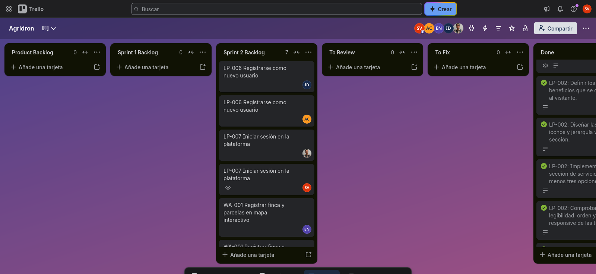

*Figura: Board del Sprint 2 en Trello.*

**URL público del board:** https://trello.com/invite/b/6aac1a270d8f45bc33ecd592/ATTIbc784176eb8dc497a26da32a3c554ea69211FF0D/agridron


| Sprint # | Sprint 2 |
|:--|:--|

| Story Id | Story Title | Task Id | Task Title | Task Description | Estimation (Hours) | Assigned To | Status (To-do / InProcess / ToReview / Done) |
|:--|:--|:--|:--|:--|:-:|:--|:--|
| LP-006 | Registrarse como nuevo usuario | T01 | Crear vista de registro | Construir el formulario de registro con PrimeVue y validaciones de campos. | [6] | [ ] | [Done] |
| LP-006 | Registrarse como nuevo usuario | T02 | Conectar registro con el servicio de autenticación | Enviar los datos del formulario al servicio [local/mock/API] y manejar respuestas de éxito y error. | [5] | [ ] | [Done] |
| LP-007 | Iniciar sesión en la plataforma | T03 | Crear vista de inicio de sesión | Construir el formulario de acceso con mensajes de error accesibles. | [4] | [ ] | [Done] |
| LP-007 | Iniciar sesión en la plataforma | T04 | Configurar rutas protegidas por rol | Configurar Vue Router con guardas de navegación para agricultor, operador y supervisor. | [5] | [ ] | [Done] |
| WA-001 | Registrar finca y parcelas en mapa interactivo | T05 | Integrar biblioteca de mapas | Incorporar la biblioteca de mapas ([Leaflet / otra]) con capa satelital. | [6] | [ ] | [Done] |
| WA-001 | Registrar finca y parcelas en mapa interactivo | T06 | Implementar dibujo de polígonos de parcelas | Permitir delimitar parcelas sobre el mapa y calcular el área en hectáreas. | [10] | [ ] | [Done] |
| WA-001 | Registrar finca y parcelas en mapa interactivo | T07 | Crear formulario y listado de fincas | Registrar nombre, ubicación y cultivo, y listar las fincas del usuario. | [6] | [ ] | [Done] |
| WA-002 | Solicitar misión con validación de riesgos | T08 | Crear formulario de solicitud de misión | Seleccionar parcela, cultivo y fecha para solicitar el servicio. | [6] | [ ] | [Done] |
| WA-002 | Solicitar misión con validación de riesgos | T09 | Mostrar validación de riesgo climático | Presentar la condición del clima antes de confirmar la solicitud. | [4] | [ ] | [Done] |
| TU-003 | Integración con Weather API | T10 | Consumir servicio externo de clima | Implementar el cliente del servicio externo ([nombre de la API]) y manejar errores de conexión. | [6] | [ ] | [Done] |
| WA-003 | Consultar historial y estados | T11 | Crear vista de historial de misiones | Listar misiones con su estado y filtros básicos. | [5] | [ ] | [Done] |
| WA-005 | Gestionar agenda de órdenes | T12 | Crear vista de agenda del operador | Mostrar las órdenes asignadas en calendario junto con la parcela. | [6] | [ ] | [Done] |
| — | Tarea general (Landing Page) | T13 | Actualizar CTAs por segmento | Redirigir cada CTA de la Landing Page a la vista correspondiente de la Web Application. | [4] | [ ] | [Done] |
| — | Tarea general (i18n y a11y) | T14 | Implementar i18n y atributos ARIA en la Web Application | Soportar inglés (en_US, por defecto) y español latinoamericano (es_419), y configurar ARIA. | [8] | [ ] | [Done] |
| — | Tarea general (Despliegue) | T15 | Desplegar la Web Application | Configurar el despliegue desde el repositorio y publicar la primera versión. | [5] | [ ] | [Done] |
 
---

#### 5.2.2.4. Development Evidence for Sprint Review

Durante el Sprint 2 el equipo avanzó en la implementación de la Web Application y en la actualización de la Landing Page de AgriDron Solutions. En la Web Application (Vue 3 con Vite) se estructuró el proyecto, se implementaron los bounded contexts Field Management, Weather Integration, Flight Operations y Analytics & Reporting, y se construyeron las vistas del dashboard y de configuración alineadas con los mock-ups. En paralelo se refactorizó la organización del código para seguir las convenciones de Domain-Driven Design. En la Landing Page se mejoró el diseño responsive y se incorporó el selector de idioma (i18n).

El trabajo se organizó con GitFlow: cada bounded context o funcionalidad se desarrolló en su rama `feature/*` y se integró en `develop` mediante Pull Requests o merges. Las tablas siguientes listan los commits del Sprint 2 por repositorio.

##### Repositorio: Web Application

| Repository | Branch | Commit Id | Commit Message | Commit Message Body | Commited on (Date) |
|:--|:--|:--|:--|:--|:-:|
| AgriDon/Agridron-Fronted | develop | f426ac7 | initialize project structure with Vue 3, Vite, and basic layout components | Inicialización del proyecto con Vue 3 y Vite, y componentes base del layout. | 03/10/2026 |
| AgriDon/Agridron-Fronted | develop | eea89a3 | refactor: remove TypeScript support and update script setup in Vue components | Se elimina TypeScript y se actualiza el uso de script setup en los componentes Vue para trabajar con JavaScript. | 03/10/2026 |
| AgriDon/Agridron-Fronted | feature/fieldManagement | 914f310 | docs: resolver conflicto en README.md al fusionar develop | Resolución del conflicto en el README al integrar develop en la rama de la funcionalidad. | 06/10/2026 |
| AgriDon/Agridron-Fronted | feature/fieldManagement | e6070f3 | bounded contex 2 field management | Implementación del bounded context Field Management (fincas y parcelas). | 06/10/2026 |
| AgriDon/Agridron-Fronted | develop | 9faa7f4 | Merge pull request #1 from AgriDon/feature/fieldManagement | Integración de Field Management en develop mediante Pull Request #1. | 06/10/2026 |
| AgriDon/Agridron-Fronted | feature/weatherIntegration | 1dde398 | feat(weatherIntegration): migrate weatherIntegration bounded context from Angular to Vue | Migración del bounded context Weather Integration a Vue. | 07/10/2026 |
| AgriDon/Agridron-Fronted | feature/flightOperations | 401c3b2 | add: flightOpe | Primera versión del bounded context Flight Operations. | 07/10/2026 |
| AgriDon/Agridron-Fronted | feature/flightOperations | 2fea35d | add: comments | Comentarios de documentación en el código de Flight Operations. | 07/10/2026 |
| AgriDon/Agridron-Fronted | feature/fieldManagement | 4a18e03 | Merge remote-tracking branch 'origin/feature/flightOperations' into feature/fieldManagement | Integración de Flight Operations en la rama de Field Management. | 07/10/2026 |
| AgriDon/Agridron-Fronted | feature/fieldManagement | 18f17f6 | se agregaron bounded contex feature/weatherIntegration and feature/flightOperations | Se incorporan los bounded contexts Weather Integration y Flight Operations a la rama de Field Management. | 07/10/2026 |
| AgriDon/Agridron-Fronted | develop | e989dff | Merge pull request #2 from AgriDon/feature/fieldManagement | Integración de los tres bounded contexts en develop mediante Pull Request #2. | 07/10/2026 |
| AgriDon/Agridron-Fronted | develop | e0f9ad0 | feat(db): add new crop treatment entry and update server script | Nuevo registro de tratamiento de cultivo en los datos de prueba y actualización del script del servidor. | 08/10/2026 |
| AgriDon/Agridron-Fronted | develop | 6145836 | fix(flightOperations): resolve i18n translation keys and status badge styles in missions | Corrección de claves de traducción y estilos de las etiquetas de estado en misiones. | 08/10/2026 |
| AgriDon/Agridron-Fronted | develop | 11208cd | refactor(architecture): align fieldManagement, flightOperations, and weather integration with DDD principles | Reorganización de los tres bounded contexts según las convenciones de DDD. | 08/10/2026 |
| AgriDon/Agridron-Fronted | develop | aa3efae | fix(primevue): bypass license verification and suppress invalid license watermark | [Completar con el detalle real del cambio.] | 08/10/2026 |
| AgriDon/Agridron-Fronted | feature/reportingContext | f91dea6 | feat(reporting): implement analytics and reporting bounded context (BC5) | Implementación del bounded context Analytics & Reporting. | 08/10/2026 |
| AgriDon/Agridron-Fronted | develop | 9235c48 | Merge branch 'feature/reportingContext' into develop | Integración de Analytics & Reporting en develop. | 08/10/2026 |
| AgriDon/Agridron-Fronted | develop | 3c8b7dc | feat(flightOperations): integrate drone fleet management from FlightOperations branch | Integración de la gestión de la flota de drones en Flight Operations. | 09/10/2026 |
| AgriDon/Agridron-Fronted | develop | f007a56 | refactor(flightOperations): align architecture with DDD conventions | Reorganización de Flight Operations según las convenciones de DDD. | 09/10/2026 |
| AgriDon/Agridron-Fronted | feature/dashboard-and-settings | be3e9fb | refactor(shared): move layout component to shared presentation layer | El componente de layout pasa a la capa de presentación compartida. | 09/10/2026 |
| AgriDon/Agridron-Fronted | feature/dashboard-and-settings | ea80eb2 | feat(shared): implement dashboard home and settings views matching mockups | Vistas de inicio (dashboard) y configuración según los mock-ups del capítulo IV. | 09/10/2026 |
| AgriDon/Agridron-Fronted | feature/dashboard-and-settings | b5a66f0 | fix(ui): improve home KPI image reliability and synchronize user profile with layout header | Mejora de la carga de imágenes de los KPI y sincronización del perfil de usuario con la cabecera del layout. | 09/10/2026 |
| AgriDon/Agridron-Fronted | develop | 8430748 | Merge branch 'feature/dashboard-and-settings' into develop | Integración del dashboard y configuración en develop. | 09/10/2026 |

##### Repositorio: Landing Page

| Repository | Branch | Commit Id | Commit Message | Commit Message Body | Commited on (Date) |
|:--|:--|:--|:--|:--|:-:|
| AgriDon/Agridron-LandingPage | develop | f9a0fe6 | add: Improvements to responsive desing | Mejoras del diseño responsive para dispositivos móviles y de escritorio. | 07/10/2026 |
| AgriDon/Agridron-LandingPage | main | 4ec863a | Merge pull request #2 from AgriDon/develop | Publicación de las mejoras responsive mediante Pull Request #2. | 07/10/2026 |
| AgriDon/Agridron-LandingPage | develop | b5d4852 | add: translator | Selector de idioma para la internacionalización (inglés y español). | 07/10/2026 |
| AgriDon/Agridron-LandingPage | main | a703f2a | Merge pull request #3 from AgriDon/develop | Publicación del selector de idioma mediante Pull Request #3. | 07/10/2026 |

*Nota: los commits del 18/09/2026 de ambos repositorios (Initial commit y primera versión de la Landing Page) pertenecen al Sprint 1 y se presentan en la sección 5.2.1.4.*
 
---

#### 5.2.2.5. Execution Evidence for Sprint Review

En el Sprint 2 se logró la primera versión funcional de la Web Application de AgriDron Solutions, desarrollada con Vue 3 y PrimeVue, junto con la actualización de la Landing Page. La Web Application integra los bounded contexts Field Management, Weather Integration, Flight Operations y Analytics & Reporting, además de un layout compartido con las vistas de inicio (dashboard) y configuración, construidas según los mock-ups definidos en el capítulo IV. La interfaz se adapta a distintos tamaños de pantalla y soporta cambio de idioma entre inglés y español.

Se utilizó un API simulado (mock) para validar los flujos de gestión de fincas y parcelas, misiones, flota de drones y analítica sin depender del RESTful API en desarrollo. A continuación se presentan las principales vistas implementadas durante el Sprint, junto con una explicación de lo que permite hacer cada una.

##### Landing Page

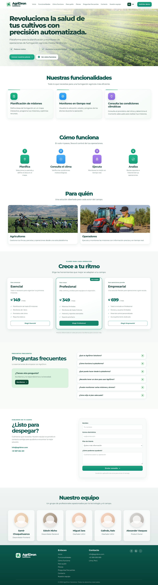

*Figura: Landing Page en su versión de escritorio.*


*Figura: Landing Page en su versión móvil.*

En este Sprint se mejoró el diseño de la Landing Page para que las secciones se reorganicen correctamente en pantallas pequeñas, manteniendo la legibilidad y el tamaño adecuado de los elementos interactivos.


*Figura: Selector de idioma (inglés / español) y botón de demostración en la Landing Page.*

Se incorporó el selector de idioma, que permite al visitante alternar entre inglés (idioma por defecto) y español latinoamericano, como parte del enfoque de internacionalización del producto. Además, un botón permite acceder a una demostración del sistema.

##### Web Application

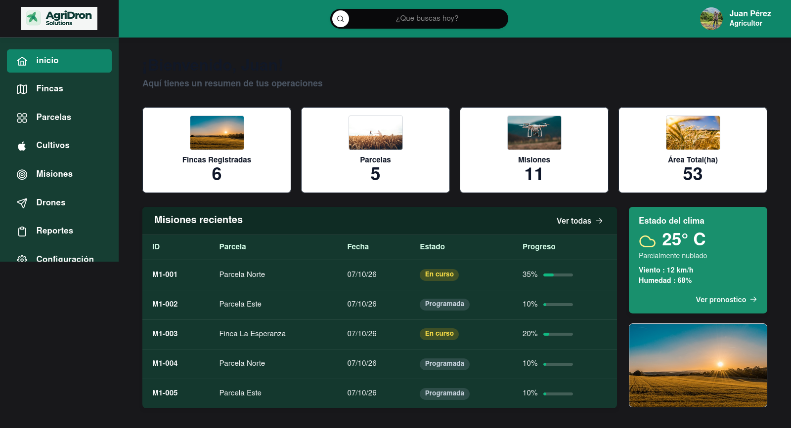

*Figura: Vista de inicio (dashboard) con indicadores clave (KPI).*

La vista de inicio presenta un resumen de la operación mediante indicadores clave (KPI), de modo que el usuario identifique rápidamente el estado general de sus fincas y misiones al ingresar. El perfil del usuario se muestra sincronizado con la cabecera del layout.

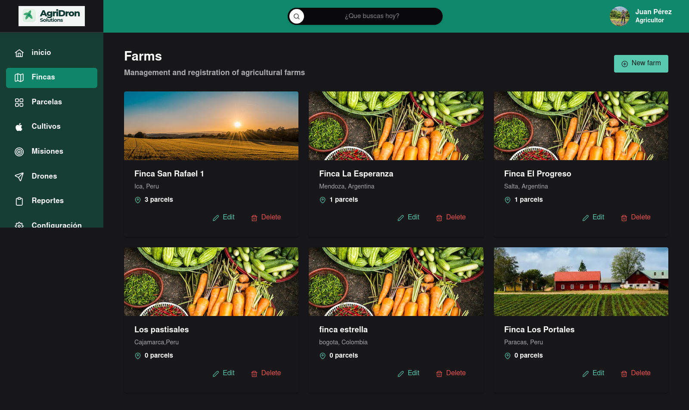

*Figura: Vista de gestión de fincas y parcelas (Field Management).*

Esta vista permite registrar y consultar las fincas y parcelas del agricultor, que son la base para solicitar misiones de fumigación.

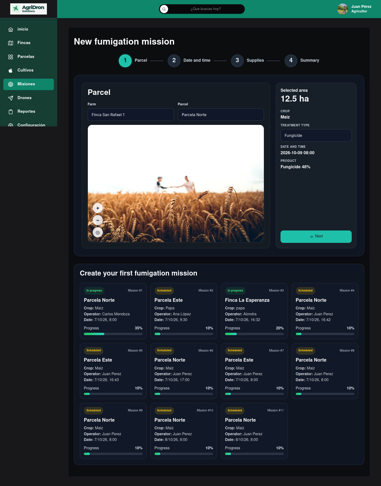

*Figura: Listado de misiones con etiquetas de estado (Flight Operations).*

El listado de misiones muestra cada misión con una etiqueta de estado, lo que facilita el seguimiento de las operaciones. Los textos de la vista se traducen según el idioma seleccionado.

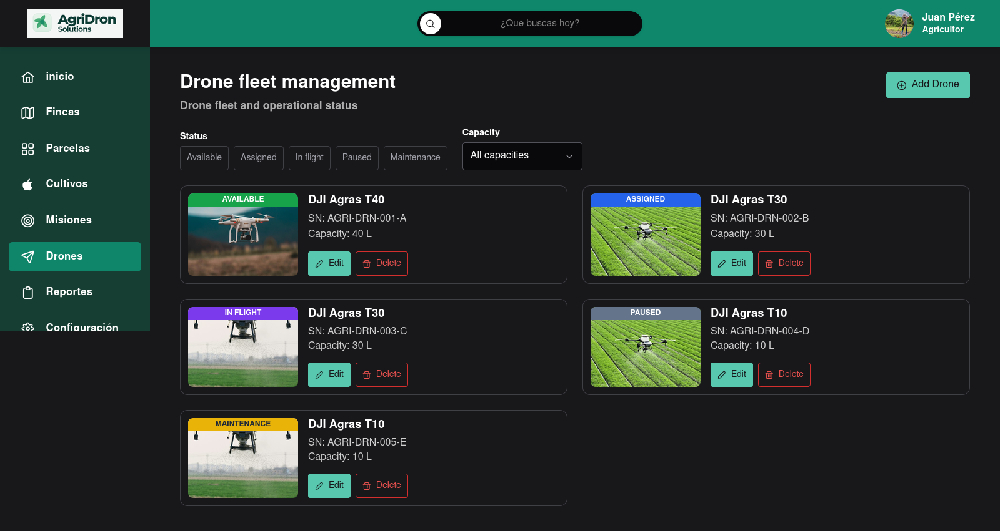

*Figura: Vista de gestión de la flota de drones.*

Esta vista permite consultar los drones disponibles y su estado, información que apoya la asignación de misiones a los operadores.

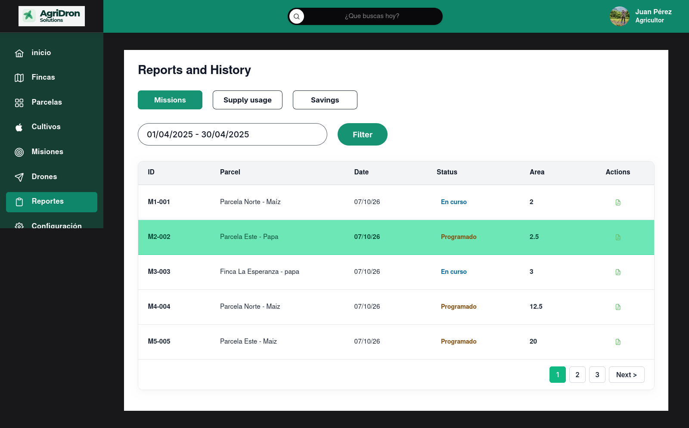

*Figura: Vista de analítica y reportes (Analytics & Reporting).*

La vista de analítica consolida información histórica de las operaciones y de los tratamientos aplicados, y apoya la toma de decisiones del agricultor y del supervisor.

##### Enlaces

**Web Application desplegada:** https://agridronapp.web.app

**Landing Page desplegada:** https://agridon.github.io/Agridron-LandingPage/

**Video de ejecución:** [COMPLETAR: URL del video (YouTube o Microsoft Stream) y duración]

---

    "location": "Cañete",
    "temperature": 24.5,
    "humidity": 68,
    "windSpeed": 12.3,
    "precipitation": 0,
    "observedAt": "2026-10-02T08:00:00",
    "alerts": []
}
]
```
 
`GET /drones` devuelve la flota de drones con su estado, nivel de batería y fechas de mantenimiento:
 
```json
[
  {
    "id": 1,
    "serialNumber": "AGRI-DRN-001-A",
    "model": "DJI Agras T40",
    "capacity": 40,
    "status": "AVAILABLE",
    "batteryLevel": 80,
    "nozzleId": 1,
    "lastMaintenanceDate": "2026-08-10",
    "nextMaintenanceDate": "2026-11-10"
  }
]
```

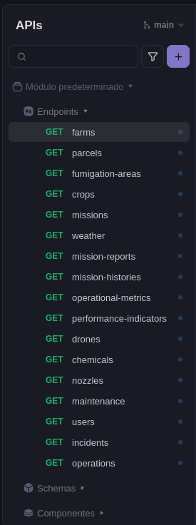

Figura: Lista de endpoints documentados en Apidog.

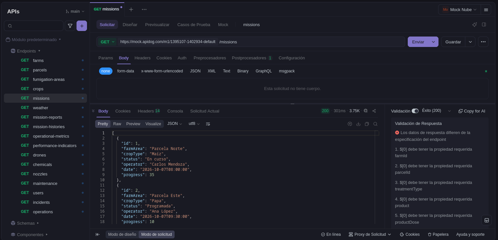

Figura: Prueba del endpoint GET /missions con datos de muestra en Apidog.

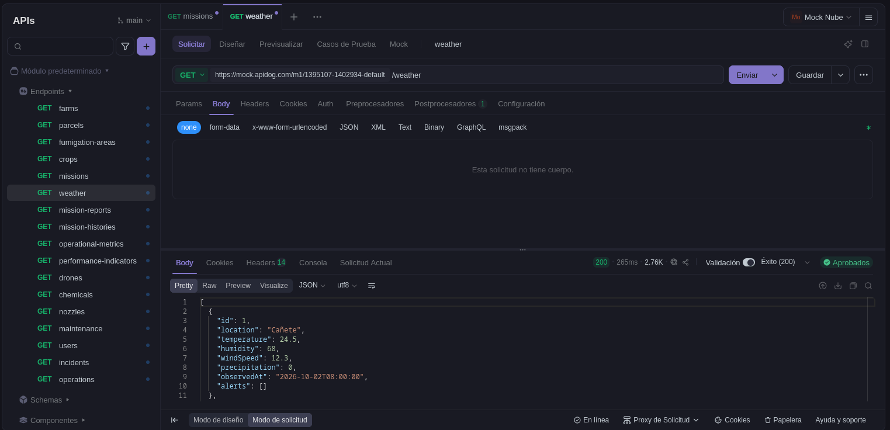

Figura: Prueba del endpoint GET /weather con datos de muestra en Apidog.

Repositorio de Web Services: https://github.com/AgriDon/agridron-mock-api/tree/develop

Commits relacionados con documentación: 5125fde

#### 5.2.2.7. Software Deployment Evidence for Sprint Review

Durante el Sprint 2 se realizaron actividades de despliegue para los tres productos de la solución. Se publicó la primera versión de la Web Application en Firebase Hosting, se volvió a desplegar la Landing Page con las mejoras de diseño responsive y el selector de idioma, y se dejó disponible el API simulado que consume la Web Application mientras el RESTful API en ASP.NET Core se encuentra en desarrollo.

| Producto | Plataforma | URL desplegada | Repositorio |
|:--|:--|:--|:--|
| Landing Page | GitHub Pages | https://agridon.github.io/Agridron-LandingPage/ | https://github.com/AgriDon/Agridron-LandingPage |
| Web Application | Firebase Hosting | https://agridronapp.web.app | https://github.com/AgriDon/Agridron-Fronted |
| API simulado (mock) | Apidog | https://mock.apidog.com/m1/1395107-1402934-default | https://github.com/AgriDon/agridron-mock-api |

##### Landing Page

La Landing Page se publica desde la rama `main` de su repositorio con GitHub Pages. En este Sprint, las mejoras de diseño responsive y el selector de idioma se integraron en `develop` y se publicaron mediante los Pull Requests #2 y #3 hacia `main` (07/10/2026), lo que activó un nuevo despliegue.

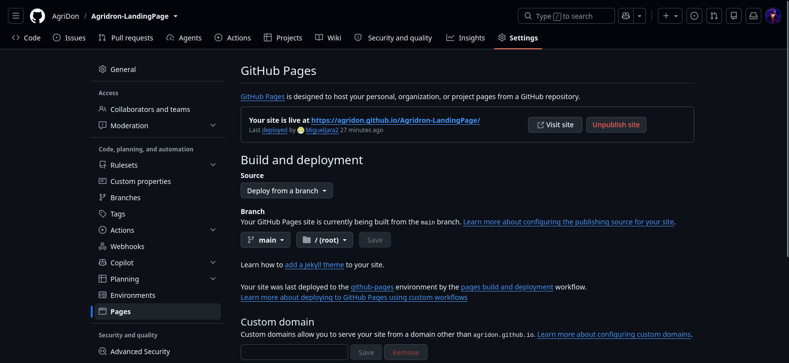

*Figura: Despliegue de la Landing Page en GitHub Pages.*

##### Web Application

La Web Application se desplegó en Firebase Hosting, que sirve la aplicación compilada de Vue como un sitio estático con HTTPS. Pasos realizados:

1. **Creación del proyecto en Firebase.** Desde la consola de Firebase se creó el proyecto AgridronApp y se habilitó el servicio Firebase Hosting.

   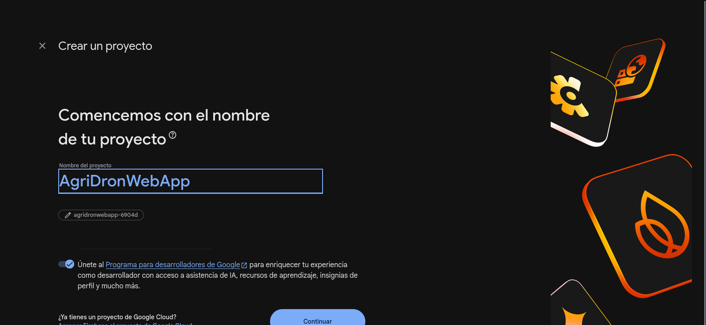

   *Figura: Creación del proyecto en la consola de Firebase.*

2. **Instalación de Firebase CLI e inicio de sesión.** Se instaló la herramienta con `npm install -g firebase-tools` y se inició sesión con `firebase login`.

   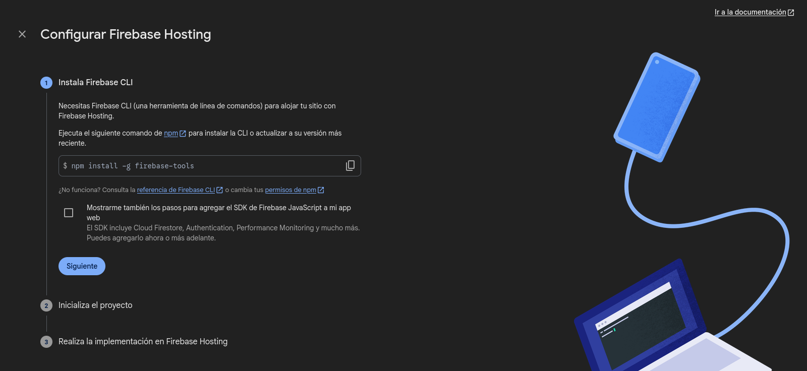

   *Figura: Instalación de Firebase CLI e inicio de sesión.*

3. **Inicialización de Hosting.** Dentro del repositorio `Agridron-Fronted` se ejecutó `firebase init hosting`. Se seleccionó el proyecto creado, se indicó `dist` como directorio público y se configuró la aplicación como single-page app, de modo que todas las rutas se redirijan a `index.html` y la navegación entre vistas funcione al recargar la página.

   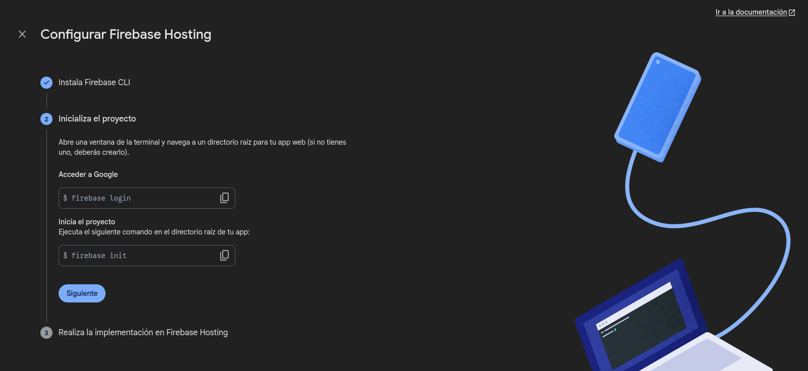

   *Figura: Inicialización de Firebase Hosting en el repositorio.*

4. **Build y despliegue.** Se generó el build de producción con `npm run build` y se publicó con `firebase deploy --only hosting`, que devolvió la URL de Hosting. Se verificó que la aplicación cargara en esa URL, incluyendo la navegación entre vistas.

   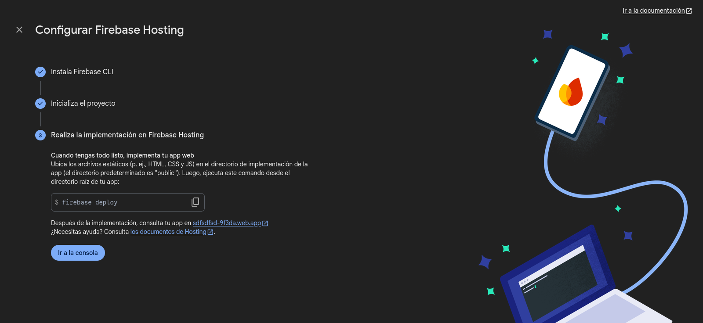

   *Figura: Despliegue completado y aplicación disponible en Firebase Hosting.*

##### API simulado

Los endpoints simulados se publican mediante el servicio de mock de Apidog, cuya URL base es https://mock.apidog.com/m1/1395107-1402934-default. La Web Application consume esa URL, y la especificación OpenAPI se versiona en el repositorio `agridron-mock-api`.

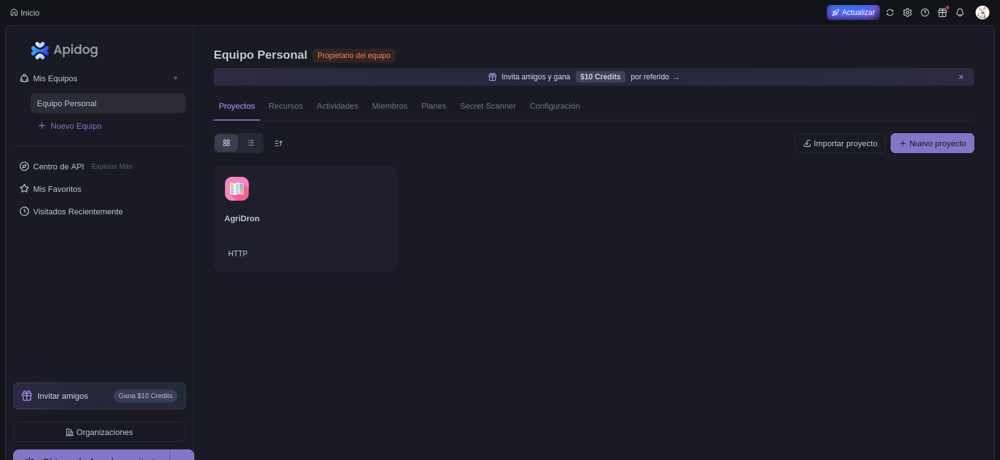

*Figura: Configuración del API simulado en Apidog.*

##### Integración con el flujo de trabajo

El despliegue de la Landing Page es automático: cada integración en `main` actualiza GitHub Pages. La Web Application se publica con Firebase CLI después de integrar los cambios en el repositorio; la automatización de este paso con GitHub Actions está planificada para los siguientes Sprints. [COMPLETAR: confirmar la rama desde la que se despliega la Web Application]

---

#### 5.2.2.8. Team Collaboration Insights during Sprint

Durante el Sprint 2, el equipo desarrolló las actividades de implementación en tres repositorios de la organización AgriDron en GitHub: la Web Application (`Agridron-Fronted`), la Landing Page (`Agridron-LandingPage`) y el API simulado (`agridron-mock-api`). El trabajo se organizó con GitFlow: cada bounded context o funcionalidad se desarrolló en una rama `feature/*` y se integró en `develop` mediante Pull Requests o merges, y las versiones estables de la Landing Page se publicaron desde `main`. Se adoptó Conventional Commits; algunos mensajes de este Sprint no siguen la convención, por lo que se reforzará su aplicación en el siguiente Sprint.

##### Contribución por integrante

| Integrante | Repositorio | Aporte principal en el Sprint 2 | Commits |
|:--|:--|:--|:-:|
| Damacen Galindo, Italo Gianfranco | https://github.com/AgriDon/Agridron-Fronted/tree/develop | bounded context Flight Operations | 937C310 |
| Nicho Huillcañahui, Edwin Noe | https://github.com/AgriDon/Agridron-LandingPage/tree/develop | despliegue en Firebase Hosting y configuración del proyecto | 977K250 |
| Jara Espinoza, Miguel Angel | https://github.com/AgriDon/agridron-mock-api/tree/develop | especificación OpenAPI y API simulado | 837A410 |
| Choquehuanca Vasquez, Alejandro Samir | https://github.com/AgriDon/Agridron-Fronted/tree/develop | internacionalización y accesibilidad | 867K750 |
| Vasquez Roncal, Alexander Felipe | https://github.com/AgriDon/Agridron-LandingPage/tree/develop | Landing Page responsive y vistas de dashboard | 356C250 |

##### Web Application

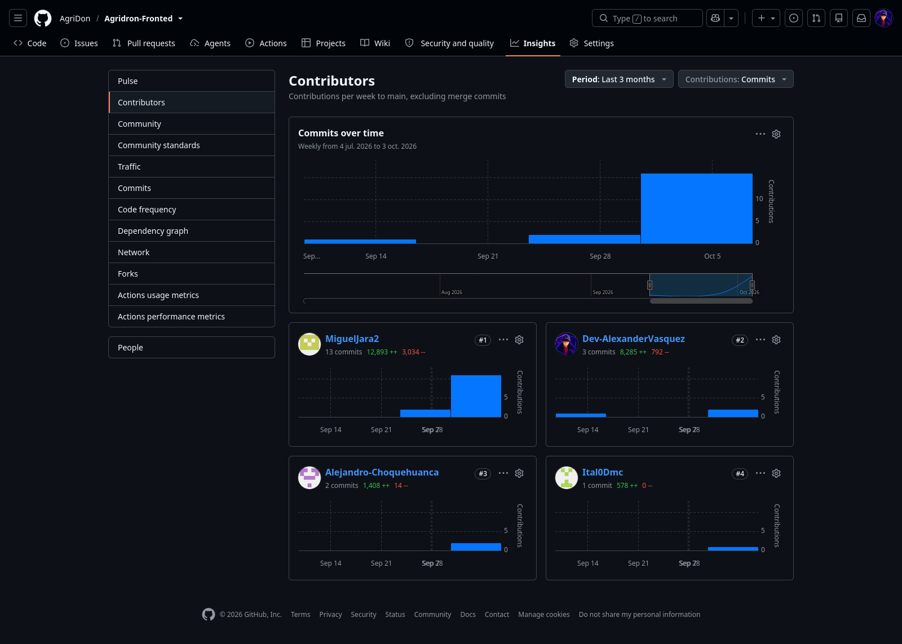

*Figura: Contribuciones de los integrantes en el repositorio de la Web Application durante el Sprint 2.*

##### Landing Page

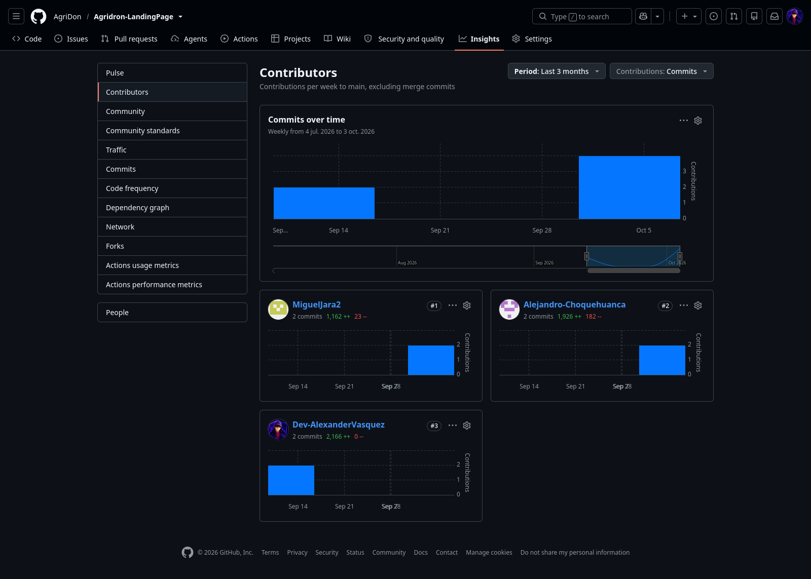

*Figura: Contribuciones de los integrantes en el repositorio de la Landing Page durante el Sprint 2.*

##### API simulado

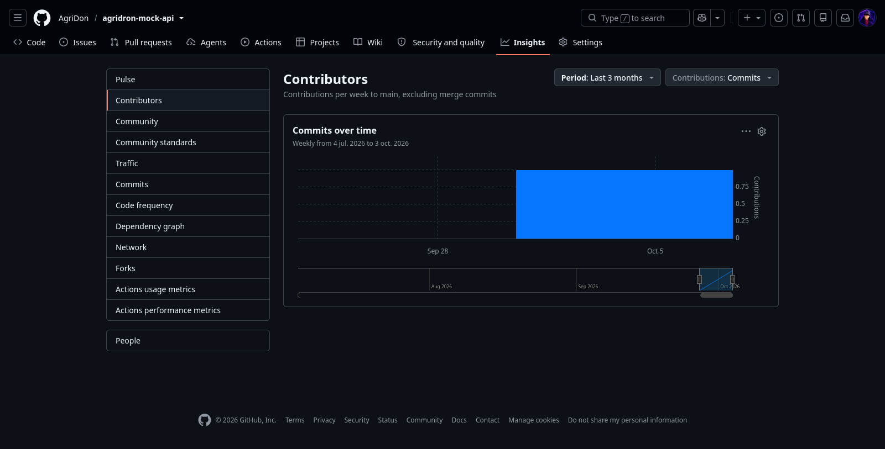

*Figura: Contribuciones de los integrantes en el repositorio del API simulado durante el Sprint 2.*

# Conclusiones

El proceso de desarrollo de AgriDron Solutions en esta primera entrega (AV1)
logró validar las hipótesis iniciales de adopción y comunicación mediante el
despliegue de una Landing Page pública y responsiva que conecta a Pequeños y
Medianos Agricultores (PyMAs) con Operadores Técnicos de drones de fumigación.

La plataforma responde directamente a las necesidades identificadas en las
entrevistas de validación y needfinding, donde el 100% de los agricultores
carecía de herramientas digitales para solicitar servicios de fumigación con
parámetros técnicos y el 100% de los operadores coordinaba sus jornadas de
vuelo mediante canales informales como WhatsApp o llamadas telefónicas.
Como resultado, AgriDron Solutions centraliza la captación de clientes y
la presentación de la propuesta de valor agrotech, reduciendo coordinaciones
informales y mejorando la vinculación entre ambos segmentos desde su primer contacto.

En cuanto al Sprint 2 (TB1), el equipo consolidó exitosamente la implementación del frontend de la aplicación web (SPA) bajo el framework Vue 3, PrimeVue y PrimeFlex, aplicando de forma estricta los principios de Domain-Driven Design (DDD) mediante Bounded Contexts modulares (Field Management, Flight Operations, Analytics & Reporting y Weather Integration). Esta etapa permitió desacoplar la interfaz de usuario mediante la integración fluida con un API simulado (desarrollado con json-server y Apidog Mock Service), validando de extremo a extremo los flujos críticos de delimitación parcelaria en mapas satelitales, supervisión telemétrica de misiones y programación asistida de tratamientos fitosanitarios sin bloqueos por dependencias de backend. Asimismo, se aseguró una experiencia totalmente responsiva optimizada para pantallas táctiles de campo y estaciones de trabajo de escritorio, logrando un producto altamente accesible para agricultores y operadores técnicos que sienta bases técnicas sólidas y escalables para la integración de microservicios en los próximos sprints.


# Bibliografía

1. García-Munguía, A., Guerra-Ávila, P. L., Islas-Ojeda, E., Flores-Sánchez, J. L., Vázquez-Martínez, O., García-Munguía, A. M., & García-Munguía, O. (2024). A review of drone technology and operation processes in agricultural crop spraying. *Drones*, *8*(11), 674. https://doi.org/10.3390/drones8110674

2. Organización de las Naciones Unidas para la Alimentación y la Agricultura. (s. f.). *Acerca de producción y protección vegetal*. FAO. Recuperado el 21 de febrero de 2025, de https://www.fao.org/plant-production-protection/about/es

3. Safaeinejad, M., Karami, H., Ranjbar, S., Bakhoda, H., & Ahmadi, E. (2025). Reducing energy and environmental footprint in agriculture: A study on drone spraying vs conventional methods. *PLOS ONE*, *20*(9), e0323779. https://doi.org/10.1371/journal.pone.0323779

4. Zhang, Y., Li, H., Torres-Sánchez, J., & García, C. (2024). Drones in precision agriculture: A comprehensive review of applications, technologies, and challenges. *Drones*, *8*(11), 686. https://doi.org/10.3390/drones8110686

---

# Anexos

## Anexo A: Evidencias adicionales

**Enlace de miro:** https://miro.com/app/board/uXjVHnbT8O4=/?share_link_id=439115746776

**Link LandingPague:** [https://agridon.github.io/Agridron-LandingPage/](https://agridon.github.io/Agridron-LandingPage/)

**Link WebApp:** [https://agridronapp.web.app/inicio](https://agridronapp.web.app/inicio)

**Link GitHub landingPage:** https://github.com/AgriDon/Agridron-LandingPage

**Link GitHub WebApp:** https://github.com/AgriDon/Agridron-Fronted

**Link GitHub Report:** https://github.com/AgriDon/AgriDron-report

## Anexo B: Videos de Exposiciones

**Video de exposición AV1:**

## Anexo C: Otros
