<div align="center">


## **Universidad Peruana de Ciencias Aplicadas**
### Carrera de Ingeniería de Software
<br>

**Curso: Desarrollo de Aplicaciones Web**

**NRC: 8137**

**Docente: Mori Paiva, Hugo Allan**
<br>

### **Informe del Trabajo Final**

**Nombre de la Startup:** AgriDron Solutions

**Nombre del producto:** AgriDron 
<br>

### **Integrantes**

</div>

<table align="center" style="border-collapse: collapse; border: none; margin-left: auto; margin-right: auto;">
    <tr>
        <th style="border: none; padding: 0 18px 6px 0; text-align: center;">U202421392</th>
        <th style="border: none; padding: 0 0 6px 0; text-align: center;">Damacen Galindo, Italo Gianfranco</th>
    </tr>
    <tr>
        <td style="border: none; padding: 0 18px 4px 0; text-align: center;">U20241G306</td>
        <td style="border: none; padding: 0 0 4px 0; text-align: center;">Nicho Huillcañahui, Edwin Noe</td>
    </tr>
    <tr>
        <td style="border: none; padding: 0 18px 4px 0; text-align: center;">Codigo</td>
        <td style="border: none; padding: 0 0 4px 0; text-align: center;">Jara Espinoza, Miguel Angel</td>
    </tr>
    <tr>
        <td style="border: none; padding: 0 18px 4px 0; text-align: center;">U202420249</td>
        <td style="border: none; padding: 0 0 4px 0; text-align: center;">Choquehuanca Vasquez, Alejandro Samir </td>
    </tr>
    <tr>
        <td style="border: none; padding: 0 18px 4px 0; text-align: center;">U202222473</td>
        <td style="border: none; padding: 0 0 4px 0; text-align: center;">Vasquez Roncal, Alexander Felipe</td>
    </tr>
</table>
<br>
<div align="center">
<b><i>Septiembre, 2026</i></b>
</div>
<br>

---


# Registro de Versiones del Informe

| Versión | Fecha      | Autor                                 | Descripción de modificación                                         |
|---------|------------|---------------------------------------|---------------------------------------------------------------------|
| 0.1     | 03/09/2026 | Jara Espinoza, Miguel Angel           | Initial commit                                                      |
| 0.2     | 03/09/2026 | Nicho Huillcañahui, Edwin Noe         | Added markdown files                                                |
| 0.3     | 03/09/2026 | Choquehuanca Vasquez, Alejandro Samir | Added anexos.md file                                                |
| 0.4     | 03/09/2026 | Jara Espinoza, Miguel Angel           | Initial project documentation and versioning records                |
| 0.5     | 03/09/2026 | Jara Espinoza, Miguel Angel           | Startup Profile                                                     |
| 0.6     | 03/09/2026 | Vasquez Roncal, Alexander Felipe      | Actualización de carátula                                           |
| 0.7     | 03/09/2026 | Damacen Galindo, Italo Gianfranco     | Solution Profile y análisis de problemática                         |
| 0.8     | 03/09/2026 | Jara Espinoza, Miguel Angel           | Lean UX Process                                                     |
| 0.9     | 03/09/2026 | Vasquez Roncal, Alexander Felipe      | Actualización preliminar de entrevistas                             |
| 1.0     | 03/09/2026 | Jara Espinoza, Miguel Angel           | Lean UX Canvas                                                      |
| 1.1     | 03/09/2026 | Vasquez Roncal, Alexander Felipe      | Registro de integrante                                              |
| 1.2     | 03/09/2026 | Nicho Huillcañahui, Edwin Noe         | Perfil de integrante                                                |
| 1.3     | 04/09/2026 | Jara Espinoza, Miguel Angel           | Actualización del Capítulo I                                        |
| 2.1     | 04/09/2026 | Jara Espinoza, Miguel Angel           | Lean UX Assumptions y resultados                                    |
| 2.2     | 05/09/2026 | Choquehuanca Vasquez, Alejandro Samir | Correcciones de Lean UX Canvas                                      |
| 2.3     | 05/09/2026 | Choquehuanca Vasquez, Alejandro Samir | Estructura inicial del Capítulo II                                  |
| 2.5     | 06/09/2026 | Jara Espinoza, Miguel Angel           | User Personas y actualización del registro                          |
| 2.6     | 06/09/2026 | Nicho Huillcañahui, Edwin Noe         | Infografías de User Personas                                        |
| 2.7     | 06/09/2026 | Jara Espinoza, Miguel Angel           | User Journey Mapping                                                |
| 2.8     | 06/09/2026 | Vasquez Roncal, Alexander Felipe      | Big Picture Event Storming                                          |
| 2.9     | 06/09/2026 | Choquehuanca Vasquez, Alejandro Samir | User Task Matrix                                                    |
| 3.0     | 06/09/2026 | Jara Espinoza, Miguel Angel           | Finalización del contenido del Capítulo I                           |
| 3.1     | 06/09/2026 | Vasquez Roncal, Alexander Felipe      | Análisis competitivo y estrategias frente a competidores            |
| 3.2     | 06/09/2026 | Jara Espinoza, Miguel Angel           | Mejora del diseño del Lean UX Canvas                                |
| 3.3     | 07/09/2026 | Nicho Huillcañahui, Edwin Noe         | Estructura inicial de Requirements Specification                    |
| 3.4     | 07/09/2026 | Vasquez Roncal, Alexander Felipe      | Actualización del Capítulo II                                       |
| 3.8     | 08/09/2026 | Jara Espinoza, Miguel Angel           | User Stories y Product Backlog                                      |
| 3.9     | 08/09/2026 | Vasquez Roncal, Alexander Felipe      | Actualización de User Stories y Product Backlog                     |
| 4.0     | 08/09/2026 | Vasquez Roncal, Alexander Felipe      | Actualización del Capítulo II                                       |
| 4.1     | 08/09/2026 | Choquehuanca Vasquez, Alejandro Samir | Actualización de Ubiquitous Language                                |
| 4.2     | 08/09/2026 | Damacen Galindo, Italo Gianfranco     | Actualización de entrevistas                                        |
| 4.3     | 08/09/2026 | Nicho Huillcañahui, Edwin Noe         | Actualización de recursos gráficos de entrevistas                   |
| 4.4     | 08/09/2026 | Jara Espinoza, Miguel Angel           | Carga de archivos de apoyo                                          |
| 5.2     | 08/09/2026 | Vasquez Roncal, Alexander Felipe      | Actualización del registro de versiones                             |
| 6.3     | 09/09/2026 | Nicho Huillcañahui, Edwin Noe         | Actualización del Capítulo II                                       |
| 6.4     | 09/09/2026 | Jara Espinoza, Miguel Angel           | Carga de archivos de apoyo                                          |
| 6.6     | 09/09/2026 | Choquehuanca Vasquez, Alejandro Samir | Actualización del registro de versiones                             |
| 6.7     | 09/09/2026 | Nicho Huillcañahui, Edwin Noe         | Estructura inicial de Product Design                                |
| 6.8     | 09/09/2026 | Vasquez Roncal, Alexander Felipe      | Style Guidelines e Information Architecture                         |
| 6.9     | 09/09/2026 | Jara Espinoza, Miguel Angel           | Actualización del Capítulo III                                      |
| 7.0     | 10/09/2026 | Vasquez Roncal, Alexander Felipe      | Actualización del formato Markdown del Capítulo III                 |
| 7.1     | 10/09/2026 | Jara Espinoza, Miguel Angel           | Impact Mapping                                                      |
| 7.2     | 11/09/2026 | Vasquez Roncal, Alexander Felipe      | Design-Level Event Storming y Bounded Contexts                      |
| 7.3     | 11/09/2026 | Nicho Huillcañahui, Edwin Noe         | Diagramas de arquitectura Context, Container y Components           |
| 7.4     | 12/09/2026 | Jara Espinoza, Miguel Angel           | Actualización de apartados 4.3 a 4.4.1                              |
| 7.5     | 12/09/2026 | Vasquez Roncal, Alexander Felipe      | Reestructuración del Lean UX Canvas                                 |
| 7.6     | 12/09/2026 | Vasquez Roncal, Alexander Felipe      | Corrección de Lean UX Problem Statements                            |
| 7.7     | 12/09/2026 | Nicho Huillcañahui, Edwin Noe         | Actualización de Lean UX Hypothesis Statements                      |
| 7.8     | 12/09/2026 | Jara Espinoza, Miguel Angel           | Carga de archivos de apoyo                                          |
| 7.9     | 12/09/2026 | Jara Espinoza, Miguel Angel           | Actualización del Capítulo II                                       |
| 8.0     | 12/09/2026 | Vasquez Roncal, Alexander Felipe      | Actualización de recursos gráficos de Empathy Mapping               |
| 8.1     | 12/09/2026 | Jara Espinoza, Miguel Angel           | Mejora del Lean UX Canvas                                           |
| 8.2     | 12/09/2026 | Vasquez Roncal, Alexander Felipe      | Actualización del Capítulo IV                                       |
| 8.3     | 12/09/2026 | Jara Espinoza, Miguel Angel           | Database Diagrams                                                   |
| 8.4     | 12/09/2026 | Vasquez Roncal, Alexander Felipe      | Corrección de Database Diagram                                      |
| 8.5     | 12/09/2026 | Nicho Huillcañahui, Edwin Noe         | Correcciones de documentación                                       |
| 8.6     | 13/09/2026 | Choquehuanca Vasquez, Alejandro Samir | Carga de archivos de apoyo                                          |
| 8.7     | 13/09/2026 | Vasquez Roncal, Alexander Felipe      | Actualización del Capítulo II                                       |
| 8.9     | 13/09/2026 | Choquehuanca Vasquez, Alejandro Samir | Actualización del Capítulo I                                        |
| 9.0     | 14/09/2026 | Jara Espinoza, Miguel Angel           | UML Class Diagrams                                                  |
| 9.1     | 14/09/2026 | Choquehuanca Vasquez, Alejandro Samir | Carga de archivos de apoyo                                          |
| 9.2     | 14/09/2026 | Vasquez Roncal, Alexander Felipe      | Actualización de recursos de Wireflows                              |
| 9.6     | 14/09/2026 | Choquehuanca Vasquez, Alejandro Samir | Actualización del Capítulo IV                                       |
| 10.1    | 14/09/2026 | Jara Espinoza, Miguel Angel           | Web Applications Prototyping                                        |
| 10.2    | 17/09/2026 | Jara Espinoza, Miguel Angel           | Actualización del Capítulo V                                        |
| 10.7    | 18/09/2026 | Nicho Huillcañahui, Edwin Noe         | Actualización de Style Guidelines                                   |
| 10.8    | 18/09/2026 | Nicho Huillcañahui, Edwin Noe         | Corrección de Style Guidelines                                      |
| 10.9    | 18/09/2026 | Nicho Huillcañahui, Edwin Noe         | Referencias del Product Backlog                                     |
| 11.0    | 18/09/2026 | Jara Espinoza, Miguel Angel           | Eliminación de contenido desactualizado del Capítulo I              |
| 11.1    | 18/09/2026 | Vasquez Roncal, Alexander Felipe      | Reorganización del Capítulo I                                       |
| 11.2    | 18/09/2026 | Jara Espinoza, Miguel Angel           | Ubiquitous Language de VoltLab                                      |
| 11.3    | 18/09/2026 | Vasquez Roncal, Alexander Felipe      | Reestructuración del análisis competitivo                           |
| 11.4    | 18/09/2026 | Choquehuanca Vasquez, Alejandro Samir | Reorganización de contenido de los capítulos I y II                 |
| 11.5    | 18/09/2026 | Jara Espinoza, Miguel Angel           | Eliminación de contenido desactualizado de Requirements Elicitation |
| 11.6    | 18/09/2026 | Choquehuanca Vasquez, Alejandro Samir | Tabla de contenidos del Project Report                              |
| 11.7    | 18/09/2026 | Jara Espinoza, Miguel Angel           | Sprint Planning 1, Aspect Leaders y Execution Evidence              |
| 11.8    | 18/09/2026 | Vasquez Roncal, Alexander Felipe      | Actualización de Execution Evidence for Sprint Review               |
| 11.9    | 18/09/2026 | Jara Espinoza, Miguel Angel           | Resolución de conflictos del Capítulo V                             |
| 12.0    | 18/09/2026 | Jara Espinoza, Miguel Angel           | Software Deployment Evidence for Sprint Review                      |
| 12.1    | 19/09/2026 | Vasquez Roncal, Alexander Felipe      | Eliminación de contenido desactualizado de capítulos I y II         |
| 12.2    | 19/09/2026 | Choquehuanca Vasquez, Alejandro Samir | Software Configuration Management                                   |
| 12.3    | 19/09/2026 | Nicho Huillcañahui, Edwin Noe         | Source Code Management                                              |
| 12.4    | 19/09/2026 | Jara Espinoza, Miguel Angel           | Source Code Style Guide & Conventions                               |
| 12.5    | 19/09/2026 | Nicho Huillcañahui, Edwin Noe         | Software Deployment Configuration                                   |
| 12.6    | 19/09/2026 | Choquehuanca Vasquez, Alejandro Samir | Sprint 1 Overview                                                   |
| 12.7    | 19/09/2026 | Choquehuanca Vasquez, Alejandro Samir | Team Collaboration Insights during Sprint                           |
| 12.8    | 19/09/2026 | Jara Espinoza, Miguel Angel           | Actualización del Capítulo V                                        |
| 12.9    | 08/10/2026 | Choquehuanca Vasquez, Alejandro Samir | Update to Chapter V                                                 |


---
# Contenido

## Tabla de Contenido

- [Contenido](#contenido)
  - [Tabla de Contenido](#tabla-de-contenido)
  - [Student Outcome](#student-outcome)
  - [Capítulo I: Introducción](#capítulo-i-introducción)
    - [1.1. Startup Profile](#11-startup-profile)
      - [1.1.1. Descripción de la Startup](#111-descripción-de-la-startup)
      - [1.1.2. Perfiles de integrantes del equipo](#112-perfiles-de-integrantes-del-equipo)
    - [1.2. Solution Profile](#12-solution-profile)
      - [1.2.1. Antecedentes y problemática](#121-antecedentes-y-problemática)
      - [1.2.2. Lean UX Process](#122-lean-ux-process)
        - [1.2.2.1. Lean UX Problem Statements](#1221-lean-ux-problem-statements)
        - [1.2.2.2. Lean UX Assumptions](#1222-lean-ux-assumptions)
        - [1.2.2.3. Lean UX Hypothesis Statements](#1223-lean-ux-hypothesis-statements)
        - [1.2.2.4. Lean UX Canvas](#1224-lean-ux-canvas)
    - [1.3. Segmentos objetivo](#13-segmentos-objetivo)
  - [Capítulo II: Requirements Elicitation & Analysis](#capítulo-ii-requirements-elicitation--analysis)
    - [2.1. Competidores](#21-competidores)
      - [2.1.1. Análisis competitivo](#211-análisis-competitivo)
      - [2.1.2. Estrategias y tácticas frente a competidores](#212-estrategias-y-tácticas-frente-a-competidores)
    - [2.2. Entrevistas](#22-entrevistas)
      - [2.2.1. Diseño de entrevistas](#221-diseño-de-entrevistas)
      - [2.2.2. Registro de entrevistas](#222-registro-de-entrevistas)
      - [2.2.3. Análisis de entrevistas](#223-análisis-de-entrevistas)
    - [2.3. Needfinding](#23-needfinding)
      - [2.3.1. User Personas](#231-user-personas)
      - [2.3.2. User Task Matrix](#232-user-task-matrix)
      - [2.3.3. User Journey Mapping](#233-user-journey-mapping)
      - [2.3.4. Empathy Mapping](#234-empathy-mapping)
    - [2.4. Big Picture EventStorming](#24-big-picture-eventstorming)
    - [2.5. Ubiquitous Language](#25-ubiquitous-language)
  - [Capítulo III: Requirements Specification](#capítulo-iii-requirements-specification)
    - [3.1. User Stories](#31-user-stories)
    - [3.2. Impact Mapping](#32-impact-mapping)
    - [3.3. Product Backlog](#33-product-backlog)
  - [Capítulo IV: Product Design](#capítulo-iv-product-design)
    - [4.1. Style Guidelines](#41-style-guidelines)
      - [4.1.1. General Style Guidelines](#411-general-style-guidelines)
      - [4.1.2. Web Style Guidelines](#412-web-style-guidelines)
    - [4.2. Information Architecture](#42-information-architecture)
      - [4.2.1. Organization Systems](#421-organization-systems)
      - [4.2.2. Labeling Systems](#422-labeling-systems)
      - [4.2.3. SEO Tags and Meta Tags](#423-seo-tags-and-meta-tags)
      - [4.2.4. Searching Systems](#424-searching-systems)
      - [4.2.5. Navigation Systems](#425-navigation-systems)
    - [4.3. Landing Page UI Design](#43-landing-page-ui-design)
      - [4.3.1. Landing Page Wireframe](#431-landing-page-wireframe)
      - [4.3.2. Landing Page Mock-up](#432-landing-page-mock-up)
    - [4.4. Web Applications UX/UI Design](#44-web-applications-uxui-design)
      - [4.4.1. Web Applications Wireframes](#441-web-applications-wireframes)
      - [4.4.2. Web Applications Wireflow Diagrams](#442-web-applications-wireflow-diagrams)
      - [4.4.3. Web Applications Mock-ups](#443-web-applications-mock-ups)
      - [4.4.4. Web Applications User Flow Diagrams](#444-web-applications-user-flow-diagrams)
    - [4.5. Web Applications Prototyping](#45-web-applications-prototyping)
    - [4.6. Domain-Driven Software Architecture](#46-domain-driven-software-architecture)
      - [4.6.1. Design-Level Event Storming](#461-design-level-event-storming)
      - [4.6.2. Software Architecture Context Diagram](#462-software-architecture-context-diagram)
      - [4.6.3. Software Architecture Container Diagrams](#463-software-architecture-container-diagrams)
      - [4.6.4. Software Architecture Components Diagrams](#464-software-architecture-components-diagrams)
    - [4.7. Software Object-Oriented Design](#47-software-object-oriented-design)
      - [4.7.1. Class Diagrams](#471-class-diagrams)
    - [4.8. Database Design](#48-database-design)
      - [4.8.1. Database Diagrams](#481-database-diagrams)
  - [Capítulo V: Product Implementation, Validation & Deployment](#capítulo-v-product-implementation-validation--deployment)
    - [5.1. Software Configuration Management](#51-software-configuration-management)
      - [5.1.1. Software Development Environment Configuration](#511-software-development-environment-configuration)
      - [5.1.2. Source Code Management](#512-source-code-management)
      - [5.1.3. Source Code Style Guide & Conventions](#513-source-code-style-guide--conventions)
      - [5.1.4. Software Deployment Configuration](#514-software-deployment-configuration)
    - [5.2. Landing Page, Services & Applications Implementation](#52-landing-page-services--applications-implementation)
      - [5.2.1. Sprint 1](#521-sprint-1)
        - [5.2.1.1. Sprint Planning 1](#5211-sprint-planning-1)
        - [5.2.1.2. Aspect Leaders and Collaborators](#5212-aspect-leaders-and-collaborators)
        - [5.2.1.3. Sprint Backlog 1](#5213-sprint-backlog-1)
        - [5.2.1.4. Development Evidence for Sprint Review](#5214-development-evidence-for-sprint-review)
        - [5.2.1.5. Execution Evidence for Sprint Review](#5215-execution-evidence-for-sprint-review)
        - [5.2.1.6. Services Documentation Evidence for Sprint Review](#5216-services-documentation-evidence-for-sprint-review)
        - [5.2.1.7. Software Deployment Evidence for Sprint Review](#5217-software-deployment-evidence-for-sprint-review)
        - [5.2.1.8. Team Collaboration Insights during Sprint](#5218-team-collaboration-insights-during-sprint)
      - [5.2.2.2 Sprint 2](#521-sprint-1)
        - [5.2.2.1. Sprint Planning 1](#5211-sprint-planning-1)
        - [5.2.2.2. Aspect Leaders and Collaborators](#5212-aspect-leaders-and-collaborators)
        - [5.2.2.3. Sprint Backlog 1](#5213-sprint-backlog-1)
        - [5.2.3.4. Development Evidence for Sprint Review](#5214-development-evidence-for-sprint-review)
        - [5.2.4.5. Execution Evidence for Sprint Review](#5215-execution-evidence-for-sprint-review)
        - [5.2.5.6. Services Documentation Evidence for Sprint Review](#5216-services-documentation-evidence-for-sprint-review)
        - [5.2.6.7. Software Deployment Evidence for Sprint Review](#5217-software-deployment-evidence-for-sprint-review)
        - [5.2.7.8. Team Collaboration Insights during Sprint](#5218-team-collaboration-insights-during-sprint)
    - [5.3. Validation Interviews](#53-validation-interviews)
      - [5.3.1. Interview Design](#531-interview-design)
      - [5.3.2. Interview Registry](#532-interview-registry)
      - [5.3.3. Heuristic Evaluations](#533-heuristic-evaluations)
    - [5.4. Video About-the-Product](#54-video-about-the-product)
  - [Conclusiones](#conclusiones)
  - [Bibliografía](#bibliografía)
  - [Anexos](#anexos)

---

## Student Outcome

| Criterio específico | Acciones realizadas | Conclusiones |
|---|---|---|
| **Trabaja en equipo para proporcionar liderazgo en forma conjunta** | **Alumno**<br>***AV1***<br>info<br><br>**Nicho Huillcañahui Edwin Noe**<br>***AV1***<br>Participé en el video de exposición explicando ante cámara los hallazgos del Capítulo II. Prioricé un lenguaje sencillo al presentar los perfiles de usuario (User Personas) y sus necesidades a una audiencia no técnica, apoyándome en las capturas de UXPressia para ilustrar el discurso en lugar de leer texto. Durante las entrevistas de Needfinding, apliqué escucha activa, dejando hablar al entrevistado antes de repreguntar, y en la sustentación grupal recibí y respondí preguntas del docente sobre el criterio usado para identificar patrones entre segmentos.<br><br>**Alumno**<br>***AV1***<br>info aqui<br><br>**Vasquez Roncal, Alexnader Felipe**<br>***AV1***<br>Implementación del capítulo 3 y 4, además de creación de mockups de landing page y Web Application.<br><br>**Damacen Galindo, Italo Gianfranco**<br>***AV1***<br>Participé en la elaboración y presentación del Capítulo I de AgriDron Solutions, comunicando de manera clara y ordenada el perfil de la startup, la descripción de la solución, los antecedentes y la problemática identificada. Durante la presentación, expliqué el proceso Lean UX y las decisiones tomadas para orientar la propuesta de solución, utilizando diapositivas y recursos visuales para facilitar la comprensión de los contenidos según el objetivo de cada sección. | Como equipo, durante el AV1 desarrollamos nuestra capacidad de comunicación oral mediante la presentación de los diferentes componentes de AgriDron Solutions. Cada integrante comunicó los resultados y decisiones correspondientes a su parte del proyecto, empleando recursos audiovisuales como diapositivas, diagramas, mockups y demostraciones para facilitar la comprensión de la información. Esto permitió presentar de manera organizada la propuesta, el diseño y la arquitectura de la solución, adaptando la explicación al objetivo de cada sección. |
| **Crea un entorno colaborativo e inclusivo, establece metas, planifica tareas y cumple objetivos.** | **Alumno**<br>***AV1***<br>info aqui<br><br>**Nicho Huillcañahui Edwin Noe**<br>***AV1***<br>Redacté en el Informe de Proyecto (Markdown) las secciones de Análisis Competitivo, Diseño y Registro de Entrevistas, y Needfinding, transcribiendo de forma descriptiva las respuestas de los entrevistados y sustentando con porcentajes las características comunes de cada segmento. Cuidé la ortografía y gramática, seguí la estructura de tablas exigida (Competitive Analysis Landscape, User Task Matrix) y usé el idioma inglés para el Ubiquitous Language según lo indicado en el enunciado.<br><br>**Alumno**<br>***AV1***<br>info aqui<br><br>**Vasquez Roncal, Alexnader Felipe**<br>***AV1***<br>Me encargué de crear la organización en GitHub para poder trabajar de manera colaborativa.<br><br>**Damacen Galindo, Italo Gianfranco**<br>***AV1***<br>Elaboré y estructuré el Capítulo I del informe de AgriDron Solutions, desarrollando el Startup Profile (1.1), el Solution Profile (1.2), los antecedentes, la problemática identificada y los componentes del proceso Lean UX. Organicé la información de manera clara y sintetizada, empleando un lenguaje técnico acorde con el contexto del proyecto para comunicar de forma ordenada el propósito, contexto, problemática y propuesta de valor de la solución. | Como equipo, durante el AV1 elaboramos y consolidamos la documentación de AgriDron Solutions, distribuyendo la redacción de los diferentes capítulos y componentes del proyecto. Se empleó un lenguaje técnico y estructurado para documentar tanto la propuesta de solución como aspectos de diseño, arquitectura, implementación y gestión del desarrollo. La integración de los aportes de los integrantes permitió mantener una estructura coherente en el informe y comunicar de forma clara las decisiones y resultados obtenidos durante este avance. |


---

# Capítulo I: Introducción

## 1.1. Startup Profile

<p align="justify">

<strong>AgriDron Solutions</strong> es una startup tecnológica orientada a mejorar la gestión de cultivos mediante el uso de drones para fumigación y monitoreo. La plataforma busca facilitar estas tareas y hacer que las operaciones sean más rápidas y fáciles de controlar.

</p>

<p align="justify">

AgriDron Solutions ofrece una plataforma que permite planificar misiones de fumigación, monitorear el trabajo en tiempo real y consultar reportes de las operaciones realizadas. El objetivo es que agricultores y personal técnico puedan controlar estas tareas desde una sola aplicación.

</p>

**Misión:** Mejorar la gestión de cultivos mediante drones y una plataforma accesible que permita reducir costos y tiempo en las operaciones de fumigación.

**Visión:** Convertirnos en una solución tecnológica de confianza para el sector agrícola, ayudando a modernizar la forma en que se gestionan y supervisan las operaciones de fumigación.

Valores:

<ul>
  <li><strong>Innovación:</strong> buscamos utilizar nuevas tecnologías para mejorar las operaciones agrícolas.</li>
  <li><strong>Eficiencia:</strong> buscamos reducir el tiempo, los costos y el uso de recursos.</li>
  <li><strong>Confiabilidad:</strong> buscamos que las operaciones y los datos mostrados en la plataforma sean claros y precisos.</li>
  <li><strong>Compromiso:</strong> buscamos ofrecer una solución útil y accesible para agricultores y personal técnico.</li>
</ul>

### 1.1.1. Descripción de la Startup

<p align="justify">

<strong>AgriDron Solutions</strong> es una startup que busca mejorar la protección de cultivos mediante drones y una plataforma de monitoreo. El sistema permitirá gestionar las operaciones de fumigación desde una sola plataforma.

</p>

<p align="justify">

La plataforma permitirá registrar fincas y parcelas, seleccionar áreas de fumigación mediante un mapa, crear misiones, consultar el clima, monitorear los drones y revisar el historial de las operaciones.

</p>

Pilares de valor:

<ul>
  <li><strong>Innovación tecnológica:</strong> uso de drones aplicados a la agricultura.</li>
  <li><strong>Eficiencia operativa:</strong> reducción de costos y tiempos frente a métodos tradicionales de fumigación.</li>
  <li><strong>Confiabilidad de datos:</strong> información clara y disponible durante y después de las operaciones.</li>
  <li><strong>Compromiso social y ambiental:</strong> reducción de riesgos para los trabajadores y del impacto de la fumigación.</li>
</ul>

### 1.1.2. Perfiles de integrantes del equipo

> Para cada integrante, colocar foto, nombre, código, carrera, descripción y aporte/rol dentro del proyecto.

<table>
  <tr>
    <td rowspan="4" align="center">
       
    </td>
  </tr>
  <tr>
    <td><b>Nombre:</b> Damacen Galindo, Italo Gianfranco</td>
  </tr>
  <tr>
    <td><b>Código:</b> U202421392 &nbsp;|&nbsp; <b>Carrera:</b> Ingeniería de Software</td>
  </tr>
  <tr>
    <td>
      <b>Descripción:</b><br/>
      Soy Italo Damacen, estudiante de Ingeniería de Software. Me considero una persona responsable, organizada y comprometida con el trabajo. Cuento con conocimientos en C++, HTML y CSS, además de conocimientos básicos de JavaScript y Java. Me interesa el desarrollo de software y la organización de proyectos.
      <br/><br/>
      <b>Aporte y función dentro del equipo:</b><br/>
      Participé principalmente en la elaboración del Capítulo I de AgriDron Solutions, incluyendo el Startup Profile, Solution Profile, antecedentes, problemática y Lean UX. También apoyé en la organización de las entrevistas, separando la información de cada entrevistado, colocando timestamps y ordenando las evidencias para facilitar su documentación y presentación.
    </td>
  </tr>
  <tr>
    <td rowspan="4" align="center">
      
    </td>
  </tr>
  <tr>
    <td><b>Nombre:</b> Nicho Huillcánahui, Edwin Noe</td>
  </tr>
  <tr>
    <td><b>Código:</b> U20241G306 &nbsp;|&nbsp; <b>Carrera:</b> [CARRERA]</td>
  </tr>
  <tr>
    <td>
      <b>Descripción:</b><br/>
      [DESCRIPCIÓN DEL PERFIL, CONOCIMIENTOS Y HABILIDADES.]
      <br/><br/>
      <b>Aporte y función dentro del equipo:</b><br/>
      [APORTE Y FUNCIÓN DENTRO DEL EQUIPO.]
    </td>
  </tr>
  <tr>
    <td rowspan="4" align="center">
      
    </td>
  </tr>
  <tr>
    <td><b>Nombre:</b> Ramirez Gutierrez, Gabriel</td>
  </tr>
  <tr>
    <td><b>Código:</b> U202416053 &nbsp;|&nbsp; <b>Carrera:</b> [CARRERA]</td>
  </tr>
  <tr>
    <td>
      <b>Descripción:</b><br/>
      [DESCRIPCIÓN DEL PERFIL, CONOCIMIENTOS Y HABILIDADES.]
      <br/><br/>
      <b>Aporte y función dentro del equipo:</b><br/>
      [APORTE Y FUNCIÓN DENTRO DEL EQUIPO.]
    </td>
  </tr>
  <tr>
    <td rowspan="4" align="center">
      
    </td>
  </tr>
  <tr>
    <td><b>Nombre:</b> Jara Espinoza, Miguel Angel</td>
  </tr>
  <tr>
    <td><b>Código:</b> U202512856 &nbsp;|&nbsp; <b>Carrera:</b> Ingenieria de Software</td>
  </tr>
  <tr>
    <td>
      <b>Descripción:</b><br/>
      Mi nombre es Miguel Angel Jara Espinoza, soy estudiante de la carrera de Ingeniería de Software, actualmente cursando el quinto ciclo. Me considero una persona atenta y paciente. Cuento con conocimientos básicos en JavaScript, Python y C++, los cuales me permiten contribuir en el desarrollo y resolución de problemas dentro del proyecto.
      <br/><br/>
      <b>Aporte y función dentro del equipo:</b><br/>
      Aporto con mis conocimientos en lean ux y en gitlow
    </td>
  </tr>
  <tr>
    <td rowspan="4" align="center">
      
    </td>
  </tr>
  <tr>
    <td><b>Nombre:</b> Vasquez Roncal, Alexander Felipe</td>
  </tr>
  <tr>
    <td><b>Código:</b> U202222473 &nbsp;|&nbsp; <b>Carrera:</b> [CARRERA]</td>
  </tr>
  <tr>
    <td>
      <b>Descripción:</b><br/>
      [DESCRIPCIÓN DEL PERFIL, CONOCIMIENTOS Y HABILIDADES.]
      <br/><br/>
      <b>Aporte y función dentro del equipo:</b><br/>
      [APORTE Y FUNCIÓN DENTRO DEL EQUIPO.]
    </td>
  </tr>
</table>

<br>

---

## 1.2. Solution Profile

### 1.2.1. Antecedentes y problemática

#### 1.2.1.1. Antecedentes y contexto del mercado
<p align="justify">
En el sector agrícola peruano y regional, la sanidad vegetal constituye uno de los factores determinantes para la rentabilidad de los cultivos de alto valor comercial (frutales, hortalizas, maíz, leguminosas y tubérculos). Históricamente, las labores de aspersión y control fitosanitario se ejecutan mediante métodos convencionales: mochilas pulverizadoras de accionamiento manual o motopulverizadoras de espalda, y tractores con barras de aguilones terrestres. 
</p>

<p align="justify">
Estos métodos tradicionales presentan severas deficiencias operativas y sanitarias:
</p>

1. **Pérdida por deriva y evaporación:** Hasta un 25% a 35% del producto químico se dispersa fuera del blanco biológico debido a la falta de calibración con las corrientes de viento y la humedad atmosférica.
2. **Compactación del suelo y daño mecánico:** El paso de maquinaria pesada deteriora la estructura del suelo y arruina entre un 2% y 5% de las plantas en fases vegetativas avanzadas.
3. **Tiempos de respuesta lentos:** La cobertura manual en predios de 10 a 30 hectáreas toma de 3 a 5 días de trabajo intensivo, periodo en el cual una plaga agresiva (como cogollero, roya o mosca blanca) puede propagarse por todo el valle.
4. **Riesgo crítico de salud ocupacional:** Los jornaleros y aplicadores sufren exposición directa crónica y aguda por inhalación y contacto dérmico con sustancias agroquímicas de alta toxicidad.

<p align="justify">
En contraste, la tecnología de vehículos aéreos no tripulados (drones agrícolas o UAVs) permite pulverizar una hectárea en menos de 15 minutos, reduciendo el consumo de agua e insumos hasta en un 50% gracias a la aspersión centrífuga ultra-bajo volumen (ULV). Sin embargo, la penetración de esta tecnología entre los pequeños y medianos agricultores (PyMAs) es baja debido a la falta de software especializado y accesible. Las plataformas internacionales consolidadas (como DroneDeploy, Agrivi o Bayer Climate FieldView) están diseñadas para grandes corporaciones agroexportadoras, exigen costos de suscripción prohibitivos (miles de dólares anuales), imponen una alta complejidad técnica y carecen de un flujo unificado y flexible adaptado a la realidad operativa de los valles agrícolas locales.
</p>

#### 1.2.1.2. The 5 ‘W’s y 2 ‘H’s

* **Who (Quiénes):**
  * *Usuarios directos primarios:* Pequeños y medianos agricultores (PyMAs) con unidades productivas de 5 a 50 hectáreas, agremiados o independientes.
  * *Usuarios operativos y técnicos:* Ingenieros agrónomos, operadores comerciales de drones agrícolas y técnicos de campo responsables del monitoreo fitosanitario y la ejecución de vuelos.
  * *Stakeholders secundarios:* Cooperativas agrarias locales que buscan optimizar insumos entre sus socios y proveedores de servicios agroquímicos.

* **What (Qué):**
  * La presencia recurrente de plagas y enfermedades que diezman el rendimiento de las cosechas.
  * La gestión fragmentada e informal de las misiones de fumigación aérea (coordinaciones mediante llamadas y chats no estructurados, falta de registro geoespacial de lotes y desconocimiento de historiales de dosis aplicadas).
  * La carencia de validación meteorológica preventiva antes del despegue, lo que provoca abortos de misión o aplicaciones con deriva riesgosa.

* **Where (Dónde):**
  * En terrenos agrícolas de valles costeros e interandinos (por ejemplo, los valles de Ica, Cañete, Piura, Chao y Virú), donde coexisten parcelas fragmentadas, topografía variable y conectividad rural intermitente.

* **When (Cuándo):**
  * Durante todo el ciclo fenológico del cultivo (desde preparación de suelo y siembra hasta pre-cosecha), con ventanas críticas de alta urgencia fitosanitaria (24 a 48 horas) ante alertas de brotes de plagas o cambios estacionales.

* **Why (Por qué):**
  * Por la ausencia de una solución digital centralizada, intuitiva y económicamente viable que articule la delimitación cartográfica de parcelas, la validación agroclimática en tiempo real, el control operativo de misiones y la trazabilidad histórica de insumos.

* **How (Cómo):**
  * Mediante el desarrollo de **AgriDron Solutions**, una plataforma web distribuida y adaptativa que integra:
    1. Catastro y delimitación poligonal de parcelas sobre mapas interactivos.
    2. Consulta meteorológica hiperlocal en tiempo real mediante APIs externas especializadas.
    3. Programación, calendarización y asignación de misiones de pulverización aérea con control de flota y agroquímicos.
    4. Simulación interactiva de telemetría y monitoreo de vuelo para seguimiento del servicio.
    5. Dashboards analíticos e historiales descargables de eficiencia agronómica y volúmenes aplicados.

* **How Much (Cuánto):**
  * De acuerdo con la Organización de las Naciones Unidas para la Alimentación y la Agricultura (FAO, 2023), entre un 20% y un 40% de la producción agrícola mundial se pierde anualmente por plagas y enfermedades.
  * A nivel nacional, las aplicaciones fitosanitarias deficientes y desfasadas generan sobrecostos de entre $180 y $300 USD por hectárea por campaña en desperdicio de insumos químicos y jornales de re-aplicación. La ineficiencia logística por abortos de vuelo no planificados por factores de viento representa pérdidas de más de 12 horas productivas semanales para las cuadrillas de operadores de drones.

#### 1.2.1.3. Enunciado del problema
<p align="justify">
Los pequeños y medianos agricultores (PyMAs) y los operadores técnicos independientes de drones en valles agrícolas carecen de una herramienta digital unificada y económica para delimitar lotes, verificar condiciones microclimáticas y registrar las misiones de fumigación aérea. Esta dispersión operativa origina sobrecostos por desperdicio de agroquímicos, retrasos críticos ante plagas, cancelaciones imprevistas de vuelos por clima adverso y una ausencia total de trazabilidad histórica sobre las áreas atendidas y dosis aplicadas.
</p>

#### 1.2.1.4. Puntos más importantes que debe resolver la solución propuesta
1. **Precisión en la delimitación espacial:** Permitir a los agricultores definir los límites exactos de sus parcelas en un mapa interactivo para calcular superficies automáticamente y evitar la aplicación fuera de límites.
2. **Seguridad y viabilidad agroclimática:** Validar de forma automatizada variables de viento, temperatura y precipitación previo a cada vuelo para impedir derivas tóxicas y cancelaciones en campo.
3. **Coordinación y gestión de misiones:** Proveer un flujo estructurado de órdenes de trabajo que vincule parcelas, fecha, tipo de plaga, producto químico, dron asignado y piloto responsable.
4. **Supervisión operativa y certeza del servicio:** Proveer monitoreo de telemetría de vuelo (simulado en tiempo real) que demuestre el avance de cobertura del área tratada.
5. **Trazabilidad y respaldo documental:** Centralizar reportes automáticos que certifiquen el consumo de insumos, horas de vuelo y superficie cubierta para auditorías y toma de decisiones agronómicas.

#### 1.2.1.5. Objetivos y restricciones que delimiten el alcance del proyecto

**Objetivo General:**
Desarrollar y desplegar una plataforma web distribuida y escalable que brinde soporte integral a la planificación cartográfica, validación meteorológica, simulación de telemetría de vuelo y analítica histórica de operaciones de fumigación agrícola con drones para pequeños y medianos agricultores y personal técnico especializado.

**Objetivos Específicos:**
* Diseñar e implementar un portal público informativo (Landing Page) orientado al descubrimiento del servicio, exhibición de beneficios, planes de suscripción transparentes y conversión de prospectos.
* Desarrollar un módulo GIS de catastro rural que permita el registro de fincas y el trazado vectorial de parcelas con cálculo geométrico de hectáreas en tiempo real.
* Integrar un servicio de pronóstico meteorológico externo vía RESTful API para la verificación automática de umbrales seguros de aspersión (velocidad del viento < 15 km/h, ausencia de lluvia).
* Implementar un sistema de gestión de flota de drones, inventario de insumos fitosanitarios y programación de misiones en calendario interactivo.
* Proveer un simulador interactivo de telemetría de vuelo en tiempo real para la verificación del avance de pulverización sobre el mapa.
* Generar reportes analíticos e históricos de eficiencia de vuelo y consumo de insumos por parcela y por periodo.

**Restricciones:**
* **Arquitectura de Software y Tecnologías:** El sistema backend debe implementarse como un servicio RESTful en ASP.NET Core Framework con Entity Framework Core en C#, persistencia de datos en motor relacional MySQL y documentación Swagger/OpenAPI. La aplicación frontend debe desarrollarse bajo el framework Vue.js con PrimeVue y diseño basado en Material Design.
* **Modelo Operativo de Drones:** El seguimiento de vuelo y telemetría de drones se aborda en esta fase como una simulación de telemetría basada en software con estados operativos y coordenadas geoespaciales, sin integración directa a firmware propietario de fabricantes comerciales (DJI, XAG).
* **Entorno y Conectividad Rural:** La interfaz web debe ser responsiva y ligera (Desktop y Mobile Web Browser), optimizada para tiempos de carga eficientes bajo conexiones móviles 3G/4G comunes en entornos agrícolas periféricos.
* **Normativa y Ética:** La plataforma se acoge a las pautas éticas de ingeniería de ACM/IEEE y el CIP, asegurando la privacidad de la información catastral de los agricultores y el cumplimiento de buenas prácticas fitosanitarias de pulverización aérea.
* **Idioma:** Interfaz de usuario, mensajes del sistema y documentación técnica elaborados en idioma inglés por estándar, contemplando soporte para internacionalización (i18n) a español latinoamericano.

---

### 1.2.2. Lean UX Process

#### 1.2.2.1. Lean UX Problem Statements

> **Brand New Initiative Problem Statement Template:**

The current state of **agricultural precision spraying and drone mission management** has focused mainly on **large enterprise agribusinesses utilizing high-cost, proprietary flight controllers and fragmented ERPs, while small-to-medium farmers (PyMAs) and independent drone operators still rely on manual coordination, uncalibrated field sprayers, fragmented messaging apps, and disconnected weather forecasts without centralized operational records**.

What existing products/services fail to address is **an accessible, unified web platform that integrates pre-flight polygon parcel mapping, real-time agro-climatic feasibility checks, mission assignment, simulated flight progress tracking, and automated post-mission chemical usage records without requiring expensive proprietary hardware**.

Our product/service will address this gap by **delivering AgriDron Solutions, an interoperable, cloud-based web application featuring interactive polygon field delineation, external weather API integration, mission status workflows, simulated real-time drone telemetry monitoring, and comprehensive analytical reporting dashboards**.

Our initial focus will be **small and medium-sized farmers (cultivating 5 to 50 hectares) and licensed independent drone operators providing commercial spraying services in Peruvian agricultural valleys**.

We’ll know we are successful when we see:
1. **At least 75% of newly registered farmers** successfully delineate their parcels and schedule their first spraying mission through the interactive map within their first week of onboarding.
2. **A 90% reduction in weather-induced flight cancellations or drift incidents**, confirmed through the platform's automated pre-flight meteorological validation.
3. **An 80% recurring weekly active usage (WAU)** of the operational dashboard by drone technicians to monitor mission telemetry and log chemical consumption.
4. **At least a 35% conversion rate** from the introductory free tier to active subscription plans after completing two successful crop spraying cycles.

---

#### 1.2.2.2. Lean UX Assumptions

##### 1.2.2.2.1. Business Assumptions
* Creemos que existe una demanda insatisfecha y creciente de herramientas de software agrícola accesibles para pequeños y medianos productores agrícolas que no pueden afrontar los costos de plataformas como DroneDeploy o Agrivi.
* Creemos que la plataforma se posicionará como una herramienta indispensable en el agro al centralizar la información dispersa de fincas, parcelas, clima, misiones y consumos de agroquímicos.
* Creemos que un modelo de monetización freemium (registro de parcelas gratuito y cobro por hectárea gestionada o suscripción mensual para misiones avanzadas y reportes) garantizará la viabilidad y sostenibilidad financiera de la startup.
* Creemos que establecer alianzas estratégicas con cooperativas agrarias locales reducirá significativamente los costos de adquisición de clientes (CAC) y acelerará la adopción comunitaria.
* Creemos que el uso de tecnologías abiertas y modulares (ASP.NET Core y Vue.js) proporciona al equipo la capacidad organizativa para desplegar mejoras continuas con bajos costos de infraestructura.
* Creemos que los operadores de drones verán en AgriDron un aliado de gestión comercial y técnica para fidelizar a los clientes de sus servicios de vuelo.

##### 1.2.2.2.2. Business Outcome Assumptions
* Creemos que alcanzaremos una tasa de retención de clientes del 70% luego de la finalización del primer ciclo agrícola completo.
* Creemos que reduciremos en un 40% el costo de coordinación y planificación operativa de misiones en comparación con la gestión manual convencional.
* Creemos que lograremos una tasa de conversión del 35% de usuarios del plan gratuito hacia planes de suscripción de pago tras dos campañas de uso.
* Creemos que incrementaremos en un 50% el volumen total de hectáreas administradas en la plataforma durante los primeros seis meses de operaciones.
* Creemos que alcanzaremos una satisfacción neta (NPS) superior a 60 puntos entre técnicos agrícolas y agricultores asociados.

##### 1.2.2.2.3. User Assumptions
* Creemos que nuestros usuarios objetivo se dividen claramente en dos grupos: Pequeños y Medianos Agricultores (PyMAs) y Personal Técnico (Ingenieros Agrónomos y Operadores de Drones).
* Creemos que los agricultores priorizan herramientas que les ahorren costos y tiempo de mano de obra, y están dispuestos a usar tecnología si la interfaz es simple y requiere mínima capacitación.
* Creemos que la principal frustración de los agricultores es el daño recurrente por plagas debido a aplicaciones lentas y la falta de certeza sobre qué insumos y dosis se aplicaron en cada lote.
* Creemos que los agricultores utilizan computadoras personales o laptops para revisar fincas y reportes de cierre, pero emplean principalmente smartphones para coordinar labores en campo.
* Creemos que los operadores técnicos y agrónomos necesitan validar rápidamente las condiciones climáticas y la delimitación de parcelas antes de movilizar sus equipos de vuelo.
* Creemos que los técnicos agrícolas valoran la automatización del registro de bitácoras de vuelo y la configuración de parámetros como altura, velocidad y tipo de boquilla.

##### 1.2.2.2.4. User Outcome and Benefit Assumptions
* Creemos que los agricultores reducirán el desperdicio de agroquímicos costosos en hasta un 25% gracias a la delimitación precisa de lotes y dosis calculadas.
* Creemos que los operadores de drones evitarán retrasos y vuelos fallidos al contar con alertas climáticas en tiempo real antes de despegar.
* Creemos que los trabajadores de campo y aplicadores erradicarán el riesgo de intoxicación al sustituir la fumigación manual por vuelos aéreos supervisados digitalmente.
* Creemos que los productores agrícolas ganarán control y tranquilidad al disponer de un historial auditable con el registro exacto de cada tratamiento fitosanitario.
* Creemos que los supervisores agronómicos optimizarán su jornada laboral al poder supervisar múltiples unidades territoriales de forma remota y simultánea.

##### 1.2.2.2.5. Feature Assumptions
1. *Delimitación cartográfica de parcelas:* Creemos que un mapa interactivo con dibujo de polígonos vectoriales y cálculo automático de superficie resolverá la imprecisión y disputas sobre las hectáreas a fumigar.
2. *Integración de API meteorológica externa:* Creemos que validar en tiempo real el viento, lluvia y humedad antes de programar una misión evitará cancelaciones y derivas químicas peligrosas.
3. *Programación y gestión de órdenes de vuelo:* Creemos que un flujo centralizado de misiones con estados operativos permitirá coordinar eficientemente agricultor, lote, químico y dron.
4. *Catálogo de flota y agroquímicos:* Creemos que registrar especificaciones técnicas de drones, boquillas y productos químicos garantizará una dosificación estandarizada y segura.
5. *Simulación de telemetría en tiempo real:* Creemos que una vista interactiva de seguimiento del dron en vuelo sobre la parcela aportará transparencia y confianza sobre el servicio prestado.
6. *Módulo de historial y reportes analíticos:* Creemos que generar reportes automáticos exportables de superficie atendida, tiempo de vuelo e insumos utilizados facilitará la certificación agrícola y el balance financiero.
7. *Control de acceso por roles (RBAC):* Creemos que adaptar la interfaz y permisos según el perfil (dueño de finca vs operador técnico) reducirá la fricción de navegación y evitará errores de configuración.
8. *Landing Page comercial y catálogo de planes:* Creemos que un portal público claro con presentación de la solución, tarifas por hectárea y solicitud de demostración impulsará la captación de nuevos clientes.

---

#### 1.2.2.3. Lean UX Hypothesis Statements

**Hypothesis Statement 1 (Feature: Interactive Polygon Parcel Mapping)**
We believe we will achieve a 40% reduction in mission planning time
If small and medium farmers
Attain precise boundary definition and automated acreage calculation of their crops
With an interactive GIS mapping tool for farm and parcel delineation.

**Hypothesis Statement 2 (Feature: External Agro-Weather API Integration)**
We believe we will achieve a 90% reduction in pesticide drift incidents and weather-related flight aborts
If drone operators and field agronomists
Attain instant awareness of localized wind speed, humidity, and precipitation thresholds before takeoff
With a real-time meteorological validation and warning service.

**Hypothesis Statement 3 (Feature: Mission Scheduling & Workflow Management)**
We believe we will achieve a 50% increase in operational coordination efficiency between landholders and sprayers
If farmers and technical supervisors
Attain automated assignment of flight dates, target parcels, and chemical dosages
With a centralized mission scheduling and status workflow system.

**Hypothesis Statement 4 (Feature: Drone Fleet and Chemical Inventory Management)**
We believe we will achieve a 30% reduction in equipment downtime and incorrect dosage applications
If drone operators and technical personnel
Attain structured tracking of drone battery cycles, nozzle configurations, and certified chemical inventories
With a comprehensive fleet and input management module.

**Hypothesis Statement 5 (Feature: Simulated Real-Time Telemetry Tracking)**
We believe we will achieve an 80% weekly active user retention during spraying campaigns
If farmers and landowners
Attain real-time operational visibility and peace of mind regarding parcel flight coverage
With a live telemetry map simulator tracking drone flight paths and spraying status.

**Hypothesis Statement 6 (Feature: Automated Historical & Productivity Reporting)**
We believe we will achieve a 35% conversion rate to paid subscription tiers
If farmers and cooperative managers
Attain auditable post-flight reports detailing treated acreage, chemical volumes used, and flight duration
With an automated analytical reporting and export engine.

**Hypothesis Statement 7 (Feature: Role-Based Access Control and Profiles)**
We believe we will achieve a 45% decrease in user onboarding friction and operational mistakes
If both farmers and field technicians
Attain role-tailored dashboards that only display features relevant to their specific operational responsibilities
With a secure, role-based authentication and profile management module.

**Hypothesis Statement 8 (Feature: Value Discovery Landing Page & Subscription Catalog)**
We believe we will achieve a 25% monthly increase in qualified inbound pilot requests
If visiting agricultural producers
Attain clear understanding of cost-per-hectare savings and service tiers
With a responsive commercial landing page featuring pricing plans, FAQs, and a demo request form.

---

#### 1.2.2.4. Lean UX Canvas

<div align="center">


</div>

| 1. Business Problem | 5. Solutions (Features) | 2. Business Outcomes |
| :--- | :--- | :--- |
| Los pequeños y medianos agricultores (PyMAs) y operadores independientes de drones en valles agrícolas carecen de una herramienta unificada y económica para delimitar lotes, verificar el clima hiperlocal y supervisar la aspersión aérea. Las plataformas actuales son de costo prohibitivo o de alta complejidad corporativa, ocasionando sobrecostos por desperdicio de insumos, cancelaciones imprevistas de vuelos y falta de trazabilidad histórica. | 1. Delimitación cartográfica interactiva de parcelas mediante polígonos.<br>2. Consulta meteorológica automatizada previa al vuelo vía API externa.<br>3. Módulo de programación, asignación y seguimiento de misiones.<br>4. Registro y gestión de flota de drones, boquillas y agroquímicos.<br>5. Simulación de telemetría de vuelo y aspersión en tiempo real.<br>6. Generación de historiales y reportes analíticos descargables.<br>7. Control de acceso adaptativo basado en roles (Agricultor / Técnico).<br>8. Landing Page corporativa con presentación de valor y planes. | - Reducción del 40% en costos y tiempos de coordinación operativa.<br>- Disminución del 90% en cancelaciones y derivas por clima adverso.<br>- Retención del 70% de clientes tras el primer ciclo de cultivo.<br>- Tasa de conversión del 35% de usuarios gratuitos a planes de suscripción.<br>- Crecimiento del 50% en hectáreas gestionadas durante los primeros 6 meses. |
| **3. Users / Personas** | **7. What’s the most important thing we need to learn first?** | **4. User Outcomes & Benefits** |
| - **Pequeños y Medianos Agricultores (PyMAs):** Propietarios o administradores de predios de 5 a 50 hectáreas que buscan proteger sus cultivos, reducir el gasto en mano de obra/químicos y evitar pérdidas por plagas.<br>- **Personal Técnico (Agrónomos y Operadores de Drones):** Profesionales que prestan o supervisan servicios de fumigación aérea y requieren certificar límites, clima seguro y dosis aplicadas. | ¿Están los pequeños agricultores y técnicos de campo dispuestos a reemplazar las coordinaciones informales (llamadas telefónicas y WhatsApp) por una plataforma web visual para delimitar sus parcelas y verificar el clima antes de cada vuelo? | - Ahorro de hasta 25% en consumo de agroquímicos costosos.<br>- Eliminación total de la exposición de jornaleros a químicos peligrosos.<br>- Certeza sobre condiciones microclimáticas seguras antes de volar.<br>- Registro histórico detallado para auditorías y certificaciones agrícolas.<br>- Optimización del tiempo de supervisión en múltiples parcelas. |
| **6. Hypotheses** | | **8. What’s the least amount of work to learn next?** |
| - Si permitimos delimitar parcelas sobre un mapa interactivo, los agricultores reducirán drásticamente el tiempo de coordinación de misiones.<br>- Si alertamos sobre vientos adversos mediante una API climática, los operadores evitarán vuelos fallidos y pérdidas químicas.<br>- Si ofrecemos un simulador de telemetría en vivo, los agricultores validarán la cobertura del trabajo con total confianza.<br>- Si proveemos reportes descargables de insumos y hectáreas, las cooperativas y agricultores pagarán por planes de suscripción. | | Diseñar prototipos navegables de media y alta fidelidad en Figma que cubran el flujo crítico esencial: registro de finca, trazado de parcela en mapa, consulta climática y simulación de vuelo. Realizar pruebas de usabilidad y entrevistas cualitativas con 5 agricultores y 3 operadores técnicos para validar interés, claridad y valor percibido. |

---

## 1.3. Segmentos Objetivo

### 1.3.1. Pequeños y Medianos Agricultores (PyMAs)

<p align="justify">
Este segmento constituye el núcleo de clientes y beneficiarios directos de AgriDron Solutions. En el Perú, de acuerdo con los resultados del <strong>IV Censo Nacional Agropecuario (CENAGRO - INEI)</strong>, más del 80% de las unidades agropecuarias corresponden a pequeños y medianos productores con superficies que van de 5 a 50 hectáreas. Este segmento dinamiza los valles agrícolas costeros e interandinos (como Ica, Cañete, Chancay-Huaral y Piura) produciendo tanto para mercados mayoristas nacionales como para cadenas agroexportadoras indirectas.
</p>

* **Características demográficas y cuantitativas:**
  * **Edad:** Rango comprendido entre los 30 y 62 años.
  * **Ubicación geográfica:** Zonas rurales y periurbanas de los valles costeros e interandinos.
  * **Extensión territorial:** Predios agrícolas propios o arrendados entre 5 y 50 hectáreas.
  * **Nivel de instrucción:** Primaria completa a secundaria técnica o superior técnica no concluida.
  * **Dispositivos y tecnología:** Uso masivo de smartphones con sistema operativo Android (más del 88% de penetración según datos de OSIPTEL e INEI en zonas periurbanas), con acceso a Internet móvil vía 4G, complementado por computadoras de escritorio o laptops de uso familiar en el hogar.
  * **Navegadores habituales:** Google Chrome y navegadores nativos móviles.

* **Características cualitativas y de comportamiento:**
  * **Motivaciones principales:** Maximizar el rendimiento de la cosecha, reducir los costos crecientes de mano de obra para fumigación manual y evitar la pérdida de cultivos por detección tardía de plagas.
  * **Pains y frustraciones:** Escasez y encarecimiento de jornaleros de campo, riesgo de intoxicación de trabajadores con mochilas manuales, falta de precisión al calcular la cantidad de plaguicida requerido y cobro de tarifas poco transparentes por servicios informales de fumigación.
  * **Afinidad digital:** Media-baja. Están habituados al uso cotidiano de WhatsApp para comercio y coordinación comunitaria, YouTube para videos informativos y banca móvil básica; sin embargo, sienten recelo ante sistemas corporativos complejos con exceso de formularios.

* **Relación con la solución AgriDron:**
  Utilizan la plataforma para dar de alta sus fincas y parcelas dibujándolas en el mapa interactivo, solicitar y calendarizar servicios de fumigación indicando fecha y cultivo, revisar las alertas meteorológicas para planificar su riego y fumigación, y acceder a reportes históricos que les permitan certificar qué agroquímicos se aplicaron en cada lote.

---

### 1.3.2. Personal Técnico (Ingenieros Agrónomos y Técnicos de Campo / Operadores de Drones)

<p align="justify">
Este segmento comprende a los operadores profesionales encargados de la ejecución técnica de las misiones de fumigación aérea y a los ingenieros agrónomos que asesoran fincas y cooperativas agrarias. Con el auge de los drones de aplicación agrícola (modelos de 10 a 40 litros de capacidad de tolva), ha surgido un grupo especializado de proveedores de servicios tecnológicos de aspersión.
</p>

* **Características demográficas y cuantitativas:**
  * **Edad:** Rango etario joven-adulto de 22 a 45 años.
  * **Formación académica:** Egresados o titulados de carreras de Ingeniería Agrónoma, Ingeniería Agrícola, Mecatrónica o carreras técnicas en Agropecuaria y Pilotaje de UAVs (con credenciales DGAC/MTC cuando aplica).
  * **Experiencia laboral:** Entre 2 y 12 años brindando asesoría de sanidad vegetal, calibración de boquillas o pilotaje de drones en el sector agropecuario.
  * **Dispositivos y tecnología:** Alta intensidad de uso de laptops (Windows/macOS) y smartphones/tablets de gama media a alta para uso continuo en campo. Manejo fluido de herramientas SIG (QGIS, Google Earth), hojas de cálculo avanzadas y aplicaciones meteorológicas.

* **Características cualitativas y de comportamiento:**
  * **Motivaciones principales:** Optimizar el tiempo de calibración y planificación de vuelos, garantizar la seguridad de su equipo evitando condiciones meteorológicas riesgosas (fuertes vientos o lluvia), y ofrecer a sus clientes (los agricultores) un reporte técnico profesional y fidedigno del trabajo ejecutado.
  * **Pains y frustraciones:** Falta de información cartográfica precisa provista por el agricultor (linderos confusos que causan disputas por límites), viajes infructuosos a campo debido a vientos excesivos no previstos, y pérdida de tiempo elaborando bitácoras y liquidaciones de servicio de forma manual.
  * **Afinidad digital:** Alta. Adoptan con facilidad plataformas web y aplicaciones especializadas, demandando interfaces eficientes, rápidas y orientadas a datos.

* **Relación con la solución AgriDron:**
  Utilizan la plataforma para gestionar su inventario de drones y boquillas de aspersión, verificar las órdenes de trabajo programadas, consultar las condiciones meteorológicas antes de salir a campo, simular y supervisar la telemetría de las misiones asignadas, y registrar el cierre técnico de la labor con las cantidades exactas de agroquímico y tiempo invertido.

---

# Capítulo II: Requirements Elicitation & Analysis.

Para validar la propuesta de valor de AgriDron Solutions y asegurar un posicionamiento estratégico diferenciado en el sector agro-tecnológico, se ha realizado una investigación exhaustiva de las soluciones digitales existentes en el mercado. A continuación, se detallan los tres principales competidores identificados, analizando su modelo operativo, funcionalidades clave y alcance en el soporte a las labores agrícolas:

- DroneDeploy: Plataforma en la nube especializada en la captura, procesamiento y análisis de datos geoespaciales mediante drones. En el sector agrícola, opera permitiendo la planificación automatizada de vuelos sobre campos de cultivo y el procesamiento de mapas ortomosaicos e índices de vegetación (NDVI) para la detección de anomalías en los lotes. Su funcionamiento se basa en la sincronización de hardware comercial con su software web para generar reportes analíticos de salud vegetal y coordinar cuadrillas de trabajo.

- Climate FieldView: Plataforma digital integral de gestión agronómica desarrollada por The Climate Corporation (división digital de Bayer). Funciona mediante la recopilación e integración de datos generados por sensores climáticos, satélites y maquinaria terrestre conectada al puerto de diagnóstico (FieldView Drive). Su software permite a los productores monitorear el desarrollo de sus campos, generar prescripciones variables de siembra y fertilizantes, y consultar datos meteorológicos hiperlocales para la toma de decisiones preventivas en campo.

- Agrivi: Software integral de gestión de explotaciones agrícolas (Farm Management Software - FMS) basado en el modelo SaaS en la nube. Su funcionamiento abarca la planificación completa de labores agrícolas, administración de inventarios de insumos químicos, trazabilidad de cosechas y registro de costos de producción. Además, integra alertas meteorológicas basadas en modelos predictivos para advertir sobre el riesgo de plagas y enfermedades, permitiendo llevar una bitácora detallada de las actividades de campo.


### 2.1.1. Análisis Competitivo

#### Competitive Analysis Landscape

*¿Por qué llevar a cabo este análisis?* El objetivo de este análisis es evaluar las soluciones digitales agropecuarias actuales para identificar brechas de mercado, validar nuestra ventaja competitiva en la planificación y monitoreo de fumigación con drones, y estructurar una oferta accesible para pequeños y medianos agricultores.

| Categoría | Subcategoría | AgriDron Solutions | DroneDeploy | Climate FieldView | Agrivi |
|---|---|---|---|---|---|
| **Perfil** | Logo / Identificador |  |  |  |  |
| **Perfil** | Overview | Plataforma web distribuida e interoperable diseñada para la planificación sobre mapas interactivos, validación climática vía API externa y simulación de telemetría para operaciones de fumigación con drones. | Plataforma empresarial de software para mapeo aéreo, fotogrametría 3D y análisis multiespectral con drones. | Plataforma digital corporativa enfocada en la recolección masiva de datos agronómicos terrestres y satelitales. | Sistema integral de planificación de recursos agrícolas (Farm ERP) en la nube enfocado en gestión y cumplimiento normativo. |
| **Perfil** | Ventaja competitiva / ¿Qué valor ofrece? | Plataforma web abierta e intuitiva que integra delimitación de polígonos, consulta meteorológica en tiempo real y seguimiento de drones sin ataduras a hardware propietario. Automatiza el flujo de fumigación, reduce el desperdicio de insumos químicos, previene pérdidas por clima adverso y ofrece visibilidad operativa en tiempo real. | Algoritmos líderes de procesamiento rápido de ortomosaicos y amplia compatibilidad con marcas de drones comerciales. Ofrece información visual de alta resolución del estado del campo y herramientas de medición de áreas y elevación. | Respaldo y validación agronómica global de Bayer, con integración directa a maquinaria pesada y satélites. Optimiza el rendimiento de la cosecha mediante decisiones basadas en datos climáticos e históricos del suelo. | Módulo exhaustivo de trazabilidad agrícola, cumplimiento de certificaciones internacionales y gestión financiera del cultivo. Centraliza la administración de la finca, control de inventarios y reducción de costos operativos. |
| **Perfil de Marketing** | Mercado objetivo | Pequeños y medianos agricultores (PyMAs), cooperativas agrarias y operadores técnicos de drones de fumigación. | Grandes corporaciones agrícolas, empresas de ingeniería, construcción e inspección aérea. | Medianos y grandes productores agrícolas con maquinaria mecanizada y tecnificada. | Medianas y grandes empresas agroexportadoras, consultores agrícolas y cadenas agroalimentarias. |
| **Perfil de Marketing** | Estrategias de marketing | Marketing digital educativo, demostraciones en cooperativas locales, esquema freemium para visualización de parcelas y alianzas con técnicos de campo. | Venta directa enterprise, marketing de contenidos B2B global, eventos del sector aeroespacial y certificaciones técnicas. | Distribución a través de redes de concesionarios de insumos Bayer, patrocinios agrícolas y pruebas de campo a gran escala. | Marketing inbound, presencia en conferencias globales AgTech, certificaciones digitales y canal de consultoría especializada. |
| **Perfil de Producto** | Productos & Servicios | Aplicación web (Vue), servicio RESTful (ASP.NET Core), landing page informativa, módulo de clima por API y simulador de telemetría de vuelo. | Software en la nube, aplicación móvil de control de vuelo, módulo de análisis NDVI y visor de ortofotos 2D/3D. | Aplicación web y móvil, dispositivo FieldView Drive para tractores, mapas satelitales y prescripciones de siembra. | Plataforma web/móvil FMS, módulo de control de plagas, gestión de bodegas, reportes de auditoría y app de tareas de campo. |
| **Perfil de Producto** | Precios & costos | Esquema de suscripción modular mensual/anual económico, adaptado por cantidad de hectáreas gestionadas. | Modelo de suscripción SaaS anual de costo elevado (desde cientos hasta miles de USD anuales por usuario). | Suscripción anual base más costos adicionales por dispositivos de conexión física y hectáreas monitoreadas. | Suscripción SaaS por niveles basada en el número de hectáreas y módulos empresariales contratados (alto costo). |
| **Perfil de Producto** | Canales de distribución | Aplicación web responsive (Desktop y Mobile) accesible desde cualquier navegador estándar y Landing Page oficial. | Plataforma web SaaS, aplicación móvil (iOS/Android) y portal en la nube. | Plataforma web, aplicaciones móviles (iOS/Android) y canal de distribución físico de hardware. | Plataforma web SaaS y aplicación móvil operativa para smartphones y tablets. |
| **Análisis SWOT** | Fortalezas | Plataforma web moderna sobre arquitectura distribuida escalable (ASP.NET Core y Vue). Enfoque especializado en planificación, validación climática y monitoreo de fumigación aérea sin hardware cautivo. Curva de aprendizaje mínima. Integración directa con pronóstico meteorológico. | Algoritmos de procesamiento rápido de ortomosaicos y modelado 3D reconocidos como líderes del mercado. Amplia base de usuarios consolidada a nivel global y alta compatibilidad con marcas de drones comerciales. | Respaldo corporativo de Bayer (Climate Corporation), con más de 36M de hectáreas pagadas gestionadas globalmente. Integración nativa con maquinaria John Deere vía FieldView Drive. | Cobertura integral del ciclo agrícola, desde planificación hasta reportes financieros. Soporte al cliente calificado consistentemente como receptivo y de calidad por los usuarios. |
| **Análisis SWOT** | Debilidades | Startup en etapa inicial con menor músculo financiero y base de clientes reducida. Dependencia inicial de simulación de telemetría antes de la integración masiva con hardware físico. Marca nueva sin reconocimiento previo en ferias agrarias. | Precios elevados y esquema de suscripción percibido como confuso por los usuarios (planes desde $1,908 hasta más de $4,000 USD anuales). Procesamiento lento y problemas de carga reportados con frecuencia, además de funciones básicas de medición no disponibles en planes gratuitos. | Fallas de conectividad, errores de la aplicación y una interfaz calificada como confusa por algunos usuarios. Funcionalidades de monitoreo y pronóstico menos sofisticadas fuera de EE.UU., con reportes de auditoría e inventario más limitados que herramientas especializadas. | Integraciones con servicios externos de clima e IoT resultan costosas para usuarios pequeños. Módulo financiero carece de funciones contables completas, y la transparencia de precios es limitada en materiales públicos. |
| **Análisis SWOT** | Oportunidades | Creciente interés de pequeños y medianos agricultores por modernizar la fumigación. Brecha de mercado desatendida por competidores de alto costo (DroneDeploy, Agrivi). Necesidad de cooperativas locales de centralizar la supervisión de múltiples lotes. | Expansión hacia nuevos sectores más allá de la agricultura, como construcción, minería e inspección de infraestructura. Creciente demanda de automatización con IA en la captura y análisis de datos aéreos. | Expansión internacional hacia más países y tipos de cultivo, aprovechando su reciente entrada a mercados como el Reino Unido y Europa. Creciente demanda de decisiones agronómicas basadas en datos climáticos e históricos. | Crecimiento del mercado de software agrícola entre cooperativas y medianas empresas agroexportadoras. Mayor exigencia regulatoria de trazabilidad y cumplimiento de certificaciones internacionales. |
| **Análisis SWOT** | Amenazas | Resistencia cultural al cambio tecnológico. Expansión o reducción de precios de plataformas consolidadas (Bayer Climate FieldView) hacia segmentos pequeños. Deficiencias de conectividad rural. | Surgimiento de competidores especializados y más económicos en nichos específicos (como AgriDron en fumigación de PyMAs), que ofrecen soluciones más simples y accesibles. | Dependencia de la infraestructura y las políticas de uso de datos de una gran corporación (Bayer), lo que genera cuestionamientos sobre privacidad. Resistencia de agricultores a compartir información sensible con terceros. | Competencia de plataformas más simples y económicas orientadas a operaciones pequeñas. Complejidad percibida del sistema, que puede alejar a productores con menor alfabetización digital. |
### 2.1.2. Estrategias y tácticas frente a competidores

| Estrategia / Táctica | Descripción |
|---|---|
| **Alerta Climática Preventiva** | Implementar bloqueo automático de vuelos de fumigación cuando la API meteorológica detecte viento, lluvia o humedad fuera de rango seguro, evitando deriva química y desperdicio de insumos. |
| **Onboarding sin Fricción** | Diseñar un flujo de registro e interfaz con curva de aprendizaje mínima, pensado para agricultores con alfabetización digital intermedia o baja, sin necesidad de capacitación técnica extensa como la que exigen Agrivi o DroneDeploy. |
| **Alianzas con Cooperativas Agrarias** | Establecer demostraciones y pilotos gratuitos en cooperativas locales, generando adopción boca a boca y validando el producto en predios de 5 a 50 hectáreas, el segmento desatendido por los competidores. |
| **Suscripción Escalable por Hectárea** | Modelo de precios modular mensual/anual ajustado a la cantidad de hectáreas gestionadas, permitiendo que pequeños productores paguen montos accesibles frente a los esquemas fijos de alto costo de DroneDeploy, Climate FieldView y Agrivi. |
| **Panel Colaborativo Multi-Lote** | Centralizar en un solo tablero la supervisión de múltiples parcelas y operadores de drones, facilitando la coordinación de cooperativas que gestionan varios lotes dispersos simultáneamente. |

*Tabla. Estrategias y tácticas frente a competidores*


## 2.2. Entrevistas

### 2.2.1. Diseño de entrevistas

**Objetivo de la entrevista:** El objetivo de las entrevistas es recopilar evidencia sobre los flujos operativos, limitaciones tecnológicas y necesidades críticas de pequeños agricultores y técnicos de campo que utilizan drones como técnica principal de fumigación, con el fin de modelar perfiles de usuario precisos y fundamentar el diseño funcional de la plataforma web AgriDron.

**Segmento 1: Pequeños y Medianos Agricultores / Propietarios de Fincas**

**Preguntas:**

- ¿Cuál es su nombre, edad y en qué distrito o valle agrícola se encuentra ubicado su predio?
- ¿Qué tipos de cultivo maneja principalmente y cuántas hectáreas tiene bajo su administración?
- ¿Qué dispositivos utiliza con mayor frecuencia para coordinar sus labores (computadora, laptop, smartphone Android/iOS) y qué navegador web suele utilizar (Chrome, Edge, Safari)?
- ¿Qué aplicaciones o herramientas digitales utiliza con regularidad para comunicarse o gestionar compras/ventas (WhatsApp, banca móvil, hojas de Excel, redes sociales)?
- ¿Qué método utiliza actualmente para la fumigación y control de plagas en sus parcelas?
- ¿Cómo detecta, delimita y registra la presencia de una plaga o enfermedad en un lote específico?
- ¿Por qué considera que los métodos de fumigación que utiliza hoy en día le generan sobrecostos, demoras o riesgos en su cosecha?
- ¿Quiénes toman la decisión de programar una fumigación y cómo supervisa o verifica usted el trabajo realizado por los aplicadores en campo?
- ¿Con qué frecuencia y en qué momentos de la temporada agrícola requiere aplicar tratamientos a sus cultivos?
- ¿Cuándo y por qué medio consulta el pronóstico del clima antes de fumigar, y cómo le afecta un cambio repentino de viento o lluvia durante la labor?
- ¿Dónde lleva el registro de los límites de sus parcelas, fechas de fumigación y tipos de insumos químicos aplicados?
- Si una plataforma web le permitiera dibujar sus parcelas sobre un mapa satelital para ordenar un servicio de dron, ¿cómo le resultaría más fácil hacerlo y qué apoyo requeriría para utilizarla?
- ¿Cuánto consideraría razonable pagar mensualmente por un software web que le ayude a planificar y certificar los servicios de fumigación?
- ¿Qué tan útil le resultaría recibir una alerta meteorológica automática que le indique si es viable o no fumigar antes de contratar al operador?
- En caso de que una fumigación se interrumpa por mal clima o imprevistos de campo, ¿cómo le gustaría recibir el reporte de avance y reprogramar las hectáreas pendientes desde la web?

**Segmento 2: Operadores Técnicos y Proveedores de Servicios de Fumigación con Drones**

**Preguntas:**

- ¿Cuál es su nombre, edad y en qué valles o zonas agrícolas presta principalmente sus servicios de fumigación o consultoria agricola?
- ¿Qué formación técnica o experiencia previa tiene en el manejo y operación de drones agrícolas o agronomía?
- ¿Qué dispositivos utiliza habitualmente durante su jornada de trabajo (smartphone Android/iOS, tablet de campo, laptop) y qué navegadores web utiliza con frecuencia?
- ¿Qué herramientas digitales utiliza actualmente para coordinar su agenda de clientes, facturación o rutas de trabajo (WhatsApp, Google Calendar, hojas de cálculo, correo electrónico)?
- ¿Qué información técnica del predio necesita conocer antes de trasladar su equipo al campo (cultivo, tipo de producto, ubicación exacta de linderos, obstáculos visuales)?
- ¿Qué modelo o capacidad de dron utiliza y qué tipo de servicios de fumigación ofrece habitualmente (preventivos, curativos)?
- ¿Por qué se presentan malentendidos o disputas con los agricultores respecto al área total realmente cubierta o la calidad de la aplicación?
- ¿Por qué le resulta ineficiente o desgastante la forma en que coordina sus horarios y atiende las llamadas o mensajes de cotización hoy en día?
- ¿Con quién coordina los detalles de la aplicación en el predio (dueño de finca, otro asesor técnico) y quién valida la conformidad del servicio al terminar la labor?
- ¿En qué momento y a través de qué fuentes evalúa las condiciones climáticas (velocidad de viento, humedad, temperatura) antes de autorizar el despegue?
- ¿Dónde y cómo registra la bitácora de servicios realizados (hectáreas tratadas, químicos descargados, incidencias o fallas en campo)?
- ¿Cómo define o verifica actualmente el perímetro exacto que debe fumigar si el agricultor solo le da referencias verbales o ubicaciones aproximadas por WhatsApp?
- Si surge un imprevisto en campo (cambio brusco de viento, lluvia repentina, avería de equipo o falta de producto), ¿cómo gestiona y documenta la suspensión para justificar el avance parcial ante el cliente?
- ¿Cuánto cobra habitualmente por hectárea fumigada?
- Si contara con una plataforma web donde pudiera ver las órdenes de servicio en un calendario con la parcela ya dibujada en un mapa satelital interactivo, ¿en qué medida agilizaría su trabajo previo al vuelo?
- ¿Qué tan útil le resultaría contar con una bitácora web donde al finalizar la labor pueda registrar en un formulario rápido el total de hectáreas tratadas, el volumen aplicado y subir observaciones para que el agricultor las revise de inmediato?
- Si la plataforma web le ofreciera alertas climáticas automáticas basadas en APIs meteorológicas para justificar técnicamente ante el agricultor por qué una labor debe pausarse o reprogramarse, ¿cómo impactaría en su relación con el cliente?
- ¿Qué tan útil sería ver en tiempo real el estado del dron (batería, posición, avance) mientras se ejecuta la fumigación?


### 2.2.2. Registro de entrevistas

Para la recolección de requerimientos y el análisis de necesidades, se llevaron a cabo entrevistas a profundidad con representantes de los dos segmentos objetivo del proyecto: **Segmento 1 (Agricultores y dueños de Fincas)** y **Segmento 2 (Operadores Técnicos de Fumigación con Drones)**.

#### Segmento 1: Agricultores y Administradores de Fincas

##### Entrevista #1


<div class="center">

*Figura: Evidencia de Entrevista #1 – Camila Ramos Paucar*

*Captura de pantalla de videollamada realizada a través de Google Meet entre el entrevistador Alexander Vasquez y la entrevistada Camila Ramos Paucar (estudiante de Agronomía y administradora de fundo agrícola).
En la imagen se observan ambas ventanas activas con cámara encendida durante la sesión de recolección de requerimientos.*
</div>


*Ver entrevista 1: https://drive.google.com/file/d/1bX9HVre3tKKn_i6xJ4ZcYVOJnFxwul1M/view?usp=sharing*

**Resumen de entrevista:**

Camila Ramos Paucar, estudiante de 10mo ciclo de Agronomía y administradora del fundo familiar de 18 hectáreas (12 ha de uva de mesa y 6 ha de espárrago) en Subtanjalla, Ica, opera en campo con un smartphone Android y consolida información por las noches en su laptop con Google Chrome, usando WhatsApp para coordinar con cuadrillas y proveedores, banca móvil para transacciones y Excel para contabilidad. Controla plagas combinando un tractor de brazos rociadores en zonas planas con cuadrillas de mochilas manuales a motor en zonas densas, y le frustra el excesivo consumo de agua y agroquímicos del tractor, el daño mecánico a ramas bajas y el riesgo fitosanitario de las mochilas. Registra parcelas e incidencias a mano en cuadernos y planos en papel, pasándolos luego a Excel, y sufre pérdidas económicas cuando el viento de la tarde en Ica provoca deriva del producto o evaporación. Es metódica, analítica y orientada a la tecnificación sustentable. Considera intuitivo delimitar sus lotes en un mapa satelital interactivo con una breve inducción, valora críticamente las alertas meteorológicas automáticas para evitar gastos en vano y exige que, ante suspensiones climáticas, la plataforma le indique visualmente qué franja fue tratada y cuál quedó pendiente. Está dispuesta a pagar una suscripción mensual de entre 80 y 120 soles.

| Detalle | Información |
|:---|:---|
| **Entrevistador** | Alexander Vasquez |
| **Entrevistado** | Camila Ramos Paucar |
| **Edad** | 25 años |
| **Ubicación** | Distrito de Subtanjalla, Valle de Ica |
| **Duración / Empieza en** | 4:42 / 0:00 |
| **Enlace** | https://drive.google.com/file/d/1bX9HVre3tKKn_i6xJ4ZcYVOJnFxwul1M/view?usp=sharing |

##### Entrevista #2


<div class="center">

*Figura: Evidencia de Entrevista #2 – Diana*

*Captura de pantalla de videollamada realizada por el entrevistador Samir Choquehuanca con Diana, quien se encuentra en
representación del agricultor Rómulo Huamán Ccora. Se muestra la transmisión en vivo de la reunión donde se discutieron los
métodos de fumigación y coordinación en el valle de Barranca*

</div>

*Ver entrevista 2: https://drive.google.com/file/d/1bX9HVre3tKKn_i6xJ4ZcYVOJnFxwul1M/view?usp=sharing*

**Resumen de entrevista:**

Diana, en representación de su padre Rómulo Huamán Ccora (52 años), administra un predio de 12 hectáreas en el valle de Barranca, distrito de Supe, dedicado principalmente a maíz amarillo duro y algo de espárrago, repartido en tres lotes. La coordinación del predio se maneja casi por completo desde un smartphone Android, usando Chrome para navegar cuando es necesario; no cuentan con laptop en la chacra y solo ocasionalmente acceden a una computadora en la cabina de Internet del pueblo. WhatsApp es el canal principal para coordinar con proveedores de insumos y con el operador del dron, Yape se usa para los pagos, y Facebook se revisa poco, más que nada para publicaciones de la cooperativa. Antes fumigaban con mochila a motor, pero desde hace dos años contratan a un operador de dron particular por ser más rápido para las 12 hectáreas. Detectan las plagas caminando el lote y observando las hojas dañadas, sin un registro formal más allá de alguna foto suelta en el celular. Manifiestan frustración porque el operador aplica de más o de menos en ciertas zonas, ya que los límites del terreno y los obstáculos (huecos, postes) se le explican solo de palabra, lo que les ha generado pérdida de producto y dinero. La decisión de fumigar la toma Rómulo según el estado del cultivo, y la supervisión se limita a observar el vuelo desde la chacra, sin poder saber con certeza cuánta área quedó cubierta hasta caminarla después. Aplican entre 3 y 4 veces por campaña de maíz, sobre todo en la etapa de crecimiento vegetativo y ante la aparición de cogollero. Consultan el clima en una app del celular un día antes, aunque no siempre es precisa para su zona, y cuando el viento cambia de golpe durante la fumigación el operador a veces detiene la labor sin dejarles un sustento claro del motivo ni del avance real. No llevan registro digital: algunas fechas se anotan en un cuaderno de la chacra, mientras que los límites del terreno se conservan de memoria. Consideran positiva la idea de una plataforma donde dibujar sus parcelas sobre un mapa satelital, siempre que incluya una inducción inicial o el apoyo de un técnico para marcar bien los lotes la primera vez. Estarían dispuestos a pagar entre 30 y 40 soles mensuales, siempre que la herramienta ayude a evitar las pérdidas actuales por mala cobertura, valoran mucho una alerta meteorológica automática antes de contratar al operador para no perder el adelanto pagado, y preferirían recibir en el celular un aviso claro de cuánto se fumigó y qué parte quedó pendiente, para reprogramar esa área sin tener que renegociar todo de nuevo.

| Detalle | Información |
|:---|:---|
| **Entrevistador** | Alejandro Choquehuanca |
| **Entrevistado** | Diana (en representación de su padre, Rómulo Huamán Ccora) |
| **Edad** | 25 (Rómulo Huamán Ccora: 52 años) |
| **Ubicación** | Distrito de Supe, Valle de Barranca, Lima |
| **Duración / Empieza | 7:08 / 4:43 | 
| **Enlace** | https://drive.google.com/file/d/1bX9HVre3tKKn_i6xJ4ZcYVOJnFxwul1M/view?usp=sharing |

##### Entrevista #3


<div class="center">

*Figura: Evidencia de Entrevista #3 – Jesus Arroyo*

*Captura de pantalla de la entrevista remota sostenida entre Samir Choquehuanca y el piloto técnico de drones Jesus Arroyo.
La imagen presenta a ambos participantes en videollamada durante la indagación de flujos operativos y delimitación de linderos en campo.*

</div>

*Ver entrevista 3: https://drive.google.com/file/d/1bX9HVre3tKKn_i6xJ4ZcYVOJnFxwul1M/view?usp=sharing*

**Resumen de entrevista:**

Jesus, de 34 años, es técnico en mecatrónica y piloto certificado de drones desde hace tres años, y presta servicios de fumigación principalmente en los valles de Huaral y Barranca. Utiliza un smartphone Android para sus actividades diarias, una tablet para operar el software del dron y una laptop principalmente por las noches para revisar correos, usando Google Chrome como navegador. Coordina sus servicios y cotizaciones mediante WhatsApp, organiza sus citas en Google Calendar y lleva la facturación en Excel, aunque suele tener cruces de horarios debido a que registra las citas mientras responde mensajes. Opera un dron agrícola de 20 litros y ofrece aplicaciones preventivas y curativas. Antes de trasladarse al predio necesita conocer el cultivo, el producto y especialmente los linderos exactos, pero los agricultores suelen enviarle ubicaciones aproximadas por WhatsApp, por lo que debe llegar con anticipación y caminar los límites junto al propietario para identificar también obstáculos como postes o árboles. Esta situación le genera pérdida de tiempo y dificultades para organizar sus servicios, además de recibir solicitudes y cotizaciones incluso mientras se encuentra realizando un vuelo. También enfrenta malentendidos con los agricultores porque no cuenta con una forma visual y precisa de demostrar cuánta superficie fue realmente cubierta, mientras que los clientes suelen estimar las hectáreas "al ojo". La bitácora de los servicios la registra en una libreta física y, cuando dispone de tiempo, la transcribe a Excel, por lo que las incidencias no siempre quedan documentadas de manera detallada. Ante cambios bruscos de viento, lluvias, averías o falta de producto, explica verbalmente al agricultor el motivo de la suspensión, pero no dispone de un reporte técnico que respalde la decisión ni el avance parcial realizado. Evalúa las condiciones climáticas la noche anterior y la misma mañana mediante una aplicación genérica del celular, aunque esta no siempre proporciona información específica sobre el viento en la ubicación exacta. Cobra aproximadamente entre 35 y 45 soles por hectárea. Considera que una plataforma con órdenes de servicio, calendario y parcelas previamente delimitadas en un mapa satelital le permitiría ahorrar tiempo al evitar desplazarse antes al predio para verificar los linderos. También considera muy útil una bitácora web para registrar rápidamente las hectáreas tratadas, el volumen aplicado y las observaciones, ya que permitiría al agricultor consultar la información inmediatamente y reducir reclamos. Valora especialmente las alertas climáticas automáticas respaldadas por datos meteorológicos, porque le permitirían justificar técnicamente las suspensiones o reprogramaciones ante el cliente. Finalmente, considera clave contar con una vista en tiempo real del dron que integre batería, posición y avance en una sola pantalla para reaccionar con mayor rapidez ante cualquier inconveniente durante la fumigación.

| Detalle | Información |
|:---|:---|
| **Entrevistador** | Alejandro Choquehuanca |
| **Entrevistado** | Jesus |
| **Edad** | 34 años |
| **Ubicación** | Valle de Huaral y Barranca, Lima |
| **Duración / Empieza** | 8:13 / 11:51 |
| **Enlace** | https://drive.google.com/file/d/1bX9HVre3tKKn_i6xJ4ZcYVOJnFxwul1M/view?usp=sharing |

#### Segmento 2: Operadores Técnicos y Proveedores de Fumigación con Drones

##### Entrevista #4


<div class="center">

*Figura: Evidencia de Entrevista #4 – Valeria Sofía Mendoza Ríos*

*Captura de pantalla del servicio Google Meet que registra la entrevista realizada por Edwin Nicho a Valeria Sofía
Mendoza Ríos (operadora de drones de fumigación). Muestra la interfaz de llamada a
las 10:58 p.m. con el nombre del código de reunión*

</div>

*Ver entrevista 4: https://drive.google.com/file/d/1bX9HVre3tKKn_i6xJ4ZcYVOJnFxwul1M/view?usp=sharing*

**Resumen de entrevista:**

Valeria Sofía Mendoza Ríos, estudiante de 8vo ciclo de Ingeniería Agrícola y operadora de drones agrícolas en el valle de Cañete (con salidas a Mala y Chincha), utiliza la tablet integrada al control del dron y su teléfono en campo, y al finalizar la jornada su laptop con Google Chrome para planificar vuelos, cartografía y reportes; coordina citas por WhatsApp, organiza compromisos en Google Calendar y gestiona costos y mantenimiento en Google Sheets. Opera drones de 30 litros con boquillas pulverizadoras finas en palto, cítricos y maíz, cobrando entre 70 y 90 soles por hectárea, y su dificultad crítica es la carencia de planos precisos: debe caminar linderos o volar a baja altura para marcar puntos manualmente, perdiendo entre 40 y 60 minutos antes de despegar. Afronta reclamos por diferencias entre el área declarada y la superficie neta tratada por el GPS del dron, registra bitácoras en hojas de cálculo con omisiones por fatiga, y ante vientos superiores a 12-15 km/h o temperaturas mayores a 28°C las suspensiones generan fricciones con los agricultores por falta de reportes técnicos inmediatos. Es analítica, técnica, proactiva y orientada a la seguridad de vuelo. Considera muy beneficioso visualizar pedidos programados con parcelas georreferenciadas en un mapa interactivo, valora una bitácora web rápida que emita actas instantáneas, respalda las alertas climáticas basadas en datos meteorológicos y califica de muy práctica la supervisión en tiempo real del dron (batería, avance y ubicación).

| Detalle | Información |
|:---|:---|
| **Entrevistador** | Edwin Nicho |
| **Entrevistado** | Valeria Sofía Mendoza Ríos |
| **Edad** | 25 años |
| **Ubicación** | Valle de Cañete (Lima Provincias) |
| **Duración / Empieza en** | 8:50 / 20:05 |
| **Enlace** | https://drive.google.com/file/d/1bX9HVre3tKKn_i6xJ4ZcYVOJnFxwul1M/view?usp=sharing |

##### Entrevista #5


<div class="center">

*Figura: Evidencia de Entrevista #5 – Daniel Arias Dextre*

*Captura de pantalla de videollamada en la plataforma Zoom llevada a cabo por el entrevistador Italo Damacen
con Daniel Arias Dextre (co-gestor de servicios de fumigación aeroagrícola). La imagen documenta la entrevista
técnica sobre logística y uso de equipos DJI Agras T10*

</div>

*Ver entrevista 5: https://drive.google.com/file/d/1bX9HVre3tKKn_i6xJ4ZcYVOJnFxwul1M/view?usp=sharing*

**Resumen de entrevista:**

Daniel Arias Dextre, de 24 años, es asistente técnico operativo y co-gestor del negocio familiar de fumigación agroaérea en representación de su padre Roberto Arias, con operaciones en el Valle de Ica y Arequipa. En campo usa un smartphone Android con Google Chrome y una tablet de apoyo para revisión fotográfica; para el cierre administrativo usa una laptop con Excel, y sus herramientas de coordinación (WhatsApp y Google Calendar) le generan desorden y pérdida recurrente de información por la dispersión de mensajes. Prestan servicios en fundos de algodón, espárrago y vid con un dron DJI T10 de 10 litros más una unidad de respaldo, cubriendo de 15 a 25 ha/día a 35-55 soles/ha; la coordinación previa es caótica porque los clientes envían referencias imprecisas, obligándolos a recorrer el perímetro a pie junto al capataz y perdiendo más de 30 minutos antes de operar. Enfrentan desconfianza y quejas por diferencias entre hectáreas estimadas y reales, no cuentan con bitácora digital (anotan en libretas de papel que luego transcriben a Excel) y monitorean el clima con Google Weather y un anemómetro manual (límite de 15 km/h), sin actas formales para justificar suspensiones. Es joven, colaborador, pragmático y con visión modernizadora sobre el negocio de su padre. Considera muy provechoso visualizar las parcelas prediseñadas en un mapa satelital, estimando un ahorro de 20 a 30 minutos por servicio, valora la bitácora web rápida para eliminar el papeleo y respalda la planificación anticipada de rutas de vuelo sobre el mapa.

| Detalle | Información |
|:---|:---|
| **Entrevistador** | Italo Damacen |
| **Entrevistado** | Daniel Arias Dextre (en representación de Roberto Arias) |
| **Edad** | 24 años |
| **Ubicación** | Reside en Lima (operaciones en Valle de Ica y Arequipa) |
| **Duración / Empieza en** | 6:36 / 28:56 |
| **Enlace** | https://drive.google.com/file/d/1bX9HVre3tKKn_i6xJ4ZcYVOJnFxwul1M/view?usp=sharing |

##### Entrevista #6


<div class="center">

*Figura: Evidencia de Entrevista #6 – Eduardo Osorio*

*Captura de pantalla de videollamada entre Alejandro Samir Choquehuanca y el piloto agropecuario Eduardo Osorio. Muestra las imágenes
en directo de ambos participantes dialogando sobre la problemática de delimitación de áreas y disputas de cobro en Cañete y Chincha.*

</div>

*Ver entrevista 6: https://drive.google.com/file/d/1bX9HVre3tKKn_i6xJ4ZcYVOJnFxwul1M/view?usp=sharing*

**Resumen de entrevista:**

Eduardo Osorio, de 34 años, es técnico agropecuario y piloto certificado de drones agrícolas (DGAC), con formación adicional del fabricante DJI Agras, y presta servicios de fumigación principalmente en el valle de Cañete y Chincha, con trabajos ocasionales en Ica. En campo usa un smartphone Android con Google Chrome y una tablet de campo integrada al control del dron; no cuenta con laptop propia y depende de la de un familiar para reportes administrativos. Coordina toda su operación por WhatsApp, lleva su agenda en un cuaderno físico y delega la facturación a su esposa en una hoja de Excel simple, sin usar Google Calendar ni otras herramientas digitales. Opera con un DJI Agras T30 de 30 litros, ofreciendo servicios preventivos y curativos en cultivos de algodón, maíz, palto y espárrago, a un precio de 35 a 45 soles por hectárea. Enfrenta disputas frecuentes con agricultores por diferencias entre el área estimada y la realmente cubierta, ya que estos miden "a ojo" sin referencia técnica clara. La coordinación de citas es desgastante por la falta de un calendario visual, generando cruces de trabajos y pérdida de tiempo en traslados. Cuando el predio no tiene coordenadas exactas, debe caminar el perímetro en modo manual antes del vuelo automático, perdiendo entre 20 y 40 minutos por servicio. No lleva bitácora digital (registra todo en un cuaderno de campo que transcribe tardíamente a Excel) y evalúa el clima con la app Windy la noche previa y un anemómetro manual en campo, sin evidencia formal para justificar suspensiones por viento o lluvia ante el cliente. Se muestra receptivo y pragmático frente a la digitalización de su negocio: considera muy útil visualizar las parcelas ya dibujadas en un mapa satelital antes del vuelo, valora una bitácora web rápida para dar transparencia inmediata al agricultor, y ve en las alertas climáticas automáticas una forma de respaldar técnicamente sus decisiones de pausar labores.

| Detalle | Información |
|:---|:---|
| **Entrevistador** | Alejandro Samir |
| **Entrevistado** | Eduardo Osorio |
| **Edad** | 34 años |
| **Ubicación** | Opera en el valle de Cañete y Chincha (ocasionalmente Ica) |
| **Duración / Empieza en** | 5:12 / 35:34 |
| **Enlace** | https://drive.google.com/file/d/1bX9HVre3tKKn_i6xJ4ZcYVOJnFxwul1M/view?usp=sharing |


### 2.2.3. Análisis de entrevistas

El análisis de las entrevistas realizadas permite identificar patrones claros en los dos segmentos objetivo de AgriDron Solutions: agricultores y administradores de fincas, y operadores técnicos y proveedores de fumigación con drones. A partir de las entrevistas, se evidencian problemas recurrentes relacionados con la delimitación de parcelas, la coordinación de servicios, el registro de las aplicaciones, las condiciones climáticas y la falta de información precisa sobre el área realmente fumigada.

#### Segmento 1: Agricultores y Administradores de Fincas


*Figura: Análisis de Entrevistas – Segmento 1 (Agricultores y Administradores de Fincas)*

*Infografía estadística con gráfico de barras verticales que sintetiza los hallazgos del Segmento 1
($n = 3$). Destaca que el 100% de los entrevistados utiliza smartphone y WhatsApp como herramientas principales,
el 100% realiza registros manuales o carece de cartografía digital formal, el 33% ha sufrido pérdidas por
factores climáticos y el 67% muestra un interés directo en visualizar las áreas fumigadas frente a las pendientes.*

Este segmento agrupa a agricultores y administradores de fincas que gestionan sus actividades principalmente mediante métodos tradicionales y herramientas digitales básicas. Los tres entrevistados utilizan smartphones como principal dispositivo de trabajo y dependen de WhatsApp para coordinar servicios, proveedores y operadores de fumigación.

### Gestión de las parcelas y registros

El 100% de los entrevistados no cuenta con una cartografía digital formal de sus parcelas. Los límites de los terrenos se conservan principalmente de memoria, mediante referencias verbales o utilizando cuadernos y planos físicos. Esto genera dificultades al momento de coordinar la fumigación, especialmente cuando existen varios lotes, obstáculos o zonas que requieren un tratamiento diferenciado.

Asimismo, el 100% lleva los registros de las actividades agrícolas de manera manual o informal. Las fechas, incidencias y gastos se registran en cuadernos, fotografías sueltas o posteriormente en Excel, sin contar con un sistema centralizado que permita consultar el historial de las aplicaciones realizadas.

### Problemas con la fumigación

El 100% de los entrevistados manifestó problemas relacionados con la cobertura o precisión de las aplicaciones. Los agricultores no siempre pueden conocer con certeza qué parte de su parcela fue fumigada, debido a que los límites y obstáculos se comunican al operador principalmente de manera verbal.

Esta situación puede ocasionar aplicaciones de más o de menos, pérdida de producto, gastos innecesarios y dudas sobre la cantidad real de terreno tratado. En algunos casos, los agricultores deben recorrer posteriormente la parcela para verificar el área cubierta.

### Condiciones climáticas

El 100% consulta las condiciones climáticas antes de realizar una aplicación, principalmente mediante aplicaciones del celular. Sin embargo, existe una percepción de que la información disponible no siempre es suficientemente precisa para la ubicación específica de sus parcelas.

Los cambios repentinos de viento representan un problema recurrente, debido a que pueden provocar deriva del producto, evaporación o suspensión de la fumigación. Cuando esto ocurre, los agricultores no siempre reciben información clara sobre el motivo de la suspensión ni sobre cuánto terreno llegó a ser tratado.

### Canales de comunicación

El 100% utiliza WhatsApp como principal canal de comunicación para coordinar con operadores de drones, proveedores y trabajadores. Aunque es una herramienta habitual y accesible, la información importante queda dispersa entre conversaciones y mensajes.

Los entrevistados muestran preferencia por recibir información directamente en su celular, especialmente avisos sobre el clima, estado de la fumigación, área tratada y zonas pendientes.

### Adopción tecnológica

Los tres entrevistados muestran apertura hacia una solución tecnológica siempre que sea sencilla y no requiera conocimientos técnicos avanzados.

El 100% considera positiva la posibilidad de visualizar y delimitar sus parcelas mediante un mapa satelital interactivo. Sin embargo, uno de los entrevistados señaló que realizar esta delimitación desde una pantalla pequeña podría ser complicado y propuso contar con asistencia mediante GPS o apoyo inicial de un técnico.

Esto evidencia que la adopción tecnológica depende principalmente de que la herramienta sea intuitiva, rápida y acompañada de una orientación inicial cuando sea necesario.

### Funcionalidades de interés

- El 100% valora la delimitación de parcelas mediante mapas satelitales.
- El 100% considera importante recibir alertas meteorológicas antes de realizar una fumigación.
- El 100% considera necesario conocer visualmente el área tratada y el área pendiente.
- El 100% muestra interés en contar con registros digitales de las aplicaciones realizadas.
- El 100% valora la posibilidad de reprogramar las zonas que quedaron pendientes después de una suspensión.
- El 100% prefiere recibir información clara directamente en el celular.

#### Segmento 2: Operadores Técnicos y Proveedores de Fumigación con Drones


*Figura: Análisis de Entrevistas – Segmento 2 (Operadores Técnicos de Drones)*

*Infografía cuantitativa con gráfico de barras para el Segmento 2 ($n = 2$).
Registra un 100% de adopción en WhatsApp y Google Calendar para coordinación y
agendas, un 100% de dificultad crítica para obtener linderos precisos, un 100% de registros
de servicio en libretas/Excel y necesidad de alertas climáticas, un 50% de uso de laptops en
campo y un 50% de requerimiento explicito de monitoreo del dron en tiempo real.*

Este segmento está conformado por operadores técnicos que prestan servicios de fumigación agrícola con drones en diferentes valles de la costa peruana. Ambos entrevistados utilizan smartphones Android y tablets durante sus operaciones, mientras que las laptops son utilizadas principalmente para actividades administrativas y de planificación.

### Gestión de pedidos y coordinación

El 100% utiliza WhatsApp como principal canal para recibir solicitudes, realizar cotizaciones y coordinar los detalles de los servicios. Google Calendar también es utilizado por el 100% de los entrevistados para organizar sus citas y compromisos.

Sin embargo, la coordinación mediante mensajes y llamadas genera desorden cuando reciben varias solicitudes simultáneamente. Uno de los principales problemas identificados es la recepción de cotizaciones mientras el operador se encuentra realizando un vuelo, obligándolo a interrumpir su actividad para responder.

### Problemas principales

El 100% identifica como problema la falta de información precisa sobre la ubicación y los límites de los terrenos antes de trasladarse al campo.

Los agricultores suelen enviar ubicaciones aproximadas o referencias verbales, por lo que los operadores deben llegar antes de iniciar el servicio y recorrer los linderos junto con el propietario o capataz. Esta actividad genera pérdida de tiempo y retrasa el inicio de las operaciones.

Además, el 100% ha experimentado dificultades para demostrar al cliente la superficie realmente fumigada. Las diferencias entre las hectáreas estimadas por los agricultores y el área registrada por el dron pueden generar dudas y reclamos sobre el servicio.

### Registro de servicios

El 100% de los operadores utiliza actualmente registros físicos o herramientas no integradas para documentar sus servicios.

Las bitácoras se realizan en libretas, hojas sueltas o archivos de Excel que posteriormente deben ser transcritos. Esta metodología puede provocar omisiones, pérdida de información y registros incompletos de las incidencias ocurridas durante la fumigación.

### Gestión de suspensiones

El 100% enfrenta situaciones en las que debe suspender o reprogramar una aplicación debido a condiciones climáticas u otros imprevistos.

Actualmente, las suspensiones se comunican principalmente de manera verbal al agricultor y no siempre existe un reporte técnico que permita demostrar el motivo de la interrupción, el avance realizado o el área que quedó pendiente.

Esta situación puede generar dudas y discusiones entre el operador y el cliente.

### Necesidades tecnológicas

El 100% muestra interés en una plataforma que permita visualizar las órdenes de servicio junto con las parcelas previamente delimitadas en un mapa satelital.

Las principales funcionalidades identificadas son:

- Visualización de órdenes de servicio en un calendario.
- Parcelas georreferenciadas y previamente delimitadas.
- Registro digital de bitácoras.
- Visualización de hectáreas tratadas.
- Registro del volumen aplicado.
- Registro de incidencias.
- Alertas meteorológicas automáticas.
- Reportes técnicos para justificar suspensiones.
- Información centralizada del cliente, terreno y servicio.
- Visualización del estado del dron durante la operación.

### Supervisión del dron

El 50% de los entrevistados señaló de manera explícita que contar con una vista centralizada del estado del dron sería clave para la operación, permitiendo visualizar batería, posición y avance en una sola pantalla.

El otro 50% no manifestó una necesidad explícita de esta funcionalidad durante la entrevista, aunque sí mostró interés en herramientas relacionadas con la planificación, registro y seguimiento de los servicios.

### Conclusiones para el diseño de arquetipos

### Automatización simple y práctica

Los resultados muestran que ambos segmentos actualmente dependen de herramientas dispersas como WhatsApp, cuadernos, Excel y aplicaciones meteorológicas. Por ello, la plataforma debe centralizar la información sin aumentar la complejidad del trabajo.

La solución debe permitir realizar las tareas principales de manera rápida, especialmente desde dispositivos móviles, debido a que el smartphone es utilizado por el 100% de los entrevistados de ambos segmentos.

### Diferenciación de valor por segmento

- **Agricultores:** valoran principalmente conocer con precisión qué área fue fumigada, evitar pérdidas por mala cobertura, recibir alertas climáticas y poder reprogramar las zonas pendientes.
- **Operadores:** necesitan principalmente reducir el tiempo de coordinación, disponer de parcelas georreferenciadas, registrar digitalmente las aplicaciones y contar con evidencia técnica ante suspensiones o reclamos.

### Reducción de fricción

El sistema debe reducir la dependencia de WhatsApp, llamadas telefónicas, referencias verbales, cuadernos y hojas de cálculo.

Para los agricultores, la principal fricción se encuentra en la falta de visibilidad sobre el área realmente fumigada y en la incertidumbre provocada por las condiciones climáticas.

Para los operadores, la principal fricción se encuentra en la coordinación previa, la falta de límites precisos de las parcelas y el registro manual de los servicios.

Por ello, la plataforma debe ofrecer una solución rápida y estructurada que permita conectar al agricultor con el operador, compartir la ubicación exacta de la parcela y mantener un historial digital de cada servicio.

### Oportunidad clave

Existe una oportunidad de centralizar en una sola plataforma los procesos que actualmente se realizan mediante diferentes herramientas.

La solución puede integrar la delimitación de parcelas en mapas satelitales, la programación de servicios, las alertas meteorológicas, el registro de bitácoras y la visualización del avance de la fumigación.

De esta manera, se busca reducir el tiempo previo a cada servicio, disminuir los errores relacionados con la superficie tratada y proporcionar evidencia clara tanto al agricultor como al operador sobre el desarrollo y resultado de cada aplicación.


## 2.3. Needfinding.

### 2.3.1. User Personas.
#### Persona 1: Laura Ramos Paucar


*Figura: User Persona 1 – Laura Ramos Paucar (Segmento 1)*
*Artefacto de diseño de experiencia de usuario desarrollado en UXPressia
que presenta la ficha del arquetipo del agricultor racional. Incluye la
fotografía de una joven en un cultivo sosteniendo una tablet, datos demográficos
(25 años, Subtanjalla, Ica), citas textuales sobre el uso eficiente de fitosanitarios,
sus objetivos de optimización de costos, frustraciones por pérdidas debidas al viento,
y barras de nivel para sus habilidades tecnológicas y canales de comunicación habituales
(WhatsApp, Banca Móvil BCP, Google Chrome).*


#### Persona 2: Diego mendoza Rios


*Figura: User Persona 2 – Diego Mendoza Ríos (Segmento 2)*
*Ficha de User Persona en UXPressia que describe al arquetipo del operador técnico de drones.
Contiene la imagen representativa de un operador revisando una tablet en campo, sus datos
clave (27 años, Cañete), motivaciones enfocadas en la recepción de parcelas georreferenciadas
y emisión de actas digitales, frustraciones vinculadas a la pérdida de tiempo midiendo predios
a pie y disputas por mediciones "al ojo", junto con sus herramientas de trabajo (Android, Windows,
Google Calendar, llamadas directas).*

### 2.3.2. User Task Matrix

A continuación se presenta el User Task Matrix que consolida y compara las principales tareas que realizan los dos arquetipos de usuario del proyecto: **Camila Ramos Paucar** (Segmento 1: Agricultores y Administradores de Fincas) y **Diego Mendoza Ríos** (Segmento 2: Operadores Técnicos y Proveedores de Fumigación con Drones). Estas tareas corresponden a actividades del mundo real que se ejecutan independientemente de la existencia de la solución de software.

| ID | Tarea del Dominio Agrícola (Task) | Camila Ramos Paucar (Agricultora) | | Diego Mendoza Ríos (Operador Técnico) | |
|:---:|:---|:---:|:---:|:---:|:---:|
| | | **Frecuencia** | **Importancia** | **Frecuencia** | **Importancia** |
| **TK01** | Inspección fitosanitaria y detección de daños en cultivo | Alta | Crítica | Baja | Media |
| **TK02** | Coordinación, consulta de tarifas y acuerdo de fechas | Media | Media | Alta | Media |
| **TK03** | Monitoreo y comprobación de condiciones climáticas locales | Alta | Crítica | Alta | Crítica |
| **TK04** | Delimitación física y entrega de linderos del predio | Baja | Media | Alta | Crítica |
| **TK05** | Calibración de boquillas y dosificación de insumos químicos | Baja | Crítica | Alta | Crítica |
| **TK06** | Supervisión de vuelo y constatación de cobertura del lote | Media | Crítica | Alta | Crítica |
| **TK07** | Sustentación técnica y gestión de pausas por clima adverso | Baja | Crítica | Media | Crítica |
| **TK08** | Registro de bitácoras de campo y control de costos | Media | Media | Alta | Media |
| **TK09** | Cierre de servicio, liquidación y pago de hectáreas tratadas | Media | Media | Alta | Media |


<div align="center">


*Figura 2.1: User Task Matrix desarrollado en UXPressia para el Segmento 1.*

</div>

<div align="center">


*Figura 2.2: User Task Matrix desarrollado en UXPressia para el Segmento 2.*

</div>

#### Análisis de tareas, coincidencias y diferencias

* **Tareas con mayor frecuencia e importancia:**
  * **Verificación de condiciones climáticas (TK03):** Representa una coincidencia unánime con frecuencia **Alta** e importancia **Crítica** para ambos actores. Un pronóstico inadecuado o ráfagas imprevistas de viento (> 15 km/h) generan la deriva del pesticida (pérdida económica y daño ambiental para el agricultor) o el aborto de la misión en campo (pérdida logística y de combustible para el operador).
  * **Constatación de cobertura y supervisión de vuelo (TK06):** Ambos perfiles coinciden en una importancia **Crítica**. Camila necesita la certeza de que el follaje del lote fue pulverizado de manera uniforme para salvar su cosecha, mientras que Diego asume la responsabilidad operativa del vuelo, el control de batería y la descarga del tanque del dron.

* **Principales diferencias operativas:**
  * **Inspección agronómica (TK01):** Es de frecuencia **Alta** para Camila (recorre sus parcelas semanalmente para monitorear plagas), mientras que para Diego es de frecuencia **Baja** o secundaria, ya que él interviene cuando el problema fitosanitario ya fue diagnosticado y se requiere la aplicación aérea.
  * **Delimitación de linderos y reconocimiento perimetral (TK04):** Para el agricultor tiene frecuencia **Baja** (solo cuando contrata un nuevo servicio o rota de lote), pero para el operador técnico es de frecuencia **Alta** e importancia **Crítica** (debe recorrer y verificar los límites de cada nuevo cliente antes de volar para prevenir colisiones con árboles, cables de alta tensión o acequias).
  * **Calibración técnica y registro de bitácoras (TK05 y TK08):** Constituyen tareas de frecuencia **Alta** para el operador en cada jornada de vuelo para mantener la aeronavegabilidad y el balance de insumos, mientras que para el agricultor son tareas periódicas de supervisión y archivo contable.


### 2.3.3. User Journey Mapping

En esta sección se presentan los User Journey Maps en su versión As-Is para cada segmento objetivo. Estos mapas resumen el recorrido actual de los usuarios en la gestión de sus tareas más relevantes, desde la identificación de una necesidad hasta la resolución manual de sus actividades, permitiendo visualizar pasos, fricciones, puntos de dolor y oportunidades de mejora antes de la intervención de AgriDron.
- **Segmento objetivo 1: **
  

- **Segmento objetivo 2: **
  


### 2.3.4. Empathy Mapping

Los siguientes Empathy Maps fueron elaborados a partir de las observaciones extraídas de las entrevistas y organizan, para cada User Persona, lo que el usuario dice, piensa, hace y siente en su contexto actual. Este artefacto permite profundizar en sus pains, gains, preocupaciones y motivaciones, facilitando una comprensión más humana del problema y orientando mejor las decisiones posteriores de diseño.

- **Segmento objetivo 1: Pequeños y Medianos Agricultores / Propietarios de Fincas**
  
  *Figura: Empathy Map – Segmento 1: Agricultores y Administradores*
  *Diagrama de empatía estructurado en siete bloques en UXPressia para el arquetipo de
  Camila Ramos. Detalla lo que el usuario ve en el campo (hojas dañadas, tractores compactando el suelo),
  lo que oye (quejas por peso de mochilas, recomendaciones de insumos), lo que piensa y siente
  (ansiedad por el clima, temor a pagar por servicios incompletos), lo que dice y hace
  (recorrer parcelas, usar WhatsApp y banca móvil), así como sus dolores (desperdicio financiero e informalidad)
  y ganancias (ahorro de insumos y cartografía satelital interactiva).*

<br>

- **Segmento objetivo 2: Operadores Técnicos y Proveedores de Servicios de Fumigación con Drones**
  

*Figura: Empathy Map – Segmento 2: Operadores Técnicos y Proveedores de Servicios de Fumigación con Drones*

*Diagrama de empatía en UXPressia enfocado en el operador Diego Mendoza. Organiza la experiencia del piloto
dividida en: qué ve en el terreno (cables ocultos, planos en papel obsoletos), qué escucha (reclamos de
agricultores por suspensiones de vuelo), qué piensa y siente (estrés por decidir si volar con viento o arriesgar el equipo),
sus acciones cotidianas (despegar al amanecer, medir viento con anemómetro), sus dolores (disputas por hectáreas, sobrecarga
de mensajes por WhatsApp) y ganancias esperadas (parcelas delimitadas previamente, actas de servicio instantáneas y
respaldo meteorológico).*

## 2.4. Big Picture EventStorming

**OPEN**

La fase "Open" (Exploración Abierta) constituye el primer paso del taller de Event Storming, diseñado para fomentar una lluvia de ideas sin restricciones tecnológicas ni arquitectónicas. En esta etapa inicial, el objetivo principal es capturar todos los Eventos de Dominio relevantes de la operativa actual (redactados siempre en tiempo pasado) para mapear el proceso físico real de la fumigación agrícola de extremo a extremo, evidenciando cómo fluye el negocio desde la solicitud inicial del cliente hasta el cierre del servicio, antes de la introducción de AgriDron Solutions.


**EXPLORE**

Durante la fase "Explore" (Exploración Secuencial), el modelo caótico inicial se consolida estructurando los eventos descubiertos en una estricta línea de tiempo cronológica de izquierda a derecha. En este punto, el ecosistema se enriquece introduciendo visualmente a los actores humanos involucrados en cada paso, las herramientas empíricas o sistemas que utilizan actualmente y, de manera crítica, los puntos de dolor (Pain Points) logísticos y operativos que justifican la necesidad y el valor de negocio de implementar la plataforma de software.


**CLOSE**

La fase "Close" (Cierre y Definición de Alcance) actúa como la culminación del taller, orientada a tomar decisiones tangibles de diseño y establecer los límites técnicos del proyecto. La información y fricciones descubiertas se clasifican en tres tableros estratégicos: los problemas operativos críticos que la arquitectura debe resolver obligatoriamente, las interrogantes técnicas que exigen mayor investigación por parte del equipo, y los procesos funcionales que quedan explícitamente fuera del alcance (Out of Scope) para la versión actual, previniendo así el desborde de requerimientos.


**URL completo del tablero de trabajo en Miro:**
https://miro.com/welcomeonboard/TTZqTjVVY2FwVHRweVBhSnhsdFk2ajFjWUFVM2hTaWVrYk1sLzN5NVAzcHhzSHhTRmFuaW5WV0ZiK2tDcXRvdXBJY1BOcit0OGljUlptWGxHbDVaUWFKa0EydzdPN20yN3dxUXNXSzdXb1FBTHVPcUFNQ0tVZ2Q4bUdMZTk4THN3VHhHVHd5UWtSM1BidUtUYmxycDRnPT0hdjE=?share_link_id=100284565376

---


## 2.5. Ubiquitous Language

El Ubiquitous Language es el lenguaje compartido entre el equipo, los stakeholders y los usuarios del negocio. En AgriDron se utilizarán términos del dominio expresados en inglés, con definiciones en español, para asegurar que los conceptos clave de fumigación, monitoreo y coordinación entre agricultores y operadores mantengan un significado único y consistente en toda la solución.

#### Cross-Domain Terms

| Term | Definición | Context |
|:---|:---|:---|
| **Farmer** | Usuario propietario o administrador de una o más fincas, responsable de registrar parcelas, crear misiones de fumigación y consultar el historial y los reportes de productividad de sus operaciones. | Business actor |
| **Operator** | Piloto certificado que ejecuta las misiones de fumigación en campo, monitorea los parámetros del dron durante el vuelo y reporta incidencias o avances de la operación. | Business actor |
| **Supervisor** | Usuario responsable de asignar misiones a operadores disponibles, monitorear en tiempo real el estado de los drones activos, gestionar el inventario de insumos y consultar reportes de eficiencia operativa. | Access and responsibilities |

#### Farm and Mission Terms

| Term | Definición | Context |
|:---|:---|:---|
| **Farm** | Predio agrícola registrado por un Agricultor en la plataforma, identificado por nombre, ubicación geográfica y tamaño en hectáreas. Puede contener una o más parcelas. | Farm management |
| **Plot / Spraying Area** | Polígono delimitado sobre un mapa satelital dentro de los límites de una finca, sobre el cual se planifica y ejecuta una misión de fumigación. Su superficie se calcula automáticamente en hectáreas al momento de dibujarla. | Farm management |
| **Spraying Mission** | Solicitud de servicio creada por un Agricultor sobre un área y un cultivo específicos. Atraviesa los estados *Pendiente*, *Asignada*, *En Progreso*, *Pausada* y *Completada* a lo largo de su ciclo de vida. | Mission lifecycle |
| **Incident** | Evento imprevisto registrado por un Operador durante una misión en progreso (por ejemplo, clima adverso o falla técnica del equipo), que puede derivar en la pausa automática de la misión y una alerta al Supervisor. | Mission lifecycle |
| **Service Record** | Registro digital inmediato emitido al completar una misión, que detalla las hectáreas efectivamente fumigadas y los químicos aplicados, sirviendo como evidencia verificable frente al cliente. | Mission lifecycle |

#### Field Operations Terms

| Term | Definición | Context |
|:---|:---|:---|
| **Geofence** | Perímetro virtual asociado a una finca registrada, utilizado para validar automáticamente si un Operador se encuentra físicamente dentro del predio antes de iniciar el registro de su jornada de trabajo. | Field operations |
| **Work Shift** | Periodo de tiempo trabajado por un Operador en campo, cuyo registro se inicia automáticamente al confirmarse su ubicación dentro de la geocerca de la finca, o de forma manual con verificación del Supervisor si esto no es posible. | Field operations |
| **Real-time Monitoring Dashboard** | Panel que muestra la posición GPS, el nivel de batería, el estado de vuelo y el avance porcentual de los drones activos, actualizado continuamente durante la ejecución de una misión. | Real-time monitoring |

#### Reporting and Supply Terms

| Term | Definición | Context |
|:---|:---|:---|
| **Productivity Report** | Documento generado por el Agricultor que resume, por finca y rango de fechas, el área total fumigada, los insumos utilizados, las horas de operación, el costo por hectárea y el rendimiento estimado. | Reporting |
| **Operational Efficiency Report** | Documento generado por el Supervisor con métricas de desempeño como tiempo promedio por hectárea, costo por hectárea, eficiencia en el uso de insumos y horas-hombre invertidas, incluyendo comparativas entre operadores. | Reporting |
| **Supply Inventory** | Registro del stock disponible de pesticidas y fertilizantes gestionado por el Supervisor, con umbrales mínimos que generan alertas de reabastecimiento cuando el stock es crítico. | Supply management |
| **Weather Conditions** | Información meteorológica obtenida de un servicio externo (Weather API) y consultada antes o durante una misión, utilizada para planificar operaciones y sustentar pausas por viento u otros factores adversos. | Weather monitoring |

# Capítulo III: Requirements Specification

## 3.1. User Stories

En esta sección se definen y consolidan los requisitos del proyecto AgriDron Solutions a través de un conjunto unificado de Historias de Usuario (User Stories) e Historias Técnicas (Technical Stories). Estos requisitos han sido derivados de las Épicas (Epics) del proyecto, las cuales se encuentran estrictamente alineadas con los Bounded Contexts identificados en el diseño de dominio (DDD) para asegurar la trazabilidad arquitectónica.

Para garantizar que los requisitos sean verificables y objetivos, cada historia cuenta con criterios de aceptación redactados en tiempo presente y tercera persona utilizando la estructura lógica de Gherkin (Dado-Cuando-Entonces), evitando hacer referencia a detalles específicos de la interfaz de usuario.

Asimismo, para facilitar la identificación, el alcance y el contexto de cada requisito dentro de la plataforma, se ha establecido una nomenclatura específica para los identificadores (ID):

- **LP (Landing Page):** Identifica a las historias relacionadas con el sitio web público e informativo. Asumen el rol base de Visitante y están enfocadas en la presentación comercial, descubrimiento de funcionalidades, tarifas y conversión.
- **AU, FM, DR, MI, TR, CL, RP (Web Application):** Identifican a las historias operativas y transaccionales de la plataforma web privada, organizadas por Bounded Context (*AU: Autenticación y Usuarios, FM: Fincas y Parcelas, DR: Flota de Drones y Químicos, MI: Misiones de Fumigación, TR: Telemetría y Monitoreo, CL: Clima, RP: Reportes y Analítica*).
- **TU (Technical User Story):** Identifica a los requisitos técnicos de arquitectura, infraestructura, base de datos y servicios backend (RESTful API en C# ASP.NET Core). Asumen el rol de Developer.

| Epic / Story ID | Título                                                              | Descripción                                                                                                                                                                                      | Criterios de Aceptación                                                                                                                                                                                                                                                 | Relacionado con (Epic ID) |
|-----------------|---------------------------------------------------------------------|--------------------------------------------------------------------------------------------------------------------------------------------------------------------------------------------------|-------------------------------------------------------------------------------------------------------------------------------------------------------------------------------------------------------------------------------------------------------------------------|---------------------------|
| **EP01**        | **Descubrimiento e Información Comercial (Landing Page)**           | Definición general de la propuesta de valor y servicios públicos de la plataforma.                                                                                                               | --                                                                                                                                                                                                                                                                      | --                        |
| LP-001          | Visualización de propuesta de valor                                 | Como visitante, quiero visualizar la propuesta de valor de AgriDron Solutions en el portal principal, para entender los beneficios de la gestión de fumigación con drones.                       | Dado que el visitante ingresa al sitio web principal, cuando finaliza la carga del portal, entonces el sistema presenta la propuesta de valor centrada en la optimización agrícola.                                                                                     | EP01                      |
| LP-002          | Consulta de servicios de fumigación                                 | Como visitante, quiero conocer los servicios de precisión ofrecidos, para evaluar si responden a las necesidades de mi producción agrícola.                                                      | Dado que el visitante consulta la sección de servicios, cuando solicita información detallada, entonces el sistema muestra el catálogo de capacidades de fumigación y monitoreo.                                                                                        | EP01                      |
| LP-003          | Consulta de planes de suscripción                                   | Como visitante, quiero revisar las tarifas y planes disponibles, para seleccionar el esquema comercial adecuado.                                                                                 | Dado que el visitante navega hacia la oferta comercial, cuando consulta las tarifas, entonces el sistema muestra los planes diferenciados según extensión territorial y frecuencia de uso.                                                                              | EP01                      |
| LP-004          | Consulta sobre el equipo multidisciplinario                         | Como visitante, quiero conocer el perfil de los creadores de AgriDron Solutions, para verificar la trayectoria profesional del equipo.                                                           | Dado que el visitante accede a la sección corporativa, cuando revisa la trayectoria del equipo, entonces el sistema despliega las competencias técnicas y de ingeniería de los miembros.                                                                                | EP01                      |
| LP-005          | Solicitud de demostración comercial                                 | Como visitante del segmento agricultor, quiero enviar un formulario de contacto, para solicitar una demostración personalizada del servicio.                                                     | Dado que el visitante completa los campos obligatorios del formulario de contacto, cuando confirma el envío, entonces el sistema registra la solicitud y emite una confirmación de recepción.                                                                           | EP01                      |
| LP-006          | Consulta de preguntas frecuentes                                    | Como visitante, quiero revisar la sección de preguntas frecuentes, para resolver dudas sobre la tecnología de drones y normativas.                                                               | Dado que el visitante accede a la sección de ayuda pública, cuando selecciona una categoría de consulta, entonces el sistema despliega las respuestas sobre seguridad fitosanitaria y operatividad.                                                                     | EP01                      |
| LP-007          | Acceso a términos legales y políticas de privacidad                 | Como visitante, quiero revisar los términos de servicio y privacidad, para conocer el tratamiento de datos y condiciones legales.                                                                | Dado que el visitante selecciona el enlace de políticas, cuando la página se despliega, entonces el sistema presenta el documento legal estructurado y actualizado.                                                                                                     | EP01                      |
| **EP02**        | **Autenticación y Gestión de Usuarios**                             | Mecanismos de registro, acceso seguro y administración de roles dentro de la plataforma.                                                                                                         | --                                                                                                                                                                                                                                                                      | --                        |
| AU-001          | Registro de usuario agricultor                                      | Como agricultor, quiero registrar una cuenta en la plataforma, para gestionar mis terrenos y solicitar misiones de fumigación.                                                                   | Dado que el usuario no posee cuenta en el sistema, cuando ingresa sus datos personales y confirma el registro, entonces el sistema valida los datos y genera el perfil con rol de agricultor.                                                                           | EP02                      |
| AU-002          | Registro de operador técnico                                        | Como operador técnico, quiero registrarme en el sistema, para recibir asignaciones de misiones de vuelo.                                                                                         | Dado que un nuevo operador proporciona su identificación y credenciales técnicas, cuando completa el formulario de registro, entonces el sistema genera una cuenta con permisos operativos pendientes de activación.                                                    | EP02                      |
| AU-003          | Inicio de sesión seguro                                             | Como usuario registrado, quiero autenticarme mediante credenciales de acceso, para ingresar a mis funcionalidades personalizadas.                                                                | Dado que el usuario ingresa su correo electrónico y contraseña válidos, cuando solicita la autenticación, entonces el sistema valida la identidad y permite el acceso al panel correspondiente a su rol.                                                                | EP02                      |
| AU-004          | Recuperación de contraseña                                          | Como usuario registrado, quiero restablecer mi contraseña mediante correo electrónico, para recuperar el acceso ante un olvido.                                                                  | Dado que el usuario solicita el restablecimiento de clave indicando su correo, cuando el sistema confirma la existencia de la cuenta, entonces el sistema envía un enlace seguro de recuperación con tiempo de expiración.                                              | EP02                      |
| AU-005          | Edición de perfil de usuario                                        | Como usuario registrado, quiero actualizar mis datos de contacto y organización, para mantener la información al día.                                                                            | Dado que el usuario autenticado modifica sus datos de contacto, cuando confirma la actualización, entonces el sistema guarda los cambios y emite una notificación de éxito.                                                                                             | EP02                      |
| AU-006          | Asignación y gestión de roles                                       | Como administrador del sistema, quiero modificar los roles de un usuario, para otorgar o revocar permisos específicos.                                                                           | Dado que el administrador selecciona un usuario activo, cuando asigna un nuevo rol administrativo u operativo, entonces el sistema actualiza los privilegios de acceso en la plataforma.                                                                                | EP02                      |
| AU-007          | Cierre de sesión seguro                                             | Como usuario autenticado, quiero finalizar la sesión de trabajo, para proteger la confidencialidad de mis datos.                                                                                 | Dado que el usuario solicita el cierre de sesión, cuando confirma la acción, entonces el sistema invalida el token de acceso activo y redirige al portal público.                                                                                                       | EP02                      |
| **EP03**        | **Gestión Territorial de Fincas y Parcelas**                        | Catastro, delimitación geográfica y gestión de cultivos sobre mapas interactivos.                                                                                                                | --                                                                                                                                                                                                                                                                      | --                        |
| FM-001          | Registro de finca agrícola                                          | Como agricultor, quiero registrar las fincas de mi propiedad, para organizar geográficamente mis parcelas.                                                                                       | Dado que el agricultor proporciona el nombre, ubicación y departamento de su finca, cuando confirma el registro, entonces el sistema guarda la finca en la base de datos y la asocia a su perfil.                                                                       | EP03                      |
| FM-002          | Delimitación geográfica de parcela                                  | Como agricultor, quiero trazar los límites poligonales de una parcela sobre el mapa, para definir el área exacta de cultivo.                                                                     | Dado que el agricultor delimita los vértices de un terreno en la herramienta cartográfica, cuando confirma la geometría, entonces el sistema calcula el área en hectáreas y registra el polígono.                                                                       | EP03                      |
| FM-003          | Edición de contorno e información de parcela                        | Como agricultor, quiero modificar los límites y nombre de una parcela registrada, para actualizar cambios en la infraestructura del campo.                                                       | Dado que el agricultor selecciona una parcela existente, cuando ajusta sus vértices o cambia sus datos descriptivos y guarda, entonces el sistema actualiza la geometría y recalcula la superficie total.                                                               | EP03                      |
| FM-004          | Asignación de tipo de cultivo y fenología                           | Como agricultor, quiero especificar el cultivo y la etapa fenológica de la parcela, para parametrizar las misiones de pulverización.                                                             | Dado que el agricultor selecciona una parcela registrada, cuando especifica el tipo de cultivo y su estado de desarrollo, entonces el sistema almacena las características agrícolas de la parcela.                                                                     | EP03                      |
| FM-005          | Consulta y filtrado de parcelas                                     | Como agricultor, quiero filtrar mis parcelas por estado o tipo de cultivo, para ubicar rápidamente terrenos específicos.                                                                         | Dado que el agricultor consulta el inventario de terrenos, cuando aplica un filtro por cultivo o superficie, entonces el sistema presenta únicamente las parcelas que cumplen con el criterio seleccionado.                                                             | EP03                      |
| FM-006          | Deshabilitación de parcela agrícola                                 | Como agricultor, quiero inactivar una parcela fuera de producción, para retirarla de la lista de terrenos operativos.                                                                            | Dado que el agricultor selecciona una parcela sin misiones activas, cuando solicita su desactivación, entonces el sistema cambia el estado del terreno a inactivo sin eliminar el historial de misiones pasadas.                                                        | EP03                      |
| FM-007          | Cambio de capas en mapa cartográfico                                | Como agricultor, quiero alternar entre vistas satelital, topográfica e híbrida, para analizar las características del terreno.                                                                   | Dado que el usuario visualiza el mapa de parcelas, cuando selecciona un tipo de capa cartográfica, entonces el sistema actualiza la representación gráfica del mapa según la capa elegida.                                                                              | EP03                      |
| FM-008          | Asignación de supervisores de campo                                 | Como agricultor, quiero asociar supervisores de campo a fincas específicas, para delegar la gestión de misiones en dichos terrenos.                                                              | Dado que el agricultor posee personal a su cargo, cuando asigna un usuario supervisor a una finca registrada, entonces el sistema concede permisos de lectura y programación a dicho supervisor sobre las parcelas vinculadas.                                          | EP03                      |
| **EP04**        | **Gestión de Flota y Equipos de Fumigación**                        | Control de inventario de drones, insumos agrícolas, boquillas y mantenimiento.                                                                                                                   | --                                                                                                                                                                                                                                                                      | --                        |
| DR-001          | Registro de nuevo dron en inventario                                | Como operador técnico, quiero dar de alta un dron con sus especificaciones físicas, para integrarlo a la flota utilizable.                                                                       | Dado que el operador ingresa el modelo, número de serie y capacidad del tanque del equipo, cuando confirma el registro, entonces el sistema guarda el dron en el catálogo con estado disponible.                                                                        | EP04                      |
| DR-002          | Consulta del estado operativo de flota                              | Como supervisor agrícola, quiero visualizar el estado y disponibilidad de los drones, para planificar las asignaciones de trabajo.                                                               | Dado que el supervisor accede al inventario de equipos, cuando consulta el catálogo, entonces el sistema lista todos los drones indicando si están disponibles, en mantenimiento o en misión.                                                                           | EP04                      |
| DR-003          | Registro de agroquímicos e insumos                                  | Como supervisor agrícola, quiero registrar los productos agroquímicos autorizados, para controlar las dosis aplicadas en las misiones.                                                           | Dado que el supervisor ingresa la denominación comercial, ingrediente activo y dosis recomendada de un producto, cuando guarda la información, entonces el sistema habilita el insumo en la lista de opciones para misiones.                                            | EP04                      |
| DR-004          | Registro de tipos de boquillas de asperjar                          | Como operador técnico, quiero asociar tipos de boquillas a cada dron, para garantizar el tamaño de gota adecuado según el cultivo.                                                               | Dado que el operador selecciona un dron registrado, cuando especifica el modelo y caudal de las boquillas instaladas, entonces el sistema actualiza la configuración técnica del equipo.                                                                                | EP04                      |
| DR-005          | Programación de mantenimiento preventivo                            | Como operador técnico, quiero registrar las horas de vuelo y fechas de mantenimiento de un dron, para prevenir fallas operativas.                                                                | Dado que un dron acumula horas de operación, cuando el operador registra un servicio de mantenimiento preventivo, entonces el sistema actualiza el historial técnico y restablece el contador de horas de servicio.                                                     | EP04                      |
| DR-006          | Registro de fallas e incidentes de equipo                           | Como operador técnico, quiero reportar una falla mecánica en un dron, para restringir su uso en misiones hasta su reparación.                                                                    | Dado que un dron presenta un mal funcionamiento, cuando el operador registra la incidencia técnica, entonces el sistema cambia el estado del equipo a inoperativo y alerta al supervisor.                                                                               | EP04                      |
| DR-007          | Deshabilitación de dron de la flota                                 | Como supervisor agrícola, quiero dar de baja un dron retirado del servicio, para mantener el inventario actualizado.                                                                             | Dado que un equipo queda fuera de servicio permanente, cuando el supervisor solicita la baja del dron, entonces el sistema inactiva el registro impidiendo asignaciones futuras.                                                                                        | EP04                      |
| **EP05**        | **Planificación y Programación de Misiones**                        | Flujo de solicitud, asignación de recursos y definición de parámetros de vuelo.                                                                                                                  | --                                                                                                                                                                                                                                                                      | --                        |
| MI-001          | Solicitud de misión de fumigación                                   | Como agricultor, quiero solicitar una misión de fumigación indicando parcela y fecha estimada, para programar la atención de mi cultivo.                                                         | Dado que el agricultor selecciona una parcela activa, cuando ingresa la fecha requerida y el producto a aplicar, entonces el sistema crea la solicitud en estado pendiente de aprobación.                                                                               | EP05                      |
| MI-002          | Asignación de dron e insumos a la misión                            | Como supervisor agrícola, quiero asignar un dron y la cantidad de producto requerida a una misión, para preparar la logística operativa.                                                         | Dado que existe una misión pendiente de aprobación, cuando el supervisor selecciona un dron disponible y especifica el insumo, entonces el sistema reserva los recursos y vincula la orden de trabajo.                                                                  | EP05                      |
| MI-003          | Asignación de operador técnico a la misión                          | Como supervisor agrícola, quiero designar al operador técnico responsable de la misión, para coordinar la ejecución en campo.                                                                    | Dado que una misión cuenta con recursos asignados, cuando el supervisor selecciona un operador técnico con disponibilidad, entonces el sistema notifica al operador sobre el servicio asignado.                                                                         | EP05                      |
| MI-004          | Configuración de parámetros de vuelo                                | Como operador técnico, quiero definir la altura de vuelo, velocidad y tasa de pulverización, para asegurar una cobertura homogénea.                                                              | Dado que el operador accede al plan de vuelo de la misión, cuando especifica la velocidad, altura de pulverización y traslape, entonces el sistema guarda la configuración operativa para la ejecución.                                                                 | EP05                      |
| MI-005          | Consulta de calendario de misiones                                  | Como supervisor agrícola, quiero visualizar un calendario con las misiones programadas, para evitar conflictos de agenda y sobreposición de labores.                                             | Dado que el supervisor accede al módulo de programación, cuando selecciona la vista por semana o mes, entonces el sistema despliega el calendario interactivo con todas las misiones y sus estados.                                                                     | EP05                      |
| MI-006          | Reprogramación o cancelación de misión                              | Como agricultor, quiero solicitar el cambio de fecha o cancelación de una misión pendiente, para ajustarme a eventualidades del fundo.                                                           | Dado que una misión se encuentra en estado programada, cuando el usuario solicita una nueva fecha o la cancelación, entonces el sistema actualiza el estado y libera los recursos asignados.                                                                            | EP05                      |
| MI-007          | Aprobación formal de misión                                         | Como supervisor agrícola, quiero aprobar definitivamente una misión programada, para autorizar al operador a iniciar el despliegue en campo.                                                     | Dado que los parámetros y recursos están validados, cuando el supervisor confirma la aprobación, entonces el sistema cambia el estado de la misión a autorizada para despegar.                                                                                          | EP05                      |
| MI-008          | Exportación de plan de vuelo                                        | Como operador técnico, quiero descargar la ruta parametrizada de vuelo, para cargarla en la estación de control del dron.                                                                        | Dado que la misión está aprobada y parametrizada, cuando el operador solicita la exportación, entonces el sistema genera un archivo estandarizado con la secuencia de waypoints.                                                                                        | EP05                      |
| **EP06**        | **Ejecución y Telemetría de Vuelo en Tiempo Real**                  | Monitoreo interactivo, alertas operativas y registro de bitácora técnica de vuelo.                                                                                                               | --                                                                                                                                                                                                                                                                      | --                        |
| TR-001          | Visualización de posición de dron en tiempo real                    | Como agricultor, quiero observar la trayectoria del dron sobre el mapa durante la fumigación, para verificar la cobertura del terreno.                                                           | Dado que una misión se encuentra en estado de ejecución, cuando el sistema recibe coordenadas del dron, entonces el sistema actualiza la posición del vehículo y la línea de trayectoria en el mapa.                                                                    | EP06                      |
| TR-002          | Monitoreo de indicadores de vuelo                                   | Como operador técnico, quiero supervisar el nivel de batería y volumen de tanque en tiempo real, para tomar decisiones operativas durante el vuelo.                                              | Dado que el dron transmite telemetría activa, cuando el sistema procesa la señal, entonces el sistema presenta los porcentajes actualizados de energía y carga fitosanitaria restante.                                                                                  | EP06                      |
| TR-003          | Recepción de alertas operativas en vuelo                            | Como operador técnico, quiero recibir notificaciones inmediatas ante anomalías de altitud o batería baja, para prevenir accidentes en campo.                                                     | Dado que la telemetría del dron registra un valor fuera de los umbrales seguros, cuando el sistema detecta la discrepancia, entonces el sistema genera una alerta sonora y visual en el panel del usuario.                                                              | EP06                      |
| TR-004          | Pausa y reanudación de misión de emergencia                         | Como operador técnico, quiero registrar la interrupción temporal de un vuelo por imprevisto, para reanudar el trabajo desde el último punto tratado.                                             | Dado que el operador suspende el vuelo en campo, cuando registra la pausa en el sistema, entonces el sistema guarda el punto geográfico exacto de parada para la posterior reanudación.                                                                                 | EP06                      |
| TR-005          | Registro de finalización de misión                                  | Como operador técnico, quiero marcar una misión como completada al finalizar la aplicación, para cerrar la orden de trabajo en campo.                                                            | Dado que el dron concluye el recorrido total del polígono, cuando el operador confirma la finalización, entonces el sistema cambia el estado de la misión a realizada y calcula el tiempo total de aplicación.                                                          | EP06                      |
| TR-006          | Bitácora técnica de observaciones en campo                          | Como operador técnico, quiero adjuntar notas operativas al finalizar el vuelo, para documentar incidencias de viento o vegetación.                                                               | Dado que la misión ha finalizado, cuando el operador escribe las observaciones del servicio, entonces el sistema guarda los comentarios vinculados al registro histórico del vuelo.                                                                                     | EP06                      |
| **EP07**        | **Integración Meteorológica y Alertas**                             | Evaluación de condiciones ambientales para asegurar la viabilidad de la pulverización.                                                                                                           | --                                                                                                                                                                                                                                                                      | --                        |
| CL-001          | Consulta de condiciones climáticas actuales                         | Como agricultor, quiero ver la temperatura, humedad y velocidad de viento en mi finca, para evaluar las condiciones antes de la fumigación.                                                      | Dado que el usuario selecciona una parcela, cuando solicita la información meteorológica, entonces el sistema consulta el servicio de clima y muestra las variables ambientales del momento.                                                                            | EP07                      |
| CL-002          | Alerta por exceso de velocidad de viento                            | Como operador técnico, quiero ser alertado si el viento supera el límite seguro de aplicación, para evitar la deriva de los productos agroquímicos.                                              | Dado que la velocidad del viento calculada supera los 15 km/h en la zona, cuando el sistema evalúa las condiciones de la misión, entonces el sistema emite una advertencia de riesgo alto de deriva.                                                                    | EP07                      |
| CL-003          | Identificación de ventana óptima de pulverización                   | Como supervisor agrícola, quiero visualizar una recomendación del mejor horario para fumigar, para optimizar la eficacia de la aplicación fitosanitaria.                                         | Dado que el sistema analiza el pronóstico meteorológico para las siguientes 24 horas, cuando identifica rangos de viento suave y humedad adecuada, entonces el sistema resalta los rangos horarios óptimos.                                                             | EP07                      |
| CL-004          | Registro de medición climática manual                               | Como operador técnico, quiero ingresar mediciones de un anemómetro de campo, para validar la viabilidad cuando la API no tenga cobertura local.                                                  | Dado que el operador realiza una medición con instrumental de campo, cuando ingresa los datos de velocidad de viento y temperatura en la plataforma, entonces el sistema registra la medición local y valida la misión.                                                 | EP07                      |
| CL-005          | Configuración de umbrales meteorológicos por cultivo                | Como supervisor agrícola, quiero ajustar los límites de viento y temperatura aceptables por tipo de cultivo, para adaptar las reglas de validación.                                              | Dado que un cultivo requiere condiciones atmosféricas específicas, cuando el supervisor modifica los parámetros meteorológicos aceptables, entonces el sistema actualiza las reglas de evaluación para ese tipo de cultivo.                                             | EP07                      |
| **EP08**        | **Analítica, Informes y Métricas Operativas**                       | Tableros de control, reportes de desempeño fitosanitario y balances de insumos.                                                                                                                  | --                                                                                                                                                                                                                                                                      | --                        |
| RP-001          | Generación de informe de servicio fitosanitario                     | Como agricultor, quiero obtener un reporte consolidado tras la misión, para verificar las hectáreas tratadas y el volumen aplicado.                                                              | Dado que una misión ha sido completada, cuando el agricultor solicita el reporte de servicio, entonces el sistema genera un resumen estructurado con fecha, mapa de cobertura, dosis e insumos utilizados.                                                              | EP08                      |
| RP-002          | Exportación de informes en formato PDF                              | Como agricultor, quiero descargar el informe de fumigación en archivo PDF, para archivarlo en mis registros de certificación agrícola.                                                           | Dado que el resumen de la misión se encuentra generado, cuando el usuario solicita la descarga en formato PDF, entonces el sistema compila la información y entrega el archivo listo para impresión.                                                                    | EP08                      |
| RP-003          | Visualización de panel con métricas generales                       | Como supervisor agrícola, quiero ver un tablero de control con el total de hectáreas tratadas y horas de vuelo, para evaluar el rendimiento global.                                              | Dado que existen misiones registradas en el sistema, cuando el supervisor accede al panel principal, entonces el sistema presenta gráficos con métricas consolidadas por periodo de tiempo.                                                                             | EP08                      |
| RP-004          | Historial de misiones con filtros avanzados                         | Como agricultor, quiero realizar búsquedas en el historial por rango de fechas o parcela, para comparar intervenciones pasadas.                                                                  | Dado que el usuario ingresa al historial de operaciones, cuando define un rango de fechas y selecciona un predio, entonces el sistema muestra la lista detallada de servicios ejecutados en ese lapso.                                                                  | EP08                      |
| RP-005          | Balance de consumo de productos agroquímicos                        | Como supervisor agrícola, quiero consultar un reporte de insumos utilizados por finca, para controlar el gasto y stock de agroquímicos.                                                          | Dado que el supervisor selecciona una finca específica, cuando solicita el informe de insumos, entonces el sistema calcula y presenta el volumen acumulado de cada producto pulverizado.                                                                                | EP08                      |
| RP-006          | Comparativa de eficiencia operativa entre parcelas                  | Como supervisor agrícola, quiero comparar el tiempo promedio de fumigación por hectárea entre distintas parcelas, para identificar oportunidades de mejora.                                      | Dado que el supervisor selecciona dos o más parcelas, cuando genera el análisis comparativo, entonces el sistema grafica las tasas de avance e indicadores de rendimiento de cada terreno.                                                                              | EP08                      |
| **EP09**        | **Arquitectura, Seguridad y Servicios Backend (Technical Stories)** | Tareas técnicas de desarrollo, infraestructura, API RESTful y persistencia.                                                                                                                      | --                                                                                                                                                                                                                                                                      | --                        |
| TU-001          | Configuración de arquitectura limpia base en .NET                   | Como Developer, quiero estructurar la solución backend en ASP.NET Core siguiendo principios de arquitectura limpia, para garantizar la mantenibilidad y modularidad del software.               | Dado que se inicia el desarrollo del backend, cuando el Developer configura la estructura de proyectos por capas (Domain, Application, Infrastructure, Presentation/API), entonces la solución compila correctamente permitiendo la adición de servicios independientes. | EP09                      |
| TU-002          | Implementación de seguridad y autenticación JWT                     | Como Developer, quiero implementar la autenticación basada en JSON Web Tokens (JWT) en ASP.NET Core, para asegurar que los endpoints de la API RESTful requieran un token válido según rol.       | Dado que un cliente realiza una solicitud HTTP a un endpoint privado de la API, cuando el middleware de autenticación intercepta la petición, entonces el sistema valida la firma del token JWT y autoriza el procesamiento si el token es válido.                | EP09                      |
| TU-003          | Persistencia espacial y soporte GIS en base de datos                | Como Developer, quiero configurar extensiones espaciales en MySQL mediante Entity Framework Core, para almacenar y consultar polígonos de parcelas eficientemente.                                 | Dado que la base de datos relacional está inicializada, cuando el Developer ejecuta la migración con tipos de datos geométricos (Polygon, Point), entonces el motor habilita funciones de cálculo espacial de áreas e intersecciones.                                   | EP09                      |
| TU-004          | Comunicación mediante protocolo WebSocket / SignalR                 | Como Developer, quiero configurar un canal de comunicación bidireccional mediante SignalR / WebSockets en ASP.NET Core, para transmitir la telemetría en tiempo real desde el servidor hacia los clientes conectados. | Dado que el servidor backend recibe coordenadas de posición del dron, cuando la conexión con el Hub de SignalR está activa con un cliente, entonces el servidor retransmite el paquete de datos al grupo de la misión sin latencia de almacenamiento.                 | EP09                      |
| TU-005          | Integración de cliente de servicio meteorológico                    | Como Developer, quiero construir un cliente HTTP para consumir una API externa de clima, para abstraer las consultas meteorológicas del dominio principal.                                       | Dado que el servicio de aplicaciones requiere datos del clima para una coordenada geofísica, cuando el cliente HTTP consulta la API externa, entonces el sistema parsea la respuesta JSON a objetos de dominio normalizados.                                            | EP09                      |
| TU-006          | Manejo global de excepciones e intercepción de errores              | Como Developer, quiero implementar un middleware global de excepciones en ASP.NET Core, para retornar respuestas de error estandarizadas bajo el formato RFC 7807 Problem Details.                | Dado que ocurre una excepción no controlada o error de validación en la API RESTful, cuando la petición es interceptada por el middleware global, entonces el servidor responde con el código de estado HTTP adecuado y una estructura uniforme de error.                | EP09                      |
| TU-007          | Pipeline de integración continua con GitHub Actions                 | Como Developer, quiero configurar un flujo de integración continua en GitHub Actions, para automatizar la compilación y ejecución de pruebas unitarias en cada push.                             | Dado que un Developer sube cambios al repositorio en GitHub, cuando se activa el disparador del flujo, entonces el servidor de integración ejecuta las tareas de análisis estático, compilación y pruebas reportando el resultado.                                      | EP09                      |
| TU-008          | Documentación interactiva de API con OpenAPI/Swagger                | Como Developer, quiero integrar la biblioteca Swashbuckle OpenAPI en ASP.NET Core, para generar automáticamente la documentación interactiva de los endpoints RESTful.                             | Dado que la aplicación backend está en ejecución, cuando un Developer o cliente consulta la ruta /swagger, entonces el sistema despliega la especificación detallada de los contratos, parámetros y respuestas de la API.                                              | EP09                      |
| TU-009          | Gestión de versiones de base de datos con EF Core Migrations        | Como Developer, quiero incorporar Entity Framework Core Migrations para el control de versiones del esquema de base de datos, para automatizar las migraciones en los entornos de desarrollo y producción. | Dado que se agregan nuevas migraciones de EF Core al proyecto, cuando la aplicación inicia o se ejecuta el comando de actualización, entonces el motor aplica en orden secuencial las migraciones pendientes asegurando la consistencia del esquema.               | EP09                      |
| TU-010          | Configuración de CORS y limitador de tasa de peticiones             | Como Developer, quiero implementar políticas CORS restringidas y Rate Limiting en ASP.NET Core, para proteger los servicios RESTful contra peticiones no autorizadas o denegación de servicio.   | Dado que una aplicación web externa realiza peticiones HTTP a la API RESTful, cuando el sistema evalúa el origen y la frecuencia de peticiones, entonces el servidor procesa únicamente solicitudes provenientes de orígenes permitidos que no superen la cuota fijada. | EP09                      |

## 3.2. Impact Mapping

El Impact Mapping de AgriDron Solutions refleja la relación estratégica entre los objetivos de negocio (Business Goals), los actores clave de la plataforma, los cambios de comportamiento esperados (Impacts) y las funcionalidades del sistema (Deliverables) que se traducen en historias de usuario (User Stories).

A través de este artefacto se asegura la trazabilidad directa entre la propuesta de valor del sistema de fumigación con drones y las necesidades operativas de los agricultores y técnicos de campo.

**Objetivos de Negocio por Segmento**

Objetivo de Negocio #1 [Segmento 1: Pequeños y Medianos Agricultores - PyMAs]:
- BG01 - Adopción Inicial: Alcanzar 100 agricultores registrados y activos gestionando sus predios durante los primeros 6 meses tras el lanzamiento.
- BG02 - Digitalización de Solicitudes: Lograr que al menos el 60% de las fumigaciones contratadas se planifiquen y soliciten a través de la plataforma web en los primeros 6 meses.
- BG03 - Trazabilidad y Fidelización: Conseguir que el 75% de los agricultores activos consulten y exporten sus actas de servicio y reportes fitosanitarios al cierre del primer ciclo agrícola.

Objetivo de Negocio #2 [Segmento 2: Personal Técnico / Operadores de Drones]:
- BG01 - Adopción Inicial: Afiliar a 50 operadores técnicos de drones de fumigación en las zonas de Cañete, Ica y Huaral durante los primeros 6 meses de operación.
- BG02 - Eficiencia en Campo: Reducir en un 70% el tiempo de reconocimiento previo en campo y preparación de vuelo durante los primeros 6 meses.
- BG03 - Reducción de Disputas: Alcanzar un 90% de misiones cerradas con Acta de Servicio digital inmediata y cero disputas por hectáreas tratadas en el primer semestre.

**Impact Mapping Segmento 1:**


<sub>Ilustración. Impact Mapping de Pequeños y Medianos Agricultores</sub>

**Impact Mapping Segmento 2:**


<sub>Ilustración. Impact Mapping de Personal Técnico / Operadores de Drones</sub>

## 3.3. Product Backlog

A continuación se presenta el Product Backlog consolidado de AgriDron Solutions. El orden de priorización está estrictamente fundamentado en el valor para el negocio y en el ciclo de vida evolutivo de la solución a lo largo de los cuatro Sprints del proyecto:
- **Sprint 1 (Landing Page):** Presencia comercial pública inicial e información de valor (Historias 1 a 7).
- **Sprint 2 (Frontend Web Application con Fake API):** Experiencia de usuario en Vue 3 y maquetado funcional consumiendo Fake API (json-server), enfocado en la interacción visual de parcelas satelitales, catálogo de drones y solicitud de misiones (Historias 8 a 23).
- **Sprint 3 (Backend RESTful API en C# .NET y MySQL):** Construcción de la arquitectura limpia de la API, persistencia relacional/espacial en MySQL con EF Core, seguridad JWT y sustitución de la Fake API (Historias 24 a 37).
- **Sprint 4 (Integraciones Externas, Telemetría, Reportes PDF y Release Final):** Conexión con Weather API externa de terceros, transmisión en tiempo real con SignalR, exportación de reportes PDF, analítica y cierre de ciclo (Historias 38 a 64).

Todas las estimaciones se encuentran expresadas en la escala Fibonacci de Story Points (1, 2, 3, 5, 8).

| # Orden | User Story Id | Título | Descripción | Story Points |
|:---:|:---:|---|---|:---:|
| 1 | LP-001 | Visualización de propuesta de valor | Como visitante, quiero visualizar la propuesta de valor de AgriDron Solutions en el portal principal, para entender los beneficios de la gestión de fumigación con drones. | 2 |
| 2 | LP-002 | Consulta de servicios de fumigación | Como visitante, quiero conocer los servicios de precisión ofrecidos, para evaluar si responden a las necesidades de mi producción agrícola. | 2 |
| 3 | LP-003 | Consulta de planes de suscripción | Como visitante, quiero revisar las tarifas y planes disponibles, para seleccionar el esquema comercial adecuado. | 3 |
| 4 | LP-004 | Consulta sobre el equipo multidisciplinario | Como visitante, quiero conocer el perfil de los creadores de AgriDron Solutions, para verificar la trayectoria profesional del equipo. | 2 |
| 5 | LP-005 | Solicitud de demostración comercial | Como visitante del segmento agricultor, quiero enviar un formulario de contacto, para solicitar una demostración personalizada del servicio. | 3 |
| 6 | LP-006 | Consulta de preguntas frecuentes | Como visitante, quiero revisar la sección de preguntas frecuentes, para resolver dudas sobre la tecnología de drones y normativas. | 2 |
| 7 | LP-007 | Acceso a términos legales y políticas de privacidad | Como visitante, quiero revisar los términos de servicio y privacidad, para conocer el tratamiento de datos y condiciones legales. | 1 |
| 8 | AU-001 | Registro de usuario agricultor | Como agricultor, quiero registrar una cuenta en la plataforma, para gestionar mis terrenos y solicitar misiones de fumigación. | 5 |
| 9 | AU-002 | Registro de operador técnico | Como operador técnico, quiero registrarme en el sistema, para recibir asignaciones de misiones de vuelo. | 5 |
| 10 | AU-003 | Inicio de sesión seguro | Como usuario registrado, quiero autenticarme mediante credenciales de acceso, para ingresar a mis funcionalidades personalizadas. | 3 |
| 11 | FM-001 | Registro de finca agrícola | Como agricultor, quiero registrar las fincas de mi propiedad, para organizar geográficamente mis parcelas. | 5 |
| 12 | FM-002 | Delimitación geográfica de parcela | Como agricultor, quiero trazar los límites poligonales de una parcela sobre el mapa, para definir el área exacta de cultivo. | 8 |
| 13 | FM-003 | Edición de contorno e información de parcela | Como agricultor, quiero modificar los límites y nombre de una parcela registrada, para actualizar cambios en la infraestructura del campo. | 5 |
| 14 | FM-004 | Asignación de tipo de cultivo y fenología | Como agricultor, quiero especificar el cultivo y la etapa fenológica de la parcela, para parametrizar las misiones de pulverización. | 3 |
| 15 | FM-005 | Consulta y filtrado de parcelas | Como agricultor, quiero filtrar mis parcelas por estado o tipo de cultivo, para ubicar rápidamente terrenos específicos. | 3 |
| 16 | FM-007 | Cambio de capas en mapa cartográfico | Como agricultor, quiero alternar entre vistas satelital, topográfica e híbrida, para analizar las características del terreno. | 3 |
| 17 | DR-001 | Registro de nuevo dron en inventario | Como operador técnico, quiero dar de alta un dron con sus especificaciones físicas, para integrarlo a la flota utilizable. | 5 |
| 18 | DR-002 | Consulta del estado operativo de flota | Como supervisor agrícola, quiero visualizar el estado y disponibilidad de los drones, para planificar las asignaciones de trabajo. | 3 |
| 19 | DR-003 | Registro de agroquímicos e insumos | Como supervisor agrícola, quiero registrar los productos agroquímicos autorizados, para controlar las dosis aplicadas en las misiones. | 3 |
| 20 | DR-004 | Registro de tipos de boquillas de asperjar | Como operador técnico, quiero asociar tipos de boquillas a cada dron, para garantizar el tamaño de gota adecuado según el cultivo. | 3 |
| 21 | MI-001 | Solicitud de misión de fumigación | Como agricultor, quiero solicitar una misión de fumigación indicando parcela y fecha estimada, para programar la atención de mi cultivo. | 5 |
| 22 | MI-005 | Consulta de calendario de misiones | Como supervisor agrícola, quiero visualizar un calendario con las misiones programadas, para evitar conflictos de agenda y sobreposición de labores. | 5 |
| 23 | CL-001 | Consulta de condiciones climáticas actuales | Como agricultor, quiero ver la temperatura, humedad y velocidad de viento en mi finca, para evaluar las condiciones antes de la fumigación. | 3 |
| 24 | TU-001 | Configuración de arquitectura limpia base en .NET | Como Developer, quiero estructurar la solución backend en ASP.NET Core siguiendo principios de arquitectura limpia, para garantizar la mantenibilidad y modularidad del software. | 5 |
| 25 | TU-008 | Documentación interactiva de API con OpenAPI/Swagger | Como Developer, quiero integrar la biblioteca Swashbuckle OpenAPI en ASP.NET Core, para generar automáticamente la documentación interactiva de los endpoints RESTful. | 2 |
| 26 | TU-003 | Persistencia espacial y soporte GIS en base de datos | Como Developer, quiero configurar extensiones espaciales en MySQL mediante Entity Framework Core, para almacenar y consultar polígonos de parcelas eficientemente. | 5 |
| 27 | TU-002 | Implementación de seguridad y autenticación JWT | Como Developer, quiero implementar la autenticación mediante JSON Web Tokens (JWT) en ASP.NET Core, para asegurar que los endpoints de la API RESTful requieran un token válido según rol. | 5 |
| 28 | MI-002 | Asignación de dron e insumos a la misión | Como supervisor agrícola, quiero asignar un dron y la cantidad de producto requerida a una misión, para preparar la logística operativa. | 5 |
| 29 | MI-003 | Asignación de operador técnico a la misión | Como supervisor agrícola, quiero designar al operador técnico responsable de la misión, para coordinar la ejecución en campo. | 3 |
| 30 | MI-004 | Configuración de parámetros de vuelo | Como operador técnico, quiero definir la altura de vuelo, velocidad y tasa de pulverización, para asegurar una cobertura homogénea. | 5 |
| 31 | MI-007 | Aprobación formal de misión | Como supervisor agrícola, quiero aprobar definitivamente una misión programada, para autorizar al operador a iniciar el despliegue en campo. | 3 |
| 32 | TR-001 | Visualización de posición de dron en tiempo real | Como agricultor, quiero observar la trayectoria del dron sobre el mapa durante la fumigación, para verificar la cobertura del terreno. | 8 |
| 33 | TR-002 | Monitoreo de indicadores de vuelo | Como operador técnico, quiero supervisar el nivel de batería y volumen de tanque en tiempo real, para tomar decisiones operativas durante el vuelo. | 5 |
| 34 | TR-003 | Recepción de alertas operativas en vuelo | Como operador técnico, quiero recibir notificaciones inmediatas ante anomalías de altitud o batería baja, para prevenir accidentes en campo. | 5 |
| 35 | TR-005 | Registro de finalización de misión | Como operador técnico, quiero marcar una misión como completada al finalizar la aplicación, para cerrar la orden de trabajo en campo. | 3 |
| 36 | AU-004 | Recuperación de contraseña | Como usuario registrado, quiero restablecer mi contraseña mediante correo electrónico, para recuperar el acceso ante un olvido. | 3 |
| 37 | AU-005 | Edición de perfil de usuario | Como usuario registrado, quiero actualizar mis datos de contacto y organización, para mantener la información al día. | 2 |
| 38 | TU-005 | Integración de cliente de servicio meteorológico | Como Developer, quiero construir un cliente HTTP para consumir una API externa de clima, para abstraer las consultas meteorológicas del dominio principal. | 3 |
| 39 | CL-002 | Alerta por exceso de velocidad de viento | Como operador técnico, quiero ser alertado si el viento supera el límite seguro de aplicación, para evitar la deriva de los productos agroquímicos. | 3 |
| 40 | CL-003 | Identificación de ventana óptima de pulverización | Como supervisor agrícola, quiero visualizar una recomendación del mejor horario para fumigar, para optimizar la eficacia de la aplicación fitosanitaria. | 5 |
| 41 | CL-004 | Registro de medición climática manual | Como operador técnico, quiero ingresar mediciones de un anemómetro de campo, para validar la viabilidad cuando la API no tenga cobertura local. | 3 |
| 42 | CL-005 | Configuración de umbrales meteorológicos por cultivo | Como supervisor agrícola, quiero ajustar los límites de viento y temperatura aceptables por tipo de cultivo, para adaptar las reglas de validación. | 3 |
| 43 | TU-004 | Comunicación mediante protocolo WebSocket / SignalR | Como Developer, quiero configurar un canal de comunicación bidireccional mediante SignalR / WebSockets en ASP.NET Core, para transmitir la telemetría en tiempo real desde el servidor hacia los clientes conectados. | 8 |
| 44 | TR-004 | Pausa y reanudación de misión de emergencia | Como operador técnico, quiero registrar la interrupción temporal de un vuelo por imprevisto, para reanudar el trabajo desde el último punto tratado. | 5 |
| 45 | TR-006 | Bitácora técnica de observaciones en campo | Como operador técnico, quiero adjuntar notas operativas al finalizar el vuelo, para documentar incidencias de viento o vegetación. | 3 |
| 46 | DR-005 | Programación de mantenimiento preventivo | Como operador técnico, quiero registrar las horas de vuelo y fechas de mantenimiento de un dron, para prevenir fallas operativas. | 5 |
| 47 | DR-006 | Registro de fallas e incidentes de equipo | Como operador técnico, quiero reportar una falla mecánica en un dron, para restringir su uso en misiones hasta su reparación. | 3 |
| 48 | DR-007 | Deshabilitación de dron de la flota | Como supervisor agrícola, quiero dar de baja un dron retirado del servicio, para mantener el inventario actualizado. | 2 |
| 49 | FM-006 | Deshabilitación de parcela agrícola | Como agricultor, quiero inactivar una parcela fuera de producción, para retirarla de la lista de terrenos operativos. | 2 |
| 50 | FM-008 | Asignación de supervisores de campo | Como agricultor, quiero asociar supervisores de campo a fincas específicas, para delegar la gestión de misiones en dichos terrenos. | 3 |
| 51 | MI-006 | Reprogramación o cancelación de misión | Como agricultor, quiero solicitar el cambio de fecha o cancelación de una misión pendiente, para ajustarme a eventualidades del fundo. | 3 |
| 52 | MI-008 | Exportación de plan de vuelo | Como operador técnico, quiero descargar la ruta parametrizada de vuelo, para cargarla en la estación de control del dron. | 5 |
| 53 | RP-001 | Generación de informe de servicio fitosanitario | Como agricultor, quiero obtener un reporte consolidado tras la misión, para verificar las hectáreas tratadas y el volumen aplicado. | 5 |
| 54 | RP-002 | Exportación de informes en formato PDF | Como agricultor, quiero descargar el informe de fumigación en archivo PDF, para archivarlo en mis registros de certificación agrícola. | 5 |
| 55 | RP-003 | Visualización de panel con métricas generales | Como supervisor agrícola, quiero ver un tablero de control con el total de hectáreas tratadas y horas de vuelo, para evaluar el rendimiento global. | 5 |
| 56 | RP-004 | Historial de misiones con filtros avanzados | Como agricultor, quiero realizar búsquedas en el historial por rango de fechas o parcela, para comparar intervenciones pasadas. | 5 |
| 57 | RP-005 | Balance de consumo de productos agroquímicos | Como supervisor agrícola, quiero consultar un reporte de insumos utilizados por finca, para controlar el gasto y stock de agroquímicos. | 5 |
| 58 | RP-006 | Comparativa de eficiencia operativa entre parcelas | Como supervisor agrícola, quiero comparar el tiempo promedio de fumigación por hectárea entre distintas parcelas, para identificar oportunidades de mejora. | 5 |
| 59 | AU-006 | Asignación y gestión de roles | Como administrador del sistema, quiero modificar los roles de un usuario, para otorgar o revocar permisos específicos. | 3 |
| 60 | AU-007 | Cierre de sesión seguro | Como usuario autenticado, quiero finalizar la sesión de trabajo, para proteger la confidencialidad de mis datos. | 1 |
| 61 | TU-006 | Manejo global de excepciones e intercepción de errores | Como Developer, quiero implementar un middleware global de excepciones en ASP.NET Core, para retornar respuestas de error estandarizadas bajo el formato RFC 7807 Problem Details. | 3 |
| 62 | TU-007 | Pipeline de integración continua con GitHub Actions | Como Developer, quiero configurar un flujo de integración continua en GitHub Actions, para automatizar la compilación y ejecución de pruebas unitarias en cada push. | 5 |
| 63 | TU-009 | Gestión de versiones de base de datos con EF Core Migrations | Como Developer, quiero incorporar Entity Framework Core Migrations para el control de versiones del esquema de base de datos, para automatizar las migraciones en los entornos de desarrollo y producción. | 3 |
| 64 | TU-010 | Configuración de CORS y limitador de tasa de peticiones | Como Developer, quiero implementar políticas CORS restringidas y Rate Limiting en ASP.NET Core, para proteger los servicios RESTful contra peticiones no autorizadas o denegación de servicio. | 3 |

Se adjuntan capturas con evidencia del backlog en la herramienta Jira Software, mostrando la priorización y estimación de puntos de historia para cada requisito del proyecto.


Adicionalmente se adjunta el link de acceso al tablero de Jira para la gestión del Product Backlog: https://agridron.atlassian.net/jira/software/projects/SCRUM/boards/1/backlog?atlOrigin=eyJpIjoiY2IwZjM2ZjdhNzhiNDA3ZmIwODg0NWEwMGM2NGFhZDgiLCJwIjoiaiJ9

---


# Capítulo IV: Product Design

## 4.1. Style Guidelines

### 4.1.1. General Style Guidelines

> Branding (Identidad de Marca)

| Elemento | Descripcion        | 
|:---------|:-------------------| 
| Nombre de la Startup   | AgriDron Solutions |
| Nombre del Producto   | AgriDron           | 
| Eslogan   | "Smart Farming, Precision Agriculture" / "Agricultura Inteligente, Precisión que Cosecha Resultados"       | 
| Concepto de Marca   | La marca combina la tecnología de los drones (componente tecnológico y de precisión) con los valores del campo y la agricultura (componente natural y humano). El nombre "AgriDron" fusiona "Agriculture" y "Drone", representando la convergencia entre el mundo agrícola tradicional y la innovación tecnológica        | 
| Arquetipo de Marca   | El Experto / El Creador — AgriDron se posiciona como un socio tecnológico confiable y especializado, que empodera a los agricultores con herramientas de precisión para optimizar sus cultivos .       | 
| Personalidad de Marca   | Profesional, confiable, innovador, cercano, accesible y transparente.       | 

> Valores Visuales

| Valor                  | Aplicacion                                                                                                                                                                                                                                                                                                         | 
|:-----------------------|:-------------------------------------------------------------------------------------------------------------------------------------------------------------------------------------------------------------------------------------------------------------------------------------------------------------------| 
| Precisión              | Líneas limpias, bordes definidos, grids estructurados.                                                                                                                                                                                                                                                                                                |
| Confianza              | Colores sobrios (verde oscuro, azul), tipografía legible y profesional.                                                                                                                                                                                                                                                                                                           | 
| Innovación             | Toques de color vibrante (teal, amarillo) para elementos interactivos (CTAs, iconos, estados activos)                                                                                                                                                                                                              | 
| Cercanía               | Uso de fotografía real de campos y cultivos (evitar imágenes genéricas de stock)  | 
| Sostenibilidad         | Paleta de colores inspirada en la naturaleza y la agricultura                                                                                                                   | 

> Typography (Tipografía)

| Role                  | Familia Tipográfica  | Uso                                                                         | 
|:----------------------|:---------------------|:----------------------------------------------------------------------------|  
| Brand                 | Inter (sans-serif)   | Títulos principales (Display, Headline), elementos de marca, hero sections. |
| Plain                 | Roboto (sans-serif)  | Cuerpo de texto, párrafos, etiquetas, botones, contenido general.           |
| Mono                  | Roboto Mono          | Código, datos técnicos, logs (aplicación interna).                          |

> Type Scale (Jerarquía Tipográfica)

| Style           | Size | Weight | Line Height | Uso                             |                                                                   
|:----------------|:-----|:-------|:------------|:--------------------------------|    
| Display Large   | 57px | 400    | 64px        | Hero text (Landing Page)        |
| Display Medium  | 45px | 400    | 52px        | Títulos principales de sección  |
| Display Small   | 36px | 400    | 44px        | Subtítulos de sección           |
| Headline Large  | 32px | 400    | 40px        | Títulos de página (Dashboard)   |
| Headline Medium | 28px | 400    | 36px        | Títulos de sección (Dashboard)  |
| Headline Small  | 24px | 400    | 32px        | Títulos de tarjetas             |
| Title Large     | 22px | 500    | 28px        | Títulos de App Bar              |
| Title Medium    | 16px | 500    | 24px        | Títulos de elementos de lista   |
| Title Smal      | 14px | 500    | 20px        | Tabs, navegación                |
| Body Large      | 16px | 400    | 24px        | Texto principal                 |
| Body Medium     | 14px | 400    | 20px        | Texto secundario, descripciones |
| Body Small      | 12px | 400    | 16px        | Captions, notas a pie           |
| Label Large     | 14px | 500    | 20px        | Texto de botones                |
| Label Medium    | 12px | 500    | 16px        | Etiquetas de navegación         |
| Label Small     | 11px | 500    | 16px        | Badges, contadores              |

> Colors (Paleta de Colores)

| Role              | Color         | Hex  | Uso  |                                                                   
|:------------------|:--------------|:-----|:-----|   
| Primary           | Forest Green  | 400  | 64px |
| Primary Light     | 45px          | 400  | 52px |
| Secondary         | 36px          | 400  | 44px |
| Tertiary / Accent | 32px          | 400  | 40px |
| Headline Medium   | 28px          | 400  | 36px |
| Surface           | 24px          | 400  | 32px |
| Background        | 22px          | 500  | 28px |
| Text Primary      | 16px          | 500  | 24px |
| Text Secondary    | 14px          | 500  | 20px |
| Error             | 16px          | 400  | 24px |
| Success           | 14px          | 400  | 20px |
| Warning           | 12px          | 400  | 16px |

[PEGAR AQUÍ LAS GENERAL STYLE GUIDELINES.]
---

## 4.2. Information Architecture

### 4.2.1. Organization Systems

> Jerarquía de Contenido

| Nivel                  | Landing Page                                     | Web Application                                                 |                                                                   
|:-----------------------|:-------------------------------------------------|:----------------------------------------------------------------|   
| Nivel 1 (Global)       | Header<br/>(Logo + Navegación principal)         | App Bar (Logo + Menú principal + Perfil de usuario)             |
| Nivel 2 (Secciones)    | Hero, Servicios, Beneficios, Planes, Testimonios | Dashboard, Misiones, Fincas, Monitoreo, Reportes, Configuración |
| Nivel 3 (Subsecciones) | Detalle de cada sección                          | Pantallas de detalle de cada módulo                             |
| Nivel 4 (Acciones)     | CTAs<br/>(Registro, Login, Ver Planes)           | Formularios, tablas, mapas, acciones específicas                |

> Esquemas de Organización por Contexto

| Contexto             | Esquema de Organización        | Descripción                                                                                                                       |                                                                   
|:---------------------|:-------------------------------|:----------------------------------------------------------------------------------------------------------------------------------|   
| Landing Page         | Secuencial (Step-by-Step)      | El contenido guía al visitante desde el descubrimiento hasta la conversión:<br/>Hero → Beneficios → Servicios → Planes → Registro |
| Dashboard (Web App)  | Jerárquica (Visual Hierarchy)  | Organización por importancia: KPIs principales arriba, gráficos y tablas debajo, accesos rápidos en el lateral                    |
| Módulo de Fincas     | Por Tópicos (Topical)          | Agrupación por fincas, cada finca contiene parcelas y sus detalles                                                                |
| Módulo de Misiones   | Cronológico (Chronological)    | Las misiones se organizan por fecha, desde la más reciente a la más antigua                                                       |
| Módulo de Operadores | Por Audiencia (Audience-based) | Los perfiles se organizan por rol (Operador, Supervisor) y por disponibilidad                                                     |
| Reportes             | Matricial (Matrix)             | Combinación de filtros: por finca, por fecha, por tipo de cultivo, por operador                                                   |

> Visual Hierarchy (Jerarquía Visual)

| Nivel        | Elementos                | Landing Page                                | Web Application                                                           |                                                                   
|:-------------|:-------------------------|:--------------------------------------------|:--------------------------------------------------------------------------|   
| Primario     | Contenido más importante | Hero section<br/>(propuesta de valor + CTA) | KPIs principales (misiones activas, hectáreas fumigadas, ahorro estimado) |
| Secundario   | Contenido de soporte     | Secciones de Servicios y Beneficios         | Tablas de misiones, gráficos de rendimiento                               |
| Terciario    | Detalles y opciones      | Testimonios, planes de precios              | Historial, configuraciones, detalles de misiones                          |
| Cuaternario  | Elementos globales       | Footer<br/>(enlaces legales, redes sociales)| App Bar, navegación lateral, pie de página                                |


### 4.2.2. Labeling Systems

> Tabla de Etiquetas por Contexto

| Contexto                | Etiqueta en Español | Etiqueta en Inglés | Descripción / Uso                           |                                                                   
|:------------------------|:--------------------|:-------------------|:--------------------------------------------|   
| Navegación Global       |                     |                    |                                             |
|                         | Inicio              | Home               | Página principal                            |
|                         | Misiones            | Missions           | Gestión de misiones de fumigación           |
|                         | Fincas              | Farms              | Gestión de fincas y parcelas                |
|                         | Monitoreo           | Monitoring         | Visualización de drones en tiempo real      |
|                         | Reportes            | Reports            | Generación y consulta de reportes           |
|                         | Configuración       | Settings           | Ajustes de cuenta y preferencias            |
|                         | Cerrar Sesión       | Logout             | Cerrar la sesión actual                     |
| Secciones del Dashboard |                     |                    |                                             |
|                         | Resumen             | Overview           | KPIs y métricas principales                 |
|                         | Mis Fincas          | My Farms           | Listado de fincas registradas               |
|                         | Mis Misiones        | My Missions        | Misiones del agricultor autenticado         |
|                         | Asignar Misiones    | Assign Missions    | Panel del supervisor para asignar           |
|                         | Misiones Asignadas  | Assigned Missions  | Misiones recibidas por el operador          |
|                         | Estado de Drones    | Drone Status       | Monitoreo de drones activos                 |
|                         | Historial           | History            | Historial de operaciones realizadas         |
| Acciones Comunes        |                     |                    |                                             |
|                         | Crear               | Create             | Crear un nuevo registro                     |
|                         | Editar              | Edit               | Modificar un registro existente             |
|                         | Eliminar            | Delete             | Eliminar un registro                        |
|                         | Guardar             | Save               | Guardar cambios                             |
|                         | Cancelar            | Cancel             | Cancelar la operación actual                |
|                         | Generar             | Generate           | Generar un reporte o documento              |
|                         | Descargar           | Download           | Descargar un archivo                        |
|                         | Asignar             | Assign             | Asignar un recurso o tarea                  |
|                         | Iniciar             | Start              | Iniciar una misión o proceso                |
|                         | Completar           | Complete           | Completar una misión                        |
|                         | Reprogramar         | Reschedule         | Reprogramar una misión                      |
|                         | Buscar              | Search             | Iniciar una búsqueda                        |
| Entidades del Dominio   |                     |                    |                                             |
|                         | Finca               | Farm               | Propiedad agrícola registrada               |
|                         | Parcela             | Parcel             | Subdivisión de una finca                    |
|                         | Misión              | Mission            | Operación de fumigación planificada         |
|                         | Dron                | Drone              | Unidad aérea para fumigación                |
|                         | Operador            | Operator           | Personal asignado a misiones                |
|                         | Supervisor          | Supervisor         | Coordinador de operaciones                  |
|                         | Insumo              | Input              | Pesticidas, fertilizantes y otros productos |
|                         | Reporte             | Report             | Documento con datos y análisis              |
|                         | Incidencia          | Incident           | Evento no planificado durante la operación  |
|                         | Cultivo             | Crop               | Tipo de planta cultivada                    |
| Atributos y Estados     |                     |                    |                                             |
|                         | Pendiente           | Pending            | Estado inicial de una misión                |
|                         | Asignada            | Assigned           | Misión asignada a un operador               |
|                         | En Progreso         | In Progress        | Misión en ejecución                         |
|                         | Completada          | Completed          | Misión finalizada exitosamente              |
|                         | Cancelada           | Cancelled          | Misión cancelada                            |
|                         | Pausada             | Paused             | Misión detenida temporalmente               |
|                         | Activo              | Active             | Dron o usuario en operación                 |
|                         | Inactivo            | Inactive           | Dron o usuario sin actividad                |
|                         | Disponible          | Available          | Operador o recurso disponible               |
|                         | Ocupado             | Busy               | Operador o recurso no disponible            |
|                         | Crítico             | Critical           | Alerta de alta prioridad                    |
| Mensajes de Feedback    |                     |                    |                                             |
|                         | Éxito               | Success            | Operación completada correctamente          |
|                         | Error               | Error              | Fallo en la operación                       |
|                         | Advertencia         | Warning            | Situación que requiere atención             |
|                         | Cargando...         | Loading...         | Procesamiento de datos en curso             |
|                         | Sin datos           | No data            | No hay información para mostrar             |
|                         | ¿Está seguro?       | Are you sure?      | Confirmación de acción destructiva          |


### 4.2.3. SEO Tags and Meta Tags

> Landing Page - SEO Tags y Meta Tags

| Tag                   | Valor                                                                                                                                                                          | Justificación                                                                                                                                                                |
|:----------------------|:-------------------------------------------------------------------------------------------------------------------------------------------------------------------------------|:-----------------------------------------------------------------------------------------------------------------------------------------------------------------------------|
| **Title**             | `AgriDron Solutions - Agricultura de Precisión con Drones \| Smart Farming`                                                                                                    | El título incluye la marca, el servicio principal (agricultura de precisión con drones) y un keyword secundario (smart farming). Longitud: 60 caracteres.                    |
| **Description**       | `AgriDron Solutions ofrece fumigación autónoma con drones, monitoreo en tiempo real y reportes inteligentes para agricultores. Reduce costos y optimiza tus cosechas.`         | Describe el valor del servicio, incluye keywords principales (fumigación con drones, monitoreo en tiempo real, reportes) y el beneficio principal. Longitud: 158 caracteres. |
| **Keywords**          | `fumigación con drones, agricultura de precisión, monitoreo de cultivos, drones agrícolas, fumigación autónoma, AgriDron, agricultura inteligente`                             | Palabras clave relevantes para el sector agrícola y la tecnología de drones.                                                                                                 |
| **Author**            | `AgriDron Solutions Team`                                                                                                                                                      | Identifica al autor del contenido.                                                                                                                                           |
| **Robots**            | `index, follow`                                                                                                                                                                | Permite a los motores de búsqueda indexar y seguir enlaces.                                                                                                                  |
| **Canonical**         | `https://www.agridron.com/`                                                                                                                                                    | URL canónica de la página principal.                                                                                                                                         |
| **Open Graph (OG)**   |                                                                                                                                                                                |                                                                                                                                                                              |
| `og:title`            | `AgriDron Solutions - Agricultura de Precisión con Drones`                                                                                                                     | Título para compartir en redes sociales.                                                                                                                                     |
| `og:description`      | `Optimiza tus cultivos con fumigación autónoma, monitoreo en tiempo real y reportes inteligentes. AgriDron transforma la agricultura tradicional en agricultura de precisión.` | Descripción para compartir en redes sociales.                                                                                                                                |
| `og:type`             | `website`                                                                                                                                                                      | Tipo de contenido.                                                                                                                                                           |
| `og:url`              | `https://www.agridron.com/`                                                                                                                                                    | URL de la página.                                                                                                                                                            |
| `og:image`            | `https://www.agridron.com/assets/img/og-image.jpg`                                                                                                                             | Imagen representativa (1200x630px).                                                                                                                                          |
| **Twitter Card**      |                                                                                                                                                                                |                                                                                                                                                                              |
| `twitter:card`        | `summary_large_image`                                                                                                                                                          | Formato de tarjeta para Twitter.                                                                                                                                             |
| `twitter:title`       | `AgriDron Solutions - Agricultura de Precisión con Drones`                                                                                                                     | Título para Twitter.                                                                                                                                                         |
| `twitter:description` | `Optimiza tus cultivos con fumigación autónoma, monitoreo en tiempo real y reportes inteligentes con AgriDron.`                                                                | Descripción para Twitter.                                                                                                                                                    |
| `twitter:image`       | `https://www.agridron.com/assets/img/og-image.jpg`                                                                                                                             | Imagen para Twitter.                                                                                                                                                         |


> Landing Page - SEO Tags y Meta Tags

| Tag                         | Valor                                                                                                                           | Justificación                             |
|:----------------------------|:--------------------------------------------------------------------------------------------------------------------------------|:------------------------------------------|
| **Title (Dashboard)**       | `AgriDron - Panel de Control \| Smart Farming`                                                                                  | Título del Dashboard (con autenticación). |
| **Description (Dashboard)** | `Gestiona tus fincas, misiones de fumigación y monitorea el rendimiento de tus cultivos desde el panel de control de AgriDron.` | Descripción del Dashboard.                |


### 4.2.4. Searching Systems

> Alcance de Búsqueda

| Contexto       | Elementos Buscables                                             | Descripción                                  |
|:---------------|:----------------------------------------------------------------|:---------------------------------------------|
| **Misiones**   | ID de misión, nombre de finca, fecha, estado, operador asignado | Búsqueda de misiones por múltiples criterios |
| **Fincas**     | Nombre de finca, ubicación, tipo de cultivo                     | Búsqueda de fincas registradas               |
| **Operadores** | Nombre, apellido, rol, disponibilidad                           | Búsqueda de personal                         |
| **Reportes**   | Fecha, finca, tipo de cultivo, operador                         | Búsqueda de reportes generados               |
| **Insumos**    | Nombre del producto, tipo, stock                                | Búsqueda de inventario                       |

> Tipos de Búsqueda

| Tipo                   | Descripción                                                           | Contexto de Uso                                 |
|:-----------------------|:----------------------------------------------------------------------|:------------------------------------------------|
| **Búsqueda Simple**    | Campo de texto único con autocompletado y sugerencias                 | Búsqueda rápida de fincas, misiones, operadores |
| **Búsqueda Avanzada**  | Múltiples filtros combinados (fecha, estado, tipo, etc.)              | Panel de Reportes, Historial de Misiones        |
| **Filtros de Listado** | Filtros predefinidos en la interfaz (por estado, por tipo, por fecha) | Listados de misiones, operadores, fincas        |

> Búsqueda por Contexto

| Contexto       | Tipo de Búsqueda           | Filtros Disponibles                       | Comportamiento                                                        |
|:---------------|:---------------------------|:------------------------------------------|:----------------------------------------------------------------------|
| **Misiones**   | Búsqueda Simple + Avanzada | Estado, Fecha, Finca, Operador, Cultivo   | Resultados en tabla paginada. Orden predeterminado: fecha descendente |
| **Fincas**     | Búsqueda Simple            | Nombre, Ubicación                         | Resultados en lista con vista de tarjetas.                            |
| **Operadores** | Búsqueda Simple + Filtros  | Rol (Operador/Supervisor), Disponibilidad | Resultados en tabla con paginación.                                   |
| **Historial**  | Búsqueda Avanzada          | Fecha (rango), Finca, Tipo de Operación   | Resultados en tabla con exportación a CSV/Excel.                      |

> Mensajes de Búsqueda

| Escenario                | Mensaje en Español                                                                               | Mensaje en Inglés                                                               |
|:-------------------------|:-------------------------------------------------------------------------------------------------|:--------------------------------------------------------------------------------|
| **Sin resultados**       | "No se encontraron resultados para tu búsqueda. Prueba con otros términos o ajusta los filtros." | "No results found for your search. Try different terms or adjust your filters." |
| **Búsqueda en progreso** | "Buscando..."                                                                                    | "Searching..."                                                                  |
| **Error en la búsqueda** | "Ocurrió un error al realizar la búsqueda. Por favor, intenta nuevamente."                       | "An error occurred while searching. Please try again."                          |


### 4.2.5. Navigation Systems

> Landing Page - Estructura de Navegación

```
┌───────────────────────────────────────────────────────────────────────────────────┐
│  [Logo AgriDron]  │  Inicio │ Servicios │ Planes │ Contacto │ [Login] [Registro]  │
├───────────────────────────────────────────────────────────────────────────────────┤
│                                                                                   │
│                                  Hero Section                                     │
│                       (Propuesta de valor + CTA principal)                        │
│                                                                                   │
├───────────────────────────────────────────────────────────────────────────────────┤
│                             Sección de Servicios                                  │
│                           (3-4 tarjetas con iconos)                               │
├───────────────────────────────────────────────────────────────────────────────────┤
│                              Sección de Beneficios                                │
│                         (Lista de beneficios con iconos)                          │
├───────────────────────────────────────────────────────────────────────────────────┤
│                                 Sección de Planes                                 │
│                          (2-3 opciones de precios + CTA)                          │
├───────────────────────────────────────────────────────────────────────────────────┤
│                              Sección de Testimonios                               │
│                             (Frases de usuarios reales)                           │
├───────────────────────────────────────────────────────────────────────────────────┤
│                                       Footer                                      │
│              [Logo] │ Términos │ Privacidad │ Contacto │ Redes Sociales           │
└───────────────────────────────────────────────────────────────────────────────────┘
```

> Web Application - Estructura de Navegación

```
┌─────────────────────────────────────────────────────────────────┐
│  [Logo AgriDron]                 │  [Notificaciones] │ [Perfil] │
├──────────┬──────────────────────────────────────────────────────┤
│          │                                                      │
│ 📊       │              ÁREA DE CONTENIDO                       │
│ Dashboard│                                                      │
│          │            (Panel principal según                    │
│ 🏠       │             el módulo seleccionado)                  │
│ Fincas   │                                                      │
│          │                                                      │
│ ✈️       │                                                      │
│ Misiones │                                                      │
│          │                                                      │
│ 📡       │                                                      │
│ Monitoreo│                                                      │
│          │                                                      │
│ 📈       │                                                      │
│ Reportes │                                                      │
│          │                                                      │
│ 📦       │                                                      │
│Inventario│                                                      │
│          │                                                      │
│ 👥       │                                                      │
│ Personal │                                                      │
│          │                                                      │
│ ⚙️       │                                                      │
│ Config.  │                                                      │
│          │                                                      │
│ 🚪       │                                                      │
│ Cerrar   │                                                      │
│ Sesión   │                                                      │
├──────────┴──────────────────────────────────────────────────────┤
│  © 2026 AgriDron Solutions - Todos los derechos reservados      │
└─────────────────────────────────────────────────────────────────┘
```

> Tipos de Navegación

| Tipo de Navegación           | Descripción                                                 | Contexto de Uso                                            |
|:-----------------------------|:------------------------------------------------------------|:-----------------------------------------------------------|
| **Global (Principal)**       | Navegación lateral (sidebar) con acceso a todos los módulos | Web Application (todas las páginas)                        |
| **Secundaria (Tabs)**        | Pestañas dentro de un módulo para cambiar entre vistas      | Misiones: "Pendientes", "En Progreso", "Completadas"       |
| **Contextual (Breadcrumbs)** | Ruta de navegación que muestra la ubicación actual          | Reportes > Historial > Detalle de Misión                   |
| **De Acción (Botones)**      | Botones que realizan acciones específicas                   | Crear, Editar, Eliminar, Generar, Asignar                  |
| **De Paginación**            | Navegación entre páginas de listados largos                 | Tablas de misiones, historial, operadores                  |
| **De Enlaces Internos**      | Enlaces que permiten navegar entre páginas relacionadas     | Desde el detalle de una misión, enlace a la finca asociada |

> Patrones de Navegación por Rol

| Rol            | Módulos Principales                                              | Accesos Rápidos                                   |
|:---------------|:-----------------------------------------------------------------|:--------------------------------------------------|
| **Agricultor** | Dashboard, Fincas, Misiones, Reportes, Historial                 | Crear Misión, Ver Fincas, Generar Reporte         |
| **Operador**   | Dashboard, Mis Misiones, Incidencias, Horas Trabajadas           | Iniciar Misión, Reportar Incidencia               |
| **Supervisor** | Dashboard, Misiones, Operadores, Monitoreo, Reportes, Inventario | Asignar Misión, Monitorear Drones, Ver Eficiencia |
---

## 4.3. Landing Page UI Design

### 4.3.1. Landing Page Wireframe


**Descripción:**

El wireframe de la Landing Page en versión Desktop presenta la estructura y distribución de los principales elementos que conforman la página web de AgriDron Solutions, sin aplicar todavía los estilos visuales definitivos. Su objetivo es definir la jerarquía de información y organizar el recorrido que realizará el visitante.

### 4.3.2. Landing Page Mock-up

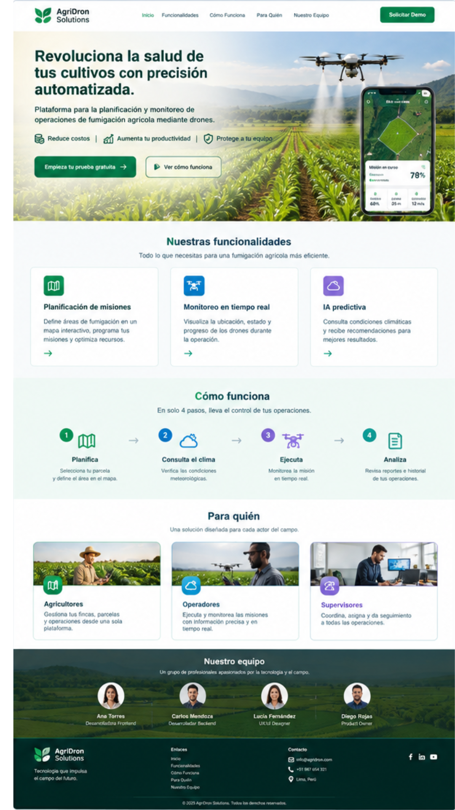

**Descripción:**

El mockup de la Landing Page en versión Desktop representa la propuesta visual de alta fidelidad de AgriDron Solutions. A partir de la estructura definida en el wireframe, se incorporan colores, tipografías, imágenes, iconografía, botones y demás elementos gráficos relacionados con la identidad de la plataforma.

---

## 4.4. Web Applications UX/UI Design

### 4.4.1. Web Applications Wireframes

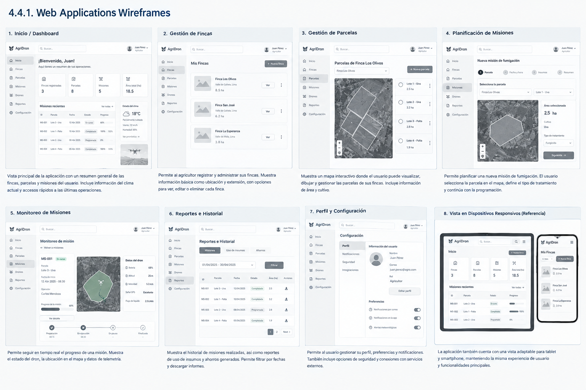


### 4.4.2. Web Applications Wireflow Diagrams

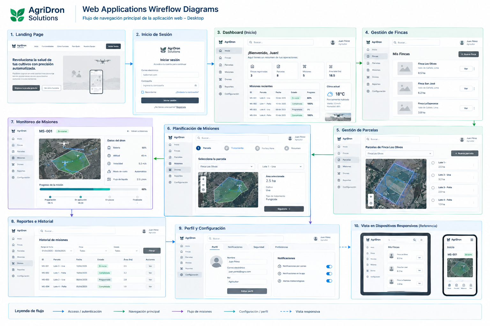


### 4.4.3. Web Applications Mock-ups


### 4.4.4. Web Applications User Flow Diagrams

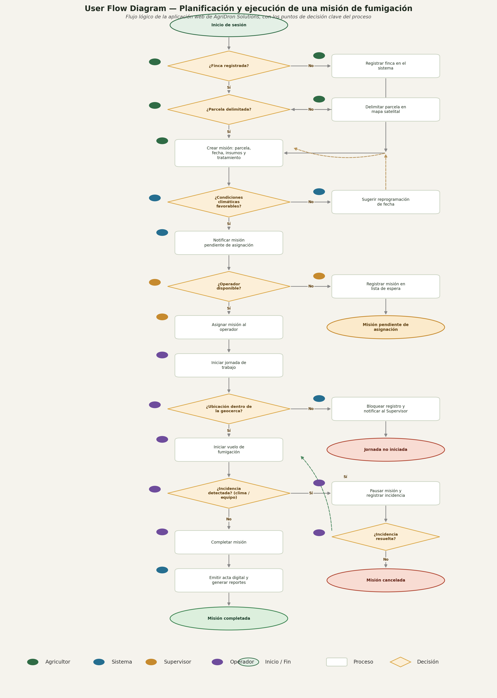

**Descripción:**

<p align="justify">

El User Flow Diagram representa la lógica de decisión que subyace al recorrido mostrado en el Wireflow (4.4.2), para la tarea central del sistema: <strong>planificar y ejecutar una misión de fumigación</strong>. A diferencia del wireflow, que conecta pantallas, este diagrama se enfoca en los puntos de decisión (rombos) y las rutas alternativas que puede tomar el proceso, distinguiendo mediante color qué actor es responsable de cada paso: Agricultor, Sistema, Supervisor u Operador.

</p>

<p align="justify">

El flujo principal sigue el camino feliz: el Agricultor inicia sesión, registra su finca y delimita la parcela si aún no lo ha hecho, crea la misión, el Sistema valida las condiciones climáticas, el Supervisor asigna un operador disponible, y el Operador inicia su jornada, ejecuta el vuelo y cierra el servicio con la emisión del acta digital y los reportes correspondientes.

</p>

<p align="justify">

Sobre este camino principal se modelaron cuatro rutas alternativas, directamente relacionadas con los <em>hotspots</em> identificados en el Big Picture EventStorming (2.4):

</p>

<ul>
  <li>Si el clima no es favorable, el sistema sugiere una reprogramación de fecha antes de continuar.</li>
  <li>Si no hay operadores disponibles, la misión se registra en una lista de espera en lugar de bloquear el flujo.</li>
  <li>Si el operador no se encuentra dentro de la geocerca de la finca, el sistema bloquea el registro de jornada y notifica al Supervisor.</li>
  <li>Si se detecta una incidencia climática o técnica durante el vuelo, la misión se pausa; si la incidencia se resuelve, el vuelo se reanuda, y si no, la misión se cancela.</li>
</ul>

<p align="justify">

Modelar estas rutas alternativas de forma explícita permite validar, antes de construir el prototipo, que el sistema tiene una respuesta definida para cada escenario de falla identificado durante el needfinding y el EventStorming, en lugar de dejarlas como casos no contemplados en el diseño.

</p>

---

## 4.5. Web Applications Prototyping

[PEGAR AQUÍ EL ENLACE / EVIDENCIA DEL PROTOTIPO.]

---

## 4.6. Domain-Driven Software Architecture

### 4.6.1. Design-Level Event Storming
El **Design-Level Event Storming** permite representar el flujo principal del dominio de AgriDron Solutions mediante comandos, eventos de dominio, actores, políticas y agregados. A partir de este análisis se identifican cuatro áreas principales del dominio y se particiona la solución en los siguientes **Bounded Contexts**:

1. **Field Management**
2. **Flight Operations**
3. **Weather Integration**
4. **Analytics & Reporting**

### Flujo principal del dominio

El flujo comienza cuando un agricultor solicita un servicio de fumigación y termina con el registro de los resultados y la generación de información histórica para consulta.


```mermaid
flowchart LR
  A["Agricultor / Cliente"] --> C1["Registrar parcela"]
  C1 --> E1["Parcela registrada"]
  E1 --> C2["Delimitar área de fumigación"]
  C2 --> E2["Área de fumigación delimitada"]
  E2 --> C3["Crear misión"]
  C3 --> E3["Misión creada"]
  E3 --> C4["Programar misión"]
  C4 --> E4["Misión programada"]
  E4 --> P1{"Política: verificar condiciones meteorológicas"}
  P1 --> C5["Consultar condiciones meteorológicas"]
  C5 --> E5["Condiciones meteorológicas obtenidas"]
  E5 --> P2{"Política: evaluar condiciones"}
  P2 -->|Condiciones favorables| E6["Misión autorizada"]
  P2 -->|Condiciones desfavorables| E7["Alerta meteorológica generada"]
  E6 --> C6["Iniciar operación"]
  C6 --> E8["Operación iniciada"]
  E8 --> C7["Monitorear operación"]
  C7 --> E9["Estado de operación actualizado"]
  E9 --> P3{"¿Ocurrió un incidente?"}
  P3 -->|Sí| C8["Registrar incidente"]
  C8 --> E10["Incidente registrado"]
  E10 --> C7
  P3 -->|No| C9["Finalizar operación"]
  C9 --> E11["Operación finalizada"]
  E11 --> C10["Registrar resultado"]
  C10 --> E12["Resultado de misión registrado"]
  E12 --> C11["Actualizar historial"]
  C11 --> E13["Historial actualizado"]
  E13 --> C12["Generar reporte"]
  C12 --> E14["Reporte generado"]
```

### Actores principales

| Actor | Responsabilidad |
|---|---|
| **Agricultor / Cliente** | Solicita servicios y consulta información de sus operaciones. |
| **Operador técnico** | Registra y planifica misiones, verifica condiciones, ejecuta y monitorea operaciones y registra resultados. |
| **Sistema meteorológico externo** | Proporciona información climática para apoyar la planificación. |

### Comandos

| Comando | Origen | Propósito |
|---|---|---|
| Registrar parcela | Operador | Crear información de una parcela agrícola. |
| Delimitar área de fumigación | Operador | Definir el área que será tratada. |
| Crear misión | Operador | Crear una operación de fumigación asociada a una parcela. |
| Programar misión | Operador | Definir fecha y hora planificadas. |
| Consultar condiciones meteorológicas | Sistema | Obtener información climática de la API externa. |
| Iniciar operación | Operador | Marcar el inicio de la misión. |
| Monitorear operación | Operador / Sistema | Actualizar estado y ubicación simulada del dron. |
| Registrar incidente | Operador | Registrar situaciones inesperadas. |
| Finalizar operación | Operador | Marcar la finalización de la misión. |
| Registrar resultado | Operador | Registrar hectáreas tratadas, volumen aplicado y observaciones. |
| Actualizar historial | Sistema | Incorporar la misión finalizada al historial. |
| Generar reporte | Usuario / Sistema | Generar información consolidada de la operación. |

### Eventos de dominio

| Evento | Descripción |
|---|---|
| **Parcela registrada** | Se creó una parcela con su información básica. |
| **Área de fumigación delimitada** | Se definió geográficamente el área que será tratada. |
| **Misión creada** | Se creó una nueva misión. |
| **Misión programada** | La misión tiene fecha y hora planificadas. |
| **Condiciones meteorológicas obtenidas** | El sistema recibió información climática externa. |
| **Misión autorizada** | Las condiciones disponibles permiten continuar con la planificación. |
| **Alerta meteorológica generada** | Las condiciones requieren advertencia, pausa o reprogramación. |
| **Operación iniciada** | Comenzó la ejecución de la misión. |
| **Estado de operación actualizado** | Se actualizó el estado o ubicación simulada del dron. |
| **Incidente registrado** | Se registró una situación inesperada. |
| **Operación finalizada** | Terminó la ejecución de la misión. |
| **Resultado de misión registrado** | Se registraron las métricas y observaciones finales. |
| **Historial actualizado** | La misión finalizada está disponible como antecedente. |
| **Reporte generado** | Se generó información consolidada. |

### Políticas y reglas de negocio

| Política | Regla |
|---|---|
| **Verificación meteorológica previa** | Antes de iniciar una misión se deben consultar las condiciones meteorológicas disponibles. |
| **Evaluación de condiciones** | Si las condiciones son desfavorables, se genera una alerta para apoyar la decisión de pausar o reprogramar. |
| **Registro de incidentes** | Una incidencia debe quedar registrada para mantener trazabilidad. |
| **Registro de resultados** | Una misión finalizada debe conservar información sobre el trabajo realizado. |
| **Actualización del historial** | Los resultados de misiones finalizadas deben estar disponibles para consultas posteriores. |

### Agregados principales

- **Farm / Parcel:** concentra información territorial y agrícola.
- **Mission:** concentra la información principal de una operación y su ciclo de vida.
- **Drone:** representa el recurso utilizado para ejecutar una misión.
- **Mission Report:** concentra los resultados registrados al finalizar una operación.

---

# 4.6.1.1. Bounded Contexts

La partición del dominio se realiza considerando las responsabilidades y conceptos principales de la solución.

## Bounded Context 1: Field Management

**Responsabilidad:** administrar la información de campos y parcelas utilizada para planificar servicios.

**Conceptos:** campo, parcela, cultivo, ubicación, área de fumigación y coordenadas.

**Operaciones:** registrar/actualizar parcela, visualizarla en mapa, delimitar área y asociar cultivo.

**Eventos:** `ParcelaRegistrada`, `AreaFumigacionDelimitada`, `InformacionCultivoRegistrada`.

## Bounded Context 2: Flight Operations

**Responsabilidad:** gestionar la planificación, ejecución y seguimiento de misiones.

**Conceptos:** misión, dron, programación, estado, operación, incidente y hectáreas tratadas.

**Operaciones:** crear/programar misión, iniciar operación, actualizar estado, registrar incidentes, finalizar operación y registrar resultados.

**Eventos:** `MisionCreada`, `MisionProgramada`, `OperacionIniciada`, `EstadoOperacionActualizado`, `IncidenteRegistrado`, `OperacionFinalizada`.

## Bounded Context 3: Weather Integration

**Responsabilidad:** encapsular la integración con la API meteorológica y proporcionar información climática para apoyar la planificación.

**Conceptos:** consulta meteorológica, condición, viento, temperatura, humedad, precipitación y alerta.

**Operaciones:** consultar condiciones, consultar pronóstico, evaluar condiciones y generar alertas.

**Eventos:** `CondicionesMeteorologicasObtenidas`, `CondicionesEvaluadas`, `AlertaMeteorologicaGenerada`.

## Bounded Context 4: Analytics & Reporting

**Responsabilidad:** conservar y presentar información histórica de las operaciones.

**Conceptos:** historial, resultado, reporte, estadística y métrica.

**Operaciones:** registrar resultados, consultar historial, consolidar métricas y generar reportes.

**Eventos:** `ResultadoMisionRegistrado`, `HistorialActualizado`, `ReporteGenerado`.

### Relación entre Bounded Contexts

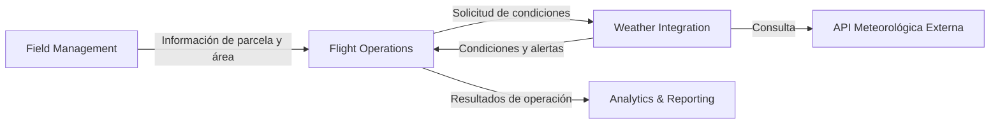
```mermaid
flowchart LR
  FM["Field Management"]
  FO["Flight Operations"]
  WI["Weather Integration"]
  AR["Analytics & Reporting"]
  API["API Meteorológica Externa"]

  FM -->|"Información de parcela y área"| FO
  FO -->|"Solicitud de condiciones"| WI
  WI -->|"Condiciones y alertas"| FO
  FO -->|"Resultados de operación"| AR
  WI -->|"Consulta"| API
```

### Justificación

- **Field Management** mantiene la información territorial.
- **Flight Operations** gestiona el ciclo de vida de la misión.
- **Weather Integration** aísla la dependencia externa de información meteorológica.
- **Analytics & Reporting** transforma resultados en información histórica y reportes.

### 4.6.2. Software Architecture Context Diagram
El **System Context Diagram de C4** representa el sistema como una única unidad y muestra los usuarios y sistemas externos que interactúan directamente con él. En este nivel no se detallan tecnologías internas.

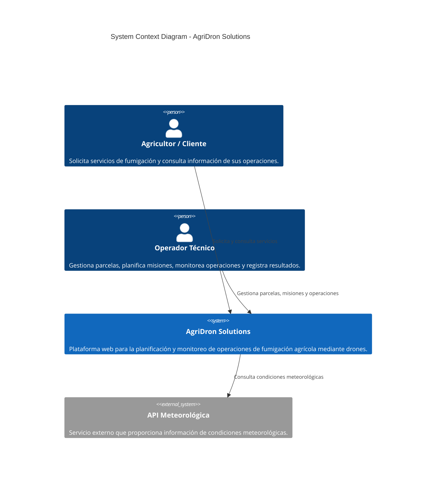
```mermaid
C4Context
  title System Context Diagram - AgriDron Solutions

  Person(farmer, "Agricultor / Cliente", "Solicita servicios de fumigación y consulta información de sus operaciones.")
  Person(operator, "Operador Técnico", "Gestiona parcelas, planifica misiones, monitorea operaciones y registra resultados.")

  System(agridron, "AgriDron Solutions", "Plataforma web para la planificación y monitoreo de operaciones de fumigación agrícola mediante drones.")

  System_Ext(weather, "API Meteorológica", "Servicio externo que proporciona información de condiciones meteorológicas.")

  Rel(farmer, agridron, "Solicita y consulta servicios")
  Rel(operator, agridron, "Gestiona parcelas, misiones y operaciones")
  Rel(agridron, weather, "Consulta condiciones meteorológicas")
```

### Descripción

**AgriDron Solutions** es el sistema principal en el alcance de la solución. El **Agricultor / Cliente** interactúa con la plataforma para solicitar y consultar información relacionada con sus servicios, mientras que el **Operador Técnico** la utiliza para gestionar parcelas, planificar misiones, monitorear operaciones y registrar resultados.

La plataforma interactúa con una **API Meteorológica externa** para obtener información utilizada en la evaluación de las condiciones de operación.

### 4.6.3. Software Architecture Container Diagrams
El **Container Diagram de C4** realiza un acercamiento al sistema y muestra sus principales aplicaciones, servicios y almacenes de datos, incluyendo las tecnologías utilizadas y sus relaciones.

Los contenedores definidos son:

1. **Landing Page**
2. **Frontend Vue**
3. **Backend ASP.NET Core**
4. **Base de Datos Relacional**
5. **API Meteorológica Externa**

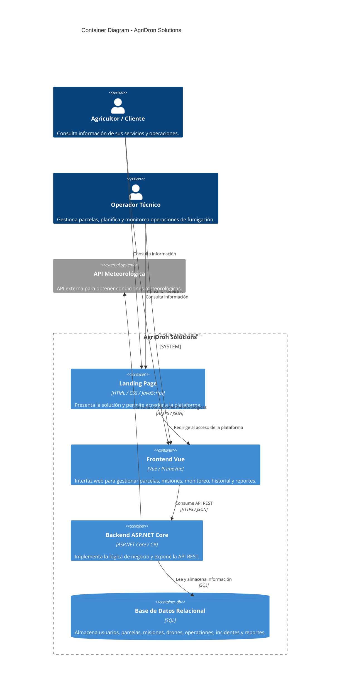
```mermaid
C4Container
  title Container Diagram - AgriDron Solutions

  Person(farmer, "Agricultor / Cliente", "Consulta información de sus servicios y operaciones.")
  Person(operator, "Operador Técnico", "Gestiona parcelas, planifica y monitorea operaciones de fumigación.")

  System_Ext(weather, "API Meteorológica", "API externa para obtener condiciones meteorológicas.")

  System_Boundary(agridron, "AgriDron Solutions") {
    Container(landing, "Landing Page", "HTML / CSS / JavaScript", "Presenta la solución y permite acceder a la plataforma.")
    Container(frontend, "Frontend Vue", "Vue / PrimeVue", "Interfaz web para gestionar parcelas, misiones, monitoreo, historial y reportes.")
    Container(backend, "Backend ASP.NET Core", "ASP.NET Core / C#", "Implementa la lógica de negocio y expone la API REST.")
    ContainerDb(database, "Base de Datos Relacional", "SQL", "Almacena usuarios, parcelas, misiones, drones, operaciones, incidentes y reportes.")
  }

  Rel(farmer, landing, "Consulta información")
  Rel(operator, landing, "Consulta información")
  Rel(farmer, frontend, "Consulta servicios")
  Rel(operator, frontend, "Gestiona operaciones")
  Rel(landing, frontend, "Redirige al acceso de la plataforma")
  Rel(frontend, backend, "Consume API REST", "HTTPS / JSON")
  Rel(backend, database, "Lee y almacena información", "SQL")
  Rel(backend, weather, "Consulta condiciones meteorológicas", "HTTPS / JSON")
```

### Descripción de los contenedores

| Contenedor | Tecnología | Responsabilidad |
|---|---|---|
| **Landing Page** | HTML / CSS / JavaScript | Presentar AgriDron Solutions y facilitar el acceso a la plataforma. |
| **Frontend Vue** | Vue / PrimeVue | Proporcionar la interfaz para gestionar parcelas, misiones, monitoreo, historial y reportes. |
| **Backend ASP.NET Core** | ASP.NET Core / C# | Implementar la lógica de negocio, exponer servicios REST y coordinar datos y servicios externos. |
| **Base de Datos Relacional** | SQL | Persistir usuarios, parcelas, misiones, operaciones, incidentes y reportes. |
| **API Meteorológica** | Servicio externo | Proporcionar datos meteorológicos para apoyar la planificación. |

### Flujo de comunicación

1. El usuario accede a la **Landing Page**.
2. El usuario utiliza el **Frontend Vue** para gestionar o consultar información.
3. El **Frontend Vue** consume el **Backend ASP.NET Core** mediante API REST.
4. El **Backend ASP.NET Core** consulta y actualiza la **Base de Datos Relacional**.
5. El **Backend ASP.NET Core** consulta la **API Meteorológica** cuando se requiere información climática.
6. La información procesada se presenta mediante el **Frontend Vue**.

## Trazabilidad entre dominio y arquitectura

| Bounded Context | Responsabilidad | Soporte arquitectónico |
|---|---|---|
| **Field Management** | Campos, parcelas y áreas | Frontend + Backend + BD |
| **Flight Operations** | Misiones, drones, operaciones e incidentes | Frontend + Backend + BD |
| **Weather Integration** | Condiciones y alertas meteorológicas | Backend + API Meteorológica |
| **Analytics & Reporting** | Historial, métricas y reportes | Frontend + Backend + BD |

La correspondencia permite mantener trazabilidad entre el análisis de dominio realizado mediante Event Storming y la arquitectura propuesta para AgriDron Solutions.

### 4.6.4. Software Architecture Components Diagrams
Esta sección presenta el diseño interno de los principales componentes de software de **AgriDron Solutions**. Se mantiene la separación entre la aplicación web, los servicios REST y las integraciones externas, alineándolos con los Bounded Contexts definidos en la arquitectura.


## 4.6.4.1. RESTful API

La API RESTful implementada con ASP.NET Core concentra la lógica de aplicación y dominio. Se organiza en capas de presentación, aplicación, dominio e infraestructura.

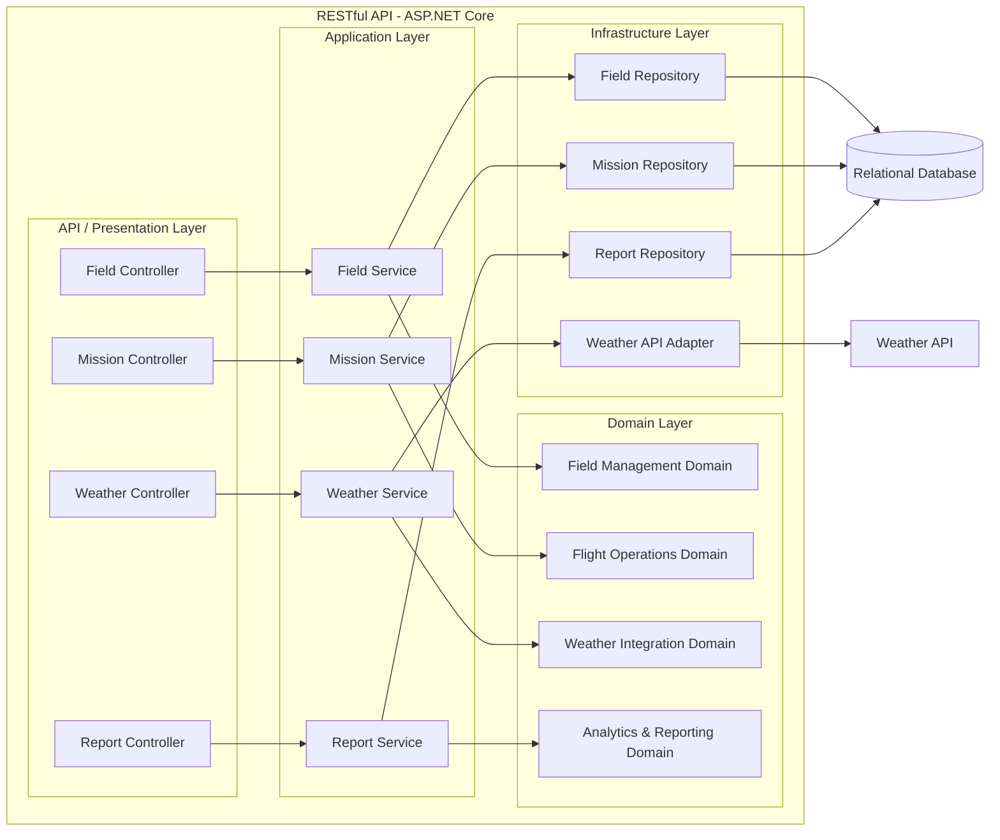
```mermaid
flowchart LR
  subgraph API["RESTful API - ASP.NET Core"]
    subgraph Presentation["API / Presentation Layer"]
      FC["Field Controller"]
      MC["Mission Controller"]
      WC["Weather Controller"]
      RC["Report Controller"]
    end
    subgraph Application["Application Layer"]
      FS["Field Service"]
      MS["Mission Service"]
      WS["Weather Service"]
      RS["Report Service"]
    end
    subgraph Domain["Domain Layer"]
      FD["Field Management Domain"]
      MD["Flight Operations Domain"]
      WD["Weather Integration Domain"]
      RD["Analytics & Reporting Domain"]
    end
    subgraph Infrastructure["Infrastructure Layer"]
      FR["Field Repository"]
      MR["Mission Repository"]
      RR["Report Repository"]
      WA["Weather API Adapter"]
    end
  end
  DB[("Relational Database")]
  Weather["Weather API"]
  FC --> FS
  MC --> MS
  WC --> WS
  RC --> RS
  FS --> FD
  MS --> MD
  WS --> WD
  RS --> RD
  FS --> FR
  MS --> MR
  RS --> RR
  WS --> WA
  FR --> DB
  MR --> DB
  RR --> DB
  WA --> Weather
```

### Responsabilidades

| Capa | Responsabilidad |
|---|---|
| Presentation | Recibir solicitudes HTTP y devolver respuestas mediante endpoints REST. |
| Application | Coordinar casos de uso y orquestar operaciones del dominio. |
| Domain | Contener reglas y conceptos principales de cada Bounded Context. |
| Infrastructure | Implementar persistencia e integración con servicios externos. |

## 4.6.4.2. Web Application

La aplicación web utiliza Vue para proporcionar las funcionalidades de operadores y clientes.

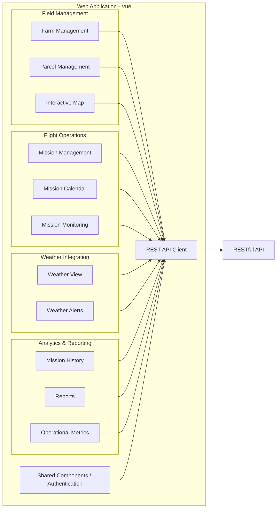
```mermaid
flowchart LR
  subgraph Web["Web Application - Vue"]
    subgraph Field["Field Management"]
      Farms["Farm Management"]
      Parcels["Parcel Management"]
      Map["Interactive Map"]
    end
    subgraph Flight["Flight Operations"]
      Missions["Mission Management"]
      Schedule["Mission Calendar"]
      Monitor["Mission Monitoring"]
    end
    subgraph Weather["Weather Integration"]
      WeatherView["Weather View"]
      Alerts["Weather Alerts"]
    end
    subgraph Reports["Analytics & Reporting"]
      History["Mission History"]
      ReportsView["Reports"]
      Metrics["Operational Metrics"]
    end
    Shared["Shared Components / Authentication"]
    APIClient["REST API Client"]
  end
  API["RESTful API"]
  Farms --> APIClient
  Parcels --> APIClient
  Map --> APIClient
  Missions --> APIClient
  Schedule --> APIClient
  Monitor --> APIClient
  WeatherView --> APIClient
  Alerts --> APIClient
  History --> APIClient
  ReportsView --> APIClient
  Metrics --> APIClient
  Shared --> APIClient
  APIClient --> API
```

### Responsabilidades

- **Field Management:** administrar campos, parcelas y áreas de fumigación.
- **Flight Operations:** crear, programar y monitorear misiones.
- **Weather Integration:** mostrar condiciones y alertas meteorológicas.
- **Analytics & Reporting:** consultar historial y reportes.
- **Shared Components:** centralizar elementos reutilizables y autenticación.
- **REST API Client:** encapsular la comunicación con el Backend.

## 4.6.4.3. Weather Integration Component

La integración meteorológica se mantiene aislada para evitar acoplar directamente la lógica de negocio con la API externa.

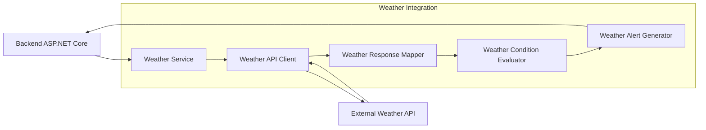
```mermaid
flowchart LR
  Backend["Backend ASP.NET Core"]
  subgraph WeatherIntegration["Weather Integration"]
    WS["Weather Service"]
    WClient["Weather API Client"]
    Mapper["Weather Response Mapper"]
    Evaluator["Weather Condition Evaluator"]
    Alert["Weather Alert Generator"]
  end
  External["External Weather API"]
  Backend --> WS
  WS --> WClient
  WClient --> External
  External --> WClient
  WClient --> Mapper
  Mapper --> Evaluator
  Evaluator --> Alert
  Alert --> Backend
```

El componente permite cambiar o adaptar el proveedor meteorológico sin modificar directamente los componentes de **Flight Operations**.

---

## 4.7. Software Object-Oriented Design
El diseño orientado a objetos representa los principales elementos del dominio y sus relaciones. El Project Statement solicita que los Class Diagrams incluyan clases, interfaces, enumeraciones, atributos, métodos, visibilidad, relaciones y multiplicidades cuando correspondan.

### 4.7.1. Class Diagrams

### 4.7.1.1. Field Management

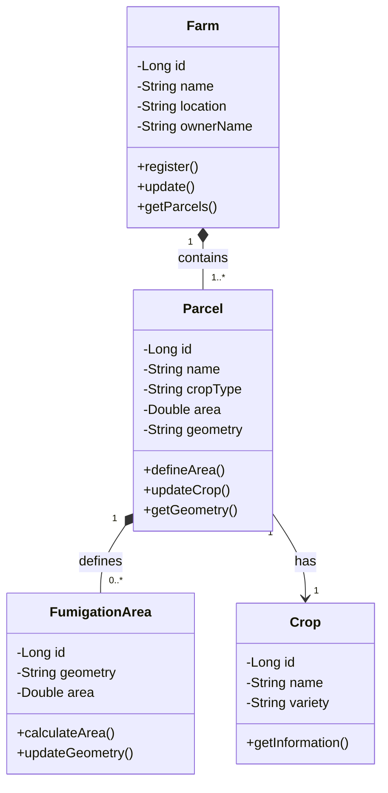
```mermaid
classDiagram
  class Farm {
    -Long id
    -String name
    -String location
    -String ownerName
    +register()
    +update()
    +getParcels()
  }
  class Parcel {
    -Long id
    -String name
    -String cropType
    -Double area
    -String geometry
    +defineArea()
    +updateCrop()
    +getGeometry()
  }
  class FumigationArea {
    -Long id
    -String geometry
    -Double area
    +calculateArea()
    +updateGeometry()
  }
  class Crop {
    -Long id
    -String name
    -String variety
    +getInformation()
  }
  Farm "1" *-- "1..*" Parcel : contains
  Parcel "1" *-- "0..*" FumigationArea : defines
  Parcel "1" --> "1" Crop : has
```

### 4.7.1.2. Flight Operations

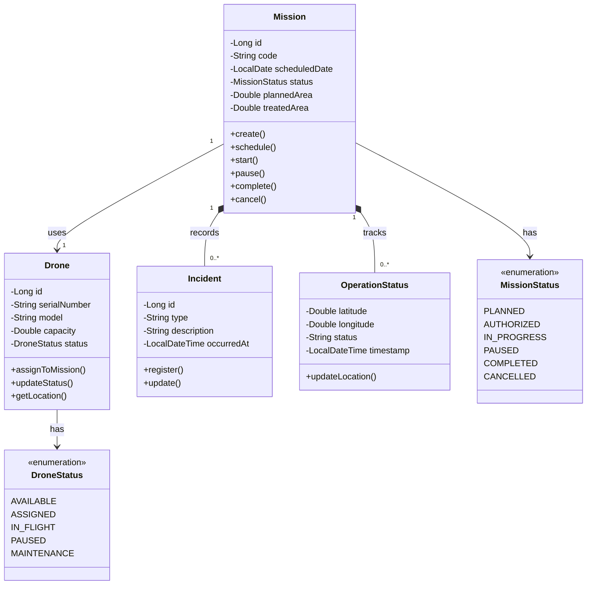
```mermaid
classDiagram
  class Mission {
    -Long id
    -String code
    -LocalDate scheduledDate
    -MissionStatus status
    -Double plannedArea
    -Double treatedArea
    +create()
    +schedule()
    +start()
    +pause()
    +complete()
    +cancel()
  }
  class Drone {
    -Long id
    -String serialNumber
    -String model
    -Double capacity
    -DroneStatus status
    +assignToMission()
    +updateStatus()
    +getLocation()
  }
  class Incident {
    -Long id
    -String type
    -String description
    -LocalDateTime occurredAt
    +register()
    +update()
  }
  class OperationStatus {
    -Double latitude
    -Double longitude
    -String status
    -LocalDateTime timestamp
    +updateLocation()
  }
  class MissionStatus {
    <<enumeration>>
    PLANNED
    AUTHORIZED
    IN_PROGRESS
    PAUSED
    COMPLETED
    CANCELLED
  }
  class DroneStatus {
    <<enumeration>>
    AVAILABLE
    ASSIGNED
    IN_FLIGHT
    PAUSED
    MAINTENANCE
  }
  Mission "1" --> "1" Drone : uses
  Mission "1" *-- "0..*" Incident : records
  Mission "1" *-- "0..*" OperationStatus : tracks
  Mission --> MissionStatus : has
  Drone --> DroneStatus : has
```

### 4.7.1.3. Weather Integration

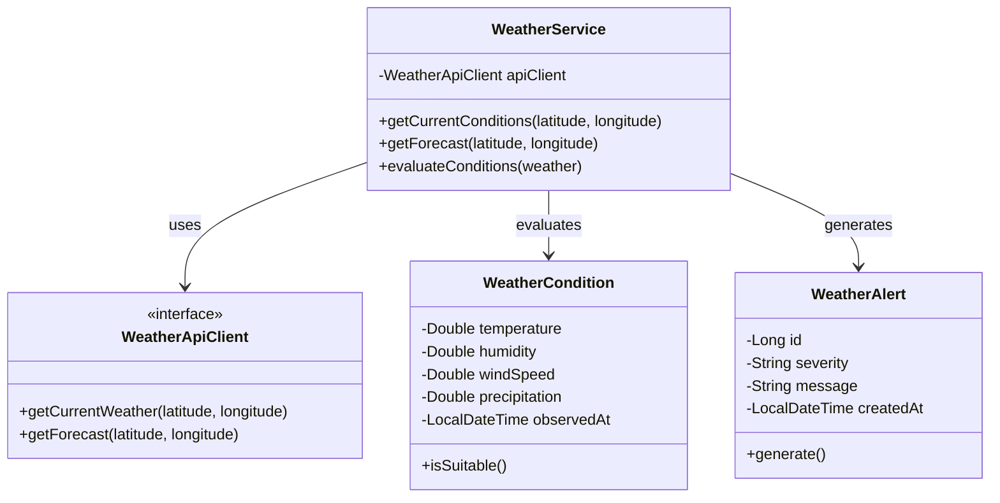
```mermaid
classDiagram
  class WeatherService {
    -WeatherApiClient apiClient
    +getCurrentConditions(latitude, longitude)
    +getForecast(latitude, longitude)
    +evaluateConditions(weather)
  }
  class WeatherApiClient {
    <<interface>>
    +getCurrentWeather(latitude, longitude)
    +getForecast(latitude, longitude)
  }
  class WeatherCondition {
    -Double temperature
    -Double humidity
    -Double windSpeed
    -Double precipitation
    -LocalDateTime observedAt
    +isSuitable()
  }
  class WeatherAlert {
    -Long id
    -String severity
    -String message
    -LocalDateTime createdAt
    +generate()
  }
  WeatherService --> WeatherApiClient : uses
  WeatherService --> WeatherCondition : evaluates
  WeatherService --> WeatherAlert : generates
```

### 4.7.1.4. Analytics & Reporting

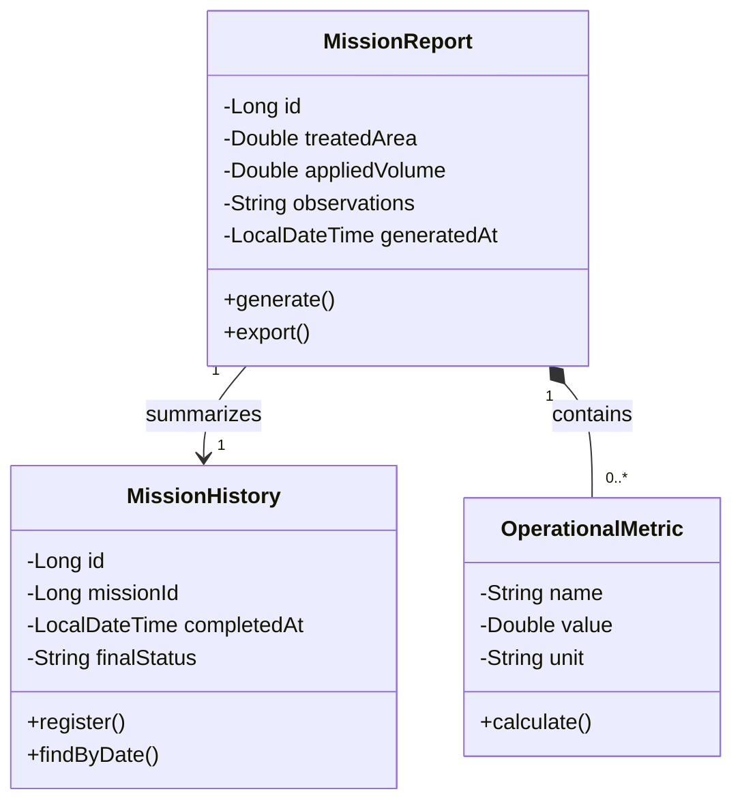
```mermaid
classDiagram
  class MissionReport {
    -Long id
    -Double treatedArea
    -Double appliedVolume
    -String observations
    -LocalDateTime generatedAt
    +generate()
    +export()
  }
  class MissionHistory {
    -Long id
    -Long missionId
    -LocalDateTime completedAt
    -String finalStatus
    +register()
    +findByDate()
  }
  class OperationalMetric {
    -String name
    -Double value
    -String unit
    +calculate()
  }
  MissionReport "1" --> "1" MissionHistory : summarizes
  MissionReport "1" *-- "0..*" OperationalMetric : contains
```

### 4.7.1.5. Shared / Identity

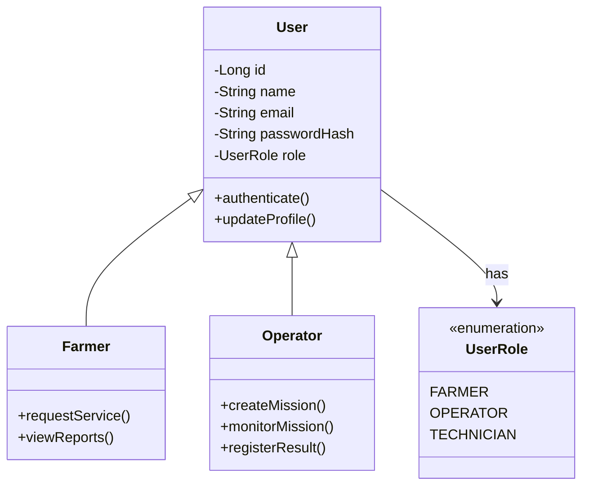
```mermaid
classDiagram
  class User {
    -Long id
    -String name
    -String email
    -String passwordHash
    -UserRole role
    +authenticate()
    +updateProfile()
  }
  class UserRole {
    <<enumeration>>
    FARMER
    OPERATOR
    TECHNICIAN
  }
  class Farmer {
    +requestService()
    +viewReports()
  }
  class Operator {
    +createMission()
    +monitorMission()
    +registerResult()
  }
  User <|-- Farmer
  User <|-- Operator
  User --> UserRole : has
```

## 4.8. Database Design

### 4.8.1. Database Diagrams

<p align="justify">

El modelo de base de datos se derivó directamente de los Class Diagrams definidos en el apartado 4.7.1, traduciendo cada clase persistente a una tabla relacional. Las clases de servicio sin estado propio (<code>WeatherService</code>, <code>WeatherApiClient</code>) no se materializan como tablas, ya que no almacenan datos, solo orquestan la comunicación con la API meteorológica externa.

</p>

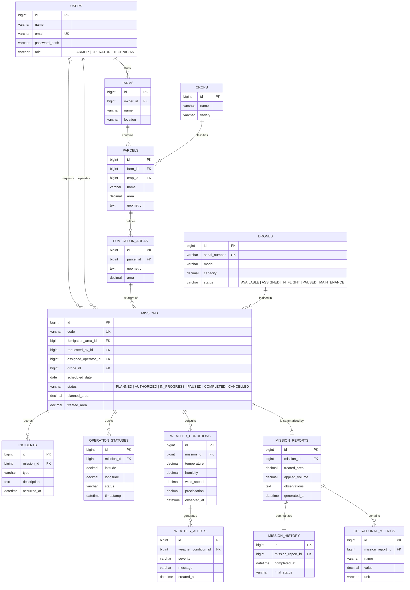
```mermaid
erDiagram
  USERS ||--o{ FARMS : owns
  USERS ||--o{ MISSIONS : requests
  USERS ||--o{ MISSIONS : operates
  FARMS ||--|{ PARCELS : contains
  CROPS ||--o{ PARCELS : classifies
  PARCELS ||--o{ FUMIGATION_AREAS : defines
  FUMIGATION_AREAS ||--o{ MISSIONS : "is target of"
  DRONES ||--o{ MISSIONS : "is used in"
  MISSIONS ||--o{ INCIDENTS : records
  MISSIONS ||--o{ OPERATION_STATUSES : tracks
  MISSIONS ||--o{ WEATHER_CONDITIONS : consults
  WEATHER_CONDITIONS ||--o{ WEATHER_ALERTS : generates
  MISSIONS ||--o| MISSION_REPORTS : "is summarized by"
  MISSION_REPORTS ||--|| MISSION_HISTORY : summarizes
  MISSION_REPORTS ||--o{ OPERATIONAL_METRICS : contains

  USERS {
    bigint id PK
    varchar name
    varchar email UK
    varchar password_hash
    varchar role "FARMER | OPERATOR | TECHNICIAN"
  }
  FARMS {
    bigint id PK
    bigint owner_id FK
    varchar name
    varchar location
  }
  PARCELS {
    bigint id PK
    bigint farm_id FK
    bigint crop_id FK
    varchar name
    decimal area
    text geometry
  }
  CROPS {
    bigint id PK
    varchar name
    varchar variety
  }
  FUMIGATION_AREAS {
    bigint id PK
    bigint parcel_id FK
    text geometry
    decimal area
  }
  DRONES {
    bigint id PK
    varchar serial_number UK
    varchar model
    decimal capacity
    varchar status "AVAILABLE | ASSIGNED | IN_FLIGHT | PAUSED | MAINTENANCE"
  }
  MISSIONS {
    bigint id PK
    varchar code UK
    bigint fumigation_area_id FK
    bigint requested_by_id FK
    bigint assigned_operator_id FK
    bigint drone_id FK
    date scheduled_date
    varchar status "PLANNED | AUTHORIZED | IN_PROGRESS | PAUSED | COMPLETED | CANCELLED"
    decimal planned_area
    decimal treated_area
  }
  INCIDENTS {
    bigint id PK
    bigint mission_id FK
    varchar type
    text description
    datetime occurred_at
  }
  OPERATION_STATUSES {
    bigint id PK
    bigint mission_id FK
    decimal latitude
    decimal longitude
    varchar status
    datetime timestamp
  }
  WEATHER_CONDITIONS {
    bigint id PK
    bigint mission_id FK
    decimal temperature
    decimal humidity
    decimal wind_speed
    decimal precipitation
    datetime observed_at
  }
  WEATHER_ALERTS {
    bigint id PK
    bigint weather_condition_id FK
    varchar severity
    varchar message
    datetime created_at
  }
  MISSION_REPORTS {
    bigint id PK
    bigint mission_id FK
    decimal treated_area
    decimal applied_volume
    text observations
    datetime generated_at
  }
  MISSION_HISTORY {
    bigint id PK
    bigint mission_report_id FK
    datetime completed_at
    varchar final_status
  }
  OPERATIONAL_METRICS {
    bigint id PK
    bigint mission_report_id FK
    varchar name
    decimal value
    varchar unit
  }
```

**Descripción:**

<p align="justify">

El modelo se organiza alrededor de cinco agrupaciones, alineadas con los bounded contexts definidos en el Design-Level Event Storming (4.6.1) y los Class Diagrams (4.7.1):

</p>

<ul>
  <li><strong>Identidad (USERS):</strong> se aplicó herencia de tabla única (single table inheritance) para <code>Farmer</code> y <code>Operator</code>, ya que en el modelo de clases ambas especializaciones de <code>User</code> solo agregan comportamiento (métodos) y no atributos adicionales. Por ello, el rol se resuelve con la columna discriminadora <code>role</code> en lugar de crear tablas separadas.</li>
  <li><strong>Field Management (FARMS, PARCELS, CROPS, FUMIGATION_AREAS):</strong> conserva la jerarquía de contención finca → parcela → área de fumigación definida en 4.7.1.1, agregando la clave foránea <code>owner_id</code> hacia <code>USERS</code> para vincular cada finca con el agricultor que la administra.</li>
  <li><strong>Flight Operations (MISSIONS, DRONES, INCIDENTS, OPERATION_STATUSES):</strong> <code>MISSIONS</code> concentra las claves foráneas hacia el área objetivo, el solicitante, el operador asignado y el dron utilizado. Los enumerados <code>MissionStatus</code> y <code>DroneStatus</code> del modelo de clases se representan como columnas <code>varchar</code> con los valores permitidos documentados, en lugar de tablas de catálogo independientes, dado que son listas cerradas y estables que no requieren atributos adicionales.</li>
  <li><strong>Weather Integration (WEATHER_CONDITIONS, WEATHER_ALERTS):</strong> cada consulta climática queda asociada a la misión que la originó, permitiendo sustentar técnicamente una pausa o cancelación, tal como se identificó en los hotspots del EventStorming (2.4).</li>
  <li><strong>Analytics & Reporting (MISSION_REPORTS, MISSION_HISTORY, OPERATIONAL_METRICS):</strong> replica la relación 1 a 1 entre <code>MissionReport</code> y <code>MissionHistory</code>, y la composición 1 a N con <code>OperationalMetric</code>, tal como fueron definidas en 4.7.1.4.</li>
</ul>

---

# Capítulo V: Product Implementation, Validation & Deployment

## 5.1. Software Configuration Management

El **Software Configuration Management (SCM)** de AgriDron Solutions establece las herramientas, convenciones y procedimientos que permitirán mantener la consistencia del producto durante su ciclo de vida. Esta configuración cubre el entorno de desarrollo, la gestión del código fuente, las convenciones de programación y el despliegue de los productos de software.

De acuerdo con el Project Statement, esta sección debe establecer decisiones y convenciones para mantener la consistencia durante el ciclo de vida del producto. Además, se debe considerar el entorno utilizado para actividades de gestión del proyecto, requisitos, UX/UI, desarrollo, despliegue y documentación.

La propuesta de SCM para AgriDron Solutions se alinea con la arquitectura definida previamente y con las tecnologías establecidas en el Project Statement: **Landing Page** (HTML5, CSS3, JavaScript), **Frontend Web Application con Vue Framework y PrimeVue**, **Web Services RESTful con ASP.NET Core y C#** y **base de datos relacional**, además de la integración con una API meteorológica externa.

### 5.1.1. Software Development Environment Configuration

#### 5.1.1.1. Propósito

El entorno de desarrollo define las herramientas que utilizará el equipo para implementar, documentar, probar y desplegar AgriDron Solutions. Se busca que todos los integrantes trabajen con una configuración homogénea, reduciendo problemas de compatibilidad y facilitando la colaboración.

El Project Statement indica que esta sección debe especificar el nombre de cada producto de software, su propósito y la ruta de referencia o descarga correspondiente, considerando las actividades de Project Management, Requirements Management, UX/UI Design, Software Development, Software Deployment y Software Documentation.

#### 5.1.1.2. Herramientas del proyecto

| Categoría | Herramienta / Tecnología | Propósito | Referencia |
|---|---|---|---|
| Control de versiones | Git | Control local de versiones del código fuente. | https://git-scm.com/ |
| Repositorios | GitHub | Hospedaje de repositorios y colaboración mediante branches y Pull Requests, aplicando GitFlow. | https://github.com/ |
| Gestión del proyecto | JetBrains YouTrack / Jira Software / Trello | Organización del Product Backlog, Sprint Backlog y seguimiento del trabajo. | Según herramienta seleccionada |
| Editor / IDE Frontend | Visual Studio Code | Desarrollo de Landing Page y Frontend Web Application con Vue. | https://code.visualstudio.com/ |
| IDE Backend | Visual Studio / JetBrains Rider | Desarrollo del Backend con ASP.NET Core y C#. | https://visualstudio.microsoft.com/ |
| Runtime Frontend | Node.js + npm | Instalación de dependencias y ejecución de herramientas de Vue. | https://nodejs.org/ |
| Framework Frontend | Vue Framework | Implementación de la Frontend Web Application (SPA). | https://vuejs.org/ |
| Biblioteca de componentes UI | PrimeVue | Componentes de interfaz basados en Material Design para la Web Application. | https://primevue.org/ |
| Lenguaje Frontend | HTML5, CSS3, JavaScript | Desarrollo de templates estáticos y lógica de la Web Application. | https://developer.mozilla.org/ |
| Framework Backend | ASP.NET Core | Implementación de los Web Services bajo arquitectura RESTful. | https://dotnet.microsoft.com/apps/aspnet |
| Lenguaje Backend | C# | Implementación de la lógica de negocio del lado servidor. | https://learn.microsoft.com/dotnet/csharp/ |
| ORM Backend | Entity Framework Core | Mapeo objeto-relacional para el acceso a datos del Backend. | https://learn.microsoft.com/ef/core/ |
| Base de datos relacional | MySQL Server / PostgreSQL | Persistencia de la información de la plataforma. | https://www.mysql.com/ / https://www.postgresql.org/ |
| Base de datos NoSQL (complemento) | MongoDB / PostgreSQL | Persistencia complementaria cuando el modelo lo requiera. | https://www.mongodb.com/ |
| API testing | Postman | Prueba de endpoints REST durante el desarrollo. | https://www.postman.com/ |
| Documentación API | Swagger (OpenAPI Specification) | Documentación y consulta interactiva de los Web Services. | https://swagger.io/ |
| Diseño UI/UX | Figma | Diseño de wireframes, mock-ups y prototipos. | https://www.figma.com/ |
| Diagramación de arquitectura | Structurizr (C4 Model) | Diagramas de contexto, contenedores y componentes como código. | https://structurizr.com/ |
| Diagramación general | LucidChart / FigJam / Mermaid | Diagramas UML, EventStorming y Database Diagrams. | https://mermaid.js.org/ |
| Documentación | Markdown | Elaboración de documentación técnica dentro del repositorio. | https://www.markdownguide.org/ |

> **Nota:** Las herramientas de gestión de proyectos y los proveedores cloud deberán reemplazarse por los productos concretos que el equipo haya seleccionado en su implementación final. La tabla mantiene como propuesta las herramientas que no han sido fijadas previamente, respetando siempre las tecnologías obligatorias indicadas en el enunciado (Vue, PrimeVue, ASP.NET Core, C#, Entity Framework Core).

#### 5.1.1.3. Configuración base

Todos los integrantes deberán mantener una configuración equivalente para evitar diferencias entre ambientes locales.

### Frontend

```text
Node.js
npm
Vue CLI / Vite
Vue 3
PrimeVue
```

### Backend

```text
.NET SDK
ASP.NET Core
Entity Framework Core
Visual Studio / JetBrains Rider
```

### Base de datos

```text
MySQL Server / PostgreSQL
Cliente gráfico de base de datos
```

### Control de versiones

```text
Git
GitHub
GitFlow
Conventional Commits
Semantic Versioning
```

#### 5.1.1.4. Estructura de repositorios

Para mantener separadas las responsabilidades de los productos, se propone trabajar con repositorios independientes:

```text
AgriDron Solutions
│
├── agridron-landing
│   └── Landing Page (HTML5, CSS3, JavaScript)
│
├── agridron-frontend
│   └── Frontend Web Application (Vue + PrimeVue)
│
└── agridron-backend
    ├── Web Services (ASP.NET Core + C# + Entity Framework Core)
    ├── Unit Tests
    └── Integration / Acceptance Tests
```

Esta organización sigue la indicación del Project Statement de considerar los productos **Landing Page, Web Services y Frontend Web Applications** y, en el caso de Web Services, incluir también los archivos de pruebas.


### 5.1.2. Source Code Management

#### 5.1.2.1. Plataforma y repositorios

El control de versiones del proyecto se realizará mediante **Git gestionado desde GitHub**. El Project Statement establece explícitamente GitHub como plataforma de control de versiones y solicita aplicar **GitFlow Workflow, Conventional Commits y Semantic Versioning**.

El Project Statement exige indicar, para cada producto, el URL del repositorio de GitHub. Los repositorios considerados para AgriDron Solutions son:

| Producto | Repositorio | URL | Contenido |
|---|---|---|---|
| Landing Page | `AgriDron-LandingPage-7760-G3` | `[PEGAR URL REAL DEL REPOSITORIO]` | HTML5, CSS3 y JavaScript |
| Frontend Web Application | `AgriDron-FrontEnd-7760-G3` | `[PEGAR URL REAL DEL REPOSITORIO]` | Vue Framework, PrimeVue |
| Web Services | `AgriDron-BackEnd-7760-G3` | `[PEGAR URL REAL DEL REPOSITORIO]` | ASP.NET Core, C#, Entity Framework Core, pruebas unitarias e integración/aceptación |

> Los nombres anteriores son una propuesta de nomenclatura. El equipo debe reemplazar los nombres y URLs por los repositorios reales de su organización pública de GitHub antes de entregar el informe.

#### 5.1.2.2. GitFlow Workflow

Se utilizará **GitFlow** como estrategia de organización de ramas.

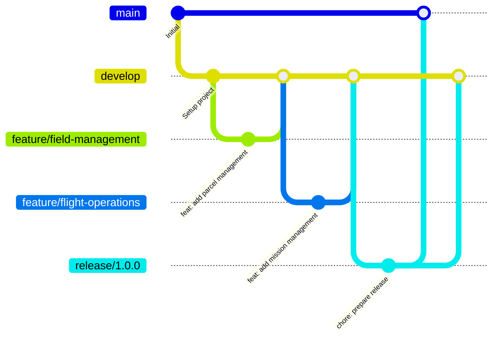
```mermaid
gitGraph
  commit id: "Initial"
  branch develop
  checkout develop
  commit id: "Setup project"

  branch feature/field-management
  checkout feature/field-management
  commit id: "feat: add parcel management"
  checkout develop
  merge feature/field-management

  branch feature/flight-operations
  checkout feature/flight-operations
  commit id: "feat: add mission management"
  checkout develop
  merge feature/flight-operations

  branch release/1.0.0
  checkout release/1.0.0
  commit id: "chore: prepare release"
  checkout main
  merge release/1.0.0
  checkout develop
  merge release/1.0.0
```

### Ramas principales

| Branch | Propósito |
|---|---|
| `main` | Contiene versiones estables listas para entrega o producción. |
| `develop` | Rama de integración de funcionalidades terminadas. |
| `feature/*` | Desarrollo aislado de una funcionalidad específica. |
| `release/*` | Preparación de una nueva versión estable. |
| `hotfix/*` | Corrección urgente de errores encontrados en producción. |

#### 5.1.2.3. Convención para Feature Branches

Cada funcionalidad debe desarrollarse en una rama independiente.

Formato:

```text
feature/<descripcion>
```

Ejemplos:

```text
feature/field-management
feature/parcel-registration
feature/mission-planning
feature/weather-integration
feature/mission-monitoring
feature/mission-reports
```

Se utilizarán nombres en **inglés**, en minúsculas y separados mediante guiones.

#### 5.1.2.4. Convención para Release Branches

Formato:

```text
release/<major>.<minor>.<patch>
```

Ejemplos:

```text
release/1.0.0
release/1.1.0
release/1.1.1
```

Las release branches permiten realizar ajustes finales antes de integrar una versión estable a `main`.

#### 5.1.2.5. Convención para Hotfix Branches

Formato:

```text
hotfix/<descripcion>
```

Ejemplos:

```text
hotfix/weather-api-error
hotfix/mission-status-fix
hotfix/login-validation
```

Los hotfixes estarán destinados exclusivamente a correcciones urgentes de versiones publicadas.

#### 5.1.2.6. Pull Requests

Las modificaciones realizadas en `feature/*`, `release/*` y `hotfix/*` deberán integrarse mediante Pull Requests.

Flujo recomendado:

```text
feature/*
    ↓
Pull Request
    ↓
Code Review
    ↓
Tests
    ↓
Merge
    ↓
develop
```

Para una versión estable:

```text
develop
    ↓
release/x.y.z
    ↓
Validation
    ↓
main
    ↓
Tag vX.Y.Z
```

Se recomienda que ningún integrante trabaje directamente sobre `main` para funcionalidades nuevas.

#### 5.1.2.7. Conventional Commits

Los mensajes de commit seguirán la especificación de **Conventional Commits**.

Formato:

```text
<type>[optional scope]: <description>
```

Ejemplos:

```text
feat(field): add parcel registration
feat(mission): add mission planning
fix(weather): handle unavailable API response
docs(api): update endpoint documentation
test(mission): add mission service tests
refactor(report): simplify report generation
chore(deps): update project dependencies
```

Tipos principales:

| Tipo | Uso |
|---|---|
| `feat` | Nueva funcionalidad. |
| `fix` | Corrección de un error. |
| `docs` | Cambios en documentación. |
| `test` | Creación o modificación de pruebas. |
| `refactor` | Reestructuración sin cambiar el comportamiento funcional. |
| `style` | Cambios de formato que no modifican la lógica. |
| `chore` | Tareas de mantenimiento o configuración. |

Conventional Commits relaciona `feat` con incrementos **MINOR**, `fix` con incrementos **PATCH** y los cambios incompatibles con incrementos **MAJOR**, facilitando su integración con Semantic Versioning.

#### 5.1.2.8. Semantic Versioning

Las versiones del producto seguirán el formato:

```text
MAJOR.MINOR.PATCH
```

Ejemplo:

```text
1.0.0
```

Reglas:

- **MAJOR:** cambios incompatibles con versiones anteriores.
- **MINOR:** nuevas funcionalidades compatibles.
- **PATCH:** correcciones compatibles.

Ejemplos:

```text
1.0.0 → primera versión estable
1.1.0 → incorporación del módulo de monitoreo
1.1.1 → corrección de un error
2.0.0 → cambio incompatible de la API
```

Las versiones estables serán identificadas mediante tags de Git:

```text
v1.0.0
v1.1.0
v1.1.1
```

### 5.1.3. Source Code Style Guide & Conventions

#### 5.1.3.1. Principios generales

El Project Statement establece que para los lenguajes utilizados en la solución debe aplicarse nomenclatura en **inglés**. Para AgriDron Solutions se aplicará esta regla a HTML, CSS, JavaScript y C#, siguiendo como referencia las guías oficiales (Google HTML/CSS Style Guide, Google JavaScript Style Guide, Vue Style Guide, C# Coding Conventions y Microsoft ASP.NET Core Coding Guidelines).

Principios:

1. Utilizar nombres descriptivos.
2. Mantener una nomenclatura consistente.
3. Evitar abreviaturas innecesarias.
4. Mantener métodos y clases con responsabilidades específicas.
5. Evitar duplicación de código.
6. Mantener funciones pequeñas y legibles.
7. Documentar únicamente la lógica que requiera contexto adicional.
8. Mantener las pruebas junto con el código correspondiente.
9. No incluir credenciales ni secretos dentro del código fuente.

#### 5.1.3.2. HTML

Convenciones:

- Utilizar HTML5 semántico.
- Utilizar elementos semánticos como `header`, `nav`, `main`, `section` y `footer`.
- Utilizar atributos `aria-*` cuando sean necesarios para accesibilidad.
- Utilizar nombres descriptivos para clases e identificadores.
- Mantener los atributos en minúsculas.

Ejemplo:

```html
<section class="mission-summary" aria-labelledby="mission-title">
  <h2 id="mission-title">Mission Summary</h2>
</section>
```

#### 5.1.3.3. CSS

Convenciones:

- Utilizar nombres de clases en inglés.
- Utilizar `kebab-case` para clases CSS.
- Evitar estilos inline cuando no sean necesarios.
- Agrupar reglas relacionadas.
- Evitar selectores excesivamente específicos.

Ejemplo:

```css
.mission-card {
  display: flex;
  gap: 1rem;
}

.mission-card__status {
  font-weight: 600;
}
```

#### 5.1.3.4. JavaScript

Convenciones:

- Variables y funciones: `camelCase`.
- Constantes: `UPPER_SNAKE_CASE` cuando representen valores constantes globales.
- Clases: `PascalCase`.
- Utilizar `const` por defecto y `let` cuando sea necesario.
- Evitar variables globales.

Ejemplo:

```javascript
const DEFAULT_MISSION_STATUS = "PENDING";

function createMission(missionData) {
  // implementation
}
```

#### 5.1.3.5. Vue / PrimeVue

Convenciones (alineadas con la Vue Style Guide):

| Elemento | Convención | Ejemplo |
|---|---|---|
| Componente (nombre) | PascalCase | `MissionList` |
| Componente (archivo) | PascalCase | `MissionList.vue` |
| Prop | camelCase | `missionStatus` |
| Evento emitido | kebab-case | `mission-created` |
| Variable / referencia reactiva | camelCase | `missionList` |
| Método | camelCase | `createMission()` |
| Constante | UPPER_SNAKE_CASE | `API_BASE_URL` |
| Composable | camelCase con prefijo `use` | `useMissionService` |
| Carpeta de servicios | kebab-case | `mission-service` |

Ejemplo (Composition API con `<script setup>`):

```vue
<script setup>
import { ref } from "vue";
import { createMission } from "@/services/mission-service";

const missionStatus = ref("PENDING");

async function handleCreateMission(mission) {
  await createMission(mission);
}
</script>

<template>
  <section class="mission-summary">
    <Button label="Create Mission" @click="handleCreateMission" />
  </section>
</template>
```

El uso de componentes de PrimeVue (`Button`, `DataTable`, `Dialog`, entre otros) debe respetar el Design System establecido en el capítulo de Style Guidelines, basado en Material Design.

#### 5.1.3.6. C# / ASP.NET Core

Convenciones (alineadas con C# Coding Conventions y Microsoft ASP.NET Core Coding Guidelines):

| Elemento | Convención | Ejemplo |
|---|---|---|
| Clase | PascalCase | `MissionService` |
| Interfaz | PascalCase con prefijo `I` | `IMissionService` |
| Método | PascalCase | `CreateMission()` |
| Propiedad | PascalCase | `MissionStatus` |
| Variable local / parámetro | camelCase | `missionStatus` |
| Constante | PascalCase | `MaxMissionDuration` |
| Namespace | PascalCase | `AgriDron.Mission` |
| DTO | PascalCase + Dto | `MissionResponseDto` |
| Entidad (Entity Framework Core) | PascalCase | `Mission` |

La estructura del backend seguirá una separación lógica entre capas, propia de ASP.NET Core:

```text
Controllers/
Services/
Domain/
Repositories/
DTOs/
Data/          (DbContext de Entity Framework Core)
Configuration/
Exceptions/
```

Ejemplo:

```csharp
[ApiController]
[Route("api/[controller]")]
public class MissionsController : ControllerBase
{
    private readonly IMissionService _missionService;

    public MissionsController(IMissionService missionService)
    {
        _missionService = missionService;
    }

    [HttpGet("{id}")]
    public async Task<ActionResult<MissionResponseDto>> GetMission(int id)
    {
        var mission = await _missionService.GetMissionAsync(id);
        return Ok(mission);
    }
}
```

#### 5.1.3.7. API REST

Los endpoints utilizarán nombres de recursos en plural y en inglés.

Ejemplos:

```text
GET    /api/farms
GET    /api/parcels
POST   /api/parcels
GET    /api/missions
POST   /api/missions
PUT    /api/missions/{id}
DELETE /api/missions/{id}
GET    /api/weather
GET    /api/reports
```

Se utilizarán los verbos HTTP según la operación:

| Verbo | Uso |
|---|---|
| GET | Consultar recursos. |
| POST | Crear recursos. |
| PUT | Actualizar un recurso. |
| PATCH | Actualizar parcialmente un recurso. |
| DELETE | Eliminar un recurso. |

#### 5.1.3.8. Documentación y lenguaje

El idioma por defecto definido para los mensajes, interfaz de usuario e interfaz de documentación de los productos de la solución es **inglés**.

Por lo tanto:

- Variables: inglés.
- Clases: inglés.
- Métodos: inglés.
- Endpoints: inglés.
- Mensajes de API: inglés.
- Documentación técnica: inglés.
- Textos visibles para el usuario: inglés, salvo que una decisión posterior de UX establezca otro idioma.

### 5.1.4. Software Deployment Configuration

#### 5.1.4.1. Objetivo

El despliegue permitirá publicar los productos de AgriDron Solutions en plataformas cloud y automatizar progresivamente el proceso de entrega.

El Project Statement establece que esta configuración debe contemplar la creación de cuentas, configuración de recursos en proveedores cloud y configuración de proyectos de desarrollo para integración o automatización del deployment. El proceso debe considerar los productos **Landing Page, Web Applications y Web Services**.

#### 5.1.4.2. Arquitectura de despliegue

Se propone separar los componentes desplegables de acuerdo con la arquitectura del sistema:

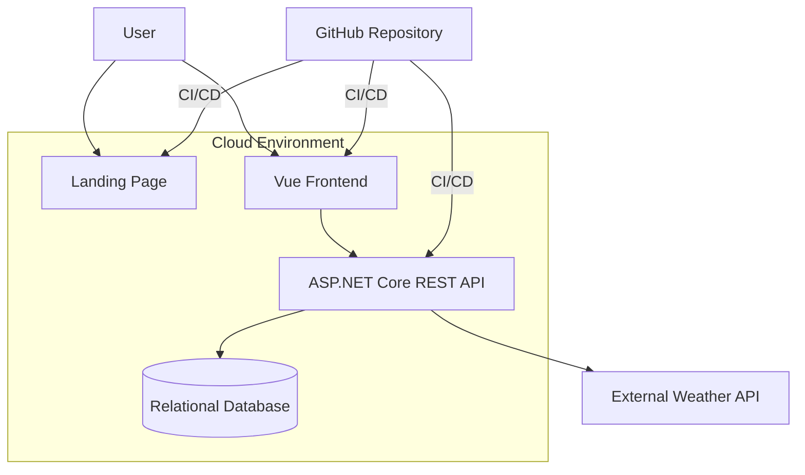
```mermaid
flowchart TB
  User["User"]
  GitHub["GitHub Repository"]

  subgraph Cloud["Cloud Environment"]
    Landing["Landing Page"]
    Frontend["Vue Frontend"]
    Backend["ASP.NET Core REST API"]
    Database[("Relational Database")]
  end

  Weather["External Weather API"]

  User --> Landing
  User --> Frontend
  Frontend --> Backend
  Backend --> Database
  Backend --> Weather

  GitHub -->|"CI/CD"| Landing
  GitHub -->|"CI/CD"| Frontend
  GitHub -->|"CI/CD"| Backend
```

#### 5.1.4.3. Ambientes

Se utilizarán tres ambientes conceptuales:

| Ambiente | Propósito |
|---|---|
| Development | Desarrollo local y validaciones iniciales. |
| Staging | Integración y validación antes de producción. |
| Production | Versión disponible para los usuarios. |

Flujo:

```text
feature/*
    ↓
Development
    ↓
develop
    ↓
Staging
    ↓
release/*
    ↓
main
    ↓
Production
```

#### 5.1.4.4. Integración continua

El repositorio podrá utilizar **GitHub Actions** para automatizar las tareas de integración y despliegue.

Pipeline conceptual:

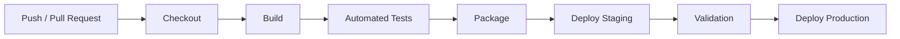
```mermaid
flowchart LR
  Commit["Push / Pull Request"]
  Checkout["Checkout"]
  Build["Build"]
  Test["Automated Tests"]
  Package["Package"]
  DeployStaging["Deploy Staging"]
  Validate["Validation"]
  DeployProd["Deploy Production"]

  Commit --> Checkout
  Checkout --> Build
  Build --> Test
  Test --> Package
  Package --> DeployStaging
  DeployStaging --> Validate
  Validate --> DeployProd
```

### Backend

```text
Checkout
↓
Restore .NET dependencies
↓
Run unit tests
↓
Run integration tests
↓
Build ASP.NET Core application (dotnet build)
↓
Publish application (dotnet publish)
↓
Deploy
```

### Frontend

```text
Checkout
↓
Install npm dependencies
↓
Run lint
↓
Run tests
↓
Build Vue application (vite build)
↓
Deploy
```

### Landing Page

```text
Checkout
↓
Validate files
↓
Build / prepare static assets
↓
Deploy
```

#### 5.1.4.5. Variables y secretos

Las credenciales, API keys, tokens y contraseñas no deberán almacenarse directamente en el repositorio.

Se utilizarán variables de entorno y secretos administrados por la plataforma de CI/CD.

Ejemplos:

```text
DATABASE_URL
DATABASE_USERNAME
DATABASE_PASSWORD
WEATHER_API_KEY
JWT_SECRET
```

Los valores reales no se incluirán en archivos versionados.

GitHub permite asociar secretos y variables a ambientes de despliegue. Además, los ambientes pueden restringir qué branches o tags tienen autorización para realizar deployments y pueden aplicar reglas de protección.

#### 5.1.4.6. Configuración de base de datos

La base de datos relacional se desplegará como un servicio administrado o recurso equivalente dentro del proveedor cloud seleccionado.

La configuración deberá considerar:

- Nombre de base de datos.
- Usuario de aplicación.
- Contraseña almacenada como secreto.
- Host.
- Puerto.
- SSL/TLS cuando sea requerido.
- Variables de conexión.
- Backups.
- Restricción de acceso desde servicios autorizados.

El Backend consumirá la configuración mediante variables de entorno, por ejemplo:

```text
DB_HOST
DB_PORT
DB_NAME
DB_USER
DB_PASSWORD
```

#### 5.1.4.7. Configuración de la API meteorológica

La API meteorológica será consumida exclusivamente desde el Backend.

```text
Frontend
   ↓
Backend
   ↓
Weather API
```

La clave de acceso de la API meteorológica deberá almacenarse como secreto:

```text
WEATHER_API_KEY
```

El Frontend no deberá contener directamente la clave privada del proveedor meteorológico.

#### 5.1.4.8. Estrategia de deployment

La estrategia propuesta es:

1. Los desarrolladores trabajan en `feature/*`.
2. Se crea un Pull Request hacia `develop`.
3. Se ejecutan las pruebas automáticas.
4. La funcionalidad aprobada se integra en `develop`.
5. Una `release/*` prepara la versión.
6. La versión se valida en staging.
7. Se integra en `main`.
8. Se crea el tag correspondiente a Semantic Versioning.
9. El pipeline despliega la versión en production.

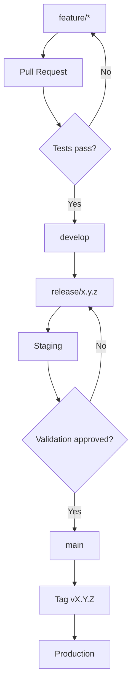
```mermaid
flowchart TD
  A["feature/*"] --> B["Pull Request"]
  B --> C{"Tests pass?"}
  C -->|"No"| A
  C -->|"Yes"| D["develop"]
  D --> E["release/x.y.z"]
  E --> F["Staging"]
  F --> G{"Validation approved?"}
  G -->|"No"| E
  G -->|"Yes"| H["main"]
  H --> I["Tag vX.Y.Z"]
  I --> J["Production"]
```

#### 5.1.4.9. Trazabilidad del deployment

Cada versión desplegada deberá poder relacionarse con:

```text
Git Commit
    ↓
Pull Request
    ↓
Branch
    ↓
Release
    ↓
Semantic Version
    ↓
Deployment
```

Esto permite identificar qué cambios forman parte de una versión determinada y facilita la recuperación ante errores.

---

## 5.2. Landing Page, Services & Applications Implementation

### 5.2.1. Sprint 1

#### 5.2.1.1. Sprint Planning 1

A continuación se presenta el resumen del Sprint Planning Meeting del Sprint 1, siguiendo la estructura establecida en el Project Statement.

| Sprint # | Sprint 1 |
| :--- | :--- |
| **Sprint Planning Background** | |
| Date | [YYYY-MM-DD] |
| Time | [HH:MM AM/PM] |
| Location | [Descripción de la ubicación de la reunión, física o virtual] |
| Prepared By | [Apellidos y Nombres del Team Leader] |
| Attendees (to planning meeting) | [Apellidos y Nombres de todos los asistentes] |
| Sprint n − 1 Review Summary | No aplica (Sprint 1 es el primer Sprint del proyecto). |
| Sprint n − 1 Retrospective Summary | No aplica (Sprint 1 es el primer Sprint del proyecto). |
| **Sprint Goal & User Stories** | |
| Sprint 1 Goal | [Redactar el Sprint Goal siguiendo el template: "Our focus is on \<Outcome\>. We believe it delivers \<Impact\> to \<Customer(s)\>. This will be confirmed when \<Event happens\>."] |
| Sprint 1 Velocity | [Cantidad de Story Points que el equipo puede aceptar en este Sprint] |
| Sum of Story Points | [Suma de Story Points de los User Stories incluidos en este Sprint] |

> El Sprint Goal debe enfocarse en el negocio o en los usuarios (por ejemplo, entregar un feature o feature-set), sin detallar cómo se implementará ni referirse a la satisfacción de un integrante del equipo o a un ítem cerrado en la herramienta de gestión.

#### 5.2.1.2. Aspect Leaders and Collaborators

Para el Sprint 1, los principales aspectos considerados dentro del alcance funcional de la solución son: Landing Page, gestión de parcelas, planificación de misiones e integración con la API meteorológica. Para cada uno de estos aspectos se identifica un líder (L) y uno o más colaboradores (C) mediante la matriz Leadership-and-Collaboration (LACX):

| Team Member (Last Name, First Name) | GitHub Username | Landing Page | Field Management | Mission Planning | Weather Integration |
| :--- | :--- | :--- | :--- | :--- | :--- |
| [Apellidos, Nombres] | [usuario-github] | L | C | C | — |
| [Apellidos, Nombres] | [usuario-github] | C | L | C | — |
| [Apellidos, Nombres] | [usuario-github] | C | C | L | C |
| [Apellidos, Nombres] | [usuario-github] | — | — | C | L |

> La organización de líderes y colaboradores debe guardar relación con la posterior asignación de tasks en el Sprint Backlog.

#### 5.2.1.3. Sprint Backlog 1

El Sprint 1 tiene como objetivo principal [resumen del objetivo del Sprint]. El Board del Sprint se gestiona en [Trello / Jira / YouTrack]: `[PEGAR URL PÚBLICO DEL BOARD]`.


| Sprint # | Sprint 1 | | | | | | |
| :--- | :--- | :--- | :--- | :--- | :--- | :--- | :--- |
| **Story Id** | **Story Title** | **Task Id** | **Task Title** | **Task Description** | **Estimation (Hours)** | **Assigned To** | **Status** |
| US-001 | [Título del User Story] | T-001 | [Título de la Task] | [Descripción de la Task] | [N] | [Apellidos, Nombres] | [To-do / In-Process / To-Review / Done] |
| US-001 | [Título del User Story] | T-002 | [Título de la Task] | [Descripción de la Task] | [N] | [Apellidos, Nombres] | [To-do / In-Process / To-Review / Done] |
| US-002 | [Título del User Story] | T-003 | [Título de la Task] | [Descripción de la Task] | [N] | [Apellidos, Nombres] | [To-do / In-Process / To-Review / Done] |

#### 5.2.1.4. Development Evidence for Sprint Review

Durante el Sprint 1 se avanzó en la implementación de [resumen de los principales avances: Landing Page, gestión de parcelas, planificación de misiones, etc.] sobre los repositorios de Landing Page, Frontend Web Application y Web Services.

| Repository | Branch | Commit Id | Commit Message | Commit Message Body | Committed on (Date) |
| :--- | :--- | :--- | :--- | :--- | :--- |
| [usuario/AgriDron-LandingPage-7760-G3] | `feature/landing-hero-section` | `[hash]` | `feat: add landing hero section` | [Descripción del cambio] | [DD/MM/YYYY] |
| [usuario/AgriDron-FrontEnd-7760-G3] | `feature/field-management` | `[hash]` | `feat: add parcel registration form` | [Descripción del cambio] | [DD/MM/YYYY] |
| [usuario/AgriDron-BackEnd-7760-G3] | `feature/field-management` | `[hash]` | `feat: add parcel entity and repository` | [Descripción del cambio] | [DD/MM/YYYY] |


#### 5.2.1.5. Execution Evidence for Sprint Review

En este Sprint se implementaron y ejecutaron las siguientes vistas: [listar vistas/pantallas implementadas]. A continuación se presentan capturas de las principales vistas alcanzadas.


**Video de navegación:** `[PEGAR ENLACE PRIVADO EN MICROSOFT STREAM]`

#### 5.2.1.6. Services Documentation Evidence for Sprint Review

Durante el Sprint 1 se documentaron los siguientes endpoints con OpenAPI Specification vía Swagger, correspondientes al bounded context de gestión de parcelas.

| Endpoint            | Verbo HTTP | Sintaxis de llamada | Parámetros | Ejemplo de Response | Explicación |
|:--------------------| :--- | :--- | :--- | :--- | :--- |
| `/api/parcels`      | GET | `GET /api/parcels` | `farmId` (query, opcional) | `[{ "id": 1, "name": "Parcel A", "areaHectares": 12.5 }]` | Devuelve la lista de parcelas registradas, opcionalmente filtradas por finca. |
| `/api/parcels`      | POST | `POST /api/parcels` | Body: `{ "name": "string", "areaHectares": "number", "farmId": "int" }` | `{ "id": 2, "name": "Parcel B", "areaHectares": 8.0 }` | Registra una nueva parcela asociada a una finca. |
| `/api/parcels/{id}` | GET | `GET /api/parcels/{id}` | `id` (path) | `{ "id": 1, "name": "Parcel A", "areaHectares": 12.5 }` | Devuelve el detalle de una parcela específica. |


**Repositorio de Web Services:** `[PEGAR URL DEL REPOSITORIO]`

**Commits relacionados con documentación en este Sprint:**

| Commit Id | Commit Message                                       |
|:----------|:-----------------------------------------------------|
| `[hash]`  | `docs: add OpenAPI annotations for parcel endpoints` |

#### 5.2.1.7. Software Deployment Evidence for Sprint Review

Durante el Sprint 1 se realizaron las siguientes actividades relacionadas con Deployment: creación de cuentas en el proveedor cloud seleccionado, configuración de los recursos iniciales para el Landing Page y configuración del proyecto para automatizar el despliegue mediante GitHub Actions.

[Describir paso a paso lo realizado: creación de cuenta, configuración de recursos, variables de entorno, primer despliegue exitoso, etc.]


**URL desplegada (Landing Page):** `[PEGAR URL DE DESPLIEGUE]`

#### 5.2.1.8. Team Collaboration Insights during Sprint

[Describir cómo se desarrollaron las actividades de implementación durante el Sprint 1, precisando la forma de trabajo del equipo (pair programming, revisión de Pull Requests, reuniones diarias, etc.). Debe evidenciarse que todos los integrantes del equipo tuvieron participación en la implementación de los productos correspondientes a este Sprint: Landing Page, Frontend Web Application y/o Web Services.]


> Esta sección debe expandirse en cada Sprint y ser coherente con las evidencias de commits presentadas en la sección 5.2.n.4.

---

## 5.3. Validation Interviews

> Esta sección corresponde a las entregas en las que se cuenta con Landing Page y prototipos/productos desplegados para validar (AV2 / TB2). El equipo debe realizar entrevistas de validación en las que usuarios de los segmentos objetivo interactúen con el Landing Page y las aplicaciones.

### 5.3.1. Diseño de Entrevistas

Para cada segmento objetivo se especifican los elementos a validar en el Landing Page y en las aplicaciones, así como los user flows que forman parte del proceso de validación.

| Segmento     | Elementos a validar en Landing Page | User Flows a validar en la aplicación |
|:-------------|:------------------------------------|:--------------------------------------|
| [Segmento 1] | [Secciones, call-to-action, etc.]   | [User Flow 1, User Flow 2]            |
| [Segmento 2] | [Secciones, call-to-action, etc.]   | [User Flow 1, User Flow 2]            |

### 5.3.2. Registro de Entrevistas

Se requieren de 3 a 5 entrevistas por segmento objetivo. Cada entrevista debe registrarse en video (ver Anexo C del Project Statement: Videos de Exposiciones) y resumirse a continuación.

**Entrevista N° [N] — Segmento: [Segmento]**

- **Nombres y apellidos:** [Nombre]
- **Edad:** [Edad]
- **Distrito:** [Distrito]
- **Fecha:** [Fecha]
- **Timing en el video consolidado:** [hh:mm:ss] — **Duración:** [mm:ss]


**Resumen:** [Descripción de las principales apreciaciones del entrevistado con respecto a las tareas asignadas al interactuar con el Landing Page y la aplicación.]

> Repetir esta estructura para cada entrevista (3 a 5 por segmento).

**Video consolidado de entrevistas de validación:** `[PEGAR ENLACE PRIVADO EN MICROSOFT STREAM]`

### 5.3.3. Evaluaciones según Heurísticas

Se aplica el formato de evaluación heurística indicado en el Anexo D del Project Statement (Usability, Inclusive Design, Information Architecture), cubriendo las tareas evaluadas durante las sesiones de validación.

**Tareas evaluadas:** [Listar las tareas incluidas en el alcance de la evaluación, p. ej. registro de usuario, planificación de misión, consulta de reporte, etc.]

**Tabla resumen de problemas encontrados:**

| #     | Problema                   | Escala de severidad | Heurística / Principio violado                                                   |
|:------|:---------------------------|:--------------------|:---------------------------------------------------------------------------------|
| 1     | [Descripción del problema] | [1-4]               | [Usability / Inclusive Design / Information Architecture: heurística específica] |
| 2     | [Descripción del problema] | [1-4]               | [Heurística específica]                                                          |

**Descripción de problemas:** para cada problema de la tabla, incluir severidad, heurística violada, descripción detallada con captura de pantalla y recomendación de mejora, siguiendo el formato del Anexo D.

---

## 5.4. Video About-the-Product

El Video About-the-Product tiene un enfoque promocional, dirigido tanto a visitantes del Landing Page como a usuarios de las aplicaciones. Resume el modelo de negocio, las características y beneficios de AgriDron Solutions, e incluye escenas de interacción con el producto y al menos un testimonio positivo por cada segmento objetivo, obtenido durante las entrevistas de validación.


- **Duración:** [1 a 3 minutos]
- **URL en Microsoft Stream (enlace privado):** `[PEGAR ENLACE]`
- **URL en YouTube (para incrustar en el Landing Page):** `[PEGAR ENLACE]`

**Descripción del contenido:**

[Describir brevemente la estructura del video: presentación del modelo de negocio, demostración de funcionalidades clave, testimonios por segmento, cierre.]

> El video debe estar incrustado en una sección adecuada del Landing Page, además de estar publicado en Microsoft Stream y YouTube.

---

# Conclusiones

## Conclusión 1

El proceso de Lean UX y Needfinding aplicado durante esta primera etapa permitió confirmar la existencia del problema planteado en el Problem Statement: los dos segmentos objetivo identificados —Agricultores y Administradores de Fincas, y Operadores Técnicos y Proveedores de Fumigación con Drones— dependen actualmente de métodos manuales (cuadernos de campo, hojas de Excel dispersas y coordinación por WhatsApp) para delimitar parcelas, planificar fumigaciones y sustentar el trabajo realizado ante el cliente. Las entrevistas evidenciaron de forma consistente (100% de los casos en ambos segmentos) pérdidas económicas por deriva de producto ante vientos imprevistos y ausencia de un registro digital confiable, lo cual valida las Business Assumptions y User Assumptions planteadas en el Lean UX Canvas y da sustento a la propuesta de valor de AgriDron Solutions frente a competidores como DroneDeploy, Climate FieldView y Agrivi, cuyas soluciones no están diseñadas para predios pequeños y medianos.

## Conclusión 2

El diseño de la solución, incluyendo la Arquitectura de Software (C4 Model), el Diseño Orientado a Objetos y el Diseño de Base de Datos, se estructuró en coherencia directa con los Bounded Contexts identificados en el Event Storming (Field Management, Flight Operations, Weather Integration y Analytics & Reporting) y con las User Stories priorizadas en el Product Backlog. La decisión de implementar el Frontend con Vue y PrimeVue, y los Web Services con ASP.NET Core y C# sobre una base de datos relacional, responde a los lineamientos tecnológicos establecidos para el curso y permite una separación clara de responsabilidades entre la Landing Page, la Web Application y la API RESTful, facilitando el desarrollo incremental por Sprints.

## Conclusión 3

Durante el Sprint 1 el equipo logró desplegar la primera versión del Landing Page, cumpliendo con el alcance mínimo exigido para esta entrega (AV1), y estableció la configuración base del entorno de desarrollo, el flujo de trabajo en GitHub bajo GitFlow, Conventional Commits y Semantic Versioning, y la configuración inicial del pipeline de despliegue. Esto sienta una base ordenada de Software Configuration Management sobre la cual se apoyará la implementación de la Frontend Web Application y los Web Services en los siguientes Sprints.

## Recomendaciones

- Completar y validar con mayor profundidad los perfiles "Desconocido" registrados en el Registro de Entrevistas (fechas, edades y distritos pendientes), de modo que el Análisis de Entrevistas y los User Personas queden totalmente sustentados antes de la siguiente entrega.
- Priorizar en el Sprint 2 las User Stories relacionadas con la delimitación de parcelas sobre mapa satelital y las alertas meteorológicas automáticas, dado que ambos segmentos las calificaron como el mayor diferenciador frente a sus métodos actuales.
- Avanzar en paralelo con el despliegue de la primera versión de la Frontend Web Application, de forma que en TB1 se cuente con una experiencia end-to-end mínima entre Landing Page y Web Application, tal como exige el enunciado del trabajo final.
- Reforzar la evidencia de colaboración en GitHub (commits y Pull Requests) de todos los integrantes del equipo desde el Sprint 2, para sustentar de forma más completa la sección de Student Outcome y el Team Collaboration Insights.
- Iniciar la implementación de los primeros endpoints del RESTful API documentados con Swagger/OpenAPI, priorizando el bounded context de Field Management, para no acumular carga de desarrollo del backend hacia el final del ciclo de vida del proyecto.

---

# Bibliografía

> Fuentes utilizadas, registradas siguiendo el formato APA 7ª edición, en orden alfabético por apellido del primer autor.

1. García-Munguía, A., Guerra-Ávila, P. L., Islas-Ojeda, E., Flores-Sánchez, J. L., Vázquez-Martínez, O., García-Munguía, A. M., & García-Munguía, O. (2024). A review of drone technology and operation processes in agricultural crop spraying. *Drones*, *8*(11), 674. https://doi.org/10.3390/drones8110674

2. Organización de las Naciones Unidas para la Alimentación y la Agricultura. (s. f.). *Acerca de producción y protección vegetal*. FAO. Recuperado el 21 de febrero de 2025, de https://www.fao.org/plant-production-protection/about/es

3. Safaeinejad, M., Karami, H., Ranjbar, S., Bakhoda, H., & Ahmadi, E. (2025). Reducing energy and environmental footprint in agriculture: A study on drone spraying vs conventional methods. *PLOS ONE*, *20*(9), e0323779. https://doi.org/10.1371/journal.pone.0323779

4. Zhang, Y., Li, H., Torres-Sánchez, J., & García, C. (2024). Drones in precision agriculture: A comprehensive review of applications, technologies, and challenges. *Drones*, *8*(11), 686. https://doi.org/10.3390/drones8110686

---

# Anexos

## Anexo A: Evidencias adicionales

[PEGAR AQUÍ EVIDENCIAS ADICIONALES.]

## Anexo B: Videos de Exposiciones

**Video de exposición:** [ENLACE]

## Anexo C: Otros

[AGREGAR OTROS ANEXOS SI CORRESPONDE.]

