# Capítulo II: Requirements Elicitation & Analysis.

Para validar la propuesta de valor de AgriDron Solutions y asegurar un posicionamiento estratégico diferenciado en el sector agro-tecnológico, se ha realizado una investigación exhaustiva de las soluciones digitales existentes en el mercado. A continuación, se detallan los tres principales competidores identificados, analizando su modelo operativo, funcionalidades clave y alcance en el soporte a las labores agrícolas:

- DroneDeploy: Plataforma en la nube especializada en la captura, procesamiento y análisis de datos geoespaciales mediante drones. En el sector agrícola, opera permitiendo la planificación automatizada de vuelos sobre campos de cultivo y el procesamiento de mapas ortomosaicos e índices de vegetación (NDVI) para la detección de anomalías en los lotes. Su funcionamiento se basa en la sincronización de hardware comercial con su software web para generar reportes analíticos de salud vegetal y coordinar cuadrillas de trabajo.

- Climate FieldView: Plataforma digital integral de gestión agronómica desarrollada por The Climate Corporation (división digital de Bayer). Funciona mediante la recopilación e integración de datos generados por sensores climáticos, satélites y maquinaria terrestre conectada al puerto de diagnóstico (FieldView Drive). Su software permite a los productores monitorear el desarrollo de sus campos, generar prescripciones variables de siembra y fertilizantes, y consultar datos meteorológicos hiperlocales para la toma de decisiones preventivas en campo.

- Agrivi: Software integral de gestión de explotaciones agrícolas (Farm Management Software - FMS) basado en el modelo SaaS en la nube. Su funcionamiento abarca la planificación completa de labores agrícolas, administración de inventarios de insumos químicos, trazabilidad de cosechas y registro de costos de producción. Además, integra alertas meteorológicas basadas en modelos predictivos para advertir sobre el riesgo de plagas y enfermedades, permitiendo llevar una bitácora detallada de las actividades de campo.

### 2.1.1. Análisis Competitivo

#### Competitive Analysis Landscape

*¿Por qué llevar a cabo este análisis?* El objetivo de este análisis es evaluar las soluciones digitales agropecuarias actuales para identificar brechas de mercado, validar nuestra ventaja competitiva en la planificación y monitoreo de fumigación con drones, y estructurar una oferta accesible para pequeños y medianos agricultores.

| Categoría | Subcategoría | AgriDron Solutions | DroneDeploy | Climate FieldView | Agrivi |
|---|---|---|---|---|---|
| **Perfil** | Logo / Identificador |  |  |  |  |
| **Perfil** | Overview | Plataforma web distribuida e interoperable diseñada para la planificación sobre mapas interactivos, validación climática vía API externa y simulación de telemetría para operaciones de fumigación con drones. | Plataforma empresarial de software para mapeo aéreo, fotogrametría 3D y análisis multiespectral con drones. | Plataforma digital corporativa enfocada en la recolección masiva de datos agronómicos terrestres y satelitales. | Sistema integral de planificación de recursos agrícolas (Farm ERP) en la nube enfocado en gestión y cumplimiento normativo. |
| **Perfil** | Ventaja competitiva / ¿Qué valor ofrece? | Plataforma web abierta e intuitiva que integra delimitación de polígonos, consulta meteorológica en tiempo real y seguimiento de drones sin ataduras a hardware propietario. Automatiza el flujo de fumigación, reduce el desperdicio de insumos químicos, previene pérdidas por clima adverso y ofrece visibilidad operativa en tiempo real. | Algoritmos líderes de procesamiento rápido de ortomosaicos y amplia compatibilidad con marcas de drones comerciales. Ofrece información visual de alta resolución del estado del campo y herramientas de medición de áreas y elevación. | Respaldo y validación agronómica global de Bayer, con integración directa a maquinaria pesada y satélites. Optimiza el rendimiento de la cosecha mediante decisiones basadas en datos climáticos e históricos del suelo. | Módulo exhaustivo de trazabilidad agrícola, cumplimiento de certificaciones internacionales y gestión financiera del cultivo. Centraliza la administración de la finca, control de inventarios y reducción de costos operativos. |
| **Perfil de Marketing** | Mercado objetivo | Pequeños y medianos agricultores (PyMAs), cooperativas agrarias y operadores técnicos de drones de fumigación. | Grandes corporaciones agrícolas, empresas de ingeniería, construcción e inspección aérea. | Medianos y grandes productores agrícolas con maquinaria mecanizada y tecnificada. | Medianas y grandes empresas agroexportadoras, consultores agrícolas y cadenas agroalimentarias. |
| **Perfil de Marketing** | Estrategias de marketing | Marketing digital educativo, demostraciones en cooperativas locales, esquema freemium para visualización de parcelas y alianzas con técnicos de campo. | Venta directa enterprise, marketing de contenidos B2B global, eventos del sector aeroespacial y certificaciones técnicas. | Distribución a través de redes de concesionarios de insumos Bayer, patrocinios agrícolas y pruebas de campo a gran escala. | Marketing inbound, presencia en conferencias globales AgTech, certificaciones digitales y canal de consultoría especializada. |
| **Perfil de Producto** | Productos & Servicios | Aplicación web (Vue), servicio RESTful (ASP.NET Core), landing page informativa, módulo de clima por API y simulador de telemetría de vuelo. | Software en la nube, aplicación móvil de control de vuelo, módulo de análisis NDVI y visor de ortofotos 2D/3D. | Aplicación web y móvil, dispositivo FieldView Drive para tractores, mapas satelitales y prescripciones de siembra. | Plataforma web/móvil FMS, módulo de control de plagas, gestión de bodegas, reportes de auditoría y app de tareas de campo. |
| **Perfil de Producto** | Precios & costos | Esquema de suscripción modular mensual/anual económico, adaptado por cantidad de hectáreas gestionadas. | Modelo de suscripción SaaS anual de costo elevado (desde cientos hasta miles de USD anuales por usuario). | Suscripción anual base más costos adicionales por dispositivos de conexión física y hectáreas monitoreadas. | Suscripción SaaS por niveles basada en el número de hectáreas y módulos empresariales contratados (alto costo). |
| **Perfil de Producto** | Canales de distribución | Aplicación web responsive (Desktop y Mobile) accesible desde cualquier navegador estándar y Landing Page oficial. | Plataforma web SaaS, aplicación móvil (iOS/Android) y portal en la nube. | Plataforma web, aplicaciones móviles (iOS/Android) y canal de distribución físico de hardware. | Plataforma web SaaS y aplicación móvil operativa para smartphones y tablets. |
| **Análisis SWOT** | Fortalezas | Plataforma web moderna sobre arquitectura distribuida escalable (ASP.NET Core y Vue). Enfoque especializado en planificación, validación climática y monitoreo de fumigación aérea sin hardware cautivo. Curva de aprendizaje mínima. Integración directa con pronóstico meteorológico. | Algoritmos de procesamiento rápido de ortomosaicos y modelado 3D reconocidos como líderes del mercado. Amplia base de usuarios consolidada a nivel global y alta compatibilidad con marcas de drones comerciales. | Respaldo corporativo de Bayer (Climate Corporation), con más de 36M de hectáreas pagadas gestionadas globalmente. Integración nativa con maquinaria John Deere vía FieldView Drive. | Cobertura integral del ciclo agrícola, desde planificación hasta reportes financieros. Soporte al cliente calificado consistentemente como receptivo y de calidad por los usuarios. |
| **Análisis SWOT** | Debilidades | Startup en etapa inicial con menor músculo financiero y base de clientes reducida. Dependencia inicial de simulación de telemetría antes de la integración masiva con hardware físico. Marca nueva sin reconocimiento previo en ferias agrarias. | Precios elevados y esquema de suscripción percibido como confuso por los usuarios (planes desde $1,908 hasta más de $4,000 USD anuales). Procesamiento lento y problemas de carga reportados con frecuencia, además de funciones básicas de medición no disponibles en planes gratuitos. | Fallas de conectividad, errores de la aplicación y una interfaz calificada como confusa por algunos usuarios. Funcionalidades de monitoreo y pronóstico menos sofisticadas fuera de EE.UU., con reportes de auditoría e inventario más limitados que herramientas especializadas. | Integraciones con servicios externos de clima e IoT resultan costosas para usuarios pequeños. Módulo financiero carece de funciones contables completas, y la transparencia de precios es limitada en materiales públicos. |
| **Análisis SWOT** | Oportunidades | Creciente interés de pequeños y medianos agricultores por modernizar la fumigación. Brecha de mercado desatendida por competidores de alto costo (DroneDeploy, Agrivi). Necesidad de cooperativas locales de centralizar la supervisión de múltiples lotes. | Expansión hacia nuevos sectores más allá de la agricultura, como construcción, minería e inspección de infraestructura. Creciente demanda de automatización con IA en la captura y análisis de datos aéreos. | Expansión internacional hacia más países y tipos de cultivo, aprovechando su reciente entrada a mercados como el Reino Unido y Europa. Creciente demanda de decisiones agronómicas basadas en datos climáticos e históricos. | Crecimiento del mercado de software agrícola entre cooperativas y medianas empresas agroexportadoras. Mayor exigencia regulatoria de trazabilidad y cumplimiento de certificaciones internacionales. |
| **Análisis SWOT** | Amenazas | Resistencia cultural al cambio tecnológico. Expansión o reducción de precios de plataformas consolidadas (Bayer Climate FieldView) hacia segmentos pequeños. Deficiencias de conectividad rural. | Surgimiento de competidores especializados y más económicos en nichos específicos (como AgriDron en fumigación de PyMAs), que ofrecen soluciones más simples y accesibles. | Dependencia de la infraestructura y las políticas de uso de datos de una gran corporación (Bayer), lo que genera cuestionamientos sobre privacidad. Resistencia de agricultores a compartir información sensible con terceros. | Competencia de plataformas más simples y económicas orientadas a operaciones pequeñas. Complejidad percibida del sistema, que puede alejar a productores con menor alfabetización digital. |
### 2.1.2. Estrategias y tácticas frente a competidores

| Estrategia / Táctica | Descripción |
|---|---|
| **Alerta Climática Preventiva** | Implementar bloqueo automático de vuelos de fumigación cuando la API meteorológica detecte viento, lluvia o humedad fuera de rango seguro, evitando deriva química y desperdicio de insumos. |
| **Onboarding sin Fricción** | Diseñar un flujo de registro e interfaz con curva de aprendizaje mínima, pensado para agricultores con alfabetización digital intermedia o baja, sin necesidad de capacitación técnica extensa como la que exigen Agrivi o DroneDeploy. |
| **Alianzas con Cooperativas Agrarias** | Establecer demostraciones y pilotos gratuitos en cooperativas locales, generando adopción boca a boca y validando el producto en predios de 5 a 50 hectáreas, el segmento desatendido por los competidores. |
| **Suscripción Escalable por Hectárea** | Modelo de precios modular mensual/anual ajustado a la cantidad de hectáreas gestionadas, permitiendo que pequeños productores paguen montos accesibles frente a los esquemas fijos de alto costo de DroneDeploy, Climate FieldView y Agrivi. |
| **Panel Colaborativo Multi-Lote** | Centralizar en un solo tablero la supervisión de múltiples parcelas y operadores de drones, facilitando la coordinación de cooperativas que gestionan varios lotes dispersos simultáneamente. |

*Tabla. Estrategias y tácticas frente a competidores*

## 2.2. Entrevistas

### 2.2.1. Diseño de entrevistas

**Objetivo de la entrevista:** El objetivo de las entrevistas es recopilar evidencia sobre los flujos operativos, limitaciones tecnológicas y necesidades críticas de pequeños agricultores y técnicos de campo que utilizan drones como técnica principal de fumigación, con el fin de modelar perfiles de usuario precisos y fundamentar el diseño funcional de la plataforma web AgriDron.

**Segmento 1: Pequeños y Medianos Agricultores / Propietarios de Fincas**

**Preguntas:**

- ¿Cuál es su nombre, edad y en qué distrito o valle agrícola se encuentra ubicado su predio?
- ¿Qué tipos de cultivo maneja principalmente y cuántas hectáreas tiene bajo su administración?
- ¿Qué dispositivos utiliza con mayor frecuencia para coordinar sus labores (computadora, laptop, smartphone Android/iOS) y qué navegador web suele utilizar (Chrome, Edge, Safari)?
- ¿Qué aplicaciones o herramientas digitales utiliza con regularidad para comunicarse o gestionar compras/ventas (WhatsApp, banca móvil, hojas de Excel, redes sociales)?
- ¿Qué método utiliza actualmente para la fumigación y control de plagas en sus parcelas?
- ¿Cómo detecta, delimita y registra la presencia de una plaga o enfermedad en un lote específico?
- ¿Por qué considera que los métodos de fumigación que utiliza hoy en día le generan sobrecostos, demoras o riesgos en su cosecha?
- ¿Quiénes toman la decisión de programar una fumigación y cómo supervisa o verifica usted el trabajo realizado por los aplicadores en campo?
- ¿Con qué frecuencia y en qué momentos de la temporada agrícola requiere aplicar tratamientos a sus cultivos?
- ¿Cuándo y por qué medio consulta el pronóstico del clima antes de fumigar, y cómo le afecta un cambio repentino de viento o lluvia durante la labor?
- ¿Dónde lleva el registro de los límites de sus parcelas, fechas de fumigación y tipos de insumos químicos aplicados?
- Si una plataforma web le permitiera dibujar sus parcelas sobre un mapa satelital para ordenar un servicio de dron, ¿cómo le resultaría más fácil hacerlo y qué apoyo requeriría para utilizarla?
- ¿Cuánto consideraría razonable pagar mensualmente por un software web que le ayude a planificar y certificar los servicios de fumigación?
- ¿Qué tan útil le resultaría recibir una alerta meteorológica automática que le indique si es viable o no fumigar antes de contratar al operador?
- En caso de que una fumigación se interrumpa por mal clima o imprevistos de campo, ¿cómo le gustaría recibir el reporte de avance y reprogramar las hectáreas pendientes desde la web?

**Segmento 2: Operadores Técnicos y Proveedores de Servicios de Fumigación con Drones**

**Preguntas:**

- ¿Cuál es su nombre, edad y en qué valles o zonas agrícolas presta principalmente sus servicios de fumigación o consultoria agricola?
- ¿Qué formación técnica o experiencia previa tiene en el manejo y operación de drones agrícolas o agronomía?
- ¿Qué dispositivos utiliza habitualmente durante su jornada de trabajo (smartphone Android/iOS, tablet de campo, laptop) y qué navegadores web utiliza con frecuencia?
- ¿Qué herramientas digitales utiliza actualmente para coordinar su agenda de clientes, facturación o rutas de trabajo (WhatsApp, Google Calendar, hojas de cálculo, correo electrónico)?
- ¿Qué información técnica del predio necesita conocer antes de trasladar su equipo al campo (cultivo, tipo de producto, ubicación exacta de linderos, obstáculos visuales)?
- ¿Qué modelo o capacidad de dron utiliza y qué tipo de servicios de fumigación ofrece habitualmente (preventivos, curativos)?
- ¿Por qué se presentan malentendidos o disputas con los agricultores respecto al área total realmente cubierta o la calidad de la aplicación?
- ¿Por qué le resulta ineficiente o desgastante la forma en que coordina sus horarios y atiende las llamadas o mensajes de cotización hoy en día?
- ¿Con quién coordina los detalles de la aplicación en el predio (dueño de finca, otro asesor técnico) y quién valida la conformidad del servicio al terminar la labor?
- ¿En qué momento y a través de qué fuentes evalúa las condiciones climáticas (velocidad de viento, humedad, temperatura) antes de autorizar el despegue?
- ¿Dónde y cómo registra la bitácora de servicios realizados (hectáreas tratadas, químicos descargados, incidencias o fallas en campo)?
- ¿Cómo define o verifica actualmente el perímetro exacto que debe fumigar si el agricultor solo le da referencias verbales o ubicaciones aproximadas por WhatsApp?
- Si surge un imprevisto en campo (cambio brusco de viento, lluvia repentina, avería de equipo o falta de producto), ¿cómo gestiona y documenta la suspensión para justificar el avance parcial ante el cliente?
- ¿Cuánto cobra habitualmente por hectárea fumigada?
- Si contara con una plataforma web donde pudiera ver las órdenes de servicio en un calendario con la parcela ya dibujada en un mapa satelital interactivo, ¿en qué medida agilizaría su trabajo previo al vuelo?
- ¿Qué tan útil le resultaría contar con una bitácora web donde al finalizar la labor pueda registrar en un formulario rápido el total de hectáreas tratadas, el volumen aplicado y subir observaciones para que el agricultor las revise de inmediato?
- Si la plataforma web le ofreciera alertas climáticas automáticas basadas en APIs meteorológicas para justificar técnicamente ante el agricultor por qué una labor debe pausarse o reprogramarse, ¿cómo impactaría en su relación con el cliente?
- ¿Qué tan útil sería ver en tiempo real el estado del dron (batería, posición, avance) mientras se ejecuta la fumigación?

### 2.2.2. Registro de entrevistas

Para la recolección de requerimientos y el análisis de necesidades, se llevaron a cabo entrevistas a profundidad con representantes de los dos segmentos objetivo del proyecto: **Segmento 1 (Agricultores y dueños de Fincas)** y **Segmento 2 (Operadores Técnicos de Fumigación con Drones)**. 

#### Segmento 1: Agricultores y Administradores de Fincas

##### Entrevista #1

*[Ver entrevista 1](https://drive.google.com/file/d/1bX9HVre3tKKn_i6xJ4ZcYVOJnFxwul1M/view?usp=sharing)*

**Resumen de entrevista:**

Camila Ramos Paucar, estudiante de 10mo ciclo de Agronomía y administradora del fundo familiar de 18 hectáreas (12 ha de uva de mesa y 6 ha de espárrago) en Subtanjalla, Ica, opera en campo con un smartphone Android y consolida información por las noches en su laptop con Google Chrome, usando WhatsApp para coordinar con cuadrillas y proveedores, banca móvil para transacciones y Excel para contabilidad. Controla plagas combinando un tractor de brazos rociadores en zonas planas con cuadrillas de mochilas manuales a motor en zonas densas, y le frustra el excesivo consumo de agua y agroquímicos del tractor, el daño mecánico a ramas bajas y el riesgo fitosanitario de las mochilas. Registra parcelas e incidencias a mano en cuadernos y planos en papel, pasándolos luego a Excel, y sufre pérdidas económicas cuando el viento de la tarde en Ica provoca deriva del producto o evaporación. Es metódica, analítica y orientada a la tecnificación sustentable. Considera intuitivo delimitar sus lotes en un mapa satelital interactivo con una breve inducción, valora críticamente las alertas meteorológicas automáticas para evitar gastos en vano y exige que, ante suspensiones climáticas, la plataforma le indique visualmente qué franja fue tratada y cuál quedó pendiente. Está dispuesta a pagar una suscripción mensual de entre 80 y 120 soles.

| Detalle | Información |
|:---|:---|
| **Entrevistador** | Alexander Vasquez |
| **Entrevistado** | Camila Ramos Paucar |
| **Edad** | 25 años |
| **Ubicación** | Distrito de Subtanjalla, Valle de Ica |
| **Duración / Empieza en** | 4:42 / 0:00 |
| **Enlace** | https://drive.google.com/file/d/1bX9HVre3tKKn_i6xJ4ZcYVOJnFxwul1M/view?usp=sharing |

##### Entrevista #2

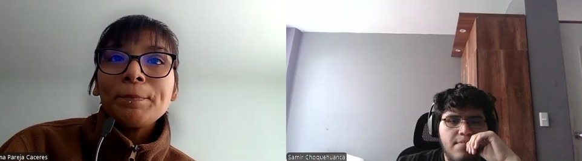

*[Ver entrevista 2](https://drive.google.com/file/d/1bX9HVre3tKKn_i6xJ4ZcYVOJnFxwul1M/view?usp=sharing)*

**Resumen de entrevista:**

Diana, en representación de su padre Rómulo Huamán Ccora (52 años), administra un predio de 12 hectáreas en el valle de Barranca, distrito de Supe, dedicado principalmente a maíz amarillo duro y algo de espárrago, repartido en tres lotes. La coordinación del predio se maneja casi por completo desde un smartphone Android, usando Chrome para navegar cuando es necesario; no cuentan con laptop en la chacra y solo ocasionalmente acceden a una computadora en la cabina de Internet del pueblo. WhatsApp es el canal principal para coordinar con proveedores de insumos y con el operador del dron, Yape se usa para los pagos, y Facebook se revisa poco, más que nada para publicaciones de la cooperativa. Antes fumigaban con mochila a motor, pero desde hace dos años contratan a un operador de dron particular por ser más rápido para las 12 hectáreas. Detectan las plagas caminando el lote y observando las hojas dañadas, sin un registro formal más allá de alguna foto suelta en el celular. Manifiestan frustración porque el operador aplica de más o de menos en ciertas zonas, ya que los límites del terreno y los obstáculos (huecos, postes) se le explican solo de palabra, lo que les ha generado pérdida de producto y dinero. La decisión de fumigar la toma Rómulo según el estado del cultivo, y la supervisión se limita a observar el vuelo desde la chacra, sin poder saber con certeza cuánta área quedó cubierta hasta caminarla después. Aplican entre 3 y 4 veces por campaña de maíz, sobre todo en la etapa de crecimiento vegetativo y ante la aparición de cogollero. Consultan el clima en una app del celular un día antes, aunque no siempre es precisa para su zona, y cuando el viento cambia de golpe durante la fumigación el operador a veces detiene la labor sin dejarles un sustento claro del motivo ni del avance real. No llevan registro digital: algunas fechas se anotan en un cuaderno de la chacra, mientras que los límites del terreno se conservan de memoria. Consideran positiva la idea de una plataforma donde dibujar sus parcelas sobre un mapa satelital, siempre que incluya una inducción inicial o el apoyo de un técnico para marcar bien los lotes la primera vez. Estarían dispuestos a pagar entre 30 y 40 soles mensuales, siempre que la herramienta ayude a evitar las pérdidas actuales por mala cobertura, valoran mucho una alerta meteorológica automática antes de contratar al operador para no perder el adelanto pagado, y preferirían recibir en el celular un aviso claro de cuánto se fumigó y qué parte quedó pendiente, para reprogramar esa área sin tener que renegociar todo de nuevo.

| Detalle | Información |
|:---|:---|
| **Entrevistador** | Alejandro Choquehuanca |
| **Entrevistado** | Diana (en representación de su padre, Rómulo Huamán Ccora) |
| **Edad** | 25 (Rómulo Huamán Ccora: 52 años) |
| **Ubicación** | Distrito de Supe, Valle de Barranca, Lima |
| **Duración / Empieza | 7:08 / 4:43 | 
| **Enlace** | https://drive.google.com/file/d/1bX9HVre3tKKn_i6xJ4ZcYVOJnFxwul1M/view?usp=sharing |

##### Entrevista #3

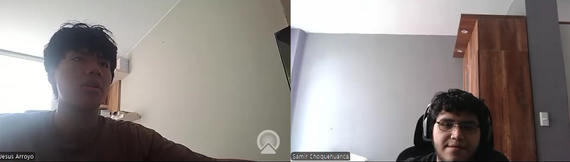

*[Ver entrevista 3](https://drive.google.com/file/d/1bX9HVre3tKKn_i6xJ4ZcYVOJnFxwul1M/view?usp=sharing)*

**Resumen de entrevista:**

Jesus, de 34 años, es técnico en mecatrónica y piloto certificado de drones desde hace tres años, y presta servicios de fumigación principalmente en los valles de Huaral y Barranca. Utiliza un smartphone Android para sus actividades diarias, una tablet para operar el software del dron y una laptop principalmente por las noches para revisar correos, usando Google Chrome como navegador. Coordina sus servicios y cotizaciones mediante WhatsApp, organiza sus citas en Google Calendar y lleva la facturación en Excel, aunque suele tener cruces de horarios debido a que registra las citas mientras responde mensajes. Opera un dron agrícola de 20 litros y ofrece aplicaciones preventivas y curativas. Antes de trasladarse al predio necesita conocer el cultivo, el producto y especialmente los linderos exactos, pero los agricultores suelen enviarle ubicaciones aproximadas por WhatsApp, por lo que debe llegar con anticipación y caminar los límites junto al propietario para identificar también obstáculos como postes o árboles. Esta situación le genera pérdida de tiempo y dificultades para organizar sus servicios, además de recibir solicitudes y cotizaciones incluso mientras se encuentra realizando un vuelo. También enfrenta malentendidos con los agricultores porque no cuenta con una forma visual y precisa de demostrar cuánta superficie fue realmente cubierta, mientras que los clientes suelen estimar las hectáreas "al ojo". La bitácora de los servicios la registra en una libreta física y, cuando dispone de tiempo, la transcribe a Excel, por lo que las incidencias no siempre quedan documentadas de manera detallada. Ante cambios bruscos de viento, lluvias, averías o falta de producto, explica verbalmente al agricultor el motivo de la suspensión, pero no dispone de un reporte técnico que respalde la decisión ni el avance parcial realizado. Evalúa las condiciones climáticas la noche anterior y la misma mañana mediante una aplicación genérica del celular, aunque esta no siempre proporciona información específica sobre el viento en la ubicación exacta. Cobra aproximadamente entre 35 y 45 soles por hectárea. Considera que una plataforma con órdenes de servicio, calendario y parcelas previamente delimitadas en un mapa satelital le permitiría ahorrar tiempo al evitar desplazarse antes al predio para verificar los linderos. También considera muy útil una bitácora web para registrar rápidamente las hectáreas tratadas, el volumen aplicado y las observaciones, ya que permitiría al agricultor consultar la información inmediatamente y reducir reclamos. Valora especialmente las alertas climáticas automáticas respaldadas por datos meteorológicos, porque le permitirían justificar técnicamente las suspensiones o reprogramaciones ante el cliente. Finalmente, considera clave contar con una vista en tiempo real del dron que integre batería, posición y avance en una sola pantalla para reaccionar con mayor rapidez ante cualquier inconveniente durante la fumigación.

| Detalle | Información |
|:---|:---|
| **Entrevistador** | Alejandro Choquehuanca |
| **Entrevistado** | Jesus |
| **Edad** | 34 años |
| **Ubicación** | Valle de Huaral y Barranca, Lima |
| **Duración / Empieza** | 8:13 / 11:51 |
| **Enlace** | https://drive.google.com/file/d/1bX9HVre3tKKn_i6xJ4ZcYVOJnFxwul1M/view?usp=sharing |

#### Segmento 2: Operadores Técnicos y Proveedores de Fumigación con Drones

##### Entrevista #4

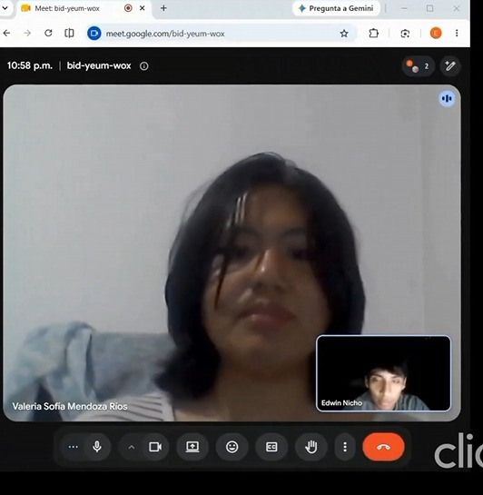

*[Ver entrevista 4](https://drive.google.com/file/d/1bX9HVre3tKKn_i6xJ4ZcYVOJnFxwul1M/view?usp=sharing)*

**Resumen de entrevista:**

Valeria Sofía Mendoza Ríos, estudiante de 8vo ciclo de Ingeniería Agrícola y operadora de drones agrícolas en el valle de Cañete (con salidas a Mala y Chincha), utiliza la tablet integrada al control del dron y su teléfono en campo, y al finalizar la jornada su laptop con Google Chrome para planificar vuelos, cartografía y reportes; coordina citas por WhatsApp, organiza compromisos en Google Calendar y gestiona costos y mantenimiento en Google Sheets. Opera drones de 30 litros con boquillas pulverizadoras finas en palto, cítricos y maíz, cobrando entre 70 y 90 soles por hectárea, y su dificultad crítica es la carencia de planos precisos: debe caminar linderos o volar a baja altura para marcar puntos manualmente, perdiendo entre 40 y 60 minutos antes de despegar. Afronta reclamos por diferencias entre el área declarada y la superficie neta tratada por el GPS del dron, registra bitácoras en hojas de cálculo con omisiones por fatiga, y ante vientos superiores a 12-15 km/h o temperaturas mayores a 28°C las suspensiones generan fricciones con los agricultores por falta de reportes técnicos inmediatos. Es analítica, técnica, proactiva y orientada a la seguridad de vuelo. Considera muy beneficioso visualizar pedidos programados con parcelas georreferenciadas en un mapa interactivo, valora una bitácora web rápida que emita actas instantáneas, respalda las alertas climáticas basadas en datos meteorológicos y califica de muy práctica la supervisión en tiempo real del dron (batería, avance y ubicación).

| Detalle | Información |
|:---|:---|
| **Entrevistador** | Edwin Nicho |
| **Entrevistado** | Valeria Sofía Mendoza Ríos |
| **Edad** | 25 años |
| **Ubicación** | Valle de Cañete (Lima Provincias) |
| **Duración / Empieza en** | 8:50 / 20:05 |
| **Enlace** | https://drive.google.com/file/d/1bX9HVre3tKKn_i6xJ4ZcYVOJnFxwul1M/view?usp=sharing |

##### Entrevista #5

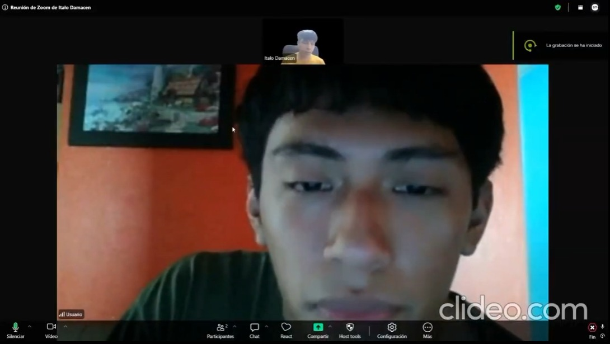

*[Ver entrevista 5](https://drive.google.com/file/d/1bX9HVre3tKKn_i6xJ4ZcYVOJnFxwul1M/view?usp=sharing)*

**Resumen de entrevista:**

Daniel Arias Dextre, de 24 años, es asistente técnico operativo y co-gestor del negocio familiar de fumigación agroaérea en representación de su padre Roberto Arias, con operaciones en el Valle de Ica y Arequipa. En campo usa un smartphone Android con Google Chrome y una tablet de apoyo para revisión fotográfica; para el cierre administrativo usa una laptop con Excel, y sus herramientas de coordinación (WhatsApp y Google Calendar) le generan desorden y pérdida recurrente de información por la dispersión de mensajes. Prestan servicios en fundos de algodón, espárrago y vid con un dron DJI T10 de 10 litros más una unidad de respaldo, cubriendo de 15 a 25 ha/día a 35-55 soles/ha; la coordinación previa es caótica porque los clientes envían referencias imprecisas, obligándolos a recorrer el perímetro a pie junto al capataz y perdiendo más de 30 minutos antes de operar. Enfrentan desconfianza y quejas por diferencias entre hectáreas estimadas y reales, no cuentan con bitácora digital (anotan en libretas de papel que luego transcriben a Excel) y monitorean el clima con Google Weather y un anemómetro manual (límite de 15 km/h), sin actas formales para justificar suspensiones. Es joven, colaborador, pragmático y con visión modernizadora sobre el negocio de su padre. Considera muy provechoso visualizar las parcelas prediseñadas en un mapa satelital, estimando un ahorro de 20 a 30 minutos por servicio, valora la bitácora web rápida para eliminar el papeleo y respalda la planificación anticipada de rutas de vuelo sobre el mapa.

| Detalle | Información |
|:---|:---|
| **Entrevistador** | Italo Damacen |
| **Entrevistado** | Daniel Arias Dextre (en representación de Roberto Arias) |
| **Edad** | 24 años |
| **Ubicación** | Reside en Lima (operaciones en Valle de Ica y Arequipa) |
| **Duración / Empieza en** | 6:36 / 28:56 |
| **Enlace** | https://drive.google.com/file/d/1bX9HVre3tKKn_i6xJ4ZcYVOJnFxwul1M/view?usp=sharing |

##### Entrevista #6

*[Ver entrevista 6](https://drive.google.com/file/d/1bX9HVre3tKKn_i6xJ4ZcYVOJnFxwul1M/view?usp=sharing)*

**Resumen de entrevista:**

Eduardo Osorio, de 34 años, es técnico agropecuario y piloto certificado de drones agrícolas (DGAC), con formación adicional del fabricante DJI Agras, y presta servicios de fumigación principalmente en el valle de Cañete y Chincha, con trabajos ocasionales en Ica. En campo usa un smartphone Android con Google Chrome y una tablet de campo integrada al control del dron; no cuenta con laptop propia y depende de la de un familiar para reportes administrativos. Coordina toda su operación por WhatsApp, lleva su agenda en un cuaderno físico y delega la facturación a su esposa en una hoja de Excel simple, sin usar Google Calendar ni otras herramientas digitales. Opera con un DJI Agras T30 de 30 litros, ofreciendo servicios preventivos y curativos en cultivos de algodón, maíz, palto y espárrago, a un precio de 35 a 45 soles por hectárea. Enfrenta disputas frecuentes con agricultores por diferencias entre el área estimada y la realmente cubierta, ya que estos miden "a ojo" sin referencia técnica clara. La coordinación de citas es desgastante por la falta de un calendario visual, generando cruces de trabajos y pérdida de tiempo en traslados. Cuando el predio no tiene coordenadas exactas, debe caminar el perímetro en modo manual antes del vuelo automático, perdiendo entre 20 y 40 minutos por servicio. No lleva bitácora digital (registra todo en un cuaderno de campo que transcribe tardíamente a Excel) y evalúa el clima con la app Windy la noche previa y un anemómetro manual en campo, sin evidencia formal para justificar suspensiones por viento o lluvia ante el cliente. Se muestra receptivo y pragmático frente a la digitalización de su negocio: considera muy útil visualizar las parcelas ya dibujadas en un mapa satelital antes del vuelo, valora una bitácora web rápida para dar transparencia inmediata al agricultor, y ve en las alertas climáticas automáticas una forma de respaldar técnicamente sus decisiones de pausar labores.

| Detalle | Información |
|:---|:---|
| **Entrevistador** | Alejandro Samir |
| **Entrevistado** | Eduardo Osorio |
| **Edad** | 34 años |
| **Ubicación** | Opera en el valle de Cañete y Chincha (ocasionalmente Ica) |
| **Duración / Empieza en** | 5:12 / 35:34 |
| **Enlace** | https://drive.google.com/file/d/1bX9HVre3tKKn_i6xJ4ZcYVOJnFxwul1M/view?usp=sharing |

### 2.2.3. Análisis de entrevistas

El análisis de las entrevistas realizadas permite identificar patrones claros en los dos segmentos objetivo de AgriDron Solutions: agricultores y administradores de fincas, y operadores técnicos y proveedores de fumigación con drones. A partir de las entrevistas, se evidencian problemas recurrentes relacionados con la delimitación de parcelas, la coordinación de servicios, el registro de las aplicaciones, las condiciones climáticas y la falta de información precisa sobre el área realmente fumigada.

#### Segmento 1: Agricultores y Administradores de Fincas

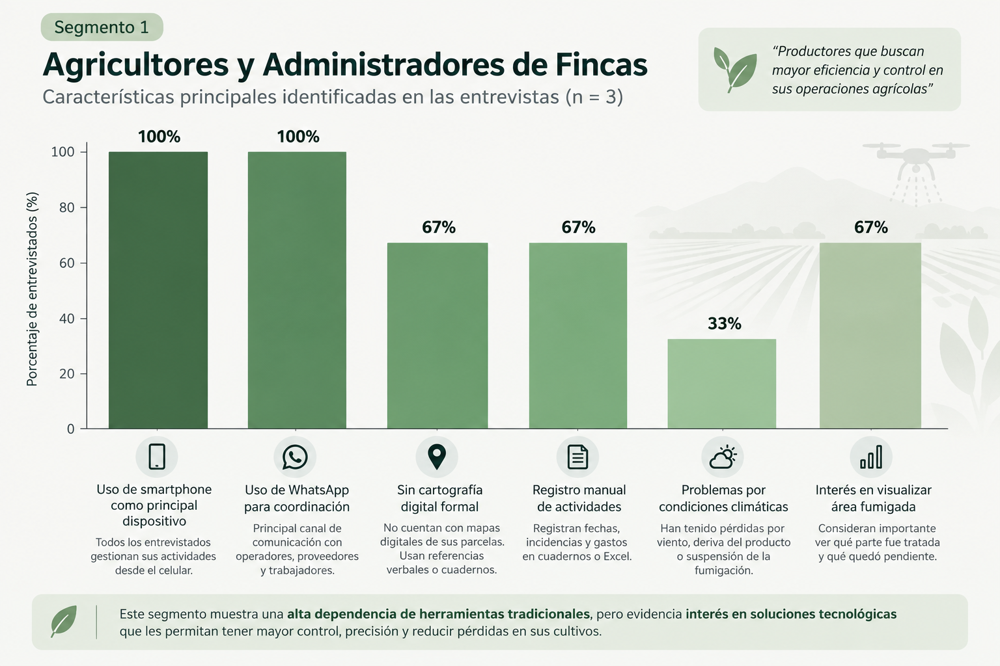

Este segmento agrupa a agricultores y administradores de fincas que gestionan sus actividades principalmente mediante métodos tradicionales y herramientas digitales básicas. Los tres entrevistados utilizan smartphones como principal dispositivo de trabajo y dependen de WhatsApp para coordinar servicios, proveedores y operadores de fumigación.

### Gestión de las parcelas y registros

El 100% de los entrevistados no cuenta con una cartografía digital formal de sus parcelas. Los límites de los terrenos se conservan principalmente de memoria, mediante referencias verbales o utilizando cuadernos y planos físicos. Esto genera dificultades al momento de coordinar la fumigación, especialmente cuando existen varios lotes, obstáculos o zonas que requieren un tratamiento diferenciado.

Asimismo, el 100% lleva los registros de las actividades agrícolas de manera manual o informal. Las fechas, incidencias y gastos se registran en cuadernos, fotografías sueltas o posteriormente en Excel, sin contar con un sistema centralizado que permita consultar el historial de las aplicaciones realizadas.

### Problemas con la fumigación

El 100% de los entrevistados manifestó problemas relacionados con la cobertura o precisión de las aplicaciones. Los agricultores no siempre pueden conocer con certeza qué parte de su parcela fue fumigada, debido a que los límites y obstáculos se comunican al operador principalmente de manera verbal.

Esta situación puede ocasionar aplicaciones de más o de menos, pérdida de producto, gastos innecesarios y dudas sobre la cantidad real de terreno tratado. En algunos casos, los agricultores deben recorrer posteriormente la parcela para verificar el área cubierta.

### Condiciones climáticas

El 100% consulta las condiciones climáticas antes de realizar una aplicación, principalmente mediante aplicaciones del celular. Sin embargo, existe una percepción de que la información disponible no siempre es suficientemente precisa para la ubicación específica de sus parcelas.

Los cambios repentinos de viento representan un problema recurrente, debido a que pueden provocar deriva del producto, evaporación o suspensión de la fumigación. Cuando esto ocurre, los agricultores no siempre reciben información clara sobre el motivo de la suspensión ni sobre cuánto terreno llegó a ser tratado.

### Canales de comunicación

El 100% utiliza WhatsApp como principal canal de comunicación para coordinar con operadores de drones, proveedores y trabajadores. Aunque es una herramienta habitual y accesible, la información importante queda dispersa entre conversaciones y mensajes.

Los entrevistados muestran preferencia por recibir información directamente en su celular, especialmente avisos sobre el clima, estado de la fumigación, área tratada y zonas pendientes.

### Adopción tecnológica

Los tres entrevistados muestran apertura hacia una solución tecnológica siempre que sea sencilla y no requiera conocimientos técnicos avanzados.

El 100% considera positiva la posibilidad de visualizar y delimitar sus parcelas mediante un mapa satelital interactivo. Sin embargo, uno de los entrevistados señaló que realizar esta delimitación desde una pantalla pequeña podría ser complicado y propuso contar con asistencia mediante GPS o apoyo inicial de un técnico.

Esto evidencia que la adopción tecnológica depende principalmente de que la herramienta sea intuitiva, rápida y acompañada de una orientación inicial cuando sea necesario.

### Funcionalidades de interés

- El 100% valora la delimitación de parcelas mediante mapas satelitales.
- El 100% considera importante recibir alertas meteorológicas antes de realizar una fumigación.
- El 100% considera necesario conocer visualmente el área tratada y el área pendiente.
- El 100% muestra interés en contar con registros digitales de las aplicaciones realizadas.
- El 100% valora la posibilidad de reprogramar las zonas que quedaron pendientes después de una suspensión.
- El 100% prefiere recibir información clara directamente en el celular.

#### Segmento 2: Operadores Técnicos y Proveedores de Fumigación con Drones

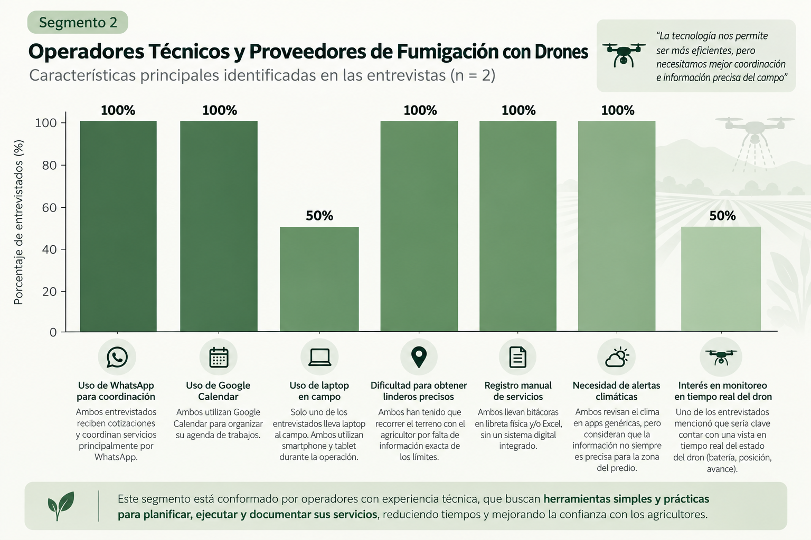

Este segmento está conformado por operadores técnicos que prestan servicios de fumigación agrícola con drones en diferentes valles de la costa peruana. Ambos entrevistados utilizan smartphones Android y tablets durante sus operaciones, mientras que las laptops son utilizadas principalmente para actividades administrativas y de planificación.

### Gestión de pedidos y coordinación

El 100% utiliza WhatsApp como principal canal para recibir solicitudes, realizar cotizaciones y coordinar los detalles de los servicios. Google Calendar también es utilizado por el 100% de los entrevistados para organizar sus citas y compromisos.

Sin embargo, la coordinación mediante mensajes y llamadas genera desorden cuando reciben varias solicitudes simultáneamente. Uno de los principales problemas identificados es la recepción de cotizaciones mientras el operador se encuentra realizando un vuelo, obligándolo a interrumpir su actividad para responder.

### Problemas principales

El 100% identifica como problema la falta de información precisa sobre la ubicación y los límites de los terrenos antes de trasladarse al campo.

Los agricultores suelen enviar ubicaciones aproximadas o referencias verbales, por lo que los operadores deben llegar antes de iniciar el servicio y recorrer los linderos junto con el propietario o capataz. Esta actividad genera pérdida de tiempo y retrasa el inicio de las operaciones.

Además, el 100% ha experimentado dificultades para demostrar al cliente la superficie realmente fumigada. Las diferencias entre las hectáreas estimadas por los agricultores y el área registrada por el dron pueden generar dudas y reclamos sobre el servicio.

### Registro de servicios

El 100% de los operadores utiliza actualmente registros físicos o herramientas no integradas para documentar sus servicios.

Las bitácoras se realizan en libretas, hojas sueltas o archivos de Excel que posteriormente deben ser transcritos. Esta metodología puede provocar omisiones, pérdida de información y registros incompletos de las incidencias ocurridas durante la fumigación.

### Gestión de suspensiones

El 100% enfrenta situaciones en las que debe suspender o reprogramar una aplicación debido a condiciones climáticas u otros imprevistos.

Actualmente, las suspensiones se comunican principalmente de manera verbal al agricultor y no siempre existe un reporte técnico que permita demostrar el motivo de la interrupción, el avance realizado o el área que quedó pendiente.

Esta situación puede generar dudas y discusiones entre el operador y el cliente.

### Necesidades tecnológicas

El 100% muestra interés en una plataforma que permita visualizar las órdenes de servicio junto con las parcelas previamente delimitadas en un mapa satelital.

Las principales funcionalidades identificadas son:

- Visualización de órdenes de servicio en un calendario.
- Parcelas georreferenciadas y previamente delimitadas.
- Registro digital de bitácoras.
- Visualización de hectáreas tratadas.
- Registro del volumen aplicado.
- Registro de incidencias.
- Alertas meteorológicas automáticas.
- Reportes técnicos para justificar suspensiones.
- Información centralizada del cliente, terreno y servicio.
- Visualización del estado del dron durante la operación.

### Supervisión del dron

El 50% de los entrevistados señaló de manera explícita que contar con una vista centralizada del estado del dron sería clave para la operación, permitiendo visualizar batería, posición y avance en una sola pantalla.

El otro 50% no manifestó una necesidad explícita de esta funcionalidad durante la entrevista, aunque sí mostró interés en herramientas relacionadas con la planificación, registro y seguimiento de los servicios.

### Conclusiones para el diseño de arquetipos

### Automatización simple y práctica

Los resultados muestran que ambos segmentos actualmente dependen de herramientas dispersas como WhatsApp, cuadernos, Excel y aplicaciones meteorológicas. Por ello, la plataforma debe centralizar la información sin aumentar la complejidad del trabajo.

La solución debe permitir realizar las tareas principales de manera rápida, especialmente desde dispositivos móviles, debido a que el smartphone es utilizado por el 100% de los entrevistados de ambos segmentos.

### Diferenciación de valor por segmento

- **Agricultores:** valoran principalmente conocer con precisión qué área fue fumigada, evitar pérdidas por mala cobertura, recibir alertas climáticas y poder reprogramar las zonas pendientes.
- **Operadores:** necesitan principalmente reducir el tiempo de coordinación, disponer de parcelas georreferenciadas, registrar digitalmente las aplicaciones y contar con evidencia técnica ante suspensiones o reclamos.

### Reducción de fricción

El sistema debe reducir la dependencia de WhatsApp, llamadas telefónicas, referencias verbales, cuadernos y hojas de cálculo.

Para los agricultores, la principal fricción se encuentra en la falta de visibilidad sobre el área realmente fumigada y en la incertidumbre provocada por las condiciones climáticas.

Para los operadores, la principal fricción se encuentra en la coordinación previa, la falta de límites precisos de las parcelas y el registro manual de los servicios.

Por ello, la plataforma debe ofrecer una solución rápida y estructurada que permita conectar al agricultor con el operador, compartir la ubicación exacta de la parcela y mantener un historial digital de cada servicio.

### Oportunidad clave

Existe una oportunidad de centralizar en una sola plataforma los procesos que actualmente se realizan mediante diferentes herramientas.

La solución puede integrar la delimitación de parcelas en mapas satelitales, la programación de servicios, las alertas meteorológicas, el registro de bitácoras y la visualización del avance de la fumigación.

De esta manera, se busca reducir el tiempo previo a cada servicio, disminuir los errores relacionados con la superficie tratada y proporcionar evidencia clara tanto al agricultor como al operador sobre el desarrollo y resultado de cada aplicación.

## 2.3. Needfinding.

### 2.3.1. User Personas.
#### Persona 1: Laura Ramos Paucar

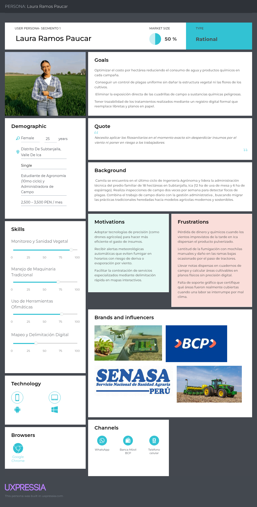

#### Persona 2: Diego mendoza Rios

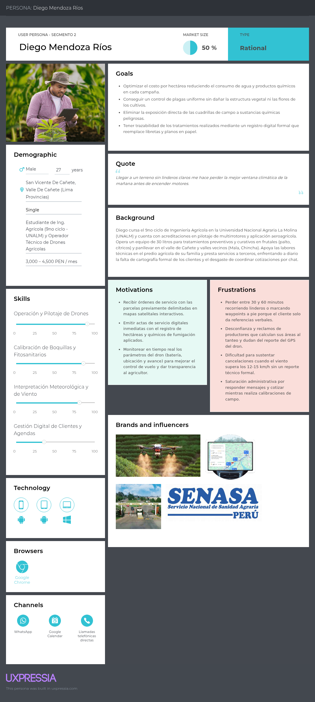

### 2.3.2. User Task Matrix

En la siguiente matriz se detallan las principales tareas que realiza el User Persona operador técnico de drones (Diego Mendoza Ríos) en su labor diaria de fumigación, indicando la frecuencia, importancia y dificultad de cada tarea, así como los problemas actuales que enfrenta antes de la existencia de la solución propuesta.

| Tarea | Usuario | Frecuencia | Importancia | Dificultad | Problemas actuales |
|:---|:---|:---|:---|:---|:---|
| **Delimitar linderos y mapas de parcela** | Diego Mendoza Ríos | Alta | Alta | Alta | Recibe referencias verbales imprecisas del agricultor y debe recorrer el predio a pie para identificar y marcar manualmente los obstáculos y límites de la parcela. |
| **Monitorear parámetros de vuelo y avance en tiempo real** | Diego Mendoza Ríos | Alta | Alta | Media | No cuenta con una interfaz unificada que le permita verificar batería, GPS y nivel de tanque de forma simultánea durante el vuelo. |
| **Emitir actas/reportes de servicio digitales** | Diego Mendoza Ríos | Alta | Alta | Media | La falta de un reporte digital estandarizado genera desconfianza y reclamos de cobro con clientes que calculan las hectáreas tratadas "al tanteo". |
| **Sustentar pausas climáticas por viento** | Diego Mendoza Ríos | Media | Alta | Alta | Le resulta difícil justificar ante el cliente una cancelación cuando el viento supera los 12-15 km/h, al no contar con un reporte técnico formal que respalde la decisión. |
| **Gestionar cotizaciones y agendas de trabajo** | Diego Mendoza Ríos | Alta | Media | Alta | Sufre saturación administrativa al tener que responder mensajes y cotizar servicios mientras realiza maniobras de campo. |
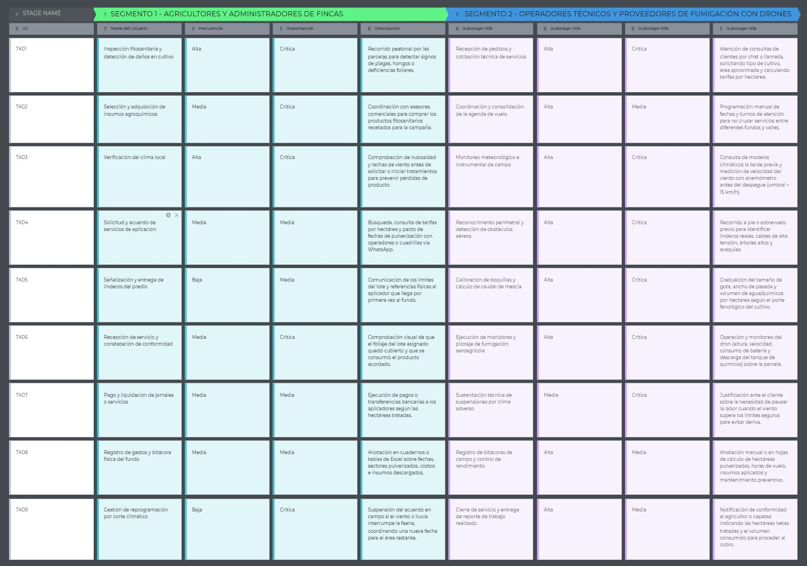

### 2.3.3. User Journey Mapping

En esta sección se presentan los User Journey Maps en su versión As-Is para cada segmento objetivo. Estos mapas resumen el recorrido actual de los usuarios en la gestión de sus tareas más relevantes, desde la identificación de una necesidad hasta la resolución manual de sus actividades, permitiendo visualizar pasos, fricciones, puntos de dolor y oportunidades de mejora antes de la intervención de AgriDron.
- **Segmento objetivo 1: **
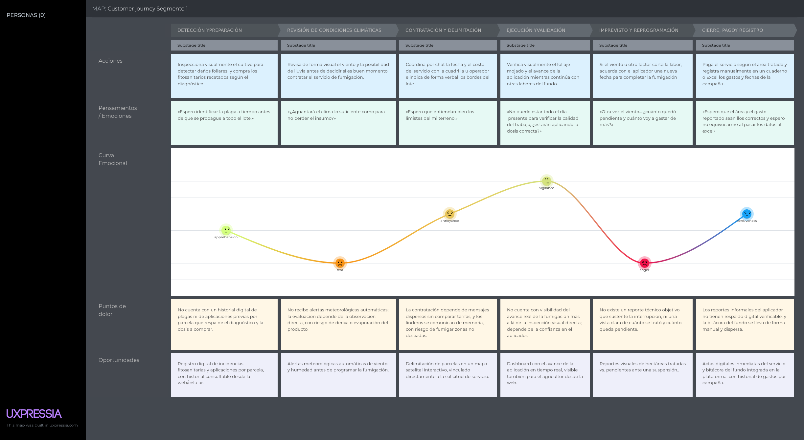

- **Segmento objetivo 2: **
  

### 2.3.4. Empathy Mapping

Los siguientes Empathy Maps fueron elaborados a partir de las observaciones extraídas de las entrevistas y organizan, para cada User Persona, lo que el usuario dice, piensa, hace y siente en su contexto actual. Este artefacto permite profundizar en sus pains, gains, preocupaciones y motivaciones, facilitando una comprensión más humana del problema y orientando mejor las decisiones posteriores de diseño.

- **Segmento objetivo 1: Pequeños y Medianos Agricultores / Propietarios de Fincas**
  

- **Segmento objetivo 2: Operadores Técnicos y Proveedores de Servicios de Fumigación con Drones**
  

# 2.4. BIG PICTURE EVENT STORMING

**OPEN**

La fase "Open" (Exploración Abierta) constituye el primer paso del taller de Event Storming, diseñado para fomentar una lluvia de ideas sin restricciones tecnológicas ni arquitectónicas. En esta etapa inicial, el objetivo principal es capturar todos los Eventos de Dominio relevantes de la operativa actual (redactados siempre en tiempo pasado) para mapear el proceso físico real de la fumigación agrícola de extremo a extremo, evidenciando cómo fluye el negocio desde la solicitud inicial del cliente hasta el cierre del servicio, antes de la introducción de AgriDron Solutions.

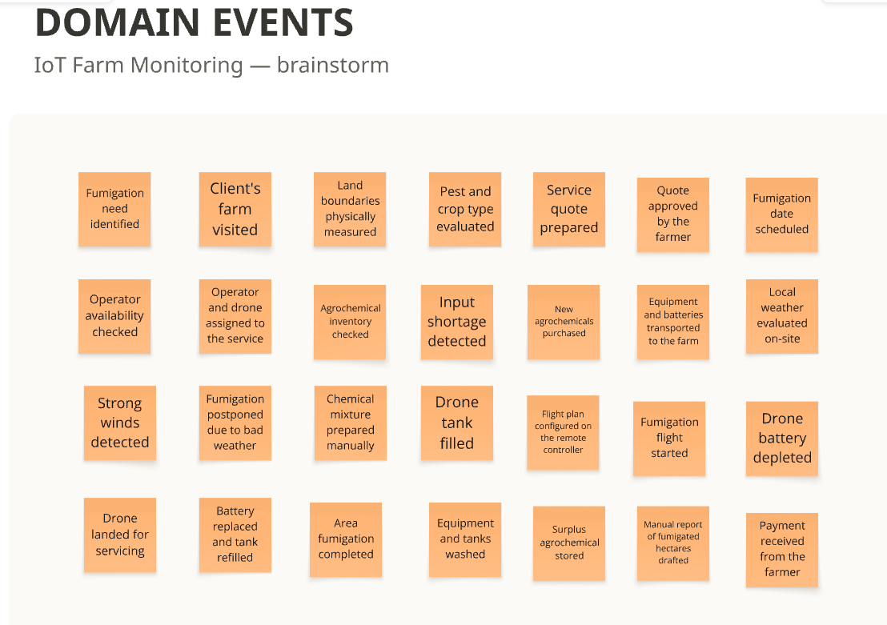

**EXPLORE**

Durante la fase "Explore" (Exploración Secuencial), el modelo caótico inicial se consolida estructurando los eventos descubiertos en una estricta línea de tiempo cronológica de izquierda a derecha. En este punto, el ecosistema se enriquece introduciendo visualmente a los actores humanos involucrados en cada paso, las herramientas empíricas o sistemas que utilizan actualmente y, de manera crítica, los puntos de dolor (Pain Points) logísticos y operativos que justifican la necesidad y el valor de negocio de implementar la plataforma de software.

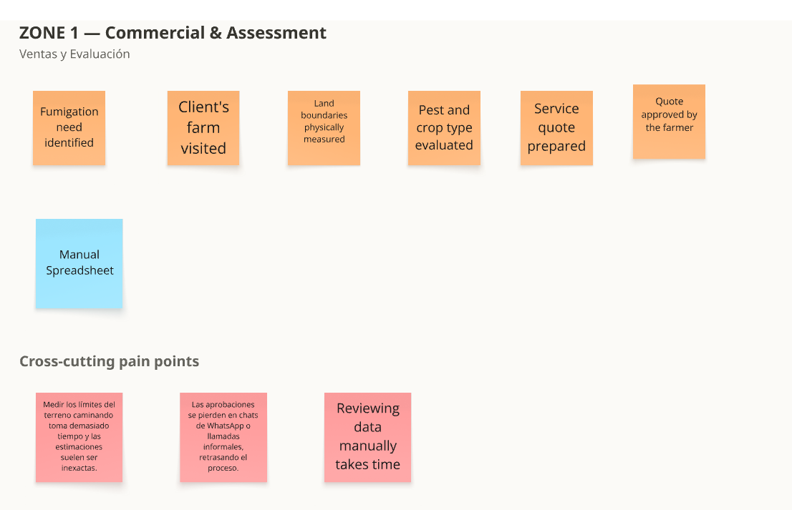

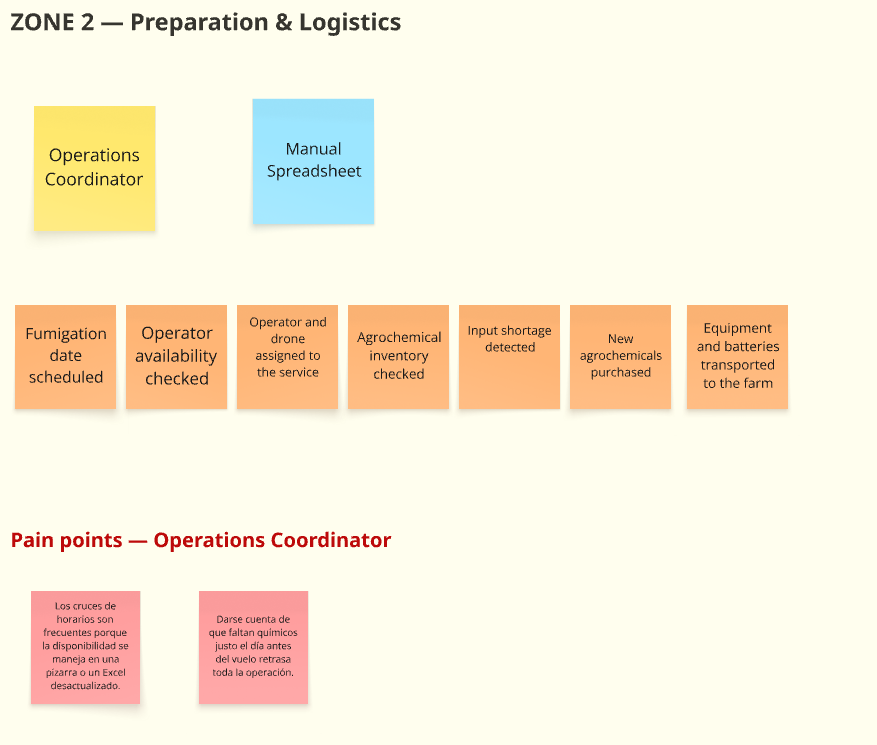

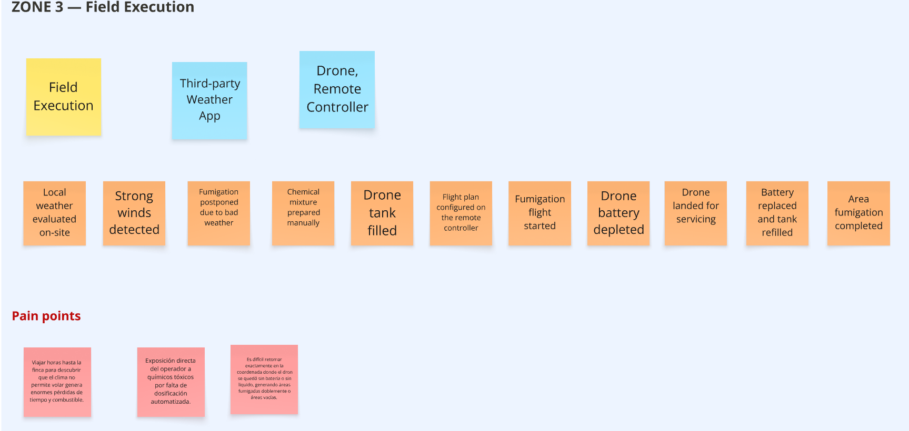

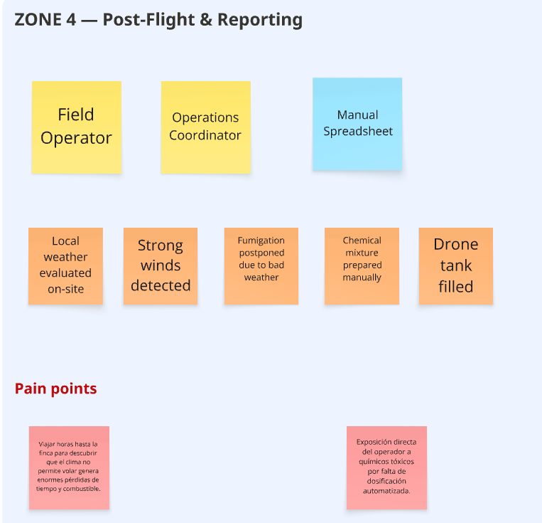

**CLOSE**

La fase "Close" (Cierre y Definición de Alcance) actúa como la culminación del taller, orientada a tomar decisiones tangibles de diseño y establecer los límites técnicos del proyecto. La información y fricciones descubiertas se clasifican en tres tableros estratégicos: los problemas operativos críticos que la arquitectura debe resolver obligatoriamente, las interrogantes técnicas que exigen mayor investigación por parte del equipo, y los procesos funcionales que quedan explícitamente fuera del alcance (Out of Scope) para la versión actual, previniendo así el desborde de requerimientos.

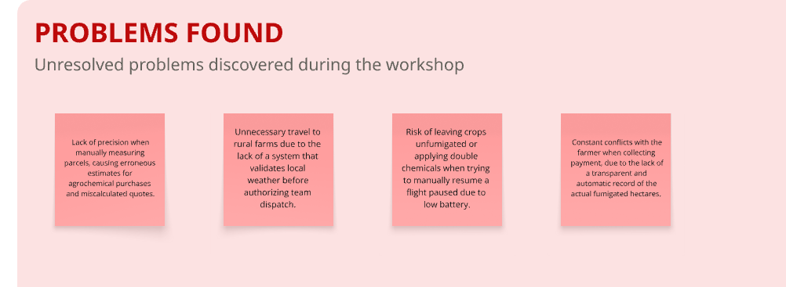

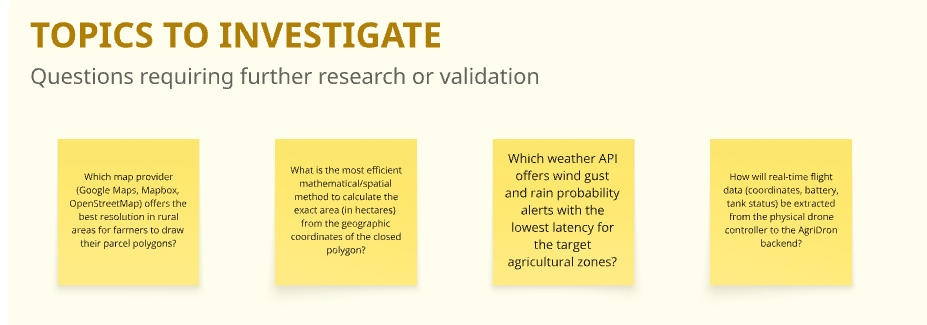

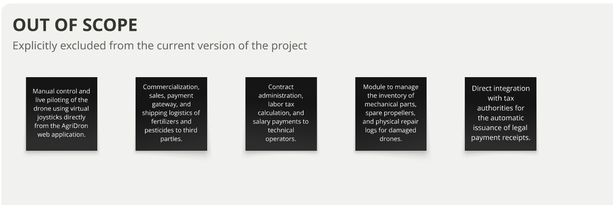

Se adjunta el tablero en miro con el procedimiento:
[link tablero miro](https://miro.com/welcomeonboard/TTZqTjVVY2FwVHRweVBhSnhsdFk2ajFjWUFVM2hTaWVrYk1sLzN5NVAzcHhzSHhTRmFuaW5WV0ZiK2tDcXRvdXBJY1BOcit0OGljUlptWGxHbDVaUWFKa0EydzdPN20yN3dxUXNXSzdXb1FBTHVPcUFNQ0tVZ2Q4bUdMZTk4THN3VHhHVHd5UWtSM1BidUtUYmxycDRnPT0hdjE=?share_link_id=100284565376)

---

## 2.5. Ubiquitous Language

El Ubiquitous Language es el lenguaje compartido entre el equipo, los stakeholders y los usuarios del negocio. En AgriDron se utilizarán términos del dominio expresados en inglés, con definiciones en español, para asegurar que los conceptos clave de fumigación, monitoreo y coordinación entre agricultores y operadores mantengan un significado único y consistente en toda la solución.

#### Cross-Domain Terms

| Term | Definición | Context |
|:---|:---|:---|
| **Farmer** | Usuario propietario o administrador de una o más fincas, responsable de registrar parcelas, crear misiones de fumigación y consultar el historial y los reportes de productividad de sus operaciones. | Business actor |
| **Operator** | Piloto certificado que ejecuta las misiones de fumigación en campo, monitorea los parámetros del dron durante el vuelo y reporta incidencias o avances de la operación. | Business actor |
| **Supervisor** | Usuario responsable de asignar misiones a operadores disponibles, monitorear en tiempo real el estado de los drones activos, gestionar el inventario de insumos y consultar reportes de eficiencia operativa. | Access and responsibilities |

#### Farm and Mission Terms

| Term | Definición | Context |
|:---|:---|:---|
| **Farm** | Predio agrícola registrado por un Agricultor en la plataforma, identificado por nombre, ubicación geográfica y tamaño en hectáreas. Puede contener una o más parcelas. | Farm management |
| **Plot / Spraying Area** | Polígono delimitado sobre un mapa satelital dentro de los límites de una finca, sobre el cual se planifica y ejecuta una misión de fumigación. Su superficie se calcula automáticamente en hectáreas al momento de dibujarla. | Farm management |
| **Spraying Mission** | Solicitud de servicio creada por un Agricultor sobre un área y un cultivo específicos. Atraviesa los estados *Pendiente*, *Asignada*, *En Progreso*, *Pausada* y *Completada* a lo largo de su ciclo de vida. | Mission lifecycle |
| **Incident** | Evento imprevisto registrado por un Operador durante una misión en progreso (por ejemplo, clima adverso o falla técnica del equipo), que puede derivar en la pausa automática de la misión y una alerta al Supervisor. | Mission lifecycle |
| **Service Record** | Registro digital inmediato emitido al completar una misión, que detalla las hectáreas efectivamente fumigadas y los químicos aplicados, sirviendo como evidencia verificable frente al cliente. | Mission lifecycle |

#### Field Operations Terms

| Term | Definición | Context |
|:---|:---|:---|
| **Geofence** | Perímetro virtual asociado a una finca registrada, utilizado para validar automáticamente si un Operador se encuentra físicamente dentro del predio antes de iniciar el registro de su jornada de trabajo. | Field operations |
| **Work Shift** | Periodo de tiempo trabajado por un Operador en campo, cuyo registro se inicia automáticamente al confirmarse su ubicación dentro de la geocerca de la finca, o de forma manual con verificación del Supervisor si esto no es posible. | Field operations |
| **Real-time Monitoring Dashboard** | Panel que muestra la posición GPS, el nivel de batería, el estado de vuelo y el avance porcentual de los drones activos, actualizado continuamente durante la ejecución de una misión. | Real-time monitoring |

#### Reporting and Supply Terms

| Term | Definición | Context |
|:---|:---|:---|
| **Productivity Report** | Documento generado por el Agricultor que resume, por finca y rango de fechas, el área total fumigada, los insumos utilizados, las horas de operación, el costo por hectárea y el rendimiento estimado. | Reporting |
| **Operational Efficiency Report** | Documento generado por el Supervisor con métricas de desempeño como tiempo promedio por hectárea, costo por hectárea, eficiencia en el uso de insumos y horas-hombre invertidas, incluyendo comparativas entre operadores. | Reporting |
| **Supply Inventory** | Registro del stock disponible de pesticidas y fertilizantes gestionado por el Supervisor, con umbrales mínimos que generan alertas de reabastecimiento cuando el stock es crítico. | Supply management |
| **Weather Conditions** | Información meteorológica obtenida de un servicio externo (Weather API) y consultada antes o durante una misión, utilizada para planificar operaciones y sustentar pausas por viento u otros factores adversos. | Weather monitoring |
