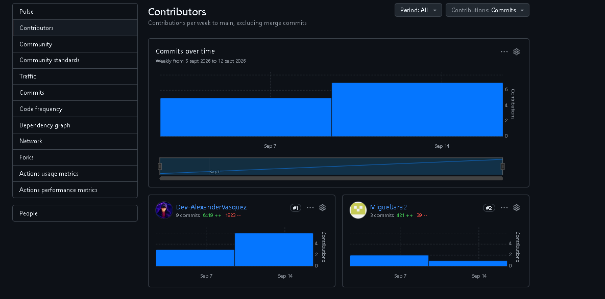
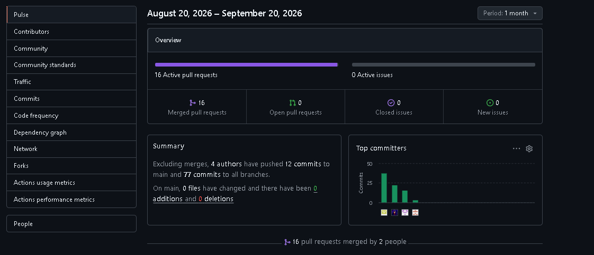

# Project Report Collaboration Insights

Todas las actividades asignadas para la AV1 se encuentran documentadas en los repositorios de GitHub pertenecientes a la organización de AgriDron, accesible en el siguiente enlace:

[Organización Agridron](https://github.com/AgriDon)

En cuanto al informe del proyecto, cada integrante del equipo participó en la elaboración de los diferentes capítulos y apartados asignados, desarrollando contenido en formato Markdown, tablas, diagramas, evidencias y demás artefactos correspondientes al proyecto Agridron.

El progreso de cada integrante fue registrado mediante commits realizados en las diferentes ramas de trabajo del repositorio, permitiendo mantener un historial de los cambios y evidenciar la participación colaborativa del equipo durante el desarrollo de la AV1.

El repositorio principal del Project Report se encuentra disponible en:

[Repositorio Agridron](https://github.com/AgriDon/AgriDron-report.git)

## Insights AV1

En esta sección se presentan las métricas de colaboración obtenidas mediante GitHub Insights. Estas evidencias permiten visualizar los commits realizados por los integrantes del equipo durante la AV1 y reflejan la participación de Agridron en la elaboración y evolución del Project Report.

**Figura:** Métricas generales de contribución de los integrantes de Agridron durante la AV1.

**Figura:** Detalle de los commits y participación de los colaboradores del repositorio Agridron durante la AV1.