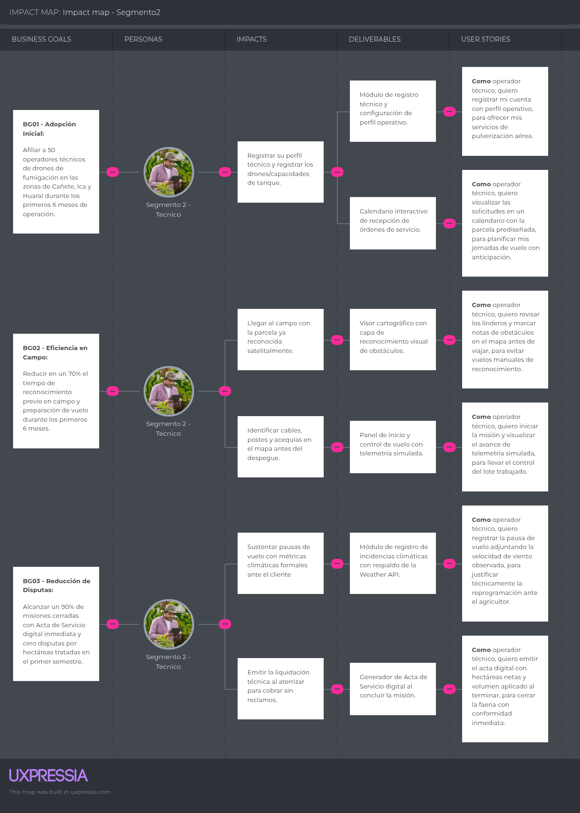

# Capítulo III: Requirements Specification

## 3.1. User Stories

En esta sección se definen y consolidan los requisitos del proyecto AgriDron Solutions a través de un conjunto unificado de Historias de Usuario (User Stories) e Historias Técnicas (Technical Stories). Estos requerimientos han sido derivados de las Épicas (Epics) del proyecto, las cuales se encuentran estrictamente alineadas con los Bounded Contexts identificados en el diseño de dominio (DDD) para asegurar la trazabilidad arquitectónica.

Para garantizar que los requisitos sean verificables y objetivos, cada historia cuenta con múltiples criterios de aceptación redactados en tiempo presente y tercera persona utilizando la estructura lógica de Gherkin (Dado-Cuando-Entonces), evitando hacer referencia a detalles específicos de la interfaz de usuario.

Asimismo, para facilitar la identificación, el alcance y el contexto de cada requerimiento dentro de la plataforma, se ha establecido una nomenclatura específica para los identificadores (ID)

LP (Landing Page): Identifica a las historias relacionadas con el sitio web público e informativo. Estas historias asumen el rol base de Visitante y están enfocadas en la presentación del modelo de negocio, el descubrimiento de funcionalidades, las tarifas y la conversión de nuevos usuarios.

WA (Web Application): Identifica a las historias operativas y transaccionales correspondientes a la experiencia web privada. Estas abarcan los flujos de trabajo de los segmentos objetivo (Agricultor, Operador Técnico y Supervisor), permitiendo la gestión de parcelas, programación de misiones, monitoreo de telemetría y generación de reportes.

TU (Technical User Story): Identifica a los requisitos de infraestructura, arquitectura y servicios backend (RESTful API). Estas historias asumen el rol de Developer y definen escenarios de interacción, seguridad JWT, persistencia geoespacial, resiliencia ante APIs externas y configuración de despliegue.

| Epic / Story ID | Título | Descripción | Criterios de Aceptación | Relacionado con (Epic ID) |
|---|---|---|---|---|
| **EP-01** | **Landing Page Context** | Adquisición, información comercial y conversión. | | |
| **EP-02** | **Identity & Access Management Context** | Seguridad, autenticación y gestión de roles. | | |
| **EP-03** | **Field Management Context** | Gestión geoespacial de fincas y parcelas. | | |
| **EP-04** | **Flight Operations Context** | Núcleo central operativo (asignación, telemetría y vuelo). | | |
| **EP-05** | **Weather Integration Context** | Anti-Corruption Layer para variables climáticas. | | |
| **EP-06** | **Analytics & Reporting Context** | Historiales, actas y productividad. | | |
| **EP-07** | **Inventory & Resource Management Context** | Control de stock de agroquímicos. | | |
| **EP-08** | **Infrastructure / Architecture** | Historias técnicas transversales. | | |
| LP-001 | Visualizar propuesta de valor | **Como visitante**, quiero visualizar la propuesta de valor de AgriDron en la página principal, para entender rápidamente los beneficios del servicio. | **Escenario 1: Carga de la página principal**  <b>Dado</b> que el visitante ingresa al Landing Page <b>Cuando</b> la página carga completamente <b>Entonces</b> el sistema muestra la cabecera con el título, propuesta de valor y los botones de acción principal (CTA).  **Escenario 2: Navegación fija al hacer scroll**  <b>Dado</b> que el visitante se encuentra en la cabecera <b>Cuando</b> hace scroll hacia abajo <b>Entonces</b> la barra de navegación superior se mantiene fija (sticky) para facilitar el acceso a otras secciones. | EP-01 |
| LP-002 | Conocer servicios ofrecidos | **Como visitante**, quiero revisar los servicios principales, para evaluar si resuelven las necesidades de mi campo. | **Escenario 1: Visualización de servicios**  <b>Dado</b> que el visitante se desplaza hacia "Servicios" <b>Cuando</b> la sección entra en el viewport <b>Entonces</b> el sistema presenta tarjetas informativas de fumigación y monitoreo.  **Escenario 2: Detalle de un servicio**  <b>Dado</b> que el visitante está viendo la sección de servicios <b>Cuando</b> hace clic en una tarjeta específica <b>Entonces</b> el sistema despliega un modal con información detallada sobre dicha modalidad. | EP-01 |
| LP-003 | Ver planes y precios | **Como visitante**, quiero conocer las tarifas y planes de suscripción, para tomar una decisión informada antes de registrarme. | **Escenario 1: Consulta de planes**  <b>Dado</b> que el visitante navega a "Planes" <b>Cuando</b> consulta la oferta disponible <b>Entonces</b> el sistema muestra los esquemas de pago con características y costos.  **Escenario 2: Selección de un plan**  <b>Dado</b> que el visitante visualiza los planes <b>Cuando</b> hace clic en el botón de selección de un plan <b>Entonces</b> el sistema lo redirige al formulario de registro con el plan preseleccionado. | EP-01 |
| LP-004 | Consultar términos y condiciones | **Como visitante**, quiero acceder a las políticas de privacidad, para informarme sobre el tratamiento de mis datos. | **Escenario 1: Acceso al documento legal**  <b>Dado</b> que el visitante hace clic en "Términos y Condiciones" <b>Cuando</b> el navegador procesa la petición <b>Entonces</b> el sistema redirige al documento legal.  **Escenario 2: Retorno al Landing Page**  <b>Dado</b> que el visitante lee los términos y condiciones <b>Cuando</b> presiona el botón de retorno <b>Entonces</b> el sistema lo devuelve a la vista previa del Landing Page manteniendo su posición. | EP-01 |
| LP-005 | Cambiar idioma del sitio | **Como visitante**, quiero alternar el idioma de la página, para consultar la información en español o inglés. | **Escenario 1: Cambio de idioma**  <b>Dado</b> que el visitante hace clic en el selector de idioma <b>Cuando</b> selecciona "English" <b>Entonces</b> todos los textos se renderizan inmediatamente en dicho idioma sin recargar la sesión.  **Escenario 2: Persistencia del idioma**  <b>Dado</b> que el visitante cambió el idioma a inglés <b>Cuando</b> navega a otras secciones del Landing Page <b>Entonces</b> el sistema mantiene su preferencia de idioma de forma persistente. | EP-01 |
| LP-006 | Registrarse como nuevo usuario | **Como visitante**, quiero registrarme ingresando mis datos básicos, para acceder a la Web Application. | **Escenario 1: Registro exitoso**  <b>Dado</b> que el visitante completa el formulario con datos válidos <b>Cuando</b> presiona "Registrar" <b>Entonces</b> el sistema crea la cuenta e inicia sesión.  **Escenario 2: Correo ya registrado**  <b>Dado</b> que el visitante ingresa un correo existente <b>Cuando</b> envía el formulario <b>Entonces</b> el sistema rechaza la creación <b>Y</b> muestra "El correo ya está registrado". | EP-02 |
| LP-007 | Iniciar sesión en la plataforma | **Como usuario registrado**, quiero ingresar con mis credenciales, para acceder a mi espacio de trabajo en la Web Application. | **Escenario 1: Inicio de sesión exitoso**  <b>Dado</b> que el usuario ingresa credenciales válidas <b>Cuando</b> envía el formulario <b>Entonces</b> el sistema redirige al Dashboard.  **Escenario 2: Credenciales inválidas**  <b>Dado</b> que el usuario ingresa credenciales inválidas <b>Cuando</b> envía el formulario <b>Entonces</b> el sistema deniega el acceso con una alerta visual. | EP-02 |
| TU-002 | Seguridad y Autenticación JWT | **Como Developer**, quiero implementar autenticación basada en JWT, para proteger las rutas según el rol de usuario. | **Escenario 1: Emisión de token**  <b>Dado</b> que un usuario autentica con éxito <b>Cuando</b> el sistema valida la firma <b>Entonces</b> retorna un Bearer JWT token con expiración.  **Escenario 2: Acceso no autorizado**  <b>Dado</b> que un rol no autorizado intenta consumir un endpoint crítico <b>Cuando</b> realiza la petición HTTP <b>Entonces</b> el sistema retorna un error <code>403 Forbidden</code>. | EP-02 |
| WA-001 | Registrar finca y parcelas en mapa interactivo | **Como agricultor**, quiero delimitar mis parcelas dibujando sobre un mapa satelital, para tener catastrados los linderos. | **Escenario 1: Registro de geometría cerrada**  <b>Dado</b> que el agricultor traza el polígono en el mapa <b>Cuando</b> cierra la geometría <b>Entonces</b> el sistema calcula automáticamente las hectáreas <b>Y</b> guarda el registro.  **Escenario 2: Área abierta**  <b>Dado</b> que el agricultor intenta guardar un área abierta <b>Cuando</b> pulsa el botón <b>Entonces</b> el sistema exige una geometría cerrada. | EP-03 |
| TU-004 | Persistencia Geoespacial de Parcelas | **Como Developer**, quiero estructurar la persistencia en formato GeoJSON, para almacenar con precisión coordenadas espaciales. | **Escenario 1: Persistencia en GeoJSON**  <b>Dado</b> que el Frontend envía coordenadas satelitales <b>Cuando</b> el repositorio persiste la entidad Parcel <b>Entonces</b> almacena los vértices en formato estándar GeoJSON.  **Escenario 2: Polígono inválido**  <b>Dado</b> que el polígono tiene menos de 3 vértices <b>Cuando</b> se valida <b>Entonces</b> lanza una excepción. | EP-03 |
| WA-002 | Solicitar misión con validación de riesgos | **Como agricultor**, quiero solicitar una misión especificando cultivo y fecha, para contratar el servicio técnico con dron. | **Escenario 1: Solicitud válida**  <b>Dado</b> que el agricultor confirma la solicitud <b>Cuando</b> el sistema valida los datos obligatorios <b>Entonces</b> guarda la misión como "Pendiente" <b>Y</b> notifica al operador.  **Escenario 2: Dato faltante**  <b>Dado</b> que el agricultor omite el tipo de insumo <b>Cuando</b> intenta guardar <b>Entonces</b> el sistema resalta el campo faltante. | EP-04 |
| WA-005 | Gestionar agenda de órdenes | **Como operador**, quiero revisar mi agenda en un calendario con la parcela en mapa, para planificar mi ruta al campo. | **Escenario 1: Revisión de misión pendiente**  <b>Dado</b> que el operador revisa una misión "Pendiente" <b>Cuando</b> expande los detalles <b>Entonces</b> el sistema carga el polígono satelital para confirmación o reprogramación.  **Escenario 2: Propuesta de reprogramación**  <b>Dado</b> que el operador identifica un impedimento logístico <b>Cuando</b> revisa la orden <b>Entonces</b> el sistema le permite proponer una nueva fecha justificando el motivo. | EP-04 |
| WA-006 | Iniciar y monitorear sesión de pulverización | **Como operador**, quiero registrar el despegue y ver los parámetros del dron, para controlar la cobertura real en campo. | **Escenario 1: Inicio de pulverización**  <b>Dado</b> que el operador pulsa "Iniciar Pulverización" <b>Cuando</b> el sistema valida <b>Entonces</b> cambia a "En Progreso" <b>Y</b> inicia la simulación telemétrica.  **Escenario 2: Alerta de batería insuficiente**  <b>Dado</b> que el operador intenta iniciar el vuelo <b>Cuando</b> el sistema detecta batería insuficiente para el polígono delimitado <b>Entonces</b> muestra una alerta técnica antes de autorizar el despegue. | EP-04 |
| WA-007 | Registrar incidencias de vuelo | **Como operador**, quiero documentar interrupciones por mal tiempo o fallas mecánicas, para justificar la pausa técnica. | **Escenario 1: Pausa de misión**  <b>Dado</b> que el operador selecciona "Pausar" <b>Cuando</b> ingresa el motivo <b>Entonces</b> el sistema congela el porcentaje de avance, cambia a "Pausada" <b>Y</b> guarda la bitácora.  **Escenario 2: Falla mecánica crítica**  <b>Dado</b> que se registra una falla mecánica <b>Cuando</b> el operador envía el reporte <b>Entonces</b> el sistema emite una alerta crítica inmediata al panel del supervisor. | EP-04 |
| WA-008 | Emitir acta de servicio en campo | **Como operador**, quiero registrar hectáreas netas y volumen de líquido al aterrizar, para emitir la conformidad final. | **Escenario 1: Cierre de misión**  <b>Dado</b> que el operador pulsa "Completar Misión" <b>Cuando</b> completa el formulario final <b>Entonces</b> el sistema genera el Acta de Servicio digital en estado "Completada".  **Escenario 2: Cierre parcial**  <b>Dado</b> que la misión se completó parcialmente <b>Cuando</b> el operador emite el acta de cierre <b>Entonces</b> el sistema discrimina las hectáreas tratadas <b>Y</b> permite programar el remanente. | EP-04 |
| WA-009 | Asignar misiones a operadores | **Como supervisor**, quiero asignar solicitudes pendientes a mi equipo técnico, para asegurar la cobertura operativa. | **Escenario 1: Asignación exitosa**  <b>Dado</b> que el supervisor selecciona a un operador disponible <b>Cuando</b> confirma <b>Entonces</b> la misión cambia a "Asignada" <b>Y</b> el operador recibe una alerta push.  **Escenario 2: Cruce de agenda**  <b>Dado</b> que el supervisor selecciona a un operador <b>Cuando</b> este ya tiene una misión programada en esa franja horaria <b>Entonces</b> el sistema muestra una advertencia de cruce de agenda. | EP-04 |
| WA-010 | Monitorear flota en tiempo real | **Como supervisor**, quiero ver la ubicación GPS de todos los drones activos, para coordinar múltiples misiones en paralelo. | **Escenario 1: Visualización del panel de flota**  <b>Dado</b> que el supervisor ingresa al panel de flota <b>Cuando</b> existen misiones activas <b>Entonces</b> el mapa muestra marcadores en vivo de cada dron y su porcentaje de batería.  **Escenario 2: Pérdida de conexión de un dron**  <b>Dado</b> que un dron pierde conexión durante el vuelo <b>Cuando</b> transcurren 15 segundos sin telemetría <b>Entonces</b> el marcador del dron en el panel del supervisor cambia a estado "Offline" (gris). | EP-04 |
| TU-005 | Simulador de Telemetría para Drones | **Como Developer**, quiero implementar un emulador vía WebSockets, para simular eventos de vuelo, batería y altitud. | **Escenario 1: Transmisión de telemetría**  <b>Dado</b> que la misión está "En Progreso" <b>Cuando</b> el emulador genera un tick <b>Entonces</b> transmite vía WebSocket latitud, longitud y avance porcentual cada 5 segundos.  **Escenario 2: Reconexión automática**  <b>Dado</b> que se interrumpe la conexión del WebSocket <b>Cuando</b> el cliente pierde la señal <b>Entonces</b> el sistema intenta reconectarse automáticamente durante 3 ciclos antes de emitir un fallo. | EP-04 |
| TU-003 | Integración con Weather API | **Como Developer**, quiero integrar un cliente externo de clima, para bloquear vuelos inseguros (Anti-Corruption Layer). | **Escenario 1: Consulta exitosa**  <b>Dado</b> que se reciben coordenadas <b>Cuando</b> se invoca la API externa <b>Entonces</b> retorna velocidad del viento y temperatura.  **Escenario 2: Fallback por falla externa**  <b>Dado</b> que la API externa falla (timeout > 3s) <b>Cuando</b> se evalúa <b>Entonces</b> aplica un mecanismo Fallback usando la última caché. | EP-05 |
| WA-003 | Consultar historial y estados | **Como agricultor**, quiero revisar el listado de mis misiones históricas, para dar seguimiento temporal a las sanidades aplicadas. | **Escenario 1: Filtrado por rango de fechas**  <b>Dado</b> que el usuario selecciona un rango de fechas <b>Cuando</b> aplica el filtro <b>Entonces</b> el sistema muestra únicamente las misiones creadas en dicho periodo.  **Escenario 2: Historial vacío**  <b>Dado</b> que el agricultor no posee misiones en la finca seleccionada <b>Cuando</b> intenta visualizar el historial <b>Entonces</b> el sistema muestra el estado vacío con el mensaje "No existen registros en este lote". | EP-06 |
| WA-004 | Generar reporte de tratamientos | **Como agricultor**, quiero exportar un consolidado fitosanitario, para respaldar el control de insumos auditables. | **Escenario 1: Exportación de reporte**  <b>Dado</b> que existen misiones completadas <b>Cuando</b> pulsa "Exportar" <b>Entonces</b> el sistema genera un PDF con hectáreas netas, operador y químicos dosificados.  **Escenario 2: Periodo sin misiones**  <b>Dado</b> que el agricultor solicita un reporte de un periodo sin misiones <b>Cuando</b> pulsa el botón <b>Entonces</b> el sistema deshabilita la exportación <b>Y</b> notifica la ausencia de datos. | EP-06 |
| WA-011 | Consultar métricas de eficiencia | **Como supervisor**, quiero graficar los costos de horas-hombre y líquidos por hectárea, para evaluar el desempeño. | **Escenario 1: Visualización de gráfico comparativo**  <b>Dado</b> que el supervisor accede a "Reportes" <b>Cuando</b> selecciona a un operador <b>Entonces</b> el sistema renderiza el gráfico comparativo de eficiencia operativa.  **Escenario 2: Actualización dinámica del rango**  <b>Dado</b> que el supervisor ajusta el rango de fechas a "Últimos 30 días" <b>Cuando</b> aplica el cambio <b>Entonces</b> las gráficas se actualizan de forma dinámica sin recargar la página. | EP-06 |
| WA-012 | Gestionar stock de agroquímicos | **Como supervisor**, quiero registrar entradas de fertilizantes, para evitar cuellos de botella en futuras fumigaciones. | **Escenario 1: Alerta por stock bajo**  <b>Dado</b> que una misión se completa <b>Cuando</b> descuenta insumo <b>Entonces</b> el sistema evalúa si cae bajo el umbral mínimo <b>Y</b> muestra una alerta visual amarilla.  **Escenario 2: Reingreso de stock**  <b>Dado</b> que el supervisor ingresa un nuevo lote de producto al inventario <b>Cuando</b> registra el ingreso <b>Entonces</b> el sistema recalcula el stock total <b>Y</b> retira las alertas de desabastecimiento. | EP-07 |
| TU-001 | Arquitectura Base en Spring Boot | **Como Developer**, quiero configurar la estructura multicapa del API, para asegurar mantenibilidad y gestión global de excepciones. | **Escenario 1: Manejo global de errores**  <b>Dado</b> que ocurre un error de validación no controlado <b>Cuando</b> la API procesa la respuesta <b>Entonces</b> devuelve un JSON estandarizado con código HTTP 400/500.  **Escenario 2: Ruta inexistente**  <b>Dado</b> que el cliente solicita una ruta inexistente <b>Cuando</b> el controlador intercepta la petición <b>Entonces</b> la API retorna un JSON de error estructurado con código HTTP 404. | EP-08 |

## 3.2. Impact Mapping

El Impact Mapping de AgriDron Solutions refleja la relación estratégica entre los objetivos de negocio (Business Goals), los actores clave de la plataforma, los cambios de comportamiento esperados (Impacts) y las funcionalidades del sistema (Deliverables) que se traducen en historias de usuario (User Stories).

A través de este artefacto se asegura la trazabilidad directa entre la propuesta de valor del sistema de fumigación con drones y las necesidades operativas de los agricultores y técnicos de campo.

**Objetivos de Negocio por Segmento**

Objetivo de Negocio #1 [Segmento 1: Pequeños y Medianos Agricultores - PyMAs]:
- BG01 - Adopción Inicial: Alcanzar 100 agricultores registrados y activos gestionando sus predios durante los primeros 6 meses tras el lanzamiento.
- BG02 - Digitalización de Solicitudes: Lograr que al menos el 60% de las fumigaciones contratadas se planifiquen y soliciten a través de la plataforma web en los primeros 6 meses.
- BG03 - Trazabilidad y Fidelización: Conseguir que el 75% de los agricultores activos consulten y exporten sus actas de servicio y reportes fitosanitarios al cierre del primer ciclo agrícola.

Objetivo de Negocio #2 [Segmento 2: Personal Técnico / Operadores de Drones]:
- BG01 - Adopción Inicial: Afiliar a 50 operadores técnicos de drones de fumigación en las zonas de Cañete, Ica y Huaral durante los primeros 6 meses de operación.
- BG02 - Eficiencia en Campo: Reducir en un 70% el tiempo de reconocimiento previo en campo y preparación de vuelo durante los primeros 6 meses.
- BG03 - Reducción de Disputas: Alcanzar un 90% de misiones cerradas con Acta de Servicio digital inmediata y cero disputas por hectáreas tratadas en el primer semestre.

**Impact Mapping Segmento 1:**

Ilustración. Impact Mapping de Pequeños y Medianos Agricultores

**Impact Mapping Segmento 2:**

Ilustración. Impact Mapping de Personal Técnico / Operadores de Drones

## 3.3. Product Backlog

| # Orden | User Story ID | Título | Descripción | Story Points |
|:---:|:---:|---|---|:---:|
| 1 | LP-001 | Visualizar propuesta de valor | Como visitante, quiero visualizar la propuesta de valor de AgriDron en la página principal, para entender rápidamente los beneficios del servicio. | 2 |
| 2 | LP-002 | Conocer servicios ofrecidos | Como visitante, quiero revisar los servicios principales, para evaluar si resuelven las necesidades de mi campo. | 2 |
| 3 | LP-003 | Ver planes y precios | Como visitante, quiero conocer las tarifas y planes de suscripción, para tomar una decisión informada antes de registrarme. | 3 |
| 4 | LP-006 | Registrarse como nuevo usuario | Como visitante, quiero registrarme ingresando mis datos básicos, para acceder a la Web Application. | 5 |
| 5 | LP-007 | Iniciar sesión en la plataforma | Como usuario registrado, quiero ingresar con mis credenciales, para acceder a mi espacio de trabajo en la Web Application. | 3 |
| 6 | TU-001 | Arquitectura Base en Spring Boot | Como Developer, quiero configurar la estructura multicapa del API, para asegurar mantenibilidad y gestión global de excepciones. | 5 |
| 7 | TU-002 | Seguridad y Autenticación JWT | Como Developer, quiero implementar autenticación basada en JWT, para proteger las rutas según el rol de usuario. | 5 |
| 8 | WA-001 | Registrar finca y parcelas en mapa interactivo | Como agricultor, quiero delimitar mis parcelas dibujando sobre un mapa satelital, para tener catastrados los linderos. | 8 |
| 9 | TU-004 | Persistencia Geoespacial de Parcelas | Como Developer, quiero estructurar la persistencia en formato GeoJSON, para almacenar con precisión coordenadas espaciales. | 5 |
| 10 | WA-002 | Solicitar misión con validación de riesgos | Como agricultor, quiero solicitar una misión especificando cultivo y fecha, para contratar el servicio técnico con dron. | 5 |
| 11 | TU-003 | Integración con Weather API | Como Developer, quiero integrar un cliente externo de clima, para bloquear vuelos inseguros (Anti-Corruption Layer). | 3 |
| 12 | WA-009 | Asignar misiones a operadores | Como supervisor, quiero asignar solicitudes pendientes a mi equipo técnico, para asegurar la cobertura operativa. | 3 |
| 13 | WA-005 | Gestionar agenda de órdenes | Como operador, quiero revisar mi agenda en un calendario con la parcela en mapa, para planificar mi ruta al campo. | 3 |
| 14 | WA-006 | Iniciar y monitorear sesión de pulverización | Como operador, quiero registrar el despegue y ver los parámetros del dron, para controlar la cobertura real en campo. | 5 |
| 15 | TU-005 | Simulador de Telemetría para Drones | Como Developer, quiero implementar un emulador vía WebSockets, para simular eventos de vuelo, batería y altitud. | 8 |
| 16 | WA-010 | Monitorear flota en tiempo real | Como supervisor, quiero ver la ubicación GPS de todos los drones activos, para coordinar múltiples misiones en paralelo. | 8 |
| 17 | WA-008 | Emitir acta de servicio en campo | Como operador, quiero registrar hectáreas netas y volumen de líquido al aterrizar, para emitir la conformidad final. | 5 |
| 18 | WA-007 | Registrar incidencias de vuelo | Como operador, quiero documentar interrupciones por mal tiempo o fallas mecánicas, para justificar la pausa técnica. | 3 |
| 19 | WA-012 | Gestionar stock de agroquímicos | Como supervisor, quiero registrar entradas de fertilizantes, para evitar cuellos de botella en futuras fumigaciones. | 5 |
| 20 | WA-003 | Consultar historial y estados | Como agricultor, quiero revisar el listado de mis misiones históricas, para dar seguimiento temporal a las sanidades aplicadas. | 3 |
| 21 | WA-004 | Generar reporte de tratamientos | Como agricultor, quiero exportar un consolidado fitosanitario, para respaldar el control de insumos auditables. | 5 |
| 22 | WA-011 | Consultar métricas de eficiencia | Como supervisor, quiero graficar los costos de horas-hombre y líquidos por hectárea, para evaluar el desempeño. | 5 |
| 23 | LP-004 | Consultar términos y condiciones | Como visitante, quiero acceder a las políticas de privacidad, para informarme sobre el tratamiento de mis datos. | 1 |
| 24 | LP-005 | Cambiar idioma del sitio | Como visitante, quiero alternar el idioma de la página, para consultar la información en español o inglés. | 2 |