# Capítulo IV: Product Design.
## 4.1. Style Guidelines
### 4.1.1. General Style Guidelines

> Branding (Identidad de Marca)

| Elemento | Descripcion        | 
|:---------|:-------------------| 
| Nombre de la Startup   | AgriDron Solutions |
| Nombre del Producto   | AgriDron           | 
| Eslogan   | "Smart Farming, Precision Agriculture" / "Agricultura Inteligente, Precisión que Cosecha Resultados"       | 
| Concepto de Marca   | La marca combina la tecnología de los drones (componente tecnológico y de precisión) con los valores del campo y la agricultura (componente natural y humano). El nombre "AgriDron" fusiona "Agriculture" y "Drone", representando la convergencia entre el mundo agrícola tradicional y la innovación tecnológica        | 
| Arquetipo de Marca   | El Experto / El Creador — AgriDron se posiciona como un socio tecnológico confiable y especializado, que empodera a los agricultores con herramientas de precisión para optimizar sus cultivos .       | 
| Personalidad de Marca   | Profesional, confiable, innovador, cercano, accesible y transparente.       | 

> Valores Visuales

| Valor                  | Aplicacion                                                                                                                                                                                                                                                                                                         | 
|:-----------------------|:-------------------------------------------------------------------------------------------------------------------------------------------------------------------------------------------------------------------------------------------------------------------------------------------------------------------| 
| Precisión              | Líneas limpias, bordes definidos, grids estructurados.                                                                                                                                                                                                                                                                                                |
| Confianza              | Colores sobrios (verde oscuro, azul), tipografía legible y profesional.                                                                                                                                                                                                                                                                                                           | 
| Innovación             | Toques de color vibrante (teal, amarillo) para elementos interactivos (CTAs, iconos, estados activos)                                                                                                                                                                                                              | 
| Cercanía               | Uso de fotografía real de campos y cultivos (evitar imágenes genéricas de stock)  | 
| Sostenibilidad         | Paleta de colores inspirada en la naturaleza y la agricultura                                                                                                                   | 

> Typography (Tipografía)

| Role                  | Familia Tipográfica  | Uso                                                                         | 
|:----------------------|:---------------------|:----------------------------------------------------------------------------|  
| Brand                 | Inter (sans-serif)   | Títulos principales (Display, Headline), elementos de marca, hero sections. |
| Plain                 | Roboto (sans-serif)  | Cuerpo de texto, párrafos, etiquetas, botones, contenido general.           |
| Mono                  | Roboto Mono          | Código, datos técnicos, logs (aplicación interna).                          |

> Type Scale (Jerarquía Tipográfica)

| Style           | Size | Weight | Line Height | Uso                             |                                                                   
|:----------------|:-----|:-------|:------------|:--------------------------------|    
| Display Large   | 57px | 400    | 64px        | Hero text (Landing Page)        |
| Display Medium  | 45px | 400    | 52px        | Títulos principales de sección  |
| Display Small   | 36px | 400    | 44px        | Subtítulos de sección           |
| Headline Large  | 32px | 400    | 40px        | Títulos de página (Dashboard)   |
| Headline Medium | 28px | 400    | 36px        | Títulos de sección (Dashboard)  |
| Headline Small  | 24px | 400    | 32px        | Títulos de tarjetas             |
| Title Large     | 22px | 500    | 28px        | Títulos de App Bar              |
| Title Medium    | 16px | 500    | 24px        | Títulos de elementos de lista   |
| Title Smal      | 14px | 500    | 20px        | Tabs, navegación                |
| Body Large      | 16px | 400    | 24px        | Texto principal                 |
| Body Medium     | 14px | 400    | 20px        | Texto secundario, descripciones |
| Body Small      | 12px | 400    | 16px        | Captions, notas a pie           |
| Label Large     | 14px | 500    | 20px        | Texto de botones                |
| Label Medium    | 12px | 500    | 16px        | Etiquetas de navegación         |
| Label Small     | 11px | 500    | 16px        | Badges, contadores              |

> Colors (Paleta de Colores)

| Role              | Color         | Hex  | Uso  |                                                                   
|:------------------|:--------------|:-----|:-----|   
| Primary           | Forest Green  | 400  | 64px |
| Primary Light     | 45px          | 400  | 52px |
| Secondary         | 36px          | 400  | 44px |
| Tertiary / Accent | 32px          | 400  | 40px |
| Headline Medium   | 28px          | 400  | 36px |
| Surface           | 24px          | 400  | 32px |
| Background        | 22px          | 500  | 28px |
| Text Primary      | 16px          | 500  | 24px |
| Text Secondary    | 14px          | 500  | 20px |
| Error             | 16px          | 400  | 24px |
| Success           | 14px          | 400  | 20px |
| Warning           | 12px          | 400  | 16px |

[PEGAR AQUÍ LAS GENERAL STYLE GUIDELINES.]
---


### 4.1.2. Web Style Guidelines


### 4.1.3. Mobile Style Guidelines


### 4.2. Information Architecture.


### 4.2.1. Organization Systems.
> Jerarquía de Contenido

| Nivel                  | Landing Page                                     | Web Application                                                 |                                                                   
|:-----------------------|:-------------------------------------------------|:----------------------------------------------------------------|   
| Nivel 1 (Global)       | Header<br/>(Logo + Navegación principal)         | App Bar (Logo + Menú principal + Perfil de usuario)             |
| Nivel 2 (Secciones)    | Hero, Servicios, Beneficios, Planes, Testimonios | Dashboard, Misiones, Fincas, Monitoreo, Reportes, Configuración |
| Nivel 3 (Subsecciones) | Detalle de cada sección                          | Pantallas de detalle de cada módulo                             |
| Nivel 4 (Acciones)     | CTAs<br/>(Registro, Login, Ver Planes)           | Formularios, tablas, mapas, acciones específicas                |

> Esquemas de Organización por Contexto

| Contexto             | Esquema de Organización        | Descripción                                                                                                                       |                                                                   
|:---------------------|:-------------------------------|:----------------------------------------------------------------------------------------------------------------------------------|   
| Landing Page         | Secuencial (Step-by-Step)      | El contenido guía al visitante desde el descubrimiento hasta la conversión:<br/>Hero → Beneficios → Servicios → Planes → Registro |
| Dashboard (Web App)  | Jerárquica (Visual Hierarchy)  | Organización por importancia: KPIs principales arriba, gráficos y tablas debajo, accesos rápidos en el lateral                    |
| Módulo de Fincas     | Por Tópicos (Topical)          | Agrupación por fincas, cada finca contiene parcelas y sus detalles                                                                |
| Módulo de Misiones   | Cronológico (Chronological)    | Las misiones se organizan por fecha, desde la más reciente a la más antigua                                                       |
| Módulo de Operadores | Por Audiencia (Audience-based) | Los perfiles se organizan por rol (Operador, Supervisor) y por disponibilidad                                                     |
| Reportes             | Matricial (Matrix)             | Combinación de filtros: por finca, por fecha, por tipo de cultivo, por operador                                                   |

> Visual Hierarchy (Jerarquía Visual)

| Nivel        | Elementos                | Landing Page                                | Web Application                                                           |                                                                   
|:-------------|:-------------------------|:--------------------------------------------|:--------------------------------------------------------------------------|   
| Primario     | Contenido más importante | Hero section<br/>(propuesta de valor + CTA) | KPIs principales (misiones activas, hectáreas fumigadas, ahorro estimado) |
| Secundario   | Contenido de soporte     | Secciones de Servicios y Beneficios         | Tablas de misiones, gráficos de rendimiento                               |
| Terciario    | Detalles y opciones      | Testimonios, planes de precios              | Historial, configuraciones, detalles de misiones                          |
| Cuaternario  | Elementos globales       | Footer<br/>(enlaces legales, redes sociales)| App Bar, navegación lateral, pie de página                                |


### 4.2.2. Labeling Systems.

> Tabla de Etiquetas por Contexto

| Contexto                | Etiqueta en Español | Etiqueta en Inglés | Descripción / Uso                           |                                                                   
|:------------------------|:--------------------|:-------------------|:--------------------------------------------|   
| Navegación Global       |                     |                    |                                             |
|                         | Inicio              | Home               | Página principal                            |
|                         | Misiones            | Missions           | Gestión de misiones de fumigación           |
|                         | Fincas              | Farms              | Gestión de fincas y parcelas                |
|                         | Monitoreo           | Monitoring         | Visualización de drones en tiempo real      |
|                         | Reportes            | Reports            | Generación y consulta de reportes           |
|                         | Configuración       | Settings           | Ajustes de cuenta y preferencias            |
|                         | Cerrar Sesión       | Logout             | Cerrar la sesión actual                     |
| Secciones del Dashboard |                     |                    |                                             |
|                         | Resumen             | Overview           | KPIs y métricas principales                 |
|                         | Mis Fincas          | My Farms           | Listado de fincas registradas               |
|                         | Mis Misiones        | My Missions        | Misiones del agricultor autenticado         |
|                         | Asignar Misiones    | Assign Missions    | Panel del supervisor para asignar           |
|                         | Misiones Asignadas  | Assigned Missions  | Misiones recibidas por el operador          |
|                         | Estado de Drones    | Drone Status       | Monitoreo de drones activos                 |
|                         | Historial           | History            | Historial de operaciones realizadas         |
| Acciones Comunes        |                     |                    |                                             |
|                         | Crear               | Create             | Crear un nuevo registro                     |
|                         | Editar              | Edit               | Modificar un registro existente             |
|                         | Eliminar            | Delete             | Eliminar un registro                        |
|                         | Guardar             | Save               | Guardar cambios                             |
|                         | Cancelar            | Cancel             | Cancelar la operación actual                |
|                         | Generar             | Generate           | Generar un reporte o documento              |
|                         | Descargar           | Download           | Descargar un archivo                        |
|                         | Asignar             | Assign             | Asignar un recurso o tarea                  |
|                         | Iniciar             | Start              | Iniciar una misión o proceso                |
|                         | Completar           | Complete           | Completar una misión                        |
|                         | Reprogramar         | Reschedule         | Reprogramar una misión                      |
|                         | Buscar              | Search             | Iniciar una búsqueda                        |
| Entidades del Dominio   |                     |                    |                                             |
|                         | Finca               | Farm               | Propiedad agrícola registrada               |
|                         | Parcela             | Parcel             | Subdivisión de una finca                    |
|                         | Misión              | Mission            | Operación de fumigación planificada         |
|                         | Dron                | Drone              | Unidad aérea para fumigación                |
|                         | Operador            | Operator           | Personal asignado a misiones                |
|                         | Supervisor          | Supervisor         | Coordinador de operaciones                  |
|                         | Insumo              | Input              | Pesticidas, fertilizantes y otros productos |
|                         | Reporte             | Report             | Documento con datos y análisis              |
|                         | Incidencia          | Incident           | Evento no planificado durante la operación  |
|                         | Cultivo             | Crop               | Tipo de planta cultivada                    |
| Atributos y Estados     |                     |                    |                                             |
|                         | Pendiente           | Pending            | Estado inicial de una misión                |
|                         | Asignada            | Assigned           | Misión asignada a un operador               |
|                         | En Progreso         | In Progress        | Misión en ejecución                         |
|                         | Completada          | Completed          | Misión finalizada exitosamente              |
|                         | Cancelada           | Cancelled          | Misión cancelada                            |
|                         | Pausada             | Paused             | Misión detenida temporalmente               |
|                         | Activo              | Active             | Dron o usuario en operación                 |
|                         | Inactivo            | Inactive           | Dron o usuario sin actividad                |
|                         | Disponible          | Available          | Operador o recurso disponible               |
|                         | Ocupado             | Busy               | Operador o recurso no disponible            |
|                         | Crítico             | Critical           | Alerta de alta prioridad                    |
| Mensajes de Feedback    |                     |                    |                                             |
|                         | Éxito               | Success            | Operación completada correctamente          |
|                         | Error               | Error              | Fallo en la operación                       |
|                         | Advertencia         | Warning            | Situación que requiere atención             |
|                         | Cargando...         | Loading...         | Procesamiento de datos en curso             |
|                         | Sin datos           | No data            | No hay información para mostrar             |
|                         | ¿Está seguro?       | Are you sure?      | Confirmación de acción destructiva          |


### 4.2.3. SEO Tags and Meta Tags.

> Landing Page - SEO Tags y Meta Tags

| Tag                   | Valor                                                                                                                                                                          | Justificación                                                                                                                                                                |
|:----------------------|:-------------------------------------------------------------------------------------------------------------------------------------------------------------------------------|:-----------------------------------------------------------------------------------------------------------------------------------------------------------------------------|
| **Title**             | `AgriDron Solutions - Agricultura de Precisión con Drones \| Smart Farming`                                                                                                    | El título incluye la marca, el servicio principal (agricultura de precisión con drones) y un keyword secundario (smart farming). Longitud: 60 caracteres.                    |
| **Description**       | `AgriDron Solutions ofrece fumigación autónoma con drones, monitoreo en tiempo real y reportes inteligentes para agricultores. Reduce costos y optimiza tus cosechas.`         | Describe el valor del servicio, incluye keywords principales (fumigación con drones, monitoreo en tiempo real, reportes) y el beneficio principal. Longitud: 158 caracteres. |
| **Keywords**          | `fumigación con drones, agricultura de precisión, monitoreo de cultivos, drones agrícolas, fumigación autónoma, AgriDron, agricultura inteligente`                             | Palabras clave relevantes para el sector agrícola y la tecnología de drones.                                                                                                 |
| **Author**            | `AgriDron Solutions Team`                                                                                                                                                      | Identifica al autor del contenido.                                                                                                                                           |
| **Robots**            | `index, follow`                                                                                                                                                                | Permite a los motores de búsqueda indexar y seguir enlaces.                                                                                                                  |
| **Canonical**         | `https://www.agridron.com/`                                                                                                                                                    | URL canónica de la página principal.                                                                                                                                         |
| **Open Graph (OG)**   |                                                                                                                                                                                |                                                                                                                                                                              |
| `og:title`            | `AgriDron Solutions - Agricultura de Precisión con Drones`                                                                                                                     | Título para compartir en redes sociales.                                                                                                                                     |
| `og:description`      | `Optimiza tus cultivos con fumigación autónoma, monitoreo en tiempo real y reportes inteligentes. AgriDron transforma la agricultura tradicional en agricultura de precisión.` | Descripción para compartir en redes sociales.                                                                                                                                |
| `og:type`             | `website`                                                                                                                                                                      | Tipo de contenido.                                                                                                                                                           |
| `og:url`              | `https://www.agridron.com/`                                                                                                                                                    | URL de la página.                                                                                                                                                            |
| `og:image`            | `https://www.agridron.com/assets/img/og-image.jpg`                                                                                                                             | Imagen representativa (1200x630px).                                                                                                                                          |
| **Twitter Card**      |                                                                                                                                                                                |                                                                                                                                                                              |
| `twitter:card`        | `summary_large_image`                                                                                                                                                          | Formato de tarjeta para Twitter.                                                                                                                                             |
| `twitter:title`       | `AgriDron Solutions - Agricultura de Precisión con Drones`                                                                                                                     | Título para Twitter.                                                                                                                                                         |
| `twitter:description` | `Optimiza tus cultivos con fumigación autónoma, monitoreo en tiempo real y reportes inteligentes con AgriDron.`                                                                | Descripción para Twitter.                                                                                                                                                    |
| `twitter:image`       | `https://www.agridron.com/assets/img/og-image.jpg`                                                                                                                             | Imagen para Twitter.                                                                                                                                                         |


> Landing Page - SEO Tags y Meta Tags

| Tag                         | Valor                                                                                                                           | Justificación                             |
|:----------------------------|:--------------------------------------------------------------------------------------------------------------------------------|:------------------------------------------|
| **Title (Dashboard)**       | `AgriDron - Panel de Control \| Smart Farming`                                                                                  | Título del Dashboard (con autenticación). |
| **Description (Dashboard)** | `Gestiona tus fincas, misiones de fumigación y monitorea el rendimiento de tus cultivos desde el panel de control de AgriDron.` | Descripción del Dashboard.                |


### 4.2.4. Searching Systems.
> Alcance de Búsqueda

| Contexto       | Elementos Buscables                                             | Descripción                                  |
|:---------------|:----------------------------------------------------------------|:---------------------------------------------|
| **Misiones**   | ID de misión, nombre de finca, fecha, estado, operador asignado | Búsqueda de misiones por múltiples criterios |
| **Fincas**     | Nombre de finca, ubicación, tipo de cultivo                     | Búsqueda de fincas registradas               |
| **Operadores** | Nombre, apellido, rol, disponibilidad                           | Búsqueda de personal                         |
| **Reportes**   | Fecha, finca, tipo de cultivo, operador                         | Búsqueda de reportes generados               |
| **Insumos**    | Nombre del producto, tipo, stock                                | Búsqueda de inventario                       |

> Tipos de Búsqueda

| Tipo                   | Descripción                                                           | Contexto de Uso                                 |
|:-----------------------|:----------------------------------------------------------------------|:------------------------------------------------|
| **Búsqueda Simple**    | Campo de texto único con autocompletado y sugerencias                 | Búsqueda rápida de fincas, misiones, operadores |
| **Búsqueda Avanzada**  | Múltiples filtros combinados (fecha, estado, tipo, etc.)              | Panel de Reportes, Historial de Misiones        |
| **Filtros de Listado** | Filtros predefinidos en la interfaz (por estado, por tipo, por fecha) | Listados de misiones, operadores, fincas        |

> Búsqueda por Contexto

| Contexto       | Tipo de Búsqueda           | Filtros Disponibles                       | Comportamiento                                                        |
|:---------------|:---------------------------|:------------------------------------------|:----------------------------------------------------------------------|
| **Misiones**   | Búsqueda Simple + Avanzada | Estado, Fecha, Finca, Operador, Cultivo   | Resultados en tabla paginada. Orden predeterminado: fecha descendente |
| **Fincas**     | Búsqueda Simple            | Nombre, Ubicación                         | Resultados en lista con vista de tarjetas.                            |
| **Operadores** | Búsqueda Simple + Filtros  | Rol (Operador/Supervisor), Disponibilidad | Resultados en tabla con paginación.                                   |
| **Historial**  | Búsqueda Avanzada          | Fecha (rango), Finca, Tipo de Operación   | Resultados en tabla con exportación a CSV/Excel.                      |

> Mensajes de Búsqueda

| Escenario                | Mensaje en Español                                                                               | Mensaje en Inglés                                                               |
|:-------------------------|:-------------------------------------------------------------------------------------------------|:--------------------------------------------------------------------------------|
| **Sin resultados**       | "No se encontraron resultados para tu búsqueda. Prueba con otros términos o ajusta los filtros." | "No results found for your search. Try different terms or adjust your filters." |
| **Búsqueda en progreso** | "Buscando..."                                                                                    | "Searching..."                                                                  |
| **Error en la búsqueda** | "Ocurrió un error al realizar la búsqueda. Por favor, intenta nuevamente."                       | "An error occurred while searching. Please try again."                          |


### 4.2.5. Navigation Systems.
> Landing Page - Estructura de Navegación

```
┌───────────────────────────────────────────────────────────────────────────────────┐
│  [Logo AgriDron]  │  Inicio │ Servicios │ Planes │ Contacto │ [Login] [Registro]  │
├───────────────────────────────────────────────────────────────────────────────────┤
│                                                                                   │
│                                  Hero Section                                     │
│                       (Propuesta de valor + CTA principal)                        │
│                                                                                   │
├───────────────────────────────────────────────────────────────────────────────────┤
│                             Sección de Servicios                                  │
│                           (3-4 tarjetas con iconos)                               │
├───────────────────────────────────────────────────────────────────────────────────┤
│                              Sección de Beneficios                                │
│                         (Lista de beneficios con iconos)                          │
├───────────────────────────────────────────────────────────────────────────────────┤
│                                 Sección de Planes                                 │
│                          (2-3 opciones de precios + CTA)                          │
├───────────────────────────────────────────────────────────────────────────────────┤
│                              Sección de Testimonios                               │
│                             (Frases de usuarios reales)                           │
├───────────────────────────────────────────────────────────────────────────────────┤
│                                       Footer                                      │
│              [Logo] │ Términos │ Privacidad │ Contacto │ Redes Sociales           │
└───────────────────────────────────────────────────────────────────────────────────┘
```

> Web Application - Estructura de Navegación

```
┌─────────────────────────────────────────────────────────────────┐
│  [Logo AgriDron]                 │  [Notificaciones] │ [Perfil] │
├──────────┬──────────────────────────────────────────────────────┤
│          │                                                      │
│ 📊       │              ÁREA DE CONTENIDO                       │
│ Dashboard│                                                      │
│          │            (Panel principal según                    │
│ 🏠       │             el módulo seleccionado)                  │
│ Fincas   │                                                      │
│          │                                                      │
│ ✈️       │                                                      │
│ Misiones │                                                      │
│          │                                                      │
│ 📡       │                                                      │
│ Monitoreo│                                                      │
│          │                                                      │
│ 📈       │                                                      │
│ Reportes │                                                      │
│          │                                                      │
│ 📦       │                                                      │
│Inventario│                                                      │
│          │                                                      │
│ 👥       │                                                      │
│ Personal │                                                      │
│          │                                                      │
│ ⚙️       │                                                      │
│ Config.  │                                                      │
│          │                                                      │
│ 🚪       │                                                      │
│ Cerrar   │                                                      │
│ Sesión   │                                                      │
├──────────┴──────────────────────────────────────────────────────┤
│  © 2026 AgriDron Solutions - Todos los derechos reservados      │
└─────────────────────────────────────────────────────────────────┘
```

> Tipos de Navegación

| Tipo de Navegación           | Descripción                                                 | Contexto de Uso                                            |
|:-----------------------------|:------------------------------------------------------------|:-----------------------------------------------------------|
| **Global (Principal)**       | Navegación lateral (sidebar) con acceso a todos los módulos | Web Application (todas las páginas)                        |
| **Secundaria (Tabs)**        | Pestañas dentro de un módulo para cambiar entre vistas      | Misiones: "Pendientes", "En Progreso", "Completadas"       |
| **Contextual (Breadcrumbs)** | Ruta de navegación que muestra la ubicación actual          | Reportes > Historial > Detalle de Misión                   |
| **De Acción (Botones)**      | Botones que realizan acciones específicas                   | Crear, Editar, Eliminar, Generar, Asignar                  |
| **De Paginación**            | Navegación entre páginas de listados largos                 | Tablas de misiones, historial, operadores                  |
| **De Enlaces Internos**      | Enlaces que permiten navegar entre páginas relacionadas     | Desde el detalle de una misión, enlace a la finca asociada |

> Patrones de Navegación por Rol

| Rol            | Módulos Principales                                              | Accesos Rápidos                                   |
|:---------------|:-----------------------------------------------------------------|:--------------------------------------------------|
| **Agricultor** | Dashboard, Fincas, Misiones, Reportes, Historial                 | Crear Misión, Ver Fincas, Generar Reporte         |
| **Operador**   | Dashboard, Mis Misiones, Incidencias, Horas Trabajadas           | Iniciar Misión, Reportar Incidencia               |
| **Supervisor** | Dashboard, Misiones, Operadores, Monitoreo, Reportes, Inventario | Asignar Misión, Monitorear Drones, Ver Eficiencia |
---


## 4.3. Landing Page UI Design

### 4.3.1. Landing Page Wireframe


**Descripción:**

El wireframe de la Landing Page en versión Desktop presenta la estructura y distribución de los principales elementos que conforman la página web de AgriDron Solutions, sin aplicar todavía los estilos visuales definitivos. Su objetivo es definir la jerarquía de información y organizar el recorrido que realizará el visitante.

### 4.3.2. Landing Page Mock-up


**Descripción:**

El mockup de la Landing Page en versión Desktop representa la propuesta visual de alta fidelidad de AgriDron Solutions. A partir de la estructura definida en el wireframe, se incorporan colores, tipografías, imágenes, iconografía, botones y demás elementos gráficos relacionados con la identidad de la plataforma.

---

## 4.4. Web Applications UX/UI Design

### 4.4.1. Web Applications Wireframes


### 4.4.2. Web Applications Wireflow Diagrams


### 4.4.3. Web Applications Mock-ups


### 4.4.4. Web Applications User Flow Diagrams


**Descripción:**

<p align="justify">

El User Flow Diagram representa la lógica de decisión que subyace al recorrido mostrado en el Wireflow (4.4.2), para la tarea central del sistema: <strong>planificar y ejecutar una misión de fumigación</strong>. A diferencia del wireflow, que conecta pantallas, este diagrama se enfoca en los puntos de decisión (rombos) y las rutas alternativas que puede tomar el proceso, distinguiendo mediante color qué actor es responsable de cada paso: Agricultor, Sistema, Supervisor u Operador.

</p>

<p align="justify">

El flujo principal sigue el camino feliz: el Agricultor inicia sesión, registra su finca y delimita la parcela si aún no lo ha hecho, crea la misión, el Sistema valida las condiciones climáticas, el Supervisor asigna un operador disponible, y el Operador inicia su jornada, ejecuta el vuelo y cierra el servicio con la emisión del acta digital y los reportes correspondientes.

</p>

<p align="justify">

Sobre este camino principal se modelaron cuatro rutas alternativas, directamente relacionadas con los <em>hotspots</em> identificados en el Big Picture EventStorming (2.4):

</p>

<ul>
  <li>Si el clima no es favorable, el sistema sugiere una reprogramación de fecha antes de continuar.</li>
  <li>Si no hay operadores disponibles, la misión se registra en una lista de espera en lugar de bloquear el flujo.</li>
  <li>Si el operador no se encuentra dentro de la geocerca de la finca, el sistema bloquea el registro de jornada y notifica al Supervisor.</li>
  <li>Si se detecta una incidencia climática o técnica durante el vuelo, la misión se pausa; si la incidencia se resuelve, el vuelo se reanuda, y si no, la misión se cancela.</li>
</ul>

<p align="justify">

Modelar estas rutas alternativas de forma explícita permite validar, antes de construir el prototipo, que el sistema tiene una respuesta definida para cada escenario de falla identificado durante el needfinding y el EventStorming, en lugar de dejarlas como casos no contemplados en el diseño.

</p>

---

## 4.5. Web Applications Prototyping

[PEGAR AQUÍ EL ENLACE / EVIDENCIA DEL PROTOTIPO.]

---

## 4.6. Domain-Driven Software Architecture

### 4.6.1. Design-Level Event Storming
El **Design-Level Event Storming** permite representar el flujo principal del dominio de AgriDron Solutions mediante comandos, eventos de dominio, actores, políticas y agregados. A partir de este análisis se identifican cuatro áreas principales del dominio y se particiona la solución en los siguientes **Bounded Contexts**:

1. **Field Management**
2. **Flight Operations**
3. **Weather Integration**
4. **Analytics & Reporting**

### Flujo principal del dominio

El flujo comienza cuando un agricultor solicita un servicio de fumigación y termina con el registro de los resultados y la generación de información histórica para consulta.

```mermaid
flowchart LR
  A["Agricultor / Cliente"] --> C1["Registrar parcela"]
  C1 --> E1["Parcela registrada"]
  E1 --> C2["Delimitar área de fumigación"]
  C2 --> E2["Área de fumigación delimitada"]
  E2 --> C3["Crear misión"]
  C3 --> E3["Misión creada"]
  E3 --> C4["Programar misión"]
  C4 --> E4["Misión programada"]
  E4 --> P1{"Política: verificar condiciones meteorológicas"}
  P1 --> C5["Consultar condiciones meteorológicas"]
  C5 --> E5["Condiciones meteorológicas obtenidas"]
  E5 --> P2{"Política: evaluar condiciones"}
  P2 -->|Condiciones favorables| E6["Misión autorizada"]
  P2 -->|Condiciones desfavorables| E7["Alerta meteorológica generada"]
  E6 --> C6["Iniciar operación"]
  C6 --> E8["Operación iniciada"]
  E8 --> C7["Monitorear operación"]
  C7 --> E9["Estado de operación actualizado"]
  E9 --> P3{"¿Ocurrió un incidente?"}
  P3 -->|Sí| C8["Registrar incidente"]
  C8 --> E10["Incidente registrado"]
  E10 --> C7
  P3 -->|No| C9["Finalizar operación"]
  C9 --> E11["Operación finalizada"]
  E11 --> C10["Registrar resultado"]
  C10 --> E12["Resultado de misión registrado"]
  E12 --> C11["Actualizar historial"]
  C11 --> E13["Historial actualizado"]
  E13 --> C12["Generar reporte"]
  C12 --> E14["Reporte generado"]
```

### Actores principales

| Actor | Responsabilidad |
|---|---|
| **Agricultor / Cliente** | Solicita servicios y consulta información de sus operaciones. |
| **Operador técnico** | Registra y planifica misiones, verifica condiciones, ejecuta y monitorea operaciones y registra resultados. |
| **Sistema meteorológico externo** | Proporciona información climática para apoyar la planificación. |

### Comandos

| Comando | Origen | Propósito |
|---|---|---|
| Registrar parcela | Operador | Crear información de una parcela agrícola. |
| Delimitar área de fumigación | Operador | Definir el área que será tratada. |
| Crear misión | Operador | Crear una operación de fumigación asociada a una parcela. |
| Programar misión | Operador | Definir fecha y hora planificadas. |
| Consultar condiciones meteorológicas | Sistema | Obtener información climática de la API externa. |
| Iniciar operación | Operador | Marcar el inicio de la misión. |
| Monitorear operación | Operador / Sistema | Actualizar estado y ubicación simulada del dron. |
| Registrar incidente | Operador | Registrar situaciones inesperadas. |
| Finalizar operación | Operador | Marcar la finalización de la misión. |
| Registrar resultado | Operador | Registrar hectáreas tratadas, volumen aplicado y observaciones. |
| Actualizar historial | Sistema | Incorporar la misión finalizada al historial. |
| Generar reporte | Usuario / Sistema | Generar información consolidada de la operación. |

### Eventos de dominio

| Evento | Descripción |
|---|---|
| **Parcela registrada** | Se creó una parcela con su información básica. |
| **Área de fumigación delimitada** | Se definió geográficamente el área que será tratada. |
| **Misión creada** | Se creó una nueva misión. |
| **Misión programada** | La misión tiene fecha y hora planificadas. |
| **Condiciones meteorológicas obtenidas** | El sistema recibió información climática externa. |
| **Misión autorizada** | Las condiciones disponibles permiten continuar con la planificación. |
| **Alerta meteorológica generada** | Las condiciones requieren advertencia, pausa o reprogramación. |
| **Operación iniciada** | Comenzó la ejecución de la misión. |
| **Estado de operación actualizado** | Se actualizó el estado o ubicación simulada del dron. |
| **Incidente registrado** | Se registró una situación inesperada. |
| **Operación finalizada** | Terminó la ejecución de la misión. |
| **Resultado de misión registrado** | Se registraron las métricas y observaciones finales. |
| **Historial actualizado** | La misión finalizada está disponible como antecedente. |
| **Reporte generado** | Se generó información consolidada. |

### Políticas y reglas de negocio

| Política | Regla |
|---|---|
| **Verificación meteorológica previa** | Antes de iniciar una misión se deben consultar las condiciones meteorológicas disponibles. |
| **Evaluación de condiciones** | Si las condiciones son desfavorables, se genera una alerta para apoyar la decisión de pausar o reprogramar. |
| **Registro de incidentes** | Una incidencia debe quedar registrada para mantener trazabilidad. |
| **Registro de resultados** | Una misión finalizada debe conservar información sobre el trabajo realizado. |
| **Actualización del historial** | Los resultados de misiones finalizadas deben estar disponibles para consultas posteriores. |

### Agregados principales

- **Farm / Parcel:** concentra información territorial y agrícola.
- **Mission:** concentra la información principal de una operación y su ciclo de vida.
- **Drone:** representa el recurso utilizado para ejecutar una misión.
- **Mission Report:** concentra los resultados registrados al finalizar una operación.

---

# 4.6.1.1. Bounded Contexts

La partición del dominio se realiza considerando las responsabilidades y conceptos principales de la solución.

## Bounded Context 1: Field Management

**Responsabilidad:** administrar la información de campos y parcelas utilizada para planificar servicios.

**Conceptos:** campo, parcela, cultivo, ubicación, área de fumigación y coordenadas.

**Operaciones:** registrar/actualizar parcela, visualizarla en mapa, delimitar área y asociar cultivo.

**Eventos:** `ParcelaRegistrada`, `AreaFumigacionDelimitada`, `InformacionCultivoRegistrada`.

## Bounded Context 2: Flight Operations

**Responsabilidad:** gestionar la planificación, ejecución y seguimiento de misiones.

**Conceptos:** misión, dron, programación, estado, operación, incidente y hectáreas tratadas.

**Operaciones:** crear/programar misión, iniciar operación, actualizar estado, registrar incidentes, finalizar operación y registrar resultados.

**Eventos:** `MisionCreada`, `MisionProgramada`, `OperacionIniciada`, `EstadoOperacionActualizado`, `IncidenteRegistrado`, `OperacionFinalizada`.

## Bounded Context 3: Weather Integration

**Responsabilidad:** encapsular la integración con la API meteorológica y proporcionar información climática para apoyar la planificación.

**Conceptos:** consulta meteorológica, condición, viento, temperatura, humedad, precipitación y alerta.

**Operaciones:** consultar condiciones, consultar pronóstico, evaluar condiciones y generar alertas.

**Eventos:** `CondicionesMeteorologicasObtenidas`, `CondicionesEvaluadas`, `AlertaMeteorologicaGenerada`.

## Bounded Context 4: Analytics & Reporting

**Responsabilidad:** conservar y presentar información histórica de las operaciones.

**Conceptos:** historial, resultado, reporte, estadística y métrica.

**Operaciones:** registrar resultados, consultar historial, consolidar métricas y generar reportes.

**Eventos:** `ResultadoMisionRegistrado`, `HistorialActualizado`, `ReporteGenerado`.

### Relación entre Bounded Contexts

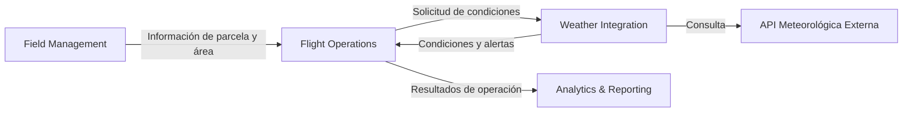

### Justificación

- **Field Management** mantiene la información territorial.
- **Flight Operations** gestiona el ciclo de vida de la misión.
- **Weather Integration** aísla la dependencia externa de información meteorológica.
- **Analytics & Reporting** transforma resultados en información histórica y reportes.

### 4.6.2. Software Architecture Context Diagram
El **System Context Diagram de C4** representa el sistema como una única unidad y muestra los usuarios y sistemas externos que interactúan directamente con él. En este nivel no se detallan tecnologías internas.

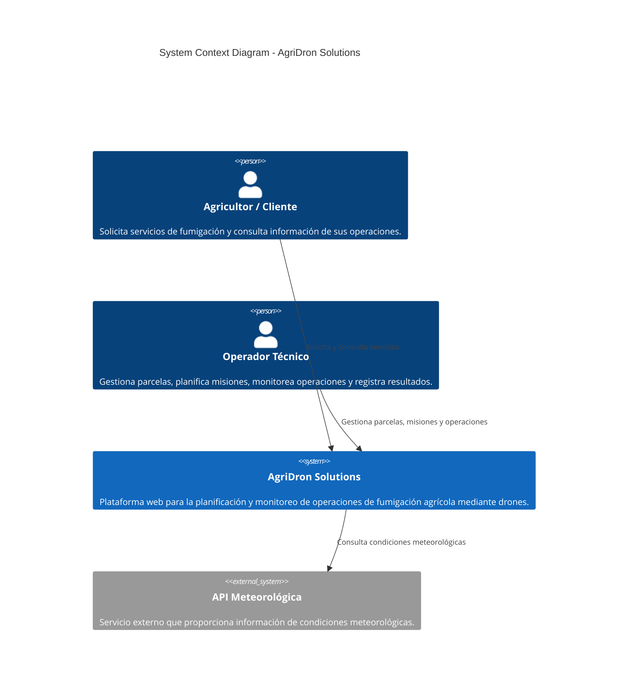

### Descripción

**AgriDron Solutions** es el sistema principal en el alcance de la solución. El **Agricultor / Cliente** interactúa con la plataforma para solicitar y consultar información relacionada con sus servicios, mientras que el **Operador Técnico** la utiliza para gestionar parcelas, planificar misiones, monitorear operaciones y registrar resultados.

La plataforma interactúa con una **API Meteorológica externa** para obtener información utilizada en la evaluación de las condiciones de operación.

### 4.6.3. Software Architecture Container Diagrams
El **Container Diagram de C4** realiza un acercamiento al sistema y muestra sus principales aplicaciones, servicios y almacenes de datos, incluyendo las tecnologías utilizadas y sus relaciones.

Los contenedores definidos son:

1. **Landing Page**
2. **Frontend Vue**
3. **Backend ASP.NET Core**
4. **Base de Datos Relacional**
5. **API Meteorológica Externa**

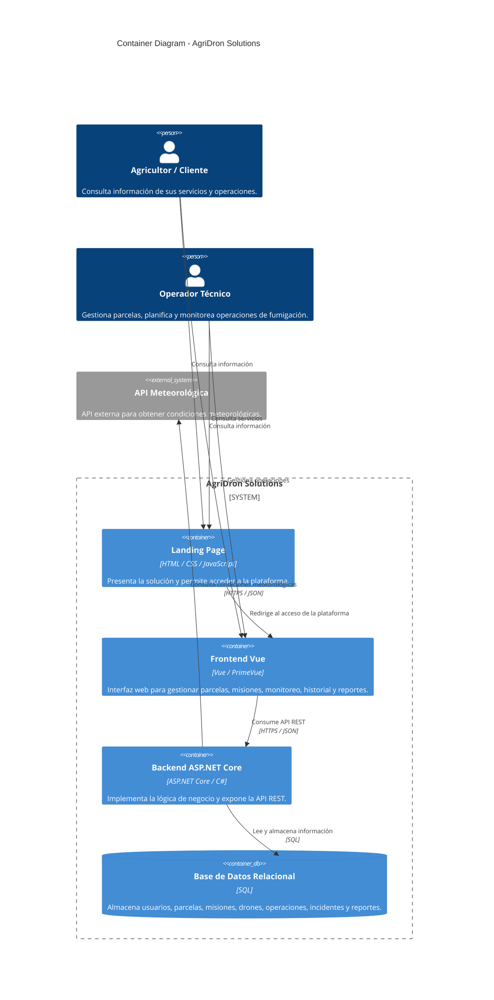

### Descripción de los contenedores

| Contenedor | Tecnología | Responsabilidad |
|---|---|---|
| **Landing Page** | HTML / CSS / JavaScript | Presentar AgriDron Solutions y facilitar el acceso a la plataforma. |
| **Frontend Vue** | Vue / PrimeVue | Proporcionar la interfaz para gestionar parcelas, misiones, monitoreo, historial y reportes. |
| **Backend ASP.NET Core** | ASP.NET Core / C# | Implementar la lógica de negocio, exponer servicios REST y coordinar datos y servicios externos. |
| **Base de Datos Relacional** | SQL | Persistir usuarios, parcelas, misiones, operaciones, incidentes y reportes. |
| **API Meteorológica** | Servicio externo | Proporcionar datos meteorológicos para apoyar la planificación. |

### Flujo de comunicación

1. El usuario accede a la **Landing Page**.
2. El usuario utiliza el **Frontend Vue** para gestionar o consultar información.
3. El **Frontend Vue** consume el **Backend ASP.NET Core** mediante API REST.
4. El **Backend ASP.NET Core** consulta y actualiza la **Base de Datos Relacional**.
5. El **Backend ASP.NET Core** consulta la **API Meteorológica** cuando se requiere información climática.
6. La información procesada se presenta mediante el **Frontend Vue**.

## Trazabilidad entre dominio y arquitectura

| Bounded Context | Responsabilidad | Soporte arquitectónico |
|---|---|---|
| **Field Management** | Campos, parcelas y áreas | Frontend + Backend + BD |
| **Flight Operations** | Misiones, drones, operaciones e incidentes | Frontend + Backend + BD |
| **Weather Integration** | Condiciones y alertas meteorológicas | Backend + API Meteorológica |
| **Analytics & Reporting** | Historial, métricas y reportes | Frontend + Backend + BD |

La correspondencia permite mantener trazabilidad entre el análisis de dominio realizado mediante Event Storming y la arquitectura propuesta para AgriDron Solutions.

### 4.6.4. Software Architecture Components Diagrams
Esta sección presenta el diseño interno de los principales componentes de software de **AgriDron Solutions**. Se mantiene la separación entre la aplicación web, los servicios REST y las integraciones externas, alineándolos con los Bounded Contexts definidos en la arquitectura.


## 4.6.4.1. RESTful API

La API RESTful implementada con ASP.NET Core concentra la lógica de aplicación y dominio. Se organiza en capas de presentación, aplicación, dominio e infraestructura.

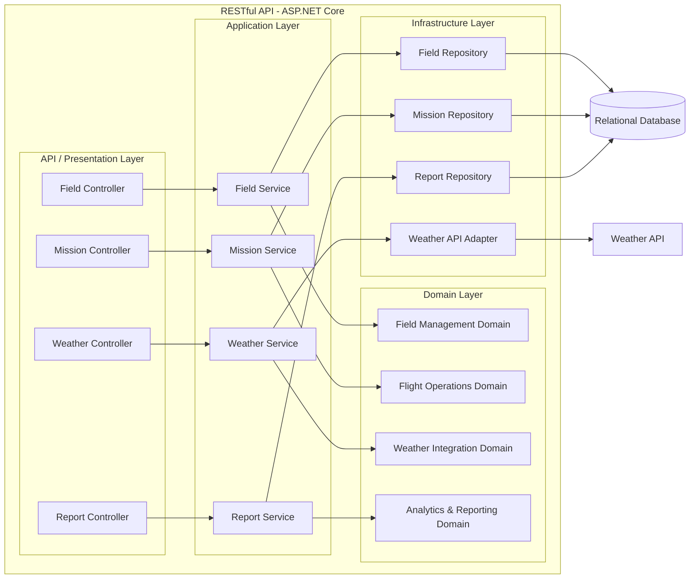

### Responsabilidades

| Capa | Responsabilidad |
|---|---|
| Presentation | Recibir solicitudes HTTP y devolver respuestas mediante endpoints REST. |
| Application | Coordinar casos de uso y orquestar operaciones del dominio. |
| Domain | Contener reglas y conceptos principales de cada Bounded Context. |
| Infrastructure | Implementar persistencia e integración con servicios externos. |

## 4.6.4.2. Web Application

La aplicación web utiliza Vue para proporcionar las funcionalidades de operadores y clientes.

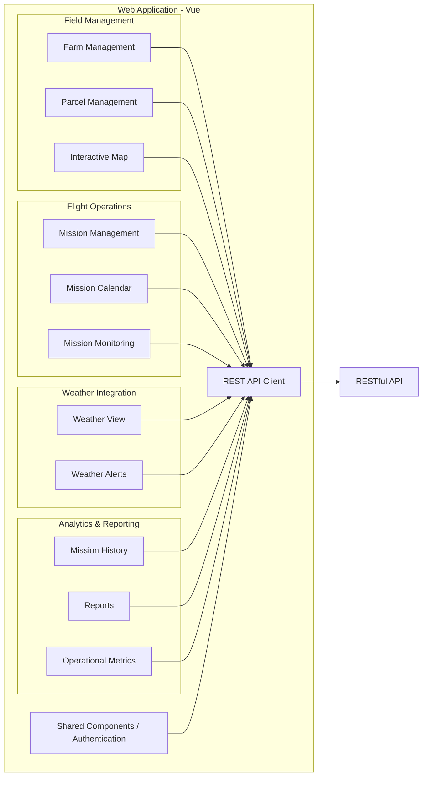

### Responsabilidades

- **Field Management:** administrar campos, parcelas y áreas de fumigación.
- **Flight Operations:** crear, programar y monitorear misiones.
- **Weather Integration:** mostrar condiciones y alertas meteorológicas.
- **Analytics & Reporting:** consultar historial y reportes.
- **Shared Components:** centralizar elementos reutilizables y autenticación.
- **REST API Client:** encapsular la comunicación con el Backend.

## 4.6.4.3. Weather Integration Component

La integración meteorológica se mantiene aislada para evitar acoplar directamente la lógica de negocio con la API externa.

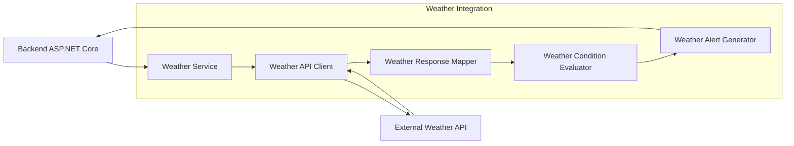

El componente permite cambiar o adaptar el proveedor meteorológico sin modificar directamente los componentes de **Flight Operations**.

---

## 4.7. Software Object-Oriented Design
El diseño orientado a objetos representa los principales elementos del dominio y sus relaciones. El Project Statement solicita que los Class Diagrams incluyan clases, interfaces, enumeraciones, atributos, métodos, visibilidad, relaciones y multiplicidades cuando correspondan.

### 4.7.1. Class Diagrams

### 4.7.1.1. Field Management

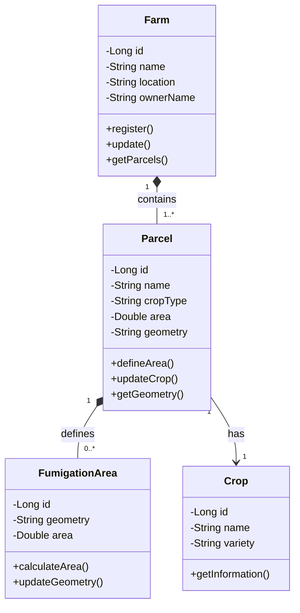

### 4.7.1.2. Flight Operations

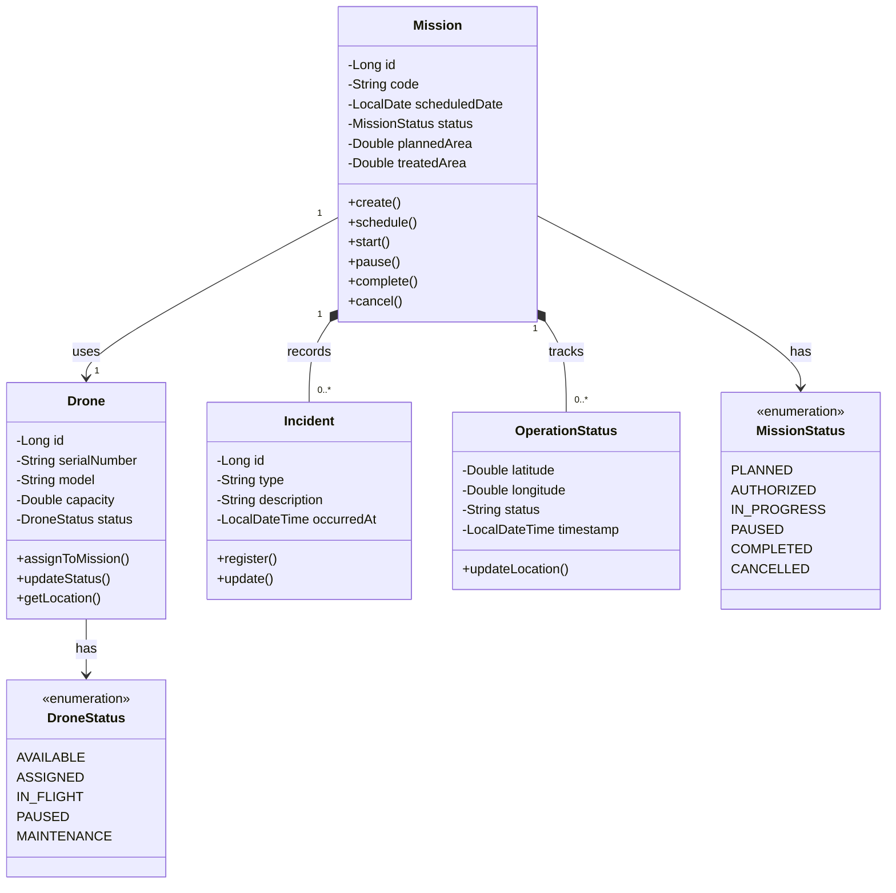

### 4.7.1.3. Weather Integration

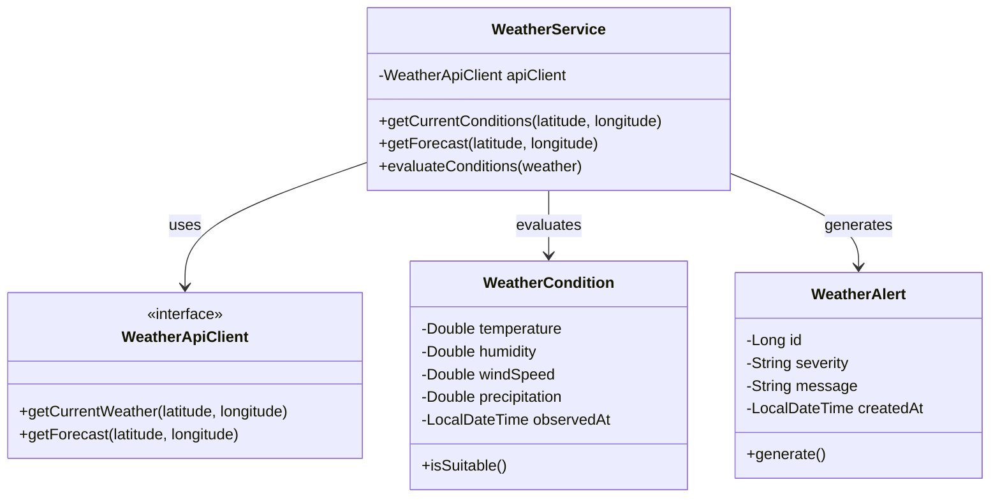

### 4.7.1.4. Analytics & Reporting

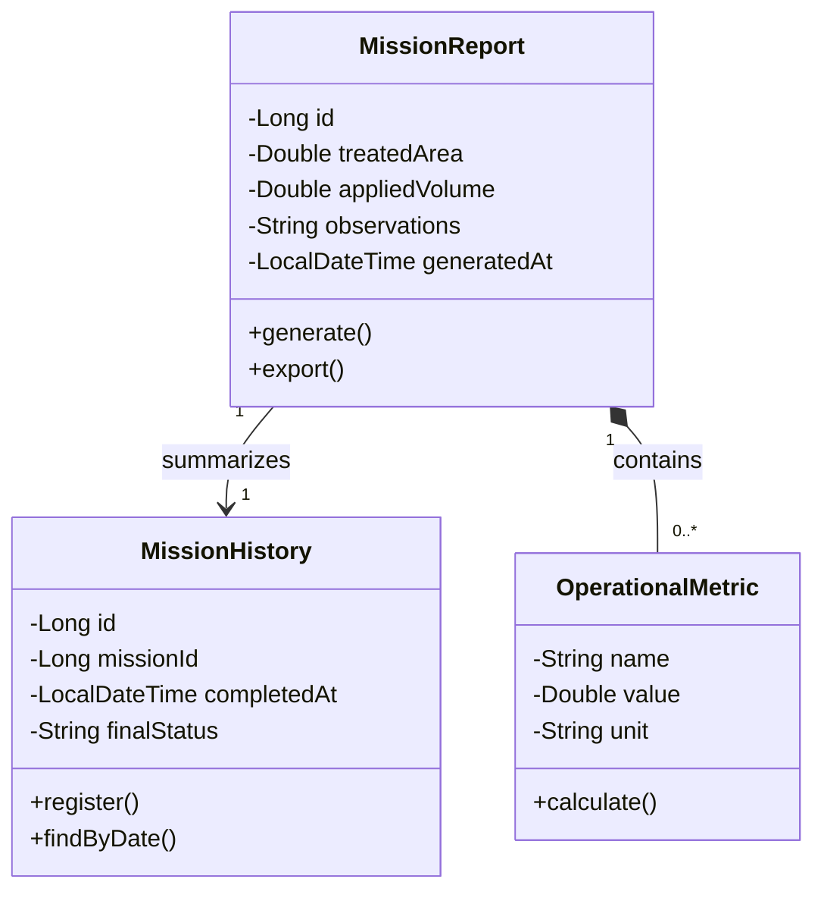

### 4.7.1.5. Shared / Identity

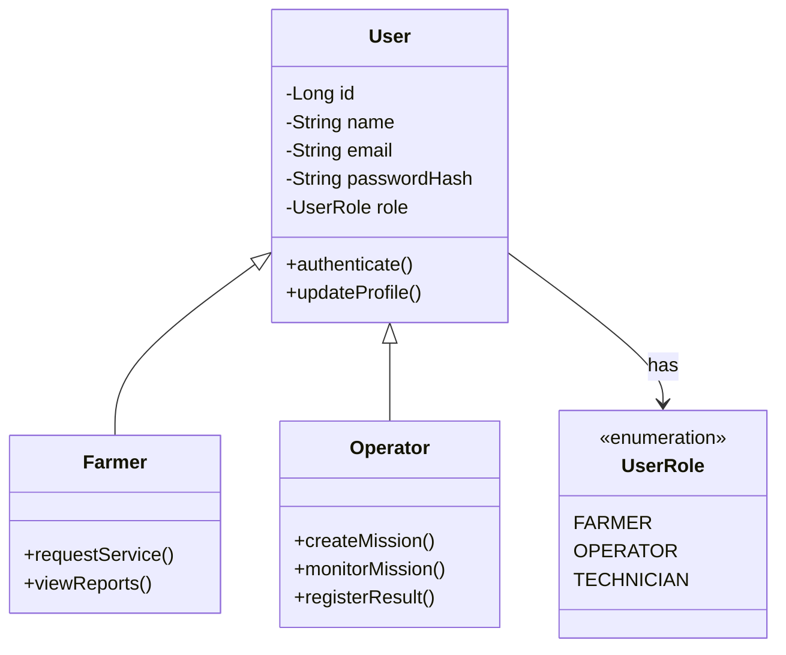

## 4.8. Database Design

### 4.8.1. Database Diagrams

<p align="justify">

El modelo de base de datos se derivó directamente de los Class Diagrams definidos en el apartado 4.7.1, traduciendo cada clase persistente a una tabla relacional. Las clases de servicio sin estado propio (<code>WeatherService</code>, <code>WeatherApiClient</code>) no se materializan como tablas, ya que no almacenan datos, solo orquestan la comunicación con la API meteorológica externa.

</p>

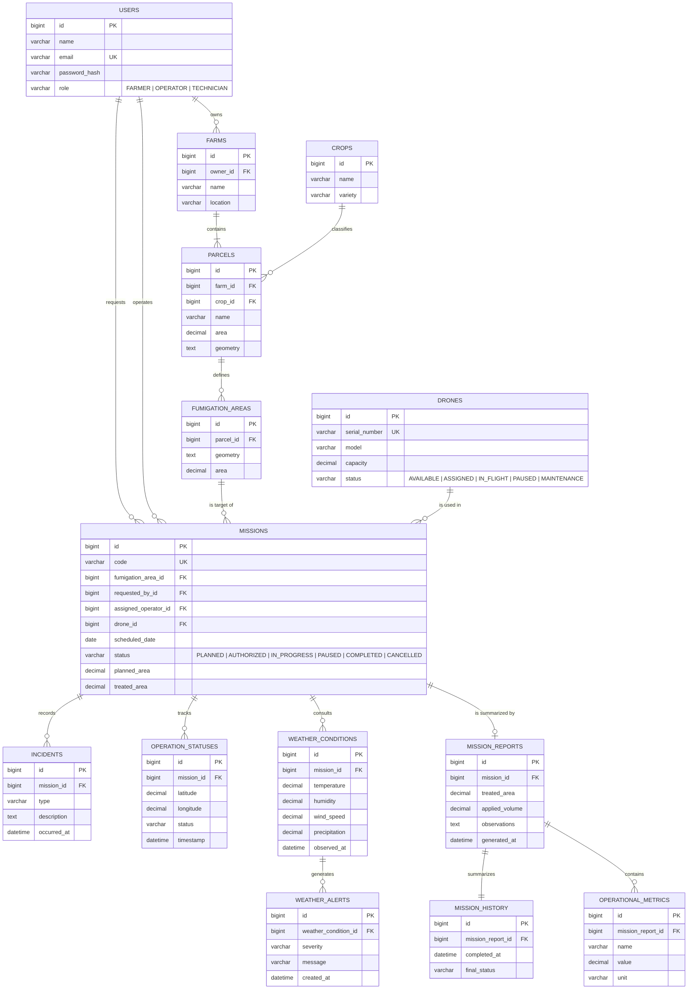

**Descripción:**

<p align="justify">

El modelo se organiza alrededor de cinco agrupaciones, alineadas con los bounded contexts definidos en el Design-Level Event Storming (4.6.1) y los Class Diagrams (4.7.1):

</p>

<ul>
  <li><strong>Identidad (USERS):</strong> se aplicó herencia de tabla única (single table inheritance) para <code>Farmer</code> y <code>Operator</code>, ya que en el modelo de clases ambas especializaciones de <code>User</code> solo agregan comportamiento (métodos) y no atributos adicionales. Por ello, el rol se resuelve con la columna discriminadora <code>role</code> en lugar de crear tablas separadas.</li>
  <li><strong>Field Management (FARMS, PARCELS, CROPS, FUMIGATION_AREAS):</strong> conserva la jerarquía de contención finca → parcela → área de fumigación definida en 4.7.1.1, agregando la clave foránea <code>owner_id</code> hacia <code>USERS</code> para vincular cada finca con el agricultor que la administra.</li>
  <li><strong>Flight Operations (MISSIONS, DRONES, INCIDENTS, OPERATION_STATUSES):</strong> <code>MISSIONS</code> concentra las claves foráneas hacia el área objetivo, el solicitante, el operador asignado y el dron utilizado. Los enumerados <code>MissionStatus</code> y <code>DroneStatus</code> del modelo de clases se representan como columnas <code>varchar</code> con los valores permitidos documentados, en lugar de tablas de catálogo independientes, dado que son listas cerradas y estables que no requieren atributos adicionales.</li>
  <li><strong>Weather Integration (WEATHER_CONDITIONS, WEATHER_ALERTS):</strong> cada consulta climática queda asociada a la misión que la originó, permitiendo sustentar técnicamente una pausa o cancelación, tal como se identificó en los hotspots del EventStorming (2.4).</li>
  <li><strong>Analytics & Reporting (MISSION_REPORTS, MISSION_HISTORY, OPERATIONAL_METRICS):</strong> replica la relación 1 a 1 entre <code>MissionReport</code> y <code>MissionHistory</code>, y la composición 1 a N con <code>OperationalMetric</code>, tal como fueron definidas en 4.7.1.4.</li>
</ul>

---
