# Capítulo IV: Product Design

## 4.1. Style Guidelines

### 4.1.1. General Style Guidelines

AgriDron Solutions adopta un sistema de diseño coherente, funcional y optimizado para la gestión de operaciones de fumigación agrícola con drones
y monitoreo de cultivos. En esta sección se establecen los lineamientos de estilo que garantizan la consistencia visual y de interacción en todo el
ecosistema digital, incluyendo la landing page y la aplicación web. Se detallan las decisiones de branding,
paleta de colores, tipografía, espaciado, tono y lenguaje de la plataforma.

Estos criterios se fundamentan en principios de diseño como jerarquía visual, legibilidad, contraste y feedback inmediato. Asimismo, responden a un
enfoque accesible e intuitivo para que los agricultores, operadores de drones y supervisores del campo puedan interactuar con la plataforma en entornos
de alta exigencia operativa sin sobrecarga cognitiva.

**1. Logo:**

El isotipo y logotipo de AgriDron Solutions representan la convergencia entre la tecnología de precisión y la naturaleza agrícola.
El símbolo gráfico combina hojas estilizadas que aluden al campo y a los cultivos con una disposición simétrica que simula la estructura
y rotación de los hélices de un dron agrícola. Acompañado de la tipografía de marca, transmite innovación, orden y profesionalismo
tecnológico aplicado al sector agropecuario.

**2. Branding:**

AgriDron Solutions busca proyectar una identidad visual profesional, confiable, innovadora, cercana y sostenible. La marca combina
la eficiencia tecnológica de los drones con la calidez y el valor humano del trabajo en el campo.

El branding de AgriDron se fundamenta en los siguientes conceptos clave:
- **Arquetipo de Marca:** El Experto / El Creador, posicionando a AgriDron como un socio tecnológico confiable que empodera a los productores agrícolas mediante herramientas de precisión.
- **Precisión:** Reflejada en interfaces ordenadas, grids estructurados, bordes definidos y líneas limpias para la visualización de mapas y datos telemétricos.
- **Confianza:** Proyectada mediante colores sobrios, tipografías claras y la presentación segura de métricas de salud de cultivos, consumo de insumos y reportes.
- **Innovación:** Transmitida a través de componentes dinámicos e indicadores visuales destacados para estados en tiempo real y alertas de misiones.
- **Sostenibilidad y Cercanía:** Inspiradas en una paleta orgánica y el uso de imágenes reales de campo, conectando la tecnología directamente con la realidad del agricultor.

**3. Typography:**
El sistema tipográfico de AgriDron emplea tres familias de fuentes seleccionadas para equilibrar fuerza de marca,
alta legibilidad en pantallas y precisión técnica en datos:

- **Brand / Títulos principales (Segoe UI):** Se utiliza en fuentes sans-serif para títulos (Display, Headline), encabezados
  de la landing page y secciones principales de la aplicación. Aporta modernidad y estructura visual limpia.

- **Plain / Cuerpo de texto (Montserrat):** Se emplea para el cuerpo de texto, párrafos, formularios, tablas, etiquetas y botones
  generales. Su alto rendimiento de lectura garantiza claridad en la consulta de datos operativos.

**4. Colors:**

La paleta de colores de AgriDron está inspirada en la naturaleza y el sector agrícola, complementada con tonos tecnológicos y de alto
contraste para maximizar la legibilidad en campo y gabinetes operativos:

- **Verde Bosque / Primario (#1B463C):** Transmite sostenibilidad, naturaleza y confianza agrícola. Se utiliza en headers, navegación.
- **Verde Teal / Secundario (#20AC87):** Aporta dinamismo y frescura. Se usa en botones interactivos (CTAs), estados activos de misiones y gráficos de progreso.
- **Azul Tecnológico (#1E3A8A):** Representa precisión, telemetría y fiabilidad técnica en la plataforma. Utilizado en datos de vuelo y componentes de monitoreo.
- **Amarillo / Alerta (#F59E0B):** Destinado a estados programados, advertencias meteorológicas y notificaciones de atención.
- **Neutros (Blanco #FFFFFF y Gris Claro #F8FAFC):** Garantizan orden, espacio respirable y balance visual en la interfaz.

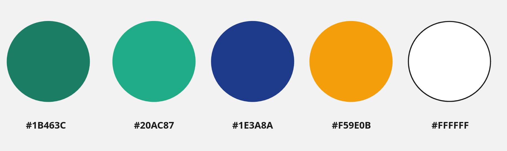

**5. Spacing:**

El sistema de espaciado adopta una escala base basada en múltiplos de 8 px (8px, 16px, 24px, 32px). Este patrón asegura un diseño estructurado y modular que
facilita la lectura fluida de mapas, parcelas y paneles de control, permitiendo además una fácil adaptación responsive a tablets y dispositivos móviles.

**6. Tone:**

El tono de comunicación de AgriDron es profesional, confiable, claro, transparente y accesible. Debido a que los usuarios interactúan con datos de salud
de cultivos, mapas de parcelas y programación de fumigación, el tono debe brindar seguridad y control técnico sin resultar excesivamente complejo o burocrático.   
AgriDron busca transmitir:

- **Seguridad y Control:** al presentar métricas de avance de misión, niveles de batería e insumos.
- **Claridad y Eficiencia:** al guiar al agricultor paso a paso en la planificación de una fumigación.
- **Cercanía:** al usar terminología conocida por el productor agrícola (finca, parcela, cultivo, insumo).

**7. Language:**

El lenguaje del sistema será directo, breve y orientado a la acción. El idioma principal de la interfaz será
el Español (es_419), adaptado al entorno agrícola latinoamericano, contando con soporte para Inglés (en_US).

Se priorizarán frases cortas e imperativas que reduzcan la carga cognitiva:

- Nueva misión en lugar de Registrar solicitud de servicio de fumigación.
- Seleccionar parcela en lugar de Elegir área geográfica de terreno agrícola.
- Monitorear vuelo en lugar de Visualizar estado de la telemetría del dron en ejecución.
- Descargar reporte en lugar de Generar informe detallado de rendimiento de insumos.

### 4.1.2. Web Style Guidelines

Las Web Style Guidelines de AgriDron Solutions establecen los criterios visuales y de interacción que
guían el diseño de la landing page y la web application. Estas pautas aseguran consistencia entre dispositivos,
favorecen la legibilidad y permiten que tanto agricultores, operadores técnicos y supervisores naveguen de forma intuitiva por la plataforma.

**Estructura general**

AgriDron Solutions adopta un enfoque responsive web design, de modo que la interfaz se adapte correctamente a desktop,
laptop, tablet y mobile web sin perder claridad ni coherencia visual.

- **Desktop:** La navegación principal se presenta mediante sidebar lateral y header superior. Los módulos con mayor densidad informativa, como la gestión de parcelas en mapa satelital, monitoreo de misiones, inventario y reportes de productividad, aprovechan mejor el ancho disponible mediante tablas, mapas interactivos, tarjetas de métricas y filtros visibles.

- **Tablet:** La estructura se reorganiza a 6 u 8 columnas, reduciendo el número de elementos visibles por fila. Los paneles laterales pueden colapsarse y ciertas tablas o paneles de telemetría pasan a formatos más compactos para facilitar la interacción táctil en campo.

- **Mobile Web:** La estructura se simplifica a una sola columna. Los elementos se apilan verticalmente, se priorizan botones de acción principal (como iniciar misión o registrar incidencia) y la navegación se compacta mediante menú hamburguesa o navegación inferior, según el flujo de trabajo.

**Breakpoints**

Se proponen los siguientes breakpoints para asegurar una adaptación consistente en todos los entornos de uso:

- Mobile: hasta 767 px.
- Tablet: desde 768 px hasta 1023 px.
- Desktop: 1024 px en adelante.

**Componentes básicos de UI**

- Botones primarios: fondo verde bosque #1E4D2B o verde acento #10B981, texto blanco, bordes redondeados de 8 px a 12 px. Se utilizan para acciones clave como + Nueva finca, + Nueva parcela, Crear misión, Confirmar e Iniciar sesión.
- Botones secundarios: fondo blanco o gris claro #F8FAFC, borde en verde bosque #1E4D2B o gris #CBD5E1, con texto oscuro. Se emplean para acciones complementarias como Cancelar, Ver detalle, Filtrar o Volver.
- Inputs y formularios: bordes suaves (#CBD5E1), fondo claro e interno con suficiente padding para facilitar la lectura e interacción. El estado enfocado resalta mediante un borde verde acento #10B981. El estado de error utiliza un borde rojo #EF4444 con un mensaje de validación visible debajo del campo.
- Cards: contenedores rectangulares con esquinas redondeadas, padding interno de 16 px a 24 px y jerarquía clara entre título, contenido y acciones. Se usan en el dashboard principal, resumen meteorológico, métricas de cultivo, tarjetas de fincas y vistas de misiones.
- Tablas: encabezados destacados sobre fondo tenue, filas con separación visual suficiente mediante bordes sutiles y acciones agrupadas al extremo derecho. En resoluciones pequeñas, las tablas se transforman en tarjetas apiladas para mejorar la lectura rápida en dispositivos móviles de campo.
- Sidebar: navegación vertical persistente en desktop, con acceso a Dashboard (Inicio), Fincas, Parcelas, Misiones, Drones / Monitoreo, Reportes, Inventario y Configuración. En tablet y mobile web la barra lateral se colapsa automáticamente.
- Header: barra superior que alberga el nombre del usuario autenticado, su rol (Agricultor, Operador, Supervisor), buscador global, widget de notificaciones / alertas meteorológicas y acceso rápido a configuración o cierre de sesión.

**Tipografía en web**

La propuesta tipográfica de AgriDron Solutions mantiene como base las familias tipográficas Inter y Roboto, según la identidad visual previamente definida:

- Títulos principales (H1): Segoe UI, 24 px a 28 px.
- Subtítulos (H2): Segoe UI SemiBold, 20 px a 22 px.
- Encabezados de sección (H3): Segoe UI Medium, 18 px.
- Texto de párrafo y descripciones: Montserrat Regular, 14 px a 16 px.
- Texto en botones: Montserrat SemiBold, 14 px a 16 px.
- Etiquetas de formularios y tablas: Montserrat Medium, 13 px a 14 px.
- Datos técnicos y telemetría: Montserrat, 12 px a 14 px (utilizado para coordenadas GPS, logs del dron y métricas de vuelo).

**Interacción**

- Hover: Los botones incrementan ligeramente el contraste o brillo del color base (verde o gris). Los enlaces se subrayan o cambian a un tono más intenso del verde corporativo.
- Focus: Todo componente interactivo muestra un estado visible de foco (anillo de resalte en verde acento #10B981), especialmente en inputs, botones y controles de mapa, para favorecer la accesibilidad y navegación por teclado.
- Active / Click: Los botones aplican una ligera reducción de escala o sombra interna para confirmar la pulsar o interacción del usuario.
- Feedback visual: Estados como éxito (Completada), error / advertencia (Pausada, Ráfaga de viento alto), pendiente (Programada) o información en progreso (En curso) se distinguen mediante color (verde, rojo, amarillo/ámbar, azul), iconografía representativa y texto breve de confirmación.
- Scroll y navegación persistente: En desktop, el header superior y los controles interactivos del mapa satelital permanecen fijos (sticky) para facilitar la navegación y el monitoreo continuo durante desplazamientos verticales largos.
- Responsive behavior: El contenido prioritario (estado de misión, mapa interactivo y botones de acción rápida) conserva visibilidad inmediata antes que elementos decorativos o información secundaria en pantallas reducidas.

### 4.1.3. Mobile Style Guidelines

Las Mobile Style Guidelines de AgriDron Solutions tienen como objetivo adaptar la experiencia de uso a pantallas reducidas sin perder funcionalidad, claridad visual ni consistencia con la propuesta general del producto. Estas pautas priorizan rapidez de interacción en campo, facilidad de lectura bajo luz solar directa y acceso inmediato a acciones frecuentes de fumigación y monitoreo.

**Estructura general**

La experiencia móvil de AgriDron Solutions está diseñada para que agricultores, operadores técnicos y supervisores puedan consultar información crítica de parcelas y ejecutar acciones esenciales de campo desde cualquier lugar.

- Pantallas en una sola columna, con contenido apilado verticalmente.
- Header compacto, con el logo de AgriDron, nombre de la vista actual y acceso a notificaciones, alertas meteorológicas o menú desplegable.
- Navegación simplificada, priorizando las secciones más importantes según el rol del usuario (Inicio, Fincas, Parcelas, Misiones y Monitoreo).
- Botones de acción visibles, especialmente en flujos clave como + Nueva finca, + Nueva parcela, Crear misión o Pausar vuelo.
- Tarjetas resumidas e interactivas, en lugar de tablas complejas, para mostrar parcelas, misiones recientes, condiciones climáticas y telemetría de drones de forma clara y directa.

**Componentes básicos en mobile**

- Botones primarios: verde bosque #1E4D2B o verde acento #10B981, texto blanco, esquinas redondeadas de 12 px y un área táctil mínima de 44 x 44 px para facilitar la interacción en terreno.
- Botones secundarios: fondo blanco o gris claro #F8FAFC con borde visible en verde o gris y alto contraste.
- Inputs: ancho completo (100%), padding amplio y separación mínima de 16 px entre campos para evitar pulsaciones accidentales.
- Cards de resumen: usadas para misiones, parcelas, clima y telemetría (batería, altitud, flujo de insumo), con distribución vertical y jerarquía visual clara.
- Listas: los registros de fincas y misiones se organizan en bloques táctiles con título, estado, fecha, extensión en hectáreas (ha) y acción principal (Ver, Monitorear).
- Indicadores de estado: cada misión o alerta utiliza color y texto explícito para distinguir rápidamente condiciones como En curso (verde), Completada (azul), Programada (amarillo/ámbar) o Pausada / Alerta (rojo).

**Tipografía en mobile**

La adaptación móvil de AgriDron Solutions mantiene la coherencia con las familias tipográficas Inter (títulos) y Roboto (cuerpo e interfaz):

- Título principal (H1): Segoe UI Bold, 20 px a 22 px.
- Subtítulos (H2): Segoe UI SemiBold, 16 px a 18 px.
- Texto general y párrafos: Montserrat Regular, 14 px.
- Botones: Montserrat SemiBold, 14 px.
- Etiquetas pequeñas o estados: Montserrat Medium, 12 px a 13 px.
- Datos de telemetría y coordenadas: Montserrat, 12 px a 13 px (utilizado para niveles de batería, velocidad m/s, flujo de líquido L/min y coordenadas GPS).

**Interacción en mobile**

- Acciones rápidas y flujos cortos: Se priorizan flujos simplificados (como el dibujo de parcelas o la planificación de misiones en 3 o 4 pasos) para optimizar el trabajo en el campo.
- Dimensiones táctiles: Todos los botones y componentes interactivos respetan el tamaño mínimo de área táctil (44 x 44 px).
- Formularios en bloques: Los formularios de registro de parcelas, cultivos e insumos se dividen en secciones o pasos breves para evitar la fatiga visual.
- Alcance del pulgar: Las acciones críticas (como confirmar una misión o pausar una operación de emergencia) se colocan estratégicamente en la zona inferior de la pantalla al alcance natural del pulgar.
- Feedback inmediato: Los cambios de estado de vuelo, alertas meteorológicas o el guardado de datos se muestran instantáneamente mediante mensajes visibles (toast notifications), banners contextuales e indicadores de color explícitos.

---

## 4.2. Information Architecture

La arquitectura de información de AgriDron Solutions ha sido diseñada para que los tres segmentos principales de usuarios —agricultores, operadores técnicos y supervisores de operaciones— puedan localizar información, ejecutar tareas y comprender el estado de sus operaciones de fumigación con drones de forma rápida y consistente. Esta propuesta abarca tanto la Landing Page como la Web Application, de modo que exista continuidad entre la experiencia de descubrimiento del producto y la experiencia de uso dentro de la plataforma operativa.

En el caso de la Landing Page, la arquitectura de información busca guiar al visitante desde una comprensión inicial de los retos en la fumigación tradicional hacia una acción concreta, ya sea registrarse, solicitar una demostración o explorar las funcionalidades clave según su rol en el campo. Para ello, el contenido se organiza en bloques progresivos: propuesta de valor (Hero section), funcionalidades principales (planificación, monitoreo en tiempo real, IA predictiva), proceso de funcionamiento en 4 pasos, actores principales (agricultores, operadores, supervisores), planes de precios/suscripción, nuestro equipo y llamadas a la acción (CTAs). Esta secuencia permite que el usuario comprenda qué resuelve AgriDron Solutions, a quién está dirigido y cómo puede empezar a digitalizar sus cultivos.

En la Web Application, la arquitectura de información responde a una lógica netamente operativa e interactiva. En lugar de priorizar la persuasión o el descubrimiento, la aplicación prioriza la velocidad de acceso, la visibilidad en tiempo real del estado de los vuelos y la ejecución eficiente de tareas en campo. Por ello, el contenido se distribuye en módulos funcionales diferenciados por rol, donde cada usuario accede únicamente a las secciones necesarias para gestionar fincas y parcelas sobre mapas satelitales, programar y asignar misiones de pulverización, monitorear la telemetría de los drones (batería, volumen de insumo, altitud), consultar validaciones climáticas y generar reportes de productividad.

De esta manera, la arquitectura de información de AgriDron Solutions se apoya en cuatro sistemas complementarios: Organization Systems (sistemas de organización), Labeling Systems (sistemas de etiquetado), Searching Systems (sistemas de búsqueda) y Navigation Systems (sistemas de navegación). En conjunto, estos sistemas permiten estructurar la información de forma entendible, reducir la sobrecarga cognitiva en entornos de campo y mantener una experiencia coherente entre la web pública y la plataforma transaccional.

### 4.2.1. Organization Systems

La organización del contenido en AgriDron Solutions responde a la naturaleza de cada producto digital y al tipo de tarea que el usuario necesita realizar. La Landing Page organiza información para presentar, explicar y convencer sobre los beneficios de la agricultura de precisión con drones; mientras que la Web Application organiza información para operar, monitorear el vuelo y la dispersión de insumos en tiempo real, y tomar decisiones sobre el manejo de cultivos. Por ello, se aplican distintos esquemas de organización visual y categorización según el contexto.

**Organization Systems in the Landing Page**

En la Landing Page, la información se organiza principalmente de forma jerárquica y secuencial. La jerarquía visual permite destacar de inmediato la propuesta de valor, las funcionalidades clave y los llamados a la acción (CTAs) más importantes. La secuencia guía al visitante por un recorrido progresivo: primero entiende la problemática del campo, luego conoce la solución tecnológica de AgriDron, después explora sus capacidades paso a paso y finalmente recibe estímulos para registrarse, iniciar sesión o solicitar una demostración.

La estructura general de la Landing Page sigue el siguiente flujo:

- Hero section: Presenta la propuesta de valor principal ("Revoluciona la salud de tus cultivos con precisión automatizada") y los botones de acción clave (Empieza tu prueba gratuita, Ver cómo funciona, Solicitar Demo).
- Sección de funcionalidades: Muestra los pilares tecnológicos del sistema: Planificación de misiones, Monitoreo en tiempo real e IA predictiva.
- Sección de "Cómo funciona": Muestra la secuencia operativa en 4 pasos (1. Planifica, 2. Consulta el clima, 3. Ejecuta, 4. Analiza)
- Sección de "Para quién" (audiencia): Categoriza la solución según los actores clave del sector agrícola (Agricultores, Operadores, Supervisores).
- Sección de "Nuestro equipo": Presenta a los profesionales responsables del desarrollo de la plataforma para generar confianza.
- Footer: Reúne la navegación secundaria, datos de contacto, ubicación, políticas legales y enlaces a redes sociales.

Esta estructura no es aleatoria: busca reducir fricción en el recorrido del visitante y facilitar que identifique en pocos segundos cómo la plataforma optimiza el rendimiento de sus terrenos agrícolas.

**Organization Systems in the Web Application**

En la Web Application, la organización del contenido es principalmente por tópicos, por audiencia y cronológica, según el tipo de información mostrada.

- Por tópicos: Se emplea en el menú principal (sidebar), donde las funcionalidades se agrupan en módulos como Fincas, Parcelas, Misiones, Monitoreo, Reportes, Inventario y Configuración.
- Por audiencia (roles): Se aplica al adaptar la experiencia según el tipo de usuario: Agricultor, Operador y Supervisor. Cada rol visualiza los módulos y datos relevantes para su nivel de responsabilidad en la operación.
- Cronológica: Se utiliza en los historiales de vuelo, registros de telemetría, diario de incidencias climáticas y reportes de insumos aplicados en el tiempo.
- Matricial: Se emplea en vistas donde el usuario necesita comparar múltiples variables simultáneamente, como tablas de misiones, reportes de eficiencia por hectárea o el inventario de agroquímicos.

**Organización visual del contenido**

| Tipo de organización | Aplicación en AgriDron Solutions                                                                                                                   | Justificación                                                                                                               |
|:---------------------|:---------------------------------------------------------------------------------------------------------------------------------------------------|:----------------------------------------------------------------------------------------------------------------------------|
| **Jerárquica**       | Hero section, Dashboard principal, tarjetas de métricas (KPIs) y panel de telemetría del dron.                                                     | Permite destacar estados de vuelo activos, condiciones del clima y métricas de superficie (ha) antes que datos secundarios. |
| **Secuencial**       | Registro de usuario, flujo de "Cómo funciona" y planificación de misiones en 4 pasos (*1. Parcela → 2. Tratamiento → 3. Fecha/Hora → 4. Resumen*). | Guía al agricultor o supervisor paso a paso en la definición de la fumigación, evitando errores operacionales.              |
| **Matricial**        | Historial de misiones, consumo de insumos, tablas de personal y reportes de rendimiento por hectárea.                                              | Facilita comparar atributos como hectáreas cubiertas, fecha, tipo de cultivo, estado de misión y operador asignado.         |

**Esquemas de categorización**

| Tipo de esquema   | Aplicación en AgriDron Solutions                                                        | Justificación                                                                                                    |
|:------------------|:----------------------------------------------------------------------------------------|:-----------------------------------------------------------------------------------------------------------------|
| **Por tópicos**   | Fincas, Parcelas, Misiones, Monitoreo, Reportes, Inventario, Personal y Configuración.  | Agrupa el contenido según la tarea operativa que el usuario busca realizar sobre sus terrenos o flota de drones. |
| **Cronológico**   | Historial de misiones ejecutadas, registros melemétricos de vuelo y log de incidencias. | Facilita el seguimiento temporal de las aplicaciones de fertilizantes/pesticidas y auditorías agrícolas.         |
| **Por audiencia** | Vista Agricultor, Vista Operador y Vista Supervisor.                                    | Reduce la sobrecarga cognitiva y adapta las opciones según el rol de campo o gabinete.                           |

**Esquemas no priorizados**

AgriDron Solutions no prioriza un esquema alfabético como estructura principal, ya que la gestión agrícola no depende de una búsqueda lexical, sino de interacciones geoespaciales sobre mapas satelitales, estados de misión y prioridades operativas en campo. Aunque los listados de parcelas o insumos puedan ordenarse alfabéticamente como filtro secundario, la plataforma prioriza la ubicación, la urgencia de fumigación y el estado del vuelo.

Tampoco se utiliza una organización puramente temática en la Landing Page sin jerarquía de conversión, porque la interfaz pública busca impulsar al usuario a iniciar una prueba o solicitar una demostración en el menor número de pasos posible.

**Secciones principales de AgriDron Solutions**

La aplicación se estructura en tres entornos diferenciados según el rol del usuario:

**Vista Agricultor**

| Sección                      | Descripción                                                                                                             |
|:-----------------------------|:------------------------------------------------------------------------------------------------------------------------|
| **Dashboard (Inicio)**       | Resumen del estado general: fincas registradas, parcelas, misiones activas, hectáreas totales y widget de clima actual. |
| **Fincas**                   | Registro, edición y administración de los predios agrícolas con su ubicación y extensión.                               |
| **Parcelas**                 | Delimitación y visualización de lotes sobre mapa satelital interactivo con información de cultivo y área.               |
| **Misiones (Planificación)** | Creación y solicitud de misiones de fumigación seleccionando parcela, tipo de tratamiento e insumo.                     |
| **Monitoreo de Misiones**    | Seguimiento en tiempo real del progreso del vuelo, ruta sobre la parcela y telemetría básica.                           |
| **Reportes e Historial**     | Consulta de misiones pasadas, volumen de insumos utilizados y reportes de productividad por hectárea.                   |
| **Configuración**            | Perfil del usuario, gestión de notificaciones e integración con alertas meteorológicas.                                 |

**Vista Operador**

| Sección                      | Descripción                                                                                                            |
|:-----------------------------|:-----------------------------------------------------------------------------------------------------------------------|
| **Dashboard / Mis Misiones** | Lista de misiones de fumigación asignadas para la jornada con detalles de ubicación y cultivo.                         |
| **Ejecución y Monitoreo**    | Control en tiempo real del vuelo, telemetría del dron (batería, altitud, velocidad, flujo) y actualización de estados. |
| **Registro de Incidencias**  | Documentación de interrupciones operativas en campo (vientos fuertes, fallas técnicas, lluvia).                        |
| **Horas Trabajadas**         | Registro de jornada laboral con verificación de ubicación GPS para garantizar precisión operativa.                     |

### 4.2.2. Labeling Systems

El sistema de etiquetado de AgriDron Solutions ha sido diseñado para que cada elemento de la interfaz comunique su propósito de forma inmediata. Las etiquetas se redactan con términos breves, directos y familiares para el contexto agronómico y de operaciones con drones, evitando tecnicismos innecesarios. Esto permite que el usuario comprenda con rapidez qué sección está visitando, qué acción puede ejecutar y qué resultado debe esperar.

A diferencia de un simple glosario, el sistema de etiquetado de AgriDron Solutions se aplica de manera concreta en zonas específicas de la interfaz, como la navbar de la Landing Page, el sidebar de la aplicación, los botones principales, los formularios, los breadcrumbs y los mensajes de estado.

**Labeling in the Landing Page**

En la Landing Page, las etiquetas priorizan claridad comercial y orientación a la conversión. Se emplean principalmente en:

- Navbar superior: Inicio (Home), Funcionalidades (Features), Cómo funciona (How it works), Precios (Pricing), Preguntas Frecuentes (FAQ), Iniciar sesión (Sign in).
- Botones principales del hero: Solicitar Demo, Crear cuenta, Probar gratis, Soy Agricultor, Soy Operador.
- Secciones informativas: Beneficios, Casos de uso, Nuestro equipo, Preguntas frecuentes.
- Footer: Contacto, Políticas de privacidad, Términos y condiciones, Soporte técnico.

Estas etiquetas permiten que el visitante identifique rápidamente la estructura del contenido y pueda desplazarse hacia las secciones que más le interesan antes de tomar una decisión.

**Labeling in the Web Application**

En la Web Application, las etiquetas se enfocan en apoyar la operación diaria del usuario en campo y gabinete. Se distribuyen en los siguientes puntos:

- Sidebar o menú lateral: Dashboard, Fincas, Parcelas, Misiones, Monitoreo, Inventario, Reportes, Configuración.
- Header: Notificaciones, Mi perfil, Cambiar rol, Cerrar sesión
- Botones de acción: + Nueva finca, + Nueva parcela, Crear misión, Iniciar vuelo, Pausar misión, Ver detalles, Guardar cambios, Cancelar.
- Breadcrumbs: Misiones > Detalle de Misión, Parcelas > Crear Parcela, Fincas > Lote 1, Reportes > Rendimiento por Hectárea.
- Formularios: Nombre de parcela, Extensión (ha), Tipo de cultivo, Producto / Insumo, Dosis por hectárea, Fecha de fumigación, Operador asignado.
- Mensajes de estado: En curso / En ejecución, Completada, Programada, Pausada, Alerta de clima, Stock bajo.

**Criterios del sistema de etiquetado**

El sistema de etiquetado de AgriDron Solutions sigue los siguientes criterios:

- Brevedad: Las etiquetas deben usar el menor número de palabras posible sin perder claridad.
- Consistencia: Un mismo concepto (Parcela, Misión, Insumo) debe nombrarse siempre de la misma manera en toda la plataforma.
- Familiaridad: Se priorizan términos cercanos al usuario real del dominio agrícola y técnico.
- Orientación a la acción: Los botones y acciones usan verbos claros que indican lo que ocurrirá (Crear misión, Iniciar vuelo, Descargar reporte).
- Escaneabilidad: Las etiquetas deben poder comprenderse rápidamente incluso en interfaces densas como mapas satelitales, tablas telemétricas y dashboards.

**Etiquetas principales del sistema**

| Etiqueta              | Lugar de uso                          | Descripción                                                                                       |
|:----------------------|:--------------------------------------|:--------------------------------------------------------------------------------------------------|
| **Iniciar sesión**    | Navbar, formularios de acceso         | Permite ingresar con una cuenta existente a la plataforma.                                        |
| **Crear cuenta**      | Hero section, formularios de registro | Permite registrarse como nuevo usuario agricultor, operador o supervisor.                         |
| **Dashboard**         | Sidebar, header, breadcrumbs          | Pantalla inicial con el resumen principal de métricas, fincas, parcelas y clima.                  |
| **Fincas / Parcelas** | Sidebar, títulos de vista, mapas      | Módulo para la delimitación geoespacial y administración de terrenos agrícolas.                   |
| **Crear misión**      | Botón principal, módulo de misiones   | Acción para programar y definir una nueva orden de fumigación con dron.                           |
| **Estado de misión**  | Tablas, cards, vista de monitoreo     | Indicador del avance operativo de la pulverización (*Programada, En curso, Completada, Pausada*). |
| **Telemetría**        | Panel de control del dron, mapas      | Vista en tiempo real de nivel de batería, altitud, velocidad y flujo de pulverización (L/min).    |
| **Alerta climática**  | Dashboard, header, tarjetas           | Notificación operativa sobre condiciones de viento, lluvia o humedad fuera de rango.              |
| **Inventario**        | Sidebar, títulos de vista             | Módulo de gestión y control de insumos agrícolas (agroquímicos, pesticidas, fertilizantes).       |
| **Reportes**          | Sidebar, tablas, exportables          | Módulo de análisis, visualización de métricas e historial de rendimiento por hectárea.            |
| **Configuración**     | Sidebar, header                       | Área de gestión del perfil, flota de drones, personal asignado y parámetros del sistema.          |
| **Cerrar sesión**     | Header, menú de usuario               | Acción para salir de la cuenta activa de forma segura.                                            |

### 4.2.3. SEO Tags and Meta Tags

Las etiquetas SEO y Meta Tags de AgriDron Solutions se definen para mejorar la visibilidad del producto en buscadores, reforzar la claridad del contenido presentado y optimizar la manera en que las páginas se muestran en navegadores y redes sociales. Debido a que la solución cuenta con una Landing Page pública y una Web Application privada, las decisiones de etiquetado SEO se concentran principalmente en las páginas públicas y en las pantallas principales que funcionan como punto de acceso o referencia operativa del producto.

A continuación, se detallan los principales títulos y metadatos propuestos para las páginas más relevantes de la experiencia digital:

**Home / Landing Page**

- Title: AgriDron Solutions | Smart drone spraying and crop management
- Meta Description: Optimize agricultural crop spraying, plot management, and real-time drone telemetry from one platform designed for farmers, operators, and supervisors.
- Meta Keywords: agricultural drone spraying, precision agriculture, plot management, crop health monitoring, drone telemetry, agritech software
- Meta Author: AgriDron Solutions

**Funcionalidades / Features**

- Title: AgriDron Features | Mission planning, real-time telemetry, and weather alerts
- Meta Description: Discover how AgriDron Solutions helps plan precision spraying missions, monitor drone telemetry in real time, analyze weather risks, and maximize crop yields.
- Meta Keywords: drone mission planning, flight telemetry, agricultural weather alerts, crop monitoring software, agritech features
- Meta Author: AgriDron Solutions

**Planes / Pricing**

- Title: AgriDron Pricing | Plans for farmers, operators, and enterprises
- Meta Description: Explore AgriDron Solutions plans and choose the right option to digitize plot management, spraying operations, and drone fleet tracking.
- Meta Keywords: agritech software pricing, drone spraying plans, agricultural platform subscription, farm management software
- Meta Author: AgriDron Solutions

**Login / Iniciar sesión**

- Title: Sign in | AgriDron Solutions
- Meta Description: Access your AgriDron Solutions account to manage plots, spraying missions, drone telemetry, and operational reports from one centralized platform.
- Meta Keywords: agridron login, agritech platform access, farmer dashboard, drone operator login
- Meta Author: AgriDron Solutions

**Register / Crear cuenta**

- Title: Create account | AgriDron Solutions
- Meta Description: Register in AgriDron Solutions as a farmer, operator, or supervisor and start organizing your precision spraying operations efficiently.
- Meta Keywords: agridron register, farmer account, drone operator registration, agritech software account
- Meta Author: AgriDron Solutions

**Dashboard**

- Title: Dashboard | AgriDron Solutions
- Meta Description: Review your current farm status, active spraying missions, weather forecasts, and key agricultural metrics from the main AgriDron dashboard.
- Meta Keywords: farm operations dashboard, spraying status, weather widget, active drone missions, agritech panel
- Meta Author: AgriDron Solutions

**Fincas y Parcelas / Farms & Plots**

- Title: Farms & Plots | AgriDron Solutions
- Meta Description: Delimit, organize, and inspect your agricultural plots on interactive satellite maps for precision crop spraying and health analysis.
- Meta Keywords: plot mapping, satellite farm view, crop boundary management, agricultural land mapping, farm plots
- Meta Author: AgriDron Solutions

**Misiones y Monitoreo / Spraying Missions**

- Title: Spraying Missions | AgriDron Solutions
- Meta Description: Create, schedule, and track drone spraying missions with real-time flight telemetry, dosage control, and environmental validation.
- Meta Keywords: drone spraying missions, flight tracking, chemical dosage control, telemetry monitoring, crop spraying software
- Meta Author: AgriDron Solutions

Estas etiquetas permiten diferenciar el propósito de cada página dentro del ecosistema digital, mantener coherencia entre la propuesta comercial y la experiencia operativa, y reforzar el posicionamiento del producto en búsquedas relacionadas con agricultura de precisión, fumigación automatizada con drones y gestión de cultivos.

### 4.2.4. Searching Systems

AgriDron Solutions incorpora sistemas de búsqueda y filtrado para reducir el tiempo que el usuario dedica a localizar información dentro de la plataforma. Dado que gran parte de la experiencia está orientada a tareas operativas sobre terreno y mapas satelitales, las búsquedas no solo deben encontrar datos telemétricos o registros, sino también presentarlos en un formato comprensible, geoespacial y directamente accionable.

**Searching in the Web Application**

Los mecanismos de búsqueda se aplican en módulos donde el volumen de información puede crecer rápidamente, como fincas, parcelas, misiones de fumigación, inventario de insumos, flota de drones, alertas y reportes. Cada búsqueda se acompaña de filtros específicos según el contexto del módulo.

| Sistema de búsqueda                | Ubicación                      | Descripción                                                                                                                 |
|:-----------------------------------|:-------------------------------|:----------------------------------------------------------------------------------------------------------------------------|
| **Búsqueda de parcelas y fincas**  | Fincas / Parcelas              | Permite localizar terrenos por nombre, ubicación geográfica, tipo de cultivo (uva, palta, maíz) o extensión en hectáreas.   |
| **Búsqueda de misiones**           | Misiones                       | Permite filtrar misiones por ID de orden, estado (*Programada, En curso, Completada*), operador asignado o rango de fechas. |
| **Búsqueda de insumos**            | Inventario                     | Permite encontrar agroquímicos, fertilizantes o pesticidas por nombre comercial, principio activo o categoría.              |
| **Búsqueda de drones y flota**     | Monitoreo / Drones             | Permite filtrar unidades por código de serie, modelo, disponibilidad o estado de mantenimiento.                             |
| **Filtro por tipo de cultivo**     | Parcelas y Reportes            | Reduce los listados y mapas a un tipo específico de siembra o variedad agrícola.                                            |
| **Filtro por fecha y periodo**     | Historial, reportes y misiones | Permite analizar periodos específicos de pulverización e historial telemétrico.                                             |
| **Filtro por estado y criticidad** | Dashboard, Misiones y Alertas  | Muestra únicamente registros en vuelo activo, misiones pausadas o alertas de clima desfavorable.                            |

**Visualización de resultados**

Los resultados de búsqueda en AgriDron Solutions se presentan de forma distinta según la naturaleza del contenido:

- Parcelas y Fincas: Los resultados se destacan dinámicamente sobre el mapa satelital interactivo o en una lista con datos como nombre del lote, superficie (ha), tipo de cultivo y finca asociada.
- Misiones: Los resultados se presentan en tabla o tarjetas con ID de misión, parcela destino, fecha, estado de ejecución, operador a cargo y acceso directo al panel de telemetría en tiempo real.
- Inventario de insumos: Los resultados se muestran en tablas con nombre del producto, categoría (herbicida, fungicida, nutriente), dosis recomendada por hectárea y volumen disponible en stock.
- Alertas climáticas y de vuelo: Los resultados se muestran como una lista priorizada según el nivel de criticidad (vientos fuertes, batería baja, lluvia), fecha/hora e impacto en la operación.
- Reportes e historiales: Los resultados se representan mediante tablas filtradas y gráficos dinámicos ajustados al terreno, operador o rango de tiempo seleccionado.

**Comportamiento esperado de los resultados**

Los resultados de búsqueda deben seguir estos criterios:

- Responder en tiempo razonable y con feedback visual claro mediante indicadores de carga sobre tablas y mapas.
- Mostrar solo la información necesaria para que el agricultor, operador o supervisor tome decisiones operativas inmediatas.
- Permitir ordenar o refinar el resultado (por hectáreas, fecha de fumigación o criticidad) sin reiniciar completamente la búsqueda.
- Indicar cuando no existen coincidencias mediante mensajes explícitos como "No se encontraron parcelas o misiones con los criterios seleccionados".
- Mantener visibles los filtros aplicados (chips/etiquetas activas) para que el usuario identifique claramente qué subconjunto de datos está observando.

**Searching in the Landing Page**

La Landing Page no depende de un buscador interno complejo, sino que incorpora mecanismos de exploración rápida mediante navegación por secciones y enlaces de anclaje (anchors). En este caso, la búsqueda se resuelve a través de una estructura visible y predecible que permite al visitante llegar rápidamente a información clave como funcionalidades de fumigación, planes de suscripción, casos de éxito, preguntas frecuentes o acceso directo al registro y prueba gratuita.

### 4.2.5. Navigation Systems

El sistema de navegación de AgriDron Solutions ha sido diseñado para que el usuario pueda recorrer la experiencia con claridad tanto en la Landing Page como en la Web Application. En ambos casos, la navegación busca reducir fricción, mantener consistencia y facilitar el acceso rápido a acciones clave como la delimitación de parcelas, la programación de fumigaciones y el monitoreo de vuelo en tiempo real.

**Navigation in the Landing Page**

En la Landing Page, la navegación se estructura como un recorrido progresivo orientado a la conversión. El usuario puede desplazarse por la página de forma lineal o saltar directamente a secciones específicas mediante enlaces visibles en la barra superior.

Los principales mecanismos de navegación en la Landing Page son:

- Navbar superior fija: Incluye accesos a Inicio, Funcionalidades, Cómo funciona, Para quién, Precios, FAQ e Iniciar sesión.
- Navegación por anchors (anclas): Cada opción del menú dirige suavemente a una sección concreta de la misma página.
- Hero section con CTAs principales: Botones como Solicitar Demo, Comenzar gratis, Soy Agricultor o Soy Operador redirigen al usuario al flujo correspondiente.
- CTAs secundarios distribuidos: Se repiten en secciones estratégicas para evitar que el usuario tenga que volver al inicio para actuar.
- Footer con enlaces complementarios: Contacto, políticas de privacidad, términos y accesos secundarios.

Este sistema permite que un visitante nuevo entienda rápidamente la propuesta de valor del sistema de fumigación con drones, navegue según su interés y llegue a la acción principal en pocos pasos.

**Navigation in the Web Application**

En la aplicación web, la navegación se orienta a la productividad y la ejecución de tareas operativas en campo y gabinete. Cada rol (Agricultor, Operador, Supervisor) accede a una estructura estable que prioriza las funcionalidades más utilizadas.

| Elemento de navegación              | Descripción                                                                                                                                             |
|:------------------------------------|:--------------------------------------------------------------------------------------------------------------------------------------------------------|
| **Sidebar**                         | Menú lateral persistente con acceso directo a las secciones principales del rol activo (*Fincas, Parcelas, Misiones, Monitoreo, Inventario, Reportes*). |
| **Header**                          | Barra superior con nombre de la finca activa, selector de rol, centro de notificaciones climáticas/de vuelo y menú de perfil.                           |
| **Dashboard como punto de entrada** | Pantalla inicial tras autenticación, desde donde el usuario visualiza su estado operativo general y métricas clave.                                     |
| **Breadcrumbs**                     | Indicadores de ruta para secciones de detalle (*Misiones > MS-1042*), permitiendo comprender la ubicación y retroceder fácilmente.                      |
| **Botones contextuales**            | Acciones principales visibles dentro de cada módulo, como `+ Nueva parcela` o `+ Crear misión`.                                                         |
| **Notificaciones**                  | Panel accesible desde el header para revisar alertas telemétricas o meteorológicas recientes y redirigirse a la sección relacionada.                    |
| **Cambio de vista por rol**         | En caso de usuarios con más de un rol (ej. Agricultor/Supervisor), permite alternar entre contextos sin cerrar sesión.                                  |

**Recorridos principales de navegación**

La navegación de AgriDron Solutions considera recorridos típicos como los siguientes:

- Visitante de Landing Page -> CTA principal (Comenzar gratis) -> Registro o login -> Dashboard del rol correspondiente.
- Agricultor -> Dashboard -> Parcelas -> Delimitar parcela en mapa satelital -> Guardar lote.
- Agricultor / Supervisor -> Dashboard -> Misiones -> Crear misión -> Seleccionar parcela e insumo -> Programar fecha y hora.
- Operador -> Dashboard -> Mis Misiones -> Iniciar vuelo -> Monitorear telemetría en tiempo real -> Registrar finalización o incidencia.
- Supervisor -> Dashboard -> Monitoreo de Drones -> Visualizar flota activa en mapa -> Reasignar operador o revisar inventario de agroquímicos.

**Criterios de navegación**

La navegación en AgriDron Solutions sigue los siguientes criterios:

- Consistencia: Los elementos principales conservan posición y lógica entre pantallas.
- Claridad: Cada enlace y botón comunica claramente su destino o acción.
- Economía de pasos: Las tareas frecuentes (como iniciar un monitoreo o consultar el clima) deben completarse con el menor número posible de interacciones.
- Visibilidad del estado actual: El usuario debe saber siempre en qué módulo está, qué dron o parcela está seleccionada y qué acciones puede ejecutar.
- Adaptabilidad responsive: La navegación debe mantenerse usable en desktop, tablet y mobile web para su uso en campo.

**Navegación — Landing Page**

| Elemento                       | Descripción                                                                                                                                                                                                         |
|:-------------------------------|:--------------------------------------------------------------------------------------------------------------------------------------------------------------------------------------------------------------------|
| **Navbar fija**                | Barra superior visible en todo momento durante el scroll. Contiene logo, enlaces a secciones (anclas) y botones de Iniciar sesión / Registrarse. En mobile se colapsa en menú hamburguesa.                          |
| **Anclas de sección**          | Los enlaces del navbar desplazan suavemente (*smooth scroll*) a cada sección de la página: `#hero`, `#funcionalidades`, `#como-funciona`, `#para-quien`, `#precios`, `#faq`.                                        |
| **CTA primario en Hero**       | Botón `Comenzar gratis` redirige a `/register`. Es el punto de conversión principal de la landing.                                                                                                                  |
| **CTA secundario en Hero**     | Botón `Ver cómo funciona` hace scroll a la sección `#como-funciona`, manteniendo al usuario en la landing para informarse antes de registrarse.                                                                     |
| **CTAs por segmento**          | En la sección *"¿Para quién es AgriDron?"*, cada card (*Agricultor, Operador, Supervisor*) tiene un botón que redirige a `/register` con el parámetro de rol preseleccionado (`?rol=agricultor` o `?rol=operador`). |
| **CTA en sección Precios**     | Cada plan tiene un botón que redirige a `/register` con el plan preseleccionado, reduciendo pasos en el onboarding.                                                                                                 |
| **CTA final (bottom of page)** | Sección de cierre con un último llamado a la acción antes del footer, dirigido a usuarios que llegaron al final sin convertir.                                                                                      |
| **Footer**                     | Contiene enlaces a páginas legales (política de privacidad, términos), redes sociales y el enlace de inicio de sesión para usuarios ya registrados.                                                                 |

**Navegación — Web Application**

| Elemento                         | Descripción                                                                                                                                                                                                                                                                        |
|:---------------------------------|:-----------------------------------------------------------------------------------------------------------------------------------------------------------------------------------------------------------------------------------------------------------------------------------|
| **Sidebar**                      | Menú principal fijo a la izquierda, visible en todo momento. Contiene accesos directos a todas las secciones del rol activo con ícono y etiqueta. En mobile se colapsa en hamburguesa.                                                                                             |
| **Header**                       | Barra superior con nombre de la finca seleccionada, badge del plan activo, ícono de notificaciones con contador y avatar del usuario con menú desplegable (*Perfil / Configuración / Cerrar sesión*).                                                                              |
| **Dashboard como home**          | Tras iniciar sesión, el usuario es redirigido automáticamente al Dashboard de su rol. El Dashboard funciona como hub de acceso rápido: las tarjetas de métricas (*misiones activas, alerta climática, stock bajo de insumos*) son clicables y llevan a la sección correspondiente. |
| **Breadcrumbs**                  | Visibles en vistas de detalle para indicar la ruta actual y permitir la navegación hacia atrás. Ejemplo: *Misiones > #MS-1042*.                                                                                                                                                    |
| **Botones de acción contextual** | Cada sección tiene un botón primario (`+ Nueva parcela`, `+ Crear misión`) ubicado en la esquina superior derecha del contenido, accesible sin scroll.                                                                                                                             |
| **Panel de notificaciones**      | Al hacer clic en el ícono de campana del header, se despliega un panel lateral con las alertas recientes (viento fuerte, batería baja, misión completada) ordenadas cronológicamente. Cada alerta tiene un acceso directo a la sección correspondiente.                            |
| **Modo restringido / Campo**     | El usuario u operador puede activar un modo de vista simplificada de campo desde Configuración. En este modo solo son visibles la telemetría del dron en vivo y la ruta de pulverización en el mapa, reduciendo elementos distractores.                                            |
| **Cambio de rol**                | Si un usuario tiene más de un rol (Agricultor y Supervisor), puede cambiar de vista desde un selector en el header sin cerrar sesión.                                                                                                                                              |

## 4.3. Landing Page UI Design

La propuesta de UI de la Landing Page de AgriDron Solutions traduce las decisiones previas de identidad visual, estilo y arquitectura de información en una experiencia clara, persuasiva y orientada a la conversión. Su objetivo principal es presentar la propuesta de valor del producto, explicar de manera rápida cómo ayuda a agricultores, operadores de drones y supervisores del campo, y conducir al visitante hacia una acción concreta, como registrarse, iniciar sesión, solicitar una demostración o explorar el funcionamiento de la plataforma de fumigación de precisión.

El diseño de la Landing Page se estructura en bloques progresivos que responden a una lógica de descubrimiento: primero captar la atención con una promesa clara de optimización agrícola, luego explicar la problemática de la fumigación tradicional y la gestión de cultivos, mostrar los beneficios y funcionalidades clave (planificación de misiones, telemetría en tiempo real, alertas climáticas e IA predictiva), reforzar la confianza mediante componentes visuales del sistema y un equipo transparente, y finalmente cerrar con llamadas a la acción claras. Esta organización permite que el usuario entienda qué resuelve AgriDron Solutions, cómo funciona y por qué debería utilizarlo, sin tener que navegar por una interfaz compleja ni enfrentarse a una sobrecarga de información.

A nivel visual, la interfaz aprovecha la paleta cromática definida para la marca, con predominio del verde bosque (#1E4D2B), verde acento (#10B981), azul tecnológico (#1E3A8A) y tonos neutros, para transmitir sostenibilidad agrícola, precisión tecnológica, innovación y confianza profesional. La jerarquía visual se apoya en titulares fuertes en tipografía Inter, botones de acción (CTAs) altamente visibles, tarjetas informativas modulares con bordes suavizados y bloques claramente diferenciados por un sistema de espaciado basado en 8 px, logrando que el recorrido visual sea intuitivo, accesible y consistente tanto en pantallas de escritorio como en dispositivos móviles de campo.

### 4.3.1. Landing Page Wireframe

Los wireframes de la Landing Page de AgriDron Solutions representan la fase inicial de estructuración de la experiencia pública de la plataforma web. En ellos se define la jerarquía visual, la distribución de los bloques informativos y el orden en que el visitante descubre la propuesta de valor de la fumigación automatizada con drones antes de aplicar el estilo visual definitivo. Esta etapa permitió validar que el mensaje principal sobre agricultura de precisión estuviera visible en los primeros segundos y que la secuencia del contenido guiara al usuario de forma progresiva hacia la conversión.

**Desktop**

En la versión desktop, el wireframe organiza la información en un recorrido secuencial de pantalla completa:

- Hero Section: Cabecera con el titular principal ("Revoluciona la salud de tus cultivos con precisión automatizada"), subtítulo explicativo, botones de acción primarios (Empieza tu prueba gratuita, Ver cómo funciona, Solicitar Demo) y un elemento gráfico de soporte con la previsualización del dron y la app.
- Nuestras funcionalidades: Tarjetas horizontales dedicadas a los pilares tecnológicos del producto (Planificación de misiones, Monitoreo en tiempo real e IA predictiva).
- Cómo funciona: Diagrama de proceso en 4 pasos (1. Planifica, 2. Consulta el clima, 3. Ejecuta, 4. Analiza) que explica el flujo de trabajo en campo.
- Para quién: Bloque de segmentación por roles (Agricultores, Operadores y Supervisores), especificando el valor que aporta la plataforma a cada usuario.
- Nuestro equipo: Sección de respaldo con los perfiles del equipo multidisciplinario detrás de la solución.
- Footer: Pie de página con enlaces de navegación interna, datos de contacto, ubicación y canales de redes sociales.

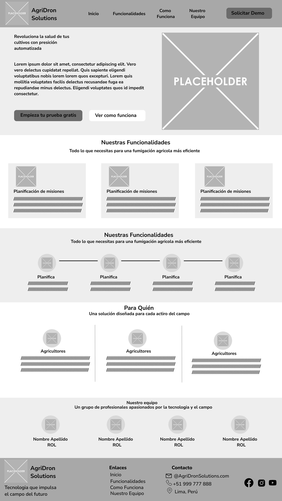

**Mobile**
- En la versión mobile, la interfaz de la Landing Page adapta su arquitectura a una sola columna vertical con el objetivo de optimizar la lectura y facilitar la interacción táctil en entornos de campo. La hero section compacta la cabecera mediante un menú de navegación desplegable tipo hamburguesa y conserva el mensaje principal sobre la optimización de cultivos, complementado por los tres pilares de valor clave y los botones de acción apilados a ancho completo (Comienza tu prueba gratis y Ver cómo funciona) para asegurar un alcance cómodo con el pulgar.

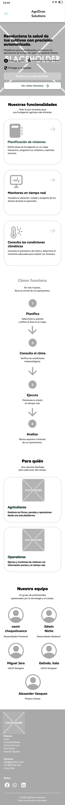

### 4.3.2. Landing Page Mock-up

Los mock-ups finales de la Landing Page de AgriDron Solutions representan la consolidación visual de la arquitectura y estructura planteadas en los wireframes. En esta etapa de alta fidelidad se integran la paleta cromática institucional (con predominio del verde bosque #1E4D2B y el verde acento #10B981), las familias tipográficas Inter y Roboto, la escala de espaciado modular basada en 8 px, la iconografía agrícola/tecnológica y los estándares de accesibilidad visual (WCAG 2.1 AA). El resultado es una interfaz pública coherente, moderna y persuasiva, alineada con la propuesta de valor de la agricultura de precisión y la fumigación con drones.

**Desktop**

En el mock-up desktop se evidencia una jerarquía visual clara, reforzada mediante el uso del verde bosque corporativo en componentes estructurales y el verde acento en los botones de llamada a la acción (CTAs) y puntos de énfasis. La hero section captura de inmediato la atención del visitante con el mensaje principal de la plataforma, botones destacados de conversión (Empieza tu prueba gratuita, Solicitar Demo) y un contenedor visual que muestra la interfaz telemétrica del dron sobre un mapa satelital. Las secciones posteriores organizan las funcionalidades clave, la segmentación por roles (agricultores, operadores, supervisores), la secuencia operativa de uso y el equipo multidisciplinario sobre fondos neutros claros (#FFFFFF y #F8FAFC), facilitando una lectura escaneable y fluida.

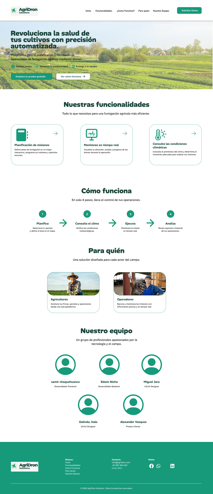

**Mobile**

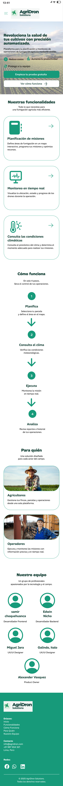

## 4.4. Web Applications UX/UI Design

Para los agricultores, la interfaz prioriza una experiencia clara y accesible que permite catastrar fincas y parcelas dibujando polígonos sobre mapas satelitales interactivos, programar misiones fitosanitarias con validación climática preventiva y auditar el historial de tratamientos mediante reportes consolidados. Para los operadores técnicos, la plataforma agiliza la recepción de órdenes de trabajo con áreas predelimitadas, proporciona un panel de monitoreo con telemetría simulada (posición GPS, nivel de batería y avance de pulverización) y facilita la emisión instantánea de actas de servicio digitales que certifican las hectáreas netas tratadas y respaldan suspensiones operativas ante vientos adversos.
A partir de estas necesidades, el diseño de la aplicación web reduce la sobrecarga cognitiva en campo y gabinete mediante una arquitectura modular: garantiza acceso inmediato a mapas interactivos, visualización de estados en tiempo real (programada, en progreso, pausada o completada), consulta automatizada de datos meteorológicos y flujos guiados en pocos pasos para optimizar cada jornada agrícola.

### 4.4.1. Web Applications Wireframes

Los wireframes de las Web Applications definen la estructura base de las vistas más relevantes del sistema antes de aplicar el diseño visual definitivo. En ellos se observa la distribución de dashboards interactivos, mapas satelitales, formularios de programación de misiones en pasos, tablas telemétricas, tarjetas de métricas (KPIs), paneles laterales de control de vuelo y zonas de acción principal. Esta etapa permitió validar la relación entre la jerarquía visual, la arquitectura de información y los flujos operativos por rol (agricultor, operador y supervisor).

En escritorio, los wireframes muestran una estructura con sidebar lateral persistente, header superior con notificaciones/alertas y un área central de trabajo amplia, adecuada para la interacción con mapas cartográficos, monitoreo telemétrico y reportes gráficos de rendimiento. En mobile web, la información se reorganiza en tarjetas apiladas, paneles deslizantes y listas táctiles de fácil lectura bajo luz solar directa, reduciendo la complejidad visual sin perder funcionalidad ni velocidad de respuesta en campo.

### 4.4.2. Web Applications Wireflow Diagrams

Los diagramas de wireflow de AgriDron Solutions ilustran la secuencia e interacción de las pantallas de la aplicación web para cumplir los objetivos clave del usuario dentro del sistema de fumigación con drones. Cada flujo mapea la transición entre interfaces a partir de un propósito operativo (user goal), detallando desde el ingreso a la plataforma hasta el monitoreo telemétrico en tiempo real y la gestión del perfil.

User Goal Principal: Planificar, ejecutar y monitorear una misión de fumigación de precisión

Este flujo representa el recorrido completo del usuario (agricultor u operador) a través de la interfaz web para llevar a cabo una operación de pulverización con drones:

- Acceso y Autenticación (Pantallas 1 y 2): El usuario inicia en la Landing Page pública y transiciona al Inicio de Sesión para ingresar sus credenciales (correo y contraseña).
- Panel de Control Operativo (Pantalla 3 - Dashboard): Tras autenticarse, accede al panel inicial que muestra un resumen ejecutivo de la operación: métricas generales (fincas registradas, parcelas, misiones activas, hectáreas totales), listado de misiones recientes con estado de avance y un widget de clima en tiempo real (18 °C, viento, humedad).
- Gestión de Fincas (Pantalla 4): A través del sidebar lateral, el usuario ingresa al módulo de Mis Fincas donde visualiza las propiedades registradas (Finca Los Olivos, Finca San José, Finca La Esperanza) y sus extensiones en hectáreas.
- Gestión de Parcelas (Pantalla 5): Al seleccionar una finca, la interfaz despliega sus parcelas delimitadas sobre un mapa satelital interactivo (Lote 1, Lote 2 - Uva, Lote 3 - Palta), permitiendo agregar nuevos lotes o seleccionar uno existente para operar.
- Planificación de Misiones (Pantalla 6): El flujo avanza hacia la herramienta de configuración en 4 pasos (1. Parcela, 2. Tratamiento, 3. Fecha y hora, 4. Resumen). El usuario selecciona la parcela (Lote 1 - Uva, 2.5 ha), especifica el tipo de agroquímico (Fungicida) y valida el área sobre el mapa interactivo.
- Monitoreo de Misiones en Tiempo Real (Pantalla 7 - Misión MS-001): Durante el vuelo, el sistema muestra la ruta sobre el mapa satelital y el panel de telemetría con datos críticos en vivo: nivel de batería (68%), altitud (45 m), velocidad (5.2 m/s), modo de vuelo (Automático) y flujo de líquido (2.5 L/min), junto con una barra de progreso por etapas (Preparación 08:15 ➔ En ejecución 08:30 ➔ En pausa ➔ Finalizada).
- Reportes e Historial (Pantalla 8): Concluida la misión, los datos se almacenan en el historial general, donde se pueden filtrar por rango de fechas, finca y estado para consultar el detalle de hectáreas trabajadas y descargar reportes.
- Perfil y Configuración (Pantalla 9): Espacio donde el usuario (Juan Pérez - Rol: Agricultor) gestiona sus datos personales, seguridad y preferencias de alertas meteorológicas o notificaciones en la app.
- Vista en Dispositivos Responsivos (Pantalla 10): Muestra la adaptación y equivalencia de las pantallas clave (Fincas y Monitoreo de Misión) en formato mobile/tablet para su uso directo en campo.

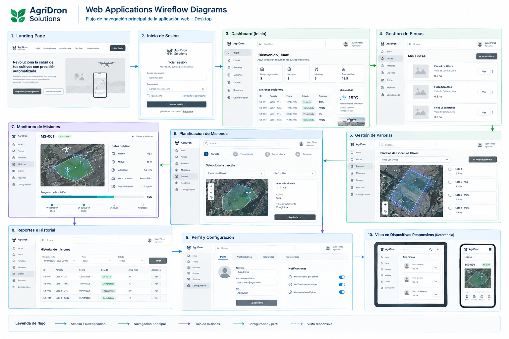

**link del figma:** https://www.figma.com/design/gIhPSpNHHNel3RMWLQSl8a/Sin-t%C3%ADtulo?node-id=0-1&t=LmubQnBsex2NasC8-1

### 4.4.3. Web Applications Mock-ups

Los mock-ups de alta fidelidad de AgriDron Solutions representan la consolidación visual y funcional de la aplicación web, construidos sobre el sistema de diseño, la paleta cromática, la jerarquía tipográfica (Inter y Roboto) y la escala de espaciado modular definidos en la solución. En estas interfaces se evidencia cómo la arquitectura de información y el diseño inclusivo con alto contraste se traducen en pantallas operativas, legibles en entornos de campo y optimizadas para el trabajo en escritorio, tablet y smartphone.

En escritorio, la aplicación estructura su área de trabajo mediante un sidebar lateral persistente con menú navegable (Inicio, Fincas, Parcelas, Misiones, Drones, Reportes, Configuración), una barra superior (header) con buscador global y selector de usuario (Juan Pérez - Agricultor), y un lienzo central con tarjetas, mapas satelitales interactivos, paneles telemétricos y tablas operativas. En dispositivos móviles y tablets, la interfaz reorganiza la información en listas táctiles apiladas y tarjetas adaptativas, preservando el acceso completo a las funciones sin saturar la pantalla.

A continuación, se detallan los 8 escenarios visuales clave presentados en la propuesta de alta fidelidad:

**Desktop**

**1. Inicio / Dashboard**

- Propósito: Vista principal y centro de control operativo tras autenticarse en la plataforma.
  **Componentes clave:**
- Tarjetas de métricas generales (KPIs): Resumen numérico con total de Fincas registradas (3), Parcelas (8), Misiones (5) y Área total (18.5 ha).
- Misiones recientes: Tabla resumida con ID de misión (MS-001, MS-002, MS-003), parcela de destino, fecha y badges de estado con código de color (En curso, Completada, Programada).
- Widget meteorológico: Panel en tiempo real que exhibe temperatura (18 °C), condición del cielo (Parcialmente nublado), velocidad del viento (12 km/h) y humedad relativa (68%)

**2. Gestión de Fincas**

- Propósito: Administrar los predios agrícolas registrados por el usuario, su ubicación y superficie total.

**Componentes clave:**

- Botón contextual destacado + Nueva finca para el registro acelerado de campos.
- Tarjetas de finca (Finca Los Olivos, Finca San José, Finca La Esperanza) que incluyen miniatura satelital, ubicación geográfica (Valle de Cañete, Valle de Mala - Lima) y extensión en hectáreas (8.5 ha, 6.2 ha, 3.8 ha) con botón directo de inspección Ver

**3. Gestión de Parcelas**

- Propósito: Visualización y delimitación cartográfica de los lotes agrícolas pertenecientes a una finca.

**Componentes clave:**

- Contenedor de mapa satelital interactivo con herramientas de zoom y trazado poligonal en vivo.
- Menú desplegable para filtrado rápido por finca (Finca Los Olivos) y lista lateral de parcelas activas (Lote 1 - Uva 2.5 ha, Lote 2 - Uva 3.2 ha, Lote 3 - Palta 2.8 ha, Lote 4 - Palta 1.9 ha) con botones de acción contextual (+ Nueva parcela).

**4. Planificación de Misiones**

- Propósito: Flujo asistido (wizard) en 4 pasos para programar una pulverización de precisión.
  **Componentes clave:**

- Indicador de progreso por etapas (1. Parcela ➔ 2. Fecha y hora ➔ 3. Insumos ➔ 4. Resumen).
- Previsualización geoespacial del área a tratar (2.5 ha), selección del tipo de cultivo (Uva) y definición del agroquímico (Fungicida), con botón primario Siguiente ➔.

**5. Monitoreo de Misiones**

- Propósito: Control telemétrico en tiempo real del estado del vuelo y descarga de insumos sobre la parcela.

**Componentes clave:**

- Badge de estado en tiempo real (MS-001 - En curso) y mapa satelital con la trayectoria del dron trazada.
- Panel telemétrico en vivo: batería (68%), altitud (25 m), velocidad (5.2 m/s), nivel de señal GPS (Excelente) y caudal de flujo (2.5 L/min).
- Barra de avance lineal de misión (60%) dividida por fases (Preparación 08:15 ➔ En ejecución 08:30 ➔ En pausa ➔ Finalizada).

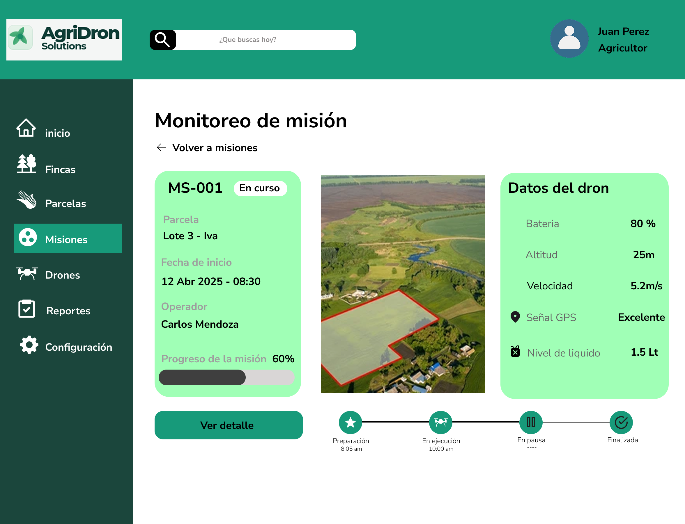

**6. Reportes e Historial**

- Propósito: Consulta analítica, fiscalización del consumo de insumos y auditoría de vuelos ejecutados.
**Componentes clave:**

- Navegación por pestañas (Misiones, Uso de insumos, Ahorros).
- Selector de rango de fechas (01/04/2025 - 30/04/2025) con filtro aplicable.
- Tabla con ID de orden, parcela, fecha de aplicación, hectáreas tratadas y botón directo para descargar el acta de conformidad digital.

**7. Perfil y Configuración**
- Propósito: Gestión de la información del usuario, seguridad de la cuenta y reglas de notificación.

**Componentes clave:**

- Pestañas de navegación interna (Perfil, Notificaciones, Seguridad, Integraciones).
- Ficha de usuario con opción Editar perfil (Juan Pérez - juan.perez@agro.com) y controles deslizantes (toggle switches) para activar o desactivar notificaciones por correo, alertas en la aplicación y avisos meteorológicos preventivos.

**Mobile**

**link del figma:** https://www.figma.com/design/gIhPSpNHHNel3RMWLQSl8a/Sin-t%C3%ADtulo?node-id=0-1&t=LmubQnBsex2NasC8-1

### 4.4.4. Web Applications User Flow Diagrams

Los User Flow Diagrams de AgriDron Solutions representan los recorridos funcionales principales de los usuarios dentro de la plataforma web, detallando la lógica de navegación, las reglas de negocio, los puntos de decisión y el comportamiento del sistema ante condiciones esperadas o interrupciones operativas. A diferencia del wireflow, este diagrama se enfoca en las bifurcaciones lógicas y validaciones que determinan el avance del usuario desde el inicio hasta el cumplimiento de sus objetivos.

User Goal 1: Planificar y ejecutar una misión de fumigación de precisión.

**Happy path (Camino feliz):**

- Autenticación e inicio: El usuario inicia sesión correctamente en la aplicación web.
- Validación de infraestructura agrícola: El sistema verifica que la finca ya está registrada y que la parcela objetivo se encuentra delimitada geométricamente en el mapa satelital.
- Configuración de misión: El usuario crea la misión especificando parcela, fecha, insumos agrícolas y tipo de tratamiento fitosanitario.
- Validación meteorológica: La plataforma consulta las condiciones climáticas en tiempo real y confirma que son favorables para el vuelo.
- Asignación de personal: El sistema notifica la misión pendiente y confirma la disponibilidad de un operador técnico, asignándole la orden.
- Verificación de geocerca y campo: El operador inicia su jornada de trabajo y el sistema valida positivamente su ubicación dentro de la geocerca permitida.
- Ejecución y cierre: Se inicia el vuelo de fumigación automatizado sin incidencias, el operador completa la misión y el sistema emite automáticamente el acta digital y el reporte operativo, alcanzando el estado final Misión Completada.

**Unhappy paths y rutas alternativas (Excepciones y decisiones):**

- Finca o parcela no registrada: Si el usuario no cuenta con la finca o parcela registrada, el flujo se desvía para exigir el registro previo de los predios en la base de datos geográfica antes de continuar con la creación de la misión.
- Condición climática desfavorable: Si el análisis meteorológico detecta vientos fuertes o lluvia, el sistema bloquea la autorización y retorna al usuario a la fase de planificación para modificar la fecha o los parámetros de la misión.
- Sin operador disponible: Si no existe un operador disponible al momento de la asignación, la orden queda diferida en estado Misión pendiente de asignación.
- Fuera de la geocerca: Si al iniciar la jornada la ubicación GPS del operador no coincide con los límites de la geocerca establecida, el sistema bloquea el registro, notifica al supervisor y finaliza el intento en estado Jornada no iniciada.
- Incidencias técnicas o climáticas durante el vuelo: Si durante la pulverización surge una falla de equipo o cambio climático adverso.

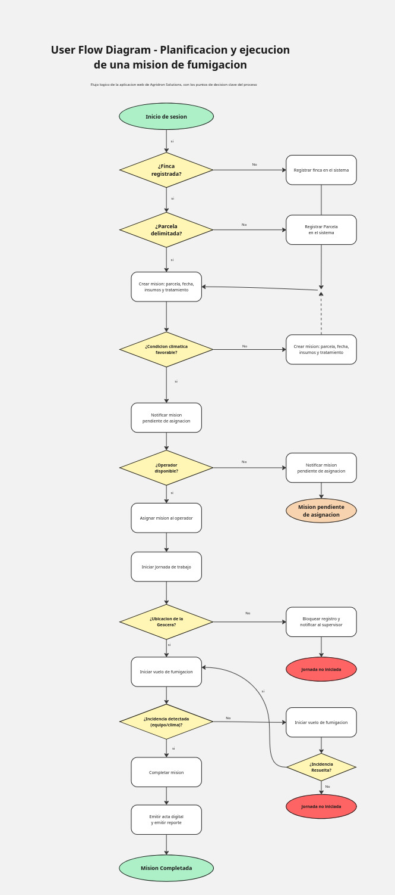

**Link del Miro:** https://miro.com/app/board/uXjVHnbT8O4=/?share_link_id=310365063702

---

## 4.5. Web Applications Prototyping

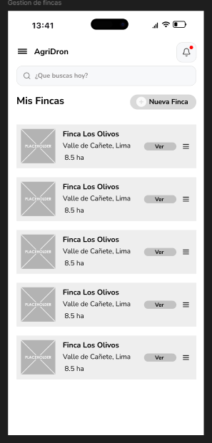

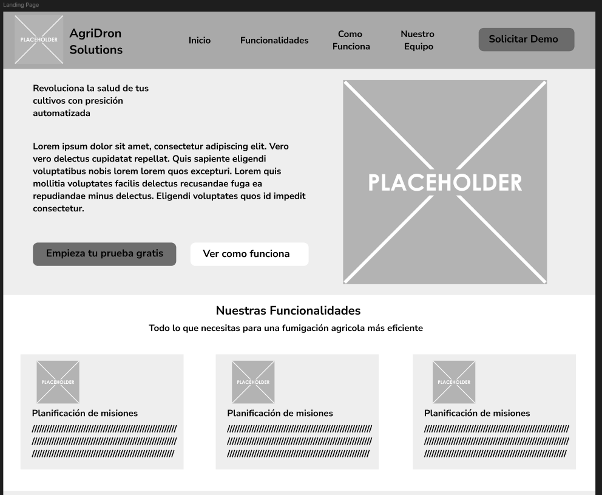

---

## 4.6. Domain-Driven Software Architecture

### 4.6.1. Design-Level Event Storming
El Design-Level Event Storming constituye el puente definitivo entre los requerimientos de negocio, identificados durante el proceso de Lean UX, y la arquitectura técnica de software. En esta etapa de diseño detallado bajo el enfoque de Domain-Driven Design (DDD), se descompone la complejidad del sistema AgriDron Solutions en partes modulares e independientes conocidas como Bounded Contexts.

Para cada contexto, se ha analizado minuciosamente la cadena de causa y efecto que rige el comportamiento del software, identificando los actores que interactúan con el sistema, los comandos , los agregadosde , los eventos de dominio , las políticas  y los modelos de lectura . Esta estructuración garantiza que la plataforma SaaS sea escalable, altamente cohesiva y esté estrictamente alineada con la propuesta de valor del proyecto.

### Flujo principal del dominio

A continuación, se describe y justifica cada uno de los Bounded Contexts identificados para la plataforma:

**Bounded context 1 : Identity & Access Management Context**

Este contexto gestiona el registro de usuarios, la validación de credenciales, el control de acceso y la segregación de los roles operativos dentro de la plataforma (Agricultores, Operadores y Supervisores).

Como plataforma SaaS multiusuario, AgriDron requiere un control estricto sobre quién accede a la información y qué acciones puede realizar. Se clasifica como un Generic Subdomain, ya que, si bien no es el núcleo diferenciador del negocio agrícola, es una pieza de infraestructura crítica y obligatoria para aislar la información confidencial de los clientes, asignar responsabilidades operativas y habilitar los modelos de suscripción.

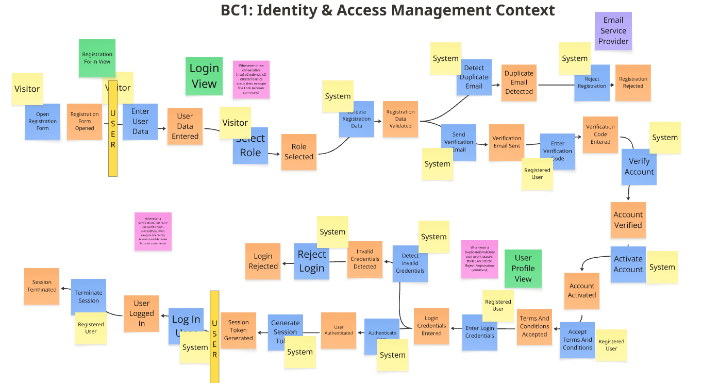

**Bounded context 2 : Field Management Context**

Encargado de la gestión espacial y geográfica del dominio. Administra el registro de fincas, la definición visual de parcelas mediante mapas interactivos y la asignación de tipos de cultivo a los polígonos trazados.

Responde directamente a la problemática de negocio sobre la gestión manual y desordenada de las áreas de cultivo. Al digitalizar y centralizar los límites exactos de cada parcela, se garantiza precisión en los cálculos de área y se evita el desperdicio de insumos. Actúa como un Supporting Subdomain fundamental, ya que provee los datos espaciales necesarios para que las misiones de vuelo puedan existir.

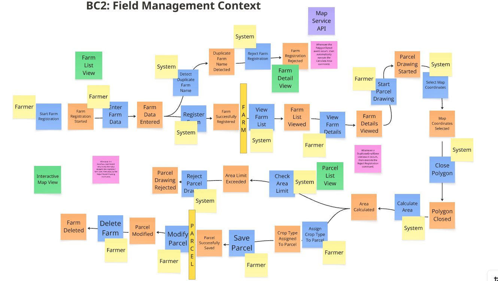

**Bounded context 3 : Flight Operations Context**

Es el motor operativo de AgriDron. Abarca todo el ciclo de vida de la fumigación: la creación de la misión, la asignación de operadores, el inicio de la jornada laboral, la actualización de la telemetría del dron en tiempo real y el reporte de incidencias en campo hasta la finalización del vuelo.

Representa el Core Domain (dominio central) del proyecto. Contiene la principal ventaja competitiva y propuesta de valor de la startup: la orquestación en tiempo real de operaciones de fumigación con drones. Es el contexto que más impacto tiene en la reducción de tiempos, costos operativos y exposición a riesgos químicos, cumpliendo con las hipótesis planteadas en el Lean UX.

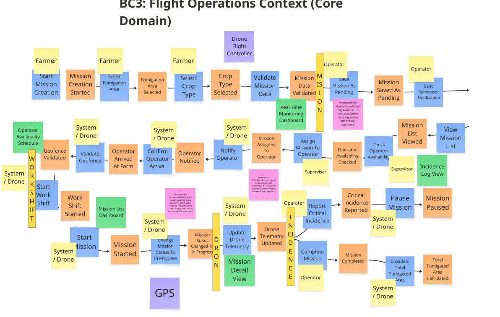

**Bounded context 4 : Weather Integration Context**

Actúa como una capa especializada (Anti-Corruption Layer) que se comunica de forma continua con APIs meteorológicas externas para obtener pronósticos de viento, lluvia y temperatura.

Las condiciones climáticas son un factor de riesgo crítico en la fumigación con drones. Este Supporting Subdomain justifica su existencia al transformar datos meteorológicos externos en reglas de negocio internas (alertas y bloqueos de vuelo). Además, cumple directamente con el requerimiento arquitectónico del proyecto de integrar y consumir servicios de terceros de manera aislada y resiliente.

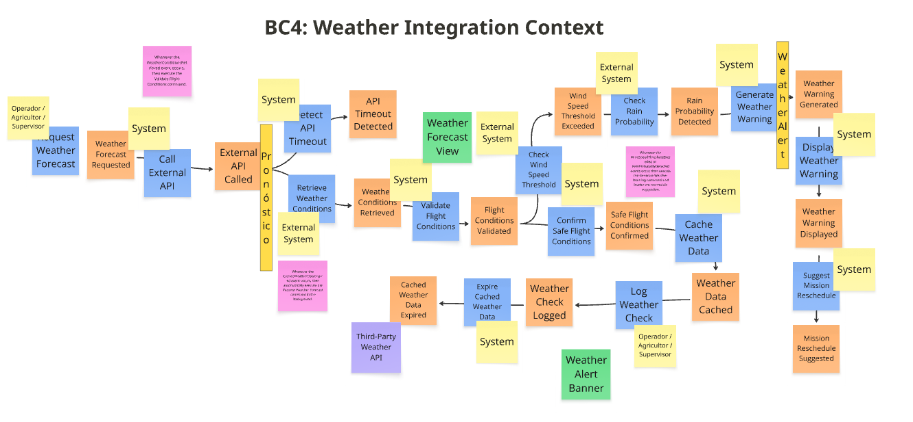

**Bounded context 5 : Analytics & Reporting Context**

Se encarga de procesar los datos históricos de las misiones completadas para calcular métricas de eficiencia, costos por hectárea, rendimiento de operadores y generar reportes exportables (PDF).

Está alineado con el objetivo de negocio de fomentar la retención de clientes y la adopción de planes premium. Los agricultores y supervisores necesitan justificar sus inversiones tecnológicas; este contexto transforma los datos operativos brutos en inteligencia de negocio, permitiendo la toma de decisiones estratégicas basadas en el rendimiento real.

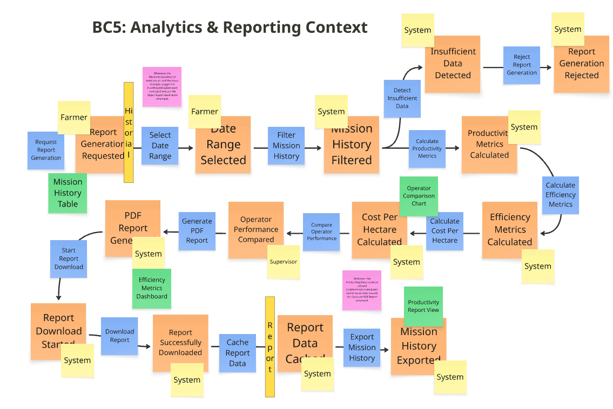

**Bounded context 6 : Inventory & Resource Management Context**

Gestiona el catálogo de insumos químicos (pesticidas, herbicidas y fertilizantes), controlando los niveles de stock, registrando los descuentos por cada misión y emitiendo alertas cuando se alcanzan umbrales críticos.

Evita los cuellos de botella operativos. Una misión no puede ejecutarse si no hay insumos físicos suficientes. Este contexto de soporte garantiza la continuidad de las operaciones en campo, mitigando el riesgo de desabastecimiento y permitiendo a las cooperativas agrícolas planificar sus compras con antelación, lo que impacta positivamente en la reducción de costos generales.

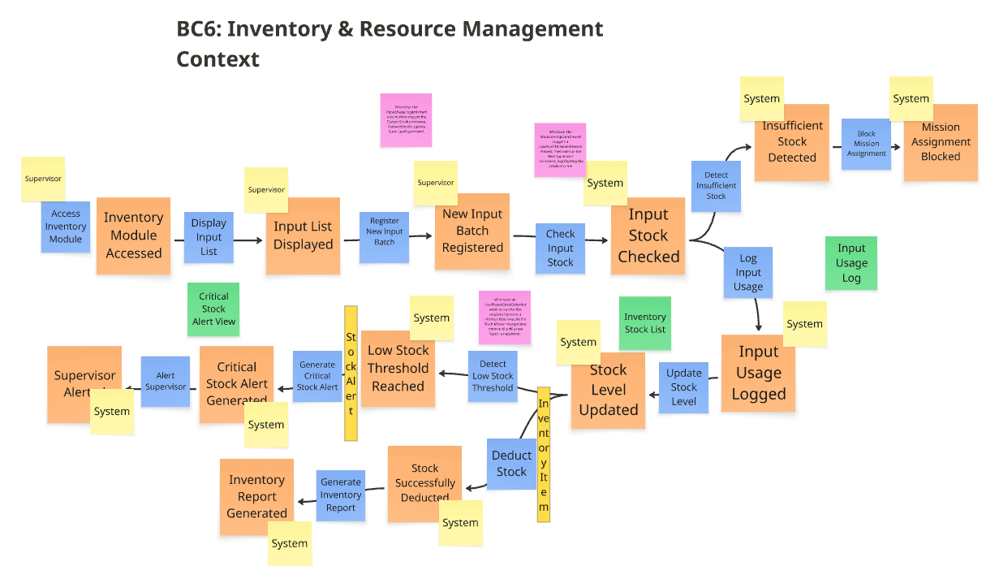

**link de mmiro:** https://miro.com/app/board/uXjVHl_E4nc=/?share_link_id=823387251080

### 4.6.2. Software Architecture Context Diagram
El diagrama de contexto ilustra el panorama general de AgriDron Solutions como el orquestador principal que unifica la planificación
agronómica con la ejecución técnica en campo. En este ecosistema, se visualiza la interacción asíncrona del agricultor para registrar
fincas y solicitar servicios, la vigilancia continua del supervisor para gestionar recursos operativos, y la intervención del operador
técnico para validar coordenadas e iniciar misiones. Asimismo, el diagrama evidencia las dependencias críticas con sistemas externos,
delegando la validación de riesgos climáticos a una API Meteorológica y el envío de notificaciones transaccionales a un Servicio de Correo,
lo que garantiza una operación segura y enfocada netamente en el valor del negocio.

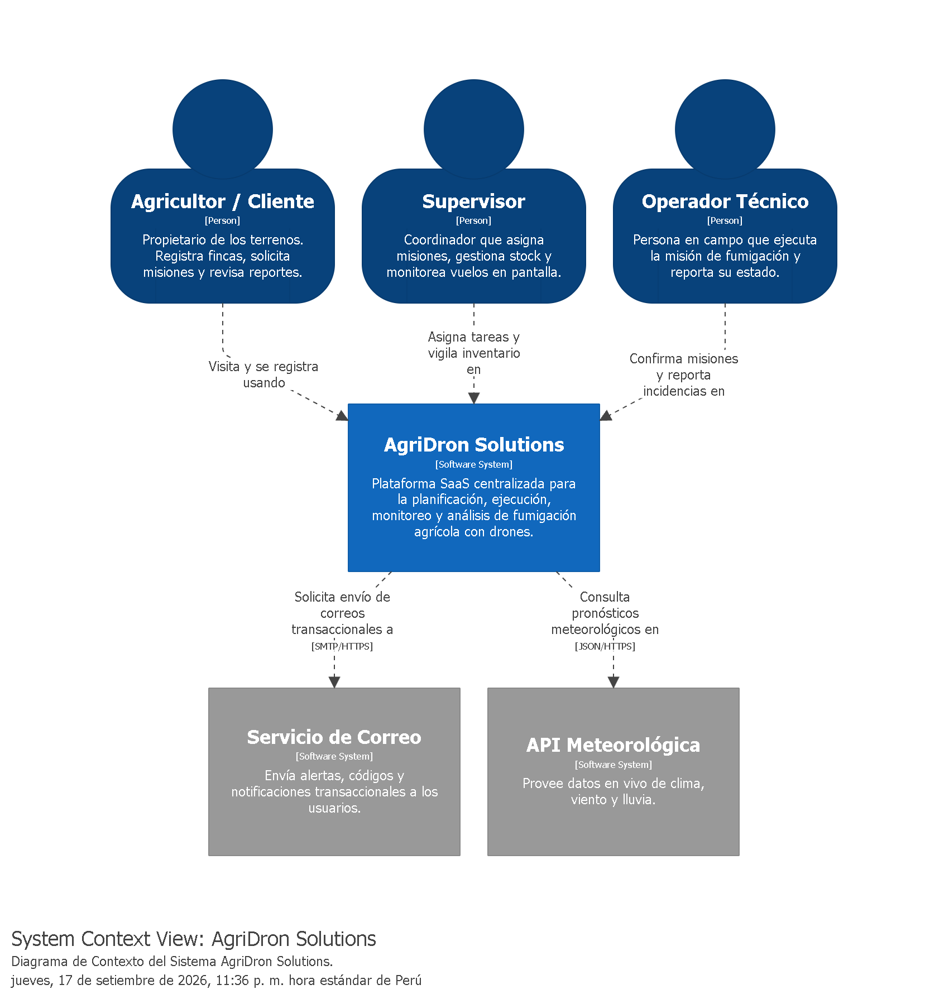

### 4.6.3. Software Architecture Container Diagrams

Este nivel detalla las unidades de despliegue y la distribución de responsabilidades técnicas dentro del sistema central.
La capa de presentación se divide estratégicamente en una Landing Page enfocada en la adquisición pública de clientes y
una Web Application (SPA) privada encargada de renderizar los mapas interactivos y la telemetría en tiempo real. Toda la lógica de negocio,
flujos de dominio y validaciones de seguridad se centralizan exclusivamente en la RESTful API, la cual actúa como el único puente de comunicación
autorizado hacia la base de datos relacional (PostgreSQL). Esta estructura asegura que ninguna interfaz cliente pueda manipular el estado del sistema
sin cumplir con las reglas del dominio, protegiendo así la integridad de la información espacial e histórica.

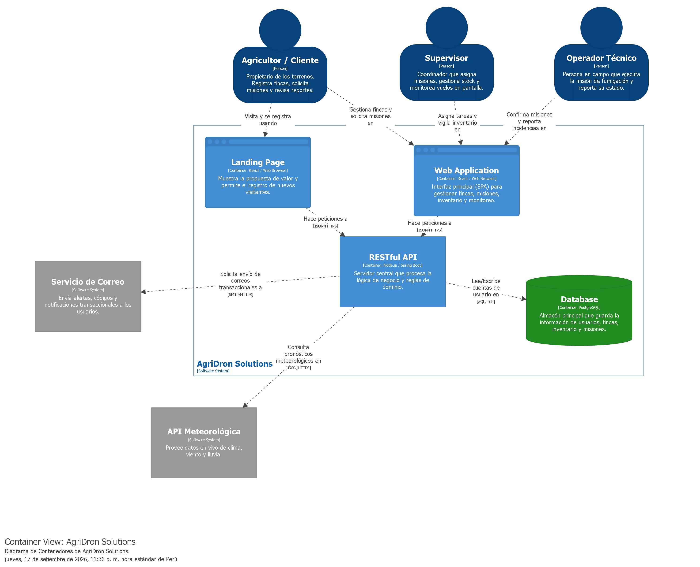

### 4.6.4. Software Architecture Components Diagrams

El diagrama de componentes desglosa internamente la RESTful API para demostrar la correspondencia directa entre la
arquitectura técnica y los Bounded Contexts definidos previamente en el Event Storming. La API se estructura en módulos
altamente cohesivos donde el Flight Operations Component actúa como el núcleo orquestador, el cual interactúa estrictamente 
con el Weather Component y el Inventory Component para validar que las condiciones climáticas y de stock sean seguras antes de autorizar
un vuelo. Además, este diseño aplica el patrón de capa anticorrupción para aislar el núcleo del negocio de posibles alteraciones en los
proveedores externos de clima y correo, resultando en una plataforma escalable, resiliente y alineada a las exigencias operativas.

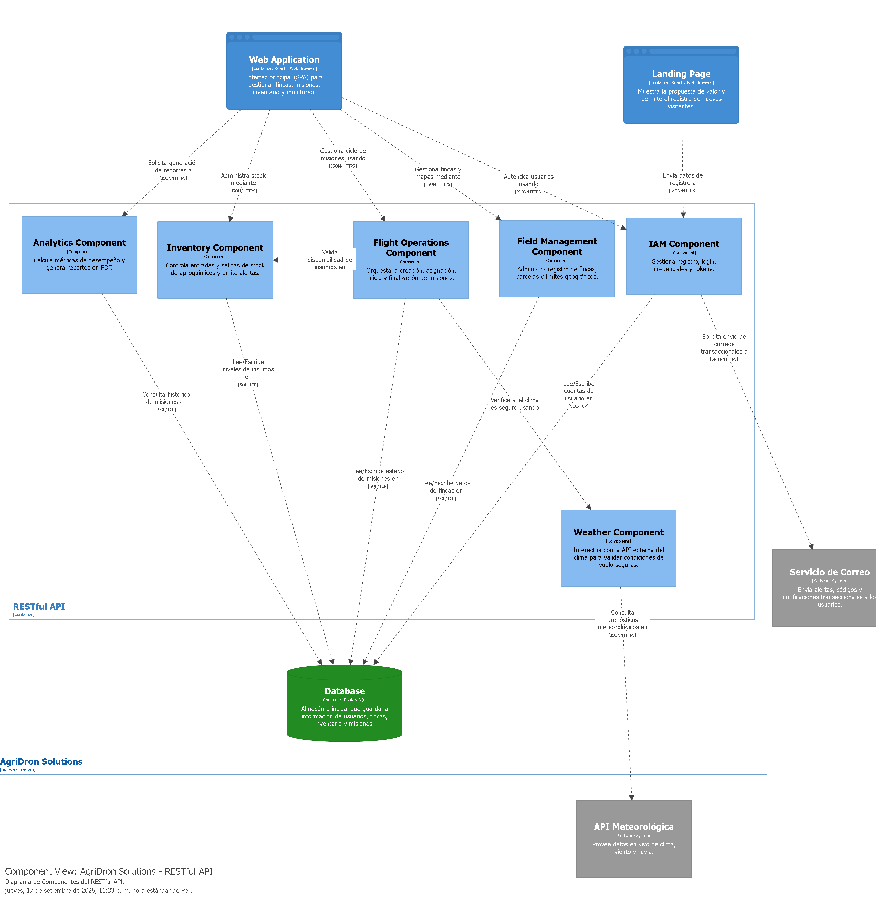

## 4.7. Software Object-Oriented Design
El diseño orientado a objetos representa los principales elementos del dominio y sus relaciones. El Project Statement solicita que los Class Diagrams incluyan clases, interfaces, enumeraciones, atributos, métodos, visibilidad, relaciones y multiplicidades cuando correspondan.

### 4.7.1. Class Diagrams

### 4.7.1.1. Field Management

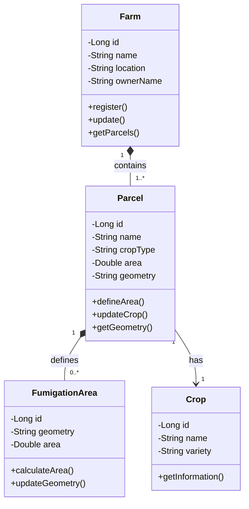
```mermaid
classDiagram
  class Farm {
    -Long id
    -String name
    -String location
    -String ownerName
    +register()
    +update()
    +getParcels()
  }
  class Parcel {
    -Long id
    -String name
    -String cropType
    -Double area
    -String geometry
    +defineArea()
    +updateCrop()
    +getGeometry()
  }
  class FumigationArea {
    -Long id
    -String geometry
    -Double area
    +calculateArea()
    +updateGeometry()
  }
  class Crop {
    -Long id
    -String name
    -String variety
    +getInformation()
  }
  Farm "1" *-- "1..*" Parcel : contains
  Parcel "1" *-- "0..*" FumigationArea : defines
  Parcel "1" --> "1" Crop : has
```

### 4.7.1.2. Flight Operations

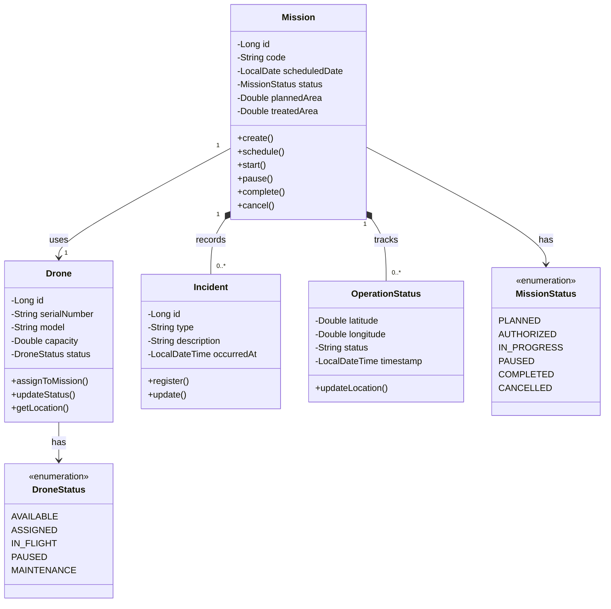
```mermaid
classDiagram
  class Mission {
    -Long id
    -String code
    -LocalDate scheduledDate
    -MissionStatus status
    -Double plannedArea
    -Double treatedArea
    +create()
    +schedule()
    +start()
    +pause()
    +complete()
    +cancel()
  }
  class Drone {
    -Long id
    -String serialNumber
    -String model
    -Double capacity
    -DroneStatus status
    +assignToMission()
    +updateStatus()
    +getLocation()
  }
  class Incident {
    -Long id
    -String type
    -String description
    -LocalDateTime occurredAt
    +register()
    +update()
  }
  class OperationStatus {
    -Double latitude
    -Double longitude
    -String status
    -LocalDateTime timestamp
    +updateLocation()
  }
  class MissionStatus {
    <<enumeration>>
    PLANNED
    AUTHORIZED
    IN_PROGRESS
    PAUSED
    COMPLETED
    CANCELLED
  }
  class DroneStatus {
    <<enumeration>>
    AVAILABLE
    ASSIGNED
    IN_FLIGHT
    PAUSED
    MAINTENANCE
  }
  Mission "1" --> "1" Drone : uses
  Mission "1" *-- "0..*" Incident : records
  Mission "1" *-- "0..*" OperationStatus : tracks
  Mission --> MissionStatus : has
  Drone --> DroneStatus : has
```

### 4.7.1.3. Weather Integration

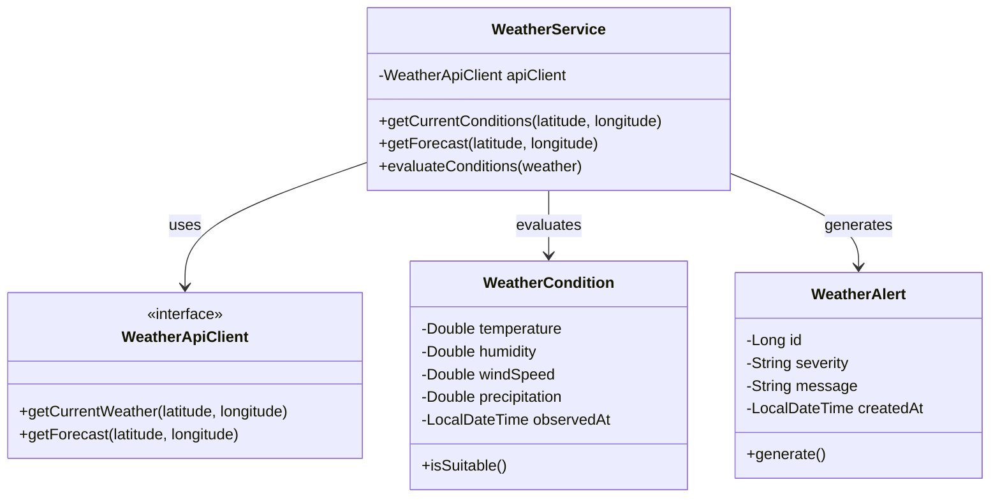
```mermaid
classDiagram
  class WeatherService {
    -WeatherApiClient apiClient
    +getCurrentConditions(latitude, longitude)
    +getForecast(latitude, longitude)
    +evaluateConditions(weather)
  }
  class WeatherApiClient {
    <<interface>>
    +getCurrentWeather(latitude, longitude)
    +getForecast(latitude, longitude)
  }
  class WeatherCondition {
    -Double temperature
    -Double humidity
    -Double windSpeed
    -Double precipitation
    -LocalDateTime observedAt
    +isSuitable()
  }
  class WeatherAlert {
    -Long id
    -String severity
    -String message
    -LocalDateTime createdAt
    +generate()
  }
  WeatherService --> WeatherApiClient : uses
  WeatherService --> WeatherCondition : evaluates
  WeatherService --> WeatherAlert : generates
```

### 4.7.1.4. Analytics & Reporting

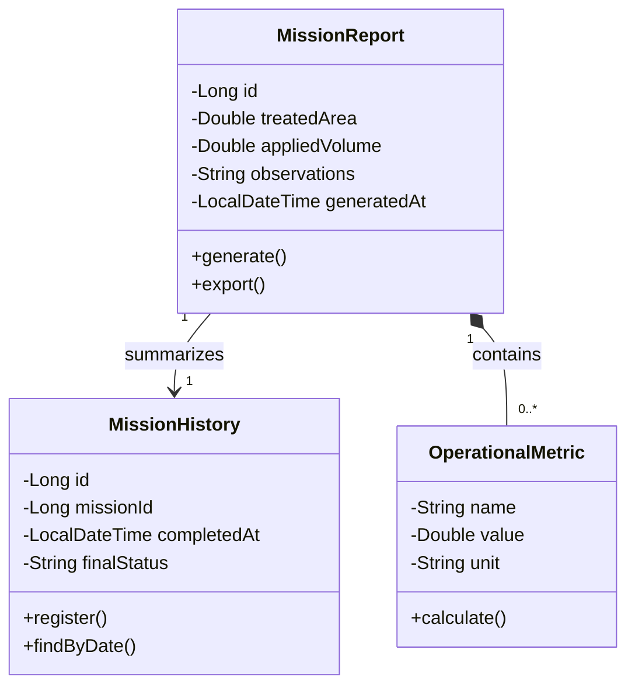
```mermaid
classDiagram
  class MissionReport {
    -Long id
    -Double treatedArea
    -Double appliedVolume
    -String observations
    -LocalDateTime generatedAt
    +generate()
    +export()
  }
  class MissionHistory {
    -Long id
    -Long missionId
    -LocalDateTime completedAt
    -String finalStatus
    +register()
    +findByDate()
  }
  class OperationalMetric {
    -String name
    -Double value
    -String unit
    +calculate()
  }
  MissionReport "1" --> "1" MissionHistory : summarizes
  MissionReport "1" *-- "0..*" OperationalMetric : contains
```

### 4.7.1.5. Shared / Identity

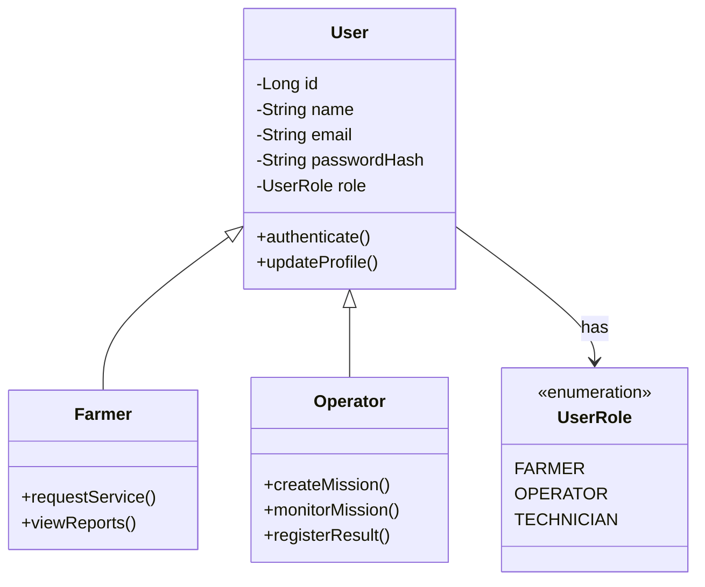
```mermaid
classDiagram
  class User {
    -Long id
    -String name
    -String email
    -String passwordHash
    -UserRole role
    +authenticate()
    +updateProfile()
  }
  class UserRole {
    <<enumeration>>
    FARMER
    OPERATOR
    TECHNICIAN
  }
  class Farmer {
    +requestService()
    +viewReports()
  }
  class Operator {
    +createMission()
    +monitorMission()
    +registerResult()
  }
  User <|-- Farmer
  User <|-- Operator
  User --> UserRole : has
```
**Link LuciChart:** https://lucid.app/lucidchart/a19c55c2-6693-47c1-a66c-347112de89c0/edit?viewport_loc=-1180%2C-484%2C5244%2C2796%2C0_0&invitationId=inv_bd423e8a-a95b-4985-ac69-5194098d2c5f

## 4.8. Database Design
El diseño de base de datos define la persistencia necesaria para los objetos de cada Bounded Context. Para almacenamiento relacional se especifican tablas, columnas, claves primarias, claves foráneas y relaciones entre tablas. Esto corresponde a lo solicitado por el Project Statement.

### 4.8.1. Database Diagrams

### 4.8.1.1. Field Management

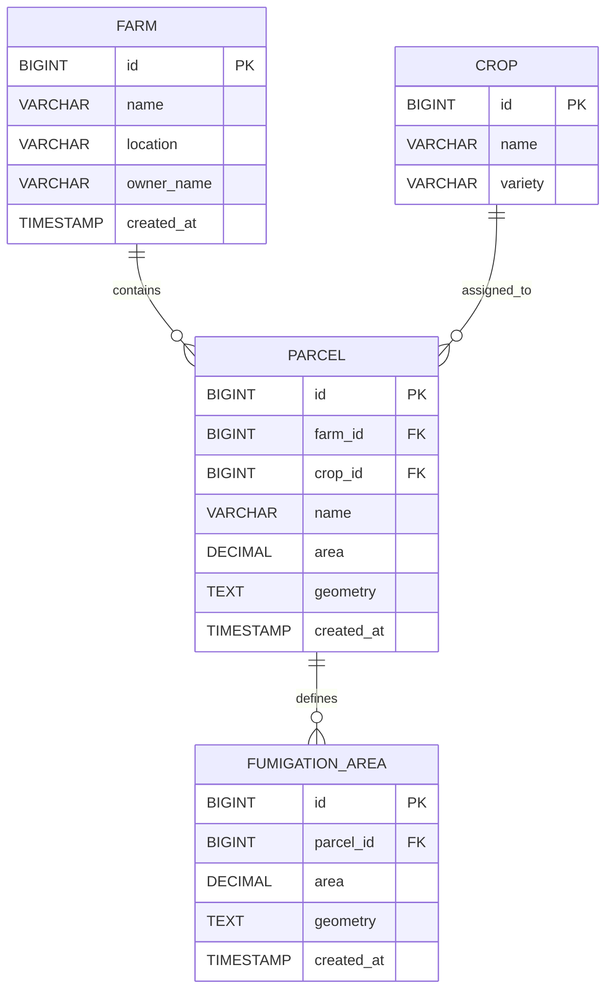
```mermaid
erDiagram
    FARM ||--o{ PARCEL : contains
    PARCEL ||--o{ FUMIGATION_AREA : defines
    CROP ||--o{ PARCEL : assigned_to
    FARM {
        BIGINT id PK
        VARCHAR name
        VARCHAR location
        VARCHAR owner_name
        TIMESTAMP created_at
    }
    PARCEL {
        BIGINT id PK
        BIGINT farm_id FK
        BIGINT crop_id FK
        VARCHAR name
        DECIMAL area
        TEXT geometry
        TIMESTAMP created_at
    }
    FUMIGATION_AREA {
        BIGINT id PK
        BIGINT parcel_id FK
        DECIMAL area
        TEXT geometry
        TIMESTAMP created_at
    }
    CROP {
        BIGINT id PK
        VARCHAR name
        VARCHAR variety
    }
```

**Restricciones principales:** `FARM.id`, `PARCEL.id`, `FUMIGATION_AREA.id` y `CROP.id` son PK; las FK mantienen las relaciones indicadas; `area` debe ser mayor que cero.

### 4.8.1.2. Flight Operations

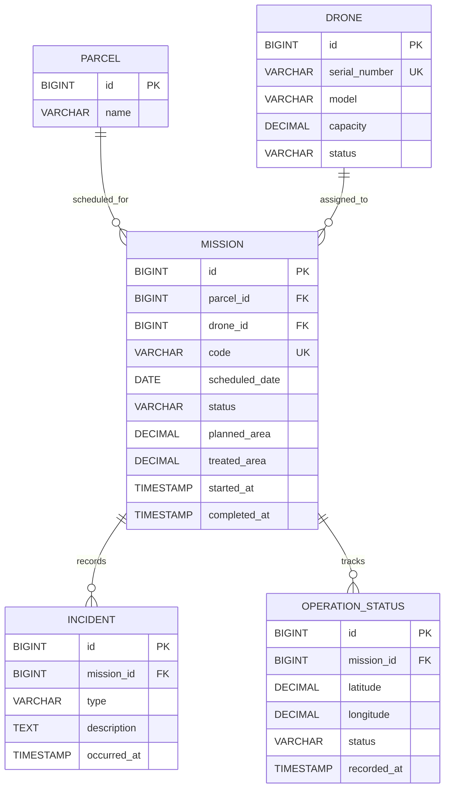
```mermaid
erDiagram
    PARCEL ||--o{ MISSION : scheduled_for
    DRONE ||--o{ MISSION : assigned_to
    MISSION ||--o{ INCIDENT : records
    MISSION ||--o{ OPERATION_STATUS : tracks
    PARCEL {
        BIGINT id PK
        VARCHAR name
    }
    DRONE {
        BIGINT id PK
        VARCHAR serial_number UK
        VARCHAR model
        DECIMAL capacity
        VARCHAR status
    }
    MISSION {
        BIGINT id PK
        BIGINT parcel_id FK
        BIGINT drone_id FK
        VARCHAR code UK
        DATE scheduled_date
        VARCHAR status
        DECIMAL planned_area
        DECIMAL treated_area
        TIMESTAMP started_at
        TIMESTAMP completed_at
    }
    INCIDENT {
        BIGINT id PK
        BIGINT mission_id FK
        VARCHAR type
        TEXT description
        TIMESTAMP occurred_at
    }
    OPERATION_STATUS {
        BIGINT id PK
        BIGINT mission_id FK
        DECIMAL latitude
        DECIMAL longitude
        VARCHAR status
        TIMESTAMP recorded_at
    }
```

**Restricciones principales:** `MISSION.parcel_id` y `MISSION.drone_id` son FK; `MISSION.code` y `DRONE.serial_number` son únicos; las FK de `INCIDENT` y `OPERATION_STATUS` referencian `MISSION.id`; las áreas no pueden ser negativas.

### 4.8.1.3. Weather Integration

Para el MVP, la información meteorológica puede almacenarse únicamente cuando sea necesaria para mantener trazabilidad de la evaluación asociada a una misión.

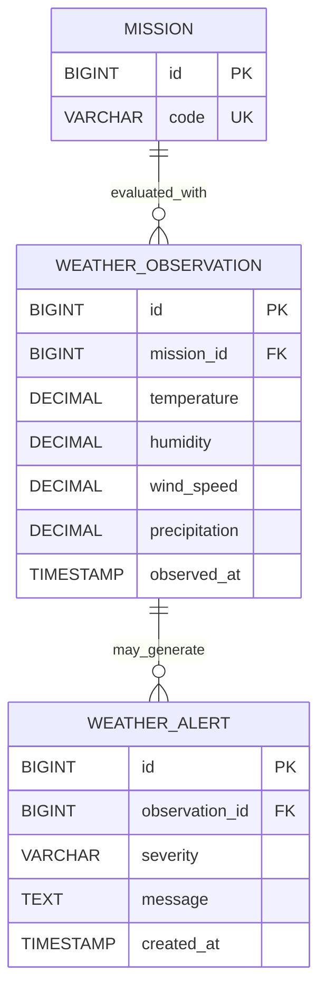
```mermaid
erDiagram
    MISSION ||--o{ WEATHER_OBSERVATION : evaluated_with
    WEATHER_OBSERVATION ||--o{ WEATHER_ALERT : may_generate
    MISSION {
        BIGINT id PK
        VARCHAR code UK
    }
    WEATHER_OBSERVATION {
        BIGINT id PK
        BIGINT mission_id FK
        DECIMAL temperature
        DECIMAL humidity
        DECIMAL wind_speed
        DECIMAL precipitation
        TIMESTAMP observed_at
    }
    WEATHER_ALERT {
        BIGINT id PK
        BIGINT observation_id FK
        VARCHAR severity
        TEXT message
        TIMESTAMP created_at
    }
```

**Restricciones principales:** `WEATHER_OBSERVATION.mission_id` y `WEATHER_ALERT.observation_id` son FK; los valores meteorológicos deben validarse según la fuente; cada observación conserva su fecha y hora.

### 4.8.1.4. Analytics & Reporting

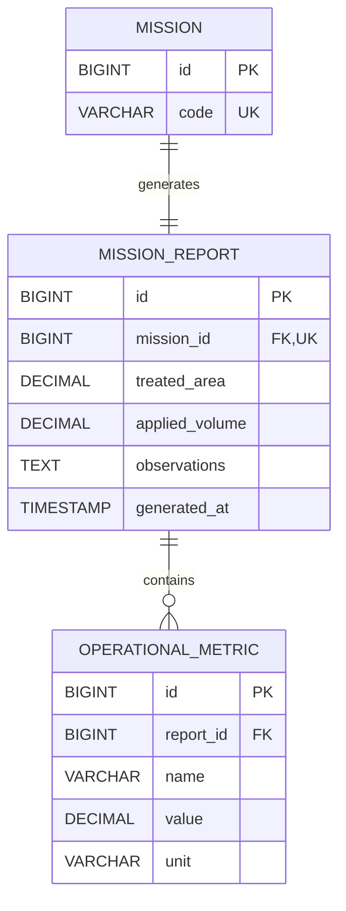
```mermaid
erDiagram
    MISSION ||--|| MISSION_REPORT : generates
    MISSION_REPORT ||--o{ OPERATIONAL_METRIC : contains
    MISSION {
        BIGINT id PK
        VARCHAR code UK
    }
    MISSION_REPORT {
        BIGINT id PK
        BIGINT mission_id FK,UK
        DECIMAL treated_area
        DECIMAL applied_volume
        TEXT observations
        TIMESTAMP generated_at
    }
    OPERATIONAL_METRIC {
        BIGINT id PK
        BIGINT report_id FK
        VARCHAR name
        DECIMAL value
        VARCHAR unit
    }
```

**Restricciones principales:** `MISSION_REPORT.mission_id` es FK y UNIQUE para mantener una relación uno a uno con la misión; `OPERATIONAL_METRIC.report_id` referencia `MISSION_REPORT.id`; `treated_area` y `applied_volume` no pueden ser negativos.

## 4.8.1.5. Vista integrada de persistencia

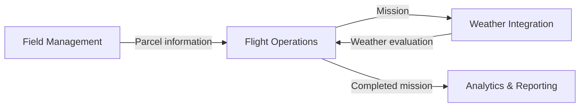
```mermaid
flowchart LR
    FM["Field Management"]
    FO["Flight Operations"]
    WI["Weather Integration"]
    AR["Analytics & Reporting"]
    FM -->|"Parcel information"| FO
    FO -->|"Mission"| WI
    WI -->|"Weather evaluation"| FO
    FO -->|"Completed mission"| AR
```

La separación por Bounded Context conserva responsabilidades claras, mientras que las relaciones entre contextos permiten soportar el flujo principal del negocio.