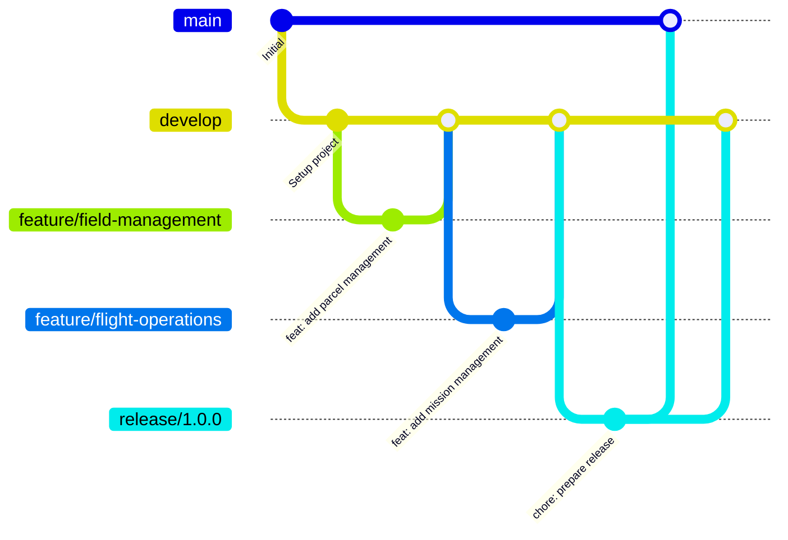
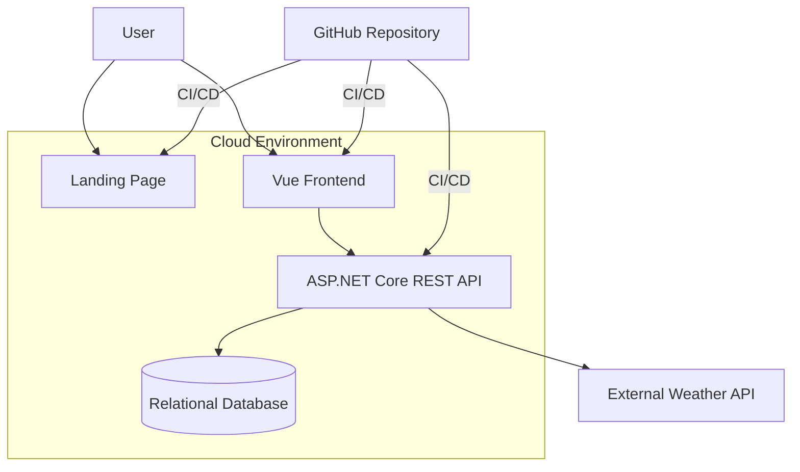
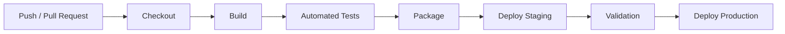
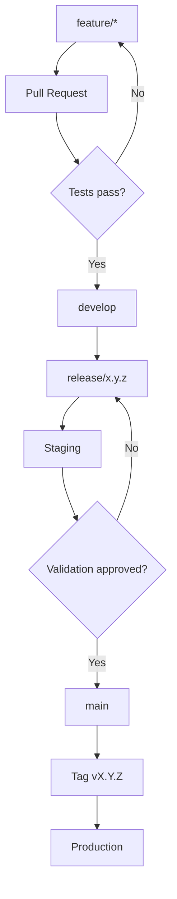

# Capítulo V: Product Implementation, Validation & Deployment

## 5.1. Software Configuration Management

El **Software Configuration Management (SCM)** de AgriDron Solutions establece las herramientas, convenciones y procedimientos que permitirán mantener la consistencia del producto durante su ciclo de vida. Esta configuración cubre el entorno de desarrollo, la gestión del código fuente, las convenciones de programación y el despliegue de los productos de software.

De acuerdo con el Project Statement, esta sección debe establecer decisiones y convenciones para mantener la consistencia durante el ciclo de vida del producto. Además, se debe considerar el entorno utilizado para actividades de gestión del proyecto, requisitos, UX/UI, desarrollo, despliegue y documentación.

La propuesta de SCM para AgriDron Solutions se alinea con la arquitectura definida previamente y con las tecnologías establecidas en el Project Statement: **Landing Page** (HTML5, CSS3, JavaScript), **Frontend Web Application con Vue Framework y PrimeVue**, **Web Services RESTful con ASP.NET Core y C#** y **base de datos relacional**, además de la integración con una API meteorológica externa.

### 5.1.1. Software Development Environment Configuration

#### 5.1.1.1. Propósito

El entorno de desarrollo define las herramientas que utilizará el equipo para implementar, documentar, probar y desplegar AgriDron Solutions. Se busca que todos los integrantes trabajen con una configuración homogénea, reduciendo problemas de compatibilidad y facilitando la colaboración.

El Project Statement indica que esta sección debe especificar el nombre de cada producto de software, su propósito y la ruta de referencia o descarga correspondiente, considerando las actividades de Project Management, Requirements Management, UX/UI Design, Software Development, Software Deployment y Software Documentation.

#### 5.1.1.2. Herramientas del proyecto

| Categoría | Herramienta / Tecnología | Propósito | Referencia |
|---|---|---|---|
| Control de versiones | Git | Control local de versiones del código fuente. | https://git-scm.com/ |
| Repositorios | GitHub | Hospedaje de repositorios y colaboración mediante branches y Pull Requests, aplicando GitFlow. | https://github.com/ |
| Gestión del proyecto | JetBrains YouTrack / Jira Software / Trello | Organización del Product Backlog, Sprint Backlog y seguimiento del trabajo. | Según herramienta seleccionada |
| Editor / IDE Frontend | Visual Studio Code | Desarrollo de Landing Page y Frontend Web Application con Vue. | https://code.visualstudio.com/ |
| IDE Backend | Visual Studio / JetBrains Rider | Desarrollo del Backend con ASP.NET Core y C#. | https://visualstudio.microsoft.com/ |
| Runtime Frontend | Node.js + npm | Instalación de dependencias y ejecución de herramientas de Vue. | https://nodejs.org/ |
| Framework Frontend | Vue Framework | Implementación de la Frontend Web Application (SPA). | https://vuejs.org/ |
| Biblioteca de componentes UI | PrimeVue | Componentes de interfaz basados en Material Design para la Web Application. | https://primevue.org/ |
| Lenguaje Frontend | HTML5, CSS3, JavaScript | Desarrollo de templates estáticos y lógica de la Web Application. | https://developer.mozilla.org/ |
| Framework Backend | ASP.NET Core | Implementación de los Web Services bajo arquitectura RESTful. | https://dotnet.microsoft.com/apps/aspnet |
| Lenguaje Backend | C# | Implementación de la lógica de negocio del lado servidor. | https://learn.microsoft.com/dotnet/csharp/ |
| ORM Backend | Entity Framework Core | Mapeo objeto-relacional para el acceso a datos del Backend. | https://learn.microsoft.com/ef/core/ |
| Base de datos relacional | MySQL Server / PostgreSQL | Persistencia de la información de la plataforma. | https://www.mysql.com/ / https://www.postgresql.org/ |
| Base de datos NoSQL (complemento) | MongoDB / PostgreSQL | Persistencia complementaria cuando el modelo lo requiera. | https://www.mongodb.com/ |
| API testing | Postman | Prueba de endpoints REST durante el desarrollo. | https://www.postman.com/ |
| Documentación API | Swagger (OpenAPI Specification) | Documentación y consulta interactiva de los Web Services. | https://swagger.io/ |
| Diseño UI/UX | Figma | Diseño de wireframes, mock-ups y prototipos. | https://www.figma.com/ |
| Diagramación de arquitectura | Structurizr (C4 Model) | Diagramas de contexto, contenedores y componentes como código. | https://structurizr.com/ |
| Diagramación general | LucidChart / FigJam / Mermaid | Diagramas UML, EventStorming y Database Diagrams. | https://mermaid.js.org/ |
| Documentación | Markdown | Elaboración de documentación técnica dentro del repositorio. | https://www.markdownguide.org/ |

> **Nota:** Las herramientas de gestión de proyectos y los proveedores cloud deberán reemplazarse por los productos concretos que el equipo haya seleccionado en su implementación final. La tabla mantiene como propuesta las herramientas que no han sido fijadas previamente, respetando siempre las tecnologías obligatorias indicadas en el enunciado (Vue, PrimeVue, ASP.NET Core, C#, Entity Framework Core).

#### 5.1.1.3. Configuración base

Todos los integrantes deberán mantener una configuración equivalente para evitar diferencias entre ambientes locales.

### Frontend

```text
Node.js
npm
Vue CLI / Vite
Vue 3
PrimeVue
```

### Backend

```text
.NET SDK
ASP.NET Core
Entity Framework Core
Visual Studio / JetBrains Rider
```

### Base de datos

```text
MySQL Server / PostgreSQL
Cliente gráfico de base de datos
```

### Control de versiones

```text
Git
GitHub
GitFlow
Conventional Commits
Semantic Versioning
```

#### 5.1.1.4. Estructura de repositorios

Para mantener separadas las responsabilidades de los productos, se propone trabajar con repositorios independientes:

```text
AgriDron Solutions
│
├── agridron-landing
│   └── Landing Page (HTML5, CSS3, JavaScript)
│
├── agridron-frontend
│   └── Frontend Web Application (Vue + PrimeVue)
│
└── agridron-backend
    ├── Web Services (ASP.NET Core + C# + Entity Framework Core)
    ├── Unit Tests
    └── Integration / Acceptance Tests
```

Esta organización sigue la indicación del Project Statement de considerar los productos **Landing Page, Web Services y Frontend Web Applications** y, en el caso de Web Services, incluir también los archivos de pruebas.


### 5.1.2. Source Code Management

#### 5.1.2.1. Plataforma y repositorios

El control de versiones del proyecto se realizará mediante **Git gestionado desde GitHub**. El Project Statement establece explícitamente GitHub como plataforma de control de versiones y solicita aplicar **GitFlow Workflow, Conventional Commits y Semantic Versioning**.

El Project Statement exige indicar, para cada producto, el URL del repositorio de GitHub. Los repositorios considerados para AgriDron Solutions son:

| Producto | Repositorio | URL | Contenido |
|---|---|---|---|
| Landing Page | `AgriDron-LandingPage-7760-G3` | `[PEGAR URL REAL DEL REPOSITORIO]` | HTML5, CSS3 y JavaScript |
| Frontend Web Application | `AgriDron-FrontEnd-7760-G3` | `[PEGAR URL REAL DEL REPOSITORIO]` | Vue Framework, PrimeVue |
| Web Services | `AgriDron-BackEnd-7760-G3` | `[PEGAR URL REAL DEL REPOSITORIO]` | ASP.NET Core, C#, Entity Framework Core, pruebas unitarias e integración/aceptación |

> Los nombres anteriores son una propuesta de nomenclatura. El equipo debe reemplazar los nombres y URLs por los repositorios reales de su organización pública de GitHub antes de entregar el informe.

#### 5.1.2.2. GitFlow Workflow

Se utilizará **GitFlow** como estrategia de organización de ramas.



### Ramas principales

| Branch | Propósito |
|---|---|
| `main` | Contiene versiones estables listas para entrega o producción. |
| `develop` | Rama de integración de funcionalidades terminadas. |
| `feature/*` | Desarrollo aislado de una funcionalidad específica. |
| `release/*` | Preparación de una nueva versión estable. |
| `hotfix/*` | Corrección urgente de errores encontrados en producción. |

#### 5.1.2.3. Convención para Feature Branches

Cada funcionalidad debe desarrollarse en una rama independiente.

Formato:

```text
feature/<descripcion>
```

Ejemplos:

```text
feature/field-management
feature/parcel-registration
feature/mission-planning
feature/weather-integration
feature/mission-monitoring
feature/mission-reports
```

Se utilizarán nombres en **inglés**, en minúsculas y separados mediante guiones.

#### 5.1.2.4. Convención para Release Branches

Formato:

```text
release/<major>.<minor>.<patch>
```

Ejemplos:

```text
release/1.0.0
release/1.1.0
release/1.1.1
```

Las release branches permiten realizar ajustes finales antes de integrar una versión estable a `main`.

#### 5.1.2.5. Convención para Hotfix Branches

Formato:

```text
hotfix/<descripcion>
```

Ejemplos:

```text
hotfix/weather-api-error
hotfix/mission-status-fix
hotfix/login-validation
```

Los hotfixes estarán destinados exclusivamente a correcciones urgentes de versiones publicadas.

#### 5.1.2.6. Pull Requests

Las modificaciones realizadas en `feature/*`, `release/*` y `hotfix/*` deberán integrarse mediante Pull Requests.

Flujo recomendado:

```text
feature/*
    ↓
Pull Request
    ↓
Code Review
    ↓
Tests
    ↓
Merge
    ↓
develop
```

Para una versión estable:

```text
develop
    ↓
release/x.y.z
    ↓
Validation
    ↓
main
    ↓
Tag vX.Y.Z
```

Se recomienda que ningún integrante trabaje directamente sobre `main` para funcionalidades nuevas.

#### 5.1.2.7. Conventional Commits

Los mensajes de commit seguirán la especificación de **Conventional Commits**.

Formato:

```text
<type>[optional scope]: <description>
```

Ejemplos:

```text
feat(field): add parcel registration
feat(mission): add mission planning
fix(weather): handle unavailable API response
docs(api): update endpoint documentation
test(mission): add mission service tests
refactor(report): simplify report generation
chore(deps): update project dependencies
```

Tipos principales:

| Tipo | Uso |
|---|---|
| `feat` | Nueva funcionalidad. |
| `fix` | Corrección de un error. |
| `docs` | Cambios en documentación. |
| `test` | Creación o modificación de pruebas. |
| `refactor` | Reestructuración sin cambiar el comportamiento funcional. |
| `style` | Cambios de formato que no modifican la lógica. |
| `chore` | Tareas de mantenimiento o configuración. |

Conventional Commits relaciona `feat` con incrementos **MINOR**, `fix` con incrementos **PATCH** y los cambios incompatibles con incrementos **MAJOR**, facilitando su integración con Semantic Versioning.

#### 5.1.2.8. Semantic Versioning

Las versiones del producto seguirán el formato:

```text
MAJOR.MINOR.PATCH
```

Ejemplo:

```text
1.0.0
```

Reglas:

- **MAJOR:** cambios incompatibles con versiones anteriores.
- **MINOR:** nuevas funcionalidades compatibles.
- **PATCH:** correcciones compatibles.

Ejemplos:

```text
1.0.0 → primera versión estable
1.1.0 → incorporación del módulo de monitoreo
1.1.1 → corrección de un error
2.0.0 → cambio incompatible de la API
```

Las versiones estables serán identificadas mediante tags de Git:

```text
v1.0.0
v1.1.0
v1.1.1
```

### 5.1.3. Source Code Style Guide & Conventions

#### 5.1.3.1. Principios generales

El Project Statement establece que para los lenguajes utilizados en la solución debe aplicarse nomenclatura en **inglés**. Para AgriDron Solutions se aplicará esta regla a HTML, CSS, JavaScript y C#, siguiendo como referencia las guías oficiales (Google HTML/CSS Style Guide, Google JavaScript Style Guide, Vue Style Guide, C# Coding Conventions y Microsoft ASP.NET Core Coding Guidelines).

Principios:

1. Utilizar nombres descriptivos.
2. Mantener una nomenclatura consistente.
3. Evitar abreviaturas innecesarias.
4. Mantener métodos y clases con responsabilidades específicas.
5. Evitar duplicación de código.
6. Mantener funciones pequeñas y legibles.
7. Documentar únicamente la lógica que requiera contexto adicional.
8. Mantener las pruebas junto con el código correspondiente.
9. No incluir credenciales ni secretos dentro del código fuente.

#### 5.1.3.2. HTML

Convenciones:

- Utilizar HTML5 semántico.
- Utilizar elementos semánticos como `header`, `nav`, `main`, `section` y `footer`.
- Utilizar atributos `aria-*` cuando sean necesarios para accesibilidad.
- Utilizar nombres descriptivos para clases e identificadores.
- Mantener los atributos en minúsculas.

Ejemplo:

```html
<section class="mission-summary" aria-labelledby="mission-title">
  <h2 id="mission-title">Mission Summary</h2>
</section>
```

#### 5.1.3.3. CSS

Convenciones:

- Utilizar nombres de clases en inglés.
- Utilizar `kebab-case` para clases CSS.
- Evitar estilos inline cuando no sean necesarios.
- Agrupar reglas relacionadas.
- Evitar selectores excesivamente específicos.

Ejemplo:

```css
.mission-card {
  display: flex;
  gap: 1rem;
}

.mission-card__status {
  font-weight: 600;
}
```

#### 5.1.3.4. JavaScript

Convenciones:

- Variables y funciones: `camelCase`.
- Constantes: `UPPER_SNAKE_CASE` cuando representen valores constantes globales.
- Clases: `PascalCase`.
- Utilizar `const` por defecto y `let` cuando sea necesario.
- Evitar variables globales.

Ejemplo:

```javascript
const DEFAULT_MISSION_STATUS = "PENDING";

function createMission(missionData) {
  // implementation
}
```

#### 5.1.3.5. Vue / PrimeVue

Convenciones (alineadas con la Vue Style Guide):

| Elemento | Convención | Ejemplo |
|---|---|---|
| Componente (nombre) | PascalCase | `MissionList` |
| Componente (archivo) | PascalCase | `MissionList.vue` |
| Prop | camelCase | `missionStatus` |
| Evento emitido | kebab-case | `mission-created` |
| Variable / referencia reactiva | camelCase | `missionList` |
| Método | camelCase | `createMission()` |
| Constante | UPPER_SNAKE_CASE | `API_BASE_URL` |
| Composable | camelCase con prefijo `use` | `useMissionService` |
| Carpeta de servicios | kebab-case | `mission-service` |

Ejemplo (Composition API con `<script setup>`):

```vue
<script setup>
import { ref } from "vue";
import { createMission } from "@/services/mission-service";

const missionStatus = ref("PENDING");

async function handleCreateMission(mission) {
  await createMission(mission);
}
</script>

<template>
  <section class="mission-summary">
    <Button label="Create Mission" @click="handleCreateMission" />
  </section>
</template>
```

El uso de componentes de PrimeVue (`Button`, `DataTable`, `Dialog`, entre otros) debe respetar el Design System establecido en el capítulo de Style Guidelines, basado en Material Design.

#### 5.1.3.6. C# / ASP.NET Core

Convenciones (alineadas con C# Coding Conventions y Microsoft ASP.NET Core Coding Guidelines):

| Elemento | Convención | Ejemplo |
|---|---|---|
| Clase | PascalCase | `MissionService` |
| Interfaz | PascalCase con prefijo `I` | `IMissionService` |
| Método | PascalCase | `CreateMission()` |
| Propiedad | PascalCase | `MissionStatus` |
| Variable local / parámetro | camelCase | `missionStatus` |
| Constante | PascalCase | `MaxMissionDuration` |
| Namespace | PascalCase | `AgriDron.Mission` |
| DTO | PascalCase + Dto | `MissionResponseDto` |
| Entidad (Entity Framework Core) | PascalCase | `Mission` |

La estructura del backend seguirá una separación lógica entre capas, propia de ASP.NET Core:

```text
Controllers/
Services/
Domain/
Repositories/
DTOs/
Data/          (DbContext de Entity Framework Core)
Configuration/
Exceptions/
```

Ejemplo:

```csharp
[ApiController]
[Route("api/[controller]")]
public class MissionsController : ControllerBase
{
    private readonly IMissionService _missionService;

    public MissionsController(IMissionService missionService)
    {
        _missionService = missionService;
    }

    [HttpGet("{id}")]
    public async Task<ActionResult<MissionResponseDto>> GetMission(int id)
    {
        var mission = await _missionService.GetMissionAsync(id);
        return Ok(mission);
    }
}
```

#### 5.1.3.7. API REST

Los endpoints utilizarán nombres de recursos en plural y en inglés.

Ejemplos:

```text
GET    /api/farms
GET    /api/parcels
POST   /api/parcels
GET    /api/missions
POST   /api/missions
PUT    /api/missions/{id}
DELETE /api/missions/{id}
GET    /api/weather
GET    /api/reports
```

Se utilizarán los verbos HTTP según la operación:

| Verbo | Uso |
|---|---|
| GET | Consultar recursos. |
| POST | Crear recursos. |
| PUT | Actualizar un recurso. |
| PATCH | Actualizar parcialmente un recurso. |
| DELETE | Eliminar un recurso. |

#### 5.1.3.8. Documentación y lenguaje

El idioma por defecto definido para los mensajes, interfaz de usuario e interfaz de documentación de los productos de la solución es **inglés**.

Por lo tanto:

- Variables: inglés.
- Clases: inglés.
- Métodos: inglés.
- Endpoints: inglés.
- Mensajes de API: inglés.
- Documentación técnica: inglés.
- Textos visibles para el usuario: inglés, salvo que una decisión posterior de UX establezca otro idioma.

### 5.1.4. Software Deployment Configuration

#### 5.1.4.1. Objetivo

El despliegue permitirá publicar los productos de AgriDron Solutions en plataformas cloud y automatizar progresivamente el proceso de entrega.

El Project Statement establece que esta configuración debe contemplar la creación de cuentas, configuración de recursos en proveedores cloud y configuración de proyectos de desarrollo para integración o automatización del deployment. El proceso debe considerar los productos **Landing Page, Web Applications y Web Services**.

#### 5.1.4.2. Arquitectura de despliegue

Se propone separar los componentes desplegables de acuerdo con la arquitectura del sistema:



#### 5.1.4.3. Ambientes

Se utilizarán tres ambientes conceptuales:

| Ambiente | Propósito |
|---|---|
| Development | Desarrollo local y validaciones iniciales. |
| Staging | Integración y validación antes de producción. |
| Production | Versión disponible para los usuarios. |

Flujo:

```text
feature/*
    ↓
Development
    ↓
develop
    ↓
Staging
    ↓
release/*
    ↓
main
    ↓
Production
```

#### 5.1.4.4. Integración continua

El repositorio podrá utilizar **GitHub Actions** para automatizar las tareas de integración y despliegue.

Pipeline conceptual:



### Backend

```text
Checkout
↓
Restore .NET dependencies
↓
Run unit tests
↓
Run integration tests
↓
Build ASP.NET Core application (dotnet build)
↓
Publish application (dotnet publish)
↓
Deploy
```

### Frontend

```text
Checkout
↓
Install npm dependencies
↓
Run lint
↓
Run tests
↓
Build Vue application (vite build)
↓
Deploy
```

### Landing Page

```text
Checkout
↓
Validate files
↓
Build / prepare static assets
↓
Deploy
```

#### 5.1.4.5. Variables y secretos

Las credenciales, API keys, tokens y contraseñas no deberán almacenarse directamente en el repositorio.

Se utilizarán variables de entorno y secretos administrados por la plataforma de CI/CD.

Ejemplos:

```text
DATABASE_URL
DATABASE_USERNAME
DATABASE_PASSWORD
WEATHER_API_KEY
JWT_SECRET
```

Los valores reales no se incluirán en archivos versionados.

GitHub permite asociar secretos y variables a ambientes de despliegue. Además, los ambientes pueden restringir qué branches o tags tienen autorización para realizar deployments y pueden aplicar reglas de protección.

#### 5.1.4.6. Configuración de base de datos

La base de datos relacional se desplegará como un servicio administrado o recurso equivalente dentro del proveedor cloud seleccionado.

La configuración deberá considerar:

- Nombre de base de datos.
- Usuario de aplicación.
- Contraseña almacenada como secreto.
- Host.
- Puerto.
- SSL/TLS cuando sea requerido.
- Variables de conexión.
- Backups.
- Restricción de acceso desde servicios autorizados.

El Backend consumirá la configuración mediante variables de entorno, por ejemplo:

```text
DB_HOST
DB_PORT
DB_NAME
DB_USER
DB_PASSWORD
```

#### 5.1.4.7. Configuración de la API meteorológica

La API meteorológica será consumida exclusivamente desde el Backend.

```text
Frontend
   ↓
Backend
   ↓
Weather API
```

La clave de acceso de la API meteorológica deberá almacenarse como secreto:

```text
WEATHER_API_KEY
```

El Frontend no deberá contener directamente la clave privada del proveedor meteorológico.

#### 5.1.4.8. Estrategia de deployment

La estrategia propuesta es:

1. Los desarrolladores trabajan en `feature/*`.
2. Se crea un Pull Request hacia `develop`.
3. Se ejecutan las pruebas automáticas.
4. La funcionalidad aprobada se integra en `develop`.
5. Una `release/*` prepara la versión.
6. La versión se valida en staging.
7. Se integra en `main`.
8. Se crea el tag correspondiente a Semantic Versioning.
9. El pipeline despliega la versión en production.



#### 5.1.4.9. Trazabilidad del deployment

Cada versión desplegada deberá poder relacionarse con:

```text
Git Commit
    ↓
Pull Request
    ↓
Branch
    ↓
Release
    ↓
Semantic Version
    ↓
Deployment
```

Esto permite identificar qué cambios forman parte de una versión determinada y facilita la recuperación ante errores.

---

## 5.2. Landing Page, Services & Applications Implementation

### 5.2.1. Sprint 1

#### 5.2.1.1. Sprint Planning 1

A continuación se presenta el resumen del Sprint Planning Meeting del Sprint 1, siguiendo la estructura establecida en el Project Statement.

| Sprint # | Sprint 1 |
| :--- | :--- |
| **Sprint Planning Background** | |
| Date | [YYYY-MM-DD] |
| Time | [HH:MM AM/PM] |
| Location | [Descripción de la ubicación de la reunión, física o virtual] |
| Prepared By | [Apellidos y Nombres del Team Leader] |
| Attendees (to planning meeting) | [Apellidos y Nombres de todos los asistentes] |
| Sprint n − 1 Review Summary | No aplica (Sprint 1 es el primer Sprint del proyecto). |
| Sprint n − 1 Retrospective Summary | No aplica (Sprint 1 es el primer Sprint del proyecto). |
| **Sprint Goal & User Stories** | |
| Sprint 1 Goal | [Redactar el Sprint Goal siguiendo el template: "Our focus is on \<Outcome\>. We believe it delivers \<Impact\> to \<Customer(s)\>. This will be confirmed when \<Event happens\>."] |
| Sprint 1 Velocity | [Cantidad de Story Points que el equipo puede aceptar en este Sprint] |
| Sum of Story Points | [Suma de Story Points de los User Stories incluidos en este Sprint] |

> El Sprint Goal debe enfocarse en el negocio o en los usuarios (por ejemplo, entregar un feature o feature-set), sin detallar cómo se implementará ni referirse a la satisfacción de un integrante del equipo o a un ítem cerrado en la herramienta de gestión.

#### 5.2.1.2. Aspect Leaders and Collaborators

Para el Sprint 1, los principales aspectos considerados dentro del alcance funcional de la solución son: Landing Page, gestión de parcelas, planificación de misiones e integración con la API meteorológica. Para cada uno de estos aspectos se identifica un líder (L) y uno o más colaboradores (C) mediante la matriz Leadership-and-Collaboration (LACX):

| Team Member (Last Name, First Name) | GitHub Username | Landing Page | Field Management | Mission Planning | Weather Integration |
| :--- | :--- | :--- | :--- | :--- | :--- |
| [Apellidos, Nombres] | [usuario-github] | L | C | C | — |
| [Apellidos, Nombres] | [usuario-github] | C | L | C | — |
| [Apellidos, Nombres] | [usuario-github] | C | C | L | C |
| [Apellidos, Nombres] | [usuario-github] | — | — | C | L |

> La organización de líderes y colaboradores debe guardar relación con la posterior asignación de tasks en el Sprint Backlog.

#### 5.2.1.3. Sprint Backlog 1

El Sprint 1 tiene como objetivo principal [resumen del objetivo del Sprint]. El Board del Sprint se gestiona en [Trello / Jira / YouTrack]: `[PEGAR URL PÚBLICO DEL BOARD]`.


| Sprint # | Sprint 1 | | | | | | |
| :--- | :--- | :--- | :--- | :--- | :--- | :--- | :--- |
| **Story Id** | **Story Title** | **Task Id** | **Task Title** | **Task Description** | **Estimation (Hours)** | **Assigned To** | **Status** |
| US-001 | [Título del User Story] | T-001 | [Título de la Task] | [Descripción de la Task] | [N] | [Apellidos, Nombres] | [To-do / In-Process / To-Review / Done] |
| US-001 | [Título del User Story] | T-002 | [Título de la Task] | [Descripción de la Task] | [N] | [Apellidos, Nombres] | [To-do / In-Process / To-Review / Done] |
| US-002 | [Título del User Story] | T-003 | [Título de la Task] | [Descripción de la Task] | [N] | [Apellidos, Nombres] | [To-do / In-Process / To-Review / Done] |

#### 5.2.1.4. Development Evidence for Sprint Review

Durante el Sprint 1 se avanzó en la implementación de [resumen de los principales avances: Landing Page, gestión de parcelas, planificación de misiones, etc.] sobre los repositorios de Landing Page, Frontend Web Application y Web Services.

| Repository | Branch | Commit Id | Commit Message | Commit Message Body | Committed on (Date) |
| :--- | :--- | :--- | :--- | :--- | :--- |
| [usuario/AgriDron-LandingPage-7760-G3] | `feature/landing-hero-section` | `[hash]` | `feat: add landing hero section` | [Descripción del cambio] | [DD/MM/YYYY] |
| [usuario/AgriDron-FrontEnd-7760-G3] | `feature/field-management` | `[hash]` | `feat: add parcel registration form` | [Descripción del cambio] | [DD/MM/YYYY] |
| [usuario/AgriDron-BackEnd-7760-G3] | `feature/field-management` | `[hash]` | `feat: add parcel entity and repository` | [Descripción del cambio] | [DD/MM/YYYY] |


#### 5.2.1.5. Execution Evidence for Sprint Review

En este Sprint se implementaron y ejecutaron las siguientes vistas: [listar vistas/pantallas implementadas]. A continuación se presentan capturas de las principales vistas alcanzadas.


**Video de navegación:** `[PEGAR ENLACE PRIVADO EN MICROSOFT STREAM]`

#### 5.2.1.6. Services Documentation Evidence for Sprint Review

Durante el Sprint 1 se documentaron los siguientes endpoints con OpenAPI Specification vía Swagger, correspondientes al bounded context de gestión de parcelas.

| Endpoint            | Verbo HTTP | Sintaxis de llamada | Parámetros | Ejemplo de Response | Explicación |
|:--------------------| :--- | :--- | :--- | :--- | :--- |
| `/api/parcels`      | GET | `GET /api/parcels` | `farmId` (query, opcional) | `[{ "id": 1, "name": "Parcel A", "areaHectares": 12.5 }]` | Devuelve la lista de parcelas registradas, opcionalmente filtradas por finca. |
| `/api/parcels`      | POST | `POST /api/parcels` | Body: `{ "name": "string", "areaHectares": "number", "farmId": "int" }` | `{ "id": 2, "name": "Parcel B", "areaHectares": 8.0 }` | Registra una nueva parcela asociada a una finca. |
| `/api/parcels/{id}` | GET | `GET /api/parcels/{id}` | `id` (path) | `{ "id": 1, "name": "Parcel A", "areaHectares": 12.5 }` | Devuelve el detalle de una parcela específica. |


**Repositorio de Web Services:** `[PEGAR URL DEL REPOSITORIO]`

**Commits relacionados con documentación en este Sprint:**

| Commit Id | Commit Message                                       |
|:----------|:-----------------------------------------------------|
| `[hash]`  | `docs: add OpenAPI annotations for parcel endpoints` |

#### 5.2.1.7. Software Deployment Evidence for Sprint Review

Durante el Sprint 1 se realizaron las siguientes actividades relacionadas con Deployment: creación de cuentas en el proveedor cloud seleccionado, configuración de los recursos iniciales para el Landing Page y configuración del proyecto para automatizar el despliegue mediante GitHub Actions.

[Describir paso a paso lo realizado: creación de cuenta, configuración de recursos, variables de entorno, primer despliegue exitoso, etc.]


**URL desplegada (Landing Page):** `[PEGAR URL DE DESPLIEGUE]`

#### 5.2.1.8. Team Collaboration Insights during Sprint

[Describir cómo se desarrollaron las actividades de implementación durante el Sprint 1, precisando la forma de trabajo del equipo (pair programming, revisión de Pull Requests, reuniones diarias, etc.). Debe evidenciarse que todos los integrantes del equipo tuvieron participación en la implementación de los productos correspondientes a este Sprint: Landing Page, Frontend Web Application y/o Web Services.]


> Esta sección debe expandirse en cada Sprint y ser coherente con las evidencias de commits presentadas en la sección 5.2.n.4.

---

## 5.3. Validation Interviews

> Esta sección corresponde a las entregas en las que se cuenta con Landing Page y prototipos/productos desplegados para validar (AV2 / TB2). El equipo debe realizar entrevistas de validación en las que usuarios de los segmentos objetivo interactúen con el Landing Page y las aplicaciones.

### 5.3.1. Diseño de Entrevistas

Para cada segmento objetivo se especifican los elementos a validar en el Landing Page y en las aplicaciones, así como los user flows que forman parte del proceso de validación.

| Segmento     | Elementos a validar en Landing Page | User Flows a validar en la aplicación |
|:-------------|:------------------------------------|:--------------------------------------|
| [Segmento 1] | [Secciones, call-to-action, etc.]   | [User Flow 1, User Flow 2]            |
| [Segmento 2] | [Secciones, call-to-action, etc.]   | [User Flow 1, User Flow 2]            |

### 5.3.2. Registro de Entrevistas

Se requieren de 3 a 5 entrevistas por segmento objetivo. Cada entrevista debe registrarse en video (ver Anexo C del Project Statement: Videos de Exposiciones) y resumirse a continuación.

**Entrevista N° [N] — Segmento: [Segmento]**

- **Nombres y apellidos:** [Nombre]
- **Edad:** [Edad]
- **Distrito:** [Distrito]
- **Fecha:** [Fecha]
- **Timing en el video consolidado:** [hh:mm:ss] — **Duración:** [mm:ss]


**Resumen:** [Descripción de las principales apreciaciones del entrevistado con respecto a las tareas asignadas al interactuar con el Landing Page y la aplicación.]

> Repetir esta estructura para cada entrevista (3 a 5 por segmento).

**Video consolidado de entrevistas de validación:** `[PEGAR ENLACE PRIVADO EN MICROSOFT STREAM]`

### 5.3.3. Evaluaciones según Heurísticas

Se aplica el formato de evaluación heurística indicado en el Anexo D del Project Statement (Usability, Inclusive Design, Information Architecture), cubriendo las tareas evaluadas durante las sesiones de validación.

**Tareas evaluadas:** [Listar las tareas incluidas en el alcance de la evaluación, p. ej. registro de usuario, planificación de misión, consulta de reporte, etc.]

**Tabla resumen de problemas encontrados:**

| #     | Problema                   | Escala de severidad | Heurística / Principio violado                                                   |
|:------|:---------------------------|:--------------------|:---------------------------------------------------------------------------------|
| 1     | [Descripción del problema] | [1-4]               | [Usability / Inclusive Design / Information Architecture: heurística específica] |
| 2     | [Descripción del problema] | [1-4]               | [Heurística específica]                                                          |

**Descripción de problemas:** para cada problema de la tabla, incluir severidad, heurística violada, descripción detallada con captura de pantalla y recomendación de mejora, siguiendo el formato del Anexo D.

---

## 5.4. Video About-the-Product

El Video About-the-Product tiene un enfoque promocional, dirigido tanto a visitantes del Landing Page como a usuarios de las aplicaciones. Resume el modelo de negocio, las características y beneficios de AgriDron Solutions, e incluye escenas de interacción con el producto y al menos un testimonio positivo por cada segmento objetivo, obtenido durante las entrevistas de validación.


- **Duración:** [1 a 3 minutos]
- **URL en Microsoft Stream (enlace privado):** `[PEGAR ENLACE]`
- **URL en YouTube (para incrustar en el Landing Page):** `[PEGAR ENLACE]`

**Descripción del contenido:**

[Describir brevemente la estructura del video: presentación del modelo de negocio, demostración de funcionalidades clave, testimonios por segmento, cierre.]

> El video debe estar incrustado en una sección adecuada del Landing Page, además de estar publicado en Microsoft Stream y YouTube.

---

# Conclusiones

## Conclusión 1

El proceso de Lean UX y Needfinding aplicado durante esta primera etapa permitió confirmar la existencia del problema planteado en el Problem Statement: los dos segmentos objetivo identificados —Agricultores y Administradores de Fincas, y Operadores Técnicos y Proveedores de Fumigación con Drones— dependen actualmente de métodos manuales (cuadernos de campo, hojas de Excel dispersas y coordinación por WhatsApp) para delimitar parcelas, planificar fumigaciones y sustentar el trabajo realizado ante el cliente. Las entrevistas evidenciaron de forma consistente (100% de los casos en ambos segmentos) pérdidas económicas por deriva de producto ante vientos imprevistos y ausencia de un registro digital confiable, lo cual valida las Business Assumptions y User Assumptions planteadas en el Lean UX Canvas y da sustento a la propuesta de valor de AgriDron Solutions frente a competidores como DroneDeploy, Climate FieldView y Agrivi, cuyas soluciones no están diseñadas para predios pequeños y medianos.

## Conclusión 2

El diseño de la solución, incluyendo la Arquitectura de Software (C4 Model), el Diseño Orientado a Objetos y el Diseño de Base de Datos, se estructuró en coherencia directa con los Bounded Contexts identificados en el Event Storming (Field Management, Flight Operations, Weather Integration y Analytics & Reporting) y con las User Stories priorizadas en el Product Backlog. La decisión de implementar el Frontend con Vue y PrimeVue, y los Web Services con ASP.NET Core y C# sobre una base de datos relacional, responde a los lineamientos tecnológicos establecidos para el curso y permite una separación clara de responsabilidades entre la Landing Page, la Web Application y la API RESTful, facilitando el desarrollo incremental por Sprints.

## Conclusión 3

Durante el Sprint 1 el equipo logró desplegar la primera versión del Landing Page, cumpliendo con el alcance mínimo exigido para esta entrega (AV1), y estableció la configuración base del entorno de desarrollo, el flujo de trabajo en GitHub bajo GitFlow, Conventional Commits y Semantic Versioning, y la configuración inicial del pipeline de despliegue. Esto sienta una base ordenada de Software Configuration Management sobre la cual se apoyará la implementación de la Frontend Web Application y los Web Services en los siguientes Sprints.

## Recomendaciones

- Completar y validar con mayor profundidad los perfiles "Desconocido" registrados en el Registro de Entrevistas (fechas, edades y distritos pendientes), de modo que el Análisis de Entrevistas y los User Personas queden totalmente sustentados antes de la siguiente entrega.
- Priorizar en el Sprint 2 las User Stories relacionadas con la delimitación de parcelas sobre mapa satelital y las alertas meteorológicas automáticas, dado que ambos segmentos las calificaron como el mayor diferenciador frente a sus métodos actuales.
- Avanzar en paralelo con el despliegue de la primera versión de la Frontend Web Application, de forma que en TB1 se cuente con una experiencia end-to-end mínima entre Landing Page y Web Application, tal como exige el enunciado del trabajo final.
- Reforzar la evidencia de colaboración en GitHub (commits y Pull Requests) de todos los integrantes del equipo desde el Sprint 2, para sustentar de forma más completa la sección de Student Outcome y el Team Collaboration Insights.
- Iniciar la implementación de los primeros endpoints del RESTful API documentados con Swagger/OpenAPI, priorizando el bounded context de Field Management, para no acumular carga de desarrollo del backend hacia el final del ciclo de vida del proyecto.

---