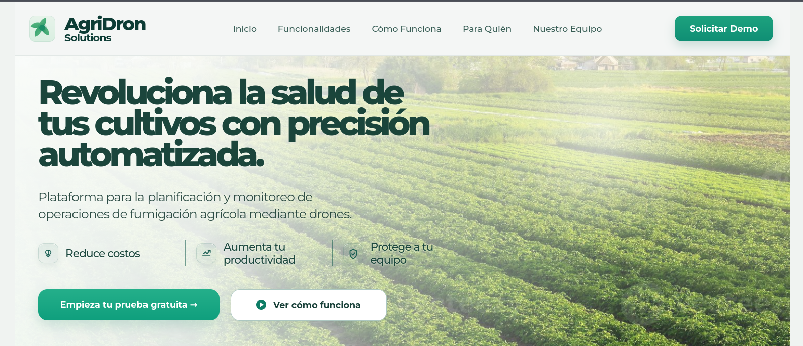
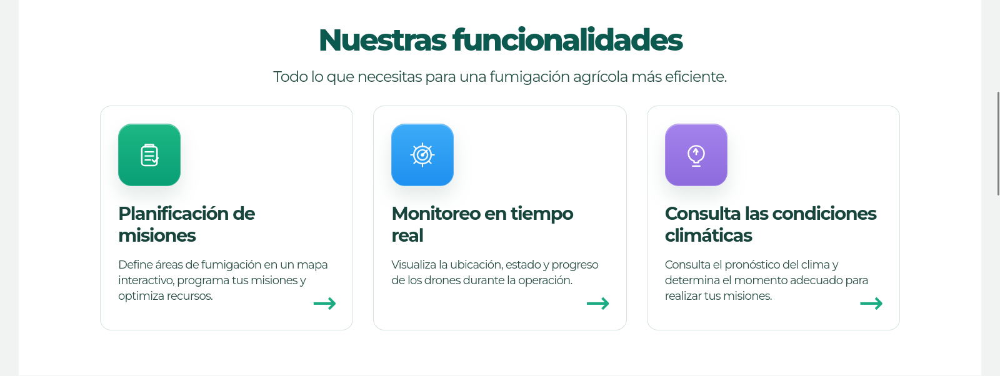
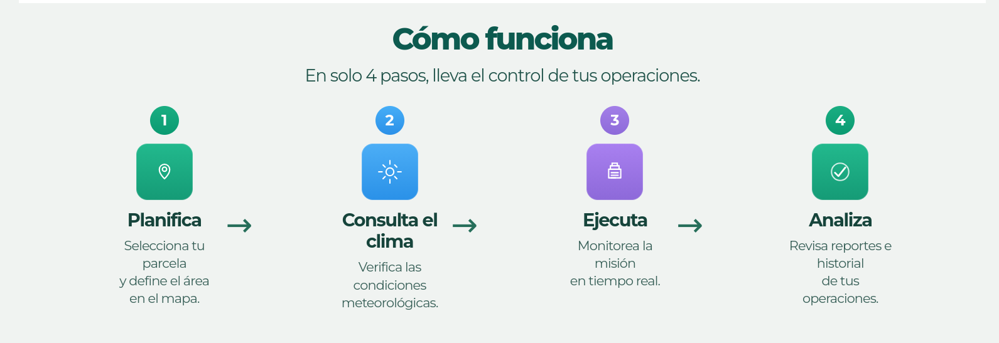
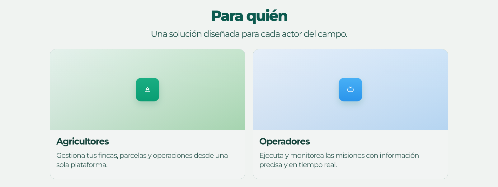
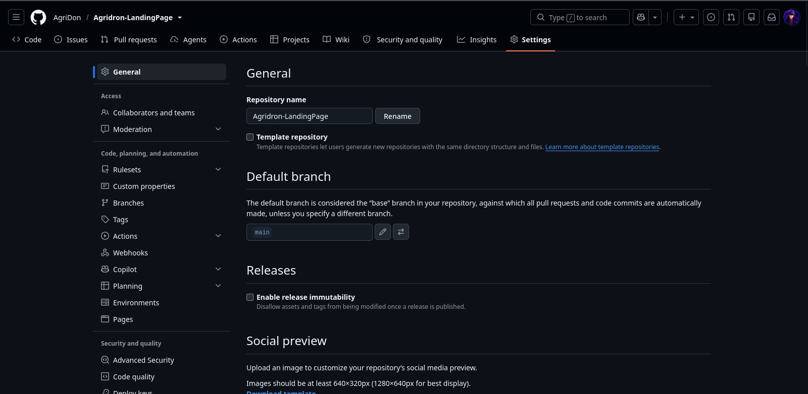
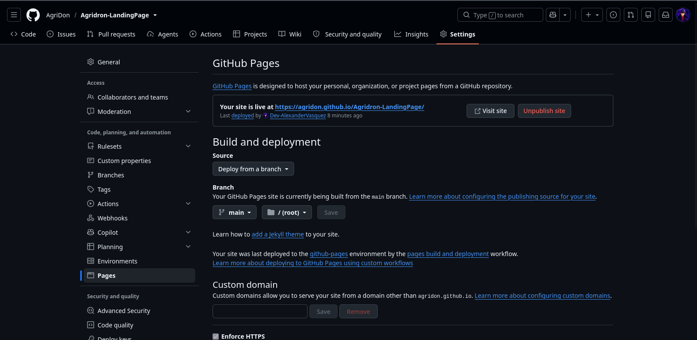
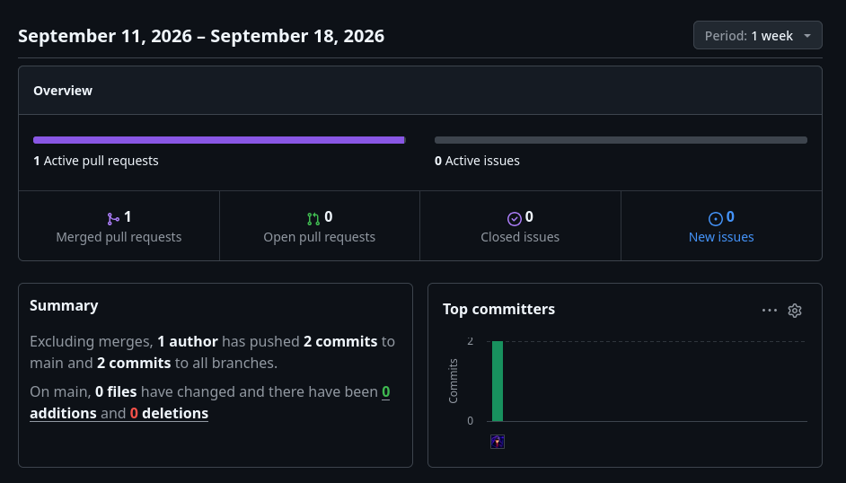

# Capítulo V: Product Implementation, Validation & Deployment

## 5.1. Software Configuration Management

Para tener consistencia y seguimiento del desarrollo de la plataforma, se ha definido una serie de herramientas y estrategias de desarrollo. El método cubre la configuración del entorno de desarrollo, la gestion del código y el despliegue, alineado a las buenas prácticas de ingeniería de software y metodologías ágiles.

### 5.1.1. Software Development Environment Configuration

Con el fin de facilitar la colaboración del equipo en las distintas etapas del ciclo de vida de AgriDron Solutions,
se ha configurado un entorno de desarrollo unificado. Este entorno incluye herramientas estandarizadas para gestión
de proyectos, diseño UX/UI, modelado de dominio, codificación, pruebas de API, documentación y control de versiones.
La selección responde a criterios de integración con tecnologías open-source (Vue 3 + C# .NET 10), soporte para datos
geoespaciales/climáticos y cumplimiento de estándares de la industria.

| Categoría                   | Herramienta                     | Propósito                                                                                              | Tipo de acceso / Enlace                                                             |
|:----------------------------|:--------------------------------|:-------------------------------------------------------------------------------------------------------|:------------------------------------------------------------------------------------|
| **Project Management**      | Trello                          | Gestión del backlog, trazabilidad de Historias de Usuario, tareas y sprints del equipo bajo Scrum.     | [Trello ](https://trello.com/es/home)                                               |
| **Requirements Management** | UXPressia                       | Elaboración de User Personas, Journey Maps, Impact Mapping y artefactos de needfinding.                | [UXPressia ](https://UXPressia.com/es/home)                                         |
| **Product UX/UI Design**    | Figma                           | Diseños de wireframes, wireflows, mockups de alta fidelidad y prototipado interactivo del sistema web. | [Figma ](https://figma.com/es/home)                                                 |
| **Modelado de Software**    | Structurizr / Miro              | Diagramación de arquitectura (C4 Model, EventStorming, Ubiquitous Language y Bounded Contexts).        | [Structurizr ](https://structurizr.com/es/home) / [Miro ](https://miro.com/es/home) |
| **Frontend Development**    | Web Storm                       | Desarrollo de la Landing Page y la Web Application en Vue.js 3 (HTML5, CSS3, JavaScript/TypeScript).   | [VS Code ](https://code.visualstudio.com/es/home)                                   |
| **Backend Development**     | JetBrains Rider / Visual Studio | Desarrollo de la Web API RESTful en C# (.NET 10) siguiendo Domain-Driven Design (DDD).                 | [JetBrains Rider ](https://jetbrains.com/es/home)                                   |
| **API Testing**             | Postman                         | Pruebas funcionales, validación de endpoints RESTful e integración de servicios de clima y mapas.      | [Postman ](https://postman.com/es/home)                                             |
| **Version Control**         | GitHub                          | Alojar y gestionar repositorios de código fuente mediante GitFlow y llamadas de CI/CD.                 | [GitHub ](https://github.com/es/home)                                               |
| **Software Documentation**  | Markdown                        | Redacción técnica de la documentación del proyecto bajo el enfoque Docs-as-Code.                       | Compatible con GitHub / VS Code                                                     |

### 5.1.2. Source Code Management

#### 5.1.2.1. Plataforma y repositorios

El control de versiones del proyecto se realiza centralizadamente en GitHub.
La estructura de repositorios cubre los tres componentes principales del sistema:

<div align="center">

| Producto Digital          | URL del Repositorio                            |
|---------------------------|------------------------------------------------|
| Landing Page              | https://github.com/AgriDon/Agridron-LandingPage| 
| Frontend Web Application  | https://github.com/AgriDon/Agridron-Fronted    | 
| Web Services (Backend API)| https://github.com/AgriDon/Agridron-backend    |

</div>

**Modelo de Ramificación (GitFlow Workflow)**

Se adopta la estrategia GitFlow para mantener una separación estricta entre el código de desarrollo, las entregas parciales y las versiones estables en producción:

- main: Contiene exclusivamente el código probado y estable en producción.
- develop: Rama principal de integración para el trabajo en progreso.
- feature/*: Ramas destinadas a nuevas características o historias de usuario.
  - Convención: feature/US<numero>-<nombre-descriptivo>
  - Ejemplo: feature/US002-farm-polygon-drawing
- release/*: Estabilización y preparación de liberaciones a producción.
  - Convención: release/X.Y.Z
  - Ejemplo: release/1.0.0
- hotfix/*: Correcciones urgentes aplicadas directamente sobre la rama main.
  - Convención: hotfix/X.Y.Z
  - Ejemplo: hotfix/1.0.1

**Versionado Semántico**

Se adopta la nomenclatura MAJOR.MINOR.PATCH para controlar los lanzamientos:

- **MAJOR:** Cambios incompatibles en las API o reestructuraciones profundas del sistema.
- **MINOR:** Incorporación de nuevas funcionalidades retrocompatibles (ej. módulo de telemetría).
- **PATCH:** Correcciones menores de errores retrocompatibles (ej. ajuste en cálculo de hectáreas).
- **Ejemplos:** v1.0.0 (Lanzamiento inicial AV1), v1.1.0 (Integración Weather API), v1.1.1 (Fix en visor de mapa).

**Convenciones para Commits**

Se impone la estructura estandarizada <type>[optional scope]: <description> para registrar los cambios en el historial Git de manera clara y automatizable:

- **feat:** Nueva funcionalidad para el usuario.
- **fix:** Corrección de un fallo en el sistema.
- **docs:** Modificaciones exclusivamente en la documentación.
- **style:** Formato de código (espaciados, comas) sin alteración de la lógica.
- **refactor:** Cambios de código que no corrigen bugs ni agregan funcionalidades.
- **test:** Incorporación o ajuste de pruebas automatizadas.
- **chore:** Tareas administrativas, de compilación o dependencias.

Ejemplos de commits en el proyecto:

```
feat(parcelas): implement interactive polygon drawing with Leaflet
fix(weather): handle null wind velocity response from Weather API
docs(readme): update API setup instructions for backend developers

```

### 5.1.3. Source Code Style Guide & Conventions

Para velar por la legibilidad, mantenibilidad y calidad técnica del código fuente,
el equipo ha suscrito guías de estilo oficiales. Todos los identificadores, variables,
nombres de métodos y comentarios del código se redactan en inglés.

---

**Backend: C# con .NET 10 Framework**

Para la Web API RESTful construida con .NET 10, se toma como base la Microsoft C# Coding Conventions estructurada bajo Domain-Driven Design (DDD):

- **Estructura de Capas (DDD):**
  - **Domain:** Entidades del negocio agrario, Agregados, Value Objects y Contratos de Repositorios.
  - **Application:** Casos de uso, servicios de aplicación, Handlers de comandos/consultas (CQRS) y DTOs.
  - **Infrastructure:** Implementación de repositorios (Entity Framework Core), persistencia de datos geoespaciales y clientes para llamadas HTTP externas (Weather API).
  - **API:** Controladores RESTful ([ApiController]), Middlewares de manejo de excepciones y Swagger OpenAPI documentation.
- **Nomenclatura:**
  - Clases, Interfaces, Interfaces de Repositorio y Enum en PascalCase: FincaService, IParcelaRepository, MissionStatus.
  - Métodos, parámetros y variables locales en camelCase: calculateTreatedArea(), plotCoordinates, droneId.
  - Constantes en PascalCase o UPPER_SNAKE_CASE.
- **Documentación y Anotaciones:**
  - Uso de XML Documentation Comments (/// <summary>) en todos los métodos y endpoints públicos.
  - Decoración clara de controladores con atributos de enrutamiento y validaciones de Data Annotations ([HttpGet], [HttpPost], [FromBody], [Required]).

**Frontend: Vue.js 3 Framework (JavaScript / HTML5 / CSS3)**

El desarrollo de la aplicación web y la landing page utiliza Vue 3
(Composition API) junto a JavaScript/TypeScript, HTML5 y CSS3, siguiendo la Vue.js
Style Guide oficial y la Airbnb JavaScript Style Guide:

- **Estructura Modular de Componentes:**
  - Arquitectura organizada por módulos del negocio (/fincas, /parcelas, /misiones, /drones).
  - Archivos de un solo componente (Single File Components - .vue) agrupando <template>, <script> y <style scoped>.
- **Nomenclatura:**
  - Archivos de componentes y vistas en kebab-case: farm-management-view.vue, map-polygon-editor.vue.
  - Nombre de componentes registrados dentro del script en PascalCase: FarmManagementView, MapPolygonEditor
  - Variables, funciones y propiedades (props) en camelCase: selectedParcelId, fetchWeatherForecast()
- **HTML & Accesibilidad:**
  - Uso estricto de elementos semánticos de HTML5 (<main>, <header>, <section>, <article>, <nav>).
  - Inclusión de atributos alt en imágenes y etiquetas aria-* para accesibilidad web.
- **CSS & Metodología BEM (Block Element Modifier):**
  - Clases escritas en kebab-case con nomenclatura BEM para evitar colisión de estilos:
    - Bloque: .mission-card
    - Elemento: .mission-card__status-badge
    - Modificador: .mission-card__status-badge--in-progress
  - Uso de estilos encapsulados mediante <style scoped> dentro de cada componente Vue.

Estas guías aseguran que el código sea limpio, mantenible y fácil de entender para todos los miembros del equipo.

### 5.1.4. Software Deployment Configuration

La configuración de despliegue del sistema AgriDron Solutions establece los procesos, herramientas y entornos
necesarios para la publicación continua y automatizada de sus tres productos digitales: Landing Page,
Web Services (Backend API) y Frontend Web Application. Este esquema garantiza la replicabilidad, disponibilidad
y trazabilidad en el ciclo de vida del software en producción.

---

**Despliegue de la Landing Page**

- Tecnología: HTML5, CSS3, JavaScript (Vanilla), diseño web responsivo optimizado para conversión.
- Repositorio GitHub: https://github.com/AgriDon/Agridron-LandingPage
- Plataforma de Despliegue: GitHub Pages.
- Método de Despliegue:
  - La rama main actúa como la fuente oficial de producción para la página de presentación del servicio.
  - Se configura la publicación automática tomando como origen el directorio raíz (/) de la rama main.
  - Las nuevas iteraciones y cambios aprobados en develop se integran a main mediante Pull Requests revisados por el equipo.
  - GitHub Pages compila y actualiza el sitio web de forma inmediata tras cada integración detectada en la rama principal.

**Despliegue del Backend (Web Services API)**

- Tecnología: C# con .NET 10 Framework (Web API RESTful).
- Repositorio GitHub: https://github.com/AgriDon/Agridron-backend
- Plataforma de Despliegue: Render
- Método de Despliegue:
  - La Web API se empaqueta mediante la compilación nativa de .NET 10 o el uso de un archivo ejecutable optimizado.
  - Se configura un pipeline de integración y despliegue continuo (CI/CD) desde GitHub para sincronizar los cambios de la rama main.
  - Las variables de entorno sensibles (cadenas de conexión a la base de datos, llaves secretas JWT y credenciales de la Weather API) se gestionan de forma segura en el panel de configuración de Render.
  - El servicio expone una URL pública asegurada con HTTPS y directivas CORS para el consumo exclusivo de la aplicación web de AgriDron.

**Despliegue del Frontend Web Application**

- Tecnología: Vue.js 3 (Composition API, JavaScript/TypeScript, HTML5, CSS3).
- Repositorio GitHub: https://github.com/AgriDon/Agridron-LandingPage
- Plataforma de Despliegue: Firebase Hosting.
- Método de Despliegue:
  - El proyecto en Vue 3 se compila ejecutando el comando npm run build, generando los activos estáticos minimizados en la carpeta /dist.
  - La rama main sirve como fuente central para el entorno de producción.
  - Se sincroniza la CLI de Firebase mediante un flujo de trabajo en GitHub Actions para automatizar la publicación tras cada confirmación en main.
  - Se configuran las variables de entorno del cliente (como la URL base del Backend y tokens de mapas satelitales) directamente dentro del entorno de compilación de Firebase.

**Consideraciones Finales y Estrategia CI/CD**

- Separación de Entornos: Los entornos de desarrollo (Development), pruebas (Staging) y producción (Production) se mantienen aislados mediante archivos de configuración parametrizados (appsettings.Development.json / appsettings.Production.json en el Backend y archivos .env en el Frontend).
- Documentación Docs-as-Code: El procedimiento paso a paso para la configuración y despliegue se documenta en la Wiki del repositorio principal en GitHub.
- Pruebas de Humo (Smoke Testing): Posterior a cada despliegue, se realizan pruebas de verificación manuales y automatizadas sobre endpoints clave (disponibilidad de la API /health, renderizado de parcelas en el mapa y emisión de actas de servicio).
- Automatización Continua: Se evalúa la integración completa de GitHub Actions para gestionar la ejecución de pruebas unitarias previo a cada merge hacia la rama main

## 5.2. Landing Page, Services & Applications Implementation

### 5.2.1. Sprint 1

#### 5.2.1.1. Sprint Planning 1

En el Sprint 1, el equipo se enfocó en el diseño, desarrollo e implementación de la Landing Page de AgriDron Solutions. Este producto digital constituye el principal punto de contacto e interacción para dar a conocer la propuesta de valor del servicio de fumigación con drones a pequeños y medianos agricultores (PyMAs) y operadores técnicos. El objetivo principal fue estructurar secciones informativas, claras y atractivas que transmitan confianza, muestren los planes disponibles y capten registros de clientes potenciales.

| Campo                              | Detalle                                                                                                                                                                                                                                                                                                                                                                                                        |
|:-----------------------------------|:---------------------------------------------------------------------------------------------------------------------------------------------------------------------------------------------------------------------------------------------------------------------------------------------------------------------------------------------------------------------------------------------------------------|
| **Sprint #**                       | Sprint 1                                                                                                                                                                                                                                                                                                                                                                                                       |
| **Fecha**                          | 01/09/2026 – 15/09/2026                                                                                                                                                                                                                                                                                                                                                                                        |
| **Hora**                           | 16:00 hrs                                                                                                                                                                                                                                                                                                                                                                                                      |
| **Lugar**                          | Virtual (Discord / Microsoft Teams)                                                                                                                                                                                                                                                                                                                                                                            |
| **Preparado por**                  | Damacen Galindo, Italo Gianfranco; Vasquez Roncal, Alexander Felipe                                                                                                                                                                                                                                                                                                                                            | 
| **Asistentes**                     | Damacen Galindo, Italo Gianfranco; Nicho Huillcañahui, Edwin Noe; Vasquez Roncal, Alexander Felipe;choquehuanca vasquez, alejandro samir; Jara Espinoza, Miguel Angel                                                                                                                                                                                                                                          |
| **Sprint 0 Review Summary**        | No aplica por ser el primer sprint.                                                                                                                                                                                                                                                                                                                                                                            |
| **Sprint 0 Retrospective Summary** | No aplica por ser el primer sprint.                                                                                                                                                                                                                                                                                                                                                                            |
| **Sprint 1 Goal**                  | Desarrollar y desplegar la Landing Page de AgriDron Solutions en un entorno accesible, responsivo y de alto rendimiento, presentando la propuesta de valor de la pulverización agrícola con drones, planes comercializables y un formulario de captura de leads tanto para agricultores como para operadores técnicos. Se considerará cumplido al estar desplegada en producción y funcional vía GitHub Pages. |
| **Sprint 1 Velocity**              | Límite de 35 SP \| Sumatoria de Story Points: 30 SP                                                                                                                                                                                                                                                                                                                                                            |

#### 5.2.1.2. Aspect Leaders and Collaborators

Para asegurar la calidad y distribución equitativa de las responsabilidades durante el desarrollo de la Landing Page,
se definieron roles de liderazgo (L) y colaboración (C) para cada aspecto técnico del proyecto entre los integrantes del equipo:

| Team Member                               | GitHub Username   | Structure HTML | Design UI & Responsive | Scripts and UX | SEO and Accessibility | Content and Assets |
|:------------------------------------------|:------------------|:---------------|:-----------------------|:---------------|:----------------------|:-------------------|
| **Damacen Galindo, Italo Gianfranco**     | italodamacen      | L              | C                      | C              | -                     | C                  |
| **Nicho Huillcañahui, Edwin Noe**         | edwinnicho        | C              | L                      | C              | C                     | -                  |
| **Jara Espinoza, Miguel Angel**           | MiguelJara        | C              | C                      | L              | C                     | -                  |
| **choquehuanca vasquez, alejandro samir** | SamirChoquehuanca | C              | C                      | C              | L                     | C                  |
| **Vasquez Roncal, Alexander Felipe**      | alexandervasquez  | C              | C                      | -              | C                     | L                  |

#### 5.2.1.3. Sprint Backlog 1

El Sprint Backlog 1 desglose las Historias de Usuario seleccionadas para la construcción de la
Landing Page de AgriDron Solutions en tareas técnicas cuantificables en horas de trabajo,
asignadas formalmente a los miembros del equipo de desarrollo.

| US Id    | US Title                                                    | Task Id | Task Title                                                                  | Descripción                                                                                                                 | Estimación (Horas) | Asignado A                            | Estado |
|:---------|:------------------------------------------------------------|:--------|:----------------------------------------------------------------------------|:----------------------------------------------------------------------------------------------------------------------------|:-------------------|:--------------------------------------|:-------|
| **US37** | Página de inicio con hero section                           | T01     | Crear estructura HTML de la Hero Section                                    | Maquetar la sección principal (Hero) resaltando la propuesta de pulverización agrícola con drones mediante HTML5 semántico. | 2                  | Jara Espinoza, Miguel Angel           | Done   |
| **US37** | Página de inicio con hero section                           | T02     | Implementar estilos CSS de la Hero Section                                  | Aplicar hojas de estilos CSS3 para definir la línea gráfica agrotech, colores institucionales y tipografía.                 | 2                  | Nicho Huillcañahui, Edwin Noe         | Done   |
| **US37** | Página de inicio con hero section                           | T03     | Implementar CTAs y enlace al formulario de registro                         | Añadir botones interactivos ("Solicitar Servicio" / "Unirme como Operador") que dirijan al registro.                        | 1                  | Jara Espinoza, Miguel Angel           | Done   |
| **US37** | Página de inicio con hero section                           | T04     | Adaptar Hero Section a diseño responsive                                    | Garantizar la correcta visualización de la sección principal en dispositivos móviles y tablets.                             | 2                  | Nicho Huillcañahui, Edwin Noe         | Done   |
| **US38** | Sección de características principales                      | T05     | Crear estructura HTML de la sección de características                      | Construir el layout para presentar la delimitación satelital, mapas de aplicación y actas digitales.                        | 1                  | Vasquez Roncal, Alexander Felipe      | Done   |
| **US38** | Sección de características principales                      | T06     | Agregar iconos y estilos visuales a cada característica                     | Incorporar iconografía agrícola/técnica y estilos CSS para dinamizar las funcionalidades clave.                             | 2                  | Vasquez Roncal, Alexander Felipe      | Done   |
| **US39** | Sección de planes y precios                                 | T07     | Crear estructura HTML de la sección de planes                               | Maquetar la sección de planes de servicio por hectárea y suscripciones operativas.                                          | 1                  | choquehuanca vasquez, alejandro samir | Done   |
| **US39** | Sección de planes y precios                                 | T08     | Implementar estilos de tarjetas de planes y precios                         | Diseñar tarjetas comparativas resaltando beneficios por volumen y tipo de cultivo.                                          | 2                  | choquehuanca vasquez, alejandro samir | Done   |
| **US39** | Sección de planes y precios                                 | T09     | Agregar CTA de selección de plan con redirección al registro                | Vincular cada tarjeta de precio directamente con el flujo de creación de cuenta según el perfil.                            | 1                  | Jara Espinoza, Miguel Angel           | Done   |
| **US40** | Sección de preguntas frecuentes                             | T10     | Crear estructura HTML del acordeón FAQ                                      | Maquetar la estructura base para resolver dudas sobre seguridad de vuelo, clima y costos.                                   | 1                  | Jara Espinoza, Miguel Angel           | Done   |
| **US40** | Sección de preguntas frecuentes                             | T11     | Implementar lógica de expansión y colapso de preguntas                      | Programar la interactividad con JavaScript para desplegar u ocultar respuestas del FAQ.                                     | 2                  | Damacen Galindo, Italo Gianfranco     | Done   |
| **US41** | Navegación y menú principal                                 | T12     | Crear navbar sticky con enlaces de navegación                               | Desarrollar la barra de navegación fija superior con desplazamiento suave hacia cada sección.                               | 2                  | choquehuanca vasquez, alejandro samir | Done   |
| **US41** | Navegación y menú principal                                 | T13     | Implementar menú hamburguesa para dispositivos móviles                      | Programar el menú colapsable lateral optimizado para pantallas táctiles pequeñas.                                           | 2                  | choquehuanca vasquez, alejandro samir | Done   |
| **US42** | Responsividad total y optimización mobile                   | T14     | Definir e implementar breakpoints responsive globales                       | Establecer los media queries en CSS para adaptar la web a resoluciones de smartphone, tablet y desktop.                     | 2                  | Nicho Huillcañahui, Edwin Noe         | Done   |
| **US42** | Responsividad total y optimización mobile                   | T15     | Verificar tamaño mínimo de elementos interactivos                           | Validar que botones y enlaces mantengan una zona táctil mínima de 44px para facilidades de uso en campo.                    | 1                  | Damacen Galindo, Italo Gianfranco     | Done   |
| **US42** | Responsividad total y optimización mobile                   | T16     | Validar que las imágenes no generen scroll horizontal                       | Asegurar mediante CSS que los mapas y gráficos no sobrepasen el ancho de pantalla en móviles.                               | 1                  | Damacen Galindo, Italo Gianfranco     | Done   |
| **US43** | SEO y accesibilidad web                                     | T17     | Configurar meta tags de SEO (título, descripción, keywords)                 | Incorporar metadatos optimizados para la búsqueda de servicios de fumigación agrícola con drones.                           | 1                  | choquehuanca vasquez, alejandro samir | Done   |
| **US43** | SEO y accesibilidad web                                     | T18     | Agregar atributos alt, roles ARIA y estructura semántica HTML5              | Integrar etiquetas de accesibilidad para facilitar la lectura por herramientas de asistencia.                               | 2                  | choquehuanca vasquez, alejandro samir | Done   |
| **US43** | SEO y accesibilidad web                                     | T19     | Verificar navegación por teclado y visibilidad del foco                     | Asegurar la usabilidad de la landing page navegando exclusivamente con la tecla Tab.                                        | 1                  | choquehuanca vasquez, alejandro samir | Done   |
| **US44** | Footer con información adicional                            | T20     | Crear estructura HTML del footer                                            | Maquetar el pie de página con información de contacto, cobertura regional y enlaces legales.                                | 1                  | choquehuanca vasquez, alejandro samir | Done   |
| **US44** | Footer con información adicional                            | T21     | Implementar enlaces a redes sociales y páginas legales                      | Enlazar los accesos a redes oficiales, términos de servicio y políticas de privacidad.                                      | 1                  | choquehuanca vasquez, alejandro samir | Done   |
| **US45** | Visualizar métricas de impacto                              | T22     | Crear sección de métricas e impacto con estadísticas                        | Diseñar el bloque visual con cifras de hectáreas pulverizadas, ahorro de agua y reducción de deriva.                        | 2                  | Vasquez Roncal, Alexander Felipe      | Done   |
| **US46** | Muestra del producto                                        | T23     | Integrar galería de imágenes del producto con texto alternativo             | Mostrar capturas del sistema de mapeo satelital y vuelos en campo con descripciones alt.                                    | 1                  | Damacen Galindo, Italo Gianfranco     | Done   |
| **US46** | Muestra del producto                                        | T24     | Integrar video del producto con fallback de texto alternativo               | Incrustar un video demostrativo de los drones en operación fitosanitaria con texto descriptivo alternativo.                 | 2                  | Damacen Galindo, Italo Gianfranco     | Done   |
| **US47** | Calls to action                                             | T25     | Distribuir CTAs secundarios en secciones clave de la Landing Page           | Ubicar botones estratégicos de "Cotizar Fumigación" a lo largo del recorrido visual del usuario.                            | 1                  | Jara Espinoza, Miguel Angel           | Done   |
| **US48** | Secciones interactivas con contenido expandible             | T26     | Implementar scripts de show/hide para contenido condicional                 | Programar funciones en JavaScript para revelar detalles técnicos de drones y productos compatibles.                         | 1                  | Damacen Galindo, Italo Gianfranco     | Done   |
| **US49** | Sobre el equipo detrás de AgriDron Solutions                | T28     | Crear sección del equipo con video y texto alternativo                      | Maquetar la presentación de los miembros fundadores del proyecto con material multimedia.                                   | 2                  | Vasquez Roncal, Alexander Felipe      | Done   |
| **US50** | Prioridad en mostrar las funcionalidades a los Agricultores | T29     | Ordenar sección de funcionalidades priorizando beneficios para agricultores | Estructurar el contenido visual para destacar primero el ahorro de insumos y el control de plagas en predios.               | 1                  | Jara Espinoza, Miguel Angel           | Done   |
| **US51** | Soporte multiidioma                                         | T30     | Agregar atributos data-i18n a los elementos HTML de la landing page         | Identificar y etiquetar los elementos de texto con data-i18n para permitir la localización (ES/EN).                         | 1                  | Damacen Galindo, Italo Gianfranco     | Done   |
| **US51** | Soporte multiidioma                                         | T31     | Implementar selector de idiomas y lógica de cambio                          | Crear los botones de cambio de idioma en el header y la función updateLanguage() para conmutar textos.                      | 1                  | Nicho Huillcañahui, Edwin Noe         | Done   |

#### 5.2.1.4. Development Evidence for Sprint Review

A continuación se presenta el registro de commits y modificaciones realizadas en la rama de
desarrollo y producción del repositorio de la Landing Page durante el transcurso del Sprint 1,
evidenciando la progresión técnica del producto:

| Repository                 | Branch  | Commit Id | Commit Message                                                | Commit Message Body                                                                                      | Commited on (Date)     |
|:---------------------------|:--------|:----------|:--------------------------------------------------------------|:---------------------------------------------------------------------------------------------------------|:-----------------------|
| **AgriDron-LandingPage**   | develop | 1eca1eb   | feat: css hero section and CTA.                               | Implementación de la maquetación base y llamados a la acción de la sección principal.                    | 04 de Septiembre, 2026 |
| **AgriDron-LandingPage**   | develop | e7cfb4d   | fix: Readme with wrong text.                                  | Corrección de textos informativos y descripción general de AgriDron Solutions.                           | 04 de Septiembre, 2026 |
| **AgriDron-LandingPage**   | develop | 0a4749c   | feat: responsive for hero sections.                           | Adaptación de la Hero Section para vistas en smartphones y tablets.                                      | 04 de Septiembre, 2026 |
| **AgriDron-LandingPage**   | develop | 6f65577   | feat: add features section and update HTML structure.         | Inclusión de la sección de características del servicio de fumigación con drones y nuevos iconos SVG.    | 04 de Septiembre, 2026 |
| **AgriDron-LandingPage**   | main    | 0a1e1cc   | feat(landing-page): add css and html for hero section.        | Fusión de la Hero Section validada hacia la rama principal de producción.                                | 05 de Septiembre, 2026 |
| **AgriDron-LandingPage**   | main    | d9651aa   | feat(landing-page): add css and html for features section.    | Integración de la sección de características en la rama main.                                            | 05 de Septiembre, 2026 |
| **AgriDron-LandingPage**   | develop | 62ce603   | feat(landing-page): add text information for plans.           | Incorporación de la información de paquetes de hectáreas y suscripciones operativas.                     | 06 de Septiembre, 2026 |
| **AgriDron-LandingPage**   | develop | 8967aeb   | feat: add styles on plans.                                    | Estilización de tarjetas de precios y resaltado del plan más solicitado.                                 | 07 de Septiembre, 2026 |
| **AgriDron-LandingPage**   | develop | 85fecd0   | docs(readme): fix README.md                                   | Actualización de instrucciones de instalación y guía de despliegue.                                      | 08 de Septiembre, 2026 |
| **AgriDron-LandingPage**   | develop | 5bcaa5e   | Merge remote-tracking branch 'origin/develop' into develop.   | Sincronización de cambios remotos en la rama de integración.                                             | 08 de Septiembre, 2026 |
| **AgriDron-LandingPage**   | develop | 5ba9214   | feat: add FAQ section.                                        | Creación del acordeón dinámico para preguntas frecuentes sobre condiciones climáticas y vuelos.          | 09 de Septiembre, 2026 |
| **AgriDron-LandingPage**   | develop | 16d8090   | Merge branch 'develop' of AgriDron-LandingPage into develop.  | Resolución de conflictos menores e integración de nuevas tareas del equipo.                              | 10 de Septiembre, 2026 |
| **AgriDron-LandingPage**   | develop | ae2af7a   | feat: add header.                                             | Implementación de la barra de navegación superior fija con menú desplegable responsive.                  | 11 de Septiembre, 2026 |
| **AgriDron-LandingPage**   | develop | 4b8c9d1   | feat: add team, gallery and impact metrics.                   | Adición de las secciones sobre el equipo fundador, galería de drones en operación y métricas de impacto. | 12 de Septiembre, 2026 |
| **AgriDron-LandingPage**   | develop | 68c9d1d   | feat: add footer.                                             | Maquetación del pie de página con accesos a redes, áreas de cobertura regional y páginas legales.        | 13 de Septiembre, 2026 |
| **AgriDron-LandingPage**   | develop | 25283da   | feat: add i18n and fixes to the footer.                       | Integración del selector multiidioma (ES/EN) y ajustes finales en los enlaces del footer.                | 14 de Septiembre, 2026 |
| **AgriDron-LandingPage**   | develop | 3452838   | Merge branch 'develop' of AgriDron-LandingPage into develop.  | Integración final del código funcional del Sprint 1 para publicación automatizada en GitHub Pages.       | 14 de Septiembre, 2026 |

Esta sería la captura antes de empezar el sprint con las task creadas en Trello y listas para asignarse a los miembros respectivos:


#### 5.2.1.5. Execution Evidence for Sprint Review

Se presentarán las capturas que muestran el despliegue de la Landing Page en GitHub Pages.
La interfaz es responsiva, asegurando accesibilidad para diversos perfiles de usuario.



*Figura: Hero Section de la Landing Page con propuesta de valor clara.*



*Figura: Feature Section de la Landing Page con información sobre las características principales.*



*Figura: How It Works de la Landing Page con información sobre el proceso de uso.*



*Figura: For Whom de la Landing Page con información sobre el público objetivo.*


*Figura: Team Members de la Landing Page con información sobre el equipo de trabajo.*


*Figura: Footer de la Landing Page con información de contacto y redes sociales.*

**Aquí está el enlace a la página desplegada:** https://agridon.github.io/Agridron-LandingPage/

**Enlace del video de ejecucion en youtube:**

#### 5.2.1.6. Services Documentation Evidence for Sprint Review

Como la Landing Page es una página estática, no fue necesario durante el Sprint el uso de
servicios externos ni conexiones a API's, por lo cual no hay generación ni evidencia de documentación técnica relacionada.

#### 5.2.1.7. Software Deployment Evidence for Sprint Review

La evidencia del despliegue de la Landing Page durante el Sprint se mostrará a continuación, el despliegue se realizará en GitHub Pages.



*Nos dirigimos a la seccion de deploy, y selecionamos la rama main:*
*Luego de unos minutos, el deploy se realizara correctamente:*



#### 5.2.1.8. Team Collaboration Insights during Sprint

Se anexa evidencia de la participación activa del equipo en el desarrollo de la Landing Page.
Durante el Sprint 1, el equipo utilizó una metodología colaborativa mediante Pull Requests y
revisiones de código, asegurando que cada sección cumpliera con los estándares de calidad definidos.
El gráfico de contribuciones muestra una distribución equitativa de tareas entre maquetación, estilos, lógica de i18n y despliegue.



*Reporte de contribuciones y commits del equipo Agridron en el repositorio de la Landing Page*

# Conclusiones

El proceso de desarrollo de AgriDron Solutions en esta primera entrega (AV1)
logró validar las hipótesis iniciales de adopción y comunicación mediante el
despliegue de una Landing Page pública y responsiva que conecta a Pequeños y
Medianos Agricultores (PyMAs) con Operadores Técnicos de drones de fumigación.

La plataforma responde directamente a las necesidades identificadas en las
entrevistas de validación y needfinding, donde el 100% de los agricultores
carecía de herramientas digitales para solicitar servicios de fumigación con
parámetros técnicos y el 100% de los operadores coordinaba sus jornadas de
vuelo mediante canales informales como WhatsApp o llamadas telefónicas.
Como resultado, AgriDron Solutions centraliza la captación de clientes y
la presentación de la propuesta de valor agrotech, reduciendo coordinaciones
informales y mejorando la vinculación entre ambos segmentos desde su primer contacto.

---
